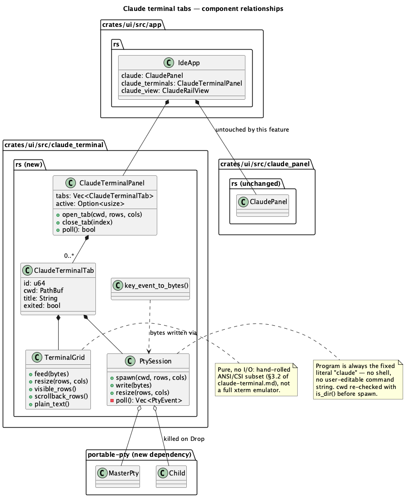
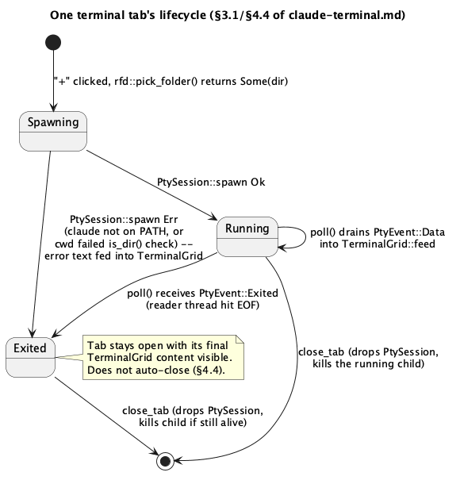

# Claude terminal tabs

## 1. Purpose

The existing Claude panel (`crates/ui/src/claude_panel.rs`) is a one-shot
request/response wrapper: `ClaudePanel::submit` runs `claude -p` once per
prompt, waits for it to exit, and appends the reply to a chat-style
history. That's unaffected by this feature and stays exactly as it is.

What's missing, and what the user asked for directly: a **real,
interactive** `claude` CLI session — the kind you'd get running `claude`
in an actual terminal, with its own prompt, streaming output, and
scrollback — embedded in the IDE, and more than one of them at once, each
rooted in a directory the user picks. This is scoped-down F2 (the planned
general PTY terminal, `docs/roadmap.md` Track F): same underlying
mechanism (`portable-pty`, a hand-rolled ANSI/CSI interpreter), but
running exactly one program (`claude`, interactive mode, no `-p`) instead
of an arbitrary shell. The general shell terminal stays future work under
F2's own doc.

Per the plan this doc implements (`whimsical-mapping-toast.md` Batch C,
already agreed with the user): account/subscription switching is **not**
managed by the IDE. Each tab just inherits whatever shell
environment/`claude` login is active when it's spawned — the same as
opening a real terminal and typing `claude`. No IDE-side credential
handling.

## 1.1 Diagrams





## 2. Interface

New file, `crates/ui/src/claude_terminal.rs`. New dependency:
`portable-pty = "0.9.0"` in `crates/ui/Cargo.toml` (pre-approved in
`CLAUDE.md`'s dependency table for phase F2).

### 2.1 Terminal grid (pure, no I/O)

```rust
pub const TERMINAL_SCROLLBACK_LIMIT: usize = 2000;

#[derive(Debug, Clone, Copy, PartialEq, Eq, Default)]
pub enum AnsiColor {
    #[default]
    Default,
    Black, Red, Green, Yellow, Blue, Magenta, Cyan, White,
    BrightBlack, BrightRed, BrightGreen, BrightYellow,
    BrightBlue, BrightMagenta, BrightCyan, BrightWhite,
}

#[derive(Debug, Clone, Copy, PartialEq, Eq)]
pub struct Cell {
    pub ch: char,
    pub fg: AnsiColor,
    pub bg: AnsiColor,
    pub bold: bool,
}

pub struct TerminalGrid { /* rows x cols viewport + scrollback + cursor + parser state */ }

impl TerminalGrid {
    pub fn new(rows: usize, cols: usize) -> Self;

    /// Feeds raw bytes read from the PTY into the parser. Incremental: an
    /// escape sequence or a multi-byte UTF-8 character split across two
    /// calls (two separate PTY reads) completes correctly on the second
    /// call — parser state and a partial-UTF-8 byte buffer both persist
    /// across calls, this is not "re-parse from scratch" per call.
    pub fn feed(&mut self, bytes: &[u8]);

    /// Resizes the visible viewport. Does **not** reflow wrapped lines.
    /// Rows are bottom-anchored (shrinking drops the *oldest* visible
    /// rows first, growing adds blank rows at the top — the same "oldest
    /// falls away first" direction scrollback already ages in, so the
    /// cursor's row is always what survives); columns are left-aligned
    /// (extra width added/truncated on the right). See §4.3.
    pub fn resize(&mut self, rows: usize, cols: usize);

    pub fn rows(&self) -> usize;
    pub fn cols(&self) -> usize;
    /// Cursor position as `(row, col)`, both 0-indexed, both always
    /// in-bounds for the current `rows()`/`cols()`.
    pub fn cursor(&self) -> (usize, usize);
    /// Visible viewport rows, top to bottom, always exactly `rows()` long.
    pub fn visible_rows(&self) -> &[Vec<Cell>];
    /// Scrollback rows, oldest first, capped at `TERMINAL_SCROLLBACK_LIMIT`
    /// (oldest dropped once the cap is hit).
    pub fn scrollback_rows(&self) -> &VecDeque<Vec<Cell>>;
    /// Scrollback + visible viewport, one line per row, trailing blank
    /// cells on each row trimmed, rows newline-joined. For "Copy All"
    /// (§3.4) — colors/attributes are not preserved, this is plain text.
    pub fn plain_text(&self) -> String;
}
```

### 2.2 PTY session (I/O, one per tab)

```rust
pub struct PtySession { /* writer, reader-thread channel, master, child */ }

enum PtyEvent { Data(Vec<u8>), Exited }

impl PtySession {
    /// Spawns `claude` (no arguments — interactive mode) via
    /// `portable_pty::native_pty_system()`, `cwd` as its working
    /// directory, inheriting the host process's environment unmodified.
    /// `rows`/`cols` size the PTY at creation. Fails if `cwd` doesn't
    /// exist/isn't a directory (checked before spawning — see §4.1) or if
    /// `claude` isn't on `PATH`.
    pub fn spawn(cwd: &Path, rows: u16, cols: u16) -> Result<Self, String>;

    /// Writes bytes to the child's stdin (the PTY's controlling side).
    pub fn write(&mut self, bytes: &[u8]) -> std::io::Result<()>;

    /// Notifies the PTY (and therefore the child, via `SIGWINCH` on
    /// Unix) of a new terminal size. Does not touch `TerminalGrid` —
    /// callers resize both together (§4.3).
    pub fn resize(&self, rows: u16, cols: u16);

    /// Drains every event received since the last call, without
    /// blocking. Call once per frame.
    fn poll(&mut self) -> Vec<PtyEvent>;
}

impl Drop for PtySession {
    /// Kills the child process. There's no existing "long-lived
    /// subprocess" cleanup precedent in this crate to follow (the
    /// existing `claude_panel.rs`/`cargo_panel.rs` processes always run
    /// to their own completion) — this is the first panel whose
    /// subprocess must be cut short on tab-close/app-exit, so it gets its
    /// own `Drop`.
    fn drop(&mut self);
}
```

### 2.3 Tab + panel state

```rust
pub struct ClaudeTerminalTab {
    /// Stable across the tab's lifetime, independent of its `Vec` index
    /// (which shifts when an earlier tab closes) — this is what
    /// `egui::Id::new(("claude_terminal_tab", tab.id))` is built from for
    /// `request_focus`/focus-tracking (§3.4), so a closed earlier tab
    /// can't make focus silently jump to a different one.
    pub id: u64,
    pub cwd: PathBuf,
    pub title: String,      // cwd's file_name(), or "claude" if cwd has none (e.g. "/")
    pub exited: bool,       // true once the child has exited; tab stays open (§4.4)
    grid: TerminalGrid,
    /// `None` when `PtySession::spawn` failed — the tab still exists
    /// (`exited: true`, the spawn error fed into `grid` as text) rather
    /// than being silently dropped (§3.1).
    pty: Option<PtySession>,
}

impl ClaudeTerminalTab {
    pub fn grid(&self) -> &TerminalGrid;

    /// Writes bytes to this tab's `PtySession` — the only way to send
    /// input to it from outside this module (`pty` itself is private).
    pub fn write(&mut self, bytes: &[u8]) -> std::io::Result<()>;

    /// Resizes this tab's grid and PTY together (§3.3 always does both
    /// as one operation, never one without the other) — the only way to
    /// resize a tab from outside this module.
    pub fn resize(&mut self, rows: u16, cols: u16);
}

#[derive(Default)]
pub struct ClaudeTerminalPanel {
    tabs: Vec<ClaudeTerminalTab>,
    pub active: Option<usize>,
    next_id: u64,
}

impl ClaudeTerminalPanel {
    /// Spawns a new tab rooted at `cwd`, appends it, and selects it.
    /// `rows`/`cols` come from the caller's current char-grid size
    /// estimate (§3.3) — a reasonable one-frame-stale value is fine, the
    /// panel resizes on the next frame once it knows its real rect.
    /// Always creates and selects a tab, even if `PtySession::spawn`
    /// fails — the failure is shown inline (`exited: true`, the error
    /// text fed into the tab's `grid`) rather than returned as an `Err`,
    /// since nothing about opening a tab is ever an error the caller has
    /// to handle (§3.1).
    pub fn open_tab(&mut self, cwd: PathBuf, rows: u16, cols: u16);

    /// Removes the tab at `index` (dropping its `PtySession`, which kills
    /// the child). Adjusts `active` per §4.4's rules.
    pub fn close_tab(&mut self, index: usize);

    pub fn tabs(&self) -> &[ClaudeTerminalTab];

    /// Polls every tab's `PtySession` and feeds received bytes into that
    /// tab's `TerminalGrid`. Returns `true` if anything changed (caller
    /// should request a repaint) — mirrors `ClaudePanel::poll`/
    /// `CargoPanel`'s existing poll-once-per-frame contract exactly.
    pub fn poll(&mut self) -> bool;

    pub fn active_tab(&self) -> Option<&ClaudeTerminalTab>;
    pub fn active_tab_mut(&mut self) -> Option<&mut ClaudeTerminalTab>;
}
```

### 2.4 Keystroke translation (pure)

```rust
/// Translates one input event into the bytes a real terminal would send
/// for it, or `None` for an event the terminal doesn't forward (anything
/// not text/a navigation or control key — e.g. a bare modifier press).
/// Pure and egui-context-free, same shape as `editor/input.rs`'s
/// `intent_for` — trivially unit-testable without a `Harness`.
pub fn key_event_to_bytes(event: &egui::Event) -> Option<Vec<u8>>;

/// A stable per-tab `egui::Id` for focus-tracking (§3.4), keyed on the
/// tab's `id` field rather than its `Vec` index so focus doesn't jump to
/// a different tab when an earlier one closes.
pub fn terminal_tab_egui_id(tab_id: u64) -> egui::Id;
```

## 3. Behaviour

### 3.1 Tab strip and lifecycle

The Claude rail's tab strip (rendered above the existing chat body) gets:
`Chat` (fixed, first, always present — the existing `ClaudePanel` UI,
untouched), then one label per open terminal tab (`tab.title`, full
`cwd` as its hover tooltip — same shape as the editor tab comment at
`render.rs:429` already documents for its own tabs), each with a small
close button, then a trailing `+`.

Clicking `+` opens `rfd::FileDialog::new().pick_folder()` (blocking,
native dialog — the exact pattern `render_welcome` already uses for Open/
Create Project). `None` (cancelled) is a no-op — no tab is created.
`Some(dir)` calls `ClaudeTerminalPanel::open_tab(dir, rows, cols)`; if
`claude` isn't on `PATH` or `dir` failed the existence check, the new tab
is still created but starts in `exited: true` with the error message fed
into its `TerminalGrid` as plain text (mirrors `ClaudePanel`'s existing
"claude CLI not found on PATH" `ClaudeMessage::Error` — a failed spawn is
shown inline, not silently dropped and not a dialog/panic).

Closing a tab (`close_tab`) drops its `PtySession`, which kills the
child. If the closed tab was active, the newly active tab is the one now
at the same index, or the previous index if that was the last tab, or
`Chat` if no terminal tabs remain — never an out-of-bounds `active`.

### 3.2 ANSI/CSI subset

`TerminalGrid::feed` implements a **bounded, hand-rolled** VT100/ANSI
subset — not a full xterm emulator (no `vte`/`alacritty_terminal`
dependency; `CLAUDE.md`'s dependency table only pre-approves
`portable-pty` for this phase). It supports what `claude`'s interactive
CLI actually needs: printable text, line movement, and 16-color SGR.
Everything else is **recognized and safely discarded**, never
misinterpreted as printable garbage and never a parse error/panic.

**C0 controls:**

| Byte | Effect |
|---|---|
| `\r` (0x0D) | cursor column := 0 |
| `\n` (0x0A) | cursor row += 1; scrolls (oldest visible row → scrollback, new blank bottom row) if already on the last row |
| `\x08` BS | cursor column := `max(0, column - 1)` |
| `\t` HT | cursor column := next multiple of 8, clamped to the last column |
| `\x07` BEL | ignored (no audible bell) |
| any other 0x00–0x1F except ESC | ignored |

**CSI (`ESC [ params final-byte`)**, params are `;`-separated integers
(missing/empty defaults to `1` for cursor moves, per the ANSI convention;
`?`-prefixed private-mode params like `?1049h` are recognized as params
and discarded with the rest of the sequence):

| Final byte | Meaning | Behaviour |
|---|---|---|
| `m` | SGR | see table below |
| `H`/`f` | CUP | cursor := `(row-1, col-1)` clamped to grid bounds |
| `A` | CUU | row -= N, clamped to 0 |
| `B` | CUD | row += N, clamped to last row |
| `C` | CUF | col += N, clamped to last col |
| `D` | CUB | col -= N, clamped to 0 |
| `J` | ED | erase in display: `0`/missing = cursor→end, `1` = start→cursor, `2` = whole viewport (scrollback untouched — matches real terminal `clear`) |
| `K` | EL | same 0/1/2 semantics, restricted to the cursor's row |
| anything else | discarded, no effect |

**SGR (`m`) codes**, applied left to right, one sequence can carry several
`;`-separated codes:

| Code(s) | Effect |
|---|---|
| `0` / empty | reset fg/bg to `Default`, bold off |
| `1` | bold on |
| `22` | bold off |
| `30`–`37` | standard fg (8 colors) |
| `90`–`97` | bright fg |
| `39` | fg := `Default` |
| `40`–`47` | standard bg |
| `100`–`107` | bright bg |
| `49` | bg := `Default` |
| anything else (underline, italic, `38;5;N` 256-color, `38;2;R;G;B` truecolor, …) | ignored — falls back to whatever fg/bg/bold was already set, doesn't error |

**OSC (`ESC ] ... BEL` or `ESC ] ... ESC \`)**: consumed up to its
terminator and discarded (real terminals use this for window-title
setting; irrelevant here).

**Any other `ESC <byte>`** (`ESC =`, `ESC >`, save/restore cursor, etc.):
consumes exactly that one following byte, returns to the ground state,
no effect.

A CSI/OSC sequence split across two `feed()` calls (a PTY read landing
mid-escape-sequence) completes correctly — the parser's state (which
sequence it's mid-way through, and any partial UTF-8 bytes) is a field on
`TerminalGrid`, not call-local.

### 3.3 Rendering

Terminal tab content renders as monospace colored text inside an
`egui::ScrollArea::vertical()`, auto-stuck to the bottom unless the user
has scrolled up (checked the same way the diff viewer / editor scroll
areas already track "was the last frame at the bottom"). Adjacent cells
in a row sharing the same `(fg, bg, bold)` are coalesced into one
`egui::RichText` span rather than one span per character — `egui`'s
layout cost scales with span count, and a `claude` CLI screen redraw can
be a full-viewport rewrite every frame while streaming.

`AnsiColor::Default` fg/bg map to `tokens.color.fg_primary`/`bg_base`
(theme-aware, like everything else in the app). The other 16 map to a
**fixed** xterm-standard RGB palette, defined as constants in
`claude_terminal.rs` — deliberately *not* new `Colors` theme tokens: ANSI
colors are a terminal convention independent of the IDE's theme, the same
way a real terminal's red is red regardless of your desktop theme.

The `ScrollArea` renders `scrollback_rows()` (oldest first) followed by
`visible_rows()` — the full "scrollback + visible viewport" content
`plain_text()` already describes, not just the viewport — so there is
something to scroll into and `stick_to_bottom` has a real effect. The
cell at `TerminalGrid::cursor()`'s position (always within the visible
viewport, never scrollback, per its own doc) renders with fg/bg swapped,
a block-cursor indicator that needs no new color.

Char-cell size (`char_width`/`row_height`) is computed from the
monospace `egui::FontId` the same way `editor/geometry.rs` already
does for the code editor, not hand-measured separately. Whenever the
panel's available rect implies a different `rows`/`cols` than the active
tab's `TerminalGrid` currently has, `ClaudeTerminalTab::resize` is called
(§4.3) — checked once per frame, a cheap integer comparison.

### 3.4 Keyboard input and Copy

While a terminal tab is focused (`ui.memory_mut(|m| m.request_focus(id))`
on click/tab-switch, the same mechanism the rest of the app already uses
for focus), every `egui::Event` for that frame goes through
`key_event_to_bytes` and, if it returns `Some(bytes)`, those bytes are
written to the tab's `PtySession` immediately — this **is** how you type
into it; there's no separate "compose then send" input box like the
`Chat` tab's. Enter → `\r`, Backspace → `\x7f`, Tab → `\t`, Escape →
`\x1b`, arrow keys → `\x1b[A`/`\x1b[B`/`\x1b[C`/`\x1b[D`, plain text →
its UTF-8 bytes as-is.

**Any `Ctrl`+letter maps to its standard C0 control byte** —
`(letter.to_ascii_uppercase() as u8) - b'A' + 1` — the same convention
every real terminal uses, not a hand-picked subset: `Ctrl+C` → `\x03`
(interrupt), `Ctrl+D` → `\x04` (EOF), `Ctrl+L` → `\x0c` (clear), `Ctrl+A`
→ `\x01`/`Ctrl+E` → `\x05` (readline line-start/end), and so on for every
letter. This matters because `claude`'s interactive CLI, like any
readline-backed program, relies on these — hand-picking only `Ctrl+C`
would leave the rest silently dead. Critically, this — not the app's copy
command — is what `Ctrl+C` does while a terminal tab has focus.

This raw event read is the same category of exemption
`crates/ui/src/editor/input.rs`'s `intent_for` already establishes for
the code editor: `CLAUDE.md`'s "no feature code reads keyboard input
directly outside the registry" rule (once B3 lands) is about
**commands** — rebindable, palette-visible actions — not the character-
by-character input every text-entry widget in this app already needs to
function. `handle_shortcuts`' existing `suppress_dispatch` (`render.rs`,
already covers the command palette / Search Everywhere / Go to Line the
same way) gains a fourth condition: a focused terminal tab, so a
background global shortcut can't fire off a keystroke meant for the PTY
— exactly the same shape as the three cases already there, not a new
mechanism.

"Copy" is a button per terminal tab: copies `TerminalGrid::plain_text()`
(scrollback + visible viewport, colors stripped) to the OS clipboard via
`ui.ctx().copy_text(...)`. Drag-to-select a region is out of scope for
this v1 (a materially bigger feature — mouse-drag selection over a
custom-painted cell grid) — "Copy All" covers the common case (grabbing
the whole session's output) without it.

## 4. Constraints and invariants

### 4.1 Security-sensitive (mandatory `hacker` pass)

This is exactly the surface `CLAUDE.md` already flags: *"Any panel that
spawns a PTY or a run configuration … argument-vector construction,
environment and cwd all come from user config; the same surface
`cargo_panel.rs` already is, with an interactive process on the other
end."*

- Program is the fixed literal `"claude"`, resolved via `PATH` the normal
  way `portable_pty::CommandBuilder::new` does — never a shell, never a
  user-editable command string (unlike `lsp_bridge.rs`'s configurable
  language-server command; this stays fixed).
- `cwd` comes only from `rfd::FileDialog::pick_folder()` (a native OS
  directory picker — the user can only select a real, existing directory
  through it), but `PtySession::spawn` still checks `cwd.is_dir()` itself
  before spawning rather than trusting the value handed to it, since the
  directory could be deleted/unmounted between the picker returning and
  the spawn call.
- Environment is inherited unmodified from the host process — never
  stripped, never augmented, never logged. No credential ever passes
  through IDE code; whatever `claude` login is active in the host
  environment is what the spawned session gets, same as a real terminal.
- Every byte the PTY sends back is untrusted-ish rendered data (it's
  `claude`'s own output, not attacker-controlled in the way a network
  peer's bytes would be, but the ANSI parser must still never panic or
  hang on malformed/adversarial escape sequences — §3.2's "anything else:
  discarded" rule is the mechanism, and the `hacker` pass should stress
  it with deliberately malformed sequences).

### 4.2 Resource cleanup

Every `PtySession` has a real OS child process behind it. `Drop for
PtySession` kills it — this must hold for every code path that removes a
tab (`close_tab`) and for app shutdown (`ClaudeTerminalPanel`'s `Vec` of
tabs drops normally when `IdeApp` drops, which drops each `PtySession` in
turn — no separate explicit cleanup call needed *as long as nothing
leaks a `PtySession` out of the `Vec`*, which nothing in this design
does).

### 4.3 Resize does not reflow

`TerminalGrid::resize` does **not** re-wrap long logical lines to the new
width the way a full terminal emulator would — it copies existing content
into the new grid, **bottom-anchored for rows** (a shrink keeps the
*bottom* `new_rows` of the old viewport — the cursor's row and what led
up to it — and drops the old top rows; a grow keeps all existing rows
and adds blank rows at the top) and **left-aligned for columns** (extra
width appended/truncated on the right). Acceptable for v1: panel width/
height changes are infrequent (not a per-frame occurrence), and a
non-reflowed resize is a well-understood, visually obvious tradeoff
(same category as the diff viewer's fixed 5-digit gutter width clipping
past that — a stated, deliberate v1 limitation, not a bug).

Shrinking **drops** the rows/columns that no longer fit — unlike the
scrolling that `\n` at the bottom row does (§3.2), those dropped rows are
*not* pushed into scrollback. Growing back afterward does not recover
them. This is a real, visible loss on shrink-then-grow, accepted for v1
for the same "infrequent, visually obvious" reason above — reflowing (or
scrollback-preserving resize) is what a full terminal emulator would do
instead, and is explicitly out of scope here alongside the rest of
§3.2's bounded ANSI subset.

### 4.4 A tab survives its process exiting

When a `PtySession`'s reader thread hits EOF (the child exited), the tab
sets `exited = true` and keeps its final `TerminalGrid` content visible
— it does **not** auto-close. Auto-closing would silently discard
whatever the user was reading (an error message, `claude`'s final
output) out from under them. The tab strip should visually distinguish
an exited tab (e.g. dimmed title) but that's a rendering detail, not a
public-interface contract this doc pins down further.

### 4.5 Char-boundary safety

PTY bytes arrive as an arbitrary byte stream, not necessarily aligned to
UTF-8 character boundaries at each individual `read()` — `TerminalGrid`
must buffer a trailing incomplete multi-byte sequence across `feed()`
calls (§2.1) rather than lossy-decoding each chunk independently (which
would corrupt any multi-byte character split across a PTY read
boundary).

## 5. Examples

### 5.1 Opening and typing into a tab

```rust
let mut panel = ClaudeTerminalPanel::default();
panel.open_tab(PathBuf::from("/Users/me/project"), 24, 80);
// panel.active == Some(0), panel.tabs()[0].title == "project"

// One frame's worth of polling + rendering:
if panel.poll() {
    ctx.request_repaint();
}
if let Some(tab) = panel.active_tab_mut() {
    // user typed "g" then pressed Enter while the tab had focus:
    tab.write(b"g")?;
    tab.write(b"\r")?;
}
```

### 5.2 ANSI parsing

```rust
let mut grid = TerminalGrid::new(3, 10);
grid.feed(b"\x1b[32mhi\x1b[0m");
// visible_rows()[0][0..2] == [Cell{ch:'h',fg:Green,..}, Cell{ch:'i',fg:Green,..}]
// cursor() == (0, 2), fg reset to Default after the trailing \x1b[0m
```

### 5.3 Split escape sequence across two `feed()` calls

```rust
let mut grid = TerminalGrid::new(3, 10);
grid.feed(b"\x1b[3");   // mid-CSI-params
grid.feed(b"2mhi");     // completes "\x1b[32m", then "hi"
// same result as feeding "\x1b[32mhi" in one call
```

### 5.4 Resize, including the shrink-drops-rows case (§4.3)

```rust
// TerminalGrid alone (pure, no PTY involved):
let mut grid = TerminalGrid::new(3, 10);
grid.feed(b"one\r\ntwo\r\n");   // row0="one", row1="two", row2=blank (cursor here)
                                 // -- only 2 of 3 rows in use, no \n-driven
                                 // scroll has happened yet, so scrollback is
                                 // still empty here.

grid.resize(2, 10);   // shrink: bottom 2 of the 3 old rows survive
                       // ("two", blank) -- row 0 ("one") is dropped, and
                       // NOT scrolled back, since it no longer fits.
assert_eq!(grid.rows(), 2);
assert!(grid.scrollback_rows().is_empty()); // dropped, not preserved

grid.resize(3, 10);   // grow again: a blank row is added at the top;
                       // "one" is gone for good, it was never scrollback.

// A live tab resizes its grid and PTY together via one call:
tab.resize(3, 10);   // ClaudeTerminalTab::resize -- SIGWINCH to the child too
```

### 5.5 Keyboard forwarding and Copy

```rust
// Plain character:
assert_eq!(key_event_to_bytes(&egui::Event::Text("g".into())), Some(b"g".to_vec()));
// Ctrl+D -> EOF byte, not just Ctrl+C (§3.4):
assert_eq!(
    key_event_to_bytes(&egui::Event::Key {
        key: egui::Key::D, physical_key: None, pressed: true,
        repeat: false, modifiers: egui::Modifiers::CTRL,
    }),
    Some(vec![0x04]),
);

// "Copy" button:
let text = tab.grid().plain_text(); // scrollback + visible, ANSI stripped
ui.ctx().copy_text(text);
```

## 6. Dependencies & integration points

- `crates/ui/Cargo.toml`: add `portable-pty = "0.9.0"`.
- `crates/ui/src/app.rs`: new `IdeApp` fields —
  `claude_terminals: ClaudeTerminalPanel` and a small `claude_view: enum
  { Chat, Terminal(usize) }` (or equivalent) tracking which tab is
  selected in the rail's tab strip. Both default-initialized alongside
  the existing `claude: ClaudePanel::default()` field.
- `crates/ui/src/app/render.rs`: `render_claude_panel` gains the tab strip
  (§3.1) at its top and branches on `claude_view` to render either the
  existing chat body (unchanged) or the active terminal tab's grid
  (§3.3/§3.4). `handle_shortcuts`' `suppress_dispatch` gains the fourth
  condition from §3.4.
- This satisfies the existing `CLAUDE.md` "any panel that spawns a PTY"
  security-sensitive bullet as-is (that bullet is written generically
  enough to already cover this file by description, without needing a
  named-file edit) — the mandatory `hacker` pass this doc's own §4.1
  calls for is this project's existing rule doing its job, not a new one.
- Single role: `rust-ui-dev`. No `ide-core`/`ide-lsp` changes.

## Revision notes

First `rev` pass (`changes_needed`) found: (1) §5.1's example accessed
`tab.pty` directly, but `pty` is a private field — fixed by adding public
`ClaudeTerminalTab::write`/`grid()` methods and using them in the
example (the missing `grid()` accessor was also a latent gap — nothing
previously exposed a way for `render.rs` to read a tab's content for
painting at all); (2) §3.4 only special-cased `Ctrl+C`, leaving every
other `Ctrl`+letter (`Ctrl+D`, `Ctrl+L`, etc. — standard bindings an
interactive CLI relies on) silently dead — generalized to the standard
C0-control-byte rule for any `Ctrl`+letter; (3) §4.3 didn't say whether a
height-shrinking resize discards or scrolls-back the dropped rows —
stated explicitly (dropped, not preserved); (4) `ClaudeTerminalTab.id`'s
purpose was never connected to its actual use (a stable `egui::Id` basis
for focus-tracking) — one clarifying sentence added; (5) several public
entry-points (`resize`, `scrollback_rows`, `plain_text`,
`key_event_to_bytes`, `close_tab`/`tabs()`) had no example — added §5.4/
§5.5 covering `resize` (including the shrink-drop case) and keyboard
forwarding/Copy.

Caught during implementation, after the rest of the feature was already
built: (1) §2.3's `open_tab` still showed `-> Result<(), String>` and
`ClaudeTerminalTab.pty: PtySession` from before §3.1's "always creates a
tab, a failed spawn shows inline" behavior was finalized — the actual
implementation never had a fallible `open_tab` (there was never a caller
that needed to handle an `Err`) and `pty` has to be `Option<PtySession>`
to represent "spawned tab, no live process" at all. Fixed by updating the
interface block and §5.1's example to match the real, already-correct
implementation, and adding `key_event_to_bytes`'s missing `pub` and the
undocumented-but-real `terminal_tab_egui_id` free function to §2.4. (2)
§3.3 described rendering "inside an `egui::ScrollArea::vertical()`,
auto-stuck to the bottom unless the user has scrolled up" without saying
*what* renders there — the first implementation only fed `visible_rows()`
into it, which is always sized to exactly fill the panel
(`claude_terminal_char_grid` derives `rows`/`cols` from `available_size()`),
so there was nothing to scroll into and the stick-to-bottom behavior was
inert; `scrollback_rows()` was consequently never called outside the
module's own tests, a real dead-code bug, not just a lint nit. Fixed by
rendering `scrollback_rows()` before `visible_rows()` (the same
"scrollback + visible viewport" content `plain_text()` already
describes) and, since a block cursor is standard terminal UX and
`TerminalGrid::cursor()` was equally unused outside tests, added a
minimal fg/bg-swap cursor indicator at the cursor's cell — §3.3 now
describes both.

Caught during implementation, before any code was written: §2.1/§4.3's
original "top-left-aligned" resize description directly contradicted
§5.4's own worked example (a literal top-left-aligned copy keeps the
*oldest* rows and drops the newest on shrink; the example's comment
claimed the opposite). Traced through the example by hand, found the
self-contradiction, and fixed the semantic itself (not just the prose)
to bottom-anchored rows / left-aligned columns — the more sensible
behavior anyway (shrinking drops old scrollback-bound content first, the
same aging direction scrollback already uses, keeping the cursor's row
always visible) — and rewrote §5.4's example with a grid/byte sequence
that actually exercises and proves it.

## Fix notes (post-approval `hacker` pass)

`docs/security-findings/rust-ui-dev-claude-terminal-2026-08-25.md` found
one Medium and one informational issue after `rev` approved the
implementation:

1. `[DoS, Medium]` `ClaudeTerminalPanel::poll()` (which drains each PTY's
   reader-thread channel) was only called from `render_claude_panel`,
   itself gated on the Claude rail being open — a terminal tab's PTY kept
   producing output into an uncapped channel for as long as the panel
   stayed collapsed, live-measured at ~119 MB/s undrained against a
   synthetic flood. Fixed by moving the `poll()` call out of
   `render_claude_panel` into `IdeApp::ui`'s unconditional per-frame
   section, alongside `self.lsp.poll()`/`self.cargo.poll()`/etc. — the
   same established pattern every other polled subsystem in this app
   already uses, not a new mechanism.
2. `[DoS, informational]` `TerminalGrid::new`/`resize` had no upper bound
   on `rows`/`cols` (only `.max(1)`); at `claude_terminal_char_grid`'s own
   `u16::MAX` cast-overflow-guard ceiling, the viewport allocation would
   be tens of gigabytes. Not practically reachable through real window/
   font metrics, but free to close off — added `MAX_GRID_DIMENSION =
   4096` and `.clamp(1, MAX_GRID_DIMENSION)` in both constructors.
