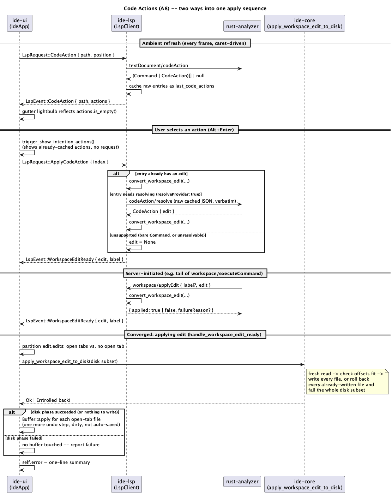

# Code Actions (A8)

## 1. Purpose

Adds `textDocument/codeAction` on top of the already-merged `ide-lsp`
connection, plus the machinery to actually apply what it returns:
`codeAction/resolve` for actions the server computes lazily, and
multi-file `WorkspaceEdit` application — both the client-initiated path
(the user picks an action from a menu) and the server-initiated path
(`workspace/applyEdit`, sent unprompted by the server, most commonly as
the tail end of a `workspace/executeCommand` flow). This is
`docs/roadmap.md`'s explicitly-named "key phase": the whole refactoring
track (**D**: rename, extract, structural refactorings, code generation)
is built entirely on top of `CodeAction`/`WorkspaceEdit`, since that is
how rust-analyzer (and most LSP servers) express every one of those
operations.

- **Show Intention Actions** (`⌥↩`, identical on every platform — one of
  the few JetBrains bindings that doesn't vary by OS) — opens a menu of
  every code action available at the caret.
- **Gutter lightbulb** — a small marker on the caret's line whenever at
  least one code action is available there, refreshed ambiently as the
  caret moves (no keybinding of its own; mirrors
  `inlay-hints-and-hover.md`'s "Symbol highlighting" ambient-refresh
  shape exactly, ⌥↩ is just the explicit trigger for the same
  already-fetched data).
- Selecting an entry applies its edit: to any already-open tab's buffer
  in-memory (one more undo step, same as every other in-editor edit), and
  directly to disk for a file with no open tab — both halves of one
  logical `WorkspaceEdit`, applied together or not at all for the disk
  half (§3.4).

**Explicitly deferred**:

- **`workspace/executeCommand`.** A `CodeAction` (or a bare LSP `Command`
  entry) that carries only a `command` field — an opaque, server-defined
  command id plus arguments, with no `edit`/`data` this client can act
  on — is shown in the menu (so the user can see it exists) but reports
  "not supported yet" instead of a wire round trip when selected. Actually
  *executing* an arbitrary server-defined command generically is a
  meaningfully different, open-ended feature (the command could ask the
  client to do nearly anything) and is out of scope here; most of
  rust-analyzer's actual refactors (extract/inline/import/etc. — the
  ones Track D is waiting on) come back as `edit`-bearing `CodeAction`s,
  resolved or not, not bare commands.
- **Resource operations** (`CreateFile`/`RenameFile`/`DeleteFile` inside
  `WorkspaceEdit.documentChanges`). v1 applies only `TextDocumentEdit`/
  the older `changes` map — pure text edits to files that already exist.
  `docs/roadmap.md`'s own **D3** line ("Move, Safe Delete... по факту
  поддержки сервером") already anticipates file-level operations as a
  *later*, dedicated concern, not this phase's job.
- **`CodeActionKind` filtering/grouping in the request.** v1's
  `textDocument/codeAction` request omits `context.only` — every kind the
  server wants to offer comes back, and the menu shows all of them
  ungrouped (`kind` is displayed as a subtitle, not used to build a
  submenu structure). A future revision can group by kind (`quickfix`
  vs `refactor.*` vs `source.*`) once there's enough real-world action
  volume per file to make an ungrouped list unwieldy.
- **`context.diagnostics`.** Always sent as `[]`, regardless of whether a
  diagnostic sits at the requested range. `ide-lsp` currently flattens
  every `publishDiagnostics` entry down to `ide_lsp::Diagnostic` the
  instant it's received (`client.rs`'s `convert_diagnostic`), discarding
  the raw `lsp_types::Diagnostic`'s `code`/`data`/`codeDescription`
  fields a server might otherwise use to key a fix — reconstructing that
  would mean caching raw, unflattened diagnostics somewhere for later
  reuse, a second representation of the same data this client has
  deliberately avoided everywhere else. rust-analyzer still returns its
  full standard fix/refactor menu for a range computed from its own
  internal diagnostic pass, independent of what the request's
  `context.diagnostics` says — only a narrow slice of servers that
  *require* an explicit `context.diagnostics[].code` match before
  offering a fix would be affected. Flagged as a known limitation, not
  silently assumed harmless.
- **Selection-range-aware requests.** v1 always requests actions for a
  zero-width range at the caret (`{start: pos, end: pos}`), the same
  "positions only" simplification `inlay-hints-and-hover.md`/
  `goto-definition.md`/`find-usages.md` already share — `ide-ui` doesn't
  currently plumb a "current selection" range out to `app.rs` for any
  existing LSP feature to consume. Some servers only offer certain
  refactors (Extract Variable/Function) for a genuinely non-empty
  selection; **D2** (`refactor-this.md`), which explicitly owns
  "Extract Variable/Function/Constant/Field," is the natural place to
  revisit this rather than growing it here.
- **Document-version-checked `documentChanges`.** LSP lets a
  `TextDocumentEdit` name the exact document version it was computed
  against (`OptionalVersionedTextDocumentIdentifier`); v1 reads the
  edit's text content but ignores that version field rather than
  rejecting a mismatch (§4).
- **Synchronous `workspace/applyEdit` confirmation.** The client's
  `applied: true` reply (§3.5) means "validated and handed to `ide-ui`
  for application," not "confirmed written" — see §3.5 for why a
  stronger guarantee would need a new cross-thread round trip for
  marginal benefit.

Does not touch `crates/dap/**` (doesn't exist yet, not needed here).

## 2. Interface / API

### 2.1 `ide-lsp` (additions to the existing public API)

```rust
/// One text replacement inside a `WorkspaceEdit`, LSP-position-addressed
/// (not a buffer byte offset -- `ide-ui` is the layer that knows how to
/// convert a `Position` against a specific buffer's or file's text, the
/// same responsibility it already has for diagnostics/highlights/hints;
/// `ide-lsp` has no dependency on `ide-core` to build an `ide_core::
/// Transaction` here even if it wanted to).
#[derive(Debug, Clone, PartialEq, Eq)]
pub struct TextEdit {
    pub range: Range,
    pub new_text: String,
}

/// Every edit `WorkspaceEdit` makes to one file.
#[derive(Debug, Clone, PartialEq, Eq)]
pub struct FileEdit {
    pub path: PathBuf,
    pub text_edits: Vec<TextEdit>,
}

/// A path-validated (§4), already-flattened set of edits across
/// (possibly) multiple files -- `ide-lsp`'s own simplified wire type for
/// `lsp_types::WorkspaceEdit`, mirroring how `Location`/`InlayHint`
/// already wrap richer `lsp_types` shapes down to what `ide-ui` needs.
/// Resource operations (create/rename/delete) are not represented here at
/// all -- see §1's "Explicitly deferred."
#[derive(Debug, Clone, PartialEq, Eq)]
pub struct WorkspaceEdit {
    pub edits: Vec<FileEdit>,
}

/// One code action offered at a position -- `ide-lsp`'s own flattened
/// summary of an `lsp_types::CodeAction` (or a bare `lsp_types::Command`,
/// folded into the same shape with `edit: None`, `resolvable: false`).
/// The raw server payload (including any opaque `data` a `resolve` call
/// would need) never crosses into this type or into `ide-ui` -- it stays
/// cached inside `ide-lsp`'s own connection state, addressed only by
/// `index` (§3.2).
#[derive(Debug, Clone, PartialEq, Eq)]
pub struct CodeAction {
    /// This action's position in the most recent `CodeAction` response
    /// for whatever request produced it -- the token `ApplyCodeAction`
    /// uses to say "this one" without ever handling raw JSON itself.
    pub index: usize,
    pub title: String,
    /// Raw `CodeActionKind` string (`"quickfix"`, `"refactor.extract"`,
    /// ...) shown as a subtitle -- not parsed into an enum, not used for
    /// grouping (§1).
    pub kind: Option<String>,
    pub is_preferred: bool,
    /// `Some(reason)` when the server's `CodeAction.disabled.reason` is
    /// set -- `ide-ui` renders this entry greyed-out with `reason` as a
    /// tooltip, not selectable.
    pub disabled_reason: Option<String>,
}

pub enum LspRequest {
    // ... existing: DidOpen, DidChange, DidClose, References, Goto,
    //     Hover, DocumentHighlight, InlayHint ...
    /// Query code actions available for the zero-width range
    /// `{start: position, end: position}` in `path`. Own pending-id slot
    /// (`pending_code_action_id`), independent of every other request
    /// kind's slot, same reasoning `Hover`/`DocumentHighlight`/
    /// `InlayHint` already establish (§3.2).
    CodeAction { path: PathBuf, position: Position },
    /// "Apply the action at `index` from the most recent `CodeAction`
    /// response." Resolves it first (`codeAction/resolve`) if it needs
    /// resolving and the server supports that; otherwise applies its
    /// `edit` directly. Either way, ends in exactly one
    /// `LspEvent::WorkspaceEditReady` (§3.3).
    ApplyCodeAction { index: usize },
}

pub enum LspEvent {
    // ... existing: Diagnostics, ServerExited, References, Goto, Hover,
    //     DocumentHighlight, InlayHint ...
    /// The result of the most recently sent, not-yet-superseded
    /// `CodeAction` query, even when empty. Carries `path` for the same
    /// reason `InlayHint`'s event does: `ide-ui` keys the gutter
    /// lightbulb/menu data by which file's caret produced it, not a bare
    /// "answer to the last question" slot, so a response arriving after
    /// the user has switched tabs doesn't light up the wrong file.
    CodeAction {
        path: PathBuf,
        actions: Vec<CodeAction>,
    },
    /// The outcome of applying a `WorkspaceEdit` -- from either
    /// `LspRequest::ApplyCodeAction` (`label` = that action's own
    /// `title`) or an unprompted server `workspace/applyEdit` request
    /// (`label` = that request's own `label` field, if it sent one).
    /// `edit: None` means nothing to apply: resolve failed, the action
    /// had no edit and wasn't resolvable, the request named a stale/
    /// out-of-range `index`, or path validation rejected the edit
    /// entirely (§4) -- `ide-ui` surfaces this as a one-line failure
    /// message, the same channel `in-buffer-find-replace.md` §3.8 uses
    /// for its own non-fatal "couldn't finish" case.
    WorkspaceEditReady {
        edit: Option<WorkspaceEdit>,
        label: Option<String>,
    },
}
```

Everything else in `ide-lsp`'s existing public API is unchanged.

### 2.2 `ide-core` (new module, `workspace_edit.rs`)

```rust
/// One file's worth of a multi-file edit, already expressed as an
/// `ide-core`-native `Transaction` (byte offsets, not LSP `Position`s --
/// `ide-ui` is responsible for that conversion, the same split of
/// responsibility `ide_lsp::position_to_byte_offset` already implies
/// everywhere else; `ide-core` has no dependency on `ide-lsp` and must
/// stay that way).
pub struct FileEdit {
    pub path: PathBuf,
    pub transaction: Transaction,
}

pub struct WorkspaceEdit {
    pub edits: Vec<FileEdit>,
}

#[derive(Debug, thiserror::Error)]
pub enum WorkspaceEditError {
    #[error("could not read {path}: {source}")]
    Read { path: PathBuf, source: io::Error },
    #[error("transaction for {path} does not fit the file's current content")]
    OffsetOutOfRange { path: PathBuf },
    #[error("could not write {path}: {source} (rollback of already-written files: {rollback_errors:?})")]
    Write {
        path: PathBuf,
        source: io::Error,
        /// Every already-written file this attempted to restore after
        /// `path` failed, and whether that restore itself succeeded --
        /// empty means rollback fully succeeded. See §3.4 for why a
        /// rollback can itself fail and why that's still reported rather
        /// than swallowed. (The derived `Display` above always lists this
        /// vec, even when empty -- an implementer preferring a message
        /// that omits the parenthetical when there's nothing to report
        /// should hand-write `Display` instead of deriving it; either is
        /// fine, this doc only specifies the data, not the exact wording.)
        rollback_errors: Vec<(PathBuf, io::Error)>,
    },
}

/// Applies `edit` to files on disk only -- **not** to any already-open
/// buffer; that's `ide-ui`'s job, applied separately via `Buffer::apply`
/// (§3.4 explains why the split is safe). All-or-nothing across every
/// file in `edit.edits`: reads each file fresh immediately before writing
/// it, and if any file's read or write fails, restores every file this
/// call had already successfully written back to its pre-call content
/// before returning the error (§3.4).
pub fn apply_workspace_edit_to_disk(edit: &WorkspaceEdit) -> Result<(), WorkspaceEditError>;
```

`Transaction`/`Change`/`TextBuffer` are otherwise unchanged — this module
is a new consumer of the existing transaction model, not a change to it.

### 2.3 `ide-ui`

```rust
// crates/ui/src/lsp_bridge.rs -- additions to the existing LspBridge
struct LspBridge {
    // ... existing fields ...
    /// Code actions for whatever `(path, position)` was last queried --
    /// replaced wholesale on each `LspEvent::CodeAction`, cleared at
    /// send-time (same convention `document_highlights` already follows).
    code_actions: Vec<CodeAction>,
    /// The `(path, position)` the current `code_actions` answers, so
    /// `ide-ui` knows which line to paint the gutter lightbulb on.
    code_actions_target: Option<(PathBuf, Position)>,
}

impl LspBridge {
    /// Same no-op-if-no-client shape as `request_document_highlight`.
    fn request_code_actions(&mut self, path: &Path, position: Position);
    /// Sends `LspRequest::ApplyCodeAction { index }` -- no-op if no
    /// client is running (there is nothing cached server-side to apply
    /// to in that case either).
    fn apply_code_action(&self, index: usize);
}
```

`IdeApp` (in `app.rs`) gains:

- `show_code_actions_popup: bool` — mirrors `show_hover_popup`.
- `last_code_actions_target: Option<(PathBuf, Position)>` — mirrors
  `last_highlighted_target`; drives `sync_code_actions`'s "did the target
  change" check the same way.
- `sync_code_actions(&mut self)` — called once per frame alongside
  `sync_document_highlights` (§3.2), same `find_usages_target`-driven
  shape: a new target fires `LspBridge::request_code_actions` and updates
  `last_code_actions_target`; no target clears `lsp.code_actions` and
  `last_code_actions_target` (mirrors `clear_document_highlights`'s
  no-target branch — a new `LspBridge::clear_code_actions` does the
  clearing, same reason `clear_document_highlights` exists rather than
  requiring something to send).
- `trigger_show_intention_actions(&mut self)` — `⌥↩`'s entry point.
  Unlike `trigger_quick_documentation`, this does **not** send a new
  request: `sync_code_actions` already keeps `lsp.code_actions`
  reasonably fresh ambiently, so this just sets
  `show_code_actions_popup = true` and opens on whatever's already
  cached (with the same "up to one round trip" latency `document_
  highlights` already has if the caret only just moved this frame).
- `select_code_action(&mut self, index: usize)` — closes the popup,
  calls `LspBridge::apply_code_action(index)`.
- `handle_workspace_edit_ready(&mut self)` — called once per frame
  alongside `handle_goto_response` (§3.3). No-op unless
  `self.lsp.workspace_edit_ready` is set this frame (mirrors `goto_
  ready`'s one-frame-true edge). On `Some(edit)`, applies it (§3.4); sets
  `self.error` to a one-line summary either way (success names the
  action's `label` and file count; failure explains there was nothing
  applicable).

`command.rs` gains one `CommandAction` variant, `ShowIntentionActions`,
registered under `"Navigate"` (joining `QuickDocumentation` et al.),
`binding: Some(Binding::same(KeyChord::new(Key::Enter).alt()))` —
`⌥↩` is identical across every JetBrains keymap variant, so unlike
`QuickDocumentation` this is a genuine `Binding::same`, not a `{mac,
other}` split.

```rust
// crates/ui/src/editor/mod.rs -- additions to the existing CodeEditor
impl<'a> CodeEditor<'a> {
    /// The buffer line to paint the gutter lightbulb on, if any code
    /// action is currently available there -- `None` when `code_actions`
    /// is empty or there's no target line yet. `ide-ui` computes this
    /// from `last_code_actions_target`'s position + whether `lsp.
    /// code_actions` is non-empty; the widget itself does no LSP-aware
    /// reasoning, same division of labour `diagnostics`/`document_
    /// highlights` already keep.
    pub fn code_action_line(mut self, line: Option<usize>) -> Self;
}
```

## 3. Behaviour

### 3.1 Requesting code actions

`textDocument/codeAction`'s params:

```json
{
  "textDocument": { "uri": "..." },
  "range": { "start": {"line": L, "character": C}, "end": {"line": L, "character": C} },
  "context": { "diagnostics": [] }
}
```

`range` is always zero-width at the caret (§1). Result:
`(Command | CodeAction)[] | null`. Each entry converts to `ide_lsp::
CodeAction` as follows, and both raw-server-payload variants — a bare
`Command` (`title`, `command`, optional `arguments`, nothing else) and a
full `CodeAction` object (`title`, `kind?`, `diagnostics?`,
`isPreferred?`, `disabled?`, `edit?`, `command?`, `data?`) — are handled:

- A bare `Command` entry → `kind: None`, `is_preferred: false`,
  `disabled_reason: None`, and internally marked non-resolvable (no
  `edit`, no `data` a `resolve` call could turn into one) — shown in the
  menu, reports "not supported" if selected (§1).
- A `CodeAction` entry → `title`/`kind`/`is_preferred` copied directly;
  `disabled_reason` from `.disabled.reason` if present;
  internally, whether it's immediately applicable (`edit` already
  present) or needs `codeAction/resolve` first (`edit` absent, `data`
  present, and the server declared `codeActionProvider.resolveProvider:
  true` in its `initialize` response — §3.2's capability note) or is
  simply unsupported (`edit` absent, and either no `data` or the server
  never declared `resolveProvider`) is tracked internally, never exposed
  on the public `CodeAction` type.

Every entry — resolvable or not — is still surfaced in `ide_lsp::
CodeAction` so the menu shows the server's full list; only *applying* one
distinguishes the three cases (§3.3).

Null/error result → `actions: vec![]`, same permissive-empty pattern
every prior query kind establishes.

### 3.2 Capability negotiation and the query lifecycle

`send_initialize`'s request still sends `"capabilities": {}` (unchanged —
v1 declares no client capabilities, exactly as before this phase). What's
new: the *response* is no longer ignored past its `error` field.
`ConnectionState` gains `code_action_resolve_provider: bool` (default
`false`), set once, while still `!ready`, by reading
`result.capabilities.codeActionProvider` — `true` (a bare boolean) or
absent → `false`; a `CodeActionOptions` object → its `resolveProvider`
field, defaulting to `false` if absent. This is the client's first time
reading anything out of the `initialize` response at all — every prior
feature simply sent requests unconditionally and handled absence
permissively at the response level. Here that's not enough: whether to
even *attempt* `codeAction/resolve` has to be decided before ever sending
one, since sending it to a server that never declared the capability is
asking it to handle a method it may not implement (matches `crates/dap/
**`'s already-stated capability-negotiation discipline in this project's
`CLAUDE.md` — "a feature the attached adapter doesn't advertise is
reported as unavailable, never assumed present" — applied here to an LSP
server instead of a DAP adapter, same principle). A malformed/missing
`capabilities` object in the response is treated exactly like `false`
(fail closed: never resolve against a server that didn't clearly say it
supports it).

`CodeAction`'s request/response otherwise follows the exact shape every
prior query establishes: `send_request` allocates an id, sets
`pending_code_action_id`, sends; `handle_incoming`'s id-bearing-no-method
dispatch chain grows by one more `.or_else(handle_code_action_response)`
link (six-way now, same "at most one id ever matches, trying all in
sequence is safe" reasoning already given for the five-way chain). A
**new** cached field, `last_code_actions: Vec<RawCodeAction>` (an
internal-only type holding each entry's original, unmodified JSON — never
part of any public `LspEvent`), is replaced wholesale the moment a
`CodeAction` response is parsed, in the same call that builds and emits
the public `LspEvent::CodeAction` summaries — this is what
`LspRequest::ApplyCodeAction { index }` (§3.3) looks `index` up in later.
A `CodeAction` response superseding an older one invalidates any index
into the *previous* cache; `ide-ui` never keeps an index around past the
frame it's read `lsp.code_actions`, so a stale index can only come from a
user click racing a same-frame supersession, handled identically to any
other stale index (§3.3's "index out of range" case).

### 3.3 Applying a selected code action

`LspRequest::ApplyCodeAction { index }`: look up `last_code_actions.get(
index)`.

- **Not found** (stale/out-of-range index) → emit `WorkspaceEditReady {
  edit: None, label: None }` immediately, no wire traffic.
- **Found, has a usable `edit` already** → convert it via
  `convert_workspace_edit` (below) and emit `WorkspaceEditReady { edit,
  label: Some(title) }` immediately, no wire traffic — the common case
  for the many actions servers resolve eagerly.
- **Found, needs resolving** (`resolvable`, per §3.1's tracking) →
  allocate an id, set `pending_resolve_id` (own slot, independent of
  every other pending id — a resolve in flight must not be confused with
  or superseded by an unrelated ambient `CodeAction`/`Hover`/etc. query),
  send `codeAction/resolve` with the cached raw JSON **verbatim** (the
  server's own opaque `data` field travels through unmodified — `ide-lsp`
  never inspects or reinterprets it, exactly the black-box treatment
  `crates/dap/**`'s launch/attach arguments already get per `CLAUDE.md`).
  When the matching response arrives: its `result` is a full `CodeAction`
  object; if it now has an `edit`, convert + emit as above with
  `label: Some(title)`; if it still doesn't, emit `edit: None`.
- **Found, unsupported** (bare `Command`, or a `CodeAction` with neither
  `edit` nor resolve eligibility) → emit `edit: None` immediately.

`convert_workspace_edit(project_root, raw: lsp_types::WorkspaceEdit) ->
Option<ide_lsp::WorkspaceEdit>` is shared by this path, the resolve-
response path above, and `workspace/applyEdit` (§3.5) — one function,
three callers. Reads `documentChanges` if present, else falls back to the
older `changes: {uri: TextEdit[]}` map (only `TextDocumentEdit` entries
inside `documentChanges` are handled — a `CreateFile`/`RenameFile`/
`DeleteFile` resource operation anywhere in the list makes the **whole**
conversion fail, same as a path-validation failure below, per §1's
resource-operations deferral: silently dropping just that one operation
would leave the codebase in a state neither "before" nor "after" the
intended refactor). Every file's URI is converted to a path and run
through `validate_path(project_root, ...)` (the same function `References
`/`Goto`/etc. already use); **if any file in the edit fails validation,
the entire conversion returns `None`** — a deliberate departure from
those queries' "skip the bad entry, keep the rest" permissiveness (§4
explains why: a `WorkspaceEdit` is a set of changes meant to land
together, unlike a list of usages where one omitted entry is just a
smaller — still individually correct — list).

### 3.4 Applying the edit: open tabs vs. disk

`handle_workspace_edit_ready` (§2.3), on `Some(edit)`:

1. Partitions `edit.edits` by whether `self.tabs` currently has an open
   buffer for that path.
2. **Disk subset first.** For each file with no open tab: reads that
   file's *current* text (a fresh read, not anything cached from when the
   action was requested — narrowing, not eliminating, the staleness
   window; §4 states the accepted residual risk explicitly), converts
   each `TextEdit.range` to a byte range via the already-public
   `ide_lsp::position_to_byte_offset`, and builds an `ide_core::
   Transaction`. The resulting `ide_core::WorkspaceEdit` (this subset
   only) goes to `ide_core::apply_workspace_edit_to_disk`, which does its
   *own* fresh read of each file immediately before writing (§2.2) —
   genuinely all-or-nothing for this subset: if file 3 of 5 fails to
   write, files 1–2 are restored to their pre-call content before the
   call returns an error, and **no open-tab buffer is touched at all**
   (step 3 never runs).
3. **Open-tab subset, only once step 2 has fully succeeded** (or there
   was no disk subset to begin with): for each remaining file, convert
   its `TextEdit`s against that tab's *own current* `buffer.text()` the
   same way, and call `Buffer::apply` — one more undo step, marks dirty,
   **not** auto-saved (matches every other in-editor edit's save
   discipline; the user's normal `⌘S`/autosave path applies as usual).

Making the disk phase's success the gate for the buffer phase is what
makes the *whole* `WorkspaceEdit` effectively all-or-nothing without
needing to teach `ide_core::TextBuffer` how to roll back an in-memory
edit that already succeeded: the only phase that can fail (disk I/O) runs
first and completely, so there is never a state where an open buffer was
mutated but a disk write then failed underneath it.

`apply_workspace_edit_to_disk`'s rollback (§2.2): before writing, each
file's transaction is checked against the just-read content's length —
`WorkspaceEditError::OffsetOutOfRange` if any change's range doesn't fit,
treated exactly like a write failure (triggers rollback of whatever this
call already wrote). This is a deliberately *stricter* check than
`TextBuffer::apply`'s own clamping elsewhere in this codebase: clamping a
live typing widget's occasionally-slightly-off offset is the right UX for
an interactive editor, but silently clamping (rather than failing) a
server-computed disk edit would corrupt a file's content with no error
surfaced anywhere — worse than refusing the write.

If a rollback write itself fails (rare — e.g. the disk went read-only
mid-operation), that file's original content is **not** silently assumed
restored: `WorkspaceEditError::Write`'s `rollback_errors` names it, and
`handle_workspace_edit_ready`'s failure message says so explicitly rather
than reporting a clean, misleadingly-simple "failed to apply."

### 3.5 `workspace/applyEdit` (server-initiated)

The first server-to-client *request* this client has ever handled (every
prior server-originated message has been either a response to something
`ide-lsp` sent, or the one-way `textDocument/publishDiagnostics`
notification). `handle_incoming` gains a new branch, checked before the
existing "id present, method absent" dispatch: **id present *and* method
present** is a server-initiated request, not a response — routed here
regardless of which method name it names (v1 only recognizes
`"workspace/applyEdit"`; any other server-initiated request method is
well-formed but out of scope, same "ignored, not fatal" treatment already
given to pre-`initialize` server messages).

Params: `{ "label"?: string, "edit": WorkspaceEdit }`. `edit` runs through
the same `convert_workspace_edit` (§3.3); the resulting `WorkspaceEditReady
{ edit, label }` (`label` from the request's own field, if present) is
emitted to `ide-ui` exactly like the `ApplyCodeAction` path — one shared
handler, two origins. Separately (this part has no `ide-ui` involvement
at all), `ide-lsp` sends the JSON-RPC **response** the server is waiting
for: `{"applied": true}` once conversion succeeds (edit accepted and
handed off — see below for what "applied" means here), or `{"applied":
false, "failureReason": "..."}` if `convert_workspace_edit` returned
`None` (path validation failure, unsupported resource operation).

**`applied: true` means "validated and queued for `ide-ui` to apply,"
not "confirmed written to disk/buffer."** The actual disk-write/buffer-
apply work happens on `ide-ui`'s frame loop, a different thread from the
async client task answering this request; getting a true synchronous
confirmation would need a new reply channel from `ide-ui` back into the
client task purely for this one case, blocking the response until a
future frame — for a guarantee the LSP spec itself doesn't require (the
spec's wording is "the edit was, or will be, applied," not "already
applied by the time this responds"). §1 flags this as accepted, not
overlooked.

## 4. Constraints & invariants

- **Path/position provenance** (mirrors every prior query's §4):
  `sync_code_actions`'s `path`/`position` come only from
  `find_usages_target` — a fifth caller, joining `trigger_quick_
  documentation` (§4 of `inlay-hints-and-hover.md` already covers the
  first four).
- **A `WorkspaceEdit` is validated and applied as one unit, never
  per-entry-permissively.** Every prior LSP-response type in this client
  (`References`, `Goto`, `DocumentHighlight`, `InlayHint`) drops an
  individual bad entry and keeps the rest, because each entry there is an
  independently-meaningful, independently-droppable answer (one usage
  among many). A `WorkspaceEdit`'s entries are not independent — they are
  the pieces of one intended change, and applying some while silently
  dropping others can leave the codebase in a state the refactor never
  intended (a rename that updates the definition but skips a usage in a
  file that failed path validation is *worse* than not renaming at all).
  `convert_workspace_edit` therefore fails the whole edit if any single
  file fails validation, and `apply_workspace_edit_to_disk` fails (and
  rolls back) the whole disk subset if any single file's read/write
  fails.
- **`crates/lsp/**`'s existing path-validation discipline is unchanged,
  just applied to a new shape.** `validate_path(project_root, ...)`
  gates every path a `WorkspaceEdit` names, incoming from the server, the
  same as it already gates every `Location`/`InlayHint`/etc. — a
  malicious or buggy server cannot make this client write outside the
  project root by naming a path there in an edit, applied or resolved.
- **`ide-core` gains no dependency on `ide-lsp`, and `ide-lsp` gains none
  on `ide-core`.** `ide_core::workspace_edit`'s `Transaction`-based
  `FileEdit`/`WorkspaceEdit` and `ide_lsp`'s `Position`-based same-named
  types are deliberately two separate types with the same names in
  different crates — `ide-ui`, the only crate depending on both, is where
  the conversion between them happens (§3.4), exactly mirroring how it
  already converts `ide_lsp::Position`/`Range` into buffer byte offsets
  for diagnostics, document highlights, and inlay hints.
- **No document-version checking on `documentChanges`.** v1 reads a
  `TextDocumentEdit`'s content but ignores `textDocument.version`,
  applying against whatever the target buffer's/file's *current* content
  actually is at apply time (§3.4) rather than verifying it matches what
  the server computed the edit against. In the common case this client's
  full-document-sync discipline (`docs/features/rust-language-support
  .md`) keeps the server's view and the open buffer's view identical
  except for a narrow same-frame race (the user types between request and
  resolved response) — the same class of latency already accepted for
  every other query in this client, not a new risk this phase
  introduces. For a file with **no** open tab, the server's edit was
  computed against whatever it read from disk itself (this client never
  sent a `didOpen`/`didChange` for a file the user never opened), so
  applying against a *fresh* disk read at apply time (§3.4, §2.2) is the
  correct baseline; an external change to that file between the server's
  own read and this client's apply-time read is the residual, accepted
  risk §1 names.
- **Disk-phase-then-buffer-phase ordering (§3.4) is the mechanism that
  makes a `WorkspaceEdit` atomic overall**, not a database-style
  transaction spanning both halves — worth restating as an invariant
  precisely because it's easy to violate accidentally in a future edit to
  this code: buffer application must never run before every disk write in
  the same `WorkspaceEdit` has succeeded.
- **Capability negotiation fails closed** (§3.2): `codeAction/resolve` is
  only ever sent when the server's `initialize` response set
  `codeActionProvider.resolveProvider: true`; a missing, malformed, or
  absent capability is `false`, never assumed `true`.

## 5. Examples

**Opening the menu and applying a resolved action:**

```rust
// Caret sits on a function call with a suggested import fix available.
// Ambient, once per frame:
app.sync_code_actions(); // find_usages_target() differs from last_code_actions_target
// -> LspRequest::CodeAction sent; a frame or so later,
// lsp.code_actions = [CodeAction { index: 0, title: "Import `Foo`", kind:
// Some("quickfix".into()), is_preferred: true, disabled_reason: None }, ...]

// Meanwhile, render_tabs_and_editor's per-frame CodeEditor builder call:
CodeEditor::new(...)
    // ... .diagnostics(...), .document_highlights(...), .inlay_hints(...) ...
    .code_action_line(Some(caret_line)) // lsp.code_actions is non-empty
    .show(ui);
// -> the gutter paints a lightbulb on caret_line, before the user has
// pressed anything.

// User presses ⌥↩:
app.trigger_show_intention_actions();
// show_code_actions_popup = true; menu shows lsp.code_actions as-is, no new request.

// User picks the import fix:
app.select_code_action(0);
// -> LspRequest::ApplyCodeAction { index: 0 }; this entry already carried
// an `edit` in the original response, so ide-lsp converts + emits
// immediately, no resolve round trip:
// LspEvent::WorkspaceEditReady { edit: Some(edit), label: Some("Import `Foo`".into()) }

// Next frame:
app.handle_workspace_edit_ready();
// edit touches only the active (open) tab's file -> disk phase is a
// no-op (nothing in the disk subset) -> buffer phase applies directly:
// Buffer::apply on that tab, one new undo step, tab becomes dirty.
// self.error = Some("Import `Foo`: applied to 1 file".into())
```

**A lazily-resolved, multi-file refactor:**

```rust
app.select_code_action(2); // "Extract to function `helper`"
// last_code_actions[2] has no `edit`, but does have `data`, and the
// server declared resolveProvider: true -> ide-lsp sends
// codeAction/resolve with the cached raw CodeAction JSON verbatim,
// tracked under pending_resolve_id.
// ... response arrives, now carrying `edit` touching two files, one
// open (the active tab) and one not (a sibling module) ...
// ide-lsp converts + emits WorkspaceEditReady { edit: Some(edit), label: Some("Extract to function `helper`") }

app.handle_workspace_edit_ready();
// Disk subset: the sibling module -> apply_workspace_edit_to_disk reads
// it fresh, applies its Transaction, writes it. Succeeds.
// Buffer subset (only now): the active tab's Buffer::apply runs.
// self.error = Some("Extract to function `helper`: applied to 2 files".into())
```

**Server-initiated `workspace/applyEdit`** (e.g. as the tail of a
`workspace/executeCommand` this client itself never had to understand):

```
Server -> client: { "id": 7, "method": "workspace/applyEdit",
                     "params": { "label": "Organize imports", "edit": {...} } }
ide-lsp: convert_workspace_edit(...) succeeds
Client -> server: { "id": 7, "result": { "applied": true } }
ide-lsp -> ide-ui: LspEvent::WorkspaceEditReady { edit: Some(edit), label: Some("Organize imports") }
// handle_workspace_edit_ready applies it exactly as in the examples above.
```

## 6. Dependencies & integration points

- No new external dependencies in any crate. `CodeAction`/`WorkspaceEdit`/
  `codeAction/resolve`/`workspace/applyEdit`'s wire encoding reuses
  `lsp_types::{CodeAction, Command, WorkspaceEdit, TextEdit,
  TextDocumentEdit}` (already a dependency), the same way every prior LSP
  feature has.
- Builds on the already-merged `ide-lsp` connection/event-loop machinery
  and the request/response precedent every prior feature established —
  three genuinely new pieces of machinery, all justified above: reading
  the `initialize` response for a capability flag (§3.2), a server-
  initiated request branch in `handle_incoming` (§3.5), and a new
  `ide-core` module for multi-file disk application with rollback (§2.2).
  No new subprocess, no new spawn path, no new wire framing.
- `ide-core`: new `workspace_edit.rs`, consuming the existing
  `Transaction`/`Change`/`TextBuffer` machinery from `text/`. No changes
  to any existing `ide-core` file's public API.
- `ide-lsp`: extends `types.rs`, `client.rs`; `lib.rs`'s re-exports gain
  `CodeAction`, `TextEdit`, `FileEdit`, `WorkspaceEdit`.
- `ide-ui`: extends `lsp_bridge.rs`, `app.rs`, `app/render.rs`,
  `command.rs`, `editor/mod.rs`, `editor/paint.rs` (a `paint_code_action_
  marker` in the gutter, mirroring the existing gutter-marker painting
  `paint_gutter`/diagnostic markers already do). Does not touch
  `crates/ui/src/cargo_panel.rs` or `crates/ui/src/claude_panel.rs` —
  `CLAUDE.md`'s security-sensitive-paths rule, same reasoning
  `inlay-hints-and-hover.md` §6 already gives, means `hacker` is not
  automatically required for the `rust-ui-dev` half of this phase purely
  because of this doc — it must still be independently re-checked against
  the actual diff before merge, per this project's own established
  practice, since `editor/mod.rs`'s gutter painting is new surface even
  if it isn't on the declared-sensitive list.
- `crates/lsp/**` is unconditionally on `CLAUDE.md`'s security-sensitive
  list — `hacker` is required for `rust-lsp-dev` regardless.
- **`crates/core/src/workspace_edit.rs` is new security-sensitive
  surface not yet named in `CLAUDE.md`'s list**: it writes to arbitrary
  paths on disk based on data this client already validated came from
  inside the project root, but a bug in that validation, in the rollback
  logic, or in the fresh-read-then-write sequencing could still mean
  writing unintended content to a real file. This doc's own existence is
  the flag; `CLAUDE.md` should gain this path to its security-sensitive
  list as part of this phase's `rust-core-dev` round (a one-line
  addition, not a design decision the doc needs to make), and `hacker`
  should treat it as in-scope for this phase's `rust-core-dev` review
  even before that line lands.

## 7. Diagram

**Both ways a `WorkspaceEdit` reaches `ide-ui`: the user selecting a code
action (with the optional `resolve` hop), and a server-initiated
`workspace/applyEdit` — converging on the same disk-then-buffer apply
sequence:**


