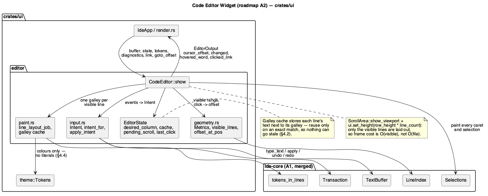

# Code Editor Widget

Roadmap phase **A2** (`docs/roadmap.md` §6, track A) — the main milestone of
the editor track. Two roles, in the project's declared order:
**`rust-core-dev`** first, for the three small `Buffer` changes of §2.0 that
the widget cannot work without, then **`rust-ui-dev`** for the widget
itself. That matches what the roadmap's A2 row already anticipated with
"core (мелкие API)". No security-sensitive path is touched by either diff,
so `hacker` is skipped.

## 1. Purpose

`docs/roadmap.md` §3.1 names this the first architectural blocker: the
editor is an `egui::TextEdit::multiline` over a `String`, and that is a dead
end for every feature on the JetBrains list.

What it costs today, concretely:

- **Two sources of truth.** `Tab::scratch` mirrors `buffer.text()` for
  `TextEdit` to mutate, and `Tab::reconcile` diffs it back through
  `diff_replace` (`app.rs:136-145`). Every edit is reconstructed by a
  prefix/suffix scan instead of being known.
- **No line numbers, no gutter, no current-line highlight** — `TextEdit`
  has nowhere to put them.
- **One cursor, and it isn't ours.** `output.cursor_range` is the only way
  to know where the caret is, in `char` indices that have to be converted
  per frame (`render.rs:330-334`). Multi-cursor (A3) is unreachable.
- **The whole file is laid out every frame.** `TextEdit` builds one
  `LayoutJob` over the entire text (`render.rs:304-315`), which is why
  highlighting is capped at 2 MiB and why a large file is unusable.

This phase replaces it with a widget we own: per-line rendering with
viewport culling, a gutter, our own carets and selections drawn from the
`TextBuffer` model, and input translated into `Transaction`s.

### 1.1 One deliberate scope reduction: no soft wrap

The roadmap's A2 row asks for "no-wrap by default + a soft-wrap option".
This phase ships **no-wrap only**, and here is why that is the right call
rather than a corner cut: with no wrap, every line is exactly one row of a
known height, so the visible range is two divisions and culling is exact.
Soft wrap makes row height per-line-variable, which means culling needs a
cumulative-height structure and every geometry function needs a **visual
line ↔ buffer line** mapping.

That mapping is precisely what **A6 (code folding)** has to build anyway —
the roadmap's own A6 row says folding "затрагивает почти всю геометрию A2".
Building it twice, once for wrap and once for folding, is waste; building it
once in A6 and adding wrap on top is a small increment. Soft wrap is
therefore deferred to A6, and A6's doc must add it. Everything else in the
A2 row ships in this phase.

**Also out of scope**, by roadmap assignment: multi-cursor *commands* and
`⌥Click` (A3 — this widget renders N carets and its model holds them, but
nothing in this phase creates a second one), smart indent and bracket
matching (A4), find/replace (A5), folding (A6), git gutter marks (E7),
breakpoint marks (F5). The gutter reserves the space they need (§3.3).

## 2. Interface / API

### 2.0 `ide-core`: three small `Buffer` changes (role 1)

The A1 engine has everything the widget needs *inside* `TextBuffer`, but
`Buffer` — which is what a `Tab` owns — sits between them with two gaps that
only became visible once a real caller existed.

```rust
impl Buffer {
    /// No longer marks the buffer dirty. A2 calls this every frame to read
    /// and edit through the widget, so marking on access would make every
    /// opened file instantly "modified" — the conservative rule that made
    /// sense while nothing called it is wrong now that something does.
    pub fn text_buffer_mut(&mut self) -> &mut TextBuffer;

    /// Explicit replacement for what `text_buffer_mut` used to imply. The
    /// editor reports whether it changed the text, and the caller says so.
    pub fn mark_dirty(&mut self);

    /// Sets the highlighting rules on the underlying `TextBuffer`.
    /// Deliberately does **not** touch the dirty flag: choosing a language
    /// is not an edit. Without this there is no way to get syntax rules
    /// into a `Buffer`, because `open`/`untitled` construct their
    /// `TextBuffer` with `None`, and the widget would render every file
    /// uncoloured.
    pub fn set_syntax(&mut self, syntax: Option<&'static SyntaxRules>);
}
```

`docs/features/editor-engine.md` §2.6 documents the old `text_buffer_mut`
behaviour and gets a revision note pointing here.

Nothing else in `ide-core` changes; in particular the widget needs no new
`TextBuffer` API.

### 2.1 Module layout

New module tree under `crates/ui/src`:

```
editor/mod.rs      CodeEditor (the widget) + EditorState + EditorOutput
editor/geometry.rs line/column <-> screen position, visible range, gutter width
editor/input.rs    egui events -> Intent -> Transaction / selection change
editor/paint.rs    per-line LayoutJob, galley cache, painting
```

### 2.2 The widget

```rust
/// An editable view of one `ide_core::Buffer`. Immediate-mode: built,
/// shown and dropped every frame; everything that must survive a frame
/// lives in `EditorState`, which the caller owns per tab.
///
/// It takes the whole `Buffer`, not its `TextBuffer`, so that the dirty
/// flag is set exactly when an edit happens (§2.0) rather than on every
/// frame the editor is merely visible.
pub struct CodeEditor<'a> {
    buffer: &'a mut Buffer,
    state: &'a mut EditorState,
    tokens: &'a Tokens,
    diagnostics: &'a [Diagnostic],
    /// The `Cmd`-hover link range, painted underlined.
    link: Option<&'a Range<usize>>,
    /// Set once to move the caret and scroll it into view — how Problems,
    /// Usages and Search jump to a location.
    goto_offset: Option<usize>,
    id: egui::Id,
}

impl<'a> CodeEditor<'a> {
    /// `theme` is the discriminant half of `EditorState::layout_key` (§2.3):
    /// the palette itself arrives in `tokens`, but the cache needs something
    /// comparable to notice that the palette changed.
    pub fn new(
        id: egui::Id,
        buffer: &'a mut Buffer,
        state: &'a mut EditorState,
        tokens: &'a Tokens,
        theme: Theme,
    ) -> Self;

    pub fn diagnostics(self, diagnostics: &'a [Diagnostic]) -> Self;
    pub fn link(self, link: Option<&'a Range<usize>>) -> Self;
    pub fn goto_offset(self, offset: Option<usize>) -> Self;

    pub fn show(self, ui: &mut egui::Ui) -> EditorOutput;
}

pub struct EditorOutput {
    /// The primary caret after this frame's input — replaces
    /// `IdeApp::active_cursor_offset`'s per-frame reconstruction from
    /// `TextEdit`'s char indices.
    pub cursor_offset: usize,
    /// Whether the buffer's text changed this frame: the gate for notifying
    /// the LSP client, which is what `Tab::reconcile`'s return value gates
    /// today. The widget has already called `Buffer::mark_dirty` itself —
    /// this is for the caller's other side effects, not for the flag.
    pub changed: bool,
    /// The word under the pointer while `Cmd` is held, for the hover link
    /// and `Cmd+Click`. `None` when the modifier is up or the pointer is
    /// not over a word.
    pub hovered_word: Option<Range<usize>>,
    /// Set on `Cmd+Click`, consumed by the caller to run Find Usages.
    pub clicked_link: Option<Range<usize>>,
}
```

### 2.3 Per-tab state

```rust
/// Everything the widget must remember between frames. Owned by `Tab`.
#[derive(Default)]
pub struct EditorState {
    /// Sticky x for vertical caret motion: `Up`/`Down` aim at the column
    /// the caret last moved to horizontally, not the one it happens to be
    /// in after passing through a short line. Cleared by any horizontal
    /// movement or edit.
    desired_column: Option<f32>,
    lines: LineCache,
    /// Set when the caret moves, consumed on the next frame to scroll it
    /// into view.
    pending_scroll: Option<usize>,
    /// Where the last click landed, for double/triple-click detection.
    last_click: Option<(usize, f64, u8)>,
    /// Widest line measured so far, never shrunk while the tab is open
    /// (§3.2) — the scroll area's content width.
    content_width: f32,
    /// Fingerprint of everything the cached galleys were laid out under —
    /// the resolved monospace `FontId` and the theme's discriminant. The
    /// widget compares it each frame and calls `invalidate` on a mismatch,
    /// so nothing has to remember to notify the editor that the theme
    /// changed.
    layout_key: Option<(egui::FontId, Theme)>,
}

impl EditorState {
    /// Drops cached galleys. Called on a theme or font-size change; edits
    /// are handled by the per-line content check (§4.2).
    pub fn invalidate(&mut self);
}
```

### 2.4 Geometry (`editor/geometry.rs`, pure functions — the tested core)

```rust
/// Fixed geometry for one frame: derived from the monospace font metrics
/// and the buffer's line count, never from widget state.
#[derive(Debug, Clone, Copy, PartialEq)]
pub struct Metrics {
    pub row_height: f32,
    pub char_width: f32,
    pub gutter_width: f32,
    pub text_left: f32,
    /// Rows that fit in the viewport, for `PageUp`/`PageDown` — the one
    /// piece of geometry `apply_intent` needs and cannot derive itself.
    pub page_rows: usize,
}

impl Metrics {
    /// `digits` is the line count's decimal width; the gutter is that many
    /// digit cells plus the marker lane (§3.3) plus padding, so it grows
    /// once at 10/100/1000 lines rather than jittering per scroll.
    pub fn new(
        row_height: f32,
        char_width: f32,
        digits: u32,
        page_rows: usize,
        space: &Spacing,
    ) -> Self;
}

/// Half-open range of lines to paint for `viewport`, clamped to
/// `line_count`. One row past each edge, so a partially visible line is
/// still drawn.
pub fn visible_lines(viewport: egui::Rect, row_height: f32, line_count: usize) -> Range<usize>;

/// Y of `line`'s top, relative to the scrolled content's origin.
pub fn line_top(line: usize, row_height: f32) -> f32;

/// The line a content-relative y falls on, clamped to the last line.
pub fn line_at_y(y: f32, row_height: f32, line_count: usize) -> usize;

/// Byte offset for a click: the line from `y`, then the column from the
/// line's own galley (`Galley::cursor_from_pos`), converted from a char
/// index within that line to an absolute byte offset.
pub fn offset_at_pos(
    buffer: &TextBuffer,
    galley: &egui::Galley,
    line: usize,
    x: f32,
) -> usize;
```

### 2.5 Input (`editor/input.rs`)

Every keyboard and mouse event becomes an `Intent` first, and only then a
`Transaction` or a selection change. The split is what makes input testable
without a live `egui::Context`: `intent_for(event, modifiers)` is a pure
function, and `apply_intent(buffer, state, intent)` needs no `Ui`.

```rust
#[derive(Debug, Clone, PartialEq, Eq)]
pub enum Intent {
    Insert(String),
    Newline,
    DeleteBackward(Granularity),
    DeleteForward(Granularity),
    Move { direction: Direction, granularity: Granularity, extend: bool },
    SelectAll,
    Copy,
    Cut,
    Paste(String),
}

#[derive(Debug, Clone, Copy, PartialEq, Eq)]
pub enum Granularity { Character, Word, Line, Page, Document }

#[derive(Debug, Clone, Copy, PartialEq, Eq)]
pub enum Direction { Left, Right, Up, Down }

/// `None` for an event the editor does not claim, which is then left for
/// the rest of the app (so `Cmd+S`, `Cmd+Shift+F` and friends still work
/// while the editor has focus).
pub fn intent_for(event: &egui::Event) -> Option<Intent>;

/// What applying an intent asks the caller to do. `Copy`/`Cut` need the
/// clipboard, which is `ui.ctx().copy_text` and therefore unavailable to a
/// function that deliberately takes no `Ui` — so the text to copy comes
/// back out instead of being written from in here, and `show` performs it.
#[derive(Debug, Default, PartialEq, Eq)]
pub struct Applied {
    pub changed: bool,
    pub copy: Option<String>,
}

/// Applies `intent`. The only place in the widget that mutates the buffer,
/// and the only one that calls `Buffer::mark_dirty` — on `changed`, never
/// on access.
pub fn apply_intent(
    buffer: &mut Buffer,
    state: &mut EditorState,
    metrics: &Metrics,
    intent: Intent,
) -> Applied;
```

### 2.6 What this replaces in `IdeApp`

| Removed | Replaced by |
|---|---|
| `Tab::scratch` | nothing — `TextBuffer` is the only copy |
| `diff_replace` + its 8 tests | `Transaction`, built from the actual edit |
| `Tab::reconcile` | `EditorOutput::changed` |
| `Tab::tokens` + `compute_tokens` | `TextBuffer::tokens_in_lines` |
| `byte_offset_at_char` over the whole file | the same conversion, per line, inside `geometry.rs` |
| `IdeApp::active_cursor_offset` | `EditorOutput::cursor_offset` |
| `tab_layout_job` (whole file) | `paint::line_layout_job` (one line) |

`Tab` keeps `buffer`, `title`, `diagnostics`, `syntax`, and gains
`editor: EditorState`. `IdeApp::pending_cursor_offset` stays exactly as it
is — it is the app-level plumbing from Problems/Usages/Search — and is
handed to the widget as `goto_offset`.

## 3. Behaviour

### 3.1 Frame shape

```
ScrollArea::both().show_viewport(ui, |ui, viewport| {
    ui.set_height(row_height * line_count);        // virtual content height
    let range = visible_lines(viewport, row_height, line_count);
    // paint: current-line band -> selections -> text -> carets -> gutter
});
```

Only `range` is laid out and painted. A 100 000-line file costs the same
per frame as a 50-line one, aside from the `set_height` arithmetic — that
is the acceptance criterion the roadmap sets, and §4.3 states the bound.

Painting order matters and is fixed: the current-line band and selection
rectangles go under the text, carets over it, gutter last (it is opaque and
must not be scrolled over horizontally — §3.3).

### 3.2 Layout of one line

`paint::line_layout_job(line)` builds the same three-dimension composition
`tab_layout_job` builds today — token colour, diagnostic underline, hover
link underline — but over one line's byte range, taking its tokens from
`TextBuffer::tokens_in_lines(line..line + 1)` and clipping diagnostic marks
to the line. The boundary-merge algorithm is carried over unchanged
(`render.rs:101-155`); only its input span narrows. Wrapping is disabled
(`wrap.max_width = f32::INFINITY`), which is what makes one line exactly
one row.

Horizontal extent: the content width is the widest **visible** line's
galley plus a margin — measuring 100 000 lines to size a scrollbar is
exactly the cost this phase exists to avoid.

That width is a **high-water mark held in `EditorState`, never shrunk while
the tab stays open**. Recomputing it per frame would shrink the content as
soon as a long line scrolls off, and egui would clamp the horizontal offset
to the new width, yanking the view left mid-scroll. Growing-only costs a
scrollbar that is wider than strictly necessary after you leave a long
line; shrinking costs the view jumping under the user, which is worse. The
mark resets with the cache (`EditorState::invalidate`).

### 3.3 The gutter

Fixed-width lane on the left, painted last so it stays put under horizontal
scrolling, filled with `tokens.color.bg_editor` and separated by a
`tokens.color.border` hairline. Contents, left to right:

1. **Marker lane** — one `char_width * 2` column, empty in this phase.
   Reserved, and named in code, for E7's git bars, F5's breakpoints, A6's
   fold arrows and the diagnostic/intention icons.
2. **Line number**, right-aligned, in `tokens.color.gutter_fg`, and in
   `tokens.color.gutter_fg_active` for the line holding the primary caret.

Width is recomputed from the line count's digit width, so it steps once
when a file crosses 1000 lines rather than shifting while scrolling.

### 3.4 Carets and selections

Every selection in `TextBuffer::selections()` is drawn, not just the
primary — the model is already multi-cursor and A3 only has to add commands
that create more:

- A non-empty selection paints `tokens.color.selection_bg` rectangles, one
  per line it spans, each clipped to that line's galley extent; the last
  line of a multi-line selection extends half a character past its end so a
  selected newline is visible.
- Every caret paints a 2px `tokens.color.caret` vertical bar at its head.
  Blinking is deliberately omitted: it forces a repaint twice a second for
  a decoration, and egui's `request_repaint_after` cost is not worth it in
  a phase whose acceptance criterion is frame cost.
- The line holding the **primary** caret gets the `current_line_bg` band,
  full content width, only when that selection is empty — a band under an
  active selection fights with the selection colour.

### 3.5 Keyboard

The widget is the only place in `crates/ui` reading raw key events for
editing, and it reads them in exactly one function (`intent_for`). Per
`CLAUDE.md`, once the command registry lands (roadmap B3) that function is
what migrates; until then this follows the existing `handle_shortcuts`
pattern.

Bindings are the **macOS system text-editing bindings, which the JetBrains
macOS keymap uses unchanged** — none is invented, and none is a "command" in
the registry sense; they are text input, which is why they are not in
`docs/roadmap.md` §5.2's per-action table. The rule from `CLAUDE.md` still
holds and is what bounds this table: **nothing outside it gets a binding in
this phase.** Any editing action that does appear in §5.2 belongs to the
phase §5.2 assigns it to (`⌃G` to A3, `⌘D` to A4, and so on), and adding it
here would be inventing a binding by the back door.

| Key | Action |
|---|---|
| printable text, `Enter`, `Tab` | insert (`Tab` inserts a literal tab — smart indent is A4) |
| `←` `→` `↑` `↓` | move caret; `⇧` extends the selection |
| `⌥←` `⌥→` | move by word |
| `⌘←` `⌘→` | line start / line end |
| `⌘↑` `⌘↓` | document start / end |
| `⌫` `⌦` | delete backward / forward one character, or the selection |
| `⌥⌫` | delete word backward |
| `⌘⌫` | delete to line start |
| `PageUp` `PageDown` | move by one viewport height |
| `⌘A` | select all |
| `⌘C` `⌘X` `⌘V` | via `egui::Event::{Copy, Cut, Paste}` |

`⌘Z` / `⌘⇧Z` stay where they already are: `handle_shortcuts` at app level,
acting on the active tab's `Buffer`. Routing them through the editor would
have made undo work only after the editor had been focused at least once,
for no gain — the history lives in the buffer either way — so `intent_for`
returns `None` for them and there is no `Intent::Undo`/`Redo`.

Anything not in this table is left unclaimed so the app's own shortcuts
(`⌘S`, `⌥F7`, `⌘B`, `⌘⇧F`) keep working while the editor has focus. `⌥Click`
and the other multi-cursor bindings are A3's and are deliberately absent.

**Focus lock.** egui's own focus machinery claims bare arrows and `Tab`
before any widget sees them (`Focus::begin_pass`), and would hand focus to a
neighbouring widget the first time the caret moves down. While focused, the
widget therefore installs
`EventFilter { tab: true, horizontal_arrows: true, vertical_arrows: true,
escape: false }` — `escape` stays unlocked so `Esc` still releases the
editor. The lock takes effect one frame after focus is granted, which is
egui's own constraint (`set_focus_lock_filter` requires the widget to have
held focus for a whole frame) and is invisible in use.

Every text-inserting key goes through `TextBuffer::type_text`, so a typed
run is one undo step; every other edit goes through `apply`, so it is its
own step (`editor-engine.md` §3.5).

### 3.6 Mouse

- **Click** places the caret and collapses to a single selection.
- **Drag** extends the selection from the press point; dragging past the
  top or bottom edge scrolls.
- **Double-click** selects the word under the pointer (`word_range_at`,
  moved from `app.rs` into the editor module and reused by the hover link).
- **Triple-click** selects the line.
- **`Cmd` + hover** marks the word under the pointer as a link — reported
  as `hovered_word`, painted underlined next frame, with
  `CursorIcon::PointingHand`, exactly as
  `richer-highlighting-and-usages-popup.md` §3 specifies today.
- **`Cmd` + click** reports `clicked_link`, which `IdeApp` turns into a
  Find Usages query and the popup — unchanged behaviour, new plumbing.

Click detection for double/triple uses `EditorState::last_click`: same line
and within `ui.input(|i| i.time)` + 0.4 s of the previous click.

### 3.7 Scrolling to an offset

`goto_offset` (from `IdeApp::pending_cursor_offset`) sets the selection to
a caret at that offset and requests a scroll that centres its line
vertically, using `ui.scroll_to_rect`. The caret is also scrolled into view
whenever a key moves it out — tracked through `EditorState::pending_scroll`
rather than scrolling from inside the paint pass, so a scroll request never
races the viewport the same frame computed.

### 3.8 Focus

The editor takes focus on click and keeps it until another widget takes it,
via `ui.interact(rect, id, Sense::click_and_drag())` plus
`memory_mut(|m| m.request_focus(id))` and the focus lock of §3.5. Events are
consumed **only** while focused, so typing into the search field never
reaches the buffer.

## 4. Constraints & invariants

### 4.1 Parity — the acceptance criterion

Everything that works today must work after the replacement. Each is a test
(§6):

1. token colours, 2. diagnostic underlines, 3. `Cmd`-hover link underline
and pointer shape, 4. `Cmd+Click` → Find Usages popup, 5. jump from
Problems / Usages / Search via `pending_cursor_offset`, 6. undo/redo,
7. save and the dirty indicator, 8. tab switching preserving each tab's
caret and scroll.

New on top: line numbers, gutter, current-line highlight, and a
100 000-line file that scrolls without a frame-time cliff.

### 4.2 Cache correctness

The galley cache is keyed by line index, and each entry stores the line's
text alongside its galley. An entry is reused only when the stored text
equals the line's current text — a byte comparison of one line, which is
cheaper than laying it out and, unlike a revision counter, cannot go stale
if something outside the widget ever edits the buffer. The cache is also
dropped wholesale when the font size, theme or wrap width changes
(`EditorState::invalidate`), and is bounded: entries outside the visible
range plus a screenful of margin are evicted each frame, so it cannot grow
with file size.

### 4.3 Performance

For a buffer of `L` lines with `V` lines visible (`V` is bounded by the
window height over `row_height`, so ~100):

| Per frame | Bound |
|---|---|
| layout + paint | O(V), independent of `L` |
| `tokens_in_lines` | O(log T) binary search + a subslice |
| visible-range computation | O(1) |
| `set_height` / scrollbar | O(1) |
| galley cache | O(V) entries |

Nothing in the frame path is O(L). The one O(L) operation in the widget is
the digit width of the line count, which is `ilog10` — O(1) in practice.

### 4.4 No colour literals

`crates/ui/src/theme`'s existing `include_str!` ban test
(`fleet-look-foundation.md` §4.1) covers named files; this phase adds the
new `editor/*.rs` files to that list. Every colour comes from `Tokens`;
the four tokens B1 reserved for A2 — `current_line_bg`, `gutter_fg`,
`gutter_fg_active`, and `bg_editor` — lose their `#[allow(dead_code)]`.

### 4.5 Threading

None. The widget is immediate-mode and runs entirely on the UI thread;
`TextBuffer` is `Send` but never leaves it.

### 4.6 Untrusted input

The buffer's content is a file's content, i.e. untrusted, but this widget
only measures and paints it. Two consequences it must respect: a single
line can be megabytes long (a minified file), so a line's galley is laid
out but its width must not be used to size the scroll area beyond the
visible set (§3.2); and every offset handed to `TextBuffer` must be one the
model produced or a clamped one — the widget never constructs a byte offset
by arithmetic on a char count without going through `geometry.rs`.

## 5. Examples

**The whole editor pane, as `render.rs` will call it:**

```rust
let tab = &mut self.tabs[idx];
let output = CodeEditor::new(
    egui::Id::new(("code_editor", idx)),
    &mut tab.buffer,
    &mut tab.editor,
    self.theme.tokens(),
    self.theme,
)
.diagnostics(&tab.diagnostics)
.link(self.hover_link.as_ref())
.goto_offset(self.pending_cursor_offset.take())
.show(ui);

self.active_cursor_offset = Some(output.cursor_offset);
if output.changed {
    // The dirty flag is already set by the widget (§2.2); this gate is
    // only about not flooding the language server from an idle tab.
    self.notify_lsp_changed(idx);
}
if let Some(range) = output.clicked_link {
    self.find_usages_at(range);
}
```

**Visible-range arithmetic, the part that makes big files cheap:**

```rust
let range = visible_lines(viewport, 18.0, 100_000);
// a 720px-tall viewport scrolled to y=18_000 shows ~40 lines, not 100_000
assert_eq!(range.start, 999);
assert!(range.len() < 64);
```

**An event becoming an intent:**

```rust
assert_eq!(
    intent_for(&egui::Event::Text("x".into())),
    Some(Intent::Insert("x".into()))
);
assert_eq!(intent_for(&key(egui::Key::S, Modifiers::COMMAND)), None); // app's Save
```

## 6. Dependencies & integration points

**Depends on**: `ide_core::TextBuffer` and friends from A1, plus the three
`Buffer` changes of §2.0 that role 1 lands first; `crate::theme::Tokens`
from B1. New dev-dependency `egui_kittest` (pre-approved in `CLAUDE.md`'s
dependency table for exactly this phase).

**Consumed by**: A3 (multi-cursor commands — this widget already paints N
carets), A4, A5, A6, C-track navigation, E7's git gutter, F5's breakpoint
gutter. Everything in the roadmap that says "depends on A2" depends on the
gutter lane and the geometry functions specifically.

**Tests.** `#[cfg(test)] mod tests` alongside the code, ≥80% line coverage
on every non-rendering file — `geometry.rs` and `input.rs` are pure and
carry the bulk of it; `paint.rs` and `mod.rs`'s `show` are rendering and are
covered by harness tests instead of being forced into unit shape.

0. (`ide-core`, role 1) `text_buffer_mut` no longer dirties a clean buffer;
   `mark_dirty` does; `set_syntax` installs rules, retokenizes, and leaves
   the dirty flag alone.
1. `visible_lines`: exact boundaries, a viewport taller than the file, a
   scroll past the end, an empty buffer (one line).
2. `Metrics::new`: gutter width steps at 10/100/1000/10000 lines and not
   between.
3. `offset_at_pos`: click before the first character, past the end of a
   line, on a multi-byte character, on the last line.
4. `intent_for`: every row of §3.5's table, plus the unclaimed cases
   (`⌘S`, `⌘⇧F`) returning `None`.
5. `apply_intent`: each movement granularity, selection extension, delete
   with and without a selection, and that a run of `Insert` intents is one
   undo step while a delete between them is its own.
6. Sticky column: down through a short line and back keeps the original
   column.
7. Double/triple-click selection ranges.
8. Cache: an edited line is re-laid-out, an untouched one is reused,
   entries outside the viewport are evicted.
9. Harness (`egui_kittest`): the widget renders a small buffer, a typed
   character reaches the buffer, and the caret lands where a click was
   simulated — plus the focus lock of §3.5, with a focusable widget below
   the editor and two `ArrowDown` presses that must both reach it.
10. Parity: the eight items of §4.1, at `IdeApp` level, adapting the tests
    that exist today rather than writing new ones where they already cover
    the behaviour.

## 7. Diagram



## Revision notes

Round 1 review (6 findings, 4 blocking).

1. **The widget would have dirtied every file it displayed.** The example
   handed it `tab.buffer.text_buffer_mut()`, which marks dirty on access
   (`buffer.rs`, documented in `editor-engine.md` §2.6) — so merely opening
   a file would light the modified indicator, contradicting parity item 7
   in §4.1. `CodeEditor` now takes `&mut Buffer` and the dirty flag is set
   from inside `apply_intent`, only when text actually changed. §2.0, §2.2,
   §2.5, §5.
2. **`Copy`/`Cut` were unreachable.** `apply_intent` is specified to need no
   `Ui`, but writing to the clipboard is `ui.ctx().copy_text`. It now
   returns `Applied { changed, copy }` and `show` performs the copy, which
   keeps the function pure and testable instead of quietly needing a
   context. §2.5.
3. **Highlighting would have been empty.** §2.6 drops `Tab::tokens` in
   favour of `TextBuffer::tokens_in_lines`, but `Buffer::open`/`untitled`
   build their `TextBuffer` with `None` rules and nothing could set them.
   Added `Buffer::set_syntax`. Together with 1, this is why the phase now
   runs **`rust-core-dev` before `rust-ui-dev`** rather than being
   UI-only — which is what the roadmap's A2 row meant by "core (мелкие
   API)". Header, §2.0, §6.
4. **Nothing triggered `EditorState::invalidate`.** The cache would have
   survived a theme switch and painted the old palette. The state now holds
   a `layout_key` (resolved font + theme) that the widget compares each
   frame, so invalidation needs no cooperation from the caller. §2.3, §4.2.
5. §3.2 didn't say what happens to the horizontal offset when the content
   width shrinks — egui clamps it, which would yank the view sideways.
   Content width is now a high-water mark that never shrinks while the tab
   is open, with the tradeoff stated.
6. §3.5 justified its bindings as "macOS standard" without tying that to
   the project's rule. It now cites `docs/roadmap.md` §5.2 explicitly and
   states the bound: nothing outside the table gets a binding in this
   phase, and §5.2's own editing actions stay with the phases §5.2 assigns
   them to.

Round 2 — code review of the `rust-ui-dev` diff (3 findings). One was a
defect in the code and is fixed there; the rest were the doc lagging
decisions taken during implementation, written back here.

7. **The editor surrendered focus on `↑ ↓ ← →` and `Tab`.** egui reads those
   keys in `Focus::begin_pass` before any widget sees them and moves focus
   to a neighbouring widget unless the focused widget has installed an
   `EventFilter`; the widget installed none, so the second arrow press never
   reached the editor. §3.5 gained the **Focus lock** paragraph, §3.8 points
   at it, and §6 item 9 gained the regression test.
8. `EditorOutput::response` is gone (nothing consumed it), `CodeEditor::new`
   takes the `Theme` that `layout_key` compares against, `Metrics` carries
   `page_rows` and `Granularity` a `Page` variant for `PageUp`/`PageDown`
   — §2.2, §2.4, §2.5 and the §5 example now show what shipped.
9. `Intent::Undo`/`Redo` were specified but not built: undo/redo stay in the
   app's own `handle_shortcuts`, so they keep working before the editor has
   ever been focused. §3.5 says so and gives the reason.
