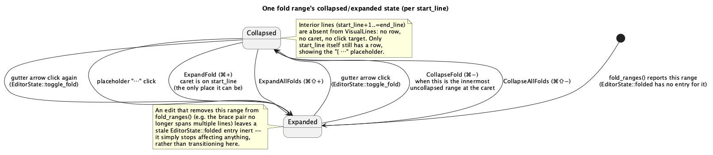

# Code Folding (A6)

## 1. Purpose

`docs/roadmap.md` §2.1 lists Code Folding as missing entirely (❌ →
**A6**); §7 places it right after the shell relayout (B2), the last item
in the "editor feels like an IDE" milestone. The editor widget
(`code-editor-widget.md`, A2) already reserves gutter width for a fold
arrow (`MARKER_LANE_CHARS`'s doc comment names it explicitly) but nothing
computes a fold range or hides a line. This phase adds both halves:

- **`ide-core`**: pure, state-free detection of *where* a buffer could
  fold — from brace nesting (reusing the same `SyntaxRules::brackets` data
  `matching_bracket` already uses), from indentation (Python/YAML, reusing
  `SyntaxRules::indent_line_suffixes`), and from explicit `// region` /
  `// endregion` markers.
- **`ide-ui`**: *collapsed* state (which of those ranges are currently
  hidden, per tab) and the buffer-line ↔ visual-row mapping that lets the
  rest of the widget's geometry — painting, scrolling, click math, arrow-
  key motion — treat a collapsed range's interior as if it weren't there,
  without knowing anything about folding itself.

Nothing from `ide-lsp` is involved: LSP's own `textDocument/foldingRange`
is explicitly future work (`docs/roadmap.md` §7's note on this phase), out
of scope until a phase actually adds an `lsp` role to this feature.

## 2. Interface

### 2.1 `ide-core` — `crates/core/src/text/folding.rs` (new)

```rust
#[derive(Debug, Clone, Copy, PartialEq, Eq)]
pub enum FoldKind {
    Brace,
    Indent,
    Region,
}

/// A half-open... no — a **closed** line range: `start_line` is the line
/// that stays visible when collapsed (it renders the placeholder),
/// `end_line` is the last line hidden. Always `end_line > start_line` —
/// nothing shorter than two lines is foldable, there being nothing to
/// hide.
#[derive(Debug, Clone, PartialEq, Eq)]
pub struct FoldRange {
    pub start_line: usize,
    pub end_line: usize,
    pub kind: FoldKind,
}

impl TextBuffer {
    /// Every foldable region in the buffer, sorted by `start_line`
    /// ascending. Ranges from different sources (§3.1–§3.3) may nest or
    /// overlap; both are expected, not errors. Empty when there is no
    /// syntax (nothing to detect structure from) or the buffer is larger
    /// than `MAX_HIGHLIGHTED_FILE_BYTES` — the same cap
    /// `TextBuffer::matching_bracket` already applies, and for the same
    /// reason: past it there are no tokens to drive brace detection, and
    /// a partial answer (indent/region folds only, brace folds silently
    /// missing) would be more confusing than no answer.
    pub fn fold_ranges(&self) -> Vec<FoldRange>;
}
```

No `IdeApp`/`egui` dependency — same boundary `matching_bracket` already
holds: this is a pure, state-free read of the buffer's current text and
tokens, recomputed fresh on every call rather than cached (§4.3).

`crates/core/src/text/mod.rs` gains `mod folding;` and
`pub use folding::{FoldKind, FoldRange};`; `crates/core/src/lib.rs`
re-exports both alongside `BracketPair` in its existing `pub use text::{
..., BracketPair, ... }` line.

### 2.2 `ide-ui` — `crates/ui/src/editor/folding.rs` (new)

```rust
use std::collections::BTreeSet;
use ide_core::FoldRange;

/// Maps buffer lines to visual rows, hiding every line inside a collapsed
/// fold range except the range's own `start_line`. `geometry.rs`'s
/// `visible_lines`/`line_at_y`/`line_top` operate on *rows* (their
/// existing signatures are unchanged — a row index is just a `usize`,
/// same as a line index was); every caller converts to/from buffer lines
/// through this type at the two points that need it (§3.4).
pub struct VisualLines {
    rows: Vec<usize>, // buffer line index for each visual row, ascending
}

impl VisualLines {
    /// `folded` is the set of currently-collapsed `start_line`s
    /// (`EditorState::folded`). When two or more of `ranges` share a
    /// `start_line` and more than one is collapsed, the one with the
    /// largest `end_line` (outermost) determines how much is hidden —
    /// same tie-break §3.6 uses for which one a shared gutter arrow
    /// toggles.
    pub fn build(line_count: usize, ranges: &[FoldRange], folded: &BTreeSet<usize>) -> Self;

    pub fn row_count(&self) -> usize;

    /// The buffer line for visual `row`, clamped to the last row.
    pub fn buffer_line(&self, row: usize) -> usize;

    /// The visual row for `buffer_line` — its own row if visible,
    /// otherwise the row of the collapsed fold that hides it (§3.4/§3.7).
    /// `O(log R)` via `partition_point` over the sorted row list.
    pub fn row_of(&self, buffer_line: usize) -> usize;
}

/// The collapse-side mirror of `EditorState::reveal_line` (§2.3): call
/// after any operation that may have just collapsed a range covering the
/// caret's current line. A no-op if the caret's line is still visible;
/// otherwise moves the caret to the nearest visible line at or before it
/// (`state.visual_lines(...).row_of`/`buffer_line`, §2.3) — which, for a
/// range that was just collapsed around the caret, is exactly that
/// range's `start_line`. Takes `&mut Buffer` (not `&mut TextBuffer`)
/// because it needs `Buffer`'s dirty-flag-aware `set_selections` path,
/// the same reason `CodeEditor::new` does (§2.6's `goto_offset` handling
/// goes through the same `Buffer`, not `TextBuffer`, for the same
/// reason).
pub fn reveal_caret_after_collapse(buffer: &mut Buffer, state: &EditorState);
```

No `IdeApp`/`egui` dependency here either — a natural sibling of
`geometry.rs`'s own "no `Ui`, no state, no painting" module boundary.
`reveal_caret_after_collapse` is the one exception that touches `Buffer`
rather than staying purely state-free, for the reason its own doc comment
gives — it still has no `egui` dependency, so it stays in this module
rather than `app.rs`, callable from both `run_command` (§2.5) and the
gutter/placeholder click handler (§3.6) without duplicating its logic in
either place.

### 2.3 `ide-ui` — `EditorState` additions (`editor/mod.rs`)

```rust
/// `start_line` of every currently-collapsed fold, this tab's session-only
/// view state — reset by `EditorState::default()` on tab (re)open, same
/// category `bracket_pair`/`column_mode` are already in.
folded: std::collections::BTreeSet<usize>,
```

```rust
impl EditorState {
    pub fn is_folded(&self, start_line: usize) -> bool;

    /// Toggles one specific range by its `start_line` — what a gutter-
    /// arrow or placeholder click uses, since both already know exactly
    /// which range was clicked (§3.6).
    pub fn toggle_fold(&mut self, start_line: usize);

    /// `CollapseFold` (§2.4): the innermost range in `ranges` that
    /// contains `caret_line` and is not already collapsed. No-op if none
    /// does (§3.5).
    pub fn collapse_at_caret(&mut self, ranges: &[FoldRange], caret_line: usize);

    /// `ExpandFold`: uncollapses the range whose `start_line` is
    /// `caret_line`, if one is currently collapsed there. No-op
    /// otherwise — in particular, this is the *only* shape a caret at a
    /// collapsed range can be in (§3.4), so "caret not on a collapsed
    /// start_line" and "nothing to expand" are the same condition.
    pub fn expand_at_caret(&mut self, caret_line: usize);

    pub fn collapse_all(&mut self, ranges: &[FoldRange]);
    pub fn expand_all(&mut self);

    /// Builds a `VisualLines` from this state's private `folded` set —
    /// the one way anything outside `editor/**` (namely `app.rs`'s
    /// `run_command`, §2.5) gets one, since `folded` itself stays
    /// private. Code inside `editor/**` (`paint`/`paint_gutter`/
    /// `handle_mouse`/`input.rs`, §2.6) may use this same method too,
    /// rather than reaching the private field directly, so there is
    /// exactly one way `VisualLines` gets constructed anywhere in the
    /// crate.
    pub fn visual_lines(&self, line_count: usize, ranges: &[FoldRange]) -> VisualLines;

    /// Uncollapses every currently-collapsed range whose
    /// `start_line..=end_line` contains `line` — used when a jump
    /// (`goto_offset`, §2.6) targets a line otherwise hidden, so a
    /// search/diagnostic/usage/nav jump always reveals its target instead
    /// of silently landing on some unrelated fold's `start_line` (§3.4).
    /// Not recursive: `ranges` already lists every nested range up front,
    /// so one pass removing every containing `start_line` is enough.
    pub fn reveal_line(&mut self, ranges: &[FoldRange], line: usize);
}
```

### 2.4 `ide-ui` — `command.rs` additions

```rust
pub enum CommandAction {
    // ...existing 24 variants (11 original + 13 from fleet-shell)...
    CollapseFold,
    ExpandFold,
    CollapseAllFolds,
    ExpandAllFolds,
}
```

Bindings straight from `docs/roadmap.md` §5.2's Code Folding row —
nothing invented:

| id | title | category | binding | action |
|---|---|---|---|---|
| `CollapseFold` | Collapse | Edit | `⌘−` | `CollapseFold` |
| `ExpandFold` | Expand | Edit | `⌘+` | `ExpandFold` |
| `CollapseAllFolds` | Collapse All | Edit | `⌘⇧−` | `CollapseAllFolds` |
| `ExpandAllFolds` | Expand All | Edit | `⌘⇧+` | `ExpandAllFolds` |

`Edit` is an existing category (`command.rs` already has
`File`/`Edit`/`Navigate`/`Search`/`Build`/`Window`/`Settings`/`View`) —
this project has no `Code` category yet, and `Edit` is the closest already-
real fit rather than inventing a ninth. All four are enabled whenever
`active_tab.is_some()` (`is_command_enabled`), same as other per-tab
commands (e.g. `FindNext`) — each is a graceful no-op when there is
nothing to collapse/expand rather than being conditionally disabled, since
computing "is there actually a fold at the caret" just to gate a keystroke
would cost the same `fold_ranges()` call the command itself already makes.

### 2.5 `ide-ui` — `run_command`'s new arms (`app.rs`)

Each reads the active tab's buffer and caret line, then calls straight
through to `EditorState` (§2.3) — no new `IdeApp` state:

```rust
CommandAction::CollapseFold => {
    if let Some(idx) = self.active_tab {
        let ranges = self.tabs[idx].buffer.text_buffer().fold_ranges();
        let line = cursor_line_column(self.tabs[idx].buffer.text_buffer(),
            self.active_cursor_offset.unwrap_or(0)).0;
        self.tabs[idx].editor.collapse_at_caret(&ranges, line);
        editor::folding::reveal_caret_after_collapse(
            &mut self.tabs[idx].buffer, &self.tabs[idx].editor);
    }
}
// CollapseAllFolds follows the same shape, also followed by
// reveal_caret_after_collapse (§3.4's collapse-side rule, §3.5). ExpandFold
// and ExpandAllFolds never hide anything, so neither needs it.
```

### 2.6 `ide-ui` — geometry/paint/input changes (behavioural, not new signatures)

`geometry.rs`'s `visible_lines`, `line_at_y`, `line_top` and their tests
are **unchanged** — a row index and a line index are both a plain `usize`,
so nothing about their signatures needs to know folding exists. What
changes is what every caller in `editor/mod.rs` (`paint`, `paint_gutter`,
`handle_mouse`, vertical-motion handling in `input.rs`) feeds them: a
`VisualLines` is built once per frame via `state.visual_lines(line_count,
&buffer.fold_ranges())` (§2.2), and `visual.row_count()` replaces
`line_count` everywhere those functions are called — including the total
content height,
`row_height * visual.row_count()` in place of `row_height * line_count`.
**Exception:** `geometry::digits_for(line_count)` (gutter digit-width)
keeps using the buffer's true `line_count`, never `visual.row_count()` —
the gutter's number width must not shrink or grow as fold state changes,
matching `MARKER_LANE_CHARS`'s own existing "the gutter must not resize
when [markers] arrive" stability comment.

Buffer-line ↔ row conversion happens at exactly two kinds of boundary:

- Going **from** a row **to** a buffer line, right before reading or
  painting that line's text — `visual.buffer_line(row)`. Every `for line
  in visible` loop in `paint`/`paint_gutter` becomes `for row in
  visible_rows` with the buffer line looked up per iteration.
- Going **from** a buffer line **to** a row, right before computing a Y
  position for it — `visual.row_of(line)`. This covers the current-line
  highlight band, the caret's own row, a diagnostic's row, and a search
  match's row (§3.7).

Vertical caret motion at `Granularity::Line`/`Page` (`Up`/`Down`/
`PageUp`/`PageDown`, `input.rs`'s `vertical_step`) steps the **row**, not
the buffer line: `row_of(current_line) ± 1` (or `± page_rows`), clamped to
`0..visual.row_count()`, then `buffer_line(row)` for the new caret line.
This is what makes a fold's interior unreachable by keyboard for vertical
motion at these granularities, not a separate check (§3.4).

**`vertical_step`'s `Granularity::Document` branch is a separate early
return and needs its own fix.** `⌘↑`/`⌘⇧Home` (`Direction::Up`) and
`⌘↓`/`⌘⇧End` (`Direction::Down`) don't go through the row arithmetic
above at all — today they return raw `0` or `buffer.len()` directly,
bypassing rows entirely, the same shape of gap as horizontal motion's
`Document` case above. `Direction::Up`'s target (`0`) is always on line
`0`, which §3.4 already establishes can never be hidden, so it needs no
change. `Direction::Down`'s target (`buffer.len()`) sits on the buffer's
true last line, which **is** reachable as a hidden interior line: a fold
whose `end_line` is the file's last line hides that line while collapsed,
exactly like any other interior line. Fix: `move_carets` runs the same
post-step hidden-line check it already runs on `step`'s result (above) on
`vertical_step`'s `Document`-granularity result too — if
`buffer.lines().line_at(result)` is hidden, redirect to the end of the
nearest visible line at or before it (`buffer_line(visual.row_count() -
1)`'s line-end offset), the same backward redirect horizontal motion uses.

**Horizontal motion needs the same treatment, at a different point.**
`input.rs`'s `step` (backing `Left`/`Right` at every `Granularity` —
`Character`, `Word`, `Document`) computes a raw offset via
`next_boundary`/`prev_boundary`/word-boundary/document-boundary
arithmetic, with no row concept at all — unlike vertical motion, it isn't
naturally row-based, since a character or word step can validly cross a
line boundary the same way it always could before this phase. Left alone,
pressing `→` at the end of a collapsed fold's `start_line` would cross the
hidden newline straight into the fold's interior, and `Document` (`⌘→`/
end-of-file) could land on a hidden last line if a fold's `end_line` is
the file's own last line. `move_carets` must check the raw result of
`step` the same way `show`'s `goto_offset` handling already does (§2.6
above): if `buffer.lines().line_at(result)` is hidden, replace it with the
nearest visible boundary in the direction of travel — forward, the start
of the row right after the fold (`buffer_line(row_of(original_line) +
1)`, where `original_line` is the caret's line *before* the step, always
visible by the invariant); backward, the end of the fold's own
`start_line` text. This mirrors `Down`/`Up` skipping the interior outright
rather than `reveal_line`'s unfold-and-land-exactly-there behaviour —
horizontal motion stays collapsed, the same way vertical motion does,
since neither is a "go to" jump with a specific target worth revealing.

**`goto_offset` must reveal, not just avoid, a hidden target.** Every
existing jump site (`open_at`, `open_search_result`, `nav_back`/
`nav_forward`, all inherited unchanged from `fleet-shell.md`/
`code-editor-widget.md`) ends up setting `IdeApp::pending_cursor_offset`,
which `CodeEditor::show`'s existing `if let Some(offset) = goto_offset { ...
}` block (`editor/mod.rs`) applies directly via `set_selections` — a raw
byte offset, with no row concept at all. Left alone, a jump whose target
line sits inside a currently-collapsed fold would place the caret on a
hidden line, breaking §3.4's invariant. `show()` must therefore call
`state.reveal_line(&buffer.text_buffer().fold_ranges(), buffer.text_buffer
().lines().line_at(clamped))` **before** `set_selections`, so the jump
unfolds whatever was hiding its target rather than silently landing
somewhere else — the same auto-reveal behaviour readers will already
expect from every other editor's "go to definition inside a folded
region" case.

## 3. Behaviour

### 3.1 Brace-based fold ranges

Walks the buffer's raw text once, left to right, by `char_indices` — **not**
`TextBuffer::tokens()` filtered to `Punctuation`: `SyntaxRules::punctuation`
and `SyntaxRules::brackets` are independently maintained and not guaranteed
consistent (`MAKEFILE`/`DOCKERFILE` declare `(`/`)`/`{`/`}` as brackets but
omit them from `punctuation`; `MARKDOWN` declares `[`/`]`/`(`/`)` with an
empty `punctuation` table entirely), so a token-only scan would silently
never find a fold for those languages' brackets at all. Instead this uses
the same pattern `matching_bracket`/`enclosing_bracket_pair` already
established: scan every character, skip it if `is_quoted_or_commented`
reports it's inside a string or comment, and otherwise treat it as a
bracket if it's an `open` or `close` in `SyntaxRules::brackets`.

A stack holds `(expected_close_char, start_line)` for every bracket
currently open. For each unskipped `open` character: push `(matching
close, line_at(offset))`. For each unskipped `close` character: if it
equals the stack's top `expected_close_char`, pop it and — only if the
popped `start_line` is strictly less than this character's line — emit
`FoldRange { start_line, end_line: this line, kind: Brace }` (a `{}` pair
that never leaves its own line has nothing to hide, so it isn't a fold). A
closer that does **not** match the stack's top is left alone — the stack
is not popped or corrected — so malformed or mid-edit text degrades to
fewer detected folds rather than a wrong pairing; any brackets still on
the stack at end-of-file (unclosed) are discarded the same way, emitting
nothing for them.

### 3.2 Indentation-based fold ranges

Only runs for a language with a non-empty `SyntaxRules::
indent_line_suffixes` (today: Python, YAML — both `":"`). For every line
whose trimmed-trailing content ends with one of those suffixes (the exact
same `trim_end().ends_with(suffix)` check `text/indent.rs`'s
`ends_with_trigger` already uses for auto-indent, reused rather than
reimplemented — folding inherits that check's one known limitation, a
trailing line comment after the trigger character defeating the match,
the same way auto-indent already does, rather than diverging from it):
scan forward from the next line, skipping blank/whitespace-only lines
without letting them decide anything, until a non-blank line's leading-
whitespace length is *not* strictly greater than the trigger line's. The
fold's `end_line` is the last strictly-deeper-indented non-blank line seen
(trailing blank lines right before the boundary are included in the
collapsed span, which is the expected, harmless behaviour); if no line
after the trigger was ever deeper-indented (an empty block, or the trigger
is the file's last line), nothing is emitted.

Leading-whitespace length is a raw byte count of the line's leading
whitespace, not a tab-width-resolved column — a deliberate simplification
consistent with this project's "no `unsafe` unless justified, no premature
generality" convention: real-world indentation is either consistent
within one indent level or the file already has bigger problems.

### 3.3 Region-marker fold ranges

Runs when `SyntaxRules::line_comment_prefixes` is non-empty. For every
line whose trimmed-leading content starts with one of those prefixes: take
the remainder after the prefix, trim its leading whitespace, and compare
case-insensitively. `"region"` or `"region "` (with anything after)
pushes the line onto a region stack; `"endregion"` (after trimming
trailing whitespace) pops it and, if the stack wasn't empty, emits
`FoldRange { start_line: <popped>, end_line: <this line>, kind: Region }`.
An `endregion` with nothing to pop, and anything still on the stack at
end-of-file, are both discarded silently — same "malformed input degrades
to fewer folds, never a panic or a wrong pairing" principle as §3.1.
Stripping the comment prefix first and trimming the remainder before
comparing is what makes `// region Name`, `//region Name`, and
`# region Name` (Python/shell) all recognized uniformly without a
per-language spelling table.

### 3.4 Visual-line mapping and the caret invariant

`VisualLines::build` walks buffer lines `0..line_count` once. A line is
skipped (does not get a row) exactly when it falls inside a currently-
collapsed range's `start_line+1..=end_line` — otherwise it gets the next
row in order. Line `0` can never be hidden this way (the smallest possible
hidden line is `start_line + 1 ≥ 1`), so `VisualLines` always has at least
one row.

**Invariant: the caret can never be placed on a buffer line hidden by a
collapsed fold.** Four different mechanisms hold this, depending on how
the caret got there or how a fold's state changed under it:

- A click (`offset_at`/`handle_mouse`) or `Up`/`Down`/`PageUp`/`PageDown`
  at `Granularity::Line`/`Page` operates on **rows**, and a hidden line
  simply has no row to click or step onto — this is a consequence of the
  row-based geometry (§2.6), not a separate check bolted on top of it.
- `Left`/`Right` at any granularity, and `Up`/`Down` at
  `Granularity::Document` (`⌘↑`/`⌘↓`/`⌘⇧Home`/`⌘⇧End`), compute a raw
  offset first, the same way they always have, then get checked and
  redirected if that offset landed inside a hidden interior (§2.6) — a
  post-step correction rather than row-based by construction, since none
  of these are inherently row-aware the way plain `Up`/`Down` is
  (`Document` is a direct-to-buffer-boundary jump; character/word steps
  are about raw text position).
- A programmatic jump (`open_file`, `open_at`, search results, any
  `pending_cursor_offset` site) instead **reveals** its target: `§2.6`'s
  `reveal_line` unfolds whatever was hiding the target line *before* the
  caret moves, so the caret lands exactly on the real target rather than
  being clamped to some enclosing fold's `start_line`. The invariant still
  holds — the target line is simply no longer hidden by the time the
  caret arrives.
- A **collapse** operation (`CollapseFold`, `CollapseAllFolds`, or a
  gutter-arrow/placeholder click) can hide the line the caret was already
  sitting on — the mirror-image problem: instead of a jump landing
  somewhere hidden, an ordinary collapse right where the caret already is
  makes that line disappear out from under it. `§2.2`'s
  `reveal_caret_after_collapse` runs after every such operation and moves
  the caret onto the nearest still-visible line at or before it — for a
  range collapsed around the caret, that is exactly the range's own
  `start_line`, matching every other editor's "collapsing a block you're
  inside puts the cursor on its opening line" convention.

One direct effect: pressing `Down` with the caret on a collapsed fold's
`start_line` moves to the row right after `end_line` — the fold's entire
interior is invisible to vertical motion, exactly like every other
editor's "a folded region behaves as one line" convention.

### 3.5 Collapse / expand at the caret, and Collapse All / Expand All

`CollapseFold` (`⌘−`) finds the *innermost* (smallest `end_line -
start_line`) range from `fold_ranges()` that contains the caret's line and
is not already collapsed, and collapses it. Nested ranges collapse one
level at a time — collapsing an outer range later doesn't touch whatever
collapsed/expanded state an inner range already had (no cascade in either
direction).

`ExpandFold` (`⌘+`) only ever has one thing it *could* mean, thanks to
§3.4's invariant: if the caret is on a collapsed fold at all, it is
necessarily sitting on that fold's `start_line` (the interior is
unreachable), so `expand_at_caret` just uncollapses whatever range's
`start_line` equals the caret's current line. No search over nesting is
needed the way `collapse_at_caret` needs one.

`CollapseAllFolds`/`ExpandAllFolds` (`⌘⇧−`/`⌘⇧+`) collapse every range
`fold_ranges()` currently reports, or clear `EditorState::folded`
entirely — a flat operation, no per-range traversal logic.

### 3.6 Gutter arrows and the collapsed placeholder

For every visual row whose buffer line is the `start_line` of at least one
range (from the buffer's current `fold_ranges()`), the gutter's marker
lane (`geometry.rs`'s `MARKER_LANE_CHARS`, reserved for this since A2)
paints one small clickable triangle — pointing right when collapsed,
down when expanded, the same shape convention the slim tree's directory
rows already use (`fleet-shell.md` §3.4) reused here rather than invented
fresh. When more than one range shares a `start_line`, the arrow reflects
and toggles the **outermost** of them (largest `end_line` — same tie-break
`VisualLines::build` uses, §2.2), so the two always agree on what a click
there means. A click that collapses a range is followed by
`reveal_caret_after_collapse` (§2.2/§3.4), the same call `CollapseFold`'s
handler makes — the caret can be anywhere in the buffer when a distant
gutter arrow is clicked, including inside the range that click just
collapsed.

A collapsed row's own rendered line is otherwise unchanged (full syntax
highlighting, unmodified text) with one small muted marker — literally the
three characters `" ⋯"` — appended immediately after it, reusing an
existing muted/secondary theme color rather than adding a new design
token (this project's established "no ad hoc token invention" precedent,
`fleet-shell.md`'s revision note 1). Clicking that marker expands the
range the same way clicking its gutter arrow, or pressing `⌘+` with the
caret there, would. A collapsed range contributes nothing to the widget's
total height beyond its own `start_line`'s one row — the hidden lines
simply never appear in `VisualLines`.

### 3.7 Interaction with existing per-line decorations

Any existing per-line visual element that targets a buffer line —
diagnostics' gutter marks and squiggles, the search-match marker strip —
is keyed by buffer line today and must resolve its Y position through
`VisualLines::row_of` (§2.6) rather than `geometry::line_top(line, ...)`
directly. Concretely: a diagnostic or search match on a line hidden inside
a collapsed fold is drawn on that fold's `start_line`'s row instead of
disappearing — `row_of` already returns exactly that row for a hidden
line, so this requires no extra branching at the call site, only routing
the existing Y-position computation through it. This is the general rule
for *any* future per-line decoration this widget grows (a git-status bar,
E7; a breakpoint glyph, F5) — stated once here so a later phase doesn't
have to rediscover it.

## 4. Constraints

1. `fold_ranges()` has no `IdeApp`/`egui` dependency — pure `TextBuffer`
   computation, the same core/UI boundary `matching_bracket` already
   holds (§2.1).
2. `VisualLines` has no `IdeApp`/`egui` dependency either — a sibling of
   `geometry.rs`'s own "no `Ui`, no state, no painting" boundary (§2.2).
3. Fold ranges are **not cached** — recomputed fresh on every call from
   the buffer's current text (and, for region/indent detection, its line
   index), cheap enough to call once per repaint (`O(text length)` for
   brace detection since it scans raw characters rather than tokens —
   §3.1 — `O(lines)` for indent/region, both far smaller costs than the
   tokenizer's own per-edit retokenization, and both bounded by the same
   `MAX_HIGHLIGHTED_FILE_BYTES` cap §2.1 already applies). There is
   nothing to invalidate because nothing is stored between calls.
4. Collapsed-fold state (`EditorState::folded`) is UI-only, per-tab,
   session-only — reset by `EditorState::default()` on tab (re)open, the
   same category `bracket_pair`/`column_mode` are already in (not
   persisted via `eframe::Storage`, matching `fleet-shell.md`'s §2.5
   precedent for this kind of view state).
5. A stale collapsed-state entry — a `start_line` that no longer matches
   any range `fold_ranges()` currently reports, because an edit shifted
   what used to be there — is inert, not an error: `EditorState::folded`
   is compared against freshly computed ranges every frame, so the line
   just renders as an ordinary visible line again. Real fold-anchor
   tracking through arbitrary edits (so a collapsed range "follows" its
   content as lines are inserted above it) is explicitly out of scope for
   this phase — a documented limitation, not an oversight.
6. The caret can never be placed on a buffer line hidden by a collapsed
   fold (§3.4) — the one invariant every click, keyboard,
   programmatic-jump, and collapse-operation path must preserve.
7. No fold ranges are ever reported for a buffer larger than
   `MAX_HIGHLIGHTED_FILE_BYTES` (§2.1) — the same cap
   `matching_bracket` already applies, for the same reason.
8. No new `Cargo.toml` dependency — fold-arrow and placeholder rendering
   reuse existing painter shapes and theme tokens, no new font/asset
   (same constraint `fleet-shell.md` §4.1 already states for its own
   icons).
9. Selection Expand/Shrink (`⌥↑`/`⌥↓`, `smart-editing.md`/
   `line-commands-and-editorconfig.md` §2.6) is **not** made fold-aware by
   this phase: growing a selection to an enclosing syntactic range could
   in principle place an endpoint on a line hidden by some unrelated
   collapsed fold, if the two features' ranges happen to coincide. Left
   deliberately unhandled — a rare coincidence of two independent
   features' ranges, not an always-triggered path the way horizontal
   motion or collapse-at-caret are, and auditing every existing
   selection-endpoint mechanism in the widget for cross-fold safety is out
   of proportion for this phase. A documented limitation, not an
   oversight — the same category as constraint 5's stale-anchor scoping.

## 5. Examples

**Collapsing a Rust function body:** the caret sits inside `fn foo() { ...
}`, on one of the lines between the braces. `⌘−` calls
`collapse_at_caret`, which finds the innermost uncollapsed range
containing the caret's line — the function's own `{}` pair, since nothing
narrower contains it — and collapses it. The signature line now reads
`fn foo() { ⋯` with a right-pointing gutter arrow; every line from just
after `{` through the line holding `}` is gone from `VisualLines` and the
widget's total height shrinks by exactly that many rows.

**Nested collapse is independent:** with an `if` block nested inside that
same function, collapsing the `if` first, then separately collapsing the
whole function, then expanding the function again (`⌘+` with the caret
back on its signature line) leaves the inner `if` exactly as collapsed as
it was — expanding the outer range never touches inner ranges' state.

**Region markers in a language with no braces:** a Python file with
`# region Handlers` ... `# endregion` folds that span the same way a
brace-delimited block does elsewhere, even though `SyntaxRules::brackets`
plays no part in detecting it (§3.3).

**A diagnostic inside a collapsed range:** an `rust-analyzer` error on a
line the user just collapsed still shows its red squiggle's gutter dot —
drawn on the fold's `start_line` row via `VisualLines::row_of`, not lost
just because its own line no longer has a row (§3.7).

**Find Usages into a folded function:** the caret is outside the function
entirely and its body is currently collapsed; clicking a usage result
inside that body calls `open_at`, which calls `reveal_line` before placing
the caret — the function's fold unfolds and the caret lands on the exact
usage line, not on the function's signature line (§3.4).

**Collapsing mid-block:** the caret sits on some line well inside a
function's body (not its signature line), and the user presses `⌘−`.
`collapse_at_caret` collapses the function's own braces, hiding the
caret's own line along with everything else between them;
`reveal_caret_after_collapse` immediately moves the caret up onto the
signature line — the fold's `start_line` — so it's never left pointing at
a line with no row (§3.4).

**Arrowing past a collapsed fold:** the caret sits at the very end of
`fn foo() { ⋯`'s visible text (a collapsed fold's `start_line`). Pressing
`→` computes the raw next character boundary, which would cross into the
hidden interior; `move_carets` detects this and redirects the caret to the
start of the row right after the fold's `end_line` instead — the same
destination `↓` would have produced from the same starting point (§2.6).

**`⌘↓` into a collapsed trailing fold:** a file's last function is
collapsed and its closing brace is the file's own last line. Pressing
`⌘↓` (`Direction::Down`, `Granularity::Document`) computes the raw target
`buffer.len()`, which resolves to that hidden last line; `move_carets`
redirects it to the end of the nearest visible line at or before it — the
collapsed function's own `start_line` — rather than leaving the caret
pointing at a row that doesn't exist (§2.6).

## 6. Diagram



## 7. Dependencies & integration points

- `crates/core/src/text/folding.rs` (new) — registered as `mod folding;`
  in `text/mod.rs`; `FoldKind`/`FoldRange` re-exported from there and from
  `ide_core`'s `lib.rs` alongside `BracketPair`.
- `crates/core/src/text/brackets.rs` — no code changes, but `§3.1`'s
  detection deliberately reuses the same `SyntaxRules::brackets` data and
  the same raw-character-scan-plus-`is_quoted_or_commented` pattern
  `matching_bracket`/`enclosing_bracket_pair` already use, rather than
  `tokens()`'s `Punctuation` classification (`SyntaxRules::punctuation`
  and `SyntaxRules::brackets` are independently maintained and not
  guaranteed consistent for every language — §3.1).
- `crates/core/src/text/indent.rs` — no code changes, but `§3.2` reuses
  `ends_with_trigger`'s exact trigger check (by re-implementing the same
  one-line condition, not by calling a newly-`pub`-exposed private
  function — `indent.rs`'s helpers stay private) so folding and
  auto-indent never disagree about what counts as an indent-opening line.
- `crates/ui/src/editor/folding.rs` (new) — `VisualLines` and
  `reveal_caret_after_collapse` (§2.2), alongside `geometry.rs` as a
  sibling module (state-free except for the latter's `Buffer` access,
  §2.2's own note on why).
- `crates/ui/src/editor/mod.rs` — `EditorState` gains fold-collapse state
  and methods (§2.3); `Frame::run`/`paint`/`paint_gutter`/click math route
  through `VisualLines` instead of raw buffer lines (§2.6).
- `crates/ui/src/editor/geometry.rs` — no signature changes; its existing
  functions are now fed row indices instead of buffer-line indices by
  every caller (§2.6).
- `crates/ui/src/editor/input.rs` — vertical caret motion at `Line`/`Page`
  granularity (`vertical_step`) steps rows, not buffer lines; horizontal
  motion (`step`, `move_carets`) and vertical motion at `Document`
  granularity both get the same post-step redirect when their raw result
  would land on a hidden interior (§2.6/§3.4).
- `crates/ui/src/command.rs` — 4 new registry entries (§2.4).
- `crates/ui/src/app.rs` — `run_command`'s match arm gains the 4 new
  cases (§2.5).
- `code-editor-widget.md` — this phase is the "later" A2's own gutter
  comment already reserved space for; no change to that doc.

## Revision notes

1. §2.3/§2.6 — added `EditorState::reveal_line` and required
   `CodeEditor::show`'s existing `goto_offset` handling to call it before
   applying an offset. Without it, `open_at`/`open_search_result`/
   `nav_back`/`nav_forward` (all pre-existing, raw-byte-offset jump
   mechanisms this phase doesn't otherwise touch) could place the caret on
   a buffer line hidden inside a collapsed fold, silently violating §3.4's
   stated invariant the first time a user jumped into a folded region.
2. §2.6 — carved out `geometry::digits_for` as using the buffer's true
   `line_count`, not `visual.row_count()`. The original blanket "row_count
   replaces line_count everywhere" phrasing would have made the gutter's
   digit width shrink and grow as fold state changed, contradicting
   `MARKER_LANE_CHARS`'s own existing gutter-stability comment.
3. §3.4 — corrected the invariant paragraph, which still claimed a jump
   "into" a collapsed fold lands on that fold's `start_line`: after
   revision note 1's `reveal_line` fix, a jump instead unfolds the target
   and lands exactly on it. Clicks and keyboard motion still get the
   original clamping behaviour (they have no jump target to reveal) — the
   two are now described separately instead of one blanket claim covering
   both. Added a matching example (§5) for the reveal case.
4. §2.2/§2.3/§2.5/§3.4/§3.6/§4/§5/§7 — added
   `reveal_caret_after_collapse` and `EditorState::visual_lines`. A third
   gap, distinct from note 1's: collapsing a range that contains the
   caret's *current* line (the ordinary `⌘−`/gutter-arrow case, not a
   jump) hid the caret with nothing to move it, since neither
   `collapse_at_caret` nor `collapse_all` touch `Buffer`'s actual
   `Selections` — only `EditorState::folded`. Fixed by adding a
   `Buffer`-aware free function both `run_command`'s handlers and the
   gutter/placeholder click handler call right after any collapse, and a
   small `EditorState::visual_lines` convenience method so `app.rs` (which
   cannot see `EditorState::folded`, a private field) can build one
   without a second, divergent construction path.
5. §2.6/§3.4/§5/§7 — a fourth gap, distinct from the previous three:
   `input.rs`'s horizontal motion (`step`, backing `Left`/`Right` at
   character/word/document granularity) computes a raw offset with no row
   concept at all, unlike `vertical_step`'s `Line`/`Page` branches —
   confirmed by reading `step` and `move_carets` directly. Pressing `→` at
   a collapsed fold's `start_line` would have crossed the hidden newline
   into its interior. Fixed with a post-step correction in `move_carets`:
   skip past the fold's interior in the direction of travel, mirroring
   `Down`/`Up` rather than `reveal_line`'s reveal-and-land-exactly-there
   behaviour, since horizontal motion has no specific target worth
   unfolding for. Also added constraint 9, explicitly scoping Selection
   Expand/Shrink (`⌥↑`/`⌥↓`) out of this phase's fold-awareness as a
   documented limitation rather than chasing every remaining
   theoretically-possible interaction. (This note originally overclaimed
   "vertical motion already goes through a separate, row-aware
   `vertical_step`" as a blanket statement — see note 6, which found that
   claim doesn't hold for one of `vertical_step`'s own branches.)
6. §2.6/§3.4 — a fifth gap, found by reading `vertical_step`'s full body
   (not just its `Line`/`Page` branches) while double-checking note 5's
   claim that vertical motion was already safe: `vertical_step`'s
   `Granularity::Document` branch (`⌘↑`/`⌘↓`/`⌘⇧Home`/`⌘⇧End`) is a
   separate early return that bypasses the row arithmetic entirely,
   returning raw `0`/`buffer.len()` — the same shape of bug as note 5's,
   just in the vertical-motion function instead of the horizontal one.
   `0` (`Direction::Up`) is always safe since line `0` can never be
   hidden, but `buffer.len()` (`Direction::Down`) sits on the buffer's
   true last line, which is hidden whenever a collapsed fold's `end_line`
   is that last line. Fixed by extending the same post-step correction
   `move_carets` already runs on `step`'s result (note 5) to cover
   `vertical_step`'s `Document`-granularity result too. Confirmed
   separately, by reading `selection_hierarchy.rs` directly, that
   constraint 9's characterization of Selection Expand/Shrink holds:
   `extended_selection`/`enclosing_bracket_pair` are pure byte-range
   operations in `ide-core` with no line/row concept at all, so the only
   way they interact with folding is a resulting selection endpoint
   coincidentally landing inside a fold that happens to be collapsed — a
   materially smaller, rarer surface than the five unconditional
   navigation paths above, not a hidden instance of the same bug.
7. §3.1/§4/§7 — a sixth gap, found during `rust-core-dev`'s code review by
   directly cross-referencing every language's `SyntaxRules::punctuation`
   table against its `brackets` table: the original §3.1 design (scan
   `tokens()` filtered to `Punctuation`) silently produced zero brace
   folds for `MAKEFILE`, `DOCKERFILE`, and `MARKDOWN`, because each
   declares bracket characters in `brackets` that are absent from its own
   `punctuation` table, so the tokenizer never classifies them as
   `Punctuation` at all — confirmed by direct source inspection of
   `syntax.rs`, not assumed. Markdown in particular already has a tested,
   intentional bracket-pair feature elsewhere in this crate
   (`matching_bracket`'s and `extended_selection`'s own Markdown tests),
   so this would have silently regressed folding relative to what those
   two features already support. Fixed by rewriting brace detection to
   scan raw text with `is_quoted_or_commented` instead of `tokens()`, the
   same pattern `matching_bracket`/`enclosing_bracket_pair` already use —
   §3.1's algorithm description, §4 constraint 3's complexity claim, and
   §7's `brackets.rs` dependency note are all updated to match.
