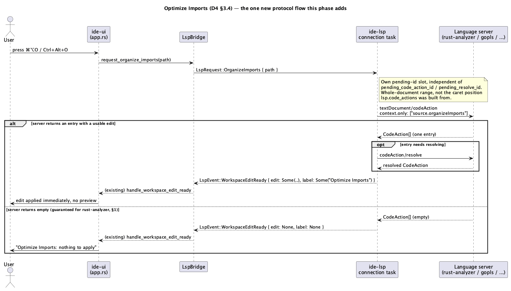

# Code Generation (D4)

## 1. Purpose

`docs/roadmap.md` names this the last phase of Track D: "Меню Generate
(Alt+Insert), Implement/Override Members, Create Test, Auto Import
(быстрое исправление на неизвестном символе), Optimize Imports
(`source.organizeImports`) — всё поверх code actions." Like `refactor-this
.md` (D2), every one of these is built entirely on the already-merged
`code-actions.md` (A8) machinery — `textDocument/codeAction`, the ambient
per-caret cache (`lsp.code_actions`), `codeAction/resolve`, and
`WorkspaceEdit` application. Nothing here adds a new *kind* of protocol
interaction except one: Optimize Imports needs a `context.only`-filtered,
auto-applied request shape the existing per-caret cache doesn't cover
(§2.1, §3.4).



**Ground truth this doc is built on, verified against rust-analyzer's own
source rather than assumed** (`crates/ide-assists/src/lib.rs`,
`crates/ide-db/src/assists.rs`, `crates/rust-analyzer/src/lsp/to_proto.rs`
on `rust-lang/rust-analyzer@master`, read directly — not recalled from
training data):

- rust-analyzer's assists carry one of six `AssistKind`s:
  `QuickFix`, `Generate`, `Refactor`, `RefactorExtract`, `RefactorInline`,
  `RefactorRewrite`. `to_proto::code_action_kind` maps the first five to
  the LSP `CodeActionKind`s `refactor-this.md` §3.2 already keys its
  heuristic on (`"quickfix"`, `"refactor"`, `"refactor.extract"`,
  `"refactor.inline"`, `"refactor.rewrite"`) — **but `AssistKind::Generate`
  maps to `lsp_types::CodeActionKind::Empty`**, i.e. the literal string
  `""`, sent unconditionally as `kind: Some(code_action_kind(...))` (never
  omitted). This is the one wire fact this whole phase's design pivots on
  (§3.2): unlike D2's refactor-kind actions, **every "Generate"-category
  action rust-analyzer offers is wire-indistinguishable from "no kind at
  all" by kind string alone** — `ide_lsp::CodeAction.kind` for one of
  these is `Some("".to_string())`, not `None` and not `Some("generate")`
  (there is no such LSP kind). Filtering on `kind == Some("")` is still
  reliable (rust-analyzer always sends `Some(...)`, never omits the
  field, confirmed by the same `to_proto.rs` line), it just can't lean on
  a `starts_with` prefix the way every other category can.
- Two concrete assists back Implement/Override Members:
  `add_missing_impl_members`/`add_missing_default_members`
  (`crates/ide-assists/src/handlers/add_missing_impl_members.rs`), both
  `AssistKind::QuickFix` (so `kind: Some("quickfix")` — the same kind as
  every ordinary diagnostic fixit, distinguished only by title), titled
  **exactly** `"Implement missing members"` and `"Implement default
  members"`. Both require the caret positioned inside an `impl Trait for
  Type { ... }` block with at least one missing member — `ctx.
  find_node_at_offset::<ast::Impl>()` returns `None` (so the assist
  doesn't fire at all) for a caret anywhere else, and the "default
  members" title reads *members with a default implementation not yet
  overridden*, which is what JetBrains calls "Override," not what its own
  title literally says — a naming mismatch this phase's UI accepts as-is
  (mapping our `Ctrl+O` binding to the "default members" title), not
  something to paper over with an invented label.
- There is **no** rust-analyzer assist for generating a test (searched
  the full alphabetic handler list in `ide-assists/src/lib.rs` and the
  assists reference book — no `generate_test`/`create_test`/anything
  test-shaped exists). Create Test has no code action to invoke for Rust,
  full stop, today.
- There is **no** rust-analyzer assist, of any kind, whose LSP
  `CodeActionKind` starts with `"source."` — the six-way `AssistKind`
  match above is exhaustive and none of its five real targets is a
  `source.*` string. A `textDocument/codeAction` request with
  `context.only: ["source.organizeImports"]` against rust-analyzer is
  therefore **guaranteed** to come back empty, not just "commonly empty in
  practice" — confirmed by reading the conversion function, not inferred
  from the GitHub issues (`rust-lang/rust-analyzer#5131`,
  `#8107`) that independently report the same experience from the outside.
  A differently-configured language server for another language in a
  multi-language project (`multi-language-projects.md`) may well answer
  this properly (`gopls` is the commonly-cited example that does) — this
  phase's Optimize Imports is written generically against the protocol,
  not against "whatever rust-analyzer happens to support," precisely so
  that case works without special-casing.
- Auto-import assists (`auto_import`, `qualify_path` —
  `crates/ide-assists/src/handlers/auto_import.rs`/`qualify_path.rs`) are
  `AssistKind::QuickFix`, fired purely from cursor position (no
  requirement that the client's `context.diagnostics` name anything —
  confirmed by `code-actions.md` §1's own already-documented finding that
  "rust-analyzer still returns its full standard fix/refactor menu for a
  range computed from its own internal diagnostic pass, independent of
  what the request's `context.diagnostics` says"). **This means Auto
  Import is already fully delivered by A8's existing `⌥↩` menu today —
  putting the caret on an unresolved name and pressing `⌥↩` already lists
  `"Import `foo::Bar`"` as an ordinary cached action.** This phase adds
  no code for it; §3.6 records this as a verified-already-satisfied
  roadmap line, not a silent scope cut.

## 2. Interface / API

### 2.1 `ide-lsp` (additions to the existing public API)

Only Optimize Imports needs a new request/response shape — Generate,
Implement Methods, Override Methods, and Create Test are pure `ide-ui`-side
filters/heuristics over the already-existing `LspRequest::CodeAction`/
`ApplyCodeAction` pair and add nothing here.

```rust
pub enum LspRequest {
    // ... existing: DidOpen, DidChange, DidClose, References, Goto,
    //     Hover, DocumentHighlight, InlayHint, CodeAction,
    //     ApplyCodeAction ...
    /// "Organize imports for `path`, and apply the result immediately if
    /// there is one." A `textDocument/codeAction` request scoped to
    /// `context.only: ["source.organizeImports"]`, resolved via
    /// `codeAction/resolve` first if the server marked it unresolved and
    /// advertises `resolveProvider` (exact same resolve-or-not branch
    /// `ApplyCodeAction` already has, reused rather than duplicated),
    /// ending in exactly one `LspEvent::WorkspaceEditReady` — never a
    /// menu, never populates `last_code_actions`/the ambient cache
    /// `CodeAction`'s own response fills (§3.4 explains why sharing that
    /// cache would be actively wrong here). Own pending-id slot
    /// (`pending_organize_imports_id`), independent of
    /// `pending_code_action_id`/`pending_resolve_id`, same reasoning
    /// every other request kind's own slot already establishes
    /// (`code-actions.md` §3.2) — an ambient `⌥↩`/gutter-lightbulb
    /// re-query firing while an Optimize Imports request is in flight
    /// (or vice versa) must not be confused with it.
    OrganizeImports { path: PathBuf },
}
```

`LspEvent` gets no new variant: a successful organize reuses
`WorkspaceEditReady { edit: Some(..), label: Some("Optimize Imports") }`
exactly as `ApplyCodeAction` already produces it; "nothing to organize"
(the guaranteed-empty rust-analyzer case, or a server that answered but
had nothing to change) reuses `WorkspaceEditReady { edit: None, label:
None }` exactly as `ApplyCodeAction`'s own "not found"/"no edit, not
resolvable" branches already do — `ide-ui`'s existing `handle_workspace_
edit_ready` needs no change to correctly render either outcome (§3.5).

`LspBridge` (`crates/ui/src/lsp_bridge.rs`) gets one new method, the same
shape as its existing `apply_code_action`:

```rust
impl LspBridge {
    /// Routes to the client covering `path` (multi-language-safe, same
    /// `send(path, request)` dispatch every other per-file request already
    /// uses) and sends `LspRequest::OrganizeImports`. Fire-and-forget --
    /// no target-tracking field like `code_actions_target`, since there is
    /// no ambient re-query to dedupe against (§3.4): this is only ever
    /// sent in direct response to the user invoking Optimize Imports
    /// (palette-only, §2.2 — no default keybinding).
    pub fn request_organize_imports(&mut self, path: &Path);
}
```

### 2.2 `ide-ui` (`crates/ui/src/app.rs`, `command.rs`, `app/render.rs`)

No new `ide-core` API — every edit still flows through the existing
`ide_core::workspace_edit`/`apply_workspace_edit` pipeline `code-actions
.md` §2.2 already established; this phase only decides *which* cached (or,
for Optimize Imports, freshly one-shot-fetched) `CodeAction` a new command
reaches for and *how* its result reaches the screen.

```rust
/// The three direct-invoke heuristics this phase adds (Generate menu's
/// own filter is simpler still -- kind-equals-empty-string alone, no
/// title check, §3.1 -- so it isn't a fourth variant here). A sibling
/// enum to `DirectRefactorKind` (`refactor-this.md` §2.2), not a variant
/// added to it, since its `matches` heuristic is a genuinely different
/// shape (kind-equals-empty-string-or-quickfix plus title, not
/// kind-starts-with plus title; see §1's `AssistKind::Generate` finding).
#[derive(Clone, Copy, Debug, PartialEq, Eq)]
enum DirectGenerateKind {
    ImplementMethods,
    OverrideMethods,
    CreateTest,
}

impl DirectGenerateKind {
    fn name(self) -> &'static str;

    /// `title`-substring match (case-insensitive), gated by `kind`:
    /// `ImplementMethods`/`OverrideMethods` require `kind ==
    /// Some("quickfix")` (§1) and `title` containing "implement missing
    /// members"/"implement default members" respectively; `CreateTest`
    /// requires no particular `kind` (deliberately -- no server this
    /// project ships today has a test-generation assist to have observed
    /// a kind for, so this stays maximally permissive: any cached action
    /// whose title contains "test", from any configured language
    /// server, is accepted) and matches on `title` containing "test".
    fn matches(self, action: &ide_lsp::CodeAction) -> bool;
}

// `IdeApp` field additions:
struct IdeApp {
    // ... existing ...
    /// Mirrors `show_refactor_menu_popup` exactly (`refactor-this.md`
    /// §2.2) -- a boolean toggle, not new cached data; the popup itself
    /// filters `lsp.code_actions` live off the same ambient cache A8
    /// already keeps warm.
    show_generate_menu_popup: bool,
}
```

```rust
impl IdeApp {
    /// `⌘N`/`Alt+Insert`'s entry point. Same "open on whatever's cached"
    /// shape `trigger_refactor_this` established, filtered to
    /// `kind.as_deref() == Some("")` instead of a `starts_with` prefix
    /// (§1, §3.2) -- no-op with an error ("Generate: nothing to generate
    /// here") if no cached action matches.
    fn trigger_generate_menu(&mut self);

    /// A Generate popup row click: closes the popup, applies immediately
    /// -- reuses `select_code_action` verbatim (the exact same method
    /// the ordinary `⌥↩` popup's row click already calls), not the
    /// Refactor Preview path D2's popup uses (§3.3 explains why no
    /// preview here).
    fn select_generate_action(&mut self, index: usize) {
        self.select_code_action(index)
    }

    /// `Ctrl+I`/`Ctrl+O`/`⌘⇧T`'s shared entry point -- same shape as
    /// `trigger_direct_refactor`
    /// (`refactor-this.md` §3.2), but applies immediately
    /// (`self.lsp.apply_code_action(index)`) rather than going through
    /// `apply_code_action_via_preview` (§3.3). No-op with an error
    /// ("<name>: not available here") if no cached, non-disabled action
    /// matches `kind.matches(action)`.
    fn trigger_direct_generate(&mut self, kind: DirectGenerateKind);

    /// Optimize Imports' entry point (palette-only, §2.2). Unlike every
    /// other command in this phase, reaches for nothing in
    /// `lsp.code_actions` -- sends a
    /// fresh `LspRequest::OrganizeImports` every time it's invoked (§3.4:
    /// the ambient per-caret cache is the wrong data source for a
    /// whole-file, `context.only`-scoped request). The resulting
    /// `WorkspaceEditReady` (`edit: None` almost always, for rust-analyzer
    /// specifically -- §1) flows through the existing, unmodified
    /// `handle_workspace_edit_ready` -- `edit: None` there already
    /// renders as "Optimize Imports: nothing to apply", the same message
    /// shape every other "no edit" outcome already gets, no new UI string
    /// plumbing needed.
    fn trigger_optimize_imports(&mut self) {
        // Reuses the existing `find_usages_target` accessor purely for its
        // path half -- the same "no active tab / no path" `None` case
        // every other per-file command already treats as a silent no-op,
        // not a new "what counts as the active file" concept.
        let Some((path, _)) = self.find_usages_target() else {
            return;
        };
        self.lsp.request_organize_imports(&path);
    }
}
```

`command.rs`'s `CommandAction` enum gains five variants
(`GenerateMenu`, `ImplementMethods`, `OverrideMethods`, `CreateTest`,
`OptimizeImports`) and five `Command` registry entries, category
`"Refactor"` (same category D1–D3 already share — this is Track D's home
in this project's palette regardless of which JetBrains top-level menu
each command lives under upstream):

| Command | mac | other | Binding shape |
|---|---|---|---|
| Generate | `⌘N` | `Alt+Insert` | genuine two-chord `Binding` (not `same` — a real divergence, not a modifier substitution: `Binding { mac: KeyChord::new(Key::N).command(), other: KeyChord::new(Key::Insert).alt() }`) |
| Implement Methods | `⌃I` | `Ctrl+I` | `Binding::same(KeyChord::new(Key::I).ctrl())` — literal Control on both, same reasoning `RefactorThis`'s own `⌃T` binding already documents |
| Override Methods | `⌃O` | `Ctrl+O` | `Binding::same(KeyChord::new(Key::O).ctrl())` |
| Optimize Imports | *(none)* | *(none)* | `binding: None` — see note below |
| Create Test | `⌘⇧T` | `Ctrl+Shift+T` | `Binding::same(KeyChord::new(Key::T).command().shift())` — JetBrains' real "Go to Test" binding (§4's scope note: this phase only ever *creates*, never *navigates to an existing test*, under that same binding) |

**Optimize Imports has no default binding, on either platform, per
`CLAUDE.md`'s "never invent a binding — if the action doesn't have one,
register it with no default binding" rule.** This was checked directly
against three official JetBrains help pages (the mac keymap reference,
the general keyboard-shortcuts reference, and the Reformat/Optimize
Imports doc page itself) rather than assumed from the mechanical
Cmd→Ctrl-substitution pattern most of this project's other bindings
follow — none of the three lists a dedicated shortcut for this action;
JetBrains reaches it through the Code menu or the Reformat File dialog's
checkbox, not a standalone keybinding. This also resolves what would
otherwise be a real collision: a naive Cmd→Ctrl-substituted guess of
`⌘⌥O` is already `GoToSymbol`'s own, genuine, verified JetBrains binding
(`command.rs`, `search-everywhere.md`/C2) — inventing a second command on
top of it would have broken an existing one. Reachable from the command
palette only (`FindAction`, `⌘⇧A`), exactly like `ToggleDockerPanel`/
`ToggleK8sPanel`/several other already-merged commands with no natural
JetBrains binding to relocate.

`app/render.rs` gains one new popup function:

```rust
/// `⌘N`/`Alt+Insert`'s popup. Identical row rendering to
/// `render_refactor_menu_popup` (title, `★` for `is_preferred`,
/// disabled-with-tooltip for `disabled_reason`) -- the *only* difference
/// from that function is the filter predicate
/// (`kind.as_deref() == Some("")` instead of `starts_with("refactor")`)
/// and which trigger a row click calls (`select_generate_action`, not
/// `select_refactor_action`). Window title "Generate". Empty-list message
/// "Nothing to generate here."
fn render_generate_menu_popup(&mut self, ctx: &egui::Context);
```

No new dialog for Optimize Imports (§2.1: it never shows a menu) and none
for Implement/Override/Create Test (§3.3: immediate apply, same as every
ordinary `⌥↩` single-selection today).

## 3. Behaviour

### 3.1 Generate menu (`⌘N` / `Alt+Insert`)

Opens a popup listing every entry in `lsp.code_actions` whose `kind` is
`Some("")` — in practice, for rust-analyzer, this means whatever subset
of `generate_getter_or_setter`/`generate_new`/`generate_derive`/
`generate_impl`/`generate_trait_impl`/`generate_delegate_methods`/
`generate_deref`/… fires at the caret's current position (each assist
decides its own applicability the same way `add_missing_impl_members`
does — a struct/enum definition offers getters/setters/derive, a bare
type name near an unimplemented trait offers `generate_impl_trait`, and
so on; this phase does not special-case *which* Generate assists exist,
it only knows how to find the category). Selecting a row applies it
immediately (§2.2) — no preview, matching real JetBrains behavior for
Generate menu items (they insert code directly, not through a reviewable
diff). Opening with nothing available shows an inline "Nothing to
generate here" message inside the popup, matching `render_refactor_menu_
popup`'s own empty-state convention exactly, rather than the trigger
function refusing to open a popup at all (kept consistent between the two
sibling menus for the same reason they share a row-rendering shape).

### 3.2 Implement Methods (`Ctrl+I`) / Override Methods (`Ctrl+O`)

Each searches the same ambient `lsp.code_actions` cache A8 already keeps
warm (no new request) for a non-disabled entry with `kind ==
Some("quickfix")` and a title containing, case-insensitively, "implement
missing members" (Implement Methods) or "implement default members"
(Override Methods) — §1's exact rust-analyzer title strings. Found →
applied immediately via `self.lsp.apply_code_action(index)`, resolving
first if the server marked it unresolved (unchanged, existing
`ApplyCodeAction` logic — nothing about *how* an action gets applied
changes here, only *which* action a direct command reaches for). Not
found (caret isn't inside an `impl ... for ... { }` block with missing
members, or every trait member is already implemented/overridden) →
`self.error = Some("Implement Methods: not available here")` (or
"Override Methods:"), the identical wording shape `trigger_direct_
refactor` already uses for `ExtractField`'s own frequently-unavailable
case (§1: rust-analyzer's "default members" title genuinely can produce
zero missing entries once everything required is filled in, at which
point the assist itself doesn't fire — a real, expected "not available"
outcome, not a heuristic failure).

### 3.3 Create Test (`⌘⇧T` / `Ctrl+Shift+T`)

Same shape as §3.2: searches `lsp.code_actions` for any non-disabled
entry whose title contains "test" (case-insensitive), regardless of
`kind` (§2.2's `DirectGenerateKind::matches` note — deliberately
permissive, since no shipped server has a kind to have been observed
for this yet). For every language this project ships a server config
for today, this **always** reports "Create Test: not available here"
(§1 — no rust-analyzer assist exists to ever match) — registered and
bound anyway per `CLAUDE.md`'s "never invent a binding, use it verbatim
even if this server never satisfies it" rule, the identical precedent
`refactor-this.md` §1 already set for `ExtractField`. Should a future
`custom_languages` entry (`global-search-and-languages.md`,
`language-server-arguments.md`) point at a server that *does* offer a
test-generation code action, this command starts working for that
language's files with no code change — the whole point of matching by
title/kind over the existing cache rather than hardcoding "there is no
such thing."

### 3.4 Optimize Imports (palette-only, no default binding — §2.2)

The one behavior in this phase that is not "filter the existing ambient
cache differently." Every other command above reads `lsp.code_actions`,
which was populated by a *caret-position* `textDocument/codeAction`
request (`code-actions.md` §3.2) — correct for Generate/Implement/
Override/Create Test, since every one of their backing assists is itself
position-triggered (inside an impl block, on a struct definition, etc.).
Optimize Imports is conceptually whole-file, LSP's own `"source.*"` kind
family exists precisely to mean "not tied to a cursor position" — reusing
the caret-position cache here would silently miss (or, worse,
inconsistently catch) an organize-imports action depending on where the
caret happened to be, which is not what "Optimize Imports" means in any
IDE that has the feature. So this command:

1. Sends `LspRequest::OrganizeImports { path }` unconditionally (no
   ambient cache to check first — this is a rare, direct action, not
   something worth keeping warm on every keystroke the way `⌥↩`'s data
   is).
2. `ide-lsp` issues `textDocument/codeAction` for that file with
   `context: { only: ["source.organizeImports"], diagnostics: [] }` and a
   range covering the whole document (`{0,0}` to the last line's last
   character — the one place in this phase that needs to know the
   document's extent; read from the same already-open buffer/disk source
   `ApplyCodeAction`'s resolve step already reads text from, not a new
   I/O path).
3. Empty response (rust-analyzer, always — §1) or a response whose first
   entry has no edit and isn't resolvable → emits `WorkspaceEditReady {
   edit: None, label: None }`, which `handle_workspace_edit_ready`
   already renders as a one-line "nothing to apply" message (unchanged
   handler, per §2.1).
4. A response with a usable first entry → resolves it if needed (same
   branch shape `ApplyCodeAction` already has) → emits `WorkspaceEditReady
   { edit: Some(..), label: Some("Optimize Imports") }` → applied
   immediately by the existing handler, exactly like any other
   already-applied `CodeAction` today.

No popup at any point, even if a server hypothetically returned more than
one `source.organizeImports` entry (not expected — `source.*` actions are
conventionally singular per kind, one merged edit for the whole file, and
nothing in this project's currently-configured servers does otherwise);
the first entry wins, silently, the same "first match wins, no
disambiguation UI" simplification `refactor-this.md` §1 already accepted
for its own direct commands.

### 3.5 Auto Import — already delivered, nothing added

§1 traced this to its root: rust-analyzer's `auto_import`/`qualify_path`
assists are ordinary `QuickFix`-kind, caret-position-triggered code
actions, already returned by the exact same `textDocument/codeAction`
request `⌥↩` (`ShowIntentionActions`, A8) already sends and already
displays. Putting the caret on an unresolved name and pressing `⌥↩` today
already lists `"Import `some::Path`"` (or, for an ambiguous name,
multiple `qualify_path` candidates) as an ordinary selectable row — that
*is* Auto Import, in the exact form the roadmap line names it ("quick fix
on an unresolved symbol"). This phase makes no code change for it and
adds no command: doing so would either duplicate `⌥↩`'s existing menu
under a second name, or need an invented keybinding for "run the single
best import fix without opening a menu" — a feature JetBrains itself
doesn't bind by default either (its own auto-import is a background
completion-time behavior, and its explicit action *is* Alt+Enter). Noted
here, in behavior, rather than silently dropped from scope.

### 3.6 Roadmap-line disposition summary

| Roadmap item | This phase's answer |
|---|---|
| Generate menu | New popup, new trigger, §3.1 |
| Implement/Override Members | Two new direct commands, §3.2 |
| Create Test | New direct command, registered but unsatisfiable for every shipped server today, §3.3 |
| Auto Import | Already delivered by A8 — zero new code, §3.5 |
| Optimize Imports | New `ide-lsp` request/flow, guaranteed empty for rust-analyzer specifically but generically correct, §3.4 |

## 4. Constraints & invariants

- **Kind-empty-string filtering is exact, not "falsy."** `kind.as_deref()
  == Some("")` must be spelled that way, not `kind.is_none() ||
  kind.as_deref() == Some("")` — a `None` kind means "this response
  didn't carry a kind field at all" (a bare `lsp_types::Command`, or a
  server that omits `kind`), never observed from rust-analyzer (§1) and
  not something this phase should treat as "must be Generate" by default;
  conflating the two would silently misclassify a hypothetical
  kindless action from a different configured server.
- **`DirectGenerateKind::CreateTest`'s permissive (kind-agnostic) match is
  deliberate, not a placeholder to tighten later.** Every other heuristic
  in this project (D2's five, this phase's Implement/Override) narrows on
  `kind` *because* a real, observed kind exists to narrow on. There is
  none to observe for test generation from any server this project
  configures today (§1) — inventing one (e.g. requiring `kind ==
  Some("quickfix")` on the unverified guess that a future server would
  use that kind) would risk excluding the very server this command is
  written to eventually work with, for no verified benefit today.
- **Optimize Imports never touches `lsp.code_actions`/`last_code_actions`
  in either direction** — it neither reads the ambient cache to decide
  whether to fire (§3.4, point 1) nor leaves anything behind in it
  afterward. A `⌥↩`/gutter-lightbulb query already in flight when
  Optimize Imports is invoked, or vice versa, must resolve independently and correctly
  regardless of which finishes first — the two independent pending-id
  slots (§2.1) are what makes this true; this is a hard invariant, not an
  optimization detail, since a shared slot would let one silently
  overwrite the other's in-flight id and misdeliver whichever response
  arrives second (`code-actions.md` §3.2 established exactly this
  reasoning for `CodeAction` vs. `ApplyCodeAction`'s own resolve id, and
  it applies identically here).
- **Immediate apply, never preview, for every command in this phase.**
  D2's Refactor Preview exists for operations whose blast radius benefits
  from a diff review before committing (multi-file rename/extract/inline).
  Every command here is single-location (Generate/Implement/Override) or
  whole-file-but-mechanical (Optimize Imports) — matching real JetBrains
  behavior for all of them (none show a diff before applying) and adding
  zero new dialog code. This is a considered scope boundary, not an
  oversight: if a future Generate assist turns out to be large/risky
  enough to want review, that's a reason to route *that specific* action
  through the existing preview machinery, not a reason to gate this whole
  phase behind it now.
- **`context.only` is additive to the protocol, never sent by any other
  request in this codebase.** The existing `LspRequest::CodeAction`
  (caret-position, used by `⌥↩`/gutter-lightbulb/Refactor This/Generate/
  Implement/Override/Create Test) continues to omit `context.only`
  entirely, exactly as today — only `OrganizeImports`'s internal request
  sets it. No existing call site's wire behavior changes.
- **A server that never responds to `OrganizeImports`'s request behaves
  like any other unanswered LSP request already does** — no new timeout
  logic; the existing pending-id-slot/response-matching machinery already
  handles "no response arrives" identically everywhere it's used (the
  slot just stays occupied; a later successful response or, for a truly
  hung server, a restart/reconnect clears it the same way any other
  in-flight request's slot would).
- **Whole-document range computation reads text, never writes it, and
  never touches a buffer that isn't already open or already on disk** —
  same read source `ApplyCodeAction`'s resolve step and `refactor-this
  .md`'s Refactor Preview diffing already read from (open tab's buffer if
  any, else a fresh disk read); no new file-system write path, no new
  security-sensitive surface beyond what `code-actions.md`'s own
  `apply_workspace_edit_to_disk` already is.

## 5. Examples

**Generate a getter, then a `Debug`/`Default` derive:**

```
// caret on `age` inside:
struct Player { age: u32 }
```

Press `⌘N` → popup lists (among whatever else applies at that exact
position) "Generate getter", "Generate setter" — both `AssistId::
generate(..)`, `kind: Some("")`. Move the caret to the `struct Player`
line itself and press `⌘N` again → "Add `#[derive]`" (`generate_derive`)
now appears instead (different assists apply at different positions,
exactly like every other position-triggered assist in this project).
Selecting either applies immediately; no preview dialog appears.

**Implement Methods:**

```rust
trait Shape { fn area(&self) -> f64; fn name(&self) -> &str { "shape" } }
impl Shape for Circle { }
//                     ^ caret anywhere inside these braces
```

`Ctrl+I` → finds the cached `"Implement missing members"` action
(`kind: Some("quickfix")`) → applies immediately, inserting a
`todo!()`-bodied `fn area(&self) -> f64` stub. `Ctrl+O` on the same
position instead finds `"Implement default members"` and inserts an
overridable `fn name(&self) -> &str { "shape" }` copy of the trait's
default body.

**Optimize Imports on a Rust file:**

Invoking Optimize Imports anywhere in a `.rs` file → `ide-lsp` sends the `source.
organizeImports`-scoped request → rust-analyzer's response is empty
(§1, guaranteed) → status line reads "Optimize Imports: nothing to
apply". This is the expected, correct outcome for every Rust file this
project can open today, not a bug to chase.

**Optimize Imports on a Go file (multi-language project, `gopls`
configured):**

Same command, same `ide-lsp` request shape, different server on the
other end of the same `LspBridge::send(path, ..)` dispatch
(`multi-language-projects.md` §2.2's client-routing already handles this
transparently) — `gopls` is documented as one of the servers that *does*
implement `source.organizeImports` meaningfully, so this is expected to
actually reorganize imports and apply an edit, the first real end-to-end
exercise of the "not just for Rust" half of this design.

**Create Test on any file today:**

`⌘⇧T` → no cached action's title contains "test" for any currently
configured server → "Create Test: not available here". Documented,
expected, not a defect (§3.3).

## 6. Dependencies & integration points

- `code-actions.md` (A8) — every mechanism this phase reuses
  (`textDocument/codeAction`, `codeAction/resolve`, `WorkspaceEdit`
  application, the `lsp.code_actions` ambient cache) already exists there;
  this phase adds one new request kind (`OrganizeImports`) and several new
  consumers of the existing cache, nothing to A8 itself.
- `refactor-this.md` (D2) — direct precedent for "kind/title heuristic
  over the existing cache, no new protocol concept" (§1's `AssistKind`
  research is this phase's version of that same exercise) and for the
  registry/binding shapes this phase's table in §2.2 follows.
- `multi-language-projects.md` — `LspBridge::send(path, request)`'s
  per-file client routing is what makes Optimize Imports meaningfully
  different across a Rust file and a Go file in the same project (§5); no
  change needed there, this phase is purely a new caller of an existing
  dispatch primitive.
- `docs/roadmap.md` §Track D, item D4 — this document's own source of
  scope; §3.6 records this phase's disposition against every named
  roadmap line, including the one (Auto Import) this phase deliberately
  adds no code for.
- Not security-sensitive per `CLAUDE.md`'s declared list — this phase
  touches no subprocess, no path outside `apply_workspace_edit_to_disk`'s
  already-audited write path (unchanged here), and no network I/O beyond
  the already-established, already-audited LSP JSON-RPC channel
  `crates/lsp/**` already is. `hacker` is expected to be skipped for the
  `ide-lsp` role's diff on that basis, subject to `rev`'s own
  security-checklist pass confirming no new surface was introduced (the
  same confirm-don't-assume posture `refactor-this.md` and
  `file-structure-and-breadcrumbs.md` already took for their own
  no-hacker calls).
