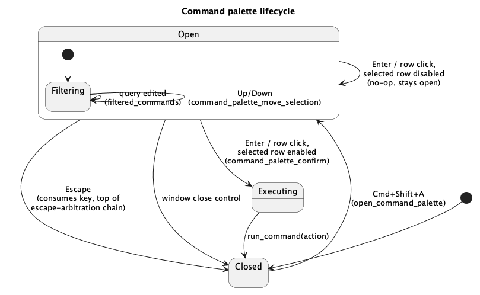

# Command palette (B3)

## 1. Purpose

Every keyboard shortcut in `ide-ui` today is read directly off `egui`'s
input queue inside `handle_shortcuts` (`crates/ui/src/app/render.rs`) — ten
separate `i.modifiers.* && i.key_pressed(...)` checks, one per action, with
no shared representation. That means a binding can't be listed anywhere,
can't be looked up by name, and can't be reassigned: the only way to
discover what `⌘B` does is to read the source.

This feature introduces the **command registry** — the single, static list
of every invokable action in the app (id, title, category, default
keybinding, an `enabled` predicate, and the action itself) — and the
**command palette**, a `⌘⇧A` ("Find Action", per the JetBrains macOS
keymap) fuzzy-searchable popup that lists every registered command and
runs the one the user picks.

The registry is deliberately the *only* thing this phase builds toward
rebinding — it does not implement rebinding itself. `docs/roadmap.md` §6
schedules the editable-keymap overlay as **G2**, immediately after this
phase, specifically because G2 needs a registry to overlay onto. Until G2
lands, every command's binding is fixed at its JetBrains-macOS default.

This closes CLAUDE.md's outstanding "Keyboard shortcuts" requirement:
*"Once the command registry lands (roadmap phase `B3`), no feature code
reads keyboard input directly."* The six-and-counting hardcoded checks in
`handle_shortcuts` are replaced by one loop over the registry; two
narrowly-scoped exceptions remain (§4.5).

## 2. Interface

### 2.1 `crates/ui/src/command.rs` (new module — pure data, no `IdeApp`)

```rust
/// A single modifier+key combination. Wraps `egui::Modifiers` directly
/// and compares via `Modifiers::matches_exact` (egui's own recommended
/// comparison) rather than field/struct equality: `egui::Modifiers`'s own
/// doc comment says non-mac backends set `ctrl` to the same value as
/// `command`, so a chord meaning "just the primary modifier" (`ctrl`
/// left `false`) would never match real non-mac input under naive
/// equality -- `matches_exact` special-cases exactly this.
#[derive(Clone, Copy, Debug, PartialEq, Eq)]
pub struct KeyChord {
    pub key: egui::Key,
    pub modifiers: egui::Modifiers,
}

impl KeyChord {
    pub const fn new(key: egui::Key) -> Self;
    pub const fn command(self) -> Self;   // Cmd (mac) / Ctrl (other)
    pub const fn shift(self) -> Self;
    pub const fn alt(self) -> Self;       // Option (mac) / Alt (other)

    /// True iff `input.modifiers.matches_exact(self.modifiers)` and
    /// `input.key_pressed(key)` fired this frame. Exact match, not "is a
    /// subset of", is what lets `⌘F` and `⌘⇧F` coexist as two distinct
    /// chords without either one needing to explicitly exclude the
    /// other's extra modifier.
    pub fn pressed(&self, input: &egui::InputState) -> bool;

    /// Display text for this chord: mac style uses the glyph row
    /// (⌃⌥⇧⌘) in JetBrains' own left-to-right order followed by the key
    /// name; non-mac style spells modifiers as words (`Ctrl+`, `Alt+`,
    /// `Shift+`) with `command`/`ctrl` both rendering as `Ctrl+` (there is
    /// no separate physical-Ctrl glyph need on non-mac). The key name
    /// itself is `format!("{:?}", self.key)` -- `egui::Key`'s `Debug` for
    /// every key this registry uses (`S`, `Z`, `F`, `G`, `B`, `A`, `R`,
    /// `F7`) already renders as the exact single-token label JetBrains
    /// uses, so no separate name table is needed.
    pub fn label(&self, mac_style: bool) -> String;
}

/// A command's default binding on each platform family. `other` is
/// spelled out explicitly, not derived, because -- per CLAUDE.md's
/// keyboard-shortcuts section -- only some JetBrains-macOS bindings
/// substitute modifiers mechanically (Cmd→Ctrl) and some genuinely
/// diverge (`Quick Documentation`: `F1` vs `Ctrl+Q`). Every command this
/// phase registers happens to be a pure substitution, but the type does
/// not encode that as an invariant, since a later phase's command will
/// need to diverge.
#[derive(Clone, Copy, Debug)]
pub struct Binding {
    pub mac: KeyChord,
    pub other: KeyChord,
}

impl Binding {
    /// Both platforms share the same chord (e.g. `⌥F7` -- Option and Alt
    /// are the same physical key, so there is nothing to substitute).
    pub const fn same(chord: KeyChord) -> Self;

    /// Resolves to `mac` when `cfg!(target_os = "macos")`, else `other`.
    pub fn for_platform(&self) -> KeyChord;
}

/// Every action `run_command` can perform. Deliberately a closed enum,
/// not a `fn(&mut IdeApp)` pointer or boxed closure: `command.rs` has no
/// `IdeApp` dependency (mirrors `find_bar.rs`'s "no egui/app dependency"
/// convention) and the match arms that actually call the existing
/// per-action methods (`try_save_active`, `undo_active`, ...) live in
/// `app.rs`, alongside those methods, so none of them need a visibility
/// change to `pub(crate)` just to be reachable from a sibling module.
#[derive(Clone, Copy, Debug, PartialEq, Eq)]
pub enum CommandAction {
    SaveAll,
    Undo,
    Redo,
    FindUsages,
    ShowUsages,
    FindInPath,
    Find,
    Replace,
    FindNext,
    FindPrevious,
    FindAction,
}

#[derive(Debug)]
pub struct Command {
    pub id: &'static str,
    pub title: &'static str,
    pub category: &'static str,
    pub binding: Option<Binding>,
    pub action: CommandAction,
}

/// The registry itself: every command this phase knows about, in a fixed
/// declaration order (used as the palette's tie-break/default order --
/// §3.2). `OnceLock` rather than rebuilding a `Vec` per call: the list is
/// `&'static [Command]`-shaped data that never changes at runtime before
/// G2 adds rebinding, so there is nothing to invalidate.
pub fn commands() -> &'static [Command];
```

### 2.2 `IdeApp` additions (`crates/ui/src/app.rs`, `crates/ui/src/app/render.rs`)

```rust
struct IdeApp {
    // ...
    command_palette_open: bool,
    command_palette_query: String,
    command_palette_selected: usize,
    pending_command_palette_focus: bool,
}

impl IdeApp {
    /// `⌘⇧A`. Resets the query, selects the first row, and requests
    /// focus for the query field next frame (`pending_command_palette_focus`
    /// -- same deferred-focus mechanism `open_find_bar` already uses for
    /// the find bar, `in-buffer-find-replace.md` §3.1).
    fn open_command_palette(&mut self);

    /// `Escape` while the palette owns it, its own close affordance, or a
    /// successful command execution (§3.4).
    fn close_command_palette(&mut self);

    /// True exactly while the palette is open -- checked by
    /// `handle_shortcuts`'s escape-arbitration chain (§3.5), same shape as
    /// the find bar's own escape-ownership check.
    fn command_palette_owns_escape(&self) -> bool;

    /// Every registered command whose `title` or `category` contains
    /// `command_palette_query`, case-insensitively, substring match (not
    /// fuzzy -- §4.2), in `command::commands()`'s declaration order.
    /// Pure function of `self.command_palette_query`, independently
    /// testable without an `egui::Context`.
    fn filtered_commands(&self) -> Vec<&'static command::Command>;

    /// Moves `command_palette_selected` by `delta` (`+1`/`-1` for
    /// Down/Up), wrapping at both ends of `filtered_commands()`. No-op on
    /// an empty filtered list.
    fn command_palette_move_selection(&mut self, delta: isize);

    /// `Enter`, or clicking a row: if the currently-selected filtered
    /// command is enabled (`is_command_enabled`), runs it and closes the
    /// palette -- except `FindAction`, which stays open in its
    /// freshly-reset state instead (§3.3); if the row is disabled, does
    /// nothing and leaves the palette open (§3.4).
    fn command_palette_confirm(&mut self);

    /// Whether `action` can actually do something right now -- e.g.
    /// `Find`/`Replace`/`FindNext`/`FindPrevious`/`SaveAll`/`Undo`/`Redo`/
    /// `FindUsages`/`ShowUsages` need `self.active_tab.is_some()`;
    /// `FindInPath` needs `self.project.is_some()` (the exact gate
    /// `handle_shortcuts` used to apply inline); `FindAction` is always
    /// enabled. Read by both the palette (to gray out a row) and
    /// `handle_shortcuts` (to decide whether a live keypress actually
    /// dispatches -- §3.3).
    fn is_command_enabled(&self, action: command::CommandAction) -> bool;

    /// The dispatch table: matches `action` to the existing private
    /// per-action method (`try_save_active`, `undo_active`, `redo_active`,
    /// `trigger_find_usages`, `trigger_find_usages_popup`, `trigger_search`,
    /// `open_find`, `open_replace`, `find_next`, `find_previous`,
    /// `open_command_palette`). Does not itself check `is_command_enabled`
    /// -- callers (`handle_shortcuts`, `command_palette_confirm`) check
    /// first, same as the methods above already no-op safely on their own
    /// preconditions (`§4.1`).
    fn run_command(&mut self, action: command::CommandAction);
}
```

## 3. Behaviour

### 3.1 Registry-driven shortcut dispatch

`handle_shortcuts` (`app/render.rs`) no longer contains one
`i.modifiers.* && i.key_pressed(...)` check per action. Instead, once per
frame, for every `cmd` in `command::commands()` with `cmd.binding.is_some()`:
read `ctx.input(|i| binding.for_platform().pressed(i))`; if it fired and
`self.is_command_enabled(cmd.action)`, call `self.run_command(cmd.action)`.
A disabled command's binding simply does nothing when pressed -- matching
every migrated action's existing behaviour (each of `try_save_active`,
`undo_active`, ..., already no-ops on missing preconditions; the enabled
check is new only for the palette's benefit, not a new refusal path for
the keyboard shortcut).

**While the palette is open, this loop is skipped entirely** except for
the `FindAction` binding itself (§3.2 covers what re-pressing `⌘⇧A` while
already open does). The palette is a modal-feeling overlay -- it already
takes top Escape priority (§3.5) precisely because it's "the most recently
opened thing the user expects input to go to" -- so a background `⌘S`
firing a real save while the user is only trying to type into the query
field would contradict that framing. This is a deliberate divergence from
the find bar, which does *not* suppress background shortcuts while its
query field has focus (`in-buffer-find-replace.md` has no such rule): the
find bar is inline, not an overlay claiming exclusive attention, so a
background `⌘S` firing while it's focused is unsurprising in a way it
would not be for a popup the user just explicitly summoned.

### 3.2 Opening and filtering

`⌘⇧A` calls `open_command_palette`. The palette renders as an
`egui::Window` (matching the existing Usages-popup/Languages-window
convention, `render_usages_popup`/`render.rs:599`) containing a single-line
query field and a scrollable list below it. On open the query is empty, so
`filtered_commands()` returns every command in registration order,
selection starts at index 0.

Pressing `⌘⇧A` again while the palette is already open re-runs
`open_command_palette` (§3.1's exception -- `FindAction`'s binding is the
one check `handle_shortcuts` still makes even while the rest of the loop
is suppressed, precisely so this can happen at all): the query and
selection reset to their just-opened state, same as if the palette had
been closed and reopened. This is a harmless, idempotent reset, not a
toggle -- `⌘⇧A` never closes the palette; only Escape, the window's close
control, or `command_palette_confirm` do (§3.4).

Every keystroke into the query field re-filters live (same "live search on
every keystroke" convention as the in-buffer find bar, `in-buffer-find-
replace.md` §3.2) via `filtered_commands()`; the selected index is *not*
preserved across a filter change that would make it point past the new
list's end -- it clamps to the last valid index, or resets to 0 if the
list becomes non-empty again after being empty. An empty result renders
"No matching actions." (matching the Usages popup's "No usages found." and
the search panel's "No results." conventions).

Each row renders `{title}` left-aligned and, if `binding.is_some()`, the
platform-appropriate `KeyChord::label()` right-aligned -- disabled rows
(`!is_command_enabled(cmd.action)`) render via `ui.add_enabled_ui(false,
...)`, egui's own dimmed/non-interactive styling (§8), not filtered out of
the list: a user searching "save" while no tab is open should still see
*that* the Save All command exists, just that it currently can't run,
exactly as JetBrains' own Find Action does for a genuinely inapplicable
action.

### 3.3 Navigation and execution

Arrow Down / Arrow Up move the selection via `command_palette_move_selection`,
wrapping past either end. Enter or a row click calls
`command_palette_confirm`: if the selected row is enabled, `run_command`
fires; if disabled, nothing happens and the palette stays open (no error,
no shake -- silently refusing an already-visibly-grayed-out row is not the
"never silence" truncation concern §2.1 in `in-buffer-find-replace.md`
describes, since the row's own rendering already communicated "this can't
run right now").

`command_palette_confirm` closes the palette after a successful
`run_command` for every action **except** `FindAction`: that action's own
effect *is* "the palette is open, freshly reset" (`open_command_palette`,
§2.2), so closing immediately afterward would silently undo what it just
did. Selecting "Find Action" from inside the palette itself is therefore
equivalent to pressing `⌘⇧A` again (§3.2) -- a reset, not a close.

### 3.4 Closing

Escape, the window's own close control, or a successful `command_palette_confirm`
all call `close_command_palette`, which clears `command_palette_open` and
`command_palette_query` (but not `command_palette_selected` -- it's
meaningless once the list is gone, and gets reset to `0` by the *next*
`open_command_palette` instead of being cleared here, avoiding a redundant
write on every one of the three close paths).

### 3.5 Escape ownership

The palette is layered above every other Escape claimant introduced so
far: it was, by construction, the most recently opened overlay, and a user
who just invoked `⌘⇧A` expects the very next `Escape` to dismiss exactly
that, even if a find bar or the Usages popup happens to be open underneath
it. `handle_shortcuts`'s arbitration chain (`in-buffer-find-replace.md`
§7's ordering) gains a new first link:

1. `command_palette_owns_escape()` → close the palette, consume the key.
2. else the find bar's existing check → close it, consume the key.
3. else the Usages-popup existing check → close it (already yields the
   key without consuming, per its pre-existing implementation).

Each earlier link already stops checking once a later one has consumed
the key this frame, so nesting three deep needs no new mechanism, only a
new first branch ahead of the two that already exist.

## 4. Constraints & invariants

1. `run_command` never checks `is_command_enabled` itself; every call site
   does. This mirrors every migrated action method's own existing
   no-op-on-missing-precondition behaviour (§3.1) rather than adding a
   second, possibly-divergent gate inside `run_command`.
2. Filtering is case-insensitive substring match on `title`/`category`,
   **not** a fuzzy/scored matcher. `docs/roadmap.md`'s **C2**
   (`search-everywhere.md`) is where a real fuzzy matcher and file/symbol
   index land in `ide-core`; this phase is UI-only (`docs/roadmap.md` §6,
   B3 row: role `ui`) and a dozen-command list doesn't need one yet. When
   C2's matcher exists, the palette should switch to it rather than this
   phase inventing a second one.
3. The registry is `ui`-only, `crates/ui/src/command.rs` — no `crates/
   core` changes. Every migrated action's underlying method already
   exists; this phase only adds a declarative index over calling them.
4. Binding conflict detection, user rebinding, persistence, and
   double-tap/accord mechanisms are explicitly **out of scope** — all four
   are `docs/roadmap.md`'s **G2** (`keymap.md`), which the roadmap places
   immediately after this phase precisely because it needs this registry
   to exist first (§6, B3/G2 rows).
5. **Two, and only two, exceptions to "no feature code reads keyboard
   input directly" survive this phase**, both pre-existing patterns this
   phase does not touch:
   - **Escape arbitration** (§3.5) stays a direct `ctx.input`/`consume_key`
     read in `handle_shortcuts`. It is not a single rebindable action but
     a priority chain across independent subsystems (palette, find bar,
     Usages popup, and — per `multiple-cursors.md` §3.6 — the editor's own
     multi-cursor collapse); a registry entry with one `id`/`binding`
     shape has nowhere to represent "whichever of four unrelated owners
     currently wants this key."
   - **The palette's own Up/Down/Enter navigation** (§3.3) is read
     directly the same way — widget-local list navigation of the
     currently-open overlay, analogous to a native list box's built-in
     arrow-key handling, not a globally invokable, rebindable command in
     its own right. (Escape *closing* the palette is still routed through
     the arbitration chain above, since closing on Escape is shared
     machinery with the find bar and Usages popup, not palette-specific.)

   Every other keyboard-triggered behaviour in `ide-ui` — the ten actions
   listed in §5.2 below plus `FindAction` itself — goes through the
   registry.

## 5. Default bindings this phase registers

Matches CLAUDE.md's keyboard-shortcuts section and `docs/roadmap.md` §5.2
exactly; every binding below is a straight relocation of a binding that
already exists today (`handle_shortcuts`, current `main`) into the
registry, not a new default. `ShowUsages`'s `⌘B` is a **known bug**,
carried over unchanged: `docs/roadmap.md` §5.3 documents that JetBrains
macOS reserves `⌘B`/`⌘Click` for Go to Declaration, and that fixing it —
alongside adding `definition`/`typeDefinition` support — is **C1**'s job,
not this phase's. Registering the current (wrong) binding is deliberate:
B3 relocates existing behaviour, it does not silently change it out from
under a later, dedicated fix.

| `id` | Title | Category | mac | other | `CommandAction` |
|---|---|---|---|---|---|
| `SaveAll` | Save All | File | `⌘S` | `Ctrl+S` | `SaveAll` |
| `Undo` | Undo | Edit | `⌘Z` | `Ctrl+Z` | `Undo` |
| `Redo` | Redo | Edit | `⌘⇧Z` | `Ctrl+Shift+Z` | `Redo` |
| `FindUsages` | Find Usages | Navigate | `⌥F7` | `Alt+F7` | `FindUsages` |
| `ShowUsages` | Show Usages | Navigate | `⌘B` | `Ctrl+B` | `ShowUsages` |
| `FindInPath` | Find in Path | Search | `⌘⇧F` | `Ctrl+Shift+F` | `FindInPath` |
| `Find` | Find | Edit | `⌘F` | `Ctrl+F` | `Find` |
| `Replace` | Replace | Edit | `⌘R` | `Ctrl+R` | `Replace` |
| `FindNext` | Find Next | Edit | `⌘G` | `Ctrl+G` | `FindNext` |
| `FindPrevious` | Find Previous | Edit | `⌘⇧G` | `Ctrl+Shift+G` | `FindPrevious` |
| `FindAction` | Find Action | Navigate | `⌘⇧A` | `Ctrl+Shift+A` | `FindAction` |

## 6. Examples

Registering and looking up a command (illustrates `command.rs`'s public
shape independent of any `egui::Context`):

```rust
let save = command::commands()
    .iter()
    .find(|c| c.id == "SaveAll")
    .unwrap();
assert_eq!(save.binding.unwrap().mac, KeyChord::new(egui::Key::S).command());
```

Filtering in the palette (illustrates `IdeApp::filtered_commands`):

```rust
app.command_palette_query = "find".into();
let hits: Vec<&str> = app.filtered_commands().iter().map(|c| c.title).collect();
// ["Find Usages", "Show Usages", "Find in Path", "Find", "Find Next",
//  "Find Previous", "Find Action"] -- every title containing "find",
// case-insensitively, in registration order. "Replace" is excluded even
// though it's in the same Edit category as "Find", since the match is
// against title/category text, not a hand-picked semantic grouping.
```

Opening, navigating, and confirming a disabled row is a no-op (illustrates
`open_command_palette`, `command_palette_move_selection`,
`command_palette_confirm`, and `is_command_enabled` together):

```rust
app.open_command_palette();
assert_eq!(app.command_palette_selected, 0);

app.command_palette_query = "save".into();
app.command_palette_move_selection(1); // wraps to the only match if there's one row

// No active tab -> SaveAll's `is_command_enabled` is false.
app.command_palette_confirm();
assert!(app.command_palette_open); // still open: the row was disabled, nothing ran

app.new_untitled_tab();
app.command_palette_confirm();
assert!(!app.command_palette_open); // now enabled: ran, and closed
```

## 7. Diagram



## 8. Dependencies & integration points

- **New:** `crates/ui/src/command.rs` — `KeyChord`, `Binding`,
  `CommandAction`, `Command`, `commands()`. No dependency beyond `egui`
  (for `Key`/`InputState`) — same "no `IdeApp` dependency" shape as
  `find_bar.rs`.
- `crates/ui/src/main.rs` — `mod command;`.
- `crates/ui/src/app.rs` — new `IdeApp` fields (§2.2), `open_command_palette`,
  `close_command_palette`, `command_palette_owns_escape`, `filtered_commands`,
  `command_palette_move_selection`, `command_palette_confirm`,
  `is_command_enabled`, `run_command`. Nine of the ten existing per-action
  methods needed no visibility change, since they were already defined in
  `app.rs` itself, the same module `run_command`'s match arms live in.
  `try_save_active` is the exception: it lives in `app/render.rs` (a child
  module), and Rust's privacy rules don't extend a private item's
  visibility to its *parent* module — only to the defining module and its
  descendants — so `run_command` calling it from `app.rs` needed it bumped
  from private to `pub(super)`, the minimal visibility that reaches
  exactly `app.rs` and no further.
- `crates/ui/src/app/render.rs` — `handle_shortcuts` rewritten per §3.1;
  new `render_command_palette(&mut self, ctx: &egui::Context)` following
  the `render_usages_popup` window pattern; the pre-existing Escape
  arbitration chain gains the new first branch (§3.5).
- `crates/ui/src/theme/**` — no changes needed. The palette's disabled-row
  rendering (§3.2) uses `ui.add_enabled_ui(is_command_enabled, |ui| { ...
  })`, egui's own mechanism for a visibly-but-not-interactively-rendered
  row; the dimmed text it produces already comes from `Theme::visuals`'s
  existing `weak_text_color: Some(c.fg_muted)` mapping (`theme/mod.rs`),
  not a new token.
- No `crates/core` or `crates/lsp` changes — this phase is `ui`-only per
  `docs/roadmap.md` §6's B3 row.

## Revision notes

Round 1 (`rev`, self-fixed during the same pass — see that review's
findings for the reasoning):

1. §3.1 gained an explicit rule that `handle_shortcuts`' registry loop is
   suppressed while the palette is open (except `FindAction`'s own
   binding) — the original draft left it silently ambiguous whether a
   background `⌘S` should fire while the user is typing into the palette's
   query field, which contradicted the "most recently opened overlay"
   framing §3.5 already relies on for Escape priority.
2. §3.2 gained a paragraph on what re-pressing `⌘⇧A` while already open
   does (an idempotent reset, not a close/toggle) — a direct consequence
   of fix 1 needing `FindAction` to stay reachable through the otherwise-
   suppressed loop.
3. §3.3 and `command_palette_confirm`'s doc comment (§2.2) now carve out
   `FindAction` from the close-after-run step: without the exception,
   selecting "Find Action" as a palette row would call `open_command_palette`
   and then immediately close what it just opened, a self-defeating flash
   the original draft didn't address.
4. §3.2's and §8's disabled-row rendering description were inconsistent
   with each other (one said "theme's existing disabled-text token", the
   other said no theme token exists and one may need adding) — resolved in
   favor of `ui.add_enabled_ui` plus the theme's already-existing
   `weak_text_color: Some(c.fg_muted)` mapping, verified present in
   `theme/mod.rs`, so no theme change is needed at all.
5. §6 gained a third example covering `open_command_palette` →
   `command_palette_move_selection` → `command_palette_confirm`
   (disabled-then-enabled) together — the original two examples covered
   only static lookup and filtering, leaving every state-mutating method
   without a usage example.

`rust-ui-dev` implementation (spec corrections, not a `rev` round):

6. §2.1's `KeyChord` changed from four flat `bool` fields to wrapping
   `egui::Modifiers` directly, and `pressed` now calls
   `Modifiers::matches_exact` instead of field-by-field equality. Found
   while implementing: `egui::Modifiers`'s own doc comment states that on
   Windows/Linux the backend sets `ctrl` to the *same value* as `command`
   (they're the same physical key there) -- so the originally-specified
   naive equality check (`self.ctrl == false` required for a plain
   `.command()` chord) would never have matched real non-mac input at
   all, since real input always has `ctrl == command` there. `egui`
   itself recommends `matches_exact`/`matches_logically` over raw
   equality for exactly this reason; using it instead of hand-rolling the
   same special-casing was both correct and less code.
7. §2.1's `KeyChord::ctrl()` builder was removed. It was speculative --
   this phase's eleven commands (§5) use only `command`/`shift`/`alt`,
   none use a literal-Control binding -- and an unused `pub` method in a
   `bin`-only crate (`ide-ui` has no `lib.rs`) is a hard `dead_code` lint
   failure under this project's `-D warnings` gate, not a style nit to
   silence with `#[allow]`. `docs/roadmap.md`'s future Control-only
   bindings (`⌃T`, `⌃G`, ...) can reintroduce it as a two-line addition to
   `egui::Modifiers` (which still has the field) exactly when a command
   actually needs it, matching CLAUDE.md's "don't design for hypothetical
   future requirements" convention.
8. §8 corrected: `try_save_active` needed a visibility bump
   (`pub(super)`), not zero visibility changes as originally claimed --
   see that section for why (it lives in `app/render.rs`, a child module
   of `app`, and Rust doesn't extend a private item's visibility to its
   parent).
