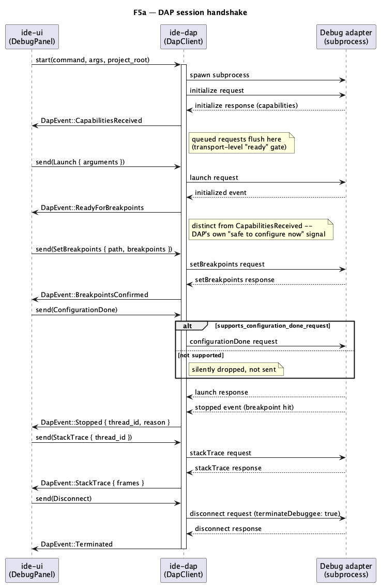

# Debugger — F5a: DAP client, session, breakpoints, stack

Implements the first sub-phase of **F5** (`docs/roadmap.md` Track F): a
new crate `ide-dap` speaking the Debug Adapter Protocol (DAP) over stdio,
plus enough `ide-core`/`ide-ui` plumbing to launch a debug session, set
line breakpoints from the editor gutter, and see threads/call stack for a
stopped program. **Out of scope for this doc** (later sub-phases per the
roadmap's own split): F5b (variables, watch, Evaluate Expression) and F5c
(conditional/logging breakpoints' *behavior*, hit-count breakpoints, and
any other capability this doc doesn't explicitly wire up). Terminal
integration (F2) and a real Run/Debug configuration picker (F1) are
separate, not-yet-built phases — see §3's "Debug" popup for how this doc
works around their absence.

## 1. Purpose

The IDE has no debugger at all today (`docs/roadmap.md` §2.5: "❌"). This
doc gives it one, generically: **one DAP client, adapter is config, not
code** — `codelldb`/`lldb-dap` (Rust/C/C++), `debugpy` (Python), `dlv dap`
(Go), `js-debug` (Node) must all work by pointing the same crate at a
different command, never by branching on language inside the crate
(`CLAUDE.md`'s dev-chain §3, `rust-dap-dev` hard rule).

## 2. Interface / API

### 2.1 New crate `ide-dap` (`crates/dap/**`, role `rust-dap-dev`)

Added to the workspace root's `Cargo.toml` `members` (the one sanctioned
out-of-scope line the `rust-dap-dev` skill allows on this creating run).

```toml
[dependencies]
serde = { version = "1.0.229", features = ["derive"] }
serde_json = { version = "1.0.151", features = ["raw_value"] }
thiserror = "1"
tokio = { version = "1.53.1", features = ["process", "io-util", "rt", "time", "macros", "sync"] }

[dev-dependencies]
tempfile = "3.27.0"
```

Same versions `ide-lsp` already pins (no new dependency approval needed
beyond what `rust-dap-dev`'s own skill already sanctions: `tokio`/`serde`/
`serde_json`/`thiserror`, all already in the project's table).

```rust
/// Spawns a debug adapter (must be on `PATH` or an absolute path) and
/// starts the connection. Returns as soon as the process spawns
/// successfully -- the `initialize` handshake completes asynchronously;
/// requests sent via `send` before `DapEvent::CapabilitiesReceived` fires
/// are queued internally and flushed once it does (mirrors
/// `ide_lsp::LspClient::start_with_command`'s own queueing exactly).
pub struct DapClient { /* private */ }

impl DapClient {
    /// `project_root` bounds every path this session hands back in a
    /// `StackFrame` (§3.6) -- canonicalized once, like `LspClient::
    /// start_with_command`.
    pub fn start(
        command: &str,
        args: &[String],
        project_root: impl AsRef<Path>,
    ) -> Result<Self, DapError>;

    /// Non-blocking; queues `request` for the background thread. See
    /// each `DapRequest` variant's own doc comment for the ordering
    /// contract this client does *not* enforce beyond the mandatory
    /// `initialize` handshake -- §3.2.
    pub fn send(&self, request: DapRequest);

    /// Non-blocking poll; call once per UI frame, in a loop, same
    /// contract as `LspClient::try_recv`.
    pub fn try_recv(&mut self) -> Option<DapEvent>;
}

#[derive(Debug, thiserror::Error)]
pub enum DapError {
    #[error("debug adapter not found on PATH: {0}")]
    AdapterNotFound(String),
    #[error("io error: {0}")]
    Io(#[from] std::io::Error),
    #[error("debug adapter protocol error: {0}")]
    Protocol(String),
}

pub enum DapRequest {
    /// Starts the debuggee. `arguments` is opaque, adapter-specific JSON
    /// the UI builds (`program`/`args`/`cwd` for `codelldb`, `module`/
    /// `console` for `debugpy`, ...) -- this crate never inspects it.
    Launch { arguments: serde_json::Value },
    /// Same shape as `Launch`, DAP's other debuggee-start verb.
    Attach { arguments: serde_json::Value },
    /// Replaces the *entire* breakpoint set for `path` (DAP's own
    /// semantics -- a partial "add one more" isn't expressible; the
    /// caller always sends the full current list for that file). Must
    /// not be sent before `DapEvent::ReadyForBreakpoints` fires for this
    /// session (§3.2) -- sending earlier is a caller bug, not something
    /// this client corrects for.
    SetBreakpoints { path: PathBuf, breakpoints: Vec<SourceBreakpoint> },
    /// Tells the adapter breakpoint configuration is finished and it may
    /// start running. A no-op (silently dropped) if
    /// `Capabilities::supports_configuration_done_request` is `false` --
    /// see §3.2.
    ConfigurationDone,
    Continue { thread_id: i64 },
    /// DAP's "step over".
    Next { thread_id: i64 },
    StepIn { thread_id: i64 },
    StepOut { thread_id: i64 },
    Pause { thread_id: i64 },
    Threads,
    StackTrace { thread_id: i64 },
    /// Detaches and kills the debuggee (`terminateDebuggee: true`) --
    /// every adapter must support `disconnect` per spec, unlike the
    /// optional `terminate` request, so this is what "Stop" always sends
    /// (§3.5).
    Disconnect,
}

/// One line breakpoint. `condition`/`hit_condition`/`log_message` are
/// carried and sent through to the adapter starting with this doc (an
/// adapter that supports them will honor them even now), but **this doc
/// builds no UI to set them** -- that's F5c. Plain `SourceBreakpoint {
/// line, condition: None, hit_condition: None, log_message: None }` is
/// all F5a's UI ever constructs.
#[derive(Debug, Clone)]
pub struct SourceBreakpoint {
    pub line: u32,
    pub condition: Option<String>,
    pub hit_condition: Option<String>,
    pub log_message: Option<String>,
}

pub enum DapEvent {
    /// The `initialize` **response** arrived -- not to be confused with
    /// the DAP **event** literally named `initialized` (`ReadyForBreak
    /// points`, below). This is the transport-level "ready" gate: queued
    /// requests flush right after this fires. See §3.2 for why these two
    /// "ready" concepts are deliberately kept as two separate variants.
    CapabilitiesReceived { capabilities: Capabilities },
    /// The adapter's `initialized` event arrived: safe to send
    /// `SetBreakpoints`/`ConfigurationDone` now.
    ReadyForBreakpoints,
    /// Answers a `SetBreakpoints` request: which lines the adapter
    /// actually accepted (a breakpoint on a comment/blank line is
    /// typically reported `verified: false`).
    BreakpointsConfirmed { path: PathBuf, breakpoints: Vec<VerifiedBreakpoint> },
    Stopped {
        reason: StopReason,
        thread_id: Option<i64>,
        description: Option<String>,
        all_threads_stopped: bool,
    },
    Continued { thread_id: i64, all_threads_continued: bool },
    ThreadStarted { thread_id: i64 },
    ThreadExited { thread_id: i64 },
    Threads { threads: Vec<ThreadInfo> },
    StackTrace { thread_id: i64, frames: Vec<StackFrame> },
    Output { category: OutputCategory, text: String },
    Exited { exit_code: i64 },
    Terminated,
    /// The adapter answered one of our requests with `success: false`
    /// (e.g. `launch` failed because the binary doesn't exist). `command`
    /// names which request; `request_seq` is the DAP `seq` of the
    /// original request, carried through so a caller can disambiguate two
    /// same-`command` requests in flight at once (e.g. `StackTrace` for
    /// two different threads issued back-to-back before either resolves,
    /// via rapid thread switching in the Debug tool window) -- the UI
    /// this doc builds only ever needs `command` for its own matching,
    /// but the field costs nothing to include now and is expensive to
    /// retrofit once wire encoding is written against this shape.
    RequestFailed { command: String, request_seq: i64, message: String },
    /// Subprocess exited or a fatal protocol error occurred -- mirrors
    /// `LspEvent::ServerExited`.
    AdapterExited { message: String },
}

/// Capability flags from the `initialize` response. Fields beyond what
/// F5a's UI reads (`supports_configuration_done_request`) are captured
/// now specifically so F5b/F5c need no `ide-dap` change later, only UI
/// wiring -- the `rust-dap-dev` skill's own "capabilities come from
/// `initialize`, not assumptions" rule.
pub struct Capabilities {
    pub supports_configuration_done_request: bool,
    pub supports_conditional_breakpoints: bool,
    pub supports_hit_conditional_breakpoints: bool,
    pub supports_log_points: bool,
    pub supports_terminate_request: bool,
    pub supports_restart_request: bool,
    pub supports_step_back: bool,
}

pub struct ThreadInfo {
    pub id: i64,
    pub name: String,
}

pub struct StackFrame {
    pub id: i64,
    pub name: String,
    /// `None` if the adapter gave no source path, or gave one that
    /// canonicalizes outside `project_root` -- §3.6.
    pub source: Option<PathBuf>,
    pub line: u32,
    pub column: u32,
}

pub struct VerifiedBreakpoint {
    pub line: u32,
    pub verified: bool,
    pub message: Option<String>,
}

pub enum StopReason {
    Step,
    Breakpoint,
    Exception,
    Pause,
    Entry,
    Goto,
    FunctionBreakpoint,
    DataBreakpoint,
    InstructionBreakpoint,
    /// Any `reason` string DAP defines that isn't one of the above, or an
    /// adapter-specific one -- carried verbatim rather than dropped.
    Other(String),
}

pub enum OutputCategory {
    Console,
    Stdout,
    Stderr,
    Telemetry,
    Other(String),
}
```

`crates/dap/src/protocol.rs` reuses `ide-lsp`'s `Content-Length`-framed
read/write loop **verbatim in shape** (DAP uses the identical wire framing
LSP does — both derive from the same base JSON-RPC-ish transport) but a
different body shape: DAP messages are `{seq, type: "request"|"response"|
"event", ...}`, not JSON-RPC 2.0. `read_message`/`write_message` are
copied with no logic change (including `MAX_CONTENT_LENGTH`/
`MAX_HEADER_BYTES` at the same values — untrusted-subprocess-input
reasoning is identical); `encode_request`/`encode_event_response` are new,
DAP-shaped.

### 2.2 `ide-core` (`crates/core/src/language.rs`)

`LanguageConfig` gains two additive fields, same shape and
backward-compatibility treatment as `args`:

```rust
pub struct LanguageConfig {
    // ...existing fields unchanged...

    /// Debug adapter program, analogous to `command` for the language
    /// server. `None` (or, after trimming, empty) means "no debugger
    /// configured for this language" -- `debug_adapter()` is how callers
    /// check. `#[serde(default)]` so a `custom_languages` entry persisted
    /// before this field existed still deserializes.
    #[serde(default)]
    pub debug_adapter_command: Option<String>,
    /// Same bounded-deserialize treatment as `args`.
    #[serde(default, deserialize_with = "deserialize_bounded_string_vec")]
    pub debug_adapter_args: Vec<String>,
}

impl LanguageConfig {
    /// `None` when no debug adapter is configured (`debug_adapter_command`
    /// is `None` or all-whitespace) -- the single call site `ide-ui` uses
    /// to decide whether "Debug" is enabled for the active file's
    /// language.
    pub fn debug_adapter(&self) -> Option<(&str, &[String])>;
}
```

No change to `detect_language`, `LANGUAGE_MARKERS`, or any existing
method's signature. `LanguageConfig::rust()`'s built-in value leaves both
new fields at their defaults (`None`/`[]`) — this doc does not ship a
default `codelldb` config; the user configures one the same way they
already configure a custom language server, via the mechanism §2.3 below
extends.

### 2.3 `ide-ui`

**Languages… settings window** (`crates/ui/src/app.rs`, the existing
`show_language_settings` window `language-server-arguments.md` built)
gains two new optional draft fields, exactly mirroring `new_language_args`:

```rust
new_language_debug_adapter_command: String,
new_language_debug_adapter_args: String,
```

`add_custom_language`'s success path sets `debug_adapter_command:
(!trimmed.is_empty()).then_some(trimmed)` and
`debug_adapter_args: <whitespace-split, same as args>` — unlike `command`,
these two are **not** required; leaving them blank persists `None`/`[]`.

**New module `crates/ui/src/debug_panel.rs`** (`DebugPanel`, new
`GitPanel`-sibling state struct — not security-sensitive itself, but see
§6):

```rust
pub struct DebugPanel {
    session: Option<DapClient>,
    capabilities: Option<Capabilities>,
    ready_for_breakpoints: bool,
    threads: Vec<ThreadInfo>,
    selected_thread: Option<i64>,
    stack: Vec<StackFrame>,
    /// Per-file breakpoints, independent of whether a session is active
    /// -- toggling in the gutter works with no debugger running; they are
    /// sent to the adapter only once a session reaches
    /// `ReadyForBreakpoints`.
    breakpoints: HashMap<PathBuf, Vec<u32>>,
    output: Vec<(OutputCategory, String)>,
    error: Option<String>,
    /// Draft text for the "Debug" popup's launch-arguments field (raw
    /// JSON) -- see below for why this is a text field, not a form.
    launch_args_draft: String,
    show_launch_popup: bool,
}
```

Methods: `poll` (drains `DapClient::try_recv` each frame, same pattern as
`LspBridge::poll`), `toggle_breakpoint(path, line)`, `start_session
(command, args, project_root, launch_arguments: serde_json::Value)`,
`resume`/`step_over`/`step_into`/`step_out`/`pause`/`stop`, `select_thread
(id)` (triggers `StackTrace`).

**The "Debug" popup — an explicit, documented stand-in for F1.** F1 (run
configurations) and F2 (terminal) don't exist yet, so there is no "Run"
button producing a `program`/`args`/`cwd` this doc can reuse. Rather than
inventing a per-language guess (e.g. assuming `target/debug/<crate-name>`
for Rust), "Debug" opens a small popup: a read-only line showing the
resolved adapter command for the active file's language (from
`LanguageConfig::debug_adapter()`), and a multi-line **raw JSON** text
field for launch arguments (default `"{}"`), submitted as `Launch {
arguments }` verbatim (invalid JSON is rejected in the popup with an
error, never sent). This is deliberately unpolished — a real per-language
default and a proper form belongs to F1's eventual run-configuration
model, not to this doc, and building one now would be guessing at a
UX this project explicitly plans to replace.

**Breakpoint gutter marker**: clicking a line's **line-number digits**
(the `number_right` region `paint_gutter` already draws into, `crates/ui/
src/editor/mod.rs`) toggles a breakpoint on that line — a distinct click
target from the existing fold-arrow/code-action-lamp lane (`marker_left`/
`MARKER_LANE_CHARS`, `code-folding.md` §3.6 and `code-actions.md`'s lamp),
so this doc adds zero contention with either existing gutter feature. It
*does*, on purpose, intercept an existing fallback: today a plain click
anywhere in the gutter that misses the fold/git-gutter/blame targets falls
through to `offset_at` + `select_for_click` and places the caret
(`editor/mod.rs`'s click-handling chain). A click on the line-number
digits must be checked and consumed for breakpoint toggling *before* that
fallback runs, not after — it no longer places the caret. This matches
the reference IDE's own gutter behavior (a gutter click never moves the
caret there either), but it is a real behavior change to existing code,
not an addition to unclaimed space, and the implementer needs to add this
check ahead of the existing fallback rather than alongside it. A
breakpoint paints as a filled circle (`tokens.color.danger`, red — the
"a shape, not an asset" convention `paint_fold_arrow`/
`paint_code_action_marker` already established) centered on the line
number, drawn over/behind the digits.

**Commands** (`crates/ui/src/command.rs`), bindings verified against the
official IntelliJ IDEA macOS/Windows keymap references
(`jetbrains.com/help/idea/reference-keymap-mac-default.html` and
`...-win-default.html`) rather than guessed, per `CLAUDE.md`'s "never
invent a binding" rule:

| Command | mac | other |
|---|---|---|
| `Debug` | `⌃⌥D` | `Alt+Shift+F9` |
| `ResumeProgram` | `⌘⌥R` | `F9` |
| `StepOver` | `F8` | `F8` |
| `StepInto` | `F7` | `F7` |
| `StepOut` | `⇧F8` | `Shift+F8` |
| `ToggleLineBreakpoint` | `⌘F8` | `Ctrl+F8` |
| `StopDebugging` | `⌘F2` | `Ctrl+F2` |
| `PauseProgram` | *(no default binding — not in either reference keymap)* | |

`ToggleLineBreakpoint`'s command form (palette/menu) toggles a breakpoint
on the active editor's current caret line — the same underlying
`DebugPanel::toggle_breakpoint` the gutter click calls.

**New tool window "Debug"** (bottom, alongside Problems/existing
tool-windows): threads list (left), stack frames for the selected thread
(right, clicking a frame jumps to `frame.source`/`frame.line` via the
existing `pending_cursor_offset` navigation pattern — a frame with
`source: None` is shown but not clickable), toolbar with Resume/Step
Over/Step Into/Step Out/Pause/Stop buttons mirroring the commands above,
and an output log (adapter `Output` events, newest at bottom, capped the
same way `ClaudeTerminal`'s scrollback is bounded — see §4).

## 3. Behaviour

### 3.1 One session at a time

`DebugPanel` holds at most one `DapClient` (`session: Option<DapClient>`).
Invoking `Debug` while `session` is already `Some` does not start a second
session or replace the first — the `Debug` command is disabled (grayed
out in the palette/menu, per the existing disabled-command convention)
whenever a session is active, and re-enabled only after `AdapterExited`/
`Terminated` clears it back to `None`. A user who wants to debug a
different target restarts by pressing `Stop` first. This doc does not
build multi-session/nested-session support — one adapter subprocess, one
debuggee, at a time.

### 3.2 Session handshake

```
Client                                   Adapter
  |--- initialize request ------------------>|
  |<-- initialize response (capabilities) ---|   DapEvent::CapabilitiesReceived
  |    (queued requests flush here)          |
  |--- launch/attach request ---------------->|
  |<-- initialized event ---------------------|   DapEvent::ReadyForBreakpoints
  |--- setBreakpoints (per source file) ----->|   (caller-driven, one per file)
  |<-- setBreakpoints response ---------------|   DapEvent::BreakpointsConfirmed
  |--- configurationDone (if supported) ----->|   (no-op if capability is false)
  |<-- launch/attach response ----------------|
  |           ... program runs ...            |
  |<-- stopped / continued / thread / output -|   DapEvent::{Stopped,...}
  |--- disconnect (Stop) --------------------->|
```

Two DAP concepts are both colloquially "initialized" and are kept as two
distinct `DapEvent` variants on purpose (§2.1): the `initialize`
**response** (`CapabilitiesReceived`, this client's transport-level
"ready" gate — queued `send()` calls flush here, exactly like
`LspClient`'s `ready` flag) and the `initialized` **event**
(`ReadyForBreakpoints`, DAP's own signal that breakpoint configuration
may now begin). `Launch`/`Attach` need only the first; `SetBreakpoints`/
`ConfigurationDone` need the second. This client enforces only the first
gate (queueing); respecting the second is a caller contract stated on
`DapRequest::SetBreakpoints`'s doc comment, not code the client runs —
matching how `LspClient` doesn't stop a caller from sending `hover`
before `didOpen` either. `DebugPanel` (the one caller in this doc) always
respects it: it does not construct any `SetBreakpoints`/
`ConfigurationDone` request until it has observed `ReadyForBreakpoints`
for the current session.

`ConfigurationDone` is a deliberate no-op (dropped, not sent, not
errored) when `Capabilities::supports_configuration_done_request` is
`false` — some adapters don't implement it, and sending it anyway is
protocol-incorrect. `DebugPanel` always sends it after its breakpoint
sync regardless of the capability; the client is what decides whether
that turns into real wire traffic.

### 3.3 Reverse requests (adapter → client)

A DAP adapter may send the client its own `request`s mid-session
(`runInTerminal`, `startDebugging`, others). Neither is implemented in
this doc (no terminal — F2; no nested sessions). The client's
`initialize` params advertise `supportsRunInTerminalRequest: false`
up front, and — because not every adapter honors that — **any**
adapter-initiated request this crate doesn't recognize gets a generic
`{success: false, message: "not supported"}` response rather than being
silently dropped (which would leave the adapter's request hanging
forever) or causing a panic on an unmatched `command` string. This is
what "language-agnostic, capability-gated" means for the *reverse*
direction too: the client never hardcodes a list of DAP request names to
selectively support — everything it doesn't explicitly implement gets the
same uniform decline.

### 3.4 Breakpoint sync

`DebugPanel::toggle_breakpoint(path, line)` updates `breakpoints` (works
with no active session — a breakpoint set before "Debug" is pressed is
remembered and sent on the next `ReadyForBreakpoints`). While a session is
active and past `ReadyForBreakpoints`, toggling immediately re-sends
`SetBreakpoints` for that one file (the full current list for it, per
DAP's replace-not-append semantics, §2.1). `BreakpointsConfirmed`'s
`verified: false` entries are shown in the gutter as a dimmed/hollow
circle rather than the solid red one — a breakpoint the adapter rejected
(comment line, unreachable code) still needs to be visibly different from
one that will actually fire, or the user has no way to tell why a program
"ran past" a mark that looks identical to a working one.

### 3.5 Execution control and session end

`Continue`/`Next`/`StepIn`/`StepOut`/`Pause` all target
`selected_thread` (falling back to the first thread in `threads` if none
is explicitly selected — matches most adapters' single-thread-common-case
UX, and multi-thread selection is still fully available via the Debug
tool window's thread list). A `Stopped` event updates `selected_thread`
to its `thread_id` (when present) and immediately issues `StackTrace` for
it, so the tool window always shows *why* the program is paused without
an extra click.

"Stop" always sends `Disconnect { terminate_debuggee: true }` — never
`Terminate` (`DapRequest` doesn't expose `Terminate` at all in this doc):
`disconnect` is the one request every DAP adapter is required to
implement, while `terminate` is optional and capability-gated
(`supports_terminate_request`, captured in `Capabilities` for a future
doc to use, e.g. a gentler "detach without killing" action — out of scope
here). A `DapEvent::AdapterExited` (subprocess died / fatal protocol
error) or `Terminated` event both end the session the same way from the
UI's perspective: `DebugPanel::session` becomes `None`, the tool window
shows the terminal state, breakpoints are retained for next time.

### 3.6 Path validation

Every `source.path` DAP hands back in a `stackTrace` response is
canonicalized and checked against `project_root` (the same path the
session was started with) before becoming `StackFrame::source`. Outside
the root, unparsable, or absent — `source: None`. This is the
`rust-dap-dev` skill's own hard security rule: a malicious or buggy
adapter's stack trace must never cause the UI to open or navigate to a
file outside the project.

### 3.7 Error surfaces

A malformed DAP frame (bad `Content-Length`, truncated body — identical
bounds to `ide-lsp`'s `MAX_CONTENT_LENGTH`/`MAX_HEADER_BYTES`) ends the
session with `DapEvent::AdapterExited`, never a panic. A JSON body that
parses but doesn't match the expected shape for its `command`/`event`
(missing field, wrong type) is treated the same way for that one message
— logged into `DebugPanel.error` via a best-effort partial parse where
one is possible (e.g. a `stopped` event missing `threadId` still fires
`Stopped { thread_id: None, .. }` rather than being dropped whole), never
a panic on an `unwrap`/index into attacker-shaped JSON.

## 4. Constraints & invariants

- No hardcoded language, adapter binary, launch schema, or
  `if adapter == "..."` branch anywhere in `crates/dap/**` — the hard
  rule from `rust-dap-dev`'s skill and from `CLAUDE.md`'s F5 entry.
- `launch`/`attach` arguments are opaque `serde_json::Value` end to end;
  `ide-dap` never inspects, validates, or defaults any key inside them.
- Every capability this doc's UI acts on is read from the `initialize`
  response, never assumed; a capability the attached adapter doesn't
  advertise degrades the feature (§3.2's `ConfigurationDone` no-op) rather
  than sending a request the adapter never promised to support.
- `StackFrame::source` is `None` whenever it would otherwise point outside
  `project_root` — no exception, no "trust it because it looks like a
  real path" shortcut (§3.6).
- `DebugPanel`'s output log is capped (same bound class as
  `ClaudeTerminal`'s scrollback, `MAX_DEBUG_OUTPUT_LINES`, oldest dropped
  first) — an adapter/debuggee producing unbounded stdout must not grow
  UI memory without limit.
- Adapter command/args come only from `LanguageConfig` (user-typed,
  persisted config) — never constructed from file contents, environment,
  or anything else at spawn time.
- `crates/dap` depends on no sibling crate at all (its public API takes
  plain `&str`/`&[String]` rather than `ide_core::LanguageConfig`
  directly — the caller calls `LanguageConfig::debug_adapter()` and
  passes the result in), matching `ide-lsp`'s own zero-path-dependency
  precedent. `ide-lsp` is untouched; `ide-tui` is untouched (TUI parity
  for the debugger is a `T`-track
  follow-up doc, not part of this run).

## 5. Examples

**Starting a session** (`ide-ui`, once the user submits the Debug popup):

```rust
let (command, args) = language_config.debug_adapter().expect("Debug is disabled otherwise");
let client = DapClient::start(command, args, project.root())?;
client.send(DapRequest::Launch { arguments: json!({ "program": "/path/to/binary" }) });
// ... later, per open file with at least one breakpoint, once
// DapEvent::ReadyForBreakpoints has been observed:
client.send(DapRequest::SetBreakpoints {
    path: file_path,
    breakpoints: vec![SourceBreakpoint { line: 42, condition: None, hit_condition: None, log_message: None }],
});
client.send(DapRequest::ConfigurationDone);
```

**Polling** (`DebugPanel::poll`, called once per frame from `App::update`,
same shape as `LspBridge::poll`):

```rust
while let Some(event) = self.session.as_mut().and_then(DapClient::try_recv) {
    match event {
        DapEvent::Stopped { thread_id: Some(id), .. } => {
            self.selected_thread = Some(id);
            self.session.as_ref().unwrap().send(DapRequest::StackTrace { thread_id: id });
        }
        DapEvent::StackTrace { frames, .. } => self.stack = frames,
        DapEvent::AdapterExited { message } => {
            self.error = Some(message);
            self.session = None;
        }
        _ => {}
    }
}
```

## 6. Dependencies & integration points

- **New crate** `ide-dap` (`crates/dap`), new role `rust-dap-dev`, added
  to the dev-chain between `rust-lsp-dev` and `rust-ui-dev` for this run
  (this run doesn't touch `ide-lsp` at all, so that role is skipped —
  merge order is `rust-core-dev` → `rust-dap-dev` → `rust-ui-dev`).
- `ide-core`: two additive `LanguageConfig` fields + one accessor method
  (§2.2). No change to `detect_language`/`LANGUAGE_MARKERS`.
- `ide-ui`: new `debug_panel.rs`, two new draft fields + success-path
  change in the existing Languages… settings window
  (`add_custom_language`), a new gutter click target + paint in
  `crates/ui/src/editor/mod.rs`, seven new commands, a new bottom tool
  window.
- **Security-sensitive**: `crates/dap/**` is already on `CLAUDE.md`'s
  declared list (spawns a subprocess and, through it, the debuggee;
  every adapter response is attacker-influenced data). This run adds
  `crates/ui/src/debug_panel.rs` to that list too, by the same reasoning
  `git-branches-and-blame.md` used for `git_panel.rs`/`*_gutter.rs`: it's
  the write path for adapter command construction (via
  `LanguageConfig::debug_adapter()`) and renders adapter-supplied stack
  traces/output straight into the UI. Both `rust-dap-dev`'s and
  `rust-ui-dev`'s diffs get a `hacker` pass before merge.
- `crates/ui/src/editor/mod.rs`'s gutter change is small (one new click
  target, one new paint branch) but touches the same file
  `editor-git-gutter.md` already put on the security-sensitive list —
  covered by that existing entry, not a new one.
- Not required for this run: `ide-lsp` (untouched), `ide-tui` (TUI parity
  for the debugger is a separate, later `T`-doc).

## 7. Diagrams

**Session handshake** (see §3.2's ASCII sequence above for the
normative version; the diagram is the same sequence rendered visually):



## Revision notes

Per `rev`'s first review (three required changes, no blocking security
finding):

- Added §3.1 "One session at a time" — the doc previously left undefined
  what happens if `Debug` is invoked while a session is already active;
  now specified as disabled-command, not replace-or-error.
- §2.3's breakpoint gutter marker paragraph now states explicitly that
  toggling on the line-number digits intercepts (and replaces) the
  editor's existing fallback click-to-place-caret behavior for that
  region, rather than only checking for contention against the other
  gutter click targets.
- `DapEvent::RequestFailed` gained a `request_seq: i64` field so two
  same-`command` requests in flight at once (e.g. two `StackTrace`
  requests from rapid thread switching) can be disambiguated.
- Renumbered §3.2–§3.7 to make room for the new §3.1; all internal
  cross-references updated to match.

Per `rev`'s `rust-dap-dev` code review (two Low findings, no blocking
security finding):

- §2.1's `DapError::Protocol` display template changed from `"malformed
  DAP frame: {0}"` to `"debug adapter protocol error: {0}"` — the
  original wording was misleading when reused for a non-framing failure
  (an `initialize` rejection), which would otherwise surface to the user
  as e.g. "malformed DAP frame: fixture: initialize rejected" even
  though nothing was actually malformed.
- §4 corrected: `crates/dap` depends on no sibling crate at all (the
  doc previously said "`ide-core` only," which never matched
  `crates/dap/Cargo.toml`'s actual dependency list — the public API's
  plain `&str`/`&[String]` signature needs no `ide-core` type).
