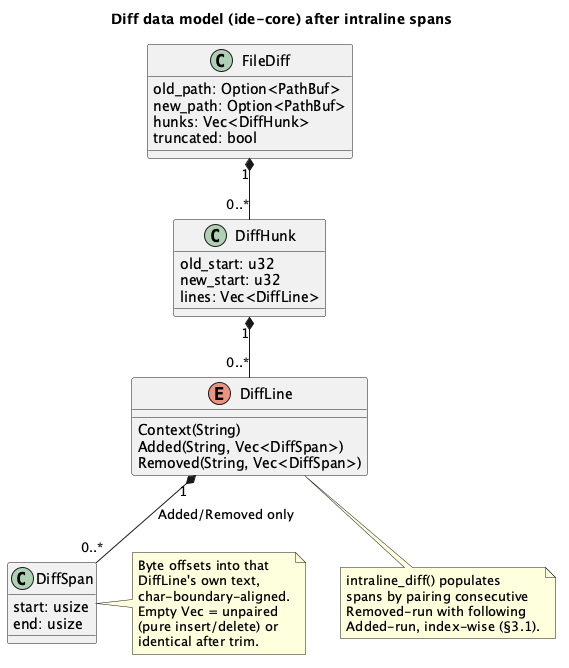

# Diff viewer enhancements: line-number gutters, change-bar, intraline highlighting

## 1. Purpose

The git diff panel (`IdeApp::render_diff` in `crates/ui/src/app/render.rs`,
fed by `ide_core::git::GitRepo::diff_file`/`diff_commit`) currently renders
a two-column, line-level diff: unchanged lines duplicated on both sides,
removed lines on the left only, added lines on the right only, each row
tinted with a flat, low-contrast background fill. Live in-app testing this
session found the tint nearly indistinguishable from the panel background,
and comparison against JetBrains' New UI diff viewer (RustRover/GoLand —
the project's declared look-and-feel target, `CLAUDE.md` "Look and feel")
identified three concrete gaps beyond the tint itself:

1. No per-side line-number gutter.
2. No gutter "change bar" marking which rows changed at a glance.
3. No intraline (word-level) highlighting distinguishing exactly what
   changed within a modified line, versus the whole line reading as
   "changed."

This doc covers closing all three gaps, plus formalizing the row-tint fix
(translucent overlay via `Color32::gamma_multiply`, prototyped live this
session and reverted pending this doc) as the rendering baseline the other
three build on.

**Out of scope**: multi-file diff minimap, inline "accept/reject hunk"
editing, a unified (single-column) view toggle, syntax highlighting inside
the diff (the diff panel already renders plain text, unrelated to this
change), and true Myers/LCS word-level diffing — see §3.4 for the
intentionally simpler algorithm this doc specifies instead.

## 2. Interface

### 2.1 `ide-core` (`crates/core/src/git/mod.rs`)

`DiffLine`'s `Added`/`Removed` variants gain a second field: the intraline
change spans within that line's text, in byte offsets (always on a `char`
boundary — see §3.4). This is a breaking change to `DiffLine`'s shape;
every existing match arm across the workspace must be updated (§4).

```rust
/// A byte-offset range into a `DiffLine::Added`/`Removed` line's text,
/// marking a sub-span that differs from its paired line on the other side
/// (§3.4). `start`/`end` are always char-boundary-aligned, so
/// `text[start..end]` never panics. Never overlapping, never out of
/// bounds for the line they're attached to.
#[derive(Debug, Clone, Copy, PartialEq, Eq)]
pub struct DiffSpan {
    pub start: usize,
    pub end: usize,
}

#[derive(Debug, Clone, PartialEq, Eq)]
pub enum DiffLine {
    Context(String),
    /// Text, plus the spans within it that differ from the `Removed` line
    /// it's paired with (empty if unpaired — a pure insertion, or the
    /// hunk's added-run outnumbers its removed-run, §3.4).
    Added(String, Vec<DiffSpan>),
    /// Symmetric to `Added`.
    Removed(String, Vec<DiffSpan>),
}
```

`FileDiff`, `DiffHunk` (`old_start`, `new_start`, `lines`), `diff_file`,
`diff_commit`, `MAX_DIFF_LINES`, `MAX_DIFF_FILES` are all unchanged in
shape and behavior — this doc only adds a post-processing pass over the
`Vec<DiffLine>` `build_file_diffs` already produces.

New free function (private to the `git` module — not re-exported; nothing
outside this module needs to call it directly, `build_file_diffs` is its
only caller):

```rust
/// Longest-common-prefix/longest-common-suffix trim between two lines.
/// Returns the (possibly empty) differing span for each side. See §3.4
/// for why this, not a full word-level Myers diff.
fn intraline_diff(old: &str, new: &str) -> (Vec<DiffSpan>, Vec<DiffSpan>)
```

### 2.2 `ide-ui` (`crates/ui/src/app/render.rs`)

`render_diff`'s grid grows from 2 columns to 4: `old_gutter, old_content,
new_gutter, new_content`. `diff_cell`'s signature is unchanged (`fill:
Option<Color32>`) — the gutter cells are additional calls to the same
helper, not a new one. No new public `IdeApp` fields or methods; this is a
rendering-only change plus one small, separately-testable helper:

```rust
/// Splits `text` into (is_highlighted, substring) segments per `spans`,
/// in order, covering the whole string with no gaps. `spans` must already
/// be sorted, non-overlapping, and byte-boundary-valid for `text` (true of
/// every `DiffSpan` `ide-core` produces, per §2.1's invariant) — this
/// function does not re-validate that, it's an internal rendering helper
/// over already-trusted data.
fn split_line_by_spans<'a>(text: &'a str, spans: &[DiffSpan]) -> Vec<(bool, &'a str)>
```

`Colors::diff_added_bg`/`diff_removed_bg` (`crates/ui/src/theme/mod.rs`,
`crates/ui/src/theme/palette.rs`) are removed — the row tint is now
derived from `diff_added_fg`/`diff_removed_fg` via `gamma_multiply` (§3.3),
making the dedicated background tokens dead weight.

## 3. Behavior

### 3.1 Intraline pairing (ide-core)

After `build_file_diffs` collects a file's hunks exactly as today, a new
pass runs once per hunk, over that hunk's `Vec<DiffLine>` in order:

- Scan for a maximal run of consecutive `Removed` lines immediately
  followed by a maximal run of consecutive `Added` lines (a "replace
  block" — the shape git's line-oriented diff always produces for a
  changed region: every `-` line before every `+` line, context lines
  elsewhere acting as run boundaries).
- Pair the two runs index-wise: `pairs = min(removed_run.len(),
  added_run.len())`. For `k` in `0..pairs`, pair `removed_run[k]` with
  `added_run[k]` and compute `intraline_diff` between their texts (§3.4),
  writing the resulting spans into each line's (now-populated) `Vec<DiffSpan>`.
- Any lines beyond `pairs` in the longer run (removed-heavy or
  added-heavy replace block) keep an empty span vector — a pure
  delete/insert, not treated as "modified," same as today's whole-line
  tint with no extra highlight.
- A run of only `Removed` with no following `Added` (pure deletion) or
  only `Added` with no preceding `Removed` (pure insertion) is `pairs =
  0` — every line in it keeps an empty span vector.
- `Context` lines are never paired or touched; they always carry no spans
  (the variant has none — only `Added`/`Removed` do).

This pass is pure post-processing over data `build_file_diffs` already
holds in memory — no new git2 calls, no change to what `diff_file`/
`diff_commit` fetch from the repository.

### 3.2 Gutter line numbers (ide-ui)

`render_diff` already iterates `hunk.lines` in order; it now also tracks
two running counters per hunk, initialized from `hunk.old_start` and
`hunk.new_start`:

- `Context`: render both counters in their gutters, then increment both.
- `Removed`: render the old counter in the old gutter (new gutter blank),
  increment old only.
- `Added`: render the new counter in the new gutter (old gutter blank),
  increment new only.

Gutter text uses `tokens.color.gutter_fg` (the same dimmed token the
editor's own line-number gutter already uses) — no new color token.
Gutter column width is a fixed constant (not content- or per-file-driven,
matching the editor's own line-number gutter), sized comfortably for
everyday file lengths (5 digits, e.g. up to 99999). A file whose line
numbers exceed that width isn't specially handled — the text clips at the
cell boundary rather than the gutter resizing to fit — an accepted v1
limitation, not a bug to solve here.

### 3.3 Row tint and change bar (ide-ui)

**Row tint** (formalizing the fix prototyped live this session): a
changed row's cells (both the gutter and content cell on the changed
side) fill with `tokens.color.diff_added_fg` / `diff_removed_fg` passed
through `Color32::gamma_multiply(0.5)` — a 50%-opacity overlay of the
accent color, replacing today's flat, dedicated `diff_added_bg`/
`diff_removed_bg` tokens (removed per §2.2). Context rows get no fill,
same as today.

**Change bar**: every `Removed`/`Added` row additionally gets a solid
(non-multiplied — full-strength `diff_removed_fg`/`diff_added_fg`) 3px
vertical stripe flush against the boundary between that side's gutter and
content cell. Context rows get no bar. This is the "at a glance, which
rows changed" signal JetBrains' gutter provides, distinct from the softer
row tint.

### 3.4 Intraline highlight rendering (ide-ui)

For an `Added`/`Removed` line with a non-empty span vector, the content
cell renders the line as multiple segments instead of one label:
`split_line_by_spans` (§2.2) breaks the text into `(is_highlighted,
substring)` pieces in original order, laid out with `ui.horizontal` and
zero item spacing so they read as one continuous line. An unhighlighted
segment renders as a plain `ui.colored_label` in the line's usual fg color
(`diff_added_fg`/`diff_removed_fg`, same as today). A highlighted segment
renders inside a small `egui::Frame` whose fill is the same accent color
at a *stronger* multiply than the row tint — `gamma_multiply(0.85)` vs.
the row's `0.5` — so it reads as a distinct, more-saturated box layered on
top of the softer row tint. Text inside the highlighted segment switches
to `tokens.color.fg_primary` (the panel's own high-contrast body-text
token) rather than staying `diff_added_fg`/`diff_removed_fg` — at `0.85`
alpha the box is nearly the pure accent hue, and same-hue text on a
same-hue background would be close to unreadable; unhighlighted segments
keep the accent color as today, only the boxed segment's text swaps.
A line with an empty
span vector (unpaired add/remove) renders exactly as it does today: one
plain label, no extra box — the row tint alone carries the "this line
changed" signal, matching current behavior.

**Why longest-common-prefix/suffix trim, not full word-level Myers diff**:
a true multi-span word-level diff (JetBrains' actual algorithm) requires
tokenizing both lines and running an LCS/Myers pass over tokens, adding
real algorithmic complexity and a class of edge cases (token boundary
choice, multi-span reconstruction) disproportionate to what this doc's
motivating feedback asked for. Prefix/suffix trim is O(n), needs no new
dependency, and correctly isolates the changed region for the overwhelmingly
common single-edit case (a renamed identifier, a changed literal, an
appended/removed suffix) — the same case most of a diff's "what exactly
changed" value comes from. Its known limitation: a line with two or more
*separate* edited regions (e.g. two different words changed in the same
line, everything between them unchanged) highlights the whole span from
the first edit to the last, including the unchanged middle, rather than
two disjoint boxes. This is an accepted v1 simplification, not a bug —
revisiting it to a real multi-span algorithm is future work if it proves
insufficient in practice.

`intraline_diff`'s exact algorithm: walk both strings' `char_indices()`
from the front while characters match, counting a `prefix` length; walk
both from the back while characters match while `prefix + suffix` doesn't
exceed the shorter string's char count, counting a `suffix` length. The
differing span for each side is `[byte offset of char `prefix`, byte
offset of char `len - suffix`)` — a `char`-boundary-safe range in that
side's own string, `start == end` (empty, omitted from the returned
`Vec`) when a side is fully consumed by the shared prefix+suffix (e.g. the
other side has purely-appended text). When there is no shared prefix or
suffix at all, the whole line on both sides is one span — a degenerate
but correct result (equivalent, visually, to no highlight at all, since
the box then covers the same region the row tint already covers).

## 4. Constraints & invariants

- **Breaking API change, deliberate**: `DiffLine::Added`/`Removed` gain a
  field. Every existing `DiffLine::Added(text)`/`Removed(text)` pattern in
  the workspace breaks and must be updated to `Added(text, _)`/
  `Removed(text, spans)` (or bind `_` where spans aren't used). Known call
  sites as of this doc (grep `DiffLine::` from the repo root to confirm
  the current, authoritative list — this one may drift):
  `crates/core/src/git/mod.rs` (construction + its own tests),
  `crates/ui/src/app/render.rs` (the render match), `crates/ui/src/git_panel.rs`
  (a test asserting on `DiffLine::Removed`/`Added` equality — needs an
  explicit `Vec` argument added to each constructed variant to keep
  compiling).
- `DiffSpan.start`/`end` are always char-boundary-aligned for the line
  they're attached to — `line[span.start..span.end]` must never panic.
  This is `intraline_diff`'s responsibility to guarantee (walking
  `char_indices()`, never raw byte arithmetic).
- Pairing is strictly positional within a replace block (§3.1) — it does
  not attempt to find the *best* pairing (e.g. via similarity scoring)
  when a block's removed/added runs are reordered or shuffled relative to
  each other. Git's own line-diff output doesn't reorder within a replace
  block, so this is a non-issue in practice, not an unhandled case being
  hand-waved.
- `MAX_DIFF_LINES`/`MAX_DIFF_FILES` truncation (`truncate_file_diff`,
  unchanged by this doc) happens *before* the intraline pairing pass in
  `build_file_diffs`'s existing order — truncation still bounds total
  work; the pairing pass never sees more lines than the existing cap
  already allows through.
- No new theme tokens. `gutter_fg` (line numbers), `diff_added_fg`/
  `diff_removed_fg` (row tint, change bar, and highlight box, at three
  different `gamma_multiply` strengths: `1.0` bar, `0.85` highlight box,
  `0.5` row tint) cover everything this doc needs. `diff_added_bg`/
  `diff_removed_bg` are removed as dead code once nothing reads them —
  including their palette literals and the two contrast tests in
  `crates/ui/src/theme/palette.rs` that reference them (`rev` from
  Batch B's cycle already validated this exact removal pattern once;
  repeat it, don't leave `#[warn(dead_code)]` behind).
- The `gamma_multiply`-derived tint/box colors are runtime alpha blends
  against whatever's beneath them (the panel background) — they are not
  statically checkable via `palette.rs`'s WCAG contrast-floor tests
  (`assert_floor`), which compare two fixed colors. Verify readability
  visually (`cargo run`, open a file with pending changes) rather than
  adding a floor test for them.
- Pure-rendering code (the `render_diff` match arms, `Frame`/`painter`
  calls) is exempt from the 80% coverage floor per this crate's existing
  convention (`render.rs`'s own module doc-comment) — `split_line_by_spans`
  is *not* exempt (it's a plain string-splitting function, no `egui`
  calls) and needs its own `#[cfg(test)] mod tests`.
- **Required**: an `egui_kittest`-based interaction test for `render_diff`
  itself, in the same style already established for the editor widget
  (`crates/ui/src/editor/mod.rs`'s `Harness`-based tests — a headless
  render + read-back, not pixel-snapshot image diffing). Build a
  `Harness` around a minimal host rendering `render_diff` with a
  hand-constructed `FileDiff` covering all three row kinds (`Context`,
  `Removed`, `Added(..., non_empty_spans)`), then assert on what the
  harness can read back from the rendered output: the old/new gutter text
  matches the expected line numbers for each row per §3.2's counter rules,
  a `Removed`/`Added` row's cells are distinguishable from a `Context`
  row's (the tint/change-bar are present in some queryable form — exact
  assertion mechanism is this role's call, e.g. via egui's debug/accesskit
  output if `Harness` exposes it, or by structuring `render_diff`'s
  internals so the segment split from `split_line_by_spans` is what's
  under test here rather than raw pixels), and the highlighted line's
  rendered text is split into the same segments `split_line_by_spans`
  would produce for it. This exercises the four features (§3.1–§3.4)
  together as `render_diff` actually assembles them, which the pure unit
  tests on `split_line_by_spans` alone don't cover.
- Not security-sensitive on the `ide-ui` side: `render.rs` and
  `theme/*.rs` are not on `CLAUDE.md`'s declared security-sensitive path
  list. **Is** security-sensitive on the `ide-core` side:
  `crates/core/src/git/**` is declared security-sensitive (parses
  repository data via git2/libgit2) — `intraline_diff` and the pairing
  pass operate only on already-parsed `String` line content already
  flowing through this module today (no new untrusted-input surface,
  no new file I/O, no new git2 calls), but the mandatory `hacker` pass
  still applies per that declaration, mechanically, regardless of this
  change's actual risk profile.

## 5. Examples

### 5.1 `ide-core`: a single-word change

```rust
let old = "let x = compute_value();";
let new = "let x = compute_result();";
let (old_spans, new_spans) = intraline_diff(old, new);
// Shared prefix "let x = compute_" (16 bytes/chars, all ASCII) and shared
// suffix "();" (3 bytes/chars) leave just the differing word on each side:
// old_spans == [DiffSpan { start: 16, end: 21 }]   // old[16..21]  == "value"
// new_spans == [DiffSpan { start: 16, end: 22 }]   // new[16..22]  == "result"
```

### 5.2 `ide-ui`: rendering one highlighted line

```rust
let segments = split_line_by_spans(
    "let x = compute_result();",
    &[DiffSpan { start: 16, end: 22 }],
);
// segments == [
//     (false, "let x = compute_"),
//     (true, "result"),
//     (false, "();"),
// ]
```

Each `false` segment renders as a plain colored label; the `true` segment
renders inside the stronger-fill `Frame` (§3.4).

## 6. Dependencies & integration points

- No new crates. `Color32::gamma_multiply` is already used by `egui`
  (pinned `ecolor` dependency, already in the workspace).
- Two `ide-ui` call sites are affected by the new `ide-core` shape (§4):
  `render_diff`, the real (non-test) consumer, and `git_panel.rs`'s
  existing diff-summary tests, which construct `DiffLine` values directly
  and need updating to compile, not because their behavior changes.
- Depends on nothing from the still-queued plan batches (Claude terminal,
  native menu bar, launcher+clone) — fully independent of them.

## 7. Diagram



## Revision notes

Per `rev`'s first pass:

- §3.4: highlighted-span text now specified as `fg_primary`, not the
  accent hue, to avoid same-hue text-on-box unreadability at `0.85` alpha.
- §3.2: resolved the dynamic-vs-fixed gutter-width contradiction — fixed
  constant width, sized for 5-digit line numbers, clips beyond that.
- §4: cleaned up a leftover editing fragment in the breaking-change bullet.
- §6: reworded to state both affected `ide-ui` call sites plainly instead
  of a self-contradicting "only caller... other affected call site."
- §4: added a required `egui_kittest` interaction test for `render_diff`
  (per user request, mid-implementation of the `ide-core` half — no
  `ide-core` scope affected, this only adds to the `ide-ui` role's work
  still ahead). Matches the existing `crates/ui/src/editor/mod.rs`
  `Harness`-based pattern; no new dependency (`egui_kittest` is already
  in `crates/ui/Cargo.toml`).
