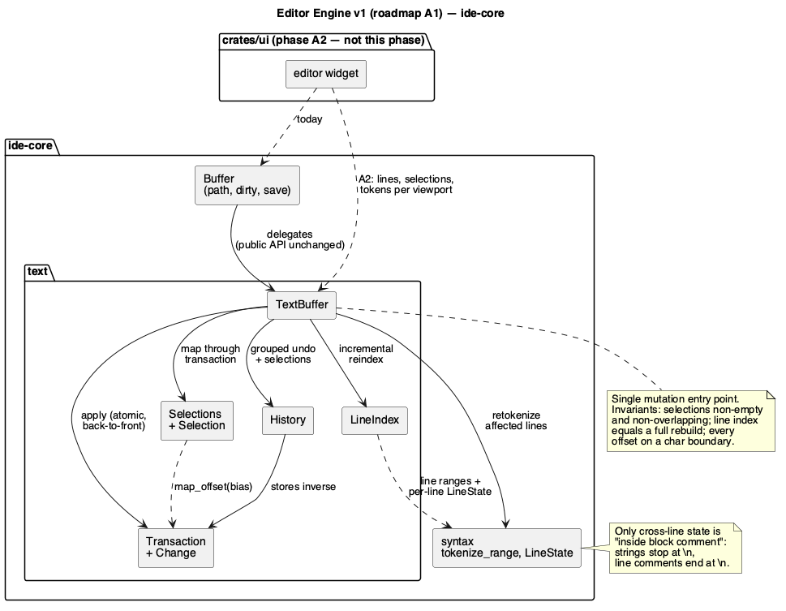

# Editor Engine v1

Roadmap phase **A1** (`docs/roadmap.md` §6, trek A). Owned entirely by
`rust-core-dev` — the diff is confined to `crates/core/**`. No
security-sensitive path is touched (no I/O beyond what `Buffer` already
does, no subprocess, no network), so `hacker` is skipped for this run.

## 1. Purpose

`docs/roadmap.md` §3.2 names this the second of the two architectural
blockers: the text model has no notion of lines, cursors, transactions or
incremental work, and every editor feature on the JetBrains list needs at
least one of those.

Concretely, today (`crates/core/src/buffer.rs`):

- **No line index.** Nothing in `ide-core` knows where line 500 starts.
  Every `(line, column) ↔ offset` conversion in the app is a linear scan
  (`ide_lsp::position_to_byte_offset` walks the whole string), run per
  diagnostic per frame.
- **No transactions.** `insert`/`delete` are separate operations pushing
  separate undo entries. A multi-cursor edit — the whole point of phase A3 —
  is inexpressible: it is N insertions that must be one undoable step.
- **Undo is one entry per call, and loses the cursor.** `Buffer::insert`
  pushes one `Edit` per invocation — which, since the UI invokes it per
  keystroke, means undo walks back one character at a time. Nothing records
  where the caret was, so undo can't put it back either.
- **Tokenization is whole-file.** `Tab::reconcile` re-runs `tokenize` over
  the entire buffer on every applied edit (`app.rs:140`), which is also why
  highlighting is capped at 2 MiB.

This phase builds the model those features need, in `ide-core`, with no UI:
a line index, an atomic `Transaction`, a multi-cursor selection model,
grouped undo that restores selections, and incremental retokenization.

**Compatibility is a hard requirement of this phase.** `Buffer`'s existing
public surface (`open`/`text`/`insert`/`delete`/`undo`/`redo`/`save`/
`save_as`/`path`/`is_dirty`) keeps working with unchanged semantics, because
`crates/ui` calls all of it today and this phase must not touch `crates/ui`.
The new model goes *under* it; phase A2 is what migrates the UI onto the new
API and deletes `diff_replace`.

**Explicitly out of scope**: the editor widget (A2), multi-cursor *commands*
and gestures (A3 — this phase provides the data model they operate on),
smart indent / bracket matching (A4), folding (A6). Also out of scope: a
rope. §4.5 explains why a `String` plus an incremental line index is the
right storage for this phase and what would force that decision to change.

## 2. Interface / API

New module tree under `crates/core/src`:

```
text/mod.rs         TextBuffer — content + line index + selections + history
text/lines.rs       LineIndex
text/edit.rs        Change, Transaction
text/selection.rs   Selection, Selections
text/history.rs     History (undo/redo stacks, grouping)
syntax.rs           + tokenize_range, LineState  (extended, not rewritten)
buffer.rs           Buffer delegates to TextBuffer, keeps path/dirty/save
```

### 2.1 `Change` and `Transaction`

```rust
/// One replacement: delete `range`, insert `insert` in its place.
/// An insertion is an empty `range`; a deletion is an empty `insert`.
#[derive(Debug, Clone, PartialEq, Eq)]
pub struct Change {
    pub range: Range<usize>,
    pub insert: String,
}

/// A set of changes applied as one atomic step and undone as one step.
/// Changes are kept sorted by `range.start` and are guaranteed
/// non-overlapping (§3.1); construction is the only place that can fail.
#[derive(Debug, Clone, PartialEq, Eq, Default)]
pub struct Transaction { /* changes: Vec<Change> */ }

/// The only way to build an invalid transaction is to overlap two changes.
/// Bounds are deliberately *not* checked here: `Transaction` is built
/// without reference to any text, so it cannot know a buffer's length —
/// `TextBuffer::apply` clamps instead (§3.1).
#[derive(Debug, thiserror::Error, PartialEq, Eq)]
pub enum TransactionError {
    #[error("changes overlap: {0:?} and {1:?}")]
    Overlapping(Range<usize>, Range<usize>),
}

impl Transaction {
    /// Sorts `changes` by start offset and rejects any pair that overlaps.
    /// Two changes that merely touch (`a.end == b.start`) are legal.
    /// A reversed range (`start > end`) is normalised, matching what
    /// `Buffer::delete` already does today.
    pub fn new(changes: Vec<Change>) -> Result<Self, TransactionError>;
    /// Convenience for the single-change case.
    pub fn replace(range: Range<usize>, insert: impl Into<String>) -> Self;
    pub fn insert(offset: usize, text: impl Into<String>) -> Self;
    pub fn delete(range: Range<usize>) -> Self;

    pub fn changes(&self) -> &[Change];
    /// No changes at all. Not the same as "has no effect against a given
    /// text" — that can only be known at `apply` time, after clamping.
    pub fn is_empty(&self) -> bool;

    /// Maps an offset in the pre-transaction text to its position in the
    /// post-transaction text. `bias` decides which side of an insertion
    /// exactly at `offset` the result lands on (§3.2) — the reason cursors
    /// survive an edit at their own position.
    pub fn map_offset(&self, offset: usize, bias: Bias) -> usize;
}

/// Which side of an edit boundary a mapped offset sticks to.
#[derive(Debug, Clone, Copy, PartialEq, Eq)]
pub enum Bias { Before, After }
```

### 2.2 `Selection` and `Selections`

```rust
/// A cursor, possibly with a selection. `anchor == head` is a bare caret.
/// `head` is where the caret visually is; `anchor` is the fixed end.
/// Both are byte offsets on char boundaries.
#[derive(Debug, Clone, Copy, PartialEq, Eq)]
pub struct Selection { pub anchor: usize, pub head: usize }

impl Selection {
    pub fn caret(offset: usize) -> Self;
    pub fn start(&self) -> usize;      // min(anchor, head)
    pub fn end(&self) -> usize;        // max(anchor, head)
    pub fn is_empty(&self) -> bool;    // anchor == head
    pub fn range(&self) -> Range<usize>;
}

/// Every cursor in the buffer. Non-empty by construction: there is always
/// at least one. Kept sorted by `start()`, with overlapping selections
/// merged (§3.3) — the invariant multi-cursor editing depends on, since two
/// cursors inside one another would produce overlapping changes.
#[derive(Debug, Clone, PartialEq, Eq)]
pub struct Selections { /* ranges: Vec<Selection>, primary: usize */ }

impl Selections {
    pub fn single(selection: Selection) -> Self;
    /// Sorts, merges overlaps, and keeps `primary` pointing at whichever
    /// selection absorbed the previous primary.
    ///
    /// Total, never failing, because the non-empty invariant (§4.1) has to
    /// hold for every value that exists: an empty `ranges` yields a single
    /// `Selection::caret(0)`, and a `primary` past the end is clamped to the
    /// last surviving selection.
    pub fn new(ranges: Vec<Selection>, primary: usize) -> Self;

    pub fn all(&self) -> &[Selection];
    pub fn primary(&self) -> Selection;
    pub fn primary_index(&self) -> usize;
    pub fn len(&self) -> usize;
    pub fn is_multiple(&self) -> bool;

    /// Adds a cursor, re-normalising. Returns `false` when normalisation
    /// absorbed it into an existing selection (§3.3) — i.e. when `len()`
    /// did not grow — which is how "add cursor at next occurrence" (A3)
    /// knows it has run out of new places to go.
    pub fn push(&mut self, selection: Selection) -> bool;
    /// Collapses to the primary selection alone (Escape).
    pub fn collapse_to_primary(&mut self);
    /// Every selection through `Transaction::map_offset`, then re-normalised.
    pub fn map(&self, transaction: &Transaction) -> Selections;
}
```

### 2.3 `LineIndex`

```rust
/// Byte offsets of every line start, maintained incrementally.
/// `line_count()` is always >= 1: an empty text is one empty line.
#[derive(Debug, Clone, PartialEq, Eq)]
pub struct LineIndex { /* starts: Vec<usize> */ }

impl LineIndex {
    pub fn new(text: &str) -> Self;
    pub fn line_count(&self) -> usize;
    /// Byte range of `line`, **excluding** its trailing `\n` and, for a
    /// CRLF file, excluding the `\r` as well (§3.4). `None` past the end.
    pub fn line_range(&self, line: usize, text: &str) -> Option<Range<usize>>;
    pub fn line_start(&self, line: usize) -> Option<usize>;
    /// The line containing `offset`; the last line for an out-of-range one.
    pub fn line_at(&self, offset: usize) -> usize;
    /// `(line, column)`, column in **bytes** from the line start.
    pub fn position_at(&self, offset: usize) -> (usize, usize);
    pub fn offset_at(&self, line: usize, column: usize) -> Option<usize>;
    /// Rebuilds only the lines `change` touched and shifts every later line
    /// start by the change's length delta. `text` is the **post-change**
    /// text; the delta is derived from `change` itself rather than passed
    /// in, so the two can't disagree.
    pub fn apply(&mut self, text: &str, change: &Change);
}
```

### 2.4 `TextBuffer`

The core type. `Buffer` becomes a thin file-backed wrapper over it.

```rust
pub struct TextBuffer { /* text, lines, selections, history, tokens, syntax */ }

impl TextBuffer {
    /// Starts with a single caret at offset 0, a clean history, and the
    /// text fully tokenized.
    pub fn new(text: impl Into<String>, syntax: Option<&'static SyntaxRules>) -> Self;

    pub fn text(&self) -> &str;
    pub fn len(&self) -> usize;
    pub fn is_empty(&self) -> bool;
    pub fn lines(&self) -> &LineIndex;
    pub fn line_text(&self, line: usize) -> Option<&str>;

    pub fn selections(&self) -> &Selections;
    pub fn set_selections(&mut self, selections: Selections);

    /// Applies `transaction`, maps every selection through it, records
    /// **one** undo entry, and retokenizes only the affected line span
    /// (§3.6). The single mutation entry point: nothing else in this type
    /// modifies `text`. Never coalesces — one call is one undo step, so a
    /// programmatic edit is always undone as the caller issued it.
    pub fn apply(&mut self, transaction: Transaction);

    /// Replaces every selection's range with `text` — the multi-cursor
    /// insert A3 is built on. One transaction, one undo step. Each
    /// selection is left as a bare caret just past the text it received.
    pub fn insert_at_selections(&mut self, text: &str);

    /// The typing entry point, and the **only** thing that coalesces
    /// (§3.5): consecutive calls that continue one run of typed text on one
    /// line collapse into a single undo step. Otherwise identical to
    /// `insert_at_selections`. Separate from it because coalescing is a
    /// property of typing, not of editing — the editor widget (A2) calls
    /// this for keystrokes, everything else calls `apply`.
    pub fn type_text(&mut self, text: &str);

    /// Undoes/redoes one *group*, restoring the selections that were active
    /// when it was made. Returns false when the stack is empty.
    pub fn undo(&mut self) -> bool;
    pub fn redo(&mut self) -> bool;
    /// Ends the current coalescing group, so the next `type_text` starts a
    /// new undo step regardless of timing. Called when the caret moves by
    /// any means other than typing, and on save.
    pub fn break_undo_group(&mut self);

    pub fn tokens(&self) -> &[Token];
    /// Tokens overlapping `lines`, for a viewport-limited repaint (A2).
    /// A subslice of `tokens()`, since tokens are sorted by offset.
    pub fn tokens_in_lines(&self, lines: Range<usize>) -> &[Token];
    /// Discards every cached token **and** every cached per-line
    /// `LineState` and retokenizes from scratch — states cached under the
    /// old rules say nothing about the new ones. `None` clears highlighting.
    pub fn set_syntax(&mut self, syntax: Option<&'static SyntaxRules>);
}
```

### 2.5 `syntax.rs` additions

```rust
/// What the tokenizer carries across a line boundary. Strings never span
/// lines (`try_string` stops at `\n`) and line comments end at the newline
/// by definition, so a block comment is the only construct that does —
/// which is what makes one enum with two variants sufficient.
#[derive(Debug, Clone, Copy, PartialEq, Eq, Default)]
pub enum LineState {
    #[default]
    Normal,
    InBlockComment,
}

/// Tokenizes `text[start..end]`, entering in `state`, as if `start` were a
/// line start. Returns the tokens (offsets absolute in `text`) and the state
/// at `end`.
///
/// Unlike `tokenize`, this has **no** size threshold: it works per line span
/// and has nothing to bail out of, so `MAX_HIGHLIGHTED_FILE_BYTES` does not
/// apply. The equality
/// `tokenize(text, rules) == tokenize_range(text, rules, 0..text.len(), Normal).0`
/// therefore holds only for texts **at or under** that threshold — above it
/// `tokenize` returns empty by design (§3.6), and that is the form §6's
/// differential test asserts.
pub fn tokenize_range(
    text: &str,
    rules: &SyntaxRules,
    range: Range<usize>,
    state: LineState,
) -> (Vec<Token>, LineState);
```

### 2.6 `Buffer` — unchanged surface, new internals

Every existing method — `untitled`, `open`, `path`, `text`, `is_dirty`,
`insert`, `delete`, `undo`, `redo`, `save`, `save_as` — keeps its exact
signature **and its exact observable behaviour**. `insert`/`delete` become
one-change transactions and `undo`/`redo` delegate to the new history, but
since neither goes through `type_text`, neither coalesces: one call remains
one undo step, exactly as today. Three additions:

```rust
impl Buffer {
    /// The model underneath, for callers that need lines/selections/tokens
    /// (phase A2's editor widget).
    pub fn text_buffer(&self) -> &TextBuffer;
    /// **Superseded by A2** (`code-editor-widget.md` §2.0): this originally
    /// marked the buffer dirty on the way out, on the reasoning that whether
    /// the caller edited could not be observed. The editor widget calls it
    /// every frame just to read, which would light the modified indicator on
    /// every open file — so it no longer dirties, and `Buffer::mark_dirty`
    /// is called explicitly when an edit lands.
    pub fn text_buffer_mut(&mut self) -> &mut TextBuffer;
    pub fn apply(&mut self, transaction: Transaction);
}
```

## 3. Behaviour

### 3.1 Applying a transaction

Changes are applied **back to front** (highest `range.start` first), so each
application leaves every not-yet-applied change's offsets valid — the reason
`Transaction::new` sorts and rejects overlaps up front rather than trying to
rebase mid-flight.

Bounds are checked **at apply time, not at construction time**: a
`Transaction` is built with no reference to any text, so it has no length to
validate against, and the same transaction is legal against one buffer and
past the end of another. `TextBuffer::apply` therefore clamps each endpoint
— first to `text.len()`, then to the nearest char boundary — exactly as
`Buffer::clamp_offset` does today, so a caller that points past the end or
slices a multi-byte char in half gets the current forgiving behaviour rather
than a panic. `Transaction::new`'s only failure mode is overlap (§2.1).

A change whose range is clamped to empty and whose insert is empty
contributes nothing; if that leaves the transaction with no effect at all it
is treated as empty (below).

An empty transaction is a no-op: no undo entry, no retokenize, no dirty flag.

### 3.2 Mapping offsets across an edit

`map_offset` walks the sorted changes and accumulates the length delta of
every change that ends at or before `offset`:

- Offset strictly before a change: unchanged.
- Offset strictly after: shifted by the accumulated delta.
- Offset **inside** a replaced range: clamped to the change's new end — the
  text it pointed at is gone.
- Offset exactly **at** an insertion point: `Bias::After` puts it after the
  inserted text (what a caret wants when you type at it), `Bias::Before`
  leaves it in place (what a selection's opposite end wants).

Selections map with `Bias::After` for both ends, which is what makes typing
at a caret move the caret along, and typing at the far end of a multi-cursor
edit keep every other cursor over its own text.

### 3.3 Selection normalisation

`Selections::new` sorts by `start()` and merges exactly two cases:

- Two selections whose ranges genuinely **overlap** (`a.end > b.start`).
  Left unmerged they would produce overlapping changes, which
  `Transaction::new` rejects — so this merge is what makes multi-cursor
  editing expressible at all.
- Two bare **carets at the same offset**, which would otherwise insert the
  same text twice at one point.

Two selections that merely *touch* (`a.end == b.start`) are deliberately
**kept separate**: they produce non-overlapping changes, so there is no
correctness reason to merge, and merging would silently destroy a cursor the
user placed. A caret exactly at the boundary of a non-empty selection is
likewise kept — it is a distinct cursor.

Merging keeps the direction (`anchor`/`head` order) of the selection that
started earliest, and `primary` follows whichever survivor absorbed the old
primary, so Escape after a merge collapses to something predictable.

### 3.4 Lines, CRLF and the last line

- A line's range **excludes** its terminator: for `"a\nb"`, line 0 is `0..1`.
  For CRLF, line 0 of `"a\r\nb"` is also `0..1` — the `\r` is excluded, so
  `line_text` never hands back a stray carriage return.
- Text ending in `\n` has a final empty line: `"a\n"` is two lines, and
  `line_range(1)` is `2..2`. This matches what an editor shows.
- Empty text is one empty line, so `line_count()` is never 0 and A2 never
  has to special-case an empty file.
- `position_at` returns a **byte** column. LSP's UTF-16 columns stay
  `ide-lsp`'s business (`position_to_byte_offset` is unchanged and this
  phase does not touch `crates/lsp`).

### 3.5 Undo grouping

An undo entry is `{ inverse: Transaction, before: Selections, after: Selections }`.

**Only `type_text` can coalesce.** `apply` — and therefore
`insert_at_selections`, `Buffer::insert` and `Buffer::delete` — always
records its own entry, one call to one undo step. This split is deliberate:
coalescing exists so that a *typed run* undoes as a word rather than a
letter, and a programmatic caller that issues two edits means two edits.
It is also what keeps §4.6 true — every existing `crates/core` test that
asserts one-undo-per-call (e.g. `buffer.rs`'s `undo_redo_roundtrip`, which
inserts twice and undoes twice) keeps passing untouched.

A `type_text` call is appended to the open group instead of starting a new
one when **all** of:

1. the current group is still open (no `break_undo_group` since, and the
   previous edit was itself a `type_text`),
2. the text being typed contains no `\n`, and the previous typed run also
   did not,
3. it continues that run — every selection starts exactly where its
   counterpart from the previous call ended,
4. fewer than `UNDO_COALESCE_MILLIS` (500) have passed since the last one.

Anything else — a newline, a deletion, a non-adjacent caret, a call to
`apply`, an explicit `break_undo_group`, a save — closes the group. Undo
restores `before` selections; redo restores `after`. The timeout is measured
with `std::time::Instant`; §4.4 explains how the tests control it without
sleeping.

Redo is cleared by any new edit, as today.

### 3.6 Incremental retokenization

State per line is `LineState` (§2.5), stored alongside the line index. After
a transaction touching lines `first..=last`:

1. Start at `first` with the state recorded at its start.
2. Tokenize line by line with `tokenize_range`.
3. Stop at the first line **past `last`** whose newly-computed end state
   equals the previously recorded one — from there the old tokens are still
   correct and are kept, with their offsets shifted by the transaction's
   delta.

Worst case is still the whole file (typing `/*` at the top of a Rust file
genuinely re-colours everything below it, which is correct); the common case
of typing inside a line touches one line. §4.3 states the bound.

`MAX_HIGHLIGHTED_FILE_BYTES` (2 MiB) keeps its current meaning for the
whole-file path: over the cap, `tokens()` is empty. Lifting that cap needs
the viewport-limited rendering A2 introduces, so it is deliberately not
lifted here.

### 3.7 What `Buffer` callers see

Nothing changes — not the signatures and not the behaviour. `insert(offset,
text)` still clamps, still marks dirty, still pushes exactly one undoable
step; that step is now a `Transaction` internally, but it neither coalesces
with its neighbours (§3.5) nor changes what `undo` returns. There is
deliberately **no** observable behaviour change in this phase: the
grouped-typing win arrives with A2, when the editor widget starts calling
`type_text` instead of `Buffer::insert` per keystroke.

## 4. Constraints & invariants

### 4.1 Invariants, asserted by tests

- `Transaction`'s changes are sorted and non-overlapping; construction is
  the only way to build one, so no code path can bypass it.
- `Selections` is never empty and never contains overlapping ranges.
- `LineIndex::starts[0] == 0` always; `starts` is strictly increasing; and
  after any number of edits `LineIndex::new(text)` equals the incrementally
  maintained index — the differential invariant that keeps the fast path
  honest (§6, test 4).
- Every offset the model stores (selections, line starts, token ranges) is
  on a char boundary.
- `undo` then `redo` restores text, selections and dirty flag exactly;
  `undo` to the bottom of the stack restores the buffer's initial text.

### 4.2 Concurrency

`TextBuffer` is a plain owned value with no interior mutability, `Send` and
not `Sync`-shared: the UI owns one per tab on the main thread. Nothing in
this phase spawns a thread or takes a lock. (`ide-core`'s existing search
already runs off-thread over a `DirEntry` snapshot, not over buffers.)

### 4.3 Performance

For a buffer of `n` bytes and `L` lines, with an edit of size `k` on line
`l`:

| Operation | Bound |
|---|---|
| `apply` (text splice) | O(n) memmove — a `String`, see §4.5 |
| `LineIndex::apply` | O(k + (L − l)) — rebuild touched lines, shift the tail |
| `tokens_in_lines` | O(log T) binary search over T tokens, then a subslice |
| `position_at` / `line_at` | O(log L) binary search |
| `offset_at` | O(1) |
| retokenize | O(bytes in the affected line span), one line for the common case (§3.6) |
| `map_offset` | O(number of changes) |

The pathological case is a 100k-line file: the tail shift is one ~800 KB
memmove per keystroke, which is microseconds — acceptable, and §4.5 records
what would change the decision.

### 4.4 Testability of the timeout

Coalescing depends on wall-clock time, which tests must not sleep for.
`TextBuffer` keeps the "last edit at" instant behind a private field and the
history takes the current time as a parameter internally, with a
`#[cfg(test)]` seam to advance it. No public clock-injection API is added —
this is an internal seam, not surface.

### 4.5 Why a `String` and not a rope

A rope is what this eventually wants; it is not what this phase should
build. The edit cost above is dominated by one memmove that is measured in
microseconds up to a few MB, while a rope adds a chunk tree that every other
piece of this phase (line index, token ranges, selection mapping) would have
to be written against — doubling the surface of the change that A2 then has
to consume. The public API here is deliberately offset-based and storage-
agnostic, so swapping the backing store later touches `TextBuffer`'s
internals only.

What would force the change: opening files where a single memmove is
visible per keystroke (tens of MB), or wanting cheap snapshots for
background work (a formatter or a diff running against a frozen version).
Neither is on the roadmap before A6.

### 4.6 Compatibility

`crates/ui` must compile and pass its existing tests **untouched** — this
phase's diff does not include `crates/ui/**`. `Buffer`'s public signatures
and observable behaviour are both unchanged (§3.7), so every existing
`crates/core` test passes without edits too; §3.5's coalescing split is what
buys that. A modified existing test is a signal the design drifted, not a
routine part of this phase.

## 5. Examples

**Multi-cursor insert (what A3 will call):**

```rust
let mut buf = TextBuffer::new("one\ntwo\nthree", Some(&ide_core::RUST));
buf.set_selections(Selections::new(
    vec![Selection::caret(0), Selection::caret(4), Selection::caret(8)],
    0,
));
buf.insert_at_selections("// ");
assert_eq!(buf.text(), "// one\n// two\n// three");
assert!(buf.undo());                       // one step, not three
assert_eq!(buf.text(), "one\ntwo\nthree");
assert_eq!(buf.selections().len(), 3);     // and the cursors come back
```

**Typing versus editing — the two undo granularities (§3.5):**

```rust
let mut buf = TextBuffer::new("", None);
for ch in ["h", "e", "l", "l", "o"] {
    buf.type_text(ch);                     // one run
}
assert!(buf.undo());
assert_eq!(buf.text(), "");                // the whole word, not "hell"

let mut buf = TextBuffer::new("", None);
buf.apply(Transaction::insert(0, "hello"));
buf.apply(Transaction::insert(5, " world"));
assert!(buf.undo());
assert_eq!(buf.text(), "hello");           // apply never coalesces
```

**A replacement across a selection, with the caret mapped:**

```rust
let mut buf = TextBuffer::new("hello world", None);
buf.apply(Transaction::replace(0..5, "goodbye"));
assert_eq!(buf.text(), "goodbye world");
assert_eq!(buf.selections().primary(), Selection::caret(7));
```

**Line lookups A2's gutter needs:**

```rust
let buf = TextBuffer::new("fn main() {\n    println!(\"hi\");\n}\n", None);
assert_eq!(buf.lines().line_count(), 4);          // trailing newline = empty last line
assert_eq!(buf.line_text(1), Some("    println!(\"hi\");"));
assert_eq!(buf.lines().position_at(12), (1, 0));
```

**Incremental retokenize, and the cascade that isn't a bug:**

```rust
let mut buf = TextBuffer::new("let a = 1;\nlet b = 2;\n", Some(&ide_core::RUST));
buf.apply(Transaction::insert(0, "/*"));          // opens a block comment
// every following line is now comment-coloured, because it genuinely is
assert!(buf.tokens().iter().all(|t| t.kind == TokenKind::Comment));
```

## 6. Dependencies & integration points

**Depends on**: nothing new. `thiserror` (already a dependency) for
`TransactionError`; `syntax.rs`'s existing rule functions, which
`tokenize_range` reuses unchanged.

**Consumed by**: **A2** (editor widget — lines, selections, tokens per
viewport), **A3** (multi-cursor commands), **A4** (smart editing, all of it
expressed as transactions), **A5** (in-buffer find over the line index),
**A6** (folding, over line ranges). Nothing consumes it in this phase, which
is deliberate: A1 ships the model, A2 switches the UI onto it.

**Tests** (`#[cfg(test)] mod tests` per module; `rust-core-dev`'s ≥80% line
coverage applies):

1. `Transaction::new` sorts, accepts touching ranges, normalises reversed
   ones, rejects overlapping ones; and `apply` clamps a range past the end
   of the buffer instead of panicking.
2. `map_offset` for each case of §3.2 including both `Bias` values at an
   insertion point, and an offset inside a replaced range.
3. `Selections` normalisation: sorting, merging genuine overlaps, merging
   duplicate carets, **not** merging touching selections or a caret at a
   selection's edge, primary tracking through a merge,
   `collapse_to_primary`, and the two total-constructor cases (empty
   `ranges`, out-of-range `primary`).
4. **Differential:** after a randomised sequence of transactions (fixed
   seed, hand-rolled LCG — no new dependency), the incrementally maintained
   `LineIndex` equals `LineIndex::new(text)`, and the incrementally
   maintained tokens equal `tokenize(text, rules)`. This is the test that
   makes the whole incremental design trustworthy.
5. Line edges: empty text, text with and without a trailing newline, CRLF,
   multi-byte characters spanning a line boundary, a line that is only
   `\r\n`.
6. Undo grouping: consecutive `type_text` calls coalesce; a newline, a
   non-adjacent caret, an intervening `apply`, the timeout and
   `break_undo_group` each break the group; `apply` never coalesces even
   when it would otherwise qualify; undo/redo restore selections both ways.
7. Multi-cursor: `insert_at_selections` over N carets is one undo step; two
   cursors that would collide are merged before the edit rather than
   producing overlapping changes.
8. `tokenize_range` equals the corresponding slice of `tokenize` for every
   built-in language over a fixture (well under
   `MAX_HIGHLIGHTED_FILE_BYTES`, per §2.5) with block comments,
   unterminated block comments, strings containing comment delimiters, and
   comment delimiters inside strings — plus one case asserting that
   `tokenize_range` still tokenizes a text above that threshold, where
   `tokenize` returns empty.
9. Retokenize cascade: opening an unterminated block comment recolours the
   rest of the file; closing it restores the previous colouring exactly.
10. `Buffer` compatibility: every existing `buffer.rs` test passes with its
    source unmodified (in particular `undo_redo_roundtrip`, whose two
    inserts must remain two undo steps), plus a new one asserting the other
    half of the split — the same two edits issued through `type_text` undo
    as one.

## 7. Diagram



## Revision notes

Code review of the implementation added one doc item: `text_buffer_mut`
marks the buffer dirty on the way out, which §2.6 listed without saying.

Round 2 review (5 non-blocking clarifications, fixed in place):
`Transaction::is_empty` now says it means "no changes", not "no effect";
`Selections::push`'s boolean is defined as "was not absorbed", with the A3
caller that needs it; `LineIndex::apply` dropped its redundant `delta`
parameter (derivable from `change`, and a second source of truth that could
disagree) and states that `text` is post-change; `TextBuffer::new` states
its initial caret/history/token state; `insert_at_selections` states where
the carets end up; §4.3 gained a bound for `tokens_in_lines`.

Round 1 review (8 findings, 4 blocking).

1. **`TransactionError::OutOfBounds` was unreachable.** `Transaction::new`
   takes only `Vec<Change>` — it has no text and therefore no length to
   validate against, so §3.1's promise of an out-of-bounds error could not
   be kept. Dropped the variant; bounds are now clamped in
   `TextBuffer::apply` alongside the char-boundary clamp, which also matches
   what `Buffer::clamp_offset` already does. §2.1, §3.1, §6 test 1.
2. **Coalescing contradicted an existing test.** §3.5's rules would have
   merged `buffer.rs`'s `undo_redo_roundtrip` two inserts into one group,
   breaking a test §6 test 10 simultaneously required to pass unmodified.
   Resolved by making coalescing a property of *typing* rather than of
   editing: new `TextBuffer::type_text` is the only entry point that
   coalesces, `apply`/`insert_at_selections`/`Buffer::insert`/`Buffer::delete`
   are strictly one call → one undo step. This removes the phase's only
   observable behaviour change, so §3.7 and §4.6 now claim full
   compatibility rather than "one intended difference". §2.4, §3.5, §3.7,
   §4.6, §5, §6 tests 6 and 10.
3. **The `tokenize`/`tokenize_range` identity was false above 2 MiB**, since
   `tokenize` bails at `MAX_HIGHLIGHTED_FILE_BYTES` and `tokenize_range`
   has no such threshold. Stated the threshold explicitly and scoped the
   identity to texts under it, with a test for the divergence above it.
   §2.5, §6 test 8.
4. **`Selections::new` had no defined behaviour for an empty `ranges` or an
   out-of-range `primary`**, while §4.1 declared non-emptiness an invariant.
   Made the constructor total: empty yields `Selection::caret(0)`, `primary`
   is clamped. §2.2, §6 test 3.
5. `untitled()` was missing from §2.6's enumeration of `Buffer`'s preserved
   surface. Added, along with the rest of the methods spelled out by name.
6. §1's "undo is per-character" was imprecise — `Buffer` records one entry
   per *call*; per-character is a consequence of how the UI calls it.
   Reworded.
7. `set_syntax` didn't say it must discard cached per-line `LineState`, not
   just tokens; a stale state cached under the old rules would corrupt the
   first incremental pass after a language change. §2.4.
8. §3.3 merged *touching* selections without justification. Touching
   selections produce non-overlapping changes, so merging is not required
   for correctness and silently discards a cursor the user placed — now
   only genuine overlaps and coincident carets merge, with the reasoning
   stated. §3.3, §6 test 3.
