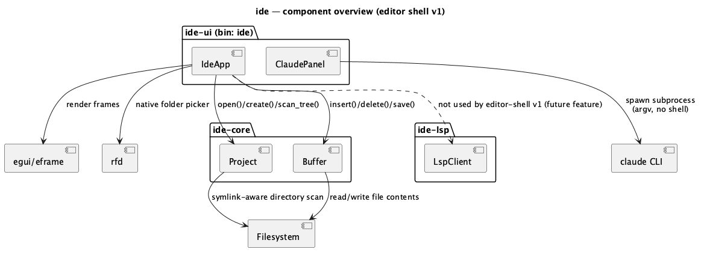
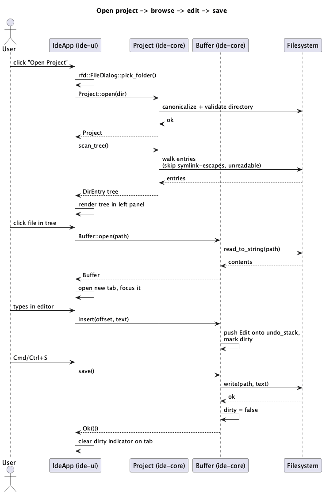
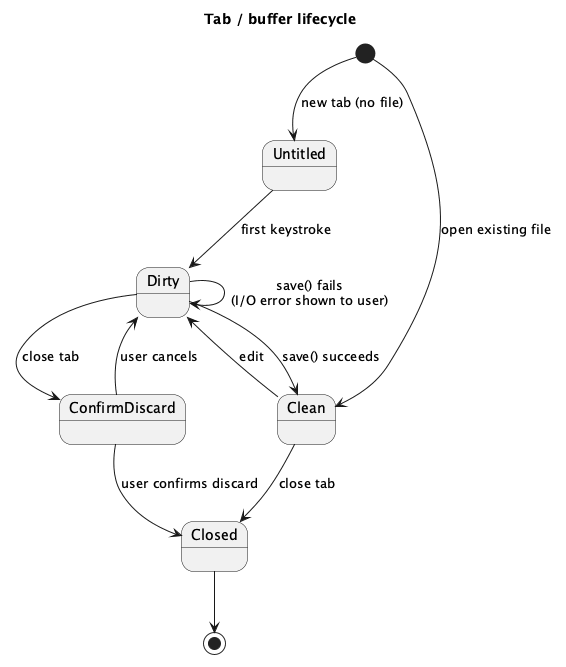

# Editor Shell v1

## 1. Purpose

The backbone of the IDE: a native, compiled (no JS/TS) GUI application that
can create or open a project directory, browse its files in a tree,
edit multiple files in tabs, and consult an integrated Claude panel — all
in a single binary, switchable between dark and light themes.

Everything else the IDE eventually needs (language intelligence, debugging,
etc.) builds on this shell. This doc scopes exactly what v1 delivers:

- Project creation and opening (select an existing directory, or create a
  new one).
- Three-panel layout: directory tree (left), tabbed text editor (center),
  Claude-integration chat panel (right).
- Dark/light theme toggle.
- Plain text editing (open, edit, save, undo/redo) — **no syntax
  highlighting or language intelligence yet**; that is explicitly deferred
  to a future feature built on `ide-lsp` (declared in the project's
  `CLAUDE.md` dev-chain roles, not needed for this doc).

## 2. Interface / API

### 2.1 `ide-core`

```rust
// crates/core/src/project.rs
pub struct Project { /* root: PathBuf */ }

#[derive(Debug, thiserror::Error)]
pub enum ProjectError {
    #[error("io error: {0}")]
    Io(#[from] std::io::Error),
    #[error("path is not a directory: {0}")]
    NotADirectory(std::path::PathBuf),
    #[error("path already exists: {0}")]
    AlreadyExists(std::path::PathBuf),
}

impl Project {
    /// Opens an existing directory as a project root. Canonicalizes the
    /// path. Errors if `root` doesn't exist or isn't a directory.
    pub fn open(root: impl AsRef<std::path::Path>) -> Result<Self, ProjectError>;

    /// Creates `root` as a new directory and opens it as a project.
    /// Errors if `root` already exists.
    pub fn create(root: impl AsRef<std::path::Path>) -> Result<Self, ProjectError>;

    /// Canonicalized, absolute project root.
    pub fn root(&self) -> &std::path::Path;

    /// Recursively scans the project tree. Entries whose canonical path
    /// escapes `root` (symlink pointing outside the project) or that
    /// cannot be read (permission error) are silently skipped, not errors.
    /// Directories sort before files; both sort case-insensitively by name.
    pub fn scan_tree(&self) -> DirEntry;
}

pub struct DirEntry {
    pub name: String,
    pub path: std::path::PathBuf,
    pub kind: DirEntryKind,
    pub children: Vec<DirEntry>, // always empty when kind == File
}

pub enum DirEntryKind { File, Dir }
```

```rust
// crates/core/src/buffer.rs
pub struct Buffer { /* path, text, dirty flag, undo/redo stacks */ }

#[derive(Debug, thiserror::Error)]
pub enum BufferError {
    #[error("io error: {0}")]
    Io(#[from] std::io::Error),
    #[error("buffer has no associated path; use save_as")]
    NoPath,
    #[error("file is {size} bytes, exceeding the {limit}-byte open limit")]
    TooLarge { size: u64, limit: u64 },
}

impl Buffer {
    /// A new, empty, unsaved buffer ("Untitled").
    pub fn untitled() -> Self;

    /// Reads `path` into a new buffer. Buffer starts clean (not dirty).
    /// Errors with `BufferError::TooLarge` without reading the file's
    /// contents if it exceeds a fixed internal size limit (a v1 safety net
    /// against loading an unexpectedly huge file into memory whole — see
    /// §4).
    pub fn open(path: impl AsRef<std::path::Path>) -> Result<Self, BufferError>;

    pub fn path(&self) -> Option<&std::path::Path>;
    pub fn text(&self) -> &str;
    pub fn is_dirty(&self) -> bool;

    /// Inserts `text` at byte offset `offset`. `offset` is clamped to the
    /// nearest valid UTF-8 char boundary if it isn't already on one.
    /// Marks the buffer dirty and pushes an undo entry.
    pub fn insert(&mut self, offset: usize, text: &str);

    /// Deletes the byte range `range`. Both ends are clamped to the
    /// nearest valid UTF-8 char boundary. No-op if `range` is empty after
    /// clamping. Marks the buffer dirty and pushes an undo entry.
    pub fn delete(&mut self, range: std::ops::Range<usize>);

    /// Reverts the most recent edit. Returns `false` if the undo stack is
    /// empty (no-op).
    pub fn undo(&mut self) -> bool;

    /// Re-applies the most recently undone edit. Returns `false` if the
    /// redo stack is empty (no-op). Any new edit clears the redo stack.
    pub fn redo(&mut self) -> bool;

    /// Writes `text()` to `path()`. Errors with `BufferError::NoPath` if
    /// this buffer has never been saved (use `save_as` first).
    pub fn save(&mut self) -> Result<(), BufferError>;

    /// Sets the buffer's path and writes `text()` to it.
    pub fn save_as(&mut self, path: impl AsRef<std::path::Path>) -> Result<(), BufferError>;
}
```

### 2.2 `ide-ui`

Not a library API (it's the `ide` binary) — the doc specifies its
observable behavior instead, in §3.

Public-ish surface worth naming for review purposes:

```rust
// crates/ui/src/app.rs
struct IdeApp { /* project, tree, tabs, active_tab, theme, claude_panel */ }
impl eframe::App for IdeApp { fn update(&mut self, ctx: &egui::Context, frame: &mut eframe::Frame); }

enum Theme { Light, Dark }

// crates/ui/src/claude_panel.rs
struct ClaudePanel { /* input, history, background-thread channel */ }
enum ClaudeMessage { User(String), Assistant(String), Error(String) }

impl ClaudePanel {
    /// Appends `prompt` to `history` as `ClaudeMessage::User`, then spawns
    /// a background thread that runs the `claude` CLI and sends its result
    /// back over the panel's channel (see §3). Non-blocking: returns
    /// immediately.
    fn submit(&mut self, prompt: String);
}
```

`ClaudePanel` shells out to the user's local `claude` CLI on a background
thread per prompt, invoked as `claude -p` (explicit argv, never through a
shell) with the prompt written to the child's stdin rather than passed as
an argument — so the prompt text never appears in the process's argv,
where it would otherwise be visible to any co-resident local process via
`ps`/`/proc/<pid>/cmdline` for the subprocess's lifetime. The result
streams back into `history` via an `mpsc` channel polled each frame. If
`claude` isn't found on `PATH`, the panel shows
`ClaudeMessage::Error("claude CLI not found on PATH")` instead of
crashing. `ide-ui` never reads, stores, or logs any Claude credential/API
key itself — v1 relies entirely on the local `claude` CLI's own
authentication.

## 3. Behaviour

### Startup / project selection

- On launch with no prior project, show a "Welcome" screen with two
  actions: **Open Project** (native folder picker via `rfd`, then
  `Project::open`) and **Create Project** (native folder picker to choose
  a parent directory, then a name prompt, then `Project::create(parent.join(name))`).
- `Project::open` on a non-existent or non-directory path shows an error
  message on the Welcome screen; the user stays on Welcome.
- `Project::create` on an already-existing path shows
  `ProjectError::AlreadyExists`; the user stays on Welcome.
- On success, the app transitions to the three-panel layout and calls
  `scan_tree()` to populate the left panel.

### Three-panel layout

1. **Left (directory tree)** — recursive tree view from `scan_tree()`.
   Clicking a file opens it in a tab (or focuses its tab if already open —
   no duplicate tabs for the same path). Clicking a directory
   expands/collapses it. The tree does not auto-refresh on external
   filesystem changes in v1 (no file watcher) — a manual "Refresh" action
   re-runs `scan_tree()`.
2. **Center (tabbed editor)** — one tab per open `Buffer`. Tab title is the
   file name, or "Untitled" (numbered if more than one) for
   `Buffer::untitled()`. A dirty buffer shows a modification indicator
   (e.g. a dot) on its tab. `Cmd/Ctrl+S` saves the active tab
   (`save_as` via folder picker if it's untitled); `Cmd/Ctrl+Z` /
   `Cmd/Ctrl+Shift+Z` call `Buffer::undo`/`redo` on the active tab's
   buffer. Closing a clean tab is immediate; closing a dirty tab shows a
   confirm-discard prompt (Yes discards and closes, No cancels the close)
   — see the state diagram in §7. Quitting the app with any dirty tab open
   reuses the same confirm-discard prompt, once per dirty tab, before the
   app actually exits.
3. **Right (Claude panel)** — a text input plus a scrollable message
   history. Submitting sends the prompt to `ClaudePanel`'s background
   thread; the history shows the user's message immediately and appends
   the assistant's reply (or an error) once the subprocess completes.
   The input stays enabled while a prompt is in flight — a second prompt
   queues behind the first (v1 processes one at a time; no cancellation).

### Theme

- A toolbar toggle switches `egui::Visuals::light()` / `dark()`. The
  choice persists across restarts via `eframe::Storage` (no hand-rolled
  settings file).

## 4. Constraints & invariants

- `Project::root()` is always a canonicalized, absolute path.
- `scan_tree()` never returns an entry whose canonical path lies outside
  `root()` — symlink escapes are excluded, not followed.
- `Buffer` offsets/ranges passed to `insert`/`delete` are always clamped to
  valid UTF-8 char boundaries before use; callers (the UI layer) never
  need to pre-validate boundaries themselves, but should not rely on
  clamping to mean "any offset is meaningful" — an offset past the end of
  the text clamps to the end, which may not be where the caller intended.
- `Buffer::save`/`save_as` are the only ways buffer contents reach disk;
  the UI never calls `std::fs::write` directly on buffer text.
- `Buffer::open`/`save_as` are only ever called by the UI with a path that
  came from `Project::scan_tree()` (already root/symlink validated) or the
  result of an explicit user action through a native dialog (`rfd`). They
  are never called with a path parsed out of Claude panel text or any
  other subprocess output — that output is untrusted and is treated as
  display-only chat content, never as a path or command.
- The Claude subprocess never blocks `eframe`'s frame loop — it always
  runs on a background thread, communicated back via a channel polled in
  `update()`.
- Subprocess argument vectors (for the `claude` CLI now, for language
  servers in a future `ide-lsp`-dependent feature) are always explicit
  argv, never a shell-interpreted string — see `CLAUDE.md`'s declared
  security-sensitive paths.
- Undo/redo stacks are unbounded in v1 (memory grows with edit count for a
  session) — acceptable for v1's scope; not a target for this doc.
- `Buffer::open` rejects a file above a fixed internal size limit
  (`BufferError::TooLarge`) before reading its contents, so clicking an
  unexpectedly huge file in the tree can't load it fully into memory
  unbounded. The UI shows this as an error rather than a hang.
- `scan_tree()`'s cost is bounded by the number of *unique* real
  directories under the project root, not by how many symlinks exist or
  how they're arranged — two or more symlinks aliasing the same directory
  reuse one walk of it rather than each re-walking it independently, so a
  small, symlink-heavy directory tree can't force disproportionate (e.g.
  exponential) scan work.

## 5. Examples

**Open a project, edit a file, save:**

```rust
let project = Project::open("/Users/me/code/myapp")?;
let tree = project.scan_tree();
// user clicks src/main.rs in the tree
let mut buf = Buffer::open(project.root().join("src/main.rs"))?;
buf.insert(0, "// TODO\n");
assert!(buf.is_dirty());
buf.save()?;
assert!(!buf.is_dirty());
```

**Create a new project:**

```rust
let project = Project::create("/Users/me/code/new-app")?;
assert_eq!(project.root(), Path::new("/Users/me/code/new-app"));
```

**Claude panel round trip (UI-level, illustrative):**

```rust
claude_panel.submit("explain this function".into());
// on a later frame, once the background thread completes:
// claude_panel.history.last() == Some(&ClaudeMessage::Assistant("...".into()))
```

## 6. Dependencies & integration points

- `egui` + `eframe` — GUI framework (`ide-ui`). Pure Rust, immediate mode,
  compiles to a native binary; no JS/TS anywhere in the stack.
- `rfd` — native OS folder-picker dialogs (`ide-ui`), for Open/Create
  Project and Save As.
- `thiserror` — error types in `ide-core` (and `ide-lsp` when that role's
  work starts).
- Local `claude` CLI (external, not a crate dependency) — invoked as a
  subprocess by `ClaudePanel`; must be discoverable on `PATH` or the panel
  degrades to an error message rather than failing the whole app.
- `ide-lsp` is **not** an integration point for this feature — v1 has no
  syntax highlighting or language intelligence. It exists as a workspace
  member per the project's declared roles but this doc doesn't require
  touching it.

## 7. Diagrams

**Component overview:**



**Open → browse → edit → save sequence:**



**Tab/buffer lifecycle:**



## Revision notes

- Added the missing `ClaudePanel::submit` signature to §2 (referenced by
  the §5 example but never declared).
- Added an explicit invariant (§4) that `Buffer::open`/`save_as` paths only
  ever come from `Project::scan_tree()` or a user-driven native dialog,
  never from Claude panel text or other subprocess output — closes a
  latent path-injection gap.
- Stated (§2) that `ide-ui` never reads/stores/logs Claude credentials
  itself; v1 relies on the local `claude` CLI's own auth.
- Added undo/redo keybindings and app-quit-with-dirty-tabs behaviour to
  §3, both previously unspecified.
- Added `BufferError::TooLarge` and a §4 size-limit constraint on
  `Buffer::open`, and a §4 constraint that `scan_tree()`'s cost is bounded
  by unique real directories rather than symlink arrangement — both in
  response to a `hacker` pass on the `rust-core-dev` implementation that
  found an unbounded-memory file-open path and an exponential-blowup
  symlink-aliasing DoS (findings doc:
  `docs/security-findings/editor-shell-project-scan-2026-08-16.md`).
- §2.2: `ClaudePanel` now sends the prompt to the `claude` subprocess via
  stdin instead of as a CLI argument (`claude -p` with no trailing
  argument) — in response to a `hacker` pass on the `rust-ui-dev`
  implementation that found the prompt was visible in process argv to any
  co-resident local process via `ps`/`/proc/<pid>/cmdline` for the
  subprocess's lifetime (findings doc:
  `docs/security-findings/editor-shell-ui-claude-panel-2026-08-16.md`).
