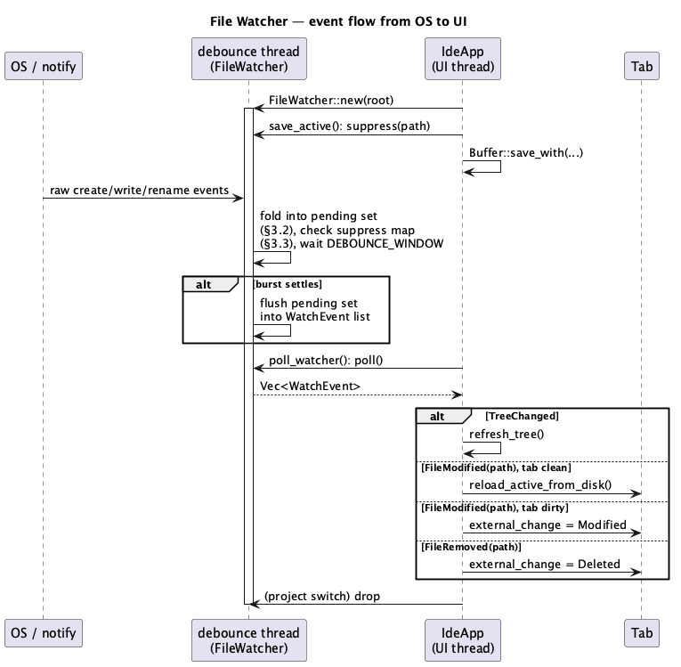
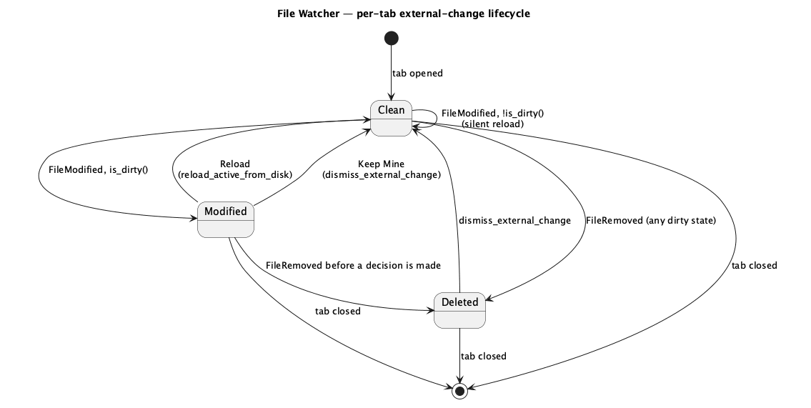

# File Watcher

Roadmap phase **G6** (`docs/roadmap.md` §2.15, §7 item 4). Two roles in the
project's declared order: **`rust-core-dev`** for the `notify`-backed
watcher and its debounce/suppression logic, then **`rust-ui-dev`** for
wiring it into tree refresh and the per-tab reload/keep-mine/deleted UX.
No `lsp`/`dap` role — nothing here talks to a language server or debug
adapter.

**`crates/core/src/file_watcher.rs` is a security-sensitive path** by
`CLAUDE.md`'s rule "any code that reads a user-chosen directory as a
project root … path traversal / symlink escape": the watcher walks and
watches the project's directory tree the same way `project::scan_tree`
does, on events it did not ask for, and a symlink inside the project that
points outside its root must not smuggle out-of-root paths into the events
the UI acts on. The core role's diff therefore requires a `hacker` pass
before merge. Nothing in the UI role's scope touches a declared sensitive
path.

## 1. Purpose

Today the directory tree only ever reflects what the app itself last
wrote, or what a manual "Refresh" click re-scans — `IdeApp::refresh_tree`
(`crates/ui/src/app.rs`), a plain re-run of `Project::scan_tree`. Nothing
runs it automatically. Two consequences, both roadmap §2.15's own words:

- A file created, deleted, or renamed outside the app (another terminal,
  `git checkout`, a build script, a second IDE window) never appears in
  the tree until the user remembers to click Refresh.
- A file open in a tab that changes on disk outside the app is never
  noticed at all — the editor keeps showing (and can silently overwrite,
  on the next save) content that no longer matches what's on disk.

This phase adds a `notify`-backed watcher, rooted at the open project,
that closes both gaps: automatic tree refresh, and a per-tab notice when
the open file changed or was deleted underneath it — reload it, keep the
in-editor version, or (for a deletion) acknowledge and decide whether to
re-save.

### 1.1 Scope

In:

| # | Feature | Where |
|---|---|---|
| 1 | `notify`-backed recursive watch of the open project root | core |
| 2 | Debouncing/coalescing bursts of raw OS events into a small event set | core |
| 3 | Suppressing events for a path the app itself just wrote | core |
| 4 | Automatic tree refresh on any create/remove/rename under root | ui |
| 5 | Per-tab "reload / keep mine" notice when the open file changed externally | ui |
| 6 | Per-tab "deleted externally" notice | ui |

Out, and named so the boundary is explicit:

- **Watching anything outside the open project root.** There is exactly
  one watch root at a time: the current `Project::root()`. No project
  open means no watcher running.
- **Auto-save, auto-format-on-save-elsewhere, or any reaction to a
  specific file's content beyond "it changed."** The watcher reports
  *that* a path changed, never *what* changed — diffing belongs to
  whatever already diffs (`git::diff_file`), not to this phase.
  Reacting to `Cargo.toml` changing specifically (dependency tree
  refresh) is **F4**'s job, layered on top of the same `TreeChanged`
  event this phase emits.
- **A settings toggle to turn watching off.** Always on while a project
  is open, same as `git.refresh` already is; a toggle is a **G1**
  settings-page concern if ever wanted.
- **Any reaction to an *untitled* buffer.** It has no path, so nothing
  on disk can change under it.

## 2. Interface / API

### 2.1 `ide_core::file_watcher` (new, core)

```rust
/// Largest number of distinct paths coalesced into one flush before the
/// watcher gives up naming them individually and reports `TreeChanged`
/// instead (§3.2) — bounds memory and event-handling cost during a burst
/// like `cargo clean` or a branch switch touching thousands of files.
pub const MAX_COALESCED_PATHS: usize = 512;

/// How long a burst of raw OS events is allowed to keep arriving before
/// the watcher treats it as settled and flushes (§3.2). Chosen well above
/// a single `write()`+`rename()` save sequence's inter-event gap and well
/// below "the user would notice a delay."
pub const DEBOUNCE_WINDOW: Duration = Duration::from_millis(300);

/// How long a path stays suppressed after `FileWatcher::suppress` (§3.3) —
/// covers a slow disk or a save that itself re-enters (EditorConfig's
/// `save_edit` transaction followed immediately by the actual write)
/// without also swallowing a genuine external edit that happens to land
/// in the same second.
pub const SUPPRESS_WINDOW: Duration = Duration::from_millis(1000);

#[derive(Debug, Clone, PartialEq, Eq)]
pub enum WatchEvent {
    /// Something was created, removed, or renamed somewhere under the
    /// watched root, or a burst exceeded `MAX_COALESCED_PATHS` (§3.2).
    /// The UI's answer is always the same: re-run `Project::scan_tree`.
    TreeChanged,
    /// An existing file's content changed on disk. Canonicalized, and
    /// already filtered through `SUPPRESS_WINDOW` (§3.3) and the root
    /// check (§4.2) — every path a caller sees here is real, in-root,
    /// external.
    FileModified(PathBuf),
    /// A file was removed (or renamed away from) this exact path. The
    /// canonical form of the **parent directory**, joined lexically with
    /// the removed entry's file name — never a re-`canonicalize()` of the
    /// removed path itself, which no longer exists by the time this event
    /// is built (§3.2's "removal" bullet, §4.2).
    FileRemoved(PathBuf),
}

#[derive(Debug, thiserror::Error)]
pub enum WatchError {
    #[error("failed to start watching {path}: {source}")]
    Start {
        path: PathBuf,
        #[source]
        source: notify::Error,
    },
}

pub struct FileWatcher { /* private */ }

impl FileWatcher {
    /// Starts watching `root` recursively on a background thread. Returns
    /// once the OS watch is registered; events arrive asynchronously,
    /// drained via `poll`. `root` is canonicalized internally — every
    /// event this watcher ever produces is checked against that
    /// canonical root (§4.2).
    pub fn new(root: &Path) -> Result<Self, WatchError>;

    /// Non-blocking drain of every `WatchEvent` flushed since the last
    /// call. Empty on a frame with nothing new. Never blocks — safe to
    /// call once per UI frame (§3.1's shape, matching `SearchPanel::poll`
    /// / `LspBridge::poll`).
    pub fn poll(&mut self) -> Vec<WatchEvent>;

    /// Marks `path` as "we just wrote this" for `SUPPRESS_WINDOW` (§3.3):
    /// the next raw OS event(s) for it are dropped rather than turned
    /// into `FileModified`. Call this immediately around the app's own
    /// write, `Buffer::save`/`save_with`. Never suppresses a `TreeChanged`
    /// from an unrelated path in the same burst.
    pub fn suppress(&mut self, path: &Path);
}
```

Dropping a `FileWatcher` stops the background thread and the OS watch —
`load_project`/`open_project` (ui) replace `IdeApp::watcher` wholesale on
every project switch, and the old watcher's `Drop` is what tears down the
old watch (§3.6).

### 2.2 `ide-ui`: state (`crates/ui/src/app.rs`)

```rust
pub struct IdeApp {
    // ... existing fields unchanged ...

    /// `None` when no project is open. Replaced (dropping the old one)
    /// every time `load_project` runs (§3.6).
    watcher: Option<FileWatcher>,
}

pub struct Tab {
    // ... existing fields unchanged ...

    /// Set by `poll_watcher` (§3.4/§3.5) when this tab's path changed or
    /// was removed on disk. Cleared by Reload, Keep Mine, dismissing a
    /// Deleted notice, or the tab closing. `None` for an untitled tab.
    external_change: Option<ExternalChange>,
}

#[derive(Debug, Clone, Copy, PartialEq, Eq)]
pub enum ExternalChange {
    /// §3.4. Offers Reload / Keep Mine.
    Modified,
    /// §3.5. Offers an acknowledgement (and, if the tab has unsaved
    /// content, an explicit "save to recreate the file" affordance —
    /// `save_active` already does that: `Buffer::save`/`save_with` create
    /// the file if it doesn't exist).
    Deleted,
}
```

### 2.3 `ide-ui`: methods (`crates/ui/src/app.rs`)

```rust
impl IdeApp {
    /// Drains `self.watcher.poll()` and dispatches every event (§3.4,
    /// §3.5). Called once per frame from `App::update`, after every other
    /// per-frame poll (`lsp.poll`, `search.poll`, `cargo.poll`) so it
    /// follows the same "poll everything, then paint" shape. No-op if no
    /// project is open.
    fn poll_watcher(&mut self);

    /// The doc §3.4 "Reload" action: re-reads the tab's file from disk
    /// through the normal `Buffer::open` path, replacing the buffer's
    /// text and clearing `external_change`. Discards unsaved edits and
    /// undo history, same as closing and reopening the tab would.
    fn reload_active_from_disk(&mut self);

    /// The doc §3.4/§3.5 "Keep Mine" / dismiss action: clears
    /// `external_change` without touching the buffer. The next save still
    /// overwrites whatever is on disk, exactly as it already would.
    fn dismiss_external_change(&mut self);
}
```

## 3. Behaviour

### 3.1 Background shape

`FileWatcher::new` spawns one thread that owns a `notify::RecommendedWatcher`
registered recursively on the canonicalized root, and a debounce loop
reading `notify`'s own event channel with a bounded wait
(`recv_timeout`). Every event bumps a "last activity" timestamp and is
folded into an in-memory pending set (§3.2); whenever `recv_timeout` times
out with `now - last_activity >= DEBOUNCE_WINDOW` and the pending set is
non-empty, the loop flushes it into `WatchEvent`s and sends them down an
`mpsc` channel `poll()` drains. This is the same "spawn a thread, poll a
channel once per frame" shape `SearchPanel`/`LspBridge`/`CargoPanel`
already use — no new concurrency primitive, no new async runtime.

### 3.2 Debouncing and coalescing

A single save is several raw OS events (`write` then a `rename` for an
atomic replace, or a plain `write` in place); a `git checkout` or a build
can be thousands. The pending state is three fields, folded from raw
events before any of it reaches the UI: `tree_changed: bool`,
`modified: HashSet<PathBuf>`, `removed: HashSet<PathBuf>`.

- A **create anywhere** under root sets `tree_changed = true`. A create is
  never itself a `FileModified`/`FileRemoved` candidate — nothing could
  already have that path open in a tab the instant it starts existing.
- A **content modification of an existing regular file** inserts its
  canonical path into `modified` — multiple modifications of the same
  path during one window still flush as one `FileModified`. If the path
  is currently in `removed` (a modify arriving after a remove of the same
  path within the window — order isn't guaranteed across raw OS events),
  the modify is dropped: removal is the more recent on-disk truth.
- A **remove (or the "from" half of a rename)** sets `tree_changed = true`
  *and* inserts a path into `removed`, computed as the **parent
  directory's canonical form, joined lexically with the removed entry's
  file name** — never `canonicalize()` on the removed path itself, which
  by definition no longer exists once the event fires. Computed at
  fold-time, while the parent is still expected to exist, not deferred to
  flush time. If the parent itself can no longer be canonicalized either
  (the whole containing directory was also removed in the same burst,
  e.g. deleting a folder that had an open file in it), the specific path
  is skipped — `tree_changed` alone still fires, and carries the tree
  refresh; there is no `FileRemoved` for a file whose containing
  directory disappeared with it in the same window. Removes any match
  already pending in `modified` (see above).
- If `modified.len() + removed.len()` would exceed `MAX_COALESCED_PATHS`,
  the flush gives up enumerating them, sets `tree_changed = true`, and
  clears both sets instead (§4.4) — a burst that big is treated as
  "something structural happened, just rescan," which is also correct for
  the tree refresh and cheaper than building a 512+ entry event list
  every frame during e.g. a `cargo clean`.
- The flush emits `TreeChanged` at most once, then one `FileRemoved` per
  surviving `removed` path, then one `FileModified` per surviving
  `modified` path — `TreeChanged` first since it's the cheapest, most
  structural signal; removals before modifications so a tab's Deleted
  notice (§3.5) always wins over a stale Modified one if both were
  somehow pending for the same path (shouldn't happen given the mutual
  exclusion above, but the ordering makes it harmless if it ever does).
  Within each set, iteration order is unspecified — `poll_watcher` (§2.3)
  dispatches every event independently, keyed by the path it carries, so
  no caller depends on the relative order of two different paths' events
  within one flush.

### 3.3 Suppressing the app's own writes

`Buffer::save`/`save_with` (and `save_tab_with_config`'s `EditorConfig`
pre-write transaction, `line-commands-and-editorconfig.md` §3.6) write the
exact file the watcher is watching. Without suppression, every `⌘S` would
round-trip into a spurious "reload externally modified?" notice on the
file the app itself just wrote.

`FileWatcher::suppress(path)` records `canonicalize(path) -> Instant::now()`
in a small map shared (behind a mutex) with the debounce thread. When the
debounce loop is about to turn a pending path into `FileModified`, it
checks the map first: a path suppressed within `SUPPRESS_WINDOW` is
dropped from the flush instead of emitted, and the map entry is removed
(one suppression covers one flush, not every future write to that path).
Stale entries older than `SUPPRESS_WINDOW` are pruned opportunistically on
each flush rather than on a separate timer.

Suppression **never** swallows `TreeChanged` — a rename that happens to
share a burst with a suppressed path still refreshes the tree, since
`tree_changed` is a single flag unrelated to any specific path.

`save_active`/`save_active_as` (ui, `app.rs`) call
`self.watcher.suppress(path)` immediately before the write
(`save_tab_with_config`), the same ordering `EditorConfig`'s own save
sequence already establishes: decide what's about to happen, then do it.

### 3.4 A tab's file changes externally

**Path identity.** `WatchEvent` paths are canonical by construction
(§3.2). `Tab::buffer`'s path is not: `open_file`'s existing doc comment
(`app.rs`) already allows a path from either `scan_tree()` (canonical) or
an explicit native-dialog result, and a native picker's returned path is
not guaranteed to equal `fs::canonicalize`'s output (a symlink component,
a case difference on a case-insensitive filesystem). This phase makes
`open_file` canonicalize its incoming `path` argument before it reaches
`Buffer::open`/`Tab` — the one place a path enters tab state — so every
`Tab::buffer.path()` is canonical from then on and every lookup below is a
plain equality, not a re-canonicalization on every poll. (This also
fixes `open_file`'s own already-existing dedup check — comparing against
already-open tabs — for the same symlink/case-difference edge case,
which was a latent gap this phase's canonicalization requirement happens
to close.)

`poll_watcher` maps `WatchEvent::FileModified(path)` to the tab (if any)
whose `buffer.path() == Some(&path)`:

- **The tab has no unsaved edits** (`!buffer.is_dirty()`): silently
  reloaded through the same path `reload_active_from_disk` uses — there
  is nothing of the user's to lose, and JetBrains' own behaviour here is
  exactly this, not a prompt for a no-op decision.
- **The tab has unsaved edits** (`buffer.is_dirty()`): `external_change`
  is set to `Modified` and stays there (rendered as a small banner above
  that tab's editor, `crates/ui/src/editor/mod.rs`'s render path, ui
  role's own call) until the user picks:
  - **Reload** — `reload_active_from_disk`: discards the in-memory edits
    and undo history, replaces the buffer with what's on disk now.
  - **Keep Mine** — `dismiss_external_change`: leaves the buffer exactly
    as it is; the next save still overwrites disk, same as it always
    would have.

A tab not currently visible still gets its `external_change` set; the
banner renders whenever that tab becomes active, it is not lost by
switching tabs in the meantime.

### 3.5 A tab's file is deleted externally

`WatchEvent::FileRemoved(path)` sets `external_change = Deleted` on the
matching tab (`buffer.path() == Some(&path)`, both sides canonical per
§3.4's path-identity note), regardless of dirty state —
unlike a content change, there is no "nothing to lose" case: the file is
simply gone, whether or not the tab has edits. The banner reads
accordingly and offers dismissal (`dismiss_external_change`); no separate
"reload" makes sense for a file that no longer exists. If the user saves
the tab afterward, `Buffer::save`/`save_with` recreate the file at that
path (existing behaviour, untouched by this phase) — the banner is
cleared by `dismiss_external_change` on the next explicit user action, not
automatically by the save, so a save the user didn't consciously connect
to "un-deleting" the file doesn't silently disappear the notice they might
still want to see.

### 3.6 Project switch and shutdown

`load_project` (ui) replaces `self.watcher` with a freshly constructed
`FileWatcher::new(project.root())`, dropping the previous one first —
`Drop` stops its background thread and OS watch before the new one
starts, so there is never more than one active watch. `open_project` and
`create_project` both funnel through `load_project`, so this is the one
place the watcher's lifecycle is managed, the same shape `git.refresh`
already has. Failure to start the watcher (`WatchError::Start` — e.g. an
OS resource limit) is reported through the existing `self.error` one-line
message and leaves `self.watcher = None`; the app degrades to "tree
refresh only works via the manual Refresh button," not a hard failure to
open the project.

## 4. Constraints & invariants

1. **Exactly one watch root**, tied to the currently open project;
   dropped and replaced on every project switch (§3.6).
2. **Every event is canonicalized and root-checked** before it reaches
   `poll()`'s caller: a symlink inside the project whose target resolves
   outside the canonicalized root produces no event for that path — same
   rule `project::scan_tree`'s `classify` (`crates/core/src/project.rs`)
   already enforces, applied here to watch registration and event paths
   (§3.2's fold-time canonicalization, both for a live path and, via the
   parent-directory technique, for a removed one) rather than a directory
   scan.
3. **Never blocks the UI thread.** `poll()` is a non-blocking drain;
   `new()` returns once the OS watch is registered, not once anything has
   been observed.
4. **Bounded memory per debounce window.** The pending-paths set is capped
   at `MAX_COALESCED_PATHS` (§3.2); nothing here grows without bound
   under a sustained burst.
5. **Suppression is time-bounded and path-scoped**, never global and
   never permanent — `SUPPRESS_WINDOW` after `suppress(path)`, that path
   only (§3.3).
6. **A `FileModified`/`FileRemoved` event only ever names a file that is
   still (for `FileRemoved`, was) inside the watched root.** No path
   escapes into UI-visible state that a user-facing action (open, reload)
   could then act on outside the project.
7. **Debounced, not throttled**: the watcher never drops the *fact* that
   something changed to stay within a rate limit — the coalescing in §3.2
   reduces event *count*, never event *coverage* (a burst always ends in
   either a `TreeChanged` or the exact set of paths that changed, never
   silence).

## 5. Examples

**Core: coalescing and suppression (illustrative, not literal thread
timing):**

```rust
let dir = tempfile::tempdir().unwrap();
let mut watcher = FileWatcher::new(dir.path()).unwrap();

// An external create is reported as a tree change.
std::fs::write(dir.path().join("new.txt"), "hi").unwrap();
std::thread::sleep(DEBOUNCE_WINDOW * 2);
assert!(watcher.poll().contains(&WatchEvent::TreeChanged));

// The app's own write to an existing file is suppressed.
let target = dir.path().join("f.txt");
std::fs::write(&target, "v1").unwrap();
std::thread::sleep(DEBOUNCE_WINDOW * 2);
watcher.poll(); // drain the create-of-f.txt tree change first

watcher.suppress(&target);
std::fs::write(&target, "v2").unwrap(); // the app's own save
std::thread::sleep(DEBOUNCE_WINDOW * 2);
assert!(!watcher
    .poll()
    .iter()
    .any(|e| matches!(e, WatchEvent::FileModified(p) if p == &target.canonicalize().unwrap())));

// A later, un-suppressed external edit is reported.
std::fs::write(&target, "v3 from outside").unwrap();
std::thread::sleep(DEBOUNCE_WINDOW * 2);
assert!(watcher
    .poll()
    .iter()
    .any(|e| matches!(e, WatchEvent::FileModified(p) if p == &target.canonicalize().unwrap())));
```

**UI: a clean tab reloads silently, a dirty one waits for a decision:**

```rust
// tab A: opened, never edited -- reload happens without asking.
// tab B: opened, then typed into -- external_change becomes Some(Modified)
// and stays there until reload_active_from_disk or dismiss_external_change
// runs for that tab.
```

## 6. Dependencies & integration points

**Depends on**: `Project::root()` (core, existing) for the watch root;
`Buffer::is_dirty`/`open`/`save`/`save_with` (core, existing) for reload
and suppression; `SearchPanel`/`LspBridge`'s established
thread-plus-polled-channel shape (ui, existing) as the pattern this
follows, not a dependency in the Cargo sense.

**Consumed by**: **F4** (build integration) reacts to `TreeChanged`
specifically for `Cargo.toml` the same way; **E7** (git gutter) and any
future "external git operation changed refs" handling can listen to the
same `TreeChanged` signal `git.refresh` already gets nudged by via
`refresh_tree`.

**New dependency**: `notify` (already approved in `CLAUDE.md`'s dependency
table for phase G6). No debouncer crate — the debounce/suppress logic in
§3.2/§3.3 is hand-rolled, in `ide-core`, unit-testable independently of
the real OS watcher (§7's Cargo table lists no second crate for this
phase, and the logic is small enough to own directly, the same call A4b's
doc made for its glob matcher rather than pulling in one).

**Tests** — `#[cfg(test)] mod tests` alongside the code, ≥80% line
coverage on every non-rendering file touched.

*Core:*
1. `TreeChanged` on create/remove/rename anywhere under root.
2. `FileModified` on a content change to an existing file; multiple rapid
   writes to the same path coalesce into one event.
3. `suppress` drops the next `FileModified` for that path within
   `SUPPRESS_WINDOW`, but not a `TreeChanged` in the same burst, and not a
   `FileModified` for a *different* path.
4. A burst exceeding `MAX_COALESCED_PATHS` distinct modified paths
   produces `TreeChanged` instead of the individual events.
5. **Security**: a symlink inside the watched root pointing outside it
   produces no event for paths reached through it; an event path is
   always canonicalized and root-checked before reaching `poll()`.
6. Dropping the `FileWatcher` stops its background thread (no event
   arrives after drop, even given a subsequent external write).
7. `FileRemoved`'s path is the parent directory's canonical form joined
   with the removed entry's name (§3.2) — verified against an independent
   `canonicalize()` of the parent taken *before* the removal, not derived
   from the same code path under test.
8. Removing an entire subtree (parent directory gone too) produces
   `TreeChanged` only, no `FileRemoved` for the files that were under it.
9. A modify and a remove of the same path landing in one debounce window
   flushes as `FileRemoved` only, never both and never a stray
   `FileModified` for a path that no longer exists.

*UI:*
7. `poll_watcher` on `TreeChanged` calls the same refresh `refresh_tree`
   already performs.
8. `FileModified` for a clean tab reloads silently; for a dirty tab sets
   `external_change = Some(Modified)` and leaves the buffer untouched.
9. `FileRemoved` sets `external_change = Some(Deleted)` regardless of
   dirty state.
10. `reload_active_from_disk` replaces buffer text and clears
    `external_change`; `dismiss_external_change` clears it without
    touching the buffer.
11. `save_active`/`save_active_as` call `suppress` before writing.
12. `load_project` replaces `watcher`, and a `WatchError::Start` surfaces
    through `self.error` without failing the project open.
13. `open_file` canonicalizes its `path` argument before it reaches
    `Buffer::open`/`Tab` (§3.4's path-identity note) — opening the same
    file via two syntactically different but canonically-equal paths
    (e.g. one through a symlinked directory) focuses the one existing tab
    rather than opening a second one.

## 7. Diagram




## Revision notes

Round 1 review (3 findings, 2 blocking).

1. **`FileRemoved`'s canonicalization was asserted, never specified, and
   `fs::canonicalize` cannot run on a path the OS already reports as
   gone.** §3.2's removal handling now computes the parent directory's
   canonical form and joins it lexically with the removed entry's name, at
   fold time; §2.1's `FileRemoved` rustdoc and §4.2 point at this instead
   of an unspecified "pre-removal canonical path." Named the edge case a
   real mechanism has to have: a subtree removed as a whole (parent gone
   too) falls back to `TreeChanged` alone, no per-file `FileRemoved` (new
   test 8). This also exposed that the original single `tree_changed`
   bool could never have produced a path-carrying `FileRemoved` at all —
   §3.2's pending state is now `tree_changed` plus two path sets
   (`modified`, `removed`), with removal taking precedence over a modify
   of the same path within one window (new test 9).
2. **Matching a `WatchEvent` path against `Tab::buffer.path()` compared a
   canonical path against a not-necessarily-canonical one.** `open_file`
   can take a path from a native dialog, which isn't guaranteed to equal
   `fs::canonicalize`'s output. §3.4 now states `open_file` canonicalizes
   its incoming path before it reaches `Buffer`/`Tab`, so every tab path
   is canonical from then on and every event-to-tab lookup is a plain
   equality (new test 13) — as a side effect this also closes a latent gap
   in `open_file`'s existing already-open-tab dedup check for the same
   symlink/case-difference edge case.
3. Two cross-references pointed at the wrong section (`§4.5` instead of
   `§4.2` for the root-check invariant, twice) or at a section that
   doesn't exist in this doc (`§5.1`, presumably meant for
   `project::scan_tree`'s `classify` directly). Corrected.

Round 2 review (1 finding, blocking).

4. **The round-1 pending-state redesign declared `modified`/`removed` as
   `HashSet<PathBuf>` but then asserted paths within each set flush
   "ordered by when they were first seen this window" — a guarantee a
   `HashSet` cannot provide.** No test in §6 needs cross-path ordering
   within a flush (test 2 covers same-path coalescing, test 9 covers
   same-path modify/remove precedence, neither is about ordering between
   different paths), and `poll_watcher` (§2.3) dispatches each event
   independently by path, so nothing downstream depends on it either.
   §3.2's flush-order paragraph now states iteration order within each set
   is unspecified instead of asserting an ordering the declared type can't
   give.
