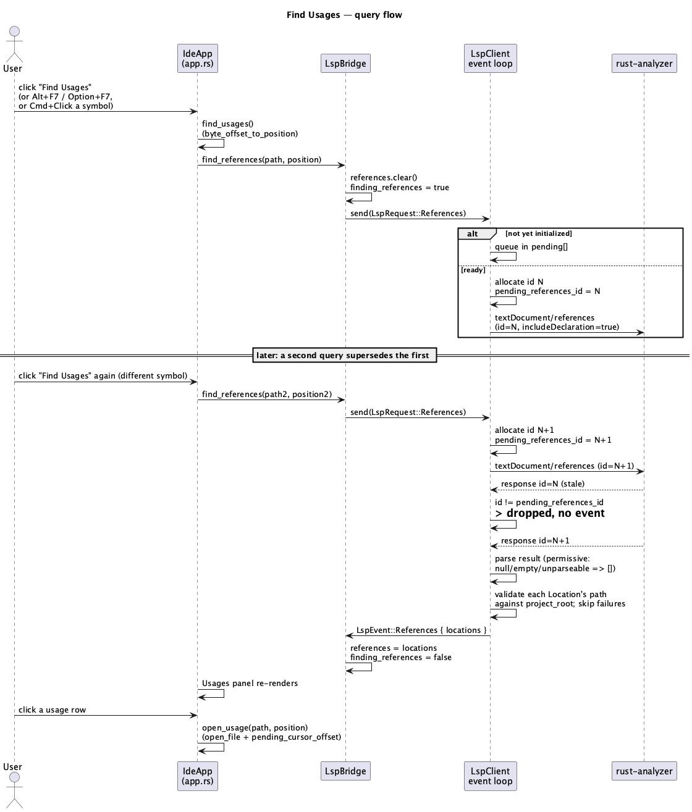

# Find Usages v1

## 1. Purpose

Adds "find usages" / "find references" code analysis on top of the
already-merged `rust-language-support` LSP integration: given the cursor
position in the active editor tab, ask `rust-analyzer` for every reference
to whatever symbol (function, struct, field, variable, etc.) the cursor is
on, and show the results — file + line, grouped by file — in a new bottom
panel view. Clicking a result opens that file and jumps to the location.

v1 scope:

- Three ways to trigger a query, all converging on the same
  `find_usages()` action (§3): a "Find Usages" toolbar button; the
  JetBrains-standard keyboard shortcut `Alt+F7` (`Option+F7` on macOS —
  `egui::Modifiers::alt` already abstracts the physical key, so one binding
  covers both), wired into the existing `handle_shortcuts` method
  alongside the current `Cmd+S`/`Cmd+Z`/`Cmd+Shift+Z` bindings; and
  `Cmd+Click` (`Ctrl+Click` on Windows/Linux, via `egui::Modifiers::command`
  — same cross-platform abstraction `handle_shortcuts` already uses)
  directly on a symbol in the editor, matching the same gesture's
  conventional meaning in JetBrains IDEs and VS Code. All three query the
  symbol at whatever the active tab's cursor position is at the moment of
  the trigger — for `Cmd+Click`, that's the position the click itself just
  moved the cursor to (§3).
- A new "Usages" bottom-panel view (alongside the existing "Problems" and
  "Cargo Output" views) listing every returned location, grouped by file,
  clickable to navigate.
- `ide-lsp` gains request/response support for exactly one new LSP method,
  `textDocument/references` — the client's first *request* beyond the
  internal `initialize`/`shutdown` handshake (every other outgoing message
  today is a fire-and-forget notification: `didOpen`/`didChange`/
  `didClose`).

**Explicitly deferred** to a future feature (same framing
`rust-language-support.md` used): go-to-definition, hover, autocompletion,
rename, code actions, and any other LSP request — in particular,
`Cmd+Click` in v1 always searches references, never jumps to a
declaration, even though "go to definition" is what that gesture means in
some other editors; that mapping is a deliberate v1 scope choice, not an
oversight, since go-to-definition itself is out of scope (see above). Also
deferred: a line-text preview next to each usage in the panel (v1 shows
`path:line:column` only, no file content read to extract the surrounding
line); de-duplicating results beyond what `rust-analyzer` itself returns.

Does not touch `crates/core/**` — this feature adds one new outgoing LSP
request type and one new response-driven event on top of `ide-lsp`'s
existing connection, plus UI wiring; nothing it needs is missing from
`Project`'s or `Buffer`'s existing public API.

## 2. Interface / API

### 2.1 `ide-lsp` (additions to the existing public API)

```rust
use std::path::{Path, PathBuf};

#[derive(Debug, Clone, Copy, PartialEq, Eq)]
pub struct Position {
    pub line: u32,
    pub character: u32,
}

#[derive(Debug, Clone, Copy, PartialEq, Eq)]
pub struct Range {
    pub start: Position,
    pub end: Position,
}

/// One location a symbol is referenced from — a validated, in-project-root
/// path (same discipline as `LspEvent::Diagnostics`' `path`) plus the span
/// `rust-analyzer` reported for that reference.
#[derive(Debug, Clone, PartialEq, Eq)]
pub struct Location {
    pub path: PathBuf,
    pub range: Range,
}

pub enum LspRequest {
    DidOpen { path: PathBuf, text: String },
    DidChange { path: PathBuf, text: String },
    DidClose { path: PathBuf },
    /// Query every reference to the symbol at `position` in `path`.
    /// Sending a new `References` request while one is already
    /// outstanding *supersedes* it — the client tracks only the most
    /// recently sent references request; a response for an older,
    /// superseded one is dropped without emitting an event (see §3, §4).
    /// There is no cancel notification sent to the server — v1 relies on
    /// the client-side id check alone, the same "drop what's stale"
    /// discipline diagnostics coalescing already uses.
    References { path: PathBuf, position: Position },
}

pub enum LspEvent {
    Diagnostics { path: PathBuf, diagnostics: Vec<Diagnostic> },
    ServerExited { message: String },
    /// The result of the most recently sent, not-yet-superseded
    /// `LspRequest::References` query. Delivered exactly once per
    /// non-superseded request — including when the server returned zero
    /// results, an empty/`null` result, or a response the client
    /// couldn't fully parse (§3, §4) — so a UI-side "finding usages…"
    /// indicator always has something to clear it on, unlike
    /// `Diagnostics`, which nothing is ever synchronously waiting on.
    /// Locations that individually fail URI/path validation are dropped
    /// from the list rather than discarding the whole response.
    References { locations: Vec<Location> },
}

impl LspClient {
    // existing: start, start_with_command, send, try_recv — unchanged.
}

/// Converts a byte offset into `text` (must be a valid UTF-8 char
/// boundary) into an LSP `Position` (UTF-16 code units into its line).
/// `None` if `byte_offset` is out of range or not on a char boundary — the
/// inverse of `position_to_byte_offset`, same LF-line-ending assumption.
pub fn byte_offset_to_position(text: &str, byte_offset: usize) -> Option<Position>;
```

Everything else in `ide-lsp`'s existing public API (`LspError`,
`DiagnosticSeverity`, `Diagnostic`, `MAX_CONTENT_LENGTH`,
`position_to_byte_offset`) is unchanged.

### 2.2 `ide-ui`

```rust
// crates/ui/src/lsp_bridge.rs — additions to the existing LspBridge
struct LspBridge {
    client: Option<LspClient>,
    diagnostics: HashMap<PathBuf, Vec<Diagnostic>>,
    server_error: Option<String>,
    /// Result of the most recent (non-superseded) find-usages query;
    /// replaced wholesale on each `LspEvent::References`, cleared when a
    /// new query is sent. Not keyed by path/query — v1 shows one query's
    /// results at a time, matching `CargoPanel`'s "one thing in flight"
    /// simplicity.
    references: Vec<Location>,
    /// True from the moment `find_references` sends the request until a
    /// matching `LspEvent::References` (or `ServerExited`) arrives — backs
    /// the Usages panel's "Finding usages…" state.
    finding_references: bool,
}

impl LspBridge {
    /// No-op if no client is running. Clears any previous `references`
    /// and sets `finding_references`, then sends
    /// `LspRequest::References { path, position }`.
    fn find_references(&mut self, path: &Path, position: Position);
}
```

`IdeApp` (in `app.rs`) gains:

- `active_cursor_offset: Option<usize>` — the active tab's current cursor
  position as a byte offset into its `scratch` text, refreshed every frame
  the editor is rendered (from the `TextEdit`'s own cursor state, the same
  `TextEditOutput` already read for `pending_cursor_offset` — see §3).
  `None` whenever there's no active tab or the editor wasn't rendered this
  frame (e.g. the Source Control view is showing instead).
- A `find_usages(&mut self)` action: converts `active_cursor_offset` to a
  `Position` via `byte_offset_to_position` and calls
  `self.lsp.find_references(path, position)`; no-op if there's no active
  tab, the active tab has no path (an unsaved "Untitled" buffer), no
  cursor offset is known, the offset fails to convert, or `view_mode !=
  ViewMode::Editor`. Invoked from three places — the toolbar button, the
  `Alt+F7`/`Option+F7` shortcut, and `Cmd+Click`/`Ctrl+Click` on the editor
  (§3) — all sharing this one no-op condition list rather than each
  trigger re-deriving its own gating.
- `BottomView` gains a third variant, `Usages`. Because a single toggle
  button no longer fits three states, the bottom panel's view switcher
  changes from one toggle button to a row of `selectable_label`s ("Problems"
  / "Cargo Output" / "Usages", one always highlighted) — reusing the exact
  selection pattern the editor's own tab strip (`render_tabs_and_editor`)
  already uses, rather than extending `BottomView::toggled()` into a
  three-way cycle that would need up to two clicks to reach the third view.
- `open_diagnostic` and the new `open_usage(&mut self, path: &Path,
  position: Position)` (Problems-panel and Usages-panel row clicks,
  respectively) share their existing "open the file, then best-effort
  place the cursor" logic — both do the same thing to a `Position` from a
  server-validated source, so the implementer should factor that shared
  body into one private helper rather than duplicating it.

## 3. Behaviour

### Triggering a query

- The toolbar's "Find Usages" button is shown only when
  `is_rust_project()`, `self.lsp.is_running()`, and `view_mode ==
  ViewMode::Editor` are all true — the extra `view_mode` check (beyond the
  existing Rust-specific toolbar buttons' gating) exists because
  `active_cursor_offset` is only ever meaningful while the editor is the
  thing being looked at (see below); without it, the button would be
  visible-but-guaranteed-to-no-op whenever the Source Control view is
  showing instead. Clicking it calls `find_usages()` and switches
  `bottom_view` to `Usages` so the results are visible without an extra
  click.
- `active_cursor_offset` is captured from `render_tabs_and_editor`'s
  existing `TextEdit::show` call: read `output.cursor_range`'s primary
  cursor's char index, convert it to a byte offset (`scratch.char_indices()
  .nth(char_index)`, or `scratch.len()` if the cursor is at the end — the
  same char-index/byte-offset conversion direction `pending_cursor_offset`
  already does the reverse of), and store it every frame the editor
  renders. This mirrors `pending_cursor_offset`'s existing read/write of
  the same `TextEditOutput`, just in the opposite direction (reading the
  live cursor instead of setting it).
- `Alt+F7` (`Option+F7` on macOS) is checked in `handle_shortcuts`
  alongside the existing save/undo/redo bindings: `ctx.input(|i|
  i.modifiers.alt && i.key_pressed(egui::Key::F7))`. Same effect and same
  gating as the toolbar button (`is_rust_project() && lsp.is_running() &&
  view_mode == ViewMode::Editor` — a shortcut firing while, say, the
  Source Control view is showing is a no-op, exactly like the button being
  absent would be) — it's simply a second way to invoke `find_usages()`,
  not a separate code path with its own rules.
- `Cmd+Click` (`Ctrl+Click` on Windows/Linux) is checked immediately after
  `render_tabs_and_editor`'s `TextEdit::show` call, in the same place
  `active_cursor_offset` is captured (this only runs while `view_mode ==
  ViewMode::Editor`, so no separate view-mode gate is needed here): if
  `output.response.clicked()` and `ctx.input(|i| i.modifiers.command)` are
  both true, call `find_usages()` and switch `bottom_view` to `Usages`.
  Because this check runs *after* `active_cursor_offset` was just
  refreshed from the same `output`, the query naturally uses the position
  the click itself moved the cursor to — egui's own default `TextEdit`
  click handling already places the cursor at the click point before
  `.show()` returns, so no extra hit-testing is needed beyond reading the
  cursor position that's already there. The click's normal effect (moving
  the cursor, and thus what a *subsequent* plain click or keypress would
  operate on) is left as-is — v1 doesn't suppress or otherwise special-case
  the click beyond additionally triggering the query.

### Query lifecycle

- `find_references` on `LspBridge` clears `references`, sets
  `finding_references = true`, and sends `LspRequest::References`. If no
  client is running, it does nothing at all (leaves `finding_references`
  false) — otherwise a query with no client to ever answer it would leave
  the panel stuck showing "Finding usages…" forever.
- Sending a `References` request before `initialize` has completed queues
  it the same way `DidOpen`/`DidChange`/`DidClose` already do (the
  existing `pending: Vec<LspRequest>` replay-on-ready mechanism);
  triggering a second `find_references` call while the first is still
  queued simply means the second one is what eventually gets sent when
  the connection becomes ready — the client only ever tracks the most
  recent request's id as "the one an incoming response must match to be
  delivered."
- Each outgoing `References` request gets a fresh JSON-RPC id (disjoint
  from the reserved `initialize`(1)/`shutdown`(2) ids), recorded as "the
  currently pending references request." Sending another `References`
  request overwrites that record with the new id — a response that later
  arrives for the old id no longer matches anything and is dropped, no
  event emitted, no error. Only a response matching the currently-pending
  id is turned into `LspEvent::References` and clears the pending record.
- A references response is parsed permissively: a `null` or empty
  `result`, or a `result` this client can't fully deserialize, all become
  `LspEvent::References { locations: vec![] }` rather than being dropped
  silently — something must always arrive to clear a waiting UI's
  "Finding usages…" state (§4 elaborates why this differs from
  `publishDiagnostics` notification handling). Individual entries in a
  parseable `result` array whose URI doesn't convert to a path, or whose
  path fails `validate_path` against the project root, are skipped —
  the rest of the response is still delivered.
- `LspBridge::poll` (already draining `try_recv` in a loop every frame)
  handles `LspEvent::References` by replacing `self.references` and
  clearing `self.finding_references`; `LspEvent::ServerExited` (already
  handled) additionally clears `finding_references` too, so a crashed
  server doesn't leave the panel stuck mid-query.

### Usages panel

- Bottom panel, selected via the new three-way Problems/Cargo Output/
  Usages selector (§2.2). Shows "Finding usages…" while
  `self.lsp.finding_references` is true; otherwise "No usages found." if
  `self.lsp.references` is empty (whether that's because nothing was ever
  queried yet, or a completed query genuinely found nothing — v1 doesn't
  distinguish the two, same as the Problems panel's existing "No
  problems." not distinguishing "never had diagnostics" from "all fixed").
  Otherwise, one row per location, grouped by file (heading per path,
  sorted the same way the Problems panel sorts its path headings), rows
  within a file ordered by `range.start` (line, then character) for a
  stable, readable order regardless of the order `rust-analyzer` returned
  them in — labelled `line:column` (1-based for display; LSP positions are
  0-based). Clicking a row calls `open_usage(path, location.range.start)`.

## 4. Constraints & invariants

- Path/position provenance (mirrors the existing invariant from
  `rust-language-support.md` §4): `find_usages`'s `path` and `position`
  come only from the active tab's own `buffer.path()` and its own
  `scratch` text via `byte_offset_to_position` — never constructed from
  anything else. `open_usage`'s `path`/`position` come only from
  `LspBridge::references`' own entries, which are themselves already
  validated against `project_root` inside `ide-lsp` before the event is
  ever emitted (same discipline `open_diagnostic` already follows for
  `LspBridge::diagnostics`).
- `LspClient::send`'s existing "validate every outgoing path against
  `project_root`, silently drop otherwise" behavior (`rust-language-
  support.md` §4) applies to `References` exactly as it already applies to
  `DidOpen`/`DidChange`/`DidClose` — a `References` request for a path
  outside the project root is never sent (no id is allocated for it,
  either), defense in depth on top of the UI-side provenance rule above.
- Response permissiveness is a deliberate asymmetry from
  `publishDiagnostics` handling, not an oversight: a notification nobody
  is synchronously waiting on can be safely dropped on any parse failure
  (§3/§4 of `rust-language-support.md`), but a request/response pair has a
  waiting caller (`finding_references`) that needs a definite answer —
  dropping a malformed references *response* the same way a malformed
  notification is dropped would leave the Usages panel stuck. A malformed
  or unreadable *frame* (bad `Content-Length`, invalid JSON at all) is
  still fatal exactly as before — that's a wire-level failure, not a
  response-shape issue, and applies uniformly to every message regardless
  of method.
- At most one references query is meaningfully "in flight" from the
  client's perspective at a time (the single `pending id` slot) — this is
  a client-side simplification, not a server-side cancel: `rust-analyzer`
  itself may still compute and send a response for a superseded request;
  the client just discards it unmatched rather than sending an LSP
  `$/cancelRequest`. Acceptable for v1 given how cheap discarding an
  unwanted JSON response is compared to implementing request
  cancellation.
- `textDocument/references` is always sent with `context.includeDeclaration:
  true` — the symbol's own declaration is included in the results, matching
  the default "find usages" behavior in comparable IDEs (VS Code,
  IntelliJ).

## 5. Examples

**Triggering a query and reacting to the result:**

```rust
let position = ide_lsp::byte_offset_to_position(&tab.scratch, cursor_offset)?;
lsp_bridge.find_references(path, position);
// ... later, once per frame, inside LspBridge::poll's existing try_recv loop:
if let LspEvent::References { locations } = event {
    // update the Usages panel; locations may be empty
}
```

**Converting a location for display/navigation:**

```rust
let start = ide_lsp::position_to_byte_offset(&tab.scratch, location.range.start).unwrap_or(0);
// open_usage(&location.path, location.range.start) opens the file and
// places the cursor at `start` once the tab renders, same mechanism
// open_diagnostic already uses.
```

## 6. Dependencies & integration points

- No new external dependencies in either crate — `textDocument/references`
  reuses `lsp_types::Location`/`lsp_types::ReferenceParams` (already a
  dependency via `lsp-types`, per `rust-language-support.md` §6) for
  encoding/decoding, and `url` (already a dependency) for the same
  URI↔path conversion `publishDiagnostics` handling already does.
- Builds entirely on the already-merged `ide-lsp` connection/event-loop
  machinery (`rust-language-support.md`) — no new subprocess, no new
  spawn path, no new wire framing. The only new client-visible behavior is
  a second kind of outgoing JSON-RPC message (a request with an id,
  instead of a notification) and its correlated response.
- `ide-ui`: extends `lsp_bridge.rs` and `app.rs`/`app/render.rs` only.
  Does not touch `crates/ui/src/cargo_panel.rs` or
  `crates/ui/src/claude_panel.rs` — this role's diff for this feature
  therefore doesn't touch either of `CLAUDE.md`'s declared-sensitive
  `ide-ui` paths, so (per that file's own rule) a `hacker` pass isn't
  required for the `rust-ui-dev` role this time, only for `rust-lsp-dev`
  (`crates/lsp/**` is unconditionally on the sensitive list).

## 7. Diagrams

**Find-usages query flow (including the supersede/malformed-response
cases):**



## Revision notes

Per `rev`'s first-pass finding:

- Gated the "Find Usages" toolbar button on `view_mode == ViewMode::Editor`
  in addition to the existing `is_rust_project()`/`is_running()` checks —
  without it, the button was visible-but-guaranteed-to-no-op whenever the
  Source Control view was showing, since `active_cursor_offset` is only
  ever populated while the editor renders.

Per direct user request, added two more ways to trigger a query beyond the
toolbar button, both converging on the same `find_usages()` action and its
existing no-op gating:

- `Alt+F7`/`Option+F7`, matching JetBrains IDEs' default "Find Usages"
  shortcut, wired into the existing `handle_shortcuts` method.
- `Cmd+Click`/`Ctrl+Click` on a symbol in the editor, matching the
  conventional modifier-click-to-navigate gesture from JetBrains/VS Code —
  explicitly scoped to always mean "search references" in v1, never "go to
  definition," since go-to-definition remains out of scope entirely (§1).
