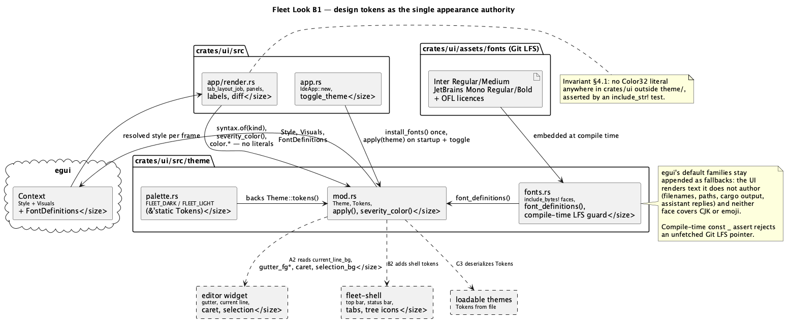

# Fleet Look: Design-Token Foundation v1

Roadmap phase **B1** (`docs/roadmap.md` §6, trek B). Owned entirely by
`rust-ui-dev` — the diff is confined to `crates/ui/**` plus two
repository-level files (`.gitattributes`, and the font assets under
`crates/ui/assets/`). No security-sensitive path is touched, so `hacker` is
skipped for this run.

## 1. Purpose

The app's appearance is currently assembled from two ad-hoc sources:
`egui::Visuals::dark()`/`light()` verbatim (`app.rs:75-81`), and 34
hardcoded colour literals scattered through `render.rs` — 12 outside the
syntax palette (3 diagnostic underlines, 5 error labels, 2 warnings, 2 diff
lines) plus the 22 entries of `token_color` (11 token kinds × 2 themes), all
enumerated in §3.3. There is no font setup at all — the app runs on egui's
built-in Ubuntu-Light/Hack pair.

Two problems follow, and this phase exists to fix both:

1. **The target look is unreachable from here.** `docs/roadmap.md` §4 commits
   to JetBrains **Fleet**'s appearance: near-neutral greys (background
   ≈ `#18181A`), a single blue accent, minimal saturation in the UI with all
   saturation reserved for code, dense spacing, small radii, and Inter +
   JetBrains Mono typography. None of that can be expressed by picking
   between two stock egui palettes, and none of it can be applied
   consistently while every colour decision lives at its point of use.
2. **Phase A2 (the custom editor widget) is blocked without it.** The widget
   paints its own gutter, current-line highlight, caret and selection —
   things egui's `Visuals` has no field for. If A2 invents those colours
   inline, the same problem this phase solves gets recreated inside the
   largest phase of the roadmap. So B1 is A2's precondition: the palette
   must already name every colour the editor and its gutter will need.

This phase therefore introduces one authority for appearance — a token
module — moves everything that already exists onto it, and adds the fonts.

**Explicitly out of scope** (roadmap B2 `fleet-shell`, G3 `themes`): panel
relayout, the top bar, the status bar, tab restyling, tree icons, and
loading a theme from a file. The token *structure* is designed so G3 can
deserialize it later without a redesign, but nothing in this phase reads a
theme from disk. Also out of scope: any change to `ide-core`'s `TokenKind`
vocabulary — this phase colours the eleven kinds that already exist.

## 2. Interface / API

New module tree, all within `crates/ui/src`:

```
theme/mod.rs        Theme, Tokens, apply, install_fonts, severity_color
theme/palette.rs    FLEET_DARK, FLEET_LIGHT (the two Tokens constants)
theme/fonts.rs      embedded font bytes, font_definitions(), family names
assets/fonts/       the four .ttf files + two OFL licence texts (Git LFS)
```

### 2.1 `Theme`

Moves out of `app.rs` into `crate::theme`, unchanged in shape — the serde
representation must stay identical (variant names `Light`/`Dark`) so a
`Theme` already persisted under the `ide_theme` storage key still loads.
`toggled` becomes `pub`.

```rust
#[derive(Debug, Clone, Copy, PartialEq, Eq, serde::Serialize, serde::Deserialize)]
pub enum Theme { Light, Dark }

impl Theme {
    pub fn toggled(self) -> Self;
    pub fn is_dark(self) -> bool;
    /// The palette backing this theme. `&'static` — tokens are compile-time
    /// constants, never allocated per frame.
    pub fn tokens(self) -> &'static Tokens;
    /// `egui::Visuals` built field-by-field from `tokens()` (§3.2).
    pub fn visuals(self) -> egui::Visuals;
}
```

### 2.2 `Tokens`

```rust
pub struct Tokens {
    pub color: Colors,
    pub syntax: SyntaxColors,
    pub space: Spacing,
    pub radius: Radii,
    pub text: TextSizes,
}
```

```rust
pub struct Colors {
    // Surfaces, back to front. There is deliberately no `bg_inset` yet:
    // while the editor is still an `egui::TextEdit`, egui's single
    // `extreme_bg_color` field serves both the editor and ordinary text
    // fields, so a separate inset colour would have no consumer. A2 splits
    // them, and introduces the token then.
    pub bg_base: Color32,        // window / panel background
    pub bg_elevated: Color32,    // toolbar, popups, windows
    pub bg_editor: Color32,      // the text area itself
    pub bg_hover: Color32,
    pub bg_active: Color32,      // pressed / selected row

    pub border: Color32,
    pub border_strong: Color32,  // focused widget outline

    /// Plain text. Maps onto `widgets.noninteractive.fg_stroke`, which is
    /// what `Visuals::text_color()` resolves to (§3.2).
    pub fg_primary: Color32,
    /// A widget's own label at rest — dimmer until hovered, which is how
    /// Fleet's chrome reads. Maps onto `widgets.inactive.fg_stroke`.
    pub fg_secondary: Color32,
    /// Placeholders and de-emphasised text. Maps onto
    /// `Visuals::weak_text_color`.
    pub fg_muted: Color32,
    pub fg_on_accent: Color32,

    /// Fill of an accented surface (primary button, active tab marker).
    /// `fg_on_accent` is what sits on top of it, so this one is bound by
    /// text contrast *against white* (§4.2).
    pub accent: Color32,
    pub accent_hover: Color32,
    /// The accent as *foreground* — links, focus strokes, the caret's
    /// relatives. Bound by contrast against `bg_base`, which in a dark
    /// theme pulls the opposite way from `accent`'s own floor: a blue light
    /// enough to read on `#18181A` is too light to carry white text. One
    /// token cannot satisfy both, which is why there are two.
    pub accent_fg: Color32,

    // Status. `info` doubles as the Information/Hint diagnostic colour.
    pub danger: Color32,
    pub warning: Color32,
    pub success: Color32,
    pub info: Color32,

    // Editor-surface colours. `selection_bg` and `caret` are consumed in
    // this phase (they map onto real `Visuals` fields); the three below
    // them have no consumer until A2 — see §4.4.
    pub selection_bg: Color32,
    pub caret: Color32,
    pub current_line_bg: Color32,
    pub gutter_fg: Color32,
    pub gutter_fg_active: Color32,

    // Diff view: foreground for the line's text, background tint for the
    // line itself. Both pairs are consumed in this phase (§3.3).
    pub diff_added_fg: Color32,
    pub diff_added_bg: Color32,
    pub diff_removed_fg: Color32,
    pub diff_removed_bg: Color32,
}
```

```rust
/// One colour per `ide_core::TokenKind`, except `Punctuation`, which
/// deliberately has none: it resolves to the caller's plain text colour so
/// brackets and separators recede and `Operator` is what stands out
/// (behaviour inherited unchanged from
/// `richer-highlighting-and-usages-popup.md` §3).
pub struct SyntaxColors {
    pub keyword: Color32,
    pub string: Color32,
    pub number: Color32,
    pub comment: Color32,
    pub key: Color32,
    pub function: Color32,
    pub type_: Color32,
    pub macro_: Color32,
    pub constant: Color32,
    pub operator: Color32,
}

impl SyntaxColors {
    /// `default` is returned for `TokenKind::Punctuation` only.
    pub fn of(&self, kind: TokenKind, default: Color32) -> Color32;
    /// Every field with its name, for the contrast tests of §4.2 — so a
    /// field added later can't quietly skip the legibility floor.
    pub fn all(&self) -> [(&'static str, Color32); 10];
}
```

```rust
/// `f32` because these feed `Vec2` fields (`item_spacing`,
/// `button_padding`) and `Spacing::indent`, which are `f32`.
pub struct Spacing { pub xs: f32, pub sm: f32, pub md: f32, pub lg: f32, pub xl: f32 }
/// `u8` deliberately: egui 0.36's `epaint::CornerRadius` stores each corner
/// as `u8`, so an `f32` here would only exist to be cast at every use.
pub struct Radii { pub sm: u8, pub md: u8, pub lg: u8 }
pub struct TextSizes { pub small: f32, pub body: f32, pub heading: f32, pub code: f32 }
```

`egui::Margin` is `i8`-per-side in 0.36, so the two margin assignments in
§3.2 convert explicitly (`Margin::same(space.md as i8)`); every value in the
`Spacing` scale is small and positive, so the cast is lossless for this
table and asserted by the §6 test 6.

Values (identical in both themes — only colours differ between palettes):

| Field | Value | Field | Value |
|---|---|---|---|
| `space.xs` | 2.0 | `radius.sm` | 3.0 |
| `space.sm` | 4.0 | `radius.md` | 5.0 |
| `space.md` | 8.0 | `radius.lg` | 8.0 |
| `space.lg` | 12.0 | `text.small` | 11.0 |
| `space.xl` | 16.0 | `text.body` | 13.0 |
| | | `text.heading` | 15.0 |
| | | `text.code` | 13.0 |

### 2.3 Palettes

Two `pub const Tokens` values in `theme/palette.rs`. Colours as `#RRGGBB`:

| Token | `FLEET_DARK` | `FLEET_LIGHT` |
|---|---|---|
| `bg_base` | `#18181A` | `#FFFFFF` |
| `bg_elevated` | `#1E1F22` | `#F7F8FA` |
| `bg_editor` | `#1B1B1D` | `#FFFFFF` |
| `bg_hover` | `#26272B` | `#EDEEF1` |
| `bg_active` | `#2E2F34` | `#E3E5EA` |
| `border` | `#2B2C31` | `#DFE1E5` |
| `border_strong` | `#3A3B41` | `#C4C7CE` |
| `fg_primary` | `#DFDFE2` | `#1F2023` |
| `fg_secondary` | `#9A9AA2` | `#5C5F66` |
| `fg_muted` | `#6B6C74` | `#8A8D95` |
| `fg_on_accent` | `#FFFFFF` | `#FFFFFF` |
| `accent` | `#1F6EF4` | `#2F6FEB` |
| `accent_hover` | `#3A82F7` | `#1B5CD9` |
| `accent_fg` | `#4C8EFF` | `#1B5CD9` |
| `danger` | `#E5484D` | `#C4342B` |
| `warning` | `#E3A13C` | `#9A6400` |
| `success` | `#46A758` | `#2E7D3A` |
| `info` | `#4C8EFF` | `#2F6FEB` |
| `selection_bg` | `#2B4A73` | `#CFE0FB` |
| `caret` | `#4D9EFF` | `#2F6FEB` |
| `current_line_bg` | `#202024` | `#F5F6F8` |
| `gutter_fg` | `#676871` | `#8F929C` |
| `gutter_fg_active` | `#A9AAB2` | `#4A4D54` |
| `diff_added_fg` | `#63B77C` | `#2E7D3A` |
| `diff_added_bg` | `#1E2A20` | `#E9F5EC` |
| `diff_removed_fg` | `#E08A8A` | `#C2342B` |
| `diff_removed_bg` | `#2A1E20` | `#FBEAE9` |

Syntax colours keep the existing One Dark / One Light hues (they were chosen
for legibility and are already shipped), re-checked for contrast against the
new `bg_editor` rather than egui's stock background:

| Kind | dark | light | moved from (dark → / light →) |
|---|---|---|---|
| `keyword` | `#C678DD` | `#A626A4` | unchanged |
| `string` | `#98C379` | `#418340` | light `#50A14F` (3.21) |
| `number` | `#D19A66` | `#986801` | unchanged |
| `comment` | `#848A94` | `#72757E` | dark `#7F848E` (4.58, no margin), light `#96989E` (2.9) |
| `key` | `#61AFEF` | `#306CF1` | light `#4078F2` (4.05) |
| `function` | `#61AFEF` | `#306CF1` | light `#4078F2` (4.05) |
| `type_` | `#E5C07B` | `#9A6D00` | light `#C18401` (3.2) |
| `macro_` | `#E06C75` | `#CA4A3F` | light `#E45649` (3.9) |
| `constant` | `#D19A66` | `#986801` | unchanged |
| `operator` | `#56B6C4` | `#017CB1` | light `#0184BC` (4.18) |

Seven values move from what ships today, with the failing ratio noted above:
the light palette's One Light hues sit at 3.2–4.2 against pure white, i.e.
below the floor §4.2 sets, which is precisely the "pastels on white" defect
`richer-highlighting-and-usages-popup.md` §1 set out to fix and only partly
did. Every value in this table was computed by reducing HLS lightness at
constant hue and saturation until the ratio cleared 4.6, so the palette stays
recognisably One Light while actually being legible. All ratios in §2.3 and
§4.2 were verified numerically before this doc was written — the
implementation's job is to reproduce them, not to rediscover them.

### 2.4 Applying tokens

```rust
/// Installs the embedded fonts into `ctx`. Call **once**, at startup —
/// `egui` rebuilds its font atlas on every call, so this must not run per
/// frame or per theme toggle.
pub fn install_fonts(ctx: &egui::Context);

/// Applies `theme` to `ctx`: visuals from `Theme::visuals`, plus the
/// spacing/radius/text-size parts of `egui::Style` (§3.2). Idempotent;
/// call at startup and on every theme change.
pub fn apply(ctx: &egui::Context, theme: Theme);

/// The colour for a diagnostic severity: Error→`danger`,
/// Warning→`warning`, Information|Hint→`info`. Replaces
/// `render.rs::diagnostic_underline_color`.
pub fn severity_color(tokens: &Tokens, severity: DiagnosticSeverity) -> Color32;

/// Custom font families for emphasis, registered by `install_fonts`.
pub const UI_MEDIUM: &str = "ui-medium";     // Inter Medium
pub const CODE_BOLD: &str = "code-bold";     // JetBrains Mono Bold
```

## 3. Behaviour

### 3.1 Fonts

`install_fonts` starts from `egui::FontDefinitions::default()` and
**prepends** the embedded faces to the existing families rather than
replacing them:

- `FontFamily::Proportional` → `["Inter", <egui defaults…>]`
- `FontFamily::Monospace` → `["JetBrainsMono", <egui defaults…>]`
- `FontFamily::Name(UI_MEDIUM)` → `["InterMedium", "Inter", <defaults…>]`
- `FontFamily::Name(CODE_BOLD)` → `["JetBrainsMonoBold", "JetBrainsMono", <defaults…>]`

Keeping egui's defaults as fallbacks is load-bearing, not politeness. Every
panel in this app renders text the app does not author and cannot restrict
to Latin: file and directory names in the tree, paths in Problems / Usages /
Search headings, assistant replies in the Claude panel, and raw `cargo`
output (which contains box-drawing and, in some toolchains, emoji). Inter
covers Latin/Greek/Cyrillic and JetBrains Mono a similar range; neither
covers CJK or emoji. Without the fallback those become tofu — a regression
the user would see the first time they open a project with a CJK filename.

The rationale deliberately does *not* rest on the Problems panel's severity
emoji: §3.3 replaces those with a `●` glyph both embedded faces cover.

Glyph lookup walks the family list in order, so Inter wins for everything it
covers and the fallback handles the rest.

Font bytes are embedded with `include_bytes!` from `crates/ui/assets/fonts/`
— see §4.3 for the Git LFS consequence and the compile-time guard.

### 3.2 Style mapping

`Theme::visuals` starts from `egui::Visuals::dark()`/`light()` (to inherit
the dozens of fields this phase has no opinion about) and overrides:

| `Visuals` field | Token |
|---|---|
| `dark_mode` | `theme.is_dark()` |
| `panel_fill` | `bg_base` |
| `window_fill` | `bg_elevated` |
| `faint_bg_color` | `bg_elevated` |
| `extreme_bg_color` | `bg_editor` |
| `window_stroke` | 1.0 × `border` |
| `widgets.noninteractive` | `bg_fill` + `weak_bg_fill` `bg_base`, **`fg_stroke` `fg_primary`**, `bg_stroke` `border` |
| `widgets.inactive` | `bg_fill` + `weak_bg_fill` `bg_elevated`, `fg_stroke` `fg_secondary`, `bg_stroke` `border` |
| `widgets.hovered` | `bg_fill` + `weak_bg_fill` `bg_hover`, `fg_stroke` `fg_primary`, `bg_stroke` `border_strong` |
| `widgets.active` | `bg_fill` + `weak_bg_fill` `bg_active`, `fg_stroke` `fg_primary`, `bg_stroke` `accent_fg` |
| `widgets.open` | `bg_fill` + `weak_bg_fill` `bg_active`, `fg_stroke` `fg_primary`, `bg_stroke` `border_strong` |
| `weak_text_color` | `Some(fg_muted)` |
| `selection.bg_fill` | `selection_bg` |
| `selection.stroke` | 1.0 × `accent_fg` |
| `text_cursor.stroke` | 1.5 × `caret` |
| `hyperlink_color` | `accent_fg` |
| `error_fg_color` | `danger` |
| `warn_fg_color` | `warning` |
| `override_text_color` | **left `None`** — see below |
| every widget-state `corner_radius` | `radius.sm` |
| `window_corner_radius` | `radius.md` |

`WidgetVisuals` carries two background fields (`epaint`-side struct at
`egui-0.36.1/src/style.rs:1294-1310`): `bg_fill` and `weak_bg_fill`. egui
fills buttons from `weak_bg_fill` and checkboxes/sliders from `bg_fill`, so
both must come from the same surface token — setting only `bg_fill` would
leave every toolbar button on egui's stock grey, which is most of the visible
chrome.

`override_text_color` stays `None` on purpose. Setting it would defeat the
five rows above it: `Visuals::text_color()` returns the override when one is
present (`egui-0.36.1/src/style.rs:1136`), and so does the fallback branch of
`WidgetText::get_text_color` (`src/widget_text.rs:489`), so every plain label
would ignore `widgets.*.fg_stroke` entirely and the hover/press feedback this
table sets up would never be visible.

Two consequences of that decision, both load-bearing:

- `fg_primary` must go on `widgets.noninteractive.fg_stroke`, because that —
  not the override — is what `text_color()` resolves to, and `text_color()`
  is what ordinary `ui.label` text and `tab_layout_job`'s
  `TokenKind::Punctuation` fallback use. Putting `fg_secondary` there (as an
  earlier draft did) would dim all plain text.
- `strong_text_color()` is `widgets.active.text_color()` and
  `weak_text_color()` falls back to a faded `text_color()` unless
  `weak_text_color` is set — hence the explicit `Some(fg_muted)` row, which
  also gives that token its consumer.

`apply` additionally sets, on `Style`:

- `spacing.item_spacing = Vec2::new(space.md, space.sm)` — Fleet's density,
  tighter vertically than horizontally.
- `spacing.button_padding = Vec2::new(space.md, space.sm)`
- `spacing.window_margin = Margin::same(space.md as i8)`,
  `spacing.menu_margin = Margin::same(space.sm as i8)` — `egui::Margin` is
  `i8`-per-side in 0.36, hence the cast (§2.2).
- `spacing.indent = space.lg` — the tree's per-level indent.
- `text_styles`: `Body`/`Button` → `text.body` Proportional,
  `Small` → `text.small` Proportional, `Heading` → `text.heading`
  `FontFamily::Name(UI_MEDIUM.into())` (the variant holds an `Arc<str>`, not
  a `&str`), `Monospace` → `text.code` Monospace.

**Precondition — ordering.** `apply` must never run before `install_fonts`
on the same `Context`. The `Heading` entry above names a custom font family,
and epaint panics outright on a family bound to no fonts:
`FontFamily::{family:?} is not bound to any fonts`
(`epaint-0.36.1/src/text/fonts.rs:1031`). This is a crash, not a cosmetic
fallback, so the order is an invariant of the module's API and is covered by
§6 test 9.

Both start from the stock visuals of the *matching* mode, so any field this
table omits stays at a value egui already tuned for that mode.

### 3.3 What migrates onto tokens

Every existing colour decision in `crates/ui`:

| Site | Now | After |
|---|---|---|
| `app.rs:75-81` `Theme::visuals` | `Visuals::dark()`/`light()` | §3.2 mapping |
| `render.rs:68-99` `token_color` | 22 inline `from_rgb` | `tokens.syntax.of(kind, default)` |
| `render.rs:50-56` `diagnostic_underline_color` | `RED`/`from_rgb(255,165,0)`/`LIGHT_BLUE` | `severity_color` |
| `render.rs:277,662,701,988,1063` error labels | `Color32::RED` (×5) | `color.danger` |
| `render.rs:744,876` warnings | `Color32::YELLOW` (×2) | `color.warning` |
| `render.rs:861,866` diff lines | `LIGHT_RED`/`LIGHT_GREEN`, no background | `diff_removed_fg`/`diff_added_fg` **on a `diff_*_bg` tinted row** |
| `render.rs:439-445` severity icons | `🔴`/`🟡`/`🔵` emoji | `●` coloured by `severity_color` |
| `app.rs:347,390` visuals install | `set_visuals` | `theme::apply` (+ `install_fonts` once, at `IdeApp::new`) |

The emoji→`●` change belongs here rather than in B2: the emoji *are* colour
literals in disguise, they're the one place the UI's palette isn't
theme-aware, and Fleet marks severity with small coloured dots anyway.

The diff row background is likewise in scope rather than deferred. Added and
removed lines currently differ only by text colour, which is why
`diff_added_bg`/`diff_removed_bg` exist in the palette at all — leaving them
unconsumed would mean either dead fields or a second pass over the same
function later. Implementation: paint the row rect behind each
`DiffLine::Added`/`Removed` with its `_bg` token inside the existing
`egui::Grid` in `render_diff`, leaving `DiffLine::Context` untinted. No
layout change — same grid, same two columns, same rows.

Theme toggling behaviour is unchanged from the user's point of view: one
button, two states, persisted under the same storage key.

## 4. Constraints & invariants

### 4.1 Single source of truth

After this phase, **no colour literal exists in `crates/ui` outside
`theme/`**. Enforced by a test that reads each non-theme module with
`include_str!` and asserts it contains none of `Color32::from_rgb`,
`Color32::from_rgba`, `Color32::RED`, `Color32::YELLOW`, `Color32::LIGHT_RED`,
`Color32::LIGHT_GREEN`, `Color32::LIGHT_BLUE`, `Color32::GREEN`,
`Color32::WHITE` or `Color32::BLACK`. Type-position mentions of
`egui::Color32` remain legal — the ban is on literals, not on the type.

Two mechanics that make this test work rather than merely look like it does:

- The scanned set is enumerated explicitly, so a file added later is a
  deliberate decision to include: `app.rs`, `app/render.rs`, `cargo_panel.rs`,
  `claude_panel.rs`, `git_panel.rs`, `lsp_bridge.rs`, `search_panel.rs`,
  `main.rs`. (Today only the first two contain literals; the rest are covered
  to keep it that way.)
- The test lives in `theme/` and never scans `theme/**` — including itself.
  Its own source necessarily contains every banned string, so a test that
  scanned itself would fail unconditionally.

This invariant is what makes G3 (loadable themes) a matter of deserializing
`Tokens`, and what keeps A2 from re-scattering colours.

### 4.2 Legibility floor

Contrast is the reason the palettes exist (the light theme's pastels-on-white
problem is exactly what `richer-highlighting-and-usages-popup.md` §1 set out
to fix), so it is asserted rather than eyeballed. Using the WCAG 2.1
relative-luminance formula, in **both** themes — every floor below was
checked against the §2.3 values while writing this doc, and all pass, so a
failure during implementation means a value was transcribed wrong, not that
a floor needs relaxing:

- `fg_primary` on `bg_base` and on `bg_editor` ≥ **7.0** (AAA body text).
- `fg_secondary` on `bg_base` ≥ **4.5**; `fg_muted` on `bg_base` ≥ **3.0**.
- every `SyntaxColors` field on `bg_editor` ≥ **4.5** — including `comment`,
  which is the field most tempting to under-contrast.
- `gutter_fg` on `bg_editor` ≥ **3.0**; `gutter_fg_active` ≥ **4.5**.
- `fg_on_accent` on `accent` ≥ **4.5**, and on `accent_hover` ≥ **3.5** — the
  looser floor for the hover state is deliberate: hover must read as
  *lighter* than rest, lighter costs contrast against white text, and the
  alternative (a darker hover) reads as "pressed" instead. It is a transient
  state over text that is already legible at rest.
- `accent_fg` on `bg_base` ≥ **4.5** (this is the pull that forced the
  `accent`/`accent_fg` split — see §2.2).
- each of `danger`/`warning`/`success`/`info` on `bg_base` ≥ **4.5**.
- `caret` on `bg_editor` ≥ **3.0** — a caret is a 1.5 px stroke, not text, so
  the non-text UI-component threshold applies (dark 6.27, light 4.57).
- `diff_added_fg` on `diff_added_bg` **and** on `bg_base` ≥ **4.5**; likewise
  `diff_removed_fg`. Both surfaces matter: the tinted row is where the text
  actually sits, and the untinted panel is what it sits on when a hunk is
  rendered without its background.
- `current_line_bg` vs `bg_editor` ≥ **1.05** and ≤ **1.35** — the current-line
  band must be visible but must not read as a different surface.
- `diff_added_bg`/`diff_removed_bg` vs `bg_editor` ≥ **1.05** and ≤ **1.60** —
  same rule as the current-line band, with more headroom because a diff row
  is meant to be scannable at a glance (dark 1.15/1.07, light 1.12/1.16).

If a chosen value misses a floor, the value moves, not the floor.

### 4.3 Font assets, Git LFS, and the pointer trap

The four `.ttf` files (1.3 MB total) are tracked with **Git LFS**, via a new
repo-root `.gitattributes`:

```
*.ttf filter=lfs diff=lfs merge=lfs -text
```

LFS must be enabled repo-locally (`git lfs install --local`, which writes
`.git/config` only — never the user's global gitconfig).

This creates a failure mode that must not be silent: in a clone made
without LFS (or before `git lfs pull`), each `.ttf` on disk is a ~130-byte
text pointer starting with `version https://git-lfs.github.com/spec/v1`.
`include_bytes!` would happily embed that, and the app would fail at font-
parse time in a way that looks like an egui bug.

Left unguarded this is a runtime panic with a misleading message: epaint
reports `Error parsing {name:?} TTF/OTF font file: …`
(`epaint-0.36.1/src/text/fonts.rs:996`), which points at the font code rather
than at the missing LFS fetch.

Guard: every embedded face is validated **at compile time** for the TrueType
magic `00 01 00 00`, in an **anonymous** `const` block whose assertion
messages state the fix:

```rust
const _: () = {
    assert!(
        is_truetype(INTER_REGULAR),
        "assets/fonts/Inter-Regular.ttf is not a TrueType file — it is \
         probably an unfetched Git LFS pointer; run `git lfs pull`"
    );
    // …one per face, each naming its own file.
};

const fn is_truetype(bytes: &[u8]) -> bool {
    bytes.len() > 4 && bytes[0] == 0x00 && bytes[1] == 0x01
        && bytes[2] == 0x00 && bytes[3] == 0x00
}
```

`const _` rather than a named constant on purpose: a named `const` that
nothing references trips `dead_code`, which under this project's
`clippy -D warnings` would make the guard break the build it exists to
protect. The anonymous form is still evaluated at compile time, and the
per-face message names both the file and the remedy. No `build.rs` is
introduced for this.

Provenance, recorded so the assets are reproducible:

| File | Source | Bytes |
|---|---|---|
| `Inter-Regular.ttf` | rsms/inter v4.1, `extras/ttf/` | 411 640 |
| `Inter-Medium.ttf` | rsms/inter v4.1, `extras/ttf/` | 417 300 |
| `JetBrainsMono-Regular.ttf` | JetBrains/JetBrainsMono v2.304, `fonts/ttf/` | 273 900 |
| `JetBrainsMono-Bold.ttf` | JetBrains/JetBrainsMono v2.304, `fonts/ttf/` | 277 828 |

Full SHA-256, to be re-verified with `shasum -a 256` **before** the files are
committed — they are third-party binaries entering the shipped binary, so a
truncated digest isn't enough to check provenance against:

```
40d692fce188e4471e2b3cba937be967878f631ad3ebbbdcd587687c7ebe0c82  Inter-Regular.ttf
97ad806f526e41546d46365bb3a393145f75b7b1568913db74549ad8b8dba872  Inter-Medium.ttf
a0bf60ef0f83c5ed4d7a75d45838548b1f6873372dfac88f71804491898d138f  JetBrainsMono-Regular.ttf
5590990c82e097397517f275f430af4546e1c45cff408bde4255dad142479dcb  JetBrainsMono-Bold.ttf
```

Both families are SIL Open Font License 1.1, which permits embedding and
redistribution. Each licence text ships beside the fonts as
`assets/fonts/Inter-OFL.txt` and `assets/fonts/JetBrainsMono-OFL.txt`; these
are plain text and are **not** LFS-tracked.

**Path ownership.** `.gitattributes` sits at the repository root, outside the
`crates/ui/**` scope `rust-ui-dev`'s skill confines the role to. This doc is
that role's explicit authorisation to create exactly that one root file for
exactly this LFS rule — the same kind of narrow exception `rust-dap-dev` has
for adding its own `workspace.members` entry. Nothing else at the root.

**CI.** The repository has no remote yet, so LFS objects live only in
`.git/lfs/objects` and nothing needs configuring today. Once a remote exists,
`actions/checkout` must be given `lfs: true`, or CI will check out pointer
files and fail on the §4.3 compile-time guard — which is the guard working as
designed, but it costs a confused CI run if nobody wrote it down.

### 4.4 Tokens without a production consumer yet

Every token in §2.2 is consumed by production code in this phase **except**
these seven, which `egui::Visuals` has no field to accept — they exist for the
widgets that come next:

| Field | First consumer |
|---|---|
| `current_line_bg`, `gutter_fg`, `gutter_fg_active` | **A2** editor widget |
| `accent`, `accent_hover`, `fg_on_accent` | **B2** primary buttons, active-tab marker, Smart Mode indicator |
| `success` | **B2** Smart Mode "on" / clean-repo indicator |

They are kept in this phase deliberately: the palette is meant to be
complete so A2 and B2 add no colours of their own, and so G3's file format
doesn't change shape. Each carries a doc comment naming its future consumer.

The §4.2 contrast tests do read all seven, so they are not dead under
`--all-targets`; but a plain `cargo build -p ide-ui` compiles without the
test cfg and would warn. So exactly those seven fields carry a targeted
`#[allow(dead_code)]` carrying the same rationale — no blanket allow at
module or crate level, and the attribute comes off as each consumer lands.

The list is exactly seven because three tokens an earlier draft would have
left stranded were given real consumers instead, and one was dropped:

- `fg_secondary` → `widgets.inactive.fg_stroke`, `fg_muted` →
  `Visuals::weak_text_color` (§3.2).
- `diff_added_bg`/`diff_removed_bg` → the tinted diff rows (§3.3).
- `bg_inset` → **not defined in this phase**; `extreme_bg_color` is the only
  inset-surface field egui has and `bg_editor` needs it while the editor is
  still a `TextEdit` (§2.2).

Implementation check: after wiring, `cargo build -p ide-ui` (no
`--all-targets`) must be warning-free. If a field beyond these seven warns,
the mapping in §3.2/§3.3 was not followed — the fix is to wire it, not to
widen the allow.

### 4.5 Performance and other invariants

- `Tokens` are `&'static` compile-time constants. Resolving a token is a
  field read; nothing allocates, and nothing is computed per frame.
- `install_fonts` is called exactly once (`IdeApp::new`). It rebuilds the
  font atlas, so calling it per frame or per toggle would be a visible
  stall; `apply` is cheap and may be called on every theme change.
- `Theme`'s serde form is unchanged, so a persisted theme survives the
  move; a storage value that fails to parse still falls back to
  `Theme::Dark`, as today.
- Behaviour parity: every panel, window and label keeps its current
  content and layout. This phase changes colours, fonts, spacing metrics and
  radii — not structure. The only visible content change is the severity
  icon (§3.3).
- No new crate dependency. The fonts are assets, not crates; the approved
  "embedded font bytes" line in `CLAUDE.md`'s Dependencies table covers
  exactly this.

## 5. Examples

**Startup and toggle** (`app.rs`):

```rust
pub fn new(cc: &eframe::CreationContext<'_>) -> Self {
    let theme = cc.storage
        .and_then(|s| eframe::get_value::<Theme>(s, THEME_STORAGE_KEY))
        .unwrap_or(Theme::Dark);
    crate::theme::install_fonts(&cc.egui_ctx);   // once, ever
    crate::theme::apply(&cc.egui_ctx, theme);
    // …
}

fn toggle_theme(&mut self, ctx: &egui::Context) {
    self.theme = self.theme.toggled();
    crate::theme::apply(ctx, self.theme);
}
```

**Syntax colouring** (`render.rs`, replacing `token_color`):

```rust
let tokens = theme.tokens();
let text_color = ui.visuals().text_color();
let color = tokens.syntax.of(token.kind, text_color);
```

**Diff lines** (`render.rs::render_diff`) — foreground token on a row tinted
with the matching background token (§3.3):

```rust
DiffLine::Removed(text) => {
    let row = ui.available_rect_before_wrap();
    ui.painter().rect_filled(row, 0.0, tokens.color.diff_removed_bg);
    ui.colored_label(tokens.color.diff_removed_fg, text);
    ui.label("");
}
DiffLine::Context(text) => {   // untinted, both columns
    ui.label(text);
    ui.label(text);
}
```

**A test asserting the legibility floor** (§4.2), shown because it is the
mechanism that keeps the palettes honest:

```rust
#[test]
fn syntax_colors_clear_the_contrast_floor_on_the_editor_background() {
    for tokens in [&FLEET_DARK, &FLEET_LIGHT] {
        let bg = tokens.color.bg_editor;
        for (name, color) in tokens.syntax.all() {
            let ratio = contrast_ratio(color, bg);
            assert!(ratio >= 4.5, "{name}: {ratio:.2} < 4.5");
        }
    }
}
```

## 6. Dependencies & integration points

**Touched files**

| File | Change |
|---|---|
| `crates/ui/src/theme/mod.rs` | new — `Theme`, `Tokens`, `apply`, `install_fonts`, `severity_color` |
| `crates/ui/src/theme/palette.rs` | new — `FLEET_DARK`, `FLEET_LIGHT` |
| `crates/ui/src/theme/fonts.rs` | new — embedded faces, `font_definitions`, LFS guard |
| `crates/ui/assets/fonts/*` | new — 4 `.ttf` (LFS) + 2 OFL texts |
| `crates/ui/src/main.rs` | `mod theme;` |
| `crates/ui/src/app.rs` | `Theme` moves out; `install_fonts`/`apply` at startup and toggle |
| `crates/ui/src/app/render.rs` | all colour literals → tokens; severity icon |
| `.gitattributes` | new — LFS rule for `*.ttf` |

**Depends on**: `egui`/`eframe` 0.36 and `ide_core::TokenKind` /
`ide_lsp::DiagnosticSeverity` for the two mapping functions. Nothing else.
The egui-side shapes this doc relies on, verified against the vendored
sources so the implementation isn't guessing:

| Item | Where | Shape |
|---|---|---|
| `FontDefinitions` | `epaint/src/text/fonts.rs:441,449` | `font_data: BTreeMap<String, Arc<FontData>>`, `families: BTreeMap<FontFamily, Vec<String>>` — insertion wraps in `Arc::new(FontData::from_static(…))` (`fonts.rs:131`) |
| `FontFamily::Name` | `epaint/src/text/fonts.rs:100` | holds `Arc<str>` |
| unbound family | `epaint/src/text/fonts.rs:1031` | panics |
| bad font bytes | `epaint/src/text/fonts.rs:996` | panics |
| `WidgetVisuals` | `egui/src/style.rs:1294-1310` | `bg_fill`, `weak_bg_fill`, `bg_stroke`, `corner_radius: CornerRadius`, `fg_stroke` |
| `Visuals` | `egui/src/style.rs:994,1015,1026,1060,1078` | `dark_mode: bool`, `override_text_color: Option<Color32>`, `weak_text_color: Option<Color32>`, `window_corner_radius: CornerRadius`, `text_cursor: TextCursorStyle` |
| `Margin` / `CornerRadius` | `epaint/src/margin.rs:33`, `corner_radius.rs:59` | `same(i8)` / `same(u8)` |

**Consumed by**: `render.rs` immediately; **A2** (editor widget — gutter,
current line, caret, selection), **B2** (`fleet-shell` — top bar, status bar,
tabs, tree icons) and **G3** (`themes` — deserializing `Tokens` from a file)
subsequently. B2 and G3 are expected to add tokens; neither should need to
change the module's shape.

**Tests** (`#[cfg(test)] mod tests` in each new module; `rust-ui-dev`'s ≥80%
line coverage applies):

1. `Theme::toggled` flips both ways; `tokens()` returns the matching palette;
   `is_dark` agrees with `Visuals::dark_mode` (the existing
   `theme_toggle_flips` test moves here).
2. Every `TokenKind` maps to a colour, and `Punctuation` — and only
   `Punctuation` — returns the passed-in default; `severity_color` covers all
   four severities.
3. The colour-literal ban of §4.1, over the enumerated file list, excluding
   `theme/**` (including the test's own source — see §4.1).
4. Every contrast floor in §4.2, in both themes, with a `contrast_ratio`
   helper implementing WCAG relative luminance. Includes the caret, the diff
   foregrounds on both their tinted row and the panel, and the two
   tint-range bounds.
5. `Visuals` built from tokens carries the mapped values (`panel_fill` ==
   `bg_base`, `extreme_bg_color` == `bg_editor`, `text_cursor` uses `caret`),
   **and `override_text_color` is `None`** while
   `widgets.noninteractive.fg_stroke.color` == `fg_primary` — the pair that
   keeps §3.2's per-state colours effective, so a future edit can't quietly
   reintroduce the override.
6. Spacing/text-size tokens are positive and monotonically ordered
   (`xs < sm < md < lg < xl`), radii likewise (`sm < md < lg`), and every
   `Spacing` value survives the `as i8` cast of §3.2 without truncation.
7. Each embedded face is non-empty and starts with the TrueType magic (the
   runtime mirror of §4.3's compile-time guard, so a failure names the file).
8. `Theme`'s serde round-trip is stable, and its serialized form still
   matches what the old `app.rs` enum produced (`"Dark"` / `"Light"`).
9. `apply` after `install_fonts` on a fresh `egui::Context` resolves every
   `TextStyle` — in particular `Heading`, whose family is custom — without
   panicking. This is the §3.2 precondition made executable; egui panics on
   an unbound family (`epaint`'s `fonts.rs:1031`), so the test both documents
   the order and proves the happy path is wired.

## 7. Diagram



## Revision notes

Round 1 review found 11 items; all are addressed above. Four were blocking:

1. **`override_text_color` contradicted §3.2's own per-state colours** —
   verified against `egui-0.36.1/src/style.rs:1136` and
   `src/widget_text.rs:489`. Now left `None`, with `fg_primary` moved onto
   `widgets.noninteractive.fg_stroke` (what `text_color()` actually resolves
   to) and the reasoning recorded in §3.2 plus a regression test (§6 test 5).
2. **§4.4 undercounted unconsumed tokens**, which would have failed
   `clippy -D warnings`. `fg_secondary` and `fg_muted` got real `Visuals`
   homes, `diff_added_bg`/`diff_removed_bg` got the tinted diff rows (§3.3),
   `bg_inset` was dropped until A2. The list is now exactly seven, with an
   explicit build check.
3. **The LFS guard's named `const` would have tripped `dead_code`** and broken
   the build it protects — replaced with `const _` plus per-face assertion
   messages naming the file and the `git lfs pull` remedy (§4.3).
4. **The `apply`-before-`install_fonts` ordering was undocumented** and is a
   hard panic (`epaint`'s `fonts.rs:1031`), not a fallback — now a stated
   precondition (§3.2) with test 9.

Round 2 found two more, both fixed: `WidgetVisuals` has **two** background
fields and egui fills buttons from `weak_bg_fill`, so setting only `bg_fill`
would have left the toolbar on stock grey (§3.2); and `FontDefinitions::font_data`
holds `Arc<FontData>`, now recorded with the rest of the verified egui shapes
in §6.

The other seven from round 1: egui 0.36 integer types for `Margin`/`CornerRadius` (§2.2,
§3.2), the self-invalidating font-fallback rationale (§3.1), the
under-specified colour-literal ban and its self-scan trap (§4.1), missing
contrast floors for the caret and the diff colours (§4.2), the wrong literal
count in §1, path-ownership and CI-LFS notes (§4.3), and full SHA-256 digests
for the font assets (§4.3).
