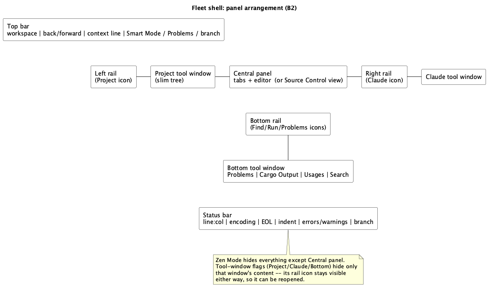
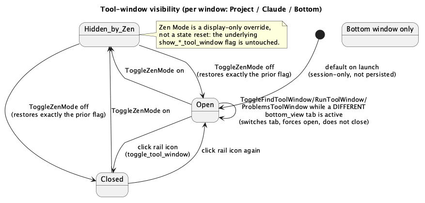

# Fleet Shell (B2)

## 1. Purpose

`editor-shell.md` (v1) and `fleet-look-foundation.md` (B1, design tokens)
built a working but visually plain three-panel IDE: a fixed left tree, a
fixed center editor, a fixed right Claude panel, a button-row toolbar, and
no status bar. `docs/roadmap.md` §4 requires the *shell itself* — not just
its colors/fonts — to match Fleet's philosophy: minimal chrome, one unified
top bar, dismissible tool windows instead of permanently-fixed panels, a
status bar, and a Zen/Distraction-Free mode. This phase is that relayout.
Nothing about *what* the app can do changes — every existing panel's
content (tree, tabs/editor, Claude chat, Problems/Cargo Output/Usages/
Search, source control) stays exactly as implemented; this phase changes
*where* and *how* those panels are reached and dismissed.

This phase also finally gives the command palette (`B3`) real work to do
per §4.7 ("Search Everywhere as the primary way to reach things, instead
of toolbar growth"): most of the current toolbar's buttons move into the
registry as palette-reachable commands rather than staying permanent UI.

## 2. Interface

### 2.1 `ide-core` — one small, read-only addition

The status bar (§3.6) and top-bar indicators (§3.1) need the current
branch name; nothing in `crates/core/src/git/**` exposes it today (only
`GitRepo::commit_graph`, which resolves `HEAD` internally but doesn't
return its name). One read-only method, mirroring `commit_graph`'s own
"unborn HEAD is not an error" treatment:

```rust
// crates/core/src/git/mod.rs (or wherever GitRepo lives)
impl GitRepo {
    /// `HEAD`'s shorthand name (e.g. `"main"`), or `None` for a brand-new
    /// repository with no commits yet (`HEAD` itself doesn't resolve) --
    /// same "unresolvable `HEAD` is not an error" treatment `commit_graph`
    /// already gives it. A **detached** `HEAD` still resolves and returns
    /// `Some("HEAD")` -- libgit2's own shorthand for a direct
    /// (non-symbolic) reference, not an error case.
    pub fn current_branch(&self) -> Option<String> {
        self.repo.head().ok()?.shorthand().ok().map(str::to_string)
    }
}
```

This is the one piece of this phase that touches a CLAUDE.md-declared
security-sensitive path (`crates/core/src/git/**`) — small enough that a
`hacker` pass should be quick, but it does still run before merge.

### 2.2 `ide-ui` — `git_panel.rs`

```rust
pub struct GitPanel {
    // ...existing fields...
    /// Cached at `refresh()` time, same pattern as `graph`/`conflicts`.
    pub current_branch: Option<String>,
}
```

`refresh()` sets it from `repo.current_branch()` on success, clears it to
`None` on the "not a repository" path (same branch that already clears
`graph`/`conflicts`).

### 2.3 `ide-ui` — `command.rs` additions

B3's registry gains the toolbar actions this phase demotes from permanent
buttons to palette entries, plus the new tool-window/Zen-mode toggles.
`CommandAction` gains:

```rust
pub enum CommandAction {
    // ...existing 11 variants...
    ToggleTheme,
    RefreshTree,
    ToggleSmartMode,
    RunCargo(CargoCommand),
    ToggleProjectToolWindow,
    ToggleFindToolWindow,
    ToggleRunToolWindow,
    ToggleProblemsToolWindow,
    ToggleVcsToolWindow,
    ToggleClaudeToolWindow,
    ToggleZenMode,
    ShowLanguageSettings,
    ShowKeymapSettings,
}
```

`command.rs` needs `use crate::cargo_panel::CargoCommand;` for the payload
variant — the only place outside `cargo_panel.rs`/`app.rs` that names it.

New registry entries (`commands()`), bindings straight from
`docs/roadmap.md` §5.2's "Tool windows" row and its "no default in
JetBrains" list — nothing here is invented:

| id | title | category | binding | action |
|---|---|---|---|---|
| `ToggleTheme` | Toggle Theme | View | none | `ToggleTheme` |
| `RefreshTree` | Refresh | File | none | `RefreshTree` |
| `ToggleSmartMode` | Toggle Smart Mode | Navigate | none | `ToggleSmartMode` |
| `CargoBuild`/`CargoRun`/`CargoTest`/`CargoCheck`/`CargoClippy` | Build/Run/Test/Check/Clippy | Build | none | `RunCargo(CargoCommand::*)` |
| `ToggleProjectToolWindow` | Project | Window | `⌘1` | `ToggleProjectToolWindow` |
| `ToggleFindToolWindow` | Find | Window | `⌘3` | `ToggleFindToolWindow` |
| `ToggleRunToolWindow` | Run | Window | `⌘4` | `ToggleRunToolWindow` |
| `ToggleProblemsToolWindow` | Problems | Window | `⌘6` | `ToggleProblemsToolWindow` |
| `ToggleVcsToolWindow` | VCS | Window | `⌘9` | `ToggleVcsToolWindow` |
| `ToggleClaudeToolWindow` | Claude | Window | none | `ToggleClaudeToolWindow` |
| `ToggleZenMode` | Toggle Zen Mode | View | none | `ToggleZenMode` |
| `ShowLanguageSettings` | Languages… | Settings | none | `ShowLanguageSettings` |
| `ShowKeymapSettings` | Keymap… | Settings | none | `ShowKeymapSettings` |

`⌘2`/`⌘5`/`⌘7`/`⌘8` (Bookmarks/Debug/…) are deliberately absent: JetBrains'
own numbering has gaps here (`docs/roadmap.md` §5.2 lists only 1/3/4/5/6/9),
and `⌘5` (Debug) has no tool window to bind to yet — this app has no
debugger until the (unscheduled) DAP phase. Registering `⌘5` now with
nothing behind it would be exactly the kind of invented binding §5.2's
closing paragraph forbids; it stays fully absent from the registry, not
present-with-no-binding, so a later phase adding it doesn't need to touch
this phase's entries.

### 2.4 `ide-ui` — `NavHistory` (new, `crates/ui/src/nav_history.rs`)

Back/forward navigation, Fleet's top-bar equivalent of a browser's
history:

```rust
#[derive(Clone, Debug, PartialEq)]
pub struct NavLocation {
    pub path: PathBuf,
    pub offset: usize,
}

#[derive(Default)]
pub struct NavHistory {
    entries: Vec<NavLocation>,
    /// Index of the *current* location within `entries`, or `None` when
    /// empty. Back/forward move this index; they never remove entries.
    current: Option<usize>,
}

impl NavHistory {
    /// Pushes `location` as the new current entry. Any entries past the
    /// old `current` (the "forward" branch) are dropped first -- standard
    /// browser-history semantics: navigating from the middle of history
    /// abandons the old forward branch rather than branching it.
    /// A push identical to the current entry's `path` (same file, new
    /// offset from cursor movement within it) replaces that entry instead
    /// of growing history with every keystroke -- see §3.2's exact rule.
    pub fn push(&mut self, location: NavLocation);

    pub fn can_go_back(&self) -> bool;
    pub fn can_go_forward(&self) -> bool;

    /// Moves `current` back one and returns that entry, or `None` if
    /// already at the oldest entry.
    pub fn go_back(&mut self) -> Option<NavLocation>;
    pub fn go_forward(&mut self) -> Option<NavLocation>;
}
```

No `IdeApp`/`egui` dependency — same shape as `command.rs`/`find_bar.rs`.

### 2.5 `ide-ui` — `IdeApp` additions (`app.rs`)

```rust
nav: NavHistory,
smart_mode_error: bool, // derived display convenience, see §3.3
show_project_tool_window: bool,
show_claude_tool_window: bool,
show_bottom_tool_window: bool,
zen_mode: bool,
```

None of these persist via `eframe::Storage` — unlike `theme`/
`custom_languages`/`keymap`, tool-window visibility and Zen Mode are
per-session UI state, the same category `command_palette_open` already
is; a relaunch reopens with everything visible, matching today's fixed-
panel behavior.

New methods (bodies are ordinary state transitions, no new external
dependency):

```rust
fn toggle_theme(&mut self, ctx: &egui::Context); // already exists, now also palette-reachable
fn toggle_smart_mode(&mut self); // §3.3
fn toggle_tool_window(&mut self, window: ToolWindow); // §3.7
fn toggle_zen_mode(&mut self); // §3.8
fn push_nav_location(&mut self); // §3.2, called from every jump site
fn nav_back(&mut self);
fn nav_forward(&mut self);
```

`ToolWindow` is a small enum (`Project`, `Claude`, `Bottom`) used only to
parameterize `toggle_tool_window`/`is_tool_window_open` — not the same
thing as `keymap::Gesture` or `command::Command`; it never appears in the
registry itself (the five `ToggleXToolWindow` `CommandAction`s each map to
a fixed `ToolWindow` value in `run_command`'s match arm, `Bottom` handling
three of them by also switching `bottom_view`).

## 3. Behaviour

### 3.1 Top bar

Replaces `egui::Panel::top("toolbar")`'s current single `ui.horizontal`
button row (`render.rs`, currently ~30 buttons/conditionals) with three
sections in one row:

- **Left:** the project's directory name (`project.root().file_name()`),
  then back/forward buttons (enabled per `nav.can_go_back()`/
  `can_go_forward()`).
- **Center:** a "context line" — the active tab's path relative to the
  project root (or a placeholder when no tab is open). Clicking it calls
  `open_command_palette()`. This is an explicit interim stand-in for §4.7's
  "context line as Search Everywhere entry point" — **C2** doesn't exist
  yet, and the palette (B3) is the closest already-real equivalent;
  whoever implements C2 retargets this one click handler, nothing else.
- **Right:** three indicators, each a small clickable label/icon, no
  button borders (§4.1's "no framed buttons" — `ui.add(egui::Label::new(
  ...).sense(egui::Sense::click()))` or equivalent, not `ui.button`):
  Smart Mode (§3.3), a Problems count (`Σ` of `lsp.diagnostics`'
  error+warning counts across the workspace, clicking opens the Problems
  tool window), and the git branch (`git.current_branch`, hidden entirely
  when `!git.is_repo()`).

Every other action the old toolbar exposed (Toggle Theme, Refresh, Build/
Run/Test/Check/Clippy, Languages…, Keymap…) is removed from the permanent
row — each is now a `command::commands()` entry (§2.3), reachable via
`⌘⇧A`. This is the literal content of §4.1's "minimal chrome": the row
shrinks from ~10 conditionally-shown buttons to workspace name + nav +
context line + 3 indicators, a fixed, small set regardless of project
state.

### 3.2 Navigation history

`push_nav_location()` — called from every place that already jumps the
cursor to an arbitrary location: `open_file` (after establishing the
active tab), `pending_cursor_offset`-consuming code (Usages/Search/
Problems result clicks, per `code-editor-widget.md`'s existing paritygoal
for that field), and `open_search_result`. It pushes `NavLocation { path:
active tab's path (untitled tabs push nothing -- no path to return to),
offset: the cursor offset just jumped to }`.

**Same-file coalescing:** if the new location's `path` equals the current
entry's `path`, `NavHistory::push` overwrites the current entry's `offset`
in place rather than appending — otherwise moving the cursor within one
file (which doesn't itself call `push_nav_location`, only jump-sites do)
would never interact with history at all, while a jump-to-another-location
*within* the same file (e.g. two Find Usages results in one file) would
still spam entries. Only a jump to a **different file** grows history.

Back/forward buttons and `⌘⌥←`/`⌘⌥→` (`docs/roadmap.md` §5.2, assigned to
**C1**, not this phase — the buttons exist and work standalone via click
in B2; C1 is what wires the keyboard shortcut once Back/Forward is a
registered command with a real default binding to give it). `nav_back`/
`nav_forward` open the returned location's file (if not already active)
and set `pending_cursor_offset` to its offset, reusing the exact same
"jump" mechanism every other jump source already uses — critically,
`nav_back`/`nav_forward` themselves must **not** call
`push_nav_location`, or every Back press would immediately push a new
forward-erasing entry and Forward would never work.

### 3.3 Smart Mode

Replaces the "Restart Language Server" button and its `active_language
.is_some()` gate. Three real states — **not** the four §4.3/roadmap
mentions ("off/starting/on/error"): `LspBridge::start_with_command`
resolves synchronously (`client.is_some()` or `server_error` is set before
the call returns), and nothing in `ide-lsp`'s public API exposes an
"initialize handshake in flight" signal separate from "process spawned" —
building a real "Starting" state would mean extending `ide-lsp`'s public
surface, out of scope for a phase whose declared roles are core (§2.1's
one git method) + ui, not lsp. A UI-only fake "Starting" flag that clears
before the next frame paints would show nothing a user could ever
observe, so it's left out rather than built as decoration. This is a
documented, deliberate simplification, not an oversight:

```rust
enum SmartModeState { Off, On, Error }
fn smart_mode_state(&self) -> SmartModeState {
    if self.active_language.is_none() { return SmartModeState::Off; }
    if self.lsp.server_error.is_some() { return SmartModeState::Error; }
    if self.lsp.is_running() { SmartModeState::On } else { SmartModeState::Off }
}
```

`toggle_smart_mode()`: `On` → `self.lsp.stop()` (already exists, unused
from the UI until now). `Off`/`Error` → `self.restart_lsp()` (unchanged
behaviour, now reachable from the indicator or the palette instead of
only a button). The indicator shows the state as three-state color/label
(reusing `theme.tokens().color.danger` for `Error`, matching the existing
`lsp.server_error` red-text convention elsewhere).

### 3.4 Slim tree

Replaces `render_tree_entry`'s `egui::CollapsingHeader` rows. No new font/
icon-asset dependency (CLAUDE.md's approved-dependency table has none, and
adding an icon font is a decision for the user, not this phase) — type
"icons" are small `egui::Painter`-drawn shapes, not glyphs from a new
font. There is no existing per-extension/per-file-type color mapping
anywhere in this codebase to reuse: `theme::SyntaxColors::of` (`theme/
mod.rs`) is keyed on `ide_core::TokenKind` (`Keyword`/`String`/
`Function`/…), categories *within a parsed file's contents*, not file
types — inventing a new per-extension color ramp is a design decision
squarely in B1's ("fleet-look-foundation", design tokens) territory, not
this phase's to make ad hoc. This phase's icons stay deliberately plain:
a filled circle for a directory, a small square outline for a file, both
in one existing generic token color (`tokens.color.secondary` or
equivalent — whichever the theme module already exposes for this kind of
neutral UI chrome). Rows are flat `ui.horizontal` entries with a small
fixed indent-per-depth (no `CollapsingHeader`'s heavier frame/spacing), a
click-to-toggle triangle for directories drawn the same way. Selecting/
opening a file behaves identically to today (`clicked_path` → `open_file`,
now also calling `push_nav_location`).

### 3.5 Thin tabs

`render_tabs_and_editor`'s tab strip: the always-visible `ui.small_button
("x")` becomes conditionally visible, shown only while the pointer is
over that specific tab's row (`response.hovered()` on the row's
container, painting the close glyph only when hovered — a plain `Response
::hovered()` check, no new widget). The dirty-dot prefix (`"\u{25cf}"`)
is unchanged — it was already exactly what §4.5 asks for.

**Correction (post-merge bugfix, see Revision notes below):** the first
implementation of this section violated its own "no new widget" rule —
it added a real second `ui.small_button("x")` only while `response
.hovered()` was true, which grew the tab's allocated width on the very
frame the pointer arrived, so the glyph never landed under the pointer
that triggered it and the user could never actually click it. Fixed by
`render_editor_tab` (replacing `render_boxed_tab` at this one call site):
one `allocate_exact_size`/`Sense::click()` covering the label plus a
close-glyph-width region that is *always* reserved; hovering only toggles
whether the glyph is painted into that already-reserved region, so the
tab's width never changes between hover states. `close_clicked` is
computed by testing `response.interact_pointer_pos()` against the
glyph's sub-rect on the same click, rather than a second widget/response.

### 3.6 Status bar

New `egui::Panel::bottom("status_bar")`, rendered *after* the existing
"bottom_panel" (Problems/Cargo Output/Usages/Search) so it claims the
window's true bottom edge, one row, small text, no borders:

- `line:col` of the active tab's primary cursor (`tab.buffer
  .text_buffer().selections().primary()`'s offset, converted via the
  buffer's line index — same conversion `editor/mod.rs` already performs
  for its own rendering, read here rather than duplicated).
- Encoding: `tab.config.charset` labelled, defaulting to "UTF-8" when
  `None` (the buffer's actual behaviour when no `EditorConfig` charset is
  set, `buffer.rs` §`save_with`).
- Line ending: `tab.config.end_of_line`, defaulting to "LF".
- Indent: `tab.config.indent_style`/`indent_size`, e.g. "Spaces: 4",
  defaulting to whatever `IndentUnit`'s own default already is.
- Error/warning counts — same aggregate the top bar's Problems indicator
  uses (§3.1), repeated here per §4.6's explicit list; clicking either
  opens the Problems tool window.
- Git branch (`git.current_branch`), same content as the top bar's
  indicator — Fleet genuinely repeats git status in both places, this
  isn't a documentation slip.

**The `COLUMN` mode indicator moves here from next to the tabs**
(`multiple-cursors.md` §3.5's own comment already earmarks this: *"there
is no status bar yet, so the indicator lives next to the tabs until the
B-track adds one"*) — this phase is that migration. The tab-row code
loses its `COLUMN` label entirely; the status bar gains it, shown only
when the active tab's editor is in column-selection mode.

All fields are blank/hidden when no tab is active or no project is open,
same as the rest of the shell.

### 3.7 Tool windows: edge icons instead of fixed panels

`Project` (the tree, currently `egui::Panel::left`), `Claude` (currently
`egui::Panel::right`), and `Bottom` (the existing Problems/Cargo Output/
Usages/Search panel, currently always shown) each become dismissible.
Each edge (left, right, bottom) renders a thin, always-visible rail
**before** that edge's actual tool-window content: one small icon button
per tool window anchored to that edge, toggling `show_project_tool_window`
/ `show_claude_tool_window`/`show_bottom_tool_window`. When a tool
window's flag is `false`, only its rail icon renders — the panel itself
(and the screen space it occupied) is skipped that frame, exactly the
`if !self.show_x { return; }` guard `render_language_settings_window`
already uses for windows, applied here to permanent-panel visibility
instead. Icons are the same painter-drawn shapes §3.4 uses (no new
font/asset).

`toggle_tool_window(ToolWindow::Bottom)` also has to pick *which* of
Problems/Cargo Output/Usages/Search becomes visible when reopened — it
doesn't change `bottom_view`, so reopening shows whatever tab was last
selected (state already persists in `self.bottom_view` across a hide/show
cycle, since that field is untouched by the visibility flag).

The five `ToggleXToolWindow` commands (§2.3) each resolve to one of these
three flags: `ToggleProjectToolWindow` → `Project`; `ToggleClaudeToolWindow`
→ `Claude`; `ToggleFindToolWindow`/`ToggleRunToolWindow`/
`ToggleProblemsToolWindow` → `Bottom`, additionally setting `bottom_view`
to `Search`/`CargoOutput`/`Problems` respectively **and forcing the panel
open** (not toggling) when its own tab isn't already the visible one —
matching JetBrains' own tool-window-shortcut behaviour (pressing a tool
window's shortcut while a *different* tool window/tab is focused switches
to it rather than closing the bar you weren't looking at; pressing it
again while already focused there is what closes it), i.e. exactly:

```rust
if self.show_bottom_tool_window && self.bottom_view == target_view {
    self.show_bottom_tool_window = false;
} else {
    self.show_bottom_tool_window = true;
    self.bottom_view = target_view;
}
```

`ToggleVcsToolWindow`
is not a `Bottom`-panel case at all — it calls the existing
`toggle_view_mode()` (Editor ↔ SourceControl), since source control is
today a `ViewMode` swap of the *center* panel, not a side/bottom tool
window; no other change to that mechanism is needed or made this phase.

### 3.8 Zen / Distraction Free mode

`zen_mode: bool`, toggled only via the palette (`ToggleZenMode`, no
default binding, §2.3). While `true`: the top bar, all three tool
windows' rails, and the status bar are skipped entirely; only the
`CentralPanel` (tabs + editor, or the welcome screen) renders. Toggling it
off restores every panel's *previous* visibility exactly as it was
(`show_project_tool_window` etc. are untouched by entering/leaving Zen
Mode — it's a display-only override on top of them, not a state reset).
Exiting Zen Mode has no dedicated in-editor affordance beyond the palette
itself, since a corner "exit" button would itself be exactly the kind of
permanent chrome Zen Mode exists to remove — `⌘⇧A` still works while
`zen_mode` is `true` (nothing in `handle_shortcuts` gates the palette
open shortcut on `zen_mode`).

## 4. Constraints

1. No new `Cargo.toml` dependency — icons are painter-drawn shapes, not a
   font/asset (§3.4).
2. `NavHistory` has no `IdeApp`/`egui` dependency, same boundary
   `command.rs`/`keymap.rs`/`find_bar.rs` already hold.
3. Tool-window/Zen-mode visibility state is session-only, not persisted
   (§2.5) — deliberately distinct from `theme`/`custom_languages`/
   `keymap`, which do persist.
4. `current_branch` (§2.1) never panics on an unborn/detached `HEAD` —
   returns `None`, mirroring `commit_graph`'s existing treatment.
5. `push_nav_location` is never called from `nav_back`/`nav_forward`
   themselves (§3.2) — the one invariant that makes Back/Forward
   traversal actually work instead of self-erasing.
6. `⌘5` (Debug) is absent from the registry entirely, not
   present-with-no-binding (§2.3) — there is nothing to bind it to yet.

## 5. Examples

**Opening a file from the tree, then going back:** clicking a file in the
slim tree calls `open_file` then `push_nav_location()` (pushes `{path,
0}` or wherever the cursor lands). Opening a second file the same way
pushes a second entry. Clicking the top bar's back arrow calls `nav_back`,
which pops to the first entry, reopens that file, and sets
`pending_cursor_offset` — critically, this does *not* itself call
`push_nav_location`, so the forward arrow (`nav_forward`) can still return
to the second file.

**Toggling Smart Mode off then back on:** with a Rust project open and
`rust-analyzer` running (`SmartModeState::On`), clicking the top-bar
indicator calls `toggle_smart_mode`, which calls `self.lsp.stop()` — state
becomes `Off`, diagnostics clear (`LspBridge::stop`'s existing behaviour).
Clicking again calls `restart_lsp()`; state becomes `On` once the client
spawns successfully, or `Error` if it doesn't (e.g. `rust-analyzer` isn't
on `PATH`), same failure path the old button already had.

**Entering Zen Mode mid-session with the Claude panel closed:** if the
user had already closed the Claude tool window (`show_claude_tool_window
= false`) before toggling Zen Mode on, only the editor shows either way
(Zen Mode hides it regardless). Toggling Zen Mode back off shows the top
bar, tree rail, bottom rail, and status bar again — but the Claude panel
stays closed, since Zen Mode never touched `show_claude_tool_window`.

## 6. Diagram




## 7. Dependencies & integration points

- `crates/core/src/git/**` — the one new method (§2.1); touches a
  CLAUDE.md-declared security-sensitive path, needs a `hacker` pass even
  though it's a single read-only accessor.
- `git_panel.rs` — new `current_branch` field, set in `refresh()`.
- `command.rs` — 13 new registry entries (§2.3), all bindings sourced from
  `docs/roadmap.md` §5.2, several deliberately unbound per that section's
  own "no JetBrains default" list.
- `app.rs`/`app/render.rs` — the bulk of this phase: top bar rewrite,
  slim tree, thin tabs, status bar, tool-window rails, Zen Mode, and
  `run_command`'s match arm gaining 13 new cases.
- `cargo_panel.rs` — `CargoCommand` becomes a `CommandAction` payload type
  (§2.3); no change to `cargo_panel.rs` itself.
- `multiple-cursors.md` — the `COLUMN` indicator's relocation (§3.6) is
  the migration that doc's own §3.5 already anticipated; no other change
  to A3's code.
- `code-editor-widget.md`/search/usages/problems docs — `push_nav_location`
  (§3.2) is called from their existing jump sites; none of their own jump
  mechanisms change, only that one new call is added at each site.

## Revision notes

1. §3.4/§3.7 — the original text claimed tree/rail icon colors reuse "the
   same per-extension mapping `theme::palette`'s syntax-token colors
   already use where one exists." Verified against `theme/mod.rs`: no
   such mapping exists — `SyntaxColors::of` is keyed on `ide_core::
   TokenKind` (in-file syntax categories), not file extension/type.
   Corrected to a plain directory-vs-file distinction using one existing
   generic theme color, with no per-extension richness invented this
   phase (that decision belongs to B1's design-tokens scope, not an ad
   hoc addition here).
2. §3.7 — added the exact two-branch condition for the three
   `Bottom`-panel tool-window commands' force-open/toggle behaviour,
   replacing prose-only description.
