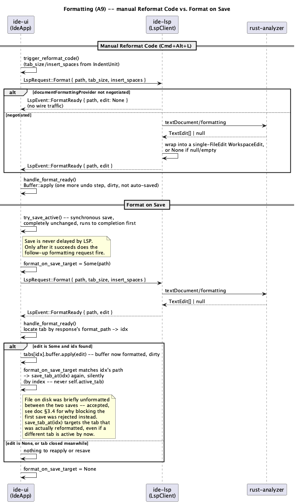

# Formatting (A9)

## 1. Purpose

Adds `textDocument/formatting` and `textDocument/rangeFormatting` on top of
the already-merged `ide-lsp` connection, plus a UI command that applies
whichever one comes back. Both wire requests answer with the exact same
shape LSP defines for them (`TextEdit[] | null` against one file, no
`documentChanges`/`changes` envelope) — meaningfully simpler than
`code-actions.md`'s `WorkspaceEdit`, since a formatting response never
names a path of its own; it always answers the one file `ide-ui` asked
about, so there is nothing to validate beyond what the request itself
already validated.

- **Reformat Code** (`⌘⌥L` on macOS, `Ctrl+Alt+L` elsewhere —
  `docs/roadmap.md` §5.2) — reformats the active tab's whole buffer.
  Applies the resulting edit through the exact same
  `handle_workspace_edit_ready` pipeline `code-actions.md` §3.4 already
  built: one more undo step, marks the tab dirty, not auto-saved.
- **Toggle Format on Save** — a per-session toggle (`ToggleFormatOnSave`,
  no default binding, joining `ToggleSmartMode`/`ToggleTheme` in the
  palette per §5.2's "no invented bindings" rule), persisted via
  `eframe::Storage` the same way `theme`/`keymap` already are. When on, a
  successful `⌘S` on a file whose server supports formatting also fires a
  Reformat Code request for that file immediately afterward; when its
  result lands (a frame or more later), it's applied to the buffer and the
  tab is silently saved again (§3.4).

**Explicitly deferred**:

- **Range-aware "Reformat Selection."** `ide-lsp` implements
  `textDocument/rangeFormatting` in full (own request/response,
  capability-gated) because `docs/roadmap.md`'s A9 line names it
  explicitly, and it is tested end to end at that layer. But `ide-ui` has
  no caller for it in this phase: `code-actions.md` §1 already deferred
  "selection-range-aware requests" to **D2** because `ide-ui` doesn't
  currently plumb a "current selection" range out to `app.rs` for any LSP
  feature to consume, and that gap is unchanged by this phase. Reformat
  Code always formats the whole document in v1, exactly like every prior
  position-only LSP trigger in this codebase; D2 is the natural place to
  revisit both at once.
- **`documentRangeFormattingProvider`-only servers offering no whole-file
  formatting.** v1's Reformat Code command is enabled whenever
  `documentFormattingProvider` was negotiated (§3.2); a server that
  advertises only range formatting and not whole-document formatting
  (unusual, but legal per the spec) has no v1 entry point at all until the
  deferred item above lands.
- **`FormattingOptions`' optional trim/newline fields
  (`trimTrailingWhitespace`, `insertFinalNewline`, `trimFinalNewlines`).**
  v1 sends only `tabSize`/`insertSpaces` (§3.1) — `line-commands-and-
  editorconfig.md` §3.6 already owns trimming/final-newline behavior as a
  fixed, local, deterministic save-time transaction 100% of the time a
  file saves, formatted or not; also sending the equivalent LSP options
  would ask the server to *maybe* do the same job a different way,
  depending on whether it honors them, producing two competing sources of
  truth for the same three properties. Omitting them keeps EditorConfig
  the sole authority, unconditionally.
- **Auto-reformat on paste, or format-as-you-type.** Neither is part of
  `docs/roadmap.md`'s A9 line; both are meaningfully different features
  (formatting a just-pasted range without an explicit command, or
  triggering on specific typed characters) that would need their own
  design pass.
- **A true "format-before-write" guarantee.** §3.4 states plainly that
  Format on Save's on-disk content is briefly *un*formatted between `⌘S`
  and the follow-up silent re-save — see that section for why blocking the
  original save on an LSP round trip was rejected instead.

Does not touch `crates/dap/**` (doesn't exist yet, not needed here). No
external formatter fallback (e.g. shelling out to `rustfmt` directly) is
implemented — every formatting result in v1 comes from whatever language
server is already connected, over the existing LSP request/response path;
`CLAUDE.md`'s "any code invoking an external formatter" security-sensitive
entry is not triggered by this phase for that reason, though it stays
in `CLAUDE.md` for whichever future phase does add that fallback.

## 2. Interface / API

### 2.1 `ide-lsp` (additions to the existing public API)

```rust
pub enum LspRequest {
    // ... existing: DidOpen, DidChange, DidClose, References, Goto, Hover,
    //     DocumentHighlight, InlayHint, CodeAction, ApplyCodeAction,
    //     DocumentSymbol, WorkspaceSymbol ...

    /// Query a whole-document formatting edit for `path`. Own pending-id
    /// slot (`pending_format_id`), independent of every other request
    /// kind's slot. No-op over the wire (never sent) unless the server
    /// declared `documentFormattingProvider` in its `initialize` response
    /// (§3.2) -- `ide-ui` never has to check this itself before calling,
    /// same fail-closed discipline `ApplyCodeAction`'s resolve branch
    /// already establishes for `codeActionProvider.resolveProvider`.
    /// Always answered by exactly one `LspEvent::FormatReady` (§3.3).
    Format {
        path: PathBuf,
        tab_size: u32,
        insert_spaces: bool,
    },
    /// Same, but for `range` only -- requires
    /// `documentRangeFormattingProvider`. Shares `Format`'s pending-id
    /// slot (sending either while the other is outstanding supersedes it
    /// -- both answer into the same `FormatReady` channel, and only one
    /// "format this file" request is ever meaningfully in flight at a
    /// time from a single caller). No `ide-ui` caller in this phase (§1);
    /// implemented and tested here because `docs/roadmap.md`'s A9 line
    /// names it explicitly, ahead of the D2 phase that will call it.
    FormatRange {
        path: PathBuf,
        range: Range,
        tab_size: u32,
        insert_spaces: bool,
    },
}

pub enum LspEvent {
    // ... existing: Diagnostics, ServerExited, References, Goto, Hover,
    //     DocumentHighlight, InlayHint, CodeAction, WorkspaceEditReady,
    //     DocumentSymbol, WorkspaceSymbol ...

    /// The result of the most recently sent, not-yet-superseded `Format`
    /// or `FormatRange` query, even when empty/unsupported. Carries
    /// `path`, same reason `InlayHint`'s/`CodeAction`'s events do: a
    /// response landing after the user switched tabs (or after a second
    /// Reformat Code superseded the first) must not be applied to the
    /// wrong file. `edit: None` covers every "nothing to apply" case
    /// alike -- unsupported capability (§3.2), a `null`/empty-array
    /// result (file is already correctly formatted), and a JSON-RPC
    /// error -- deliberately not distinguished from each other, the same
    /// "a definite empty answer beats a permanently-waiting UI"
    /// permissiveness `Hover`/`CodeAction` already establish. A non-empty
    /// result is always exactly one file (this file), so `edit` is a
    /// single-`FileEdit` `WorkspaceEdit` rather than `Vec<TextEdit>`
    /// directly -- reusing `code-actions.md`'s type lets `ide-ui` apply
    /// it through the identical `handle_workspace_edit_ready`-shaped path
    /// (§3.4) instead of a second apply pipeline.
    FormatReady {
        path: PathBuf,
        edit: Option<WorkspaceEdit>,
    },
}
```

`CodeAction`/`WorkspaceEdit`/`FileEdit`/`WorkspaceEditReady` and everything
else in `ide-lsp`'s existing public API are unchanged and reused as-is —
this phase adds no new public type, only the two request variants, the one
event variant, and (internally) two capability flags on `ConnectionState`
(§3.2).

### 2.2 `ide-core`

No changes. `apply_workspace_edit_to_disk` (`code-actions.md` §2.2) is
reused unmodified for Format on Save's disk-subset writes (§3.4) — this
phase adds no new `ide-core` module.

### 2.3 `ide-ui`

```rust
// crates/ui/src/lsp_bridge.rs -- additions to the existing LspBridge
struct LspBridge {
    // ... existing fields ...
    /// The outcome of the most recently sent, not-yet-superseded
    /// `Format`/`FormatRange` query -- replaced wholesale on each
    /// `LspEvent::FormatReady`, or synchronously by `request_format`/
    /// `request_format_range` themselves when no client is running (see
    /// their own doc comments below); cleared at send-time and on
    /// stop/`ServerExited` (same convention `code_actions` already
    /// follows).
    format_edit: Option<WorkspaceEdit>,
    /// The path `format_edit` answers, so a stale response for a since-
    /// closed or since-changed tab is identifiable (mirrors `code_
    /// actions_target`).
    format_path: Option<PathBuf>,
    /// True for exactly one frame, the one in which a `FormatReady`
    /// event was drained -- same one-frame-true edge `workspace_edit_
    /// ready`/`goto_ready` already establish, reset to `false` at the top
    /// of every `poll()` call.
    format_ready: bool,
}

impl LspBridge {
    /// `tab_size`/`insert_spaces` come from the caller's already-resolved
    /// `IndentUnit` (§3.1) -- `ide-lsp` has no dependency on `ide-core`
    /// and cannot resolve `EditorConfig` itself.
    ///
    /// Unlike every other `request_*` method on this type, a missing
    /// client is **not** a silent no-op: it immediately sets
    /// `format_ready = true`, `format_edit = None`,
    /// `format_path = Some(path.to_path_buf())`, entirely inside
    /// `LspBridge` (no `LspClient`, no wire traffic, no `LspEvent`
    /// involved) -- the same observable outcome an unsupported-capability
    /// response produces one layer down (§3.2), so every caller,
    /// including `format_on_save_target`'s bookkeeping (§3.4), can rely
    /// on "calling this always eventually sets `format_ready`" without
    /// checking `LspBridge::is_running()` itself first.
    fn request_format(&mut self, path: &Path, tab_size: u32, insert_spaces: bool);
    /// Same, for a range -- no `ide-ui` caller in this phase (§1), kept
    /// for parity with the wire-level `FormatRange` request and so D2
    /// has it ready to call. Same no-client guarantee as `request_format`.
    #[allow(dead_code)]
    fn request_format_range(&mut self, path: &Path, range: Range, tab_size: u32, insert_spaces: bool);
}
```

`IdeApp` (in `app.rs`) gains:

- `format_on_save: bool` — persisted via `eframe::Storage` under
  `"ide_format_on_save"`, loaded in `IdeApp::new` and written in
  `eframe::App::save` alongside `theme`/`keymap` (§2.5/§4.3's existing
  pattern).
- `format_on_save_target: Option<PathBuf>` — set immediately after
  `save_active` succeeds and format-on-save fires a follow-up `Format`
  request (§3.4); cleared once that request's `FormatReady` has been
  applied and re-saved, or superseded by a second save before the first
  one's response arrived. Safe to set unconditionally whenever the branch
  below fires: `request_format` (§2.3's `LspBridge` note) is now
  guaranteed to eventually produce a `format_ready` outcome — with a
  running client or without one — so this can never be left set forever.
- `trigger_reformat_code(&mut self)` — `⌘⌥L`'s entry point. No-op with no
  active tab or no path (untitled buffer — nothing on disk/server to
  format against). Resolves `tab.editor.indent()` into
  `(tab_size, insert_spaces)` and calls `LspBridge::request_format`.
- `save_tab_at(&mut self, idx: usize) -> Option<Result<(), ide_core::
  BufferError>>` — the by-index primitive `save_active` already needs
  internally (`save_active` becomes `self.active_tab.and_then(|idx|
  self.save_tab_at(idx))`, no behavior change for any existing caller).
  Introduced so `handle_format_ready`'s follow-up save (below) can target
  the tab that was actually reformatted, not whatever tab happens to be
  active by the time the response lands.
- `try_save_active(&mut self)` — existing method (already the `SaveAll`
  dispatch target), gains one line at its success tail: if
  `self.format_on_save` and the active tab has a path, calls
  `trigger_reformat_code()` again and records `format_on_save_target =
  Some(path)`. No capability check needed here — `request_format` is
  already fail-closed (§3.2) and, as of the note above, always resolves
  either way. The save itself is completely unchanged and already
  finished by the time this runs (§3.4).
- `handle_format_ready(&mut self)` — called once per frame alongside
  `handle_workspace_edit_ready`/`handle_goto_response`. No-op unless
  `self.lsp.format_ready`. Looks up the open tab whose path matches the
  response's `format_path` (the same file `request_format` was called
  for — §4's invariant guarantees one exists unless the tab was closed
  between the request and this response, a TOCTOU race handled below).
  On `Some(edit)` with a matching open tab at index `idx`: applies it via
  `self.tabs[idx].buffer.apply(...)` (one more undo step, marks dirty)
  exactly like `code-actions.md` §3.4's buffer-subset step — a formatting
  edit never has a disk-only subset, since it's only ever requested for a
  file that's open in a tab. If `self.format_on_save_target == Some(path)`
  for that same `idx`, additionally calls `self.save_tab_at(idx)`
  immediately afterward (silent — no popup, no dirty flag left behind) —
  **by index, never `save_active()`/`self.active_tab`**, so a tab switch
  between the save and this response can never cause the wrong (currently
  active, possibly unrelated and mid-edit) tab to be silently written to
  disk. `format_on_save_target` is cleared whenever it matches this
  response's path, regardless of outcome. No matching open tab (the tab
  was closed in the interim) is a no-op in every respect: nothing to
  apply, nothing to save, `format_on_save_target` still cleared if it
  matched. `edit: None` with a matching tab is a no-op beyond that
  clearing either way: for a manual Reformat Code, nothing to apply and
  nothing reported beyond the existing `self.error` machinery (§3.3); for
  a format-on-save-triggered request (client wasn't running, capability
  unsupported, or the file was already correctly formatted), there's
  nothing to re-save.

`command.rs` gains two `CommandAction` variants, both under `"Edit"`:

- `ReformatCode`, `binding: Some(Binding::same(KeyChord::new(Key::L)
  .command().alt()))` — `⌘⌥L`; a pure Cmd→Ctrl substitution like nearly
  every other binding this registry has, so `Binding::same` covers both
  platforms (`docs/roadmap.md` §5.2's table lists no divergent `other`
  for this one).
- `ToggleFormatOnSave`, `binding: None` — no JetBrains default exists for
  this exact toggle (its closest analogue, "Reformat on Save", lives in
  Settings rather than the default keymap in the reference IDE), so per
  §5.2's explicit rule this registers with no binding: reachable from the
  palette, assignable by the user in **G2**.

`is_command_enabled` gains: `ReformatCode => self.active_tab.is_some() &&
self.tabs[idx].buffer.path().is_some()` (same shape `GoToFile`/`GoToLine`
already use); `ToggleFormatOnSave => true` (always available, like
`ToggleTheme`).

## 3. Behaviour

### 3.1 Requesting a formatting edit

`textDocument/formatting`'s params:

```json
{
  "textDocument": { "uri": "..." },
  "options": { "tabSize": 4, "insertSpaces": true }
}
```

`textDocument/rangeFormatting` adds `"range": {...}` alongside `options`,
otherwise identical. `tabSize`/`insertSpaces` come from `ide-ui`'s already-
resolved `IndentUnit` for the target tab (`line-commands-and-
editorconfig.md` §3.6 — the same value auto-indent and `Tab` already use),
converted with `insert_spaces = matches!(unit.style, IndentStyle::Spaces)`.
Result: `TextEdit[] | null`, evaluated against the file's content *as the
server currently has it* (full-document-sync discipline, `rust-language-
support.md`) — not necessarily byte-identical to what `ide-ui`'s own
buffer holds if a `didChange` is still in flight, the same narrow,
already-accepted staleness window `code-actions.md` §4 names for its own
edits.

Conversion to `ide_lsp::WorkspaceEdit`:

- `null` or `[]` → `None` (nothing to apply; §2.1's event doc explains why
  this isn't distinguished from "unsupported").
- Any other array → `Some(WorkspaceEdit { edits: vec![FileEdit { path,
  text_edits }] })`, where `path` is the *request's own* path (not parsed
  out of the response — formatting's result carries no path of its own at
  all) and each `lsp_types::TextEdit` converts to `ide_lsp::TextEdit`
  exactly as `code-actions.md`'s existing `TextEdit` conversion already
  does.

No `validate_path` call is needed on the response side, unlike every other
query this client makes: there is no server-supplied path in a formatting
response to validate. The one path involved is the request's own, already
implicitly trusted the same way `DocumentSymbol`'s/`InlayHint`'s request
path already is (§4).

### 3.2 Capability negotiation

Same mechanism `code-actions.md` §3.2 introduced for
`codeActionProvider.resolveProvider`, applied to two new fields:
`ConnectionState` gains `document_formatting_provider: bool` and
`document_range_formatting_provider: bool` (both default `false`), read
once, while still `!ready`, from `result.capabilities.
documentFormattingProvider` / `documentRangeFormattingProvider`
respectively. Each is simpler than `codeActionProvider`'s: LSP defines
both as `boolean | DocumentFormattingOptions` /
`boolean | DocumentRangeFormattingOptions`, and neither options object
carries a flag this client cares about (no `resolveProvider`-equivalent) —
so the rule collapses to "`true`, or present as any object, → `true`;
absent, `false`, or malformed → `false`" (fail closed, same as `code-
actions.md`).

`Format`/`FormatRange`'s `send_request` arm checks the matching flag
before allocating an id or sending anything: unsupported means immediate
`FormatReady { path, edit: None }`, no wire traffic, mirroring
`ApplyCodeAction`'s "not found" case exactly.

### 3.3 Response handling

`handle_incoming`'s id-bearing-no-method dispatch chain grows by one more
link, `handle_format_response`, parsing the `TextEdit[] | null` result
(§3.1) and emitting `LspEvent::FormatReady`. A JSON-RPC error response is
treated the same as `null` (§2.1). `pending_format_id` is cleared either
way. A response arriving after a newer `Format`/`FormatRange` superseded
it is impossible by construction (§2.1's shared-slot note) — the old id no
longer matches `pending_format_id` by the time a stale response could
arrive, same "supersede invalidates the old id" discipline every other
query in this client already has.

### 3.4 Applying the edit, and Format on Save's timing

`handle_format_ready` (§2.3) applies a `Some(edit)` directly to the open
tab's buffer via `Buffer::apply` — no disk-subset phase, unlike
`code-actions.md` §3.4's `WorkspaceEdit` handling. This is safe *only*
because of an invariant §4 states explicitly: `request_format`/
`request_format_range` are only ever called (both by `trigger_reformat_
code` and by the save-time follow-up below) for a path that is the active
tab's own, already-open buffer — never for a file with no open tab. A
future caller that breaks this (e.g., a bulk "format on save for every
dirty tab" feature) would need to add back the disk-subset branch
`code-actions.md` already has, not assume this one always skips it.

**Reformat Code** (manual): apply the edit, done. One more undo step,
dirty, not auto-saved — identical discipline to every other in-editor
LSP-driven edit.

**Format on Save**: `try_save_active`'s existing synchronous save runs
first, completely unchanged — nothing in this phase adds any latency,
blocking, or failure mode to `⌘S` itself. Only *after* it succeeds does
`try_save_active` fire a `Format` request and record
`format_on_save_target`. When the result lands — necessarily at least one
frame later, since this is a real (if usually fast) round trip to a
subprocess — `handle_format_ready` applies it and silently calls
`save_tab_at` a second time, targeting the specific tab that was
reformatted (by index, looked up from the response's own `format_path`)
rather than whatever tab happens to be active at that moment — a save
triggered by an earlier `⌘S` must never land on a *different* tab the user
has since switched to (§2.3).

This means the file on disk is briefly *unformatted* between the visible
`⌘S` and the silent follow-up save: a deliberate, accepted trade-off, not
an oversight. The alternative — deferring the actual disk write until the
formatting round trip completes — was rejected because it would make
`⌘S`'s completion depend on a subprocess that could be slow, unresponsive,
or (for a server with no formatting support at all, discovered only after
the fact) simply never send back the flag this client already checked
before sending (§3.2 rules that specific case out, but a hung server after
capability negotiation succeeded is still possible) turning a normally-
instant save into an unbounded wait with no existing timeout mechanism
anywhere in this client to bound it. A save that might hang is a worse
failure mode than a file that is correctly saved, then reformatted and
saved again a moment later.

`format_on_save_target` and `Format`/`FormatRange`'s single shared
pending-id slot (§2.1) mean a manual Reformat Code and a save-triggered
one can, in a narrow window, answer each other: if the user presses
`⌘⌥L` while a format-on-save follow-up for the *same* file is already in
flight, the second request supersedes the first, and whichever
`FormatReady` eventually arrives satisfies both — `format_on_save_target`
still gets applied-then-saved once. The only user-visible effect of this
race is at most one extra harmless save; it can never leave the file
unformatted-forever or trigger a disk write for the wrong file, since both
requests names the same path. Formatting *different* tabs concurrently is
unaffected — each tab's own save/reformat sequence only ever races with
itself.

## 4. Constraints & invariants

- **Path provenance.** `request_format`/`request_format_range`'s `path`
  comes only from the active tab's own already-open buffer — via
  `trigger_reformat_code` (manual) or `try_save_active`'s follow-up
  (format-on-save). Never called for a file with no open tab (§3.4)
  — the one invariant `handle_format_ready`'s buffer-only apply path
  depends on.
- **A formatting response is trusted without path validation** (§3.1),
  a genuine, narrower trust model than every other query in this client:
  there is no server-supplied path in the response to validate, only the
  request's own path, echoed back implicitly by construction (the
  response has no path field at all — `ide-lsp` supplies it from what it
  remembers asking about).
- **Capability negotiation fails closed** (§3.2): `documentFormattingProvider`/
  `documentRangeFormattingProvider` are only ever assumed `true` when the
  server's `initialize` response set them explicitly; a missing,
  malformed, or absent capability is `false`.
- **`FormattingOptions` carries only `tabSize`/`insertSpaces`.** EditorConfig
  remains the sole authority on trimming/final-newline/line-ending
  behavior at save time (§1); this phase never sends the LSP options that
  would let a server also opine on those three properties.
- **Format on Save never delays or risks the underlying save.** The
  synchronous save always runs to completion, unchanged, before any
  formatting request is even sent (§3.4) — this ordering is the whole
  reason the feature needs no new timeout machinery.
- **The format-on-save follow-up save is always by-index (`save_tab_at`),
  never `self.active_tab`-based.** `handle_format_ready` runs on whatever
  frame a response happens to land on, arbitrarily long after the user's
  `⌘S` — the active tab may have changed in the interim. Reintroducing
  `save_active()`/`self.active_tab` into that follow-up would silently
  save whatever tab is active *then*, not the tab that was actually
  reformatted.
- **`request_format`/`request_format_range` always resolve.** Unlike
  every other `request_*` method on `LspBridge`, a missing client is not
  a silent no-op (§2.3) — `format_ready` is guaranteed to become `true`
  on the next relevant check regardless of whether a client is running,
  which is what makes it safe to set `format_on_save_target`
  unconditionally in `try_save_active`.
- **`ide-core` gains no dependency on `ide-lsp`, and `ide-lsp` gains none
  on `ide-core`** (unchanged from `code-actions.md` §4) — `tab_size`/
  `insert_spaces` cross that boundary as plain `u32`/`bool`, not an
  `ide_core::IndentUnit`.

## 5. Examples

**Manual Reformat Code:**

```rust
// Caret anywhere in the active tab; file has a real path, server
// negotiated documentFormattingProvider: true.
app.trigger_reformat_code();
// -> LspRequest::Format { path, tab_size: 4, insert_spaces: true }
// ... a frame or so later ...
// LspEvent::FormatReady { path, edit: Some(edit) } (three lines changed)

app.handle_format_ready();
// edit.edits[0].path == the active tab's path -> Buffer::apply.
// One more undo step, tab is dirty. Not auto-saved.
```

**Already-formatted file:**

```rust
app.trigger_reformat_code();
// Server returns [] -- file needs no changes.
// LspEvent::FormatReady { path, edit: None }
app.handle_format_ready();
// No-op: nothing to apply, nothing to undo, tab dirty state unchanged.
```

**Format on Save:**

```rust
app.format_on_save = true;
app.try_save_active();
// 1. Synchronous save runs and succeeds, exactly as if format_on_save
//    were false -- file is now on disk, unformatted (say the user just
//    typed a badly-indented block).
// 2. format_on_save_target = Some(path); trigger_reformat_code() fires.

// ... a frame or so later ...
// LspEvent::FormatReady { path, edit: Some(edit) }
app.handle_format_ready();
// Tab located by format_path -> buffer.apply(edit) -- buffer now
// formatted, dirty. format_on_save_target matches that same tab's path
// -> save_tab_at(idx) runs again, silently, on that specific tab (even
// if the user switched to a different active tab in the meantime).
// File on disk is now formatted; format_on_save_target cleared.
```

**Format on Save with no LSP client running** (editing a file outside any
project, or the server hasn't started):

```rust
app.format_on_save = true;
app.try_save_active();
// 1. Synchronous save runs and succeeds, unaffected by format_on_save.
// 2. format_on_save_target = Some(path); trigger_reformat_code() calls
//    LspBridge::request_format, which finds self.client.is_none() and
//    immediately (same call, no round trip) sets format_ready = true,
//    format_edit = None, format_path = Some(path).

app.handle_format_ready(); // same frame or the next -- no waiting
// No open-tab/edit mismatch possible: nothing to apply, nothing to
// re-save. format_on_save_target is still cleared -- it never lingers
// waiting for an event that was never going to arrive.
```

## 6. Dependencies & integration points

- No new external dependencies in any crate. `Format`/`FormatRange`'s wire
  encoding reuses `lsp_types::{TextEdit, FormattingOptions}` (already a
  dependency via `code-actions.md`/prior phases), the same way every prior
  LSP feature has.
- Builds on the already-merged `ide-lsp` connection/event-loop machinery
  and the request/response precedent every prior feature established. The
  one genuinely new piece of machinery is reading two more `initialize`-
  response capability flags (§3.2) — an extension of the pattern `code-
  actions.md` already introduced for `codeActionProvider`, not a new kind
  of machinery.
- `ide-lsp`: extends `types.rs`, `client.rs`; `lib.rs`'s re-exports are
  unchanged (`WorkspaceEdit`/`FileEdit`/`TextEdit` are already exported
  from `code-actions.md`).
- `ide-ui`: extends `lsp_bridge.rs`, `app.rs`, `command.rs`. Does not touch
  `app/render.rs` beyond wiring `handle_format_ready()` into the same
  per-frame call site `handle_workspace_edit_ready()`/
  `handle_goto_response()` already sit at — no new popup, no new gutter
  marker; Reformat Code's only UI surface is the command itself and the
  existing `self.error` one-line-message channel.
- `crates/lsp/**` is unconditionally on `CLAUDE.md`'s security-sensitive
  list — `hacker` is required for `rust-lsp-dev` regardless of this
  phase's narrower trust model (§3.1, §4).
- `crates/ui/**`'s half of this phase touches no file on `CLAUDE.md`'s
  declared security-sensitive list (no subprocess spawn, no external
  formatter, no new raw-path-from-UI-input surface beyond what `code-
  actions.md`'s `rust-ui-dev` round already established as *not*
  triggering `hacker` automatically) — same reasoning that doc's §6 gives,
  re-stated here rather than assumed: still independently re-checked
  against the actual diff before merge, per this project's established
  practice, not skipped by default.

## 7. Diagram

**Both ways a formatting result reaches `ide-ui`: a manual Reformat Code,
and Format on Save's save-then-reformat-then-resave sequence:**


