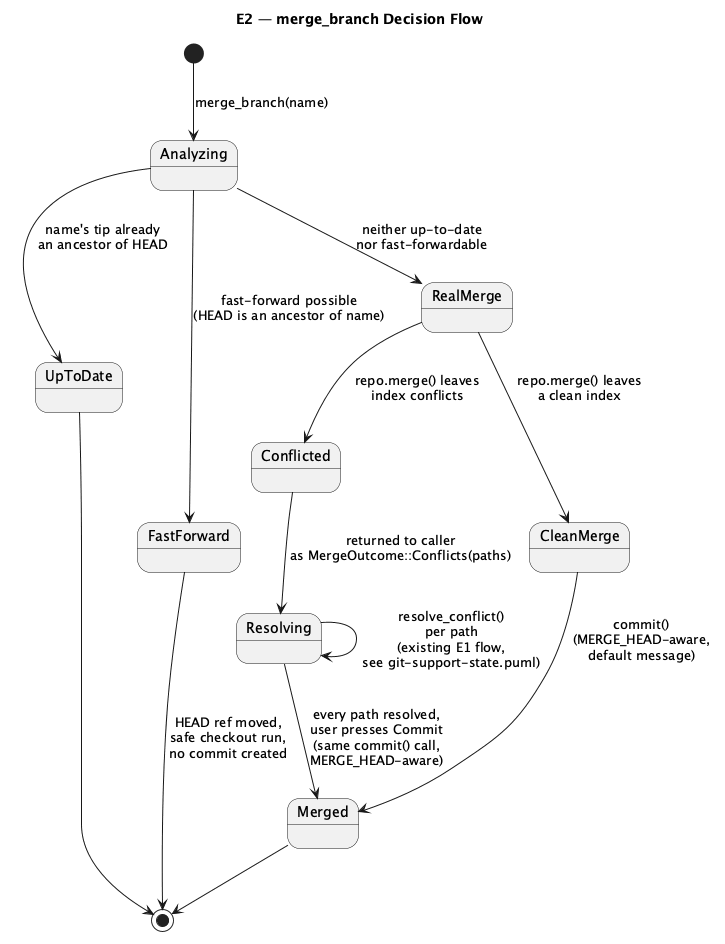
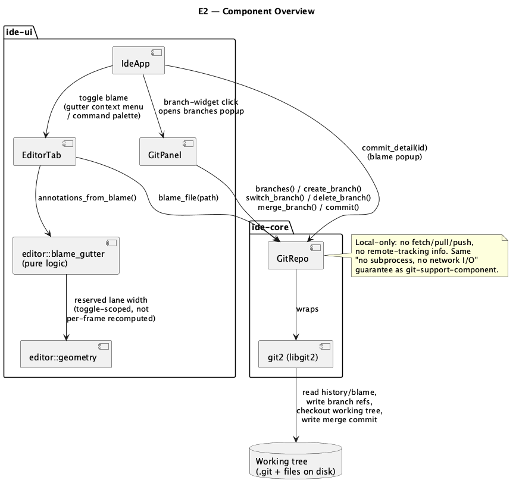

# Git Branches & Blame (E2)

## 1. Purpose

Two independent-but-adjacent additions to the git integration, both scoped
to the **local** repository only (no network I/O — see §6 for why):

1. **Branches** — list local branches, create a new one, switch (checkout),
   delete, and locally merge one branch into the currently checked-out
   branch. On merge conflicts, this reuses the conflict-resolution flow
   already built for **E1** (`git-commit-and-staging.md`) rather than
   inventing a second one.
2. **Blame** — a toggleable annotation column in the editor gutter showing,
   per line, who last committed it and when (`git blame`, via
   `git2::Repository::blame_file`), with a popup on click showing the full
   commit message.

Both are pure additions to `ide_core::git::GitRepo` (§2.1) plus new
`ide-ui` state/rendering (§2.2) — no `ide-lsp` involvement.

### 1.1 A pre-existing gap this closes

`git-support-state.puml` (the E1-era conflict-lifecycle diagram, still
accurate for how conflicts *arise*) documents that resolving a conflict
via the IDE's UI (`resolve_conflict`, staging the resolved content) was
always a dead end for actually **finishing** the merge: `GitRepo::commit`
only ever builds a **single**-parent commit, so a user who resolved every
conflict and then hit the existing Commit button would silently get a
commit that discards the merge relationship entirely — the second parent
recorded in `MERGE_HEAD` is just never read. Nothing in `crates/ui`
currently offers a way to finish either, so **this gap has never actually
been hit by anything reachable in the app so far** (conflicts have only
ever come from something external, e.g. a CLI `git merge` run outside the
IDE) — but it's a real correctness bug the moment E2 adds the first
in-app trigger that can leave a repo in that state. §2.1.7 fixes it as
part of this feature, not as a follow-up.

## 2. Interface

### 2.1 `ide-core` additions (`crates/core/src/git/mod.rs`)

```rust
#[derive(Debug, Clone, PartialEq, Eq)]
pub struct BranchInfo {
    pub name: String,
    pub is_head: bool,
}

#[derive(Debug, Clone, PartialEq, Eq)]
pub enum MergeOutcome {
    /// `name` is already an ancestor of `HEAD` — nothing to do.
    UpToDate,
    /// `HEAD` was fast-forwarded to `name`'s tip. No commit created.
    FastForward,
    /// A real merge was needed and produced conflicts. `MERGE_HEAD` is
    /// now set; resolve every path in the returned list (the existing
    /// `conflicts()`/`conflict_sides()`/`resolve_conflict()` trio, §1.1)
    /// then call `commit()` to finish it.
    Conflicts(Vec<PathBuf>),
    /// A real merge was needed, produced no conflicts, and was committed
    /// automatically (matches plain `git merge`'s own default behavior —
    /// there is no separate "finish" step for the clean case).
    Merged { commit_id: String },
}

#[derive(Debug, Clone, PartialEq, Eq)]
pub struct CommitDetail {
    pub id: String,
    pub short_id: String,
    /// First line of the commit message.
    pub summary: String,
    /// Everything after the summary's blank-line separator, trimmed.
    /// Empty string (not `None`) for a single-line message.
    pub body: String,
    pub author: String,
    pub email: String,
    pub timestamp: i64,
}

#[derive(Debug, Clone, PartialEq, Eq)]
pub struct BlameLine {
    /// 0-based buffer line.
    pub line: usize,
    pub commit_id: String,
    pub short_id: String,
    pub author: String,
    pub timestamp: i64,
    pub summary: String,
}

/// Cap on the number of lines `blame_file` computes/returns for one file
/// — same shape as `MAX_DIFF_LINES` (§2.1's sibling constant): blame cost
/// scales with both file size and history depth, so an unbounded file is
/// a plausible slow-path even without anything adversarial involved.
/// Lines beyond the cap are silently absent from the result (no
/// truncation flag — same precedent as `MAX_DIFF_FILES`).
pub const MAX_BLAME_LINES: usize = 20_000;

impl GitRepo {
    /// Every local branch, alphabetical by name. `is_head` marks the one
    /// `current_branch()` would return — at most one `true`, none if
    /// `HEAD` doesn't resolve (unborn/empty repo, same "not an error"
    /// treatment as `current_branch`/`commit_graph`).
    pub fn branches(&self) -> Result<Vec<BranchInfo>, GitError>;

    /// Creates a local branch named `name` pointing at `start_point`
    /// (any revspec `git2::Repository::revparse_single` accepts — a
    /// branch name, tag, or commit id) or `HEAD` if `None`. Does **not**
    /// switch to it — that's a separate `switch_branch` call, so the UI
    /// can offer "create" and "create and checkout" as one button that
    /// calls both, without the core API baking in that policy. Errors if
    /// `name` already exists (git2's own behavior, not force-overwritten).
    pub fn create_branch(
        &self,
        name: &str,
        start_point: Option<&str>,
    ) -> Result<(), GitError>;

    /// Checks out local branch `name`: moves `HEAD`, updates the working
    /// tree. Uses libgit2's **safe** checkout mode (not force) — refuses
    /// (returns `Err`) if the working tree has uncommitted changes that
    /// checkout would overwrite, the same "don't silently discard
    /// uncommitted work" behavior plain `git checkout` has, and the same
    /// principle `resolve_conflict`'s own write path already follows
    /// elsewhere in this file. There is no stash feature yet (**E5**) —
    /// a caller hitting this has to commit or discard first.
    pub fn switch_branch(&self, name: &str) -> Result<(), GitError>;

    /// Deletes local branch `name`. Refuses (returns
    /// `GitError::BranchNotMerged`) unless `name`'s tip is an ancestor of
    /// (or equal to) the current `HEAD` — the same safety `git branch -d`
    /// gives you before `-D`'s force — unless `force` is `true`, which
    /// skips that check entirely (`git branch -D` equivalent). Refuses to
    /// delete the branch `HEAD` currently points at regardless of
    /// `force` — verify libgit2 already enforces this itself (it's
    /// documented libgit2 behavior); if a live test shows it doesn't, add
    /// an explicit `self.current_branch() == Some(name)` guard before
    /// calling `git2::Branch::delete`.
    pub fn delete_branch(&self, name: &str, force: bool) -> Result<(), GitError>;

    /// Merges local branch `name` into the current `HEAD` branch. See
    /// `MergeOutcome` above for the four outcomes and
    /// `docs/features/diagrams/git-branches-and-blame-state.png` for the
    /// full decision flow. Uses `git2::Repository::merge_analysis` to
    /// pick fast-forward vs. a real merge; a real, conflict-free merge is
    /// finished by calling this type's own `commit()` (§2.1.7) with a
    /// default message `"Merge branch '<name>' into <current-branch>"`
    /// (matches plain `git merge`'s own default merge-commit message
    /// shape) — the same code path a user finishing a conflicted merge
    /// by hand goes through, so there is exactly one way a merge commit
    /// ever gets created, not two.
    pub fn merge_branch(&self, name: &str) -> Result<MergeOutcome, GitError>;

    /// Full detail for one commit (by id or any revspec `find_commit`-
    /// compatible string) — a superset of what `CommitNode` carries
    /// (`commit_graph`'s existing type), used by the blame popup (§2.2.3)
    /// and reusable as-is by a future **E3** (`git-log-viewer.md`)
    /// commit-details pane rather than something E2-specific. Kept as
    /// its own method/type instead of adding `body`/`email` fields to
    /// `CommitNode` itself, since every existing `commit_graph` call site
    /// constructs/matches that struct today and doesn't need those two
    /// fields for a graph row.
    pub fn commit_detail(&self, commit_id: &str) -> Result<CommitDetail, GitError>;

    /// Per-line blame for `path` (repo-relative) against `HEAD`. Computed
    /// from `HEAD`'s committed blob content, **not** the live editor
    /// buffer or an unsaved on-disk edit — same "diff/gutter only look at
    /// what's on disk and last-saved, not the live buffer" precedent
    /// `diff_file`/**E7**'s git gutter already establish; a file with
    /// unsaved changes shows blame for its last-saved content until the
    /// buffer is saved and the app's existing git-refresh path picks up
    /// the change. `path` that isn't tracked at `HEAD` (new/untracked
    /// file) returns `Ok(vec![])`, mirroring `diff_file`'s "untracked
    /// shows no diff" treatment rather than an error. Capped at
    /// `MAX_BLAME_LINES`.
    pub fn blame_file(&self, path: impl AsRef<Path>) -> Result<Vec<BlameLine>, GitError>;

    /// **Behavior change, not just an addition** (§1.1): if `.git/
    /// MERGE_HEAD` is present, the produced commit now has **two**
    /// parents (current `HEAD`'s commit and `MERGE_HEAD`'s commit)
    /// instead of one, and `git2::Repository::cleanup_state` runs
    /// afterward to clear `MERGE_HEAD`/`MERGE_MSG` — turning "resolve
    /// conflicts, then press the existing Commit button" into a real
    /// finished merge for the first time. The `amend` path is unaffected
    /// (amending during an in-progress merge is already a rare/advanced
    /// case genuinely out of v1 scope — `amend` continues to only touch
    /// `HEAD`'s existing single-parent shape, matching today's
    /// behavior). Every existing caller/test of `commit()` on a
    /// merge-free repo is unaffected (no `MERGE_HEAD` present, so the new
    /// branch never taken).
    pub fn commit(&self, message: &str, amend: bool) -> Result<String, GitError>;
}
```

New `GitError` variant:

```rust
#[error("branch '{0}' is not fully merged into HEAD")]
BranchNotMerged(String),
```

### 2.2 `ide-ui` additions

#### 2.2.1 `GitPanel` (`crates/ui/src/git_panel.rs`) — extended, not replaced

`GitPanel` already owns every other piece of git-facing UI state
(`current_branch`, the conflict-resolution flow, stage/unstage/commit) —
branches and the merge trigger are the same feature domain, not an
unrelated one (contrast with **C7**'s `search_in_path_panel.rs`, a
deliberate *sibling* module created specifically because that feature's
natural host type, `SearchPanel`, is shared with an unrelated feature;
`GitPanel` has no such conflict here), so they're new fields/methods on
the existing type:

```rust
#[derive(Default)]
pub struct BranchesPopupState {
    pub open: bool,
    pub filter: String,
    pub selected: usize,
    pub new_branch_name: String,
    pub show_new_branch_input: bool,
    /// Branch name pending a "not fully merged — force delete?" confirm
    /// (`delete_branch`'s `Err(BranchNotMerged)` lands here instead of
    /// just being shown as an error).
    pub pending_delete: Option<String>,
}

pub struct GitPanel {
    // ...existing fields unchanged...
    pub branches: Vec<ide_core::BranchInfo>,
    pub branches_popup: BranchesPopupState,
    /// `true` between a `merge_branch` call that returned
    /// `Conflicts(_)` and the resulting commit actually landing (or the
    /// merge being abandoned externally) — purely a UI label/default-
    /// message concern: while `true`, the existing commit UI shows
    /// "Commit Merge" instead of "Commit" and pre-fills the same default
    /// message `merge_branch` would have used for the clean-merge case,
    /// editable like any other commit message. Cleared the moment
    /// `commit()` succeeds (mirrors how `conflicts()` naturally empties
    /// once every path is resolved — this flag isn't re-derived from
    /// `MERGE_HEAD` every frame, since nothing else in this file
    /// re-probes the filesystem that often either).
    pub merging: bool,
}

impl GitPanel {
    pub fn open_branches_popup(&mut self, project_root: &Path);
    pub fn close_branches_popup(&mut self);
    pub fn checkout_branch(&mut self, project_root: &Path, name: &str) -> Result<(), String>;
    pub fn create_branch(
        &mut self,
        project_root: &Path,
        name: &str,
        checkout: bool,
    ) -> Result<(), String>;
    pub fn request_delete_branch(&mut self, name: &str);
    pub fn cancel_delete_branch(&mut self);
    pub fn confirm_delete_branch(&mut self, project_root: &Path, force: bool) -> Result<(), String>;
    /// Starts a merge of `name` into the current branch. On
    /// `MergeOutcome::Conflicts`, populates the *existing* conflicts
    /// list/selection (same fields `sync_status`'s conflict handling
    /// already populates) and sets `merging = true` — from the caller's
    /// point of view this is indistinguishable from an externally-
    /// created conflict except for that flag and the pre-filled message.
    /// On `Merged`/`FastForward`/`UpToDate`, refreshes status/graph the
    /// same way `sync_status`/`refresh` already do, closes the branches
    /// popup, and returns `Ok(())`.
    pub fn merge_branch(&mut self, project_root: &Path, name: &str) -> Result<(), String>;
}
```

`commit()` (the existing method on `GitPanel`, wrapping `GitRepo::commit`)
needs no signature change — it already passes its message straight
through; `merging` only changes what the *UI* pre-fills and labels, not
how the call is made. When it succeeds while `merging` was `true`, clear
the flag.

#### 2.2.2 Branches popup rendering (`crates/ui/src/app/render.rs`)

A new `render_branches_popup(&mut self, ctx: &egui::Context)`, structured
like the existing small popups in this file (`render_replace_in_path_
preview`'s window-based shape, not a full-screen overlay): filterable
list (reusing the existing fuzzy-filter helper already used by
`search_everywhere`/`file_structure` popups rather than writing a new
one), current branch shown checked/bold, each row offering Checkout /
Merge Into Current / Delete, plus a "New Branch…" affordance that reveals
the name field and a "create and checkout" checkbox (default checked,
matching the common case). A `Delete` on an unmerged branch shows a
confirm inline (`pending_delete`) with "Force Delete" instead of popping
a second modal — mirrors the existing `request_discard`/`confirm_
discard`/`cancel_discard` three-step pattern already used for staged-file
discard.

Trigger: the two existing `ui.label(branch)` spots (`render.rs`,
current-branch text in the top toolbar and the status bar) become
clickable (`egui::Sense::click()`, same pattern the Errors/Warnings label
right next to the status-bar one already uses) and call `open_branches_
popup`.

New command: `Command { id: "GitBranches", title: "Git Branches…",
category: "Git", ... }` — **a brand-new command-palette category**:
`crates/ui/src/command.rs` currently has no git-related category at all
(its existing set is Build/Edit/File/Navigate/Refactor/Search/Settings/
View/Window; there is no registered "Commit"/staging command either —
those are UI-button-only today), so this is the first command to use it
(`ToggleBlameAnnotations`, §2.2.3, is the second). **Binding: verify
against the JetBrains macOS keymap reference before assigning anything**
(the same `WebFetch`-the-actual-docs step already established for
**C1**/**D4**/**C7**'s binding fixes) — if no default exists there,
register with `binding: None`, reachable via the branch-widget click and
the command palette, per `CLAUDE.md`'s "never invent a binding" rule.

`crates/ui/src/app/menu.rs`'s `MENU_GROUPS` currently has exactly five
groups — File, Edit, View, Go, Window (verified by reading the constant
directly) — **there is no VCS or Git group to add to**. This feature adds
a genuinely new sixth top-level `MenuGroup { title: "Git", items:
&[Some("GitBranches"), ...] }` entry, which matches real JetBrains/macOS
menu-bar convention (a standalone top-level "Git" menu) at least as well
as folding a git command into an unrelated existing group would — the
file's own header comment already commits to following that convention.
Confirm the existing native-menu integrity test still passes once the
new group and its item(s) are added.

#### 2.2.3 Blame gutter (`crates/ui/src/editor/blame_gutter.rs`, new — pure logic, no `egui`)

Mirrors `crates/ui/src/editor/git_gutter.rs`'s existing shape exactly —
same "pure conversion, no I/O, no `egui`" module contract:

```rust
pub struct BlameAnnotation {
    /// 0-based buffer line — the first line of a run of consecutive
    /// lines all attributed to the same commit.
    pub line: usize,
    /// How many consecutive lines from `line` this one annotation covers
    /// (only `line` itself gets the rendered label; the rest of the run
    /// renders blank — matches real JetBrains/VS Code blame-gutter
    /// behavior, where a label repeated on every line would be noise).
    pub run_len: usize,
    pub commit_id: String,
    pub short_id: String,
    pub author: String,
    pub timestamp: i64,
    pub summary: String,
}

/// Collapses `lines` (already ordered by buffer line, one entry per line
/// — `GitRepo::blame_file`'s own return shape) into runs.
pub fn annotations_from_blame(lines: &[ide_core::BlameLine]) -> Vec<BlameAnnotation>;
```

Rendering/state (`crates/ui/src/app.rs` + `render.rs`, and `crates/ui/
src/editor/geometry.rs`):

- Per-tab toggle (not global) — `Tab` (`crates/ui/src/app.rs`'s existing
  struct, not to be confused with anything folding-related — see below)
  gains `blame: Option<Vec<BlameAnnotation>>` (`None` = off, the ordinary
  Rust idiom for "not computed/not active"). Folding's *data model*
  (`FoldRange`) lives in `ide-core` (**A6**'s design: "model in core —
  ranges + state"), but which lines are actually toggled on right now is
  separate, genuine per-tab **`ide-ui`** state: `EditorState.folded:
  BTreeSet<usize>` (`crates/ui/src/editor/mod.rs`, reached via `Tab.
  editor`) — the closest real precedent for "per-tab, UI-only, off-by-
  default toggle state," just shaped as a live toggle set rather than a
  computed-once-per-toggle cache. `blame`'s `Option<Vec<_>>` is still a
  new *shape* in this crate (a cache invalidated wholesale on toggle/
  reload, not a per-line set mutated incrementally), just not a wholly
  unprecedented *concept*. Populated by calling `GitRepo::blame_file` +
  `annotations_from_blame` when toggled on, and refreshed on save (same
  trigger `git_gutter`'s marks already refresh on, per the note in §2.1
  above about blame reflecting last-saved content) **and** on Reload
  (the existing `ExternalChange::Modified` → Reload path, `Tab.external_
  change`, **G6**'s file-watcher) — an externally-changed-and-reloaded
  file's blame is exactly as stale as its diff/gutter marks would be
  otherwise, so it refreshes on the same trigger, not a new one.
- New command `ToggleBlameAnnotations`, category `"Git"` — **a brand-new
  command-palette category**: `crates/ui/src/command.rs` currently has no
  git-related category at all (its existing set is Build/Edit/File/
  Navigate/Refactor/Search/Settings/View/Window; there is no registered
  "Commit"/staging command either — those are UI-button-only today), so
  this and `GitBranches` (§2.2.2) are the first two commands to use it.
  Binding: same verification rule as §2.2.2 applies — JetBrains' actual
  action is "Annotate with Git Blame" and is gutter-context-menu-only
  with no default shortcut in the reference macOS keymap as best
  documented; confirm before relying on that and register `binding: None`
  if confirmed.
- Also reachable from the gutter's existing right-click context menu
  (the same menu **E7**'s "Revert Hunk"/"Show Diff" already live on),
  labeled "Annotate with Blame" / "Close Annotations" depending on
  current state — this is the *primary* real-IDE entry point, the
  command-palette one is secondary.
- When on, `Metrics::new` (`geometry.rs`) reserves one additional fixed-
  width lane **left of** the existing line-number digits (JetBrains/VS
  Code both place blame left of line numbers, distinct from the existing
  `MARKER_LANE_CHARS` icon lane, which stays where it is between numbers
  and text) sized for a fixed character budget (implementer's call on
  the exact width — e.g. enough for `"jdoe, 3 days ago"` truncated with
  an ellipsis past that budget) that does **not** vary per-frame or per-
  annotation-text-length once the tab's blame is loaded, only when
  toggled on/off for that tab — the same "don't recompute derived
  geometry from live content every frame" lesson **C7**'s round-1 review
  finding already burned this project on once (`docs/roadmap.md`'s
  Прогон №25 entry), applied here to layout instead of a text field.
- Click on an annotation's label opens `render_blame_popup` (new,
  mirrors `render_replace_in_path_preview`'s small-window shape, title
  "Commit Details" — deliberately distinct from any other popup title in
  this file, same convention **C7** followed): calls `commit_detail` for
  the clicked line's `commit_id` and shows hash, author, email, date,
  and the full message (summary + body).

## 3. Behaviour & edge cases

- **Branches**
  - Listing, creating, deleting are all **local-only** (§6) — no
    upstream/tracking info anywhere in `BranchInfo` or the popup.
  - `create_branch` on an existing name errors (git2's native behavior);
    the popup shows the error inline rather than clearing the name field,
    so the user can adjust and retry without retyping.
  - `switch_branch` with uncommitted changes that would be overwritten
    errors; the popup shows the git2 error text as-is (no attempt to
    paraphrase libgit2's own message — same "surface the real error"
    approach `stage`/`unstage`/`commit`'s existing `Result<(), String>`
    conversions already take).
  - `delete_branch` on the checked-out branch always errors regardless of
    `force` (§2.1) — the popup should therefore never even offer Delete
    on the row marked current (`is_head`), rather than offering it and
    showing an error after the click.
  - `merge_branch` on a branch that IS the current branch, or that has no
    commits ahead, returns `UpToDate` — a no-op status message, not an
    error.
  - A merge's conflicts land in exactly the same `conflicts()`/`select_
    conflict`/`accept_ours`/`accept_theirs`/`mark_resolved` flow any
    other conflict already uses (§1.1) — this doc introduces no second
    conflict-resolution UI.
- **Blame**
  - A file with zero commits touching it (freshly created, never
    committed) yields `blame_file` → `Ok(vec![])`; the gutter simply
    shows no annotations rather than an error state.
  - `blame_file` on a path outside the repo, or one that fails the same
    repo-relative validation `diff_file`/`resolve_conflict` already apply,
    errors the same way those do (`GitError::PathEscapesRepo` or the
    underlying `git2`/`io` error) — no separate validation path invented.
  - Toggling blame off for a tab drops its `blame: Option<...>` back to
    `None` and the gutter reclaims the lane width immediately — no lazy
    /stale annotation ever renders after being toggled off.
  - Reopening a file after closing its tab starts with blame off — the
    toggle is tab-session state, not persisted (no config surface for it
    yet; a natural **G1**/settings follow-up, not this feature's job to
    invent a persistence format for a single boolean).

## 4. Constraints & invariants

- No network I/O anywhere in this feature (§6) — every new `GitRepo`
  method operates purely on the local object database and working tree,
  same as everything else in this file except `clone_repo`.
- `switch_branch`/checkout and `merge_branch`'s fast-forward path never
  force-overwrite uncommitted local changes — always safe-mode checkout,
  matching `CLAUDE.md`'s git-integration security-sensitive-path rule
  ("writes... a maliciously crafted repository or a conflicted-file path
  is untrusted input until validated to stay within the repo's working
  directory" — a checkout that silently clobbers uncommitted work is the
  same class of unintended-write risk that rule already covers, applied
  to a new write path).
- `commit()`'s `MERGE_HEAD`-aware behavior change (§2.1.7) must not alter
  any existing single-parent-commit test's outcome — every current
  `commit()` test runs against a repo with no `MERGE_HEAD`, so the new
  branch is provably untaken for all of them; the fix round should add at
  least one *new* test that actually sets up `MERGE_HEAD` (e.g. via
  `repo.merge()` against a divergent branch in a temp repo, or by writing
  the ref directly) and asserts the resulting commit has two parents, not
  rely on reasoning alone.
- `blame_file`/`annotations_from_blame` must terminate promptly on a
  large/pathological file — `MAX_BLAME_LINES` bounds the git2-side call
  itself (via `BlameOptions`' line-range fields), not a post-hoc `Vec`
  truncation, so the cost is actually capped, not just the output size.

## 5. Examples

```rust
// Branches
let repo = GitRepo::open(&project_root)?;
for b in repo.branches()? {
    println!("{}{}", if b.is_head { "* " } else { "  " }, b.name);
}
repo.create_branch("feature/x", None)?;   // from HEAD
repo.switch_branch("feature/x")?;
match repo.merge_branch("main")? {
    MergeOutcome::UpToDate => println!("nothing to merge"),
    MergeOutcome::FastForward => println!("fast-forwarded"),
    MergeOutcome::Merged { commit_id } => println!("merged as {commit_id}"),
    MergeOutcome::Conflicts(paths) => {
        for p in paths {
            let sides = repo.conflict_sides(&p)?;
            // ...resolve, then repo.resolve_conflict(&p, &resolved_text)?...
        }
        let commit_id = repo.commit("Merge branch 'main' into feature/x", false)?;
        println!("merge finished as {commit_id}");
    }
}
repo.delete_branch("feature/x", false)?; // safe delete, errors if unmerged

// Blame
for line in repo.blame_file("src/lib.rs")? {
    println!("{}: {} ({})", line.line, line.author, line.short_id);
}
let detail = repo.commit_detail(&some_commit_id)?;
println!("{}\n\n{}", detail.summary, detail.body);
```

## 6. Dependencies & integration points

- No new crate dependencies — `git2` (already present) covers branches,
  merge, and blame.
- Builds on **E1** (`git-commit-and-staging.md`, conflict-resolution
  flow, `commit()`) and **E7** (`editor-git-gutter.md`, the gutter's
  existing rendering/geometry/context-menu machinery the blame lane
  extends).
- **Deliberately does not** implement remote branches, tracking-branch
  info (ahead/behind counts), or `git merge` against a remote-tracking
  ref — `git-remote.md`/**E6** implemented `clone` only (verified by
  reading `crates/core/src/git/mod.rs`: no `fetch`/`pull`/`push` exists
  today despite the original **E6** roadmap line describing all four),
  so there is no fetched/tracked remote state for a "remote branches"
  section of this popup to show yet. This is a conscious v1 scope line,
  not an oversight — revisit once fetch/pull actually lands.
- **E3** (`git-log-viewer.md`, not yet built) is a plausible future
  consumer of `commit_detail` (§2.1) for its own commit-details pane —
  noted here so that role doesn't duplicate it.
- `crates/core/src/git/mod.rs` and any editor-gutter file remain on
  `CLAUDE.md`'s security-sensitive-paths list — this feature's diff
  needs a `hacker` pass before merge (checkout/merge write paths, and
  blame reading arbitrary repository history content into the UI).

## 7. Diagrams





## Revision notes

Round 1 `rev` (`changes_needed`) found four `[docs]` inaccuracies, all
verified against the actual source rather than asserted, plus one Low
gap:

1. §2.2.3 referred to a nonexistent `EditorTab` type — the real struct is
   `Tab` (`crates/ui/src/app.rs:141`). Fixed throughout.
2. §2.2.3 cited a nonexistent "folding/other per-tab optional state"
   precedent for the `blame: Option<Vec<_>>` field — verified false by
   reading `EditorState`; folding's actual state lives in `ide-core`
   (**A6**'s "model in core" design). Fixed to state plainly this is a
   new pattern, not a copied one.
3. §2.2.2 instructed adding the new `GitBranches` command to "`MENU_
   GROUPS`'s VCS group" — verified no such group exists (`MENU_GROUPS`
   has exactly File/Edit/View/Go/Window). Fixed to explicitly instruct
   creating a new top-level `MenuGroup { title: "Git", ... }`.
4. §2.2.2/§2.2.3's `category: "Git"` read as if reusing an existing
   category — verified `command.rs` has no git-related category yet.
   Fixed to state explicitly that this introduces a new category.
5. §3's Blame edge cases didn't address the existing file-watcher/
   `ExternalChange` (**G6**) interaction — added: blame refreshes on
   Reload the same way it does on Save, not a separate trigger.

Two `[controversial]` notes from the same round (making `commit()`
implicitly `MERGE_HEAD`-aware; extending `GitPanel` rather than a sibling
module) were read and are deliberate, argued choices — not acted on, per
`rev`'s own "never blocking on their own" rule for that section.
