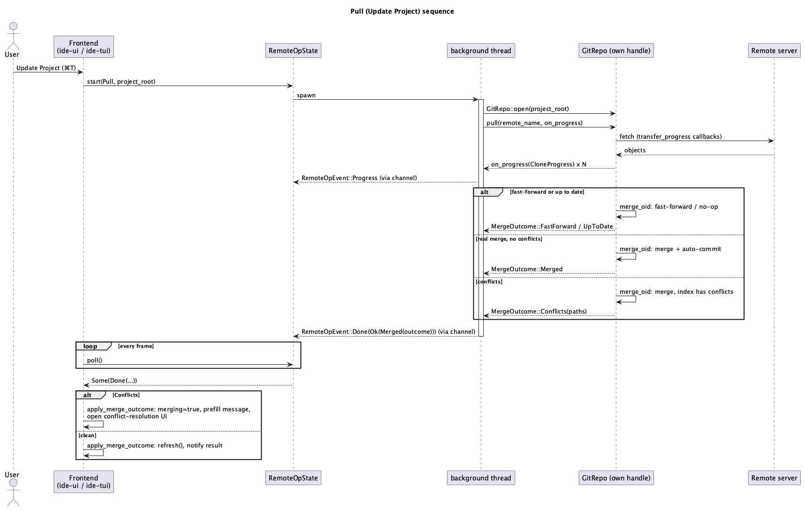

# Git Fetch / Pull / Push (E6 completion, + TUI parity)

## 1. Purpose

`docs/features/git-remote.md` (E6) added `clone_repo` but explicitly
scoped out the other three remote operations. They were never built
anywhere — not in `ide-core`, not in `ide-ui`, not in `ide-tui`. The
roadmap's own keybinding table (`docs/roadmap.md` §5.2) has reserved
`⌘⇧K` (Push) and `⌘T` (Update Project, JetBrains' name for fetch+merge)
against E6 since it was written, both still unbound in `command::
commands()`. This doc finishes E6 and, in the same run, ports the result
straight into `ide-tui` — unlike the original clone/launcher split (T34
came a full batch after `ide-ui`'s clone), there's no reason to stage this
one, since both frontends need the exact same three `ide-core` entry
points and neither has any of this today.

Scope, precisely:

1. **`ide-core`**: `GitRepo::fetch`, `GitRepo::pull`, `GitRepo::push`.
2. **`ide-ui`**: wires them into the existing Git Panel, `Action::Fetch`/
   `Action::Pull`/`Action::Push`, `⌘T`/`⌘⇧K` bindings (Fetch itself has no
   default JetBrains binding — see §3.5).
3. **`ide-tui`**: the same three actions, mirroring `ide-ui`'s
   integration the way `clone_panel.rs` mirrored `crates/ui/src/
   clone_panel.rs` (T34) — same `ide-core` calls, no terminal-specific
   behavior differences beyond key-binding availability (§3.5).

Not in scope: a remote picker (v1 assumes a single remote, `"origin"`,
matching `clone_repo`'s own no-remote-naming-UI precedent), force-push,
push-to-set-upstream for a branch with none configured yet (§3.3), and
tags (fetch/push move branch refs only — same restriction plain `git
fetch`/`git push` have without `--tags`).

This is security-sensitive: `crates/core/src/git/**` is unconditionally
on `CLAUDE.md`'s list, and this diff adds two more network operations
(fetch, push) alongside the one clone already established — a `hacker`
pass runs on `rust-core-dev`'s work before merge, same as `git-remote.md`
required. `ide-ui`/`ide-tui`'s own diffs don't independently trigger
`hacker` (no `git_panel.rs`-adjacent write-path logic beyond what
`git-branches-and-blame.md`/T28 already covered — this only adds calls
into already-reviewed `ide-core` functions plus the by-now-established
background-thread UI pattern), but `crates/ui/src/git_panel.rs`/
`crates/tui/src/git_panel.rs` are themselves unconditionally on
`CLAUDE.md`'s list, so `hacker` runs on those two roles as well once
`rev` approves them — this doc doesn't get to claim an exemption a
declared path already forecloses.

## 2. Interface / API

### 2.1 `crates/core/src/git/mod.rs`

```rust
pub const DEFAULT_REMOTE: &str = "origin";

/// Alias, not a rename — `CloneProgress` is `git2::Progress`'s shape, not
/// clone-specific, but `fetch`/`pull` naming their progress parameter
/// after a type called `CloneProgress` would read as a copy-paste leftover
/// six months from now. Zero cost: existing `clone_repo` callers keep
/// using `CloneProgress` unchanged, `fetch`/`pull`'s own signatures use
/// this alias instead.
pub type TransferProgress = CloneProgress;

impl GitRepo {
    /// Fetches every ref `remote_name`'s configured refspecs cover
    /// (passing an empty refspec array to libgit2, which then falls back
    /// to the remote's own base refspecs — typically
    /// `+refs/heads/*:refs/remotes/<remote_name>/*`), updating this
    /// repo's remote-tracking refs. Never touches the working tree, the
    /// index, or any local branch — same division of labor as plain `git
    /// fetch`. `on_progress` is called zero or more times during the
    /// transfer, via `TransferProgress` (a plain alias for `CloneProgress`
    /// — it's `git2::Progress`'s shape, not clone-specific, but naming it
    /// after clone in a fetch/pull signature would read as a copy-paste
    /// leftover; the alias costs nothing since `clone_repo`'s own callers
    /// keep using `CloneProgress` unchanged). Sets `FetchOptions::download_tags(
    /// AutotagOption::None)` explicitly — `git2::FetchOptions::default()`'s
    /// own `download_tags` is `AutotagOption::Unspecified`, which falls
    /// back to the repository's `remote.<name>.tagOpt` config and, absent
    /// that, libgit2's own default of auto-following tags that point at
    /// newly-fetched objects. Left unset, that default would silently
    /// contradict this doc's own "branch refs only" scope claim (§1) —
    /// verified against the vendored `git2` 0.21.0 source
    /// (`src/remote.rs`'s `FetchOptions::default()`), not assumed.
    /// Errors:
    /// - `GitError::RemoteNotFound` if `remote_name` isn't configured
    ///   (`self.repo.find_remote` failing is this function's most likely
    ///   failure mode before any network I/O happens at all).
    pub fn fetch(
        &self,
        remote_name: &str,
        on_progress: impl FnMut(TransferProgress),
    ) -> Result<(), GitError>;
    // Caps local ref-update application at `MAX_ADVERTISED_REFS` via
    // `update_tips` -- a `hacker` pass (Revision notes #9) found this
    // does NOT bound the cost of receiving/parsing the remote's initial
    // ref advertisement itself (no hook in `git2` 0.21.0's public API
    // fires during that phase); see `MAX_ADVERTISED_REFS`'s own doc
    // comment for the honest scope of what this cap does and doesn't
    // cover.

    /// Resolves the current branch name *first* — `GitError::DetachedHead`
    /// if `HEAD` isn't on a branch — before doing anything else, so a
    /// detached-HEAD repo fails locally with no network I/O attempted at
    /// all. Matches `clone_repo`'s own established precedent (`git-
    /// remote.md` §3.2: an empty `url` fails "no clone attempted, no
    /// network call made" *before* touching the network) rather than
    /// fetching first and discovering there's nothing to merge into only
    /// afterward. Once past that check: fetches from `remote_name` (as
    /// `fetch` does — including its `RemoteNotFound` failure mode), then
    /// merges the resulting remote-tracking branch for the current local
    /// branch into `HEAD` — reuses the exact fast-forward/merge/conflict
    /// machinery `merge_branch` already has (`MergeOutcome`), so there is
    /// still exactly one merge implementation in this module (§3.2).
    /// Errors:
    /// - `GitError::DetachedHead` if `HEAD` isn't on a branch (nothing to
    ///   pull *into*) — checked before any network I/O.
    /// - `GitError::RemoteNotFound` if `remote_name` isn't configured.
    /// - `GitError::NoUpstream` if `refs/remotes/<remote_name>/<branch>`
    ///   doesn't exist after fetching (this branch has never been fetched
    ///   from that remote — v1 doesn't consult `branch.<name>.remote`/
    ///   `.merge` config, see §3.2).
    pub fn pull(
        &self,
        remote_name: &str,
        on_progress: impl FnMut(TransferProgress),
    ) -> Result<MergeOutcome, GitError>;

    /// Pushes the current local branch's tip to `refs/heads/<branch>` on
    /// `remote_name`, using a plain (non-force) refspec —
    /// `refs/heads/<branch>:refs/heads/<branch>` — so a non-fast-forward
    /// push is rejected by the remote exactly as a plain `git push`
    /// (without `--force`) would be. `on_progress` reports byte-level
    /// transfer progress (`PushProgress`, a different shape than
    /// `CloneProgress` — see its own doc comment, §3.4).
    /// Errors:
    /// - `GitError::DetachedHead`
    /// - `GitError::RemoteNotFound`
    /// - `GitError::PushRejected(String)` — the remote's own rejection
    ///   reason (e.g. `"non-fast-forward"`), reported via libgit2's
    ///   `push_update_reference` callback rather than `push()`'s own
    ///   return value (§3.3 explains why the two are decoupled at the
    ///   libgit2 level).
    pub fn push(
        &self,
        remote_name: &str,
        on_progress: impl FnMut(PushProgress),
    ) -> Result<(), GitError>;
    // Hardened (Revision notes #9): `git2` 0.21.0's own FFI trampoline for
    // `push_update_reference` panics instead of erroring if the remote's
    // rejection reason is invalid UTF-8 -- `push` wraps the underlying
    // `Remote::push` call in `std::panic::catch_unwind` and converts a
    // caught panic into `Err(GitError::PushRejected(_))` with a fixed,
    // honest message (the original panic payload carries no recoverable
    // information by the time it reaches this boundary).
}

/// Byte-level push progress (`git2::RemoteCallbacks::
/// push_transfer_progress`'s own three `usize`s — current object,
/// total objects, bytes transferred — not the same shape as
/// `git2::Progress`/`CloneProgress`, which is why this is its own type
/// rather than a reuse).
#[derive(Debug, Clone, Copy, PartialEq, Eq, Default)]
pub struct PushProgress {
    pub current: usize,
    pub total: usize,
    pub bytes: usize,
}

/// Added in Revision notes #10: process-wide libgit2 network-I/O timeout
/// configuration. `ide-ui`/`ide-tui`'s `main.rs` must call this exactly
/// once at startup, before any thread that might use `GitRepo` for a
/// network operation is spawned -- see the function's own doc comment for
/// the full safety contract (it is `unsafe`: libgit2's underlying option
/// is process-global and not safe to mutate concurrently with other
/// in-flight `git2` calls). Bounds a remote that accepts a connection and
/// then stalls indefinitely; does **not** bound a fast-flood remote (see
/// `MAX_ADVERTISED_REFS`'s own doc comment) -- both verified live.
pub unsafe fn configure_network_timeouts(
    connect_timeout_ms: i32,
    io_timeout_ms: i32,
) -> Result<(), GitError>;
```

`GitError` gains four variants (all existing variants unchanged):

```rust
#[error("no remote named '{0}'")]
RemoteNotFound(String),
#[error("HEAD is not on a branch")]
DetachedHead,
#[error("current branch has no remote-tracking branch on '{0}'")]
NoUpstream(String),
#[error("push rejected by remote: {0}")]
PushRejected(String),
```

**Required refactor, not a behavior change:** `clone_repo`'s inline
credentials closure (`git-remote.md` §3.3) is extracted into a private
`fn credential_callback(callbacks: &mut git2::RemoteCallbacks)`,
reused by `clone_repo`, `fetch`, and `push` (`pull` reuses `fetch`'s own
call, not a second copy). Three independent copies of a
security-sensitive credential callback is a worse outcome than one
shared function with a wider blast radius if it's ever wrong. `rev` and
`hacker` should treat `clone_repo`'s existing test suite passing
unchanged as the regression check that this refactor didn't alter
behavior — the closure body itself doesn't change, only where it lives.

### 2.2 `crates/ui/src/git_panel.rs` + `crates/ui/src/command.rs` + `crates/ui/src/app.rs`

**New required startup step (Revision notes #10):** `crates/ui/src/main.rs`
must call `ide_core::git::configure_network_timeouts(connect_ms, io_ms)`
exactly once, before `eframe::run_native` (or any code that might spawn a
`RemoteOpState` background thread) starts — pick reasonable defaults (e.g.
10 seconds connect, 30 seconds I/O) since there's no UI for configuring
this in v1. This is process-wide libgit2 state, `unsafe` for the reason
its own doc comment gives; call it once, synchronously, before any other
thread touches `GitRepo`.

New module-level type in `git_panel.rs`, following `clone_panel.rs`'s
own `ClonePollResult` shape exactly (§2.2 of `git-remote.md`) since this
is the same background-thread-plus-`mpsc`-plus-per-frame-`poll()`
pattern applied for the first time inside `git_panel.rs` itself — every
existing `GitPanel` method (`merge_branch`, `commit`, `stage_path`, …) is
synchronous because it's pure local-disk `git2` work; fetch/pull/push are
the first `GitPanel` operations with real network I/O, so they're the
first ones that can't run on the UI thread:

```rust
#[derive(Debug, Clone, Copy, PartialEq, Eq)]
pub enum RemoteOpKind { Fetch, Pull, Push }

#[derive(Debug, Clone, Copy, PartialEq, Eq, Default)]
pub struct RemoteOpProgress {
    pub current: usize,
    pub total: usize,
}

pub enum RemoteOpOutcome {
    FetchDone,
    Merged(ide_core::git::MergeOutcome),
    PushDone,
}

/// `RemoteOpState::poll`'s own return type — deliberately **not** the same
/// type the background thread sends over the channel (`RemoteOpEvent`,
/// below, stays private). Mirrors `ClonePanel`'s existing split between
/// its private channel payload (`CloneEvent`) and its public poll result
/// (`ClonePollResult`, `git-remote.md` §2.2) exactly, for the same reason:
/// a `pub fn poll` returning a private enum type is a
/// private-interface violation `cargo clippy --all-targets -- -D
/// warnings` (mandatory in every role skill) would reject outright, since
/// `app.rs` — a different module in both frontends — calls `poll()` and
/// matches on its result.
#[derive(Debug)]
pub enum RemoteOpPollResult {
    Progress,
    Done(Result<RemoteOpOutcome, String>),
}

/// Private: the background thread's own channel payload. Never leaves
/// `RemoteOpState::poll`, which translates it into `RemoteOpPollResult`
/// before returning — same shape `CloneEvent`/`ClonePollResult` already
/// establish.
enum RemoteOpEvent {
    Progress(RemoteOpProgress),
    Done(Result<RemoteOpOutcome, String>),
}

#[derive(Default)]
pub struct RemoteOpState {
    pub kind: Option<RemoteOpKind>,
    pub progress: Option<RemoteOpProgress>,
    pub error: Option<String>,
    rx: Option<Receiver<RemoteOpEvent>>,
}

impl RemoteOpState {
    pub fn is_running(&self) -> bool { /* self.rx.is_some() */ }

    /// No-op if already running (same single-in-flight convention
    /// `ClonePanel`/`CargoPanel` already use). Otherwise clears
    /// `self.error`/`self.progress` from any previous run before spawning
    /// — same explicit reset `ClonePanel::start` already documents and
    /// performs, so a stale error from a prior Fetch doesn't linger on
    /// screen through a fresh Push. Opens a **second, independent**
    /// `GitRepo::open(project_root)` handle inside the spawned thread
    /// rather than moving `GitPanel::repo` there — see §3.1 for why, and
    /// for what that does and doesn't protect against. Always targets
    /// `DEFAULT_REMOTE` in v1 (§1 — no remote picker).
    pub fn start(&mut self, kind: RemoteOpKind, project_root: PathBuf);

    /// Same drain-with-try_recv-in-a-loop shape as `ClonePanel::poll`,
    /// translating each drained `RemoteOpEvent` into the public
    /// `RemoteOpPollResult` (setting `self.progress`/`self.error` as it
    /// goes, exactly as `ClonePanel::poll` already does for its own
    /// fields).
    pub fn poll(&mut self) -> Option<RemoteOpPollResult>;
}
```

`GitPanel` gains `pub remote_op: RemoteOpState` (default).

`crates/ui/src/command.rs` gains three commands:

```rust
Command {
    id: "Fetch",
    title: "Fetch",
    category: "Git",
    binding: None, // no default JetBrains binding for plain Fetch either
    action: CommandAction::Fetch,
},
Command {
    id: "Pull",
    title: "Update Project",
    category: "Git",
    binding: Some(Binding::same(KeyChord::new(Key::T).command())),
    action: CommandAction::Pull,
},
Command {
    id: "Push",
    title: "Push",
    category: "Git",
    binding: Some(Binding::same(KeyChord::new(Key::K).command().shift())),
    action: CommandAction::Push,
},
```

(Verified free of collision against every existing `command::commands()`
entry — see §3.5.)

`IdeApp::run_command` gains three arms calling
`self.git_panel.remote_op.start(RemoteOpKind::Fetch/Pull/Push,
project_root)`, no-op if no project is open or it isn't a git repo (same
`is_command_enabled` gate every other git command already has). The
per-frame poll block (next to `self.clone.poll()`) gains a `poll_remote_op`
call whose `Done` handling (§3.2) reuses `GitPanel::merge_branch`'s exact
`Conflicts`-vs-clean branch by extracting it into a shared
`GitPanel::apply_merge_outcome(&mut self, project_root, outcome, message)`
helper, called by both the pre-existing synchronous `merge_branch` and
the new `Pull` completion handler.

The Git Panel's toolbar (wherever `Commit`'s button already renders — the
panel's top bar) gains three buttons: Fetch, Push, and a third labeled
"Update Project" (title text, distinct from the `Pull` command id, to
match JetBrains' own labeling exactly), each disabled while
`remote_op.is_running()`. While running, the bar shows `progress.current`/
`total` (a determinate `egui::ProgressBar` once `total > 0`, spinner
before, same convention `git-remote.md` §3.6 established for the
launcher). `remote_op.error`, when `Some`, renders as a dismissible inline
message in the same spot the panel's other inline errors already use
(`branches_popup.error`/`worktrees_popup.error`/`log_filter.error`
precedent).

### 2.3 `crates/tui/src/git_panel.rs` + `crates/tui/src/commands.rs` + `crates/tui/src/app.rs`

**Same new required startup step as §2.2** (Revision notes #10): whichever
of `crates/tui/src/main.rs`/`lib.rs`'s `main` entry point runs first when
`ide-tui` is the actual process (its own standalone binary, or `ide --tui`
dispatching into `ide_tui::main`) must call `ide_core::git::
configure_network_timeouts` exactly once before any `RemoteOpState`
background thread can be spawned — same call, same reasoning as §2.2's.
If both `ide-ui` and `ide-tui` are merged in the same run, only one call
site actually needs to exist (whichever binary's `main` runs) — this
doesn't need calling twice from both crates in the unified-binary case.

Same `RemoteOpKind`/`RemoteOpProgress`/`RemoteOpOutcome`/`RemoteOpPollResult`/
`RemoteOpState` shapes (the `RemoteOpPollResult`/private-`RemoteOpEvent`
split above applies identically here — `poll()` must return the public
type in this crate too, for the same clippy-lint reason), duplicated into
`crates/tui/src/git_panel.rs` rather than shared
(this crate has no dependency on `ide-ui`, same reasoning
`clone_panel.rs`'s own doc comment already gives). `GitPanel` (TUI) gains
the same `remote_op: RemoteOpState` field and `apply_merge_outcome`
extraction from its own pre-existing `merge_branch`.

`crates/tui/src/commands.rs` gains three actions:

```rust
Action::Fetch,   // no default binding -- matches ide-ui, no JetBrains default either
Action::Pull,    // no default binding -- Ctrl+T is already ToggleProjectToolWindow (§3.5)
Action::Push,    // Ctrl+Shift+K
```

`App` gains a `poll_remote_op` method (called once per frame from
`lib.rs`'s main loop, alongside `poll_clone`/`poll_docker`/etc.) whose
`Done` handling mirrors `ide-ui`'s: `Merged(Conflicts(_))` sets `merging`
+ prefilled message and switches focus to the conflict view (same as the
existing synchronous merge path); everything else calls `refresh()` and
`notify()`s a one-line result (`"Fetched"` / `"Already up to date"` /
`"Fast-forwarded to <short-id>"` / `"Pushed"` / an error string) — the
TUI's existing notification mechanism, since it has no toolbar to show a
progress bar in the way `ide-ui` does. Progress itself surfaces as a
`notify()`-free status line in the Git Panel's own render (a `" (n/total
objects)"` suffix on whichever action is running), not a separate popup —
this crate has no precedent for a modal progress popup for anything
(Cargo/Docker/K8s panels all show progress inline in their own dock tab,
never a separate overlay).

## 3. Behaviour

### 3.1 Threading and concurrency model

`fetch`/`pull`/`push` are themselves synchronous, blocking `GitRepo`
methods — exactly like `clone_repo` is a synchronous function. The
background thread lives in `RemoteOpState::start`, which opens its own
fresh `GitRepo::open(project_root)` **instead of** moving the frontend's
existing `GitPanel::repo` into the spawned thread. Two reasons:

1. `GitPanel::repo` needs to stay usable on the main thread for
   everything unrelated to the in-flight operation (browsing history,
   viewing diffs, staging) — moving it out would freeze the rest of the
   panel for however long the network operation takes, a much bigger UX
   regression than the module doc comment's existing "not safe to call
   concurrently... UI expected to serialize calls" warning is about.
2. `git2::Repository` **is** `Send` (verified against the vendored
   `git2` 0.21.0 source, `src/repo.rs`) but not `Sync` — it can be moved
   to one thread and used there, never shared by reference across two.
   Opening a second, independent handle onto the same on-disk repository
   satisfies that: each handle is used single-threaded, and any genuinely
   concurrent write from the two (e.g. clicking Commit while a Push's
   background thread is also mid-flight) falls back to git's own
   lock-file protocol (`.git/index.lock`, `.git/refs/**.lock`) exactly as
   two separate `git` CLI invocations racing each other would — one
   fails with a lock-contention error rather than corrupting anything.
   This is a deliberate, documented v1 scope decision, not an oversight:
   a stricter design (disable the rest of the Git Panel while any
   `remote_op` is running) is a larger change to an already-large panel
   for a race window that's typically sub-second and already
   fails safe.

   This covers *write* contention; the read side is different and
   narrower. Between the background thread's write landing on disk and
   the main thread's own `GitPanel::repo` handle next reading anything,
   that handle can show momentarily stale state (e.g. `current_branch`/
   `graph` not yet reflecting a Pull's fast-forward) — not corruption,
   just staleness, and bounded: the completion handler (§2.2/§2.3) calls
   `refresh()` on `GitPanel::repo` the instant `poll()` reports `Done`,
   which is what actually closes this gap, not the lock-file protocol
   above (that's the write-safety argument, a separate concern). Nothing
   in this doc relies on the two coinciding by accident.

At most one `remote_op` in flight at a time (`RemoteOpState::start` is a
no-op while `is_running()`) — same convention every other
background-thread panel in both crates already follows.

### 3.2 Pull's merge step, and why it reuses `merge_branch`

`pull` fetches, then needs "merge the just-updated remote-tracking branch
into `HEAD`" — the exact same fast-forward/real-merge/conflict decision
`merge_branch` already makes, just against a different `their_oid` source
(a remote-tracking ref instead of a local branch lookup). `merge_branch`
is refactored to extract its logic from `their_oid` onward (merge
analysis, fast-forward, real merge, conflict detection, auto-commit) into
a private `fn merge_oid(&self, their_oid: git2::Oid, commit_message:
&str) -> Result<MergeOutcome, GitError>`; `merge_branch` and `pull` both
call it with their own oid-lookup and commit-message wording
(`"Merge branch '<name>' into <current>"` vs. `"Merge remote-tracking
branch '<remote>/<branch>' into <current>"`). One merge implementation,
two ways to arrive at the commit to merge.

`pull`'s remote-tracking ref lookup is `refs/remotes/<remote_name>/
<branch_name>` — the standard name a default `git fetch` refspec produces.
This is a deliberate v1 simplification: it does **not** read
`branch.<name>.remote`/`branch.<name>.merge` config to discover a
differently-configured upstream (e.g. a local branch tracking a
same-named-but-different remote branch, or a remote using non-default
refspecs). That's the same class of cut `git-remote.md` made for clone's
"no scheme allowlist" — covers the overwhelming common case (a branch
created by `create_branch`/`switch_branch` from this repo's own default
remote, or cloned in by `clone_repo` itself) without building
config-parsing machinery v1 doesn't otherwise need. If the computed ref
doesn't exist, that's `GitError::NoUpstream` — the same case plain `git
pull` reports as "no tracking information for the current branch", just
detected a different way.

### 3.3 Push semantics and rejection reporting

`push` uses a non-force refspec, `refs/heads/<branch>:refs/heads/
<branch>` — no leading `+`. libgit2's own C API contract is that a
non-fast-forward push over this refspec is *rejected by the remote
side of the exchange*, not detected client-side before the network round
trip — which means `Remote::push()` itself can return `Ok(())` even
though the ref update was refused. The actual per-ref result comes
through `RemoteCallbacks::push_update_reference(&str, Option<&str>)`:
`None` means that ref updated successfully, `Some(message)` means it was
rejected with `message` as the reason (typically `"non-fast-forward"` or
a server-side hook's own rejection text). `push` captures the first
`Some` it sees into a `RefCell<Option<String>>`, and after `Remote::
push()` returns, checks it — `Ok(())` from libgit2 plus a captured
rejection message becomes `Err(GitError::PushRejected(message))`. This
two-step check (verified against the vendored `git2` 0.21.0 source,
`src/remote_callbacks.rs`, rather than assumed from a general git2
memory) is why `push` can't just propagate `Remote::push()`'s own
`Result` the way `fetch`/`clone_repo` propagate theirs.

**Caveat discovered during implementation, verified against libgit2's own
vendored C source (`libgit2-sys`'s `src/libgit2/transports/local.c`):**
libgit2's *local* (filesystem-path) transport has no non-fast-forward
enforcement at all — `local_push_update_remote_ref` always calls
`git_reference_create` with `force: true` whenever the destination ref
already exists, unconditionally, regardless of whether the incoming
commit is a descendant of the current tip. `push_update_reference` only
reports a rejection for a *local* remote when `git_reference_create`
itself fails for an unrelated reason (an invalid refname, a ref-hierarchy
collision like `refs/heads/foo` vs. `refs/heads/foo/bar`) — never for
divergence. §4's "a rejected non-fast-forward push leaves the remote
unchanged" invariant is therefore only meaningfully enforced against a
*network* remote (a real git server's `receive-pack` does implement the
check and reports it back the same way) — a `file://`-style local remote
silently accepts a diverging push instead of rejecting it. This is a
genuine, if narrow, gap for the (rare) case of a local-path remote
configured as `origin`; fixing it would mean this module doing its own
ahead-of-push fast-forward check against the remote's current tip before
calling `Remote::push()` at all, which is out of v1 scope — flagged here
rather than silently discovered later, since a `hacker` pass would
otherwise reasonably expect this from the same test setup its own
live-testing approach (§6) would reach for.

Pushing a branch with no upstream configured (a local branch never
pushed before) is in scope, since `push` doesn't consult `branch.<name>.
remote`/`.merge` at all — it always targets `refs/heads/<branch>` on the
given `remote_name` directly. What's explicitly **not** in scope: if that
ref doesn't exist yet on the remote, this still works (the remote creates
it) but the UI does *not* offer to set it as the branch's upstream
afterward (`git push -u`'s tracking-config side effect) — v1 has no UI
for viewing/editing upstream config at all, so there'd be nothing for
that config to feed into yet.

### 3.4 Progress reporting shapes

`fetch`/`pull` report `TransferProgress` (a plain alias for
`git-remote.md`'s `CloneProgress` — `git2::Progress`'s own shape:
`received_objects`/`total_objects`/`indexed_objects`/`indexed_deltas`/
`total_deltas`/`received_bytes`; §2.1 explains why this doc introduces
the alias rather than naming fetch/pull's own parameter after clone).
`push` reports its own `PushProgress` (`current`/`total`/`bytes`) because
`git2::RemoteCallbacks::push_transfer_progress`'s callback signature is
`FnMut(usize, usize, usize)` — three plain integers, not a `git2::
Progress` handle — a fundamentally different shape at the libgit2 level,
not a stylistic choice to diverge from `CloneProgress`/`TransferProgress`.

### 3.5 Key bindings

Checked against every existing entry in `crates/ui/src/command.rs`'s
`commands()` (no collision) before assigning:

- **Push → `⌘⇧K`** (`ide-ui`) / **`Ctrl+Shift+K`** (`ide-tui`) — real
  JetBrains macOS binding, `other` is the mechanical Cmd→Ctrl
  substitution (`docs/roadmap.md` §5.2 already reserved this pair for
  E6).
- **Update Project (`Pull`) → `⌘T`** (`ide-ui`) — real JetBrains macOS
  binding, also already reserved. **No default binding in `ide-tui`** —
  `Ctrl+T` is already `ToggleProjectToolWindow`
  (`crates/tui/src/commands.rs`), so the mechanical substitution collides
  with an existing binding; `CLAUDE.md`'s "never invent a binding" rule
  means this is registered palette-only in `ide-tui` rather than picking
  a different key JetBrains itself doesn't use.
- **Fetch → no default binding in either frontend.** The reference IDE's
  own default keymap has no dedicated shortcut for a bare Fetch (only
  Update Project, which fetches *and* merges) — inventing one would
  violate the same rule from the other direction.

### 3.6 Error surfacing

Every `GitError` this doc adds reaches the frontend through the same
`.to_string()`-into-inline-text convention every existing `GitPanel`
method already uses (`merge_branch`, `stage_path`, etc. all return
`Result<_, String>` at the `GitPanel` layer) — no new error-formatting
convention, no internal state (paths beyond what the error variant itself
names, stack traces) exposed beyond what `GitError`'s `Display` impls
already show.

## 4. Constraints & invariants

- `fetch`/`pull`/`push` never set `RemoteCallbacks::certificate_check` —
  same hard invariant `git-remote.md` §4 established for `clone_repo`,
  now shared by all four network entry points via the same credential-
  callback refactor (§2.1).
- No credential is ever logged, written to a new file, or cached beyond
  a single call's lifetime — same invariant, same reasoning, now
  enforced by one function instead of three near-identical copies.
- At most one `RemoteOpState` operation in flight at a time, per
  `GitPanel`/`GitRepo` pairing.
- `pull`'s merge step never force-overwrites a dirty working tree — it
  goes through `merge_oid`, which is `merge_branch`'s own already-safe
  logic (safe checkout, conflict detection) unchanged.
- `push` never force-pushes; a rejected non-fast-forward push leaves the
  remote and the local repository exactly as they were before the call
  (libgit2 doesn't partially apply a rejected ref update).

## 5. Examples

**`ide-core`, direct use:**

```rust
use ide_core::git::{GitRepo, DEFAULT_REMOTE};

let repo = GitRepo::open("/path/to/repo")?;
repo.fetch(DEFAULT_REMOTE, |p| println!("{}/{}", p.received_objects, p.total_objects))?;

match repo.pull(DEFAULT_REMOTE, |_| {})? {
    ide_core::git::MergeOutcome::Conflicts(paths) => {
        println!("resolve: {paths:?}");
    }
    outcome => println!("pulled: {outcome:?}"),
}

repo.push(DEFAULT_REMOTE, |p| println!("{}/{} objects, {} bytes", p.current, p.total, p.bytes))?;
```

**Rejected push:**

```rust
// local HEAD is behind the remote's refs/heads/main
let err = repo.push("origin", |_| {});
assert!(matches!(err, Err(GitError::PushRejected(_))));
```

**`ide-ui`/`ide-tui` flow:** user presses `⌘T`/opens the palette and runs
Update Project → `RemoteOpState::start(Pull, ...)` spawns the background
thread → progress climbs in the toolbar/status line → on completion,
either the panel just refreshes (fast-forward/up-to-date) or the existing
conflict-resolution UI opens (same screen a manual `merge_branch`
conflict already shows).

## 6. Dependencies & integration points

No new dependency and no further `git2` feature-flag change — `fetch`,
`pull`, and `push` are all built on `git2::Remote`/`git2::
RemoteCallbacks`/`git2::FetchOptions`/`git2::PushOptions`, already
enabled by `git-remote.md`'s `["vendored-libgit2", "https", "ssh",
"vendored-openssl"]` feature set (that set was chosen for transport
support in general, not clone specifically).

Integration points: `GitRepo::merge_branch`'s existing `merge_oid`-shaped
core (extracted, §3.2), the credential-callback refactor shared with
`clone_repo` (§2.1), and the background-thread-plus-`mpsc`-plus-per-frame-
`poll()` convention `ClonePanel`/`CargoPanel`/`DockerPanel`/`K8sPanel`
already establish in both frontends.

**Testing `fetch`/`pull`/`push` needs no real network access.** `git2`
(and therefore libgit2) treats a local filesystem path as a perfectly
valid remote URL — `ide-core`'s own test module already constructs
`git2::Repository`/`GitRepo` objects directly for setup (`#[cfg(test)]
mod tests`'s existing `use git2::{BranchType, Repository, Signature};`).
`rust-core-dev`'s tests for this doc should: create two local repos with
`init_git_repo`-equivalent helpers, register one as the other's remote
via `repo.remote("origin", other_repo_path_as_str)`, then exercise
`fetch`/`pull`/`push` against that local "remote" exactly as `clone_repo`'s
own existing tests already clone from a local source path — same pattern,
no mocking, no network flakiness, real coverage on the actual code paths
(including the credential/progress callbacks, which still fire for a
`file://`-equivalent local transport).

Security-sensitive: yes, on all three roles —
`crates/core/src/git/**` (unconditional), `crates/ui/src/git_panel.rs`
and `crates/tui/src/git_panel.rs` (also unconditional, per `CLAUDE.md`'s
list). `hacker`'s pass on `rust-core-dev`'s work should extend
`git-remote.md`'s own live-testing approach (forged/self-signed TLS certs
and spoofed SSH host keys against a local MITM proxy or fake server,
credential-helper output never logged) to also cover: a `fetch` against a
malicious local server that advertises an enormous or malformed ref
list (resource exhaustion / parser-hang attempt), and a `push` against a
local server that sends back a crafted `push_update_reference` rejection
message (confirm it's surfaced as plain text, never interpreted/executed
as anything). Per §3.3's caveat, don't spend time trying to reproduce a
*divergence*-triggered `PushRejected` against a local/loopback smart-HTTP
server purely for its own sake — that path is real and already covered by
`rust-core-dev`'s own tests via a different (ref-collision) trigger; the
loopback smart-HTTP setup is worth using instead for a genuinely
adversarial *server-controlled* rejection message (arbitrary bytes,
oversized, non-UTF-8) to confirm `PushRejected`'s payload handling doesn't
assume anything about what a server sends back.

**Update (Revision notes #9):** that exact adversarial-rejection-message
test was run, and did find something — a non-UTF-8 rejection reason panics
inside `git2`-rs's own FFI trampoline rather than reaching `PushRejected`
at all. `push` now catches this (see §2.1's `push` doc comment); a
`hacker` pass on a future round should confirm the fix rather than
assuming it from this doc alone. Similarly, `fetch`'s ref-advertisement
handling has no cap a malicious/misbehaving remote can't trivially exceed
(§2.1's `fetch`/`MAX_ADVERTISED_REFS` doc comments) — a real, if narrower
than the advertisement-parsing cost itself, protection now exists via
`update_tips` for the local-ref-application step, but the advertisement-
parsing cost is not fixable within `git2` 0.21.0's public API and remains
open.

## 7. Diagram



## Revision notes

1. §2.1's `fetch` gained an explicit `download_tags(AutotagOption::None)`
   requirement and its own "Errors:" list (`RemoteNotFound`) — the
   original draft's "branch refs only, no tags" scope claim (§1) wasn't
   actually true of the spec'd implementation: `git2::FetchOptions::
   default()`'s `download_tags` is `AutotagOption::Unspecified`, which
   falls back to libgit2's own auto-tag-following default, verified
   against the vendored `git2` 0.21.0 source rather than assumed.
2. §2.1's `pull` doc comment now states explicitly that `DetachedHead` is
   checked *before* any network I/O, matching `clone_repo`'s own
   established "validate cheap local preconditions before spending
   network I/O" precedent — the original draft listed the error but never
   said when it's checked relative to the fetch.
3. §2.2/§2.3: introduced a public `RemoteOpPollResult` returned by
   `RemoteOpState::poll`, replacing the original draft's private
   `RemoteOpEvent` as `poll`'s return type. The original signature (`pub
   fn poll(&mut self) -> Option<RemoteOpEvent>` with `RemoteOpEvent`
   declared as a plain, non-`pub` `enum`) would have been a
   private-interface violation the instant `app.rs` — a different module
   in both frontends — called it and matched on the result, and it also
   diverged from `ClonePanel::poll`'s own established
   private-channel-type-in/public-result-type-out shape for no reason.
4. §2.2's `RemoteOpState::start` doc comment now states explicitly that it
   clears `self.error`/`self.progress` before spawning, matching
   `ClonePanel::start`'s own documented reset — omitted from the original
   draft.
5. §6 gained a "Testing needs no real network access" paragraph — the
   original draft had no guidance on how `rust-core-dev` should test
   network-shaped code offline, risking either skipped coverage on
   `fetch`/`pull`/`push` or, worse, tests that depend on real network
   access. Points at the same local-filesystem-path-as-remote-URL pattern
   `clone_repo`'s own tests already use.

**Post-approval, user-requested changes (from the two controversial
findings the rev pass surfaced):**

6. §2.1 gained `pub type TransferProgress = CloneProgress` and `fetch`/
   `pull`'s signatures were changed from `CloneProgress` to
   `TransferProgress` — the user preferred adding the alias over leaving
   fetch/pull's progress parameter named after clone.
7. §3.1's concurrency argument gained an explicit paragraph connecting
   the write-safety argument (git's own lock-file protocol) to the
   separate, narrower read-staleness case, and naming `refresh()`-on-
   completion as what actually closes that gap — the user preferred this
   stated explicitly rather than left implicit in §2.2/§2.3's UI-wiring
   description.

**Discovered during `rust-core-dev`'s implementation, not anticipated by
the original draft:**

8. §3.3 gained a caveat, verified against libgit2's own vendored C source
   (`libgit2-sys`'s `transports/local.c`): local (filesystem-path)
   transport pushes are *never* rejected for divergence — libgit2 always
   force-updates the destination ref for a local remote, unconditionally.
   §4's "rejected push leaves the remote unchanged" invariant only holds
   against a real network remote; a `file://`-style local one silently
   accepts a diverging push instead. `rust-core-dev`'s own
   `push_rejected_on_a_destination_refname_conflict` test exercises the
   same rejection-detection *wiring* via a ref-hierarchy collision instead
   of divergence, since divergence-based rejection is untestable against
   a local remote at all. §6's `hacker`-guidance was adjusted accordingly.

**`hacker`'s adversarial pass on `rust-core-dev`'s implementation
(`docs/security-findings/git-fetch-pull-push-2026-09-04.md`), fixed same
day:**

9. `push` now wraps its `Remote::push(...)` call in
   `std::panic::catch_unwind`, converting a caught panic into
   `Err(GitError::PushRejected(_))` with a fixed message. Root cause: a
   live loopback test (a from-scratch minimal git-wire-protocol server,
   since real `git-receive-pack`'s own hook-rejection messages are fixed
   strings that never reach this field) confirmed `git2` 0.21.0's FFI
   trampoline for `push_update_reference` calls
   `str::from_utf8(...).unwrap()` on the remote-supplied rejection reason,
   panicking instead of erroring when it's invalid UTF-8 — entirely under
   a malicious/misbehaving remote's control. `fetch` gained a new
   `MAX_ADVERTISED_REFS` constant and an `update_tips`-based cap
   (`GitRepo::fetch_capped`, `fetch`'s private implementation), added as
   the originally-planned mitigation for a live-confirmed resource-
   exhaustion issue (2,000,000 fake refs cost ~26s/~400MB against a
   `fetch` with no cap). That mitigation was then found, empirically, to
   be *incomplete*: `update_tips` only fires while applying already-
   negotiated local ref updates, never during the ref-advertisement phase
   itself where the measured cost actually occurs — confirmed by directly
   instrumenting `update_tips` against the same adversarial server and
   observing zero invocations despite the full ~5s parsing cost still
   being paid. No hook in `git2` 0.21.0's public API intercepts the
   advertisement phase, so that specific cost is not fixable without
   patching libgit2 or writing a custom transport, and is documented as an
   open, upstream-level limitation (`MAX_ADVERTISED_REFS`'s own doc
   comment) rather than presented as resolved. The cap that *was*
   implemented still provides genuine, narrower protection: an attacker
   who gets a fetch past the advertisement phase can no longer force an
   unbounded number of local ref updates to be applied afterward.

10. User-requested follow-up on finding 2's residual gap, same day: added
    `ide_core::git::configure_network_timeouts` (§2.1), a new required
    `ide-ui`/`ide-tui` startup step (§2.2/§2.3) wrapping `git2`'s
    `set_server_connect_timeout_in_milliseconds`/
    `set_server_timeout_in_milliseconds`. Live-verified this fixes a
    *different*, previously completely unmitigated attack in the same
    neighborhood — a remote that accepts a connection and then stalls
    forever, which blocked `fetch`'s calling thread indefinitely with no
    configured timeout, and returned a bounded `Err` at the configured
    deadline once one was set. Also live-verified, per the same
    investigation, that this timeout does **not** help against finding 2's
    original fast-flood scenario (a 2,000,000-ref flood attack took the
    same ~26s/~400MB with or without the timeout configured) — the flood
    delivers its payload in one continuous burst, so no individual read
    call ever blocks long enough to trip a read/write timeout; that cost
    is CPU-bound between reads, not I/O-wait-shaped, and remains the one
    part of finding 2 this crate cannot close within `git2` 0.21.0's
    public API.
