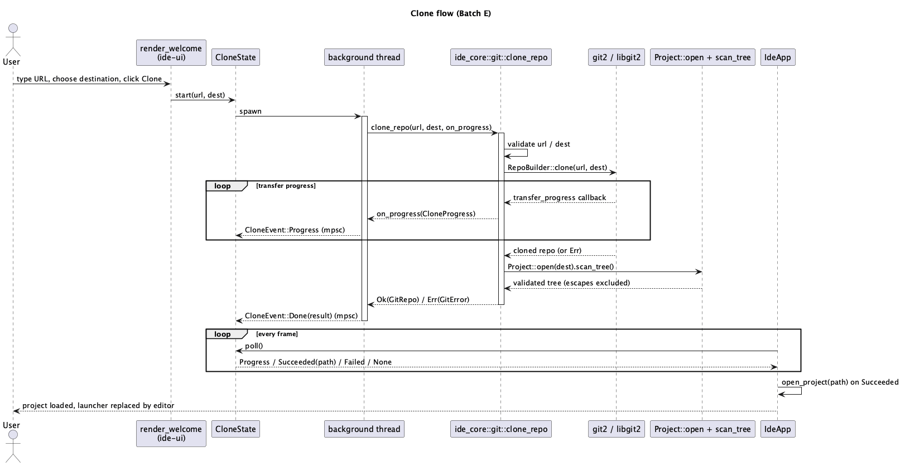

# Git clone + compact launcher (Batch E)

## 1. Purpose

Two related pieces of "post-B2c polish" item #7:

1. **`ide-core` git clone** — `crates/core/src/git/mod.rs` currently only
   reads an already-on-disk repository (`GitRepo::open`, diffs, commit
   graph, conflict resolution). There is no way to get a repository onto
   disk in the first place other than the user running `git clone`
   themselves outside the IDE. This adds that: a `clone_repo` entry point
   that clones a remote URL to a local destination, with progress
   reporting suitable for a UI to show while the (potentially slow)
   network operation runs.
2. **Compact launcher** — `render_welcome` (`crates/ui/src/app/render.rs`)
   currently shows Open/Create Project as a left-aligned heading plus two
   buttons stretched across the full window. This adds a third option
   (Clone Repository) and restructures the screen into a small, centered
   card instead of full-width content — "compact" describes the launcher
   screen's own layout, not the OS window (see §3.5 for why window sizing
   itself is out of scope here).

This is the git-remote surface CLAUDE.md's dev-chain role-1 description
and security-sensitive-paths list already anticipate under
`crates/core/src/git/**`: credential handling, TLS/host-key verification,
and clone-target-escape validation. `hacker` runs on this role before
merge.

## 2. Interface / API

### 2.1 `crates/core/src/git/mod.rs` (new)

```rust
/// Snapshot of libgit2's `git2::Progress` at one point during a clone,
/// re-exposed as plain fields so `ide-ui` doesn't need a `git2` dependency
/// of its own just to read progress out of a callback.
#[derive(Debug, Clone, Copy, PartialEq, Eq, Default)]
pub struct CloneProgress {
    pub received_objects: usize,
    pub total_objects: usize,
    pub indexed_objects: usize,
    pub received_deltas: usize,
    pub total_deltas: usize,
    pub received_bytes: usize,
}

/// Clones `url` into `dest`, calling `on_progress` zero or more times
/// during the transfer (from whatever thread calls this function — see
/// §3.1). Blocking, synchronous, like every other `GitRepo`/`git`-module
/// function; `ide-ui` is responsible for calling this off the UI thread
/// (§3.4), matching this crate's existing "ide-core stays a plain
/// synchronous library, ide-ui decides threading" rule.
pub fn clone_repo(
    url: &str,
    dest: impl AsRef<Path>,
    on_progress: impl FnMut(CloneProgress),
) -> Result<GitRepo, GitError>;
```

`GitError` gains three variants (existing variants — `NotARepo`, `Git2`,
`Io`, `PathEscapesRepo` — are unchanged):

```rust
#[error("repository URL is empty")]
EmptyUrl,
#[error("destination already exists and is not empty: {0}")]
DestinationNotEmpty(PathBuf),
#[error("cloned repository failed its own project-root validation: {0}")]
ClonedContentInvalid(PathBuf),
```

### 2.2 `crates/ui/src/clone_panel.rs` (new)

```rust
#[derive(Debug, Clone, Copy, PartialEq, Default)]
pub struct CloneProgress {
    pub received_objects: usize,
    pub total_objects: usize,
}

#[derive(Default)]
pub struct CloneState {
    pub url: String,
    pub destination: Option<PathBuf>,
    pub progress: Option<CloneProgress>,
    pub error: Option<String>,
    rx: Option<Receiver<CloneEvent>>,
}

impl CloneState {
    /// No-op if a clone is already in flight (`self.progress.is_some()`
    /// or `self.rx.is_some()`) -- v1 runs at most one at a time, same
    /// convention `CargoPanel::run` already uses.
    pub fn start(&mut self, url: String, dest: PathBuf);

    /// Call once per frame. `Some(_)` means `progress`/`error` changed or
    /// the clone completed (caller should request a repaint) -- richer
    /// than the crate's usual bare-`bool` `.poll()` convention because the
    /// caller needs to know *which* kind of change happened (a mid-flight
    /// progress tick vs. the one frame the clone actually finishes) to
    /// react correctly; `None` means nothing changed this frame, same as
    /// `false` would in the bare-`bool` convention.
    pub fn poll(&mut self) -> Option<ClonePollResult>;
}

/// What `poll` hands back the one frame a clone finishes, so `IdeApp` can
/// react (open the freshly cloned project) without `CloneState` itself
/// knowing about `IdeApp`/`egui::Context`.
pub enum ClonePollResult {
    Progress,
    Succeeded(PathBuf),
    Failed,
}

impl From<ide_core::git::CloneProgress> for CloneProgress {
    fn from(p: ide_core::git::CloneProgress) -> Self {
        Self { received_objects: p.received_objects, total_objects: p.total_objects }
    }
}
```

**Example:**

```rust
// inside render_welcome, on the Clone button click:
app.clone.start(url_field.clone(), destination.clone());

// once per frame, in app/render.rs's poll block:
if let Some(result) = app.clone.poll() {
    match result {
        ClonePollResult::Succeeded(path) => app.open_project(&path, &ctx),
        ClonePollResult::Progress | ClonePollResult::Failed => {}
    }
    ctx.request_repaint();
}
```

### 2.3 `crates/ui/src/app.rs` / `app/render.rs`

- `IdeApp` gains `clone: clone_panel::CloneState` (default).
- The per-frame poll block in `app/render.rs` (next to
  `self.lsp.poll()`/`self.cargo_panel.poll()`/`self.poll_menu_events(&ctx)`)
  gains:
  ```rust
  match self.clone.poll() {
      Some(ClonePollResult::Succeeded(path)) => {
          self.open_project(&path, &ctx);
          ctx.request_repaint();
      }
      Some(_) => ctx.request_repaint(),
      None => {}
  }
  ```
- `render_welcome` (§3.5) gains a "Clone Repository" section calling
  `self.clone.start(url, dest)`.

## 3. Behaviour

### 3.1 Threading model

`clone_repo` itself spawns no thread — it's a plain blocking call, same as
every existing `GitRepo` method. `CloneState::start` is what spawns the
background thread (mirroring `CargoPanel::run`/`ClaudeTerminal`'s existing
`std::thread::spawn` + `mpsc::channel` pattern exactly): the spawned
closure calls `ide_core::git::clone_repo(&url, &dest, |p| { let _ =
tx.send(CloneEvent::Progress(p.into())); })`, then sends
`CloneEvent::Done(result)` once `clone_repo` returns. `CloneState::poll`
drains the channel with `try_recv()` in a loop each frame, same as
`CargoPanel::poll`.

### 3.2 URL and destination validation

- Empty `url` (after trim) → `GitError::EmptyUrl`, no clone attempted, no
  network call made.
- If `dest` already exists and `fs::read_dir(dest)` yields any entry →
  `GitError::DestinationNotEmpty`, no clone attempted. If `dest` doesn't
  exist, `clone_repo` lets `git2::build::RepoBuilder::clone` create it
  (matches plain `git clone url dest` behavior — no separate `mkdir` step
  needed).
- No scheme allowlist/denylist on `url` in v1 — `https://`, `ssh://`,
  `git://`, and `file://` all pass through to libgit2 unchanged, same as
  the `git` CLI itself accepts. Credential handling (§3.3) is what keeps
  this safe, not URL filtering.

### 3.3 Credentials

`clone_repo` sets a `git2::RemoteCallbacks::credentials` callback with the
signature `Fn(&str, Option<&str>, CredentialType) -> Result<Cred, Error>`
— `git2` calls it (possibly more than once, if a first attempt is
rejected) with an `allowed_types` bitflag telling the callback which
credential *kinds* the server will actually accept for this attempt. The
callback branches on that flag rather than trying a fixed sequence
regardless of what's being asked for:

- `allowed_types.contains(CredentialType::SSH_KEY)` →
  `git2::Cred::ssh_key_from_agent(username)`, if an SSH agent is running.
- `allowed_types.contains(CredentialType::USER_PASS_PLAINTEXT)` →
  `git2::Cred::credential_helper(&git2::Config::open_default()?, url,
  username)` — reads whatever credential helper the user's own `git`
  installation already has configured (macOS Keychain via
  `osxkeychain`, `libsecret`, a plaintext `.git-credentials` file if
  *they* set that up, etc.).
- Neither flag set, or the matching branch itself errors → propagate the
  error from the callback (`git2::Error::from_str(...)` for "no usable
  credential for the types this server accepts").

This matches what a plain `git clone` on the user's machine would already
have configured — it doesn't add any new credential source, only reads
from what the OS/git installation already has. If every attempt is
rejected, the clone fails with `GitError::Git2` wrapping whatever
libgit2/the remote reported (e.g. "authentication required", "could not
read Username").
**No IDE-side credential prompt, storage, or caching** — same decision
already made for the Claude terminal tabs (`docs/features/claude-terminal.md`):
each operation inherits whatever ambient auth is already on the machine,
the IDE never manages credentials itself. The `url` string itself is
never logged (it may legitimately contain a username, e.g.
`https://user@host/repo.git`, though never a password — git rejects
embedding a plaintext password in a URL passed this way in most modern
server configs, and this code doesn't encourage it either).

### 3.4 TLS / SSH host-key verification

`RemoteCallbacks::certificate_check` is **never set**. Leaving it unset
means libgit2 performs its own default certificate verification (system
TLS trust store for HTTPS) and default host-key checking against
`~/.ssh/known_hosts` for SSH, exactly as a plain `git clone` from the
terminal would. This is a hard invariant (§4) — a future change to "add a
callback to work around a corporate MITM proxy" or similar must not
silently disable verification; it needs its own explicit, user-visible
opt-in if ever added, not a default.

### 3.5 Clone-target escape

`RepoBuilder::clone(url, dest)` always writes into exactly the `dest`
path this code passes it — libgit2 doesn't choose its own destination, so
the *repository root* can't itself land outside `dest`. The residual risk
CLAUDE.md's list is pointing at is a maliciously crafted tree with a path
component like `../../etc/passwd` for a blob entry, which a checkout
routine could mishandle. Two layers of mitigation, not one:

1. **Trust libgit2's own checkout-path sanitization.** This is the
   correct primary trust boundary — libgit2 is an actively maintained C
   library (this project vendors it via `git2`'s `vendored-libgit2`
   feature, so the version is whatever `git2 = "0.21.0"` pins, well past
   the CVE-2018-11235 path-traversal class of fix) used by tools like
   GitHub Desktop. This module does not re-implement tree/path parsing
   itself.
2. **Reuse `ide_core::project::Project::open`, don't invent new
   path-escape logic.** After a successful clone, `clone_repo` calls
   `Project::open(dest)` (canonicalizes `dest`, same as every other
   project open) and then `.scan_tree()` once — the exact same
   symlink-escape detection `scan_tree` already has tests for
   (`scan_tree_excludes_symlink_escaping_root` et al. in
   `crates/core/src/project.rs`) runs over the freshly checked-out tree
   for free. If `Project::open` itself fails (e.g. `dest` somehow isn't
   canonicalizable — shouldn't happen for a directory `clone_repo` itself
   just populated, but treated as a hard error rather than assumed
   impossible), `clone_repo` returns `GitError::ClonedContentInvalid`
   instead of handing back a `GitRepo` for a directory the rest of the
   IDE might not be able to safely treat as a project root.

`scan_tree`'s own escape handling is *exclusion*, not rejection (an
escaping symlink is silently left out of the returned tree, not treated
as a hard error) — that's the right behavior for a normal project open,
and it's still the right behavior here: a cloned repo containing a
symlink pointing outside itself is unusual but not proof of a checkout
bug, so `clone_repo` doesn't fail the whole clone over it, just relies on
`scan_tree`'s existing exclusion so the IDE's tree view never shows or
opens anything outside `dest`.

Submodules are **not** auto-initialized (`RepoBuilder`'s default already
doesn't recurse into them — no extra code needed). This is a deliberate
v1 scope cut, not an oversight: auto-cloning submodules would mean
recursively repeating this entire trust exercise against URLs the
*remote itself* supplies (a `.gitmodules` file), which is a meaningfully
different and larger attack surface than a single user-supplied URL.

### 3.6 Compact launcher (`render_welcome`)

`render_welcome` is restructured to lay its content out inside
`ui.vertical_centered(|ui| { ui.set_max_width(420.0); ... })` instead of
the current left-aligned, window-width layout — Open Project / Create
Project / Clone Repository each get their own row inside that fixed-width
column. The Clone Repository row: a single-line URL text field, a
"Choose destination…" button (`rfd::FileDialog::new().pick_folder()`,
same picker `render_welcome` already uses for Create Project's parent
directory), and a "Clone" button, disabled while `self.clone.progress` is
`Some` or no destination has been chosen yet. While a clone is running,
show `progress.received_objects`/`total_objects` as text (a determinate
`egui::ProgressBar` once `total_objects > 0`, indeterminate/spinner
before the first progress callback fires — libgit2 doesn't always know
`total_objects` until partway through). On `ClonePollResult::Succeeded`,
`IdeApp` calls the existing `open_project` (§2.3) — no new
project-loading code path.

**Not in scope: the OS window's size.** The polish-batch plan's original
framing suggested giving the no-project launcher an explicit small
`eframe::NativeOptions.viewport` size. This doc deliberately doesn't do
that: `eframe`'s `persistence` feature (already enabled in
`crates/ui/Cargo.toml`) restores the last window size/position from
storage, and that restoration happens as part of `eframe::run_native`
itself, before `IdeApp::new`'s creation closure runs — there's no hook
available at the point `NativeOptions` is constructed in `main.rs` to
know whether a project will end up being restored, so any explicit
override there would either fight the persisted size on every launch
after the first, or require duplicating `eframe`'s own storage-reading
logic just to peek at it early. The compact **layout** (this section)
delivers the same practical win — a small, centered launcher regardless
of window size — without that conflict. Flagged as a considered scope cut,
not a missed requirement.

## 4. Constraints & invariants

- `clone_repo` never sets `RemoteCallbacks::certificate_check` — TLS/SSH
  verification must always run at libgit2's own default. Any future code
  path that needs to disable it (corporate MITM proxy, self-signed cert)
  must be an explicit, separately-reviewed, user-facing opt-in, never a
  default or an implicit fallback on verification failure.
- No credential is ever logged, written to a new file this code creates,
  or cached in memory beyond the single `clone_repo` call — `clone_repo`
  only ever *reads* from the OS's existing credential helper/SSH agent,
  never writes to one.
- `clone_repo` returns a `GitRepo` (or an error) whose `workdir()` has
  already passed `Project::open(dest).scan_tree()` — nothing downstream
  ever receives a path from this function that hasn't been through that
  validation.
- At most one clone in flight at a time per `CloneState` (matches
  `CargoPanel`'s existing single-in-flight convention) — `start` is a
  no-op if one is already running.
- `CloneState::poll` never blocks — it only drains what's already in the
  channel via `try_recv()`.

## 5. Examples

**`ide-core`, direct use:**

```rust
use ide_core::git::{clone_repo, CloneProgress};

let repo = clone_repo(
    "https://github.com/rust-lang/log.git",
    "/tmp/cloned-log",
    |p: CloneProgress| {
        println!("{}/{} objects", p.received_objects, p.total_objects);
    },
)?;
assert!(repo.workdir().ends_with("cloned-log"));
```

**Destination not empty:**

```rust
std::fs::create_dir_all("/tmp/occupied")?;
std::fs::write("/tmp/occupied/existing.txt", "hi")?;
let err = clone_repo("https://example.com/repo.git", "/tmp/occupied", |_| {});
assert!(matches!(err, Err(GitError::DestinationNotEmpty(_))));
```

**`ide-ui`, launcher flow:** user types a URL, clicks "Choose
destination…", picks an empty folder, clicks "Clone" → `CloneState::start`
spawns the background thread → each frame, `CloneState::poll()` drains
progress → progress bar fills as `received_objects` climbs toward
`total_objects` → on success, `IdeApp::open_project` runs automatically
and the launcher screen is replaced by the normal editor/tree layout for
the newly cloned project.

## 6. Dependencies & integration points

No new dependency — `git2` is already a dependency of `crates/core`
(`crates/core/Cargo.toml`), and `rfd` is already a dependency of
`crates/ui`. `clone_repo` is built entirely on `git2::build::RepoBuilder`,
`git2::FetchOptions`, and `git2::RemoteCallbacks`, the same crate every
other `git`-module function already uses.

**Feature-set change required.** The existing `git2` line —
```toml
git2 = { version = "0.21.0", default-features = false, features = ["vendored-libgit2"] }
```
— only enables local repository access (open/diff/commit-graph/conflict
resolution never needed a network transport). `git2`'s `default = []`, and
`Cred::credential_helper` is itself gated `#[cfg(feature = "cred")]` — so
as configured today, this line neither compiles §3.3's credential-helper
call nor registers an `https://`/`ssh://` transport at all. This role
must change it to:
```toml
git2 = { version = "0.21.0", default-features = false, features = ["vendored-libgit2", "https", "ssh", "vendored-openssl"] }
```
`vendored-openssl` keeps the HTTPS transport self-contained (no system
OpenSSL dev headers required) — it needs a C compiler at build time, but
`vendored-libgit2` already requires one, so this adds no new toolchain
dependency. Not a new entry in CLAUDE.md's dependency-approval table
(`git2` is already approved) — just a feature-set expansion, worth this
explicit callout so it isn't discovered mid-implementation via a compile
error or a runtime "unsupported URL protocol".

Integration points: `ide_core::project::Project::open`/`scan_tree` (§3.5,
reused rather than duplicated), `ide-ui`'s existing `open_project`
(§2.3/§3.6, reused rather than a new project-loading path), and the
established background-thread-plus-`mpsc`-channel-plus-per-frame-`poll()`
convention already used by `CargoPanel`, `ClaudeTerminal`, and (this
session) the async tree scan.

Security-sensitive: yes — `crates/core/src/git/**` is unconditionally on
CLAUDE.md's list. A `hacker` pass runs on this role before merge, focused
on: forged/self-signed TLS certs and spoofed SSH host keys (does
verification actually reject them, live, via a local MITM proxy or fake
server — not just "the code doesn't call `certificate_check`"),
credential-helper output never logged, a crafted malicious repository
(path-traversal tree entries, a `.git` entry as a tracked path, an
enormous object graph for a resource-exhaustion attempt) against a real
local git server the hacker sets up, and destination-escape attempts
against `dest`.

## 7. Diagram



## Revision notes

1. §6 gained a "Feature-set change required" callout: checking the real
   `git2` 0.21.0 and `libgit2-sys` 0.18.7 `Cargo.toml`s during doc review
   showed the project's current `git2` line (`default-features = false,
   features = ["vendored-libgit2"]`) doesn't enable HTTPS/SSH transport or
   the `cred` feature `Cred::credential_helper` needs — `clone_repo`
   wouldn't compile/function against a real remote without also enabling
   `https`, `ssh`, `vendored-openssl`. This was invisible from `git/mod.rs`'s
   existing code since every current function is local-only.
2. §2.2's `CloneState::poll` doc comment was corrected — it claimed to
   return `bool` ("same shape... `.poll()`") while the signature declares
   `Option<ClonePollResult>`; reworded to describe the actual richer
   return and why it deviates from the crate's usual bare-`bool` poll
   convention. Also added a `From<ide_core::git::CloneProgress> for
   clone_panel::CloneProgress` impl and a code example for `CloneState`
   (previously only described in prose).
3. §3.3 rewritten: the original wording described a fixed
   try-SSH-then-try-credential-helper sequence; `git2::RemoteCallbacks::
   credentials`'s real contract passes an `allowed_types` bitflag telling
   the callback which credential kinds the server will accept for this
   attempt, and the callback should branch on that rather than trying a
   fixed order regardless of what's being asked for.
