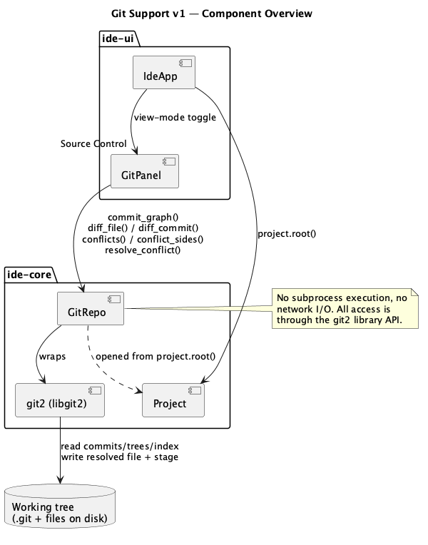
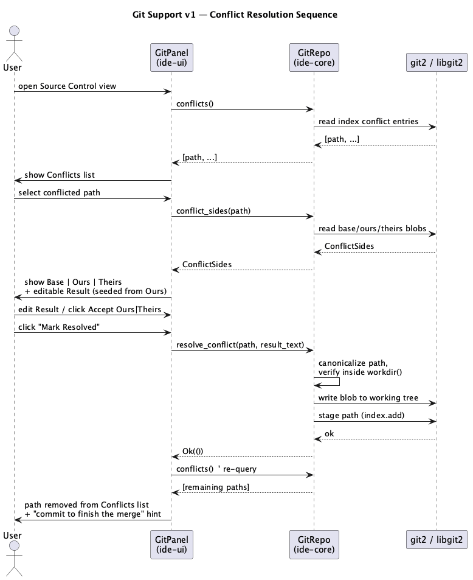
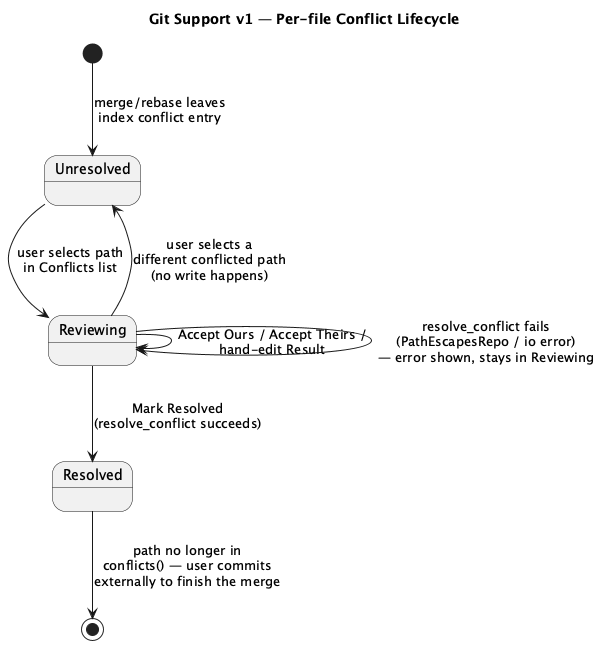

# Git Support v1

## 1. Purpose

Adds source-control awareness to the IDE, built on top of the editor
shell (`docs/features/editor-shell.md`): viewing changes as a side-by-side
diff, resolving three-way merge conflicts, and visualizing the commit
history as a graph.

v1 deliberately scopes to *local, read-mostly* git operations plus the
one write path needed to make conflict resolution useful:

- Detecting whether the open project is (inside) a git repository.
- Side-by-side diff of a file's working-tree changes against `HEAD`, and
  of any commit's changes against its first parent.
- A commit graph (DAG) view: one node per commit, edges to parents,
  scrollable, selecting a commit shows its diff.
- Three-way conflict resolution: for a file with an unresolved merge
  conflict, show base/ours/theirs side by side, let the user pick a
  side or hand-edit a result, and stage the resolution.

**Explicitly deferred** to a future feature (not implemented in v1):
staging/unstaging arbitrary hunks, creating commits, branch
create/switch/delete, and any operation that talks to a remote
(`fetch`/`pull`/`push`/`clone`) — v1 only ever operates on a repository
that already exists on disk. No network I/O anywhere in this feature.

## 2. Interface / API

### 2.1 `ide-core`

```rust
// crates/core/src/git/mod.rs
pub struct GitRepo { /* wraps a git2::Repository; root: PathBuf (working dir) */ }

#[derive(Debug, thiserror::Error)]
pub enum GitError {
    #[error("not a git repository: {0}")]
    NotARepo(std::path::PathBuf),
    #[error("git error: {0}")]
    Git2(#[from] git2::Error),
    #[error("io error: {0}")]
    Io(#[from] std::io::Error),
    #[error("path escapes repository working directory: {0}")]
    PathEscapesRepo(std::path::PathBuf),
}

// Every path parameter/return value below is repository-relative (POSIX-
// style separators, relative to `workdir()`) — the same convention git
// itself uses for index entries and diff paths. Never absolute. Callers
// with an absolute path (e.g. `ide-ui` holding `Buffer::path()`) must
// strip `workdir()` as a prefix first — see §3's UI-integration note.
// This matters beyond convenience: `resolve_conflict`'s escape check
// works by joining the given path onto `workdir()`, and `PathBuf::join`
// silently discards the base and keeps only the argument when the
// argument is itself absolute, so treating these as absolute anywhere
// would quietly defeat that check.
impl GitRepo {
    /// Discovers a repository at or above `project_root` (matching normal
    /// git behavior for a project nested in a larger repo) and opens it.
    /// Errors with `NotARepo` if none is found.
    pub fn open(project_root: impl AsRef<std::path::Path>) -> Result<Self, GitError>;

    /// True if `open` would succeed, without the cost of fully opening it.
    pub fn is_repo(project_root: impl AsRef<std::path::Path>) -> bool;

    /// The repository's working directory (canonicalized, absolute). The
    /// one absolute path in this API — every other method's paths are
    /// relative to this.
    pub fn workdir(&self) -> &std::path::Path;

    /// Diff of `path` (repo-relative)'s working-tree content against the
    /// `HEAD` blob for that path. `Ok(None)` if the file is unchanged, if
    /// either side is binary (binary files are not diffed in v1 — no
    /// byte-level fallback, just treated as "no diff to show"), or if the
    /// file is untracked (no `HEAD` blob and never staged) — matches plain
    /// `git diff HEAD -- path` semantics, where an untracked file doesn't
    /// appear either.
    pub fn diff_file(&self, path: impl AsRef<std::path::Path>) -> Result<Option<FileDiff>, GitError>;

    /// Diff of every file `commit_id` changed, against its first parent
    /// (or against an empty tree for a root commit). Binary files are
    /// omitted from the result (same rule as `diff_file`). Each `FileDiff`
    /// is capped at `MAX_DIFF_LINES` lines (see the constant's doc); a
    /// diff exceeding that is truncated with a trailing marker rather than
    /// fully materialized, so one huge generated/vendored file can't blow
    /// up memory or per-frame render cost. The result `Vec` itself is
    /// capped at `MAX_DIFF_FILES` entries — a commit touching an unusually
    /// large number of files (crafted, or an accidental bulk vendored
    /// import) is silently truncated the same way `commit_graph`'s `limit`
    /// silently stops at that many nodes, with no separate truncation flag.
    pub fn diff_commit(&self, commit_id: &str) -> Result<Vec<FileDiff>, GitError>;

    /// Commit graph reachable from `HEAD`, newest first, capped at
    /// `limit` commits. `CommitNode::parents` gives the edges.
    pub fn commit_graph(&self, limit: usize) -> Result<Vec<CommitNode>, GitError>;

    /// Paths (repo-relative) with an unresolved merge conflict in the
    /// index. Empty when there's no merge in progress.
    pub fn conflicts(&self) -> Result<Vec<std::path::PathBuf>, GitError>;

    /// The base/ours/theirs content for a conflicted path (repo-relative).
    /// A side is `None` if that side deleted the file. Errors with
    /// `GitError::Git2` if any present side's blob isn't valid UTF-8 —
    /// like diffing, v1 only supports resolving text-file conflicts; a
    /// binary conflict must be resolved outside the app (`git checkout
    /// --ours/--theirs` + `git add`, or equivalent) and will simply keep
    /// showing up in `conflicts()` until then.
    pub fn conflict_sides(&self, path: impl AsRef<std::path::Path>) -> Result<ConflictSides, GitError>;

    /// Writes `resolved_text` to `path` (repo-relative) in the working
    /// tree and stages it (`git add`-equivalent), clearing the conflict
    /// for that path. Errors with `PathEscapesRepo` if `path`, resolved
    /// against `workdir()`, doesn't stay inside it. Writes via a sibling
    /// temp file plus an atomic rename over the target rather than an
    /// in-place write, so the write itself can't be redirected through a
    /// symlink placed at the target path after the escape check runs (see
    /// §4). Does not create a commit — v1 leaves that to the user (see §1).
    pub fn resolve_conflict(
        &self,
        path: impl AsRef<std::path::Path>,
        resolved_text: &str,
    ) -> Result<(), GitError>;
}

/// Per-file line cap for `diff_file`/`diff_commit` output (context +
/// added + removed lines combined). Chosen generously above what a human
/// reviews in the diff pane in one sitting, while still bounding worst-
/// case memory/render cost for a pathological huge-file diff.
pub const MAX_DIFF_LINES: usize = 20_000;

/// Cap on the number of `FileDiff` entries `diff_commit` returns for a
/// single commit — see `diff_commit`'s doc.
pub const MAX_DIFF_FILES: usize = 2_000;

pub struct FileDiff {
    pub old_path: Option<std::path::PathBuf>,
    pub new_path: Option<std::path::PathBuf>,
    pub hunks: Vec<DiffHunk>,
    /// `true` if this diff was cut off at `MAX_DIFF_LINES` — the UI's cue
    /// to show the "diff truncated" trailing note (§3).
    pub truncated: bool,
}

pub struct DiffHunk {
    pub old_start: u32,
    pub new_start: u32,
    pub lines: Vec<DiffLine>,
}

#[derive(Debug, Clone, PartialEq, Eq)]
pub enum DiffLine {
    Context(String),
    Added(String),
    Removed(String),
}

pub struct CommitNode {
    pub id: String,       // full hex OID, stable identity for selection
    pub short_id: String, // for display
    pub summary: String,  // first line of the commit message
    pub author: String,
    /// Unix seconds, author time (matches `git log`'s default).
    pub timestamp: i64,
    pub parents: Vec<String>, // full hex OIDs, graph edges
}

pub struct ConflictSides {
    pub base: Option<String>,
    pub ours: Option<String>,
    pub theirs: Option<String>,
}
```

### 2.2 `ide-ui`

Not a library API — behavior specified in §3. Public-ish surface worth
naming for review purposes:

```rust
// crates/ui/src/git_panel.rs
struct GitPanel {
    repo: Option<GitRepo>,
    graph: Vec<CommitNode>,
    selected_commit: Option<String>,
    diff: Option<Vec<FileDiff>>,     // diff currently shown (commit or working-tree)
    conflicts: Vec<PathBuf>,
    active_conflict: Option<ConflictResolutionState>,
}

struct ConflictResolutionState {
    path: PathBuf,
    sides: ConflictSides,
    /// Scratch buffer the user edits; pre-seeded from `sides.ours`.
    result: String,
}
```

`IdeApp` gains a view-mode toggle in the toolbar ("Editor" / "Source
Control"). In Source Control mode, the center panel is replaced by
`GitPanel`'s rendering; the left directory tree and right Claude panel are
unaffected. If the open project isn't a git repository, Source Control
mode shows a plain "Not a git repository" message instead of the graph/
diff UI.

## 3. Behaviour

### Repository detection

- On project open/create (existing `IdeApp::load_project` flow), also
  attempt `GitRepo::open(project.root())`. Failure (not a repo) is not an
  error shown to the user — it just means Source Control mode shows the
  "not a repository" message. Re-attempted on manual "Refresh" (reuses the
  existing tree-refresh action) so a `git init` run outside the app is
  picked up without restarting.

### Commit graph

- Source Control mode's graph pane lists up to a fixed cap (e.g. 500)
  commits reachable from `HEAD`, newest first, each rendered as a node
  with an edge to each parent (a merge commit has two edges; a root commit
  has none). Nodes are laid out in columns ("lanes") so parallel branches
  don't overlap — lane assignment is a rendering-layer concern, not part
  of `CommitNode` itself (the data model only carries parent OIDs; the UI
  computes lanes from that).
- Clicking a commit node selects it, highlights it, and loads its diff
  (`diff_commit`) into the diff pane.
- The graph does not auto-refresh on external repo changes in v1 (no
  filesystem watcher) — same manual-refresh model as the directory tree.

### Side-by-side diff

- The diff pane renders each `FileDiff` as two scrollable columns (old |
  new) kept in sync (scrolling one scrolls the other), one row per line:
  `Context` lines appear unchanged in both columns; `Removed` lines appear
  only in the old column (highlighted); `Added` lines appear only in the
  new column (highlighted). This is read-only — v1's diff pane doesn't
  support editing (edit the file in the Editor view instead).
- With no commit selected, the diff pane shows the active editor tab's
  file's working-tree diff (`diff_file`) if that file has a path and is
  inside the open repo; otherwise it's empty with a placeholder message.
  Since `Buffer::path()` is absolute (per the editor shell) and
  `diff_file` takes a repo-relative path (§2.1), the UI strips
  `repo.workdir()` as a prefix before calling it; a path that doesn't
  have `workdir()` as a prefix is treated the same as "outside the open
  repo" (placeholder message, no `diff_file` call).
- A `FileDiff` truncated at `MAX_DIFF_LINES` (§2.1) shows its available
  hunks normally, with a trailing "diff truncated — file too large to
  show in full" note instead of the remaining lines.

### Conflict resolution

- If `conflicts()` is non-empty, Source Control mode shows a "Conflicts"
  list above the graph. Selecting a conflicted path calls
  `conflict_sides()` and opens a three-way panel: **Base | Ours | Theirs**
  columns (read-only, same rendering as the diff pane's columns) plus an
  editable **Result** area below, pre-filled with the "ours" content.
- Two convenience buttons, **Accept Ours** / **Accept Theirs**, overwrite
  the Result area with that side's content (or clear it, if that side is
  `None` — a delete). The user can also hand-edit Result directly.
- **Mark Resolved** calls `resolve_conflict(path, result_text)`, which
  writes the file and stages it. The path then drops out of `conflicts()`
  on next read; the UI re-queries `conflicts()` after a successful
  resolve and updates the list. No commit is created (§1) — the app shows
  a one-line hint ("commit to finish the merge") rather than attempting it.
- If `conflict_sides()` errors because a side isn't valid UTF-8 (§2.1),
  the Conflicts list still shows the path but selecting it shows a
  "binary conflict — resolve outside the app" message instead of the
  three-way panel; no Result/Mark-Resolved UI is offered for it.

## 4. Constraints & invariants

- No network I/O: `GitRepo` never calls anything that would contact a
  remote (no `fetch`/`push`/`pull`/`clone` methods exist in v1's API).
- `GitRepo::open` discovers upward from `project_root` (matching normal
  git behavior for a nested project) but `workdir()` is always the
  discovered repository's own working directory, not `project_root`
  verbatim — callers that need to check "is this path inside the repo"
  must compare against `workdir()`, not the original `project_root`.
- `resolve_conflict` only ever writes inside `workdir()`: the target path
  is canonicalized and checked to stay within it before any write,
  mirroring `Project`'s existing symlink-escape protection (see
  `docs/features/editor-shell.md` §4). A path from `conflicts()` is
  already repo-relative by construction, but this check stays defense in
  depth against a crafted/unusual index entry. The write itself goes
  through a sibling temp file plus `rename` rather than an in-place
  `fs::write`, so a symlink introduced at the target path in the (narrow)
  window between the check and the write gets replaced by `rename`
  instead of followed — closing a check-then-write race a direct write
  would leave open. The temp file's name is generated by the `tempfile`
  crate, not a hand-rolled scheme — a pid+timestamp approach was tried
  first and a live concurrency test showed it can collide under fast
  concurrent calls in the same process, which silently cross-contaminated
  two different target files' content.
- `GitRepo` is not safe to call concurrently from multiple threads against
  the same on-disk repository: `git2::Repository`'s own index/object-
  database caching isn't designed for that, and `resolve_conflict`'s
  `index.write()` can lose a concurrent thread's staged addition (it's a
  read-then-write on the index, not an atomic update). The UI is expected
  to serialize calls into a given `GitRepo`, which matches v1's UI design
  anyway (§3: one conflict resolved at a time via a single button click).
- `conflicts()`/`conflict_sides()`/`diff_file()`/`diff_commit()`/
  `commit_graph()` only ever read repository data through `git2` — never
  by shelling out, so there's no command-injection surface in this
  feature (see `CLAUDE.md`'s declared security-sensitive paths for why
  this module is still reviewed: it parses potentially-untrusted
  repository data and writes resolved content back to disk).
- The UI never constructs a filesystem path for `resolve_conflict` from
  anything other than an entry already returned by `conflicts()` — same
  path-provenance discipline as the editor shell's `Buffer::open`/
  `save_as` (never from arbitrary typed/pasted text).
- `commit_graph`'s cost is bounded by its `limit` parameter (capped in the
  UI at a fixed constant — see §3) regardless of how large the actual
  repository history is; it never walks the entire history unconditionally.
- Binary files are not diffed in v1: `diff_file`/`diff_commit` skip hunks
  for a blob `git2` reports as binary, rather than attempting a byte-level
  text diff on non-text content. `conflict_sides` similarly only supports
  UTF-8 text conflicts (§2.1) — v1 has no binary-conflict resolution UI.
- Every `GitRepo` method's path parameters and return values are
  repository-relative, never absolute (§2.1) — this is load-bearing for
  `resolve_conflict`'s escape check, not just a naming convention.
- `diff_file`/`diff_commit` cap each `FileDiff` at `MAX_DIFF_LINES` (§2.1)
  so a single pathologically large file can't unboundedly grow memory use
  or per-frame render cost the way `commit_graph`'s `limit` already bounds
  history size.

## 5. Examples

**View a commit's diff:**

```rust
let repo = GitRepo::open(project.root())?;
let graph = repo.commit_graph(500)?;
let first = &graph[0];
let diffs = repo.diff_commit(&first.id)?;
assert!(!diffs.is_empty() || graph.len() == 1); // root commit may be empty
```

**Resolve a conflict, accepting "ours":**

```rust
let repo = GitRepo::open(project.root())?;
let conflicted = repo.conflicts()?;
let path = &conflicted[0];
let sides = repo.conflict_sides(path)?;
let resolved = sides.ours.clone().unwrap_or_default();
repo.resolve_conflict(path, &resolved)?;
assert!(!repo.conflicts()?.contains(path));
```

**Working-tree diff for the active editor tab:**

```rust
let repo = GitRepo::open(project.root())?;
if let Some(diff) = repo.diff_file("src/main.rs")? {
    // render diff.hunks side-by-side
}
```

## 6. Dependencies & integration points

- `git2` (libgit2 Rust binding) and `tempfile` (unique temp-file creation
  for `resolve_conflict`'s write path) — new dependencies in `ide-core`.
  No new dependency in `ide-ui` beyond what `editor-shell` already added.
- Builds on `ide-core`'s existing `Project` (repository discovery starts
  from `project.root()`) and on `ide-ui`'s existing `IdeApp` toolbar/
  view-mode pattern (theme toggle already established one).
- Does not touch `ide-lsp` — no language-server interaction in this
  feature.
- Requires `libgit2`'s own build-time dependencies to be satisfiable by
  `cargo build` (the `git2` crate vendors/builds libgit2 by default) —
  no separate system git installation is required at runtime, unlike the
  Claude panel's dependency on an externally-installed `claude` CLI.

## 7. Diagrams

**Component overview:**



**Conflict resolution sequence:**



**Conflict lifecycle:**



## Revision notes

- Clarified (§2.1) that every `GitRepo` path parameter/return value is
  repository-relative, never absolute, and explained why that's a
  security-relevant detail (not just style) for `resolve_conflict`'s
  escape check — `PathBuf::join` silently drops its base when given an
  absolute argument. Added the corresponding UI-side path-conversion step
  to §3 (strip `repo.workdir()` as a prefix from `Buffer::path()`).
- Added `MAX_DIFF_LINES` (§2.1) and a truncation-display rule (§3) so
  `diff_file`/`diff_commit` have the same kind of bound `commit_graph`'s
  `limit` and `Buffer::open`'s size limit already have elsewhere in this
  project, instead of being able to return an unbounded `FileDiff`.
- Scoped `conflict_sides` to UTF-8 text conflicts only, matching the
  existing binary-file exclusion for diffing, and added the "binary
  conflict — resolve outside the app" UI behavior (§3) for the case where
  it errors.
- Found during implementation: §3's truncation-display rule assumed the
  UI could tell a `FileDiff` was truncated, but the struct never actually
  exposed that. Added `FileDiff::truncated: bool` (§2.1).
- `rev` (code review round 1): flagged that `diff_file` returning `None`
  for untracked files was documented only in the implementation's own doc
  comment, not the approved doc. Added that behavior to `diff_file`'s
  doc (§2.1).
- `hacker` (adversarial pass, live-tested against `rev`-approved code):
  found `diff_commit` had no cap on the number of files it returns for one
  commit (unlike `MAX_DIFF_LINES` for per-file line count) — a 30k-file
  commit measured at ~2.3s and 30k in-memory `FileDiff`s in a live test.
  Added `MAX_DIFF_FILES` (§2.1) and documented `diff_commit`'s truncation
  at that cap. Also found (code-analysis) a TOCTOU window between
  `resolve_conflict`'s escape check and its write — closed by switching
  the write to a sibling-temp-file-plus-`rename` pattern (§2.1, §4), since
  `rename` replaces whatever's at the destination instead of following it.
- `hacker` (re-verification round, live-tested against the fixes above):
  a live concurrency test on the just-added temp-file-plus-rename fix
  found the temp filename (pid + `SystemTime::now()`) could collide under
  fast concurrent `resolve_conflict` calls in the same process, silently
  writing one target file's content onto a *different* target file while
  still returning `Ok(())` — a worse bug than the TOCTOU window it was
  fixing. Switched to `tempfile`'s collision-safe unique-name generation
  (§2.1, §4, §6) and added a documented concurrency constraint: `GitRepo`
  is not safe to call from multiple threads against the same repository
  (§4) — v1's UI never needed to anyway (one conflict resolved at a time).
