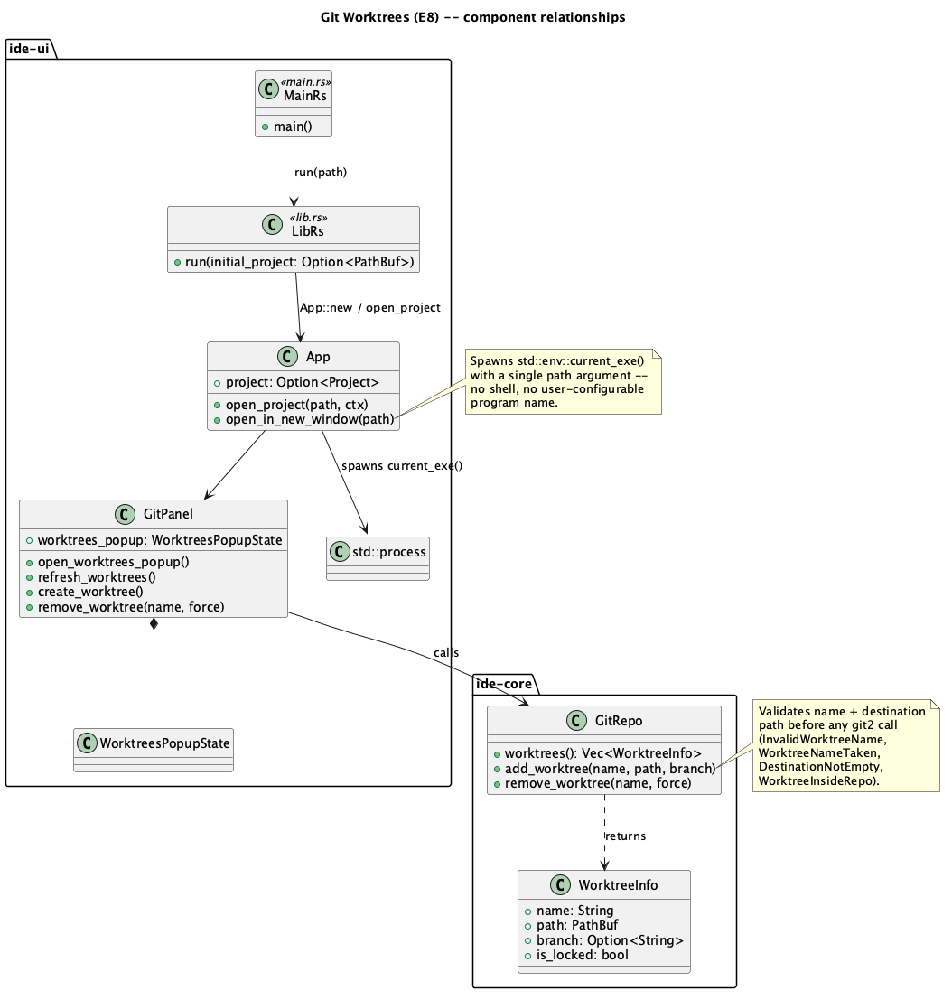

# Git Worktrees (E8)

## 1. Purpose

`git worktree` lets several branches be checked out into sibling
directories from one clone, so switching context doesn't mean stashing or
committing half-done work first. `ide-core`'s `GitRepo` wraps `git2`
already for everything else in the VCS track (branches, blame, commit/
staging) but exposes nothing of `git2`'s worktree API — this phase closes
that gap: list the repository's linked worktrees, add a new one (from an
existing branch or a fresh one), and remove one, plus a `GitPanel` UI for
all three from inside the running IDE.

The user's own framing of the request was "switch/add a worktree folder to
the project, or open the project in a new tab." Two scoping decisions
follow directly from the existing codebase, stated here rather than left
implicit:

- **Neither frontend has a multi-project-tab architecture.** `ide-ui`'s
  `App` holds exactly `project: Option<Project>` — one project per
  process, the same as `ide-tui`. "Open in a new tab" is therefore
  implemented as **open in a new OS window** (a second `ide` process
  pointed at the worktree's path), not a new tab strip entry. A real
  multi-project-tab rearchitecture is a much larger, separate decision
  this phase doesn't make.
- **"Switch ... to the project" is already fully served by the existing
  "Open Project" flow** (`App::open_project`, `crates/ui/src/app.rs`) —
  a worktree's directory is just a directory containing a `.git` file
  (not a full `.git` directory, but `Project::open`/`GitRepo::open`
  already handle that, since `git2::Repository::open` itself resolves the
  `gitdir:` pointer file worktrees use). No new core API is needed for
  "switch"; the worktrees popup's "Switch here" button simply calls the
  existing `open_project`.

This phase is **GUI-only** (`ide-ui`); `ide-tui` has no Git panel
worktree-adjacent UI to extend yet and the user's request centered on the
GUI's status-bar branch widget / Git panel workflow. A TUI port, if wanted
later, follows the established `T`-track process independently.

### 1.1 A pre-existing gap this closes incidentally

`crates/ui/src/main.rs`'s unified-binary CLI parsing accepts
`--tui [project-dir]` but the default (GUI) path takes **no** positional
argument at all — `ide_ui::run()` always either restores the last
remembered project (`shell-polish-and-last-project.md`) or falls back to
the welcome screen. "Open in a new window" needs to launch a second `ide`
process pointed at a specific worktree path, which means the GUI path
needs that same `[project-dir]` argument `--tui` already has. This phase
adds it as a direct dependency of "open in a new window," not as
unrelated scope creep — see §2.2.3.

Multiple windows also being a normal workflow now (rather than an
accident) exposes a second pre-existing gap worth closing in the same
phase: "restore last project" was built around exactly one remembered
path, shared across every running `ide` process via one `eframe::Storage`
file. Once two windows can be open at once, that single slot can't
represent "what was open" without one process's exit silently
overwriting the other's. §2.2.3 replaces it with a small registry of
currently-open project paths and, when a launch with no explicit path
finds more than one, asks the user to resolve it (restore all / pick one
/ open none) instead of guessing.

## 2. Interface

### 2.1 `ide-core` additions (`crates/core/src/git/mod.rs`)

```rust
/// One linked worktree of a repository (never the main working tree --
/// `git2::Repository::worktrees` only ever enumerates linked ones, so
/// there is no "is this the main repo" case to special-case here or in
/// any caller).
#[derive(Debug, Clone, PartialEq, Eq)]
pub struct WorktreeInfo {
    /// The worktree's registered name (passed to `add_worktree`, and to
    /// `remove_worktree` to identify it again) -- not necessarily the
    /// same as its checked-out branch name.
    pub name: String,
    /// Absolute path to the worktree's top-level working directory.
    pub path: PathBuf,
    /// The branch currently checked out in this worktree, if its HEAD
    /// resolves to one (detached HEAD, or a worktree whose directory was
    /// deleted out from under git and can no longer be opened, both
    /// yield `None` -- this is a display fallback, never an error, since
    /// a broken worktree still belongs in the list so the user has
    /// something to remove).
    pub branch: Option<String>,
    /// Whether `git worktree lock` has been used on this worktree
    /// (typically because it lives on removable/network storage that may
    /// be offline) -- surfaced so the UI can warn before a plain
    /// `remove_worktree(name, force: false)` (which does *not* bypass a
    /// lock; see that method's doc).
    pub is_locked: bool,
}
```

New `GitError` variants (alongside the existing ones):

```rust
#[error("a worktree named '{0}' already exists")]
WorktreeNameTaken(String),
#[error("invalid worktree name: {0}")]
InvalidWorktreeName(String),
#[error("worktree destination is inside this repository's own working directory: {0}")]
WorktreeInsideRepo(PathBuf),
#[error("worktree has uncommitted changes: {0}")]
WorktreeHasUncommittedChanges(PathBuf),
```

(`DestinationNotEmpty`, already defined for `clone_repo`, is reused
as-is for `add_worktree`'s destination check -- same failure shape, same
UI message.)

New `GitRepo` methods:

```rust
impl GitRepo {
    /// Lists every linked worktree of this repository, sorted by name.
    /// A worktree whose on-disk directory is missing or otherwise fails
    /// `Worktree::validate` is still included (with `branch: None`,
    /// `is_locked` best-effort) rather than silently dropped or erroring
    /// the whole call -- the user needs to see it to remove/prune it.
    pub fn worktrees(&self) -> Result<Vec<WorktreeInfo>, GitError>;

    /// Registers a new linked worktree named `name` at `path`, optionally
    /// checking out the existing local branch `branch` in it. If `branch`
    /// is `None`, this is `git2`'s own default `git_worktree_add`
    /// behaviour: a **brand-new** branch literally named `name` is
    /// created pointing at current `HEAD` and checked out in the new
    /// worktree -- there is no way to add a worktree with a detached
    /// HEAD or an auto-generated branch name through this API, matching
    /// plain `git worktree add <path>`'s own no-`-b` default. If `branch`
    /// is `Some` and doesn't name an existing local branch, the
    /// underlying `git2::Error` propagates unchanged (this method never
    /// creates a branch on the caller's behalf beyond that one implicit
    /// no-`branch`-given case).
    ///
    /// Validates before ever calling into `git2`:
    /// - `name` non-empty, containing no `/` or `\`, and not `.`/`..`
    ///   (`InvalidWorktreeName`) -- it becomes a literal path component
    ///   under `.git/worktrees/<name>`.
    /// - `name` not already registered (`WorktreeNameTaken`).
    /// - `path` doesn't already exist as a non-empty directory
    ///   (`DestinationNotEmpty`, same check `clone_repo` already makes).
    /// - `path`'s parent, if it already exists on disk, doesn't
    ///   canonicalize to somewhere inside this repository's own
    ///   `workdir()` (`WorktreeInsideRepo`) -- a worktree nested inside
    ///   the main tree would otherwise silently become an untracked
    ///   subdirectory of the very repository it's a worktree of,
    ///   confusing both this project's own tree scanner and `.gitignore`
    ///   handling elsewhere. A parent that doesn't exist yet is let
    ///   through unchecked (nothing to canonicalize against) exactly like
    ///   `clone_repo`'s existing precedent of not requiring the
    ///   destination to pre-exist.
    pub fn add_worktree(
        &self,
        name: &str,
        path: impl AsRef<Path>,
        branch: Option<&str>,
    ) -> Result<(), GitError>;

    /// Removes the linked worktree named `name`: deletes its on-disk
    /// working directory and its `.git/worktrees/<name>` registration
    /// (`git worktree remove` semantics, not the weaker `prune` which
    /// only cleans up an *already-deleted* directory's registration).
    ///
    /// With `force: false`, refuses if either check fails:
    /// - the worktree is locked (`is_locked`, queried via
    ///   `Worktree::is_locked` on the registration itself -- this does
    ///   **not** require opening the worktree's working directory, so it
    ///   runs and can still block even when the directory is unreachable;
    ///   see below), or
    /// - opening the worktree's own repository and checking
    ///   `Repository::statuses` (built the same way this file's existing
    ///   `status()` already does -- `StatusOptions::new()` with
    ///   `include_untracked(true)` and `recurse_untracked_dirs(true)`, not
    ///   the bare default, which omits untracked files and would let a
    ///   worktree holding only new never-committed files read as "clean")
    ///   finds anything -- `WorktreeHasUncommittedChanges`.
    ///
    /// A worktree whose directory is missing/unreachable on disk (failed
    /// `validate`, or the repository fails to open) skips only the
    /// uncommitted-changes check -- there's nothing there to check, and
    /// refusing on that basis alone would leave a permanently stuck
    /// registration with no way to clear it from the UI. The lock check
    /// still applies in this case: a directory being unreachable is
    /// indistinguishable on disk from a **locked worktree on offline
    /// removable/network storage** (`is_locked`'s own doc), so an
    /// unreachable-but-locked worktree still refuses without `force` --
    /// only unreachable-and-unlocked worktrees fall through and succeed.
    /// `force: true` skips both checks unconditionally, matching
    /// `delete_branch`'s existing `force` shape elsewhere in this file:
    /// force is available, but never the default.
    pub fn remove_worktree(&self, name: &str, force: bool) -> Result<(), GitError>;
}
```

### 2.2 `ide-ui` additions

#### 2.2.1 `GitPanel` (`crates/ui/src/git_panel.rs`) — extended, not replaced

Same precedent `E2`'s `BranchesPopupState` already established: extend the
existing panel rather than a sibling module, since worktrees are as much
"a Git concept the panel surfaces" as branches/blame already are.

```rust
#[derive(Default)]
pub struct WorktreesPopupState {
    pub open: bool,
    pub worktrees: Vec<WorktreeInfo>,
    pub new_name: String,
    pub new_path: String,
    /// Empty means "create a new branch named `new_name`" (§2.1's
    /// `branch: None` case) -- the UI surfaces this as placeholder text,
    /// not a separate checkbox, since it's exactly one field either way.
    pub new_branch: String,
    pub error: Option<String>,
    /// Set when a plain (non-force) `remove_worktree` call fails with
    /// `WorktreeHasUncommittedChanges` or a locked worktree, so the popup
    /// can offer a force-confirm button instead of just showing the error
    /// -- same two-step pattern `E2`'s branch-delete `BranchNotMerged`
    /// confirm already uses.
    pub pending_force_remove: Option<String>,
}
```

`GitPanel` gains a `worktrees_popup: WorktreesPopupState` field and:

- `open_worktrees_popup(&mut self)` -- sets `open = true`, clears the
  form fields and `error`, calls `refresh_worktrees`.
- `refresh_worktrees(&mut self)` -- calls `GitRepo::worktrees`, populates
  `worktrees_popup.worktrees` or sets `error` on failure.
- `create_worktree(&mut self)` -- reads `new_name`/`new_path`/
  `new_branch` (empty `new_branch` becomes `None`), calls `add_worktree`;
  on success clears the form and refreshes the list, on failure sets
  `error` (form fields are preserved so the user can fix and retry rather
  than retype).
- `remove_worktree(&mut self, name: &str, force: bool)` -- calls the
  core method; on a `WorktreeHasUncommittedChanges`/locked failure with
  `force: false`, sets `pending_force_remove = Some(name.to_string())`
  instead of `error`, so the popup can render the confirm step.

#### 2.2.2 Worktrees popup rendering (`crates/ui/src/app/render.rs`) + command/menu

New `CommandAction::GitWorktrees` (category `"Git"`, no default binding --
this action has no JetBrains-IDE precedent to copy a binding from, per
root `CLAUDE.md`'s "never invent a binding" rule; palette/menu-only,
exactly like `E2`'s own `ToggleBlameAnnotations`). Registered in
`command.rs` and added to the existing `"Git"` `MenuGroup` in
`app/menu.rs`, alongside `GitBranches`.

`render_worktrees_popup` (called from the same popup-dispatch list as
`render_branches_popup`/`render_blame_popup`):

- One row per `WorktreeInfo`: name, branch (or "(detached / unavailable)"
  if `None`), path, a lock badge if `is_locked`, and two buttons:
  - **"Switch here"** -- `self.open_project(&worktree.path, ctx)`, then
    closes the popup. This is the existing `open_project` used by the
    welcome screen's "Open Project" button; no new project-loading logic.
  - **"Open in New Window"** -- calls `self.open_in_new_window(&worktree.path)`
    (§2.2.3); does *not* close the popup or affect `self.project` --
    it's spawning a second, independent process, not switching this one.
  - **"Remove"** -- calls `remove_worktree(name, false)`; if that sets
    `pending_force_remove`, render an inline confirm ("has uncommitted
    changes / is locked -- remove anyway?") whose confirm button calls
    `remove_worktree(name, true)`.
- An "Add worktree" section: name field, path field with a "Browse…"
  button (`rfd::FileDialog::new().pick_folder()`, the same call already
  used for the welcome screen's Open/Create Project buttons at
  `app/render.rs`), branch field (placeholder text: "leave empty to
  create a new branch named the worktree's name"), and a "Create" button
  calling `create_worktree`.
- `error`, if set, renders as inline red text same as the branches
  popup's own error line.

#### 2.2.3 Opening a worktree in a new window

`crates/ui/src/lib.rs`'s `run()` signature changes to accept the initial
project path the same way `ide_tui::main` already does:

```rust
pub fn run(initial_project: Option<PathBuf>) -> eframe::Result<()>;
```

When `Some` (an explicit CLI path -- typically another window's
"Open in New Window" spawning this process, but equally a user typing
`ide /some/path` directly), `run` **skips the registry's lookup-and-prompt
step below entirely** (the 0/1/2+-entries branching that only applies when
there's no explicit path to fall back on) and calls the equivalent of
`open_project` on the given path immediately at startup instead (falling
through to the normal welcome screen on failure, same as a bad remembered
path already does -- this wasn't a user-initiated action in *this
process's* own point of view, so it stays silent-on-failure by the same
reasoning `restore_last_project`'s doc comment already gives). This does
**not** mean the registry is left untouched: opening that path is still an
ordinary `load_project` call, which (see the registration step below)
unconditionally registers whatever it opens -- explicit intent skips only
the *decision* of what to open, never the bookkeeping of what ends up
open.

`crates/ui/src/main.rs`'s no-`--tui` branch gains the matching optional
positional argument, **without weakening today's existing rejection of
unrecognized flags** (`Some(other) => eprintln!("unrecognized
argument...")`) -- that check stays, and only applies to an argument that
doesn't look like a project path:

```rust
Some(other) if !other.starts_with('-') => match ide_ui::run(Some(PathBuf::from(other))) { ... }
Some(other) => {
    eprintln!("ide: unrecognized argument '{other}' ...");
    ExitCode::FAILURE
}
None => match ide_ui::run(None) { ... }
```

(exact arg-parsing shape left to the implementing role -- the point is
parity with `--tui [project-dir]`'s existing shape *and* preserving
today's clear error for a genuinely unrecognized flag like `--typo`,
rather than silently trying to open a "project" literally named
`--typo`.)

**Multiple simultaneously-open projects and restore-on-launch.** Before
this feature, "last project" was a single `PathBuf` under
`LAST_PROJECT_STORAGE_KEY` in `eframe::Storage` -- fine when at most one
window ever existed, but that single global slot is shared (one on-disk
file) across every simultaneously-running `ide` process once "Open in New
Window" makes multiple windows a normal, intentional workflow: two
processes racing to overwrite one "last project" value on exit would make
restore-on-next-launch nondeterministic. Rather than trying to make that
race disappear, this phase replaces the single slot with an explicit
**list** and asks the user to resolve ambiguity instead of guessing:

```rust
const OPEN_PROJECTS_STORAGE_KEY: &str = "ide_open_projects"; // supersedes
                                                              // LAST_PROJECT_STORAGE_KEY

struct StartupRestorePromptState {
    /// Candidate paths read from the registry at startup (len >= 2 --
    /// this state only exists at all when there's a real choice to make).
    candidates: Vec<PathBuf>,
}
```

`App` gains `startup_restore_prompt: Option<StartupRestorePromptState>`
and three methods:

- `register_open_project(&self, previous: Option<&Path>, path: &Path)` --
  read `OPEN_PROJECTS_STORAGE_KEY` (default empty), remove `previous` from
  it if present (a window can switch projects mid-session via
  "Open Project"/"Switch here"; without removing its old entry the
  registry would accumulate a "ghost" path this same window already
  abandoned), push `path` (canonicalized -- matching `Project::open`'s
  own canonicalization, so two entries never differ only by a
  non-canonical prefix), dedup, write back.

  Called from inside `load_project`, which already captures
  `old_root: Option<PathBuf>` from `self.project` *before* reassigning it
  (existing code, unchanged) -- `register_open_project` is invoked with
  that captured `old_root.as_deref()` as `previous`, right after
  `self.project = Some(project)` is assigned (so `path` is simply the
  newly-assigned project's root). This is the one and only call site;
  every path by which a project gets loaded (`open_project`,
  `create_project`, `restore_last_project`, "Switch here",
  `resolve_startup_restore`'s `open_project` calls below) already funnels
  through `load_project`, so none of them need their own registration
  call.
- `deregister_open_project(&self, path: &Path)` -- read the registry,
  remove this exact path, write back. Called from `eframe::App::on_exit`
  (best-effort: a crash or force-quit skips this, same as any other
  `eframe::Storage` write in this crate already can be interrupted by one
  -- see §3 for how a stale leftover entry is handled, not avoided).
- `resolve_startup_restore(&mut self, choice: RestoreChoice, ctx: &egui::Context)`
  where `RestoreChoice` is `All | One(usize) | None` -- called once the
  user answers the prompt. `All` opens `candidates[0]` in this window and
  calls `open_in_new_window` for each remaining candidate; `One(i)` opens
  only `candidates[i]`; `None` leaves `self.project` unset (welcome
  screen). In every case, the registry is rewritten to contain **exactly**
  the path(s) that choice results in being open (all of them / just the
  one / empty) *before* any of the resulting `open_project`/
  `open_in_new_window` calls run -- those calls' own `load_project`-driven
  registration (see above) then only ever adds back paths already in that
  rewritten set, so a future launch never keeps re-prompting about a
  window the user explicitly declined to reopen.

Startup sequence in `run(None)` (`run(Some(_))` skips all of this, per
above): read `OPEN_PROJECTS_STORAGE_KEY`.
- **0 entries** -- welcome screen, unchanged from today.
- **1 entry** -- open it directly and silently, exactly reproducing
  today's `restore_last_project` behaviour for the common single-window
  case; no prompt is ever shown when there's nothing to disambiguate.
- **2+ entries** -- set `startup_restore_prompt = Some(...)` instead of
  opening anything yet; the render loop shows a blocking startup modal
  ("N projects were open last time") offering **Restore All** / a
  picker for **just one** / **Open None**, wired to
  `resolve_startup_restore`.

New `App` method for the new-window spawn itself:

```rust
fn open_in_new_window(&mut self, path: &Path) {
    match std::env::current_exe() {
        Ok(exe) => match std::process::Command::new(exe).arg(path).spawn() {
            Ok(_child) => {}
            Err(e) => self.error = Some(e.to_string()),
        },
        Err(e) => self.error = Some(e.to_string()),
    }
}
```

An explicit single-element argument vector (the worktree path), never a
shell string -- the same rule every other subprocess-spawn in this crate
already follows. The spawned child is never waited on (dropping the
`Child` handle is intentional: the new window is meant to outlive this
process, there is nothing to reap, and this app has no other
long-outliving-child precedent to be consistent with either way).

## 3. Behaviour & edge cases

- `worktrees()` never fails just because one entry is broken (missing
  directory, corrupted administrative files) -- see `WorktreeInfo::branch`
  doc. The UI must still show a broken entry so it can be removed.
- `add_worktree` with `branch: None` creates a **new** branch named `name`
  -- the UI's "Add worktree" form's name field doing double duty as a
  future branch name is a real, user-visible consequence, not an
  implementation detail; the placeholder text on the branch field (§2.2.2)
  is the mechanism for surfacing that rather than a separate explanation
  block.
- `add_worktree` with a `branch` that doesn't exist locally: the
  `git2::Error` from `find_branch` propagates via `GitError::Git2` --
  no attempt to fall back to creating it, matching `create_branch`'s own
  existing "start_point must already resolve" behaviour for consistency
  within this file.
- `remove_worktree`: a worktree whose directory was already deleted
  externally is always removable (see the method doc) -- this is the
  main path by which a "ghost" entry from `worktrees()` gets cleared.
- `open_in_new_window`/"Switch here" both operate on a `path` that came
  from the *last* `refresh_worktrees()` call, which could be stale (the
  directory could have been deleted in the few seconds since). Both
  failure modes surface exactly like any other `Project::open`/spawn
  failure already does in this crate (`self.error`), never silently
  swallowed.
- The `OPEN_PROJECTS_STORAGE_KEY` registry (§2.2.3) is best-effort, not
  authoritative: a crashed or force-quit window leaves a stale entry
  behind (its `deregister_open_project` `on_exit` call never ran). This
  self-corrects rather than needing active cleanup -- a stale entry just
  shows up once more in a future restore-prompt/single-entry restore; if
  its path no longer opens (deleted, moved), that failure surfaces the
  same as any other bad restore path already does (§2.2.3's `Some` case
  doc), and the registry is rewritten without it as soon as any
  `register_open_project`/`resolve_startup_restore` call next runs.
- Two windows registering the *same* project path (e.g. "Open in New
  Window" targeting a path already open elsewhere, or a genuine race
  between two processes' read-modify-write of the registry) is resolved
  by `register_open_project`'s dedup step -- the registry never grows a
  duplicate entry, so a future restore prompt never offers the same path
  twice.

## 4. Constraints & invariants

- `GitRepo`'s existing "not safe to call concurrently from multiple
  threads against the same on-disk repository" invariant (module-level
  doc comment) applies unchanged to the three new methods -- no new
  concurrency model introduced.
- `add_worktree`'s name validation happens **before** any `git2` call --
  never construct the `.git/worktrees/<name>` path by handing an
  unvalidated string to `git2` and hoping it rejects the bad cases itself.
- `remove_worktree` never touches the main repository's own working tree
  or `HEAD` -- `Repository::worktrees()`/`find_worktree` only ever
  enumerate *linked* worktrees (a `git2`/libgit2 semantic guarantee), so
  there is no "what if `name` resolves to the main repo" case to guard
  against.
- `open_in_new_window` spawns only `std::env::current_exe()` -- never a
  user-configurable program name. The only externally-influenced input on
  this path is the single path argument, which by construction already
  went through `add_worktree`'s/`worktrees()`'s validation before it ever
  reaches a `WorktreeInfo` the UI can act on.
- `ide_ui::run`'s new parameter is additive to its existing behaviour for
  the single-window case (`None` with 0 or 1 registry entries reproduces
  today's exact startup sequence byte-for-byte) -- no existing caller of
  `run()` (there is exactly one, `main.rs`) silently changes behaviour
  without also being updated in the same commit.
- The open-projects registry is deliberately **not** made race-free
  across concurrently-running processes (no file lock, no atomic
  read-modify-write) -- this is a local, single-user desktop app;
  the worst case of a lost concurrent update is a slightly stale
  restore-prompt list next launch, never data loss or a security
  boundary, so the complexity of proper cross-process synchronization
  isn't justified. This is an explicit scope decision, not an oversight
  -- flag it again if a future phase's requirements change that
  calculus (e.g. genuine multi-user shared state, which this app has
  none of today).
- `resolve_startup_restore`'s registry rewrite happens **before** this
  window's own `register_open_project` call for its own newly-opened
  path(s) -- ordering matters here: writing the resolved set first and
  then layering this window's own registration on top (rather than the
  reverse) is what keeps a declined window's path from reappearing due
  to a stale read.

## 5. Examples

```rust
// List worktrees for display.
let worktrees = repo.worktrees()?;
for wt in &worktrees {
    println!("{} -> {} ({:?})", wt.name, wt.path.display(), wt.branch);
}

// Add a worktree checking out an existing branch.
repo.add_worktree("feature-x", "/path/to/feature-x-worktree", Some("feature-x"))?;

// Add a worktree with a brand-new branch named "scratch-1".
repo.add_worktree("scratch-1", "/path/to/scratch-1", None)?;

// Remove a worktree, refusing if it has uncommitted changes.
match repo.remove_worktree("scratch-1", false) {
    Ok(()) => {}
    Err(GitError::WorktreeHasUncommittedChanges(_)) => {
        repo.remove_worktree("scratch-1", true)?; // user confirmed
    }
    Err(e) => return Err(e),
}
```

```rust
// crates/ui/src/main.rs -- GUI path gains the same optional project-dir
// argument `--tui` already has, without weakening the existing
// unrecognized-flag error.
match std::env::args().nth(1) {
    Some(arg) if !arg.starts_with('-') => ide_ui::run(Some(PathBuf::from(arg)))?,
    Some(other) => {
        eprintln!("ide: unrecognized argument '{other}' ...");
        return ExitCode::FAILURE;
    }
    None => ide_ui::run(None)?,
}
```

```rust
// crates/ui/src/app.rs -- resolving a startup prompt for 3 windows that
// were open last session.
match choice {
    RestoreChoice::All => {
        app.open_project(&candidates[0], ctx);
        for extra in &candidates[1..] {
            app.open_in_new_window(extra);
        }
    }
    RestoreChoice::One(i) => app.open_project(&candidates[i], ctx),
    RestoreChoice::None => {}
}
```

## 6. Dependencies & integration points

- No new crates: `git2` 0.21's already-vendored worktree module
  (`Repository::worktrees`/`find_worktree`/`worktree`, `Worktree`,
  `WorktreeAddOptions`, `WorktreePruneOptions`) covers this feature
  entirely.
- `crates/ui/src/lib.rs`'s public `run()` and `crates/ui/src/main.rs` both
  change signature/parsing -- a narrow, deliberate exception to
  `rust-ui-dev` otherwise only touching `crates/ui/**` internals, the same
  shape `T21`'s own note already establishes for the equivalent
  `ide_tui::main` signature change (this doc is the equivalent
  authorization on the `ide-ui` side).
- Security-sensitive paths (root `CLAUDE.md`):
  - `crates/core/src/git/mod.rs` is already listed; this phase's diff
    there needs a `hacker` pass focused on the new worktree-name and
    destination-path validation (untrusted-string-into-filesystem-path is
    exactly the class of risk that file's existing `CLAUDE.md` entry
    already names).
  - `crates/ui/src/git_panel.rs` is already listed (blame/branches
    content); this phase adds to it, not a new file.
  - **New:** `open_in_new_window` is `ide-ui`'s first "spawn our own
    binary as a subprocess" code path. The program name isn't
    user-configurable, but the argument-vector-construction surface is
    the same class `cargo_panel.rs`/the Claude panel already exist on
    `CLAUDE.md`'s list for -- this doc's own follow-up instruction to the
    implementing role: add wherever `open_in_new_window` lands (expected:
    `crates/ui/src/app.rs`) to that list as part of this phase's commit.

## 7. Diagrams



## Revision notes

Following the first `rev` pass:

1. `remove_worktree`'s uncommitted-changes check now specifies
   `StatusOptions` matching this file's existing `status()`
   (`include_untracked(true)`, `recurse_untracked_dirs(true)`) instead of
   an unspecified bare default that would have missed untracked-only
   changes.
2. `remove_worktree`'s "directory missing" carve-out now only skips the
   uncommitted-changes check, not the lock check -- an unreachable
   directory is indistinguishable from a locked worktree on offline
   removable/network storage, so the lock check still applies and can
   still block without `force`.
3. `main.rs`'s new positional-argument handling now explicitly preserves
   the existing "unrecognized argument" error for anything starting with
   `-`, rather than silently treating every unrecognized argument as a
   project path.
4. Replaced the single global "last project" `eframe::Storage` slot with
   an `OPEN_PROJECTS_STORAGE_KEY` registry of currently-open project
   paths plus a startup restore prompt (restore all / pick one / open
   none) when more than one is found -- raised by the user directly
   after the first `rev` pass flagged the single-slot design as racy
   across the multiple simultaneous windows this phase newly makes a
   normal workflow (§1.1, §2.2.3).

Following the second `rev` pass (on the registry/prompt design added in
note 4):

5. `register_open_project` now takes an explicit `previous: Option<&Path>`
   parameter and specifies its one call site inside `load_project` (using
   the `old_root` that function already captures before reassigning
   `self.project`) -- the prior single-parameter signature couldn't have
   actually removed a window's stale prior entry from the registry.
6. Reworded the `run(Some(path))` paragraph: it skips the registry's
   lookup-and-prompt branching, not registration itself -- opening the
   given path is still an ordinary `load_project` call, which registers
   unconditionally.
