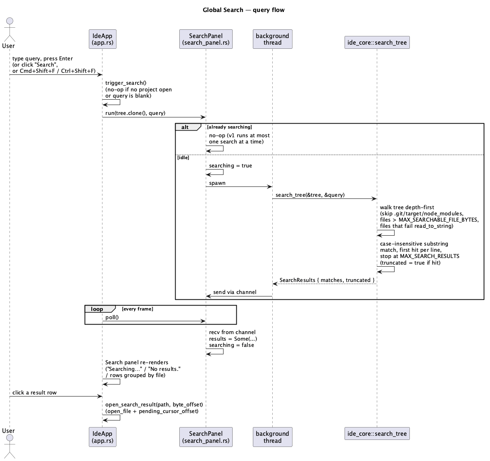
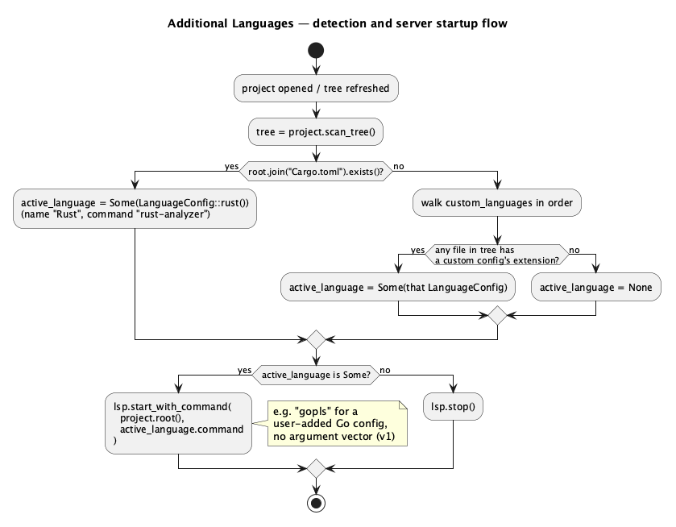

# Global Search & Additional Language Support v1

> **C7 follow-up:** this doc's Global Search half describes `ide-ui`'s
> *original* Search panel (`crates/ui/src/search_panel.rs`'s `SearchPanel`
> type as it existed before C7, `render_search_panel`, the plain
> case-insensitive `ide_core::search_tree` engine). `docs/features/
> search-in-path-v2.md` (C7) reworks `ide-ui`'s Search panel onto a new,
> parallel engine (`ide_core::search_in_path`, exposed via the new
> `PathSearchPanel` type in `crates/ui/src/search_in_path_panel.rs`) with
> regex, include/exclude globs, `.gitignore` awareness and Replace in Path
> — the panel behavior below is superseded there. `ide_core::search_tree`
> and this doc's own `SearchOptions`/type shapes are otherwise unaffected:
> `ide-tui`'s `todo_panel.rs` (T24) still depends on `search_tree`'s exact
> current behavior, so `crates/core/src/search.rs` was deliberately left
> untouched by C7 (`search-in-path-v2.md` §1), and the **Additional
> languages** half of this doc (below) is entirely unrelated to C7 and
> still fully accurate.

## 1. Purpose

Two independent additions bundled into one feature because they share the
same touched crates and roles:

**Global search** ("Find in Files"): search every text file in the open
project for a plain-text query, list every match grouped by file, click a
result to open the file and jump to it — the project-wide counterpart to
each editor tab's own (not yet built, and still not built by this feature)
in-buffer find. Complements Find Usages
(`docs/features/find-usages.md`): Find Usages asks `rust-analyzer` where a
*symbol* is referenced; Global Search greps *text* across the whole tree,
works in any project (Rust or not), and needs no language server at all.

**Additional languages**: today `is_rust_project()`/`load_project`/
`refresh_tree` hardcode "if `Cargo.toml` exists, spawn `rust-analyzer`" —
the only language this app has ever supported. This adds a small,
user-editable list of additional `(name, extension, command)` language
configs, so opening a project containing (for example) `.go` files can
spawn `gopls` the same way opening a Rust project spawns `rust-analyzer` —
without hardcoding a second language into the app. Find Usages, the
Problems panel, and diagnostics already key off `LspBridge::is_running()`/
`LspBridge::diagnostics`, not "is this Rust" — they work for any language
a config now names, with no changes of their own.

v1 scope:

- `ide-core` gains a pure `search_tree` function (no I/O beyond reading
  already-tree-scanned files) and a small `LanguageConfig`/
  `detect_language` data model.
- `ide-ui` gains a Search bottom-panel view (a fourth option alongside
  Problems/Cargo Output/Usages), a "Search" toolbar button, and
  `Cmd+Shift+F`/`Ctrl+Shift+F` (the JetBrains/VS Code "Find in Files"
  convention, the same cross-platform `egui::Modifiers` pattern
  `find-usages.md` already established for `Alt+F7`); and a "Languages…"
  settings window to add/remove custom language configs, persisted the
  same way `Theme` already persists via `eframe::Storage`.
- `crates/lsp` is untouched — `LspClient::start_with_command` already
  takes an arbitrary `command: &str` (see §4); a config's `command` flows
  straight into the exact same, already-shipped, already-reviewed spawn
  path `rust-analyzer` uses today.

**Explicitly deferred** to a future feature (same framing prior docs in
this project use):

- Search: regex, case-sensitivity toggle, whole-word matching,
  find-and-replace, respecting `.gitignore` (v1 uses a fixed, small
  built-in directory exclude list instead — see §3), reporting more than
  one match per line, live-updating results as the tree changes, and
  searching binary files (skipped, same as an unreadable file — see §3).
- Languages: an argument vector per language server (v1's `command` is a
  single program name, exactly matching `ide_lsp::LspClient::
  start_with_command`'s existing `Command::new(command)` shape — a server
  needing extra CLI flags, e.g. `pyright-langserver --stdio`, can't be
  configured in v1; `gopls`, which speaks LSP over stdio with zero
  arguments, is this doc's running example precisely because it already
  fits); more than one extension per language config; running more than
  one language server for the same project at once (polyglot repos use
  whichever config matches first — see §3); editing or removing the
  built-in Rust config; auto-discovering a language from an installed
  toolchain instead of the user typing a command by hand.

## 2. Interface / API

### 2.1 `ide-core` (new module `crates/core/src/search.rs`)

```rust
use std::path::PathBuf;

/// One line containing the search query.
#[derive(Debug, Clone, PartialEq, Eq)]
pub struct SearchMatch {
    pub path: PathBuf,
    /// 0-based.
    pub line: u32,
    /// 0-based **char** index (not byte) of the match's start within the
    /// line — safe to use directly for display purposes on multibyte text.
    pub column: u32,
    /// Byte offset of the match's start within the file's full text —
    /// what `ide-ui` needs to set `pending_cursor_offset` directly, no
    /// `ide_lsp::Position` round-trip (search never touches `ide-lsp`).
    pub byte_offset: usize,
    /// The full text of the matching line, for the results panel's
    /// preview — unlike `Location` (`find-usages.md`), which deliberately
    /// deferred a line-text preview, search results are largely useless
    /// without one.
    pub line_text: String,
}

#[derive(Debug, Clone, PartialEq, Eq)]
pub struct SearchResults {
    pub matches: Vec<SearchMatch>,
    /// `true` if `MAX_SEARCH_RESULTS` was reached and the walk stopped
    /// early — mirrors `FileDiff::truncated`'s existing precedent
    /// (`docs/features/git-support.md`) for signaling a capped result
    /// without erroring.
    pub truncated: bool,
}

/// Caps total matches collected across the whole search — the same
/// "bound cost during the walk, not after" discipline
/// `MAX_LOCATIONS_PER_MESSAGE` established in `ide-lsp`
/// (`docs/security-findings/rust-lsp-dev-find-usages-2026-08-16.md`):
/// once `matches.len() == MAX_SEARCH_RESULTS`, `search_tree` stops
/// walking rather than collecting everything and truncating after.
pub const MAX_SEARCH_RESULTS: usize = 1000;

/// Files larger than this are skipped without being read — the search
/// equivalent of `Buffer`'s existing `MAX_OPEN_BYTES` safety net, sized
/// smaller because search reads *every* matching file in one pass rather
/// than one file a user explicitly opened.
pub const MAX_SEARCHABLE_FILE_BYTES: u64 = 5 * 1024 * 1024;

/// Case-insensitive plain-substring search over every file in `tree`
/// (as returned by `Project::scan_tree`), depth-first in `tree`'s existing
/// child order (dirs-then-files, case-insensitive name order — the same
/// order the directory panel already displays). `query.trim().is_empty()`
/// returns `SearchResults { matches: vec![], truncated: false }`
/// immediately without walking anything. See §3 for skip rules.
pub fn search_tree(tree: &DirEntry, query: &str) -> SearchResults;
```

### `ide-core` (new module `crates/core/src/language.rs`)

```rust
/// One language a project can be detected as, and the command to spawn
/// its language server. `command` is a single program name/path — see §1's
/// "additional languages" deferrals for why there's no argument vector.
#[derive(Debug, Clone, PartialEq, Eq, serde::Serialize, serde::Deserialize)]
pub struct LanguageConfig {
    pub name: String,
    /// No leading `.` — e.g. `"go"`, not `".go"`.
    pub extension: String,
    pub command: String,
}

impl LanguageConfig {
    /// The one built-in config, matched by `detect_language` before any
    /// custom config regardless of `custom`'s order or contents — not
    /// user-editable/removable (§1).
    pub fn rust() -> LanguageConfig {
        LanguageConfig {
            name: "Rust".to_string(),
            extension: "rs".to_string(),
            command: "rust-analyzer".to_string(),
        }
    }
}

/// Detects which language applies to `tree`'s project. Rust is
/// special-cased ahead of every `custom` entry: it matches only when
/// `tree.path` (the project root — see `Project::scan_tree`) has a
/// `Cargo.toml` directly in it, a project-root *marker* check, not
/// "any `.rs` file exists" — this preserves the exact Rust-detection
/// behavior this app already shipped before this feature, just relocated
/// from three duplicated call sites in `ide-ui` into one place (§6).
/// Every `custom` entry after that matches by *extension*: applies if any
/// file anywhere in `tree` has that extension (case-insensitive
/// comparison), checked in `custom`'s order, first match wins. `None` if
/// nothing matches.
pub fn detect_language(tree: &DirEntry, custom: &[LanguageConfig]) -> Option<LanguageConfig>;
```

`serde` (`derive` feature) is a new `ide-core` dependency, added solely so
`LanguageConfig` can round-trip through `ide-ui`'s `eframe::Storage`
persistence the same way `Theme` already does — no other part of `ide-core`
gains a serde dependency's behavior; this is a data-shape derive, not I/O.

Everything else in `ide-core`'s existing public API (`Buffer`, `Project`,
`DirEntry`, `git::*`) is unchanged.

### 2.2 `ide-ui`

```rust
// crates/ui/src/search_panel.rs — new file, mirrors CargoPanel's/
// ClaudePanel's existing "spawn off-thread, poll a channel" shape.
pub struct SearchPanel {
    pub results: Option<ide_core::SearchResults>,
    pub searching: bool,
}

impl SearchPanel {
    /// No-op if a search is already running (v1 runs at most one search
    /// at a time — the same "one thing in flight" simplicity
    /// `CargoPanel::run`'s doc comment already states) — this no-op path
    /// leaves everything, including the generation counter below,
    /// untouched; the already-running search continues uninterrupted.
    /// Otherwise spawns a background thread running
    /// `ide_core::search_tree(&tree, &query)`, sets `searching = true`,
    /// and increments an internal generation counter, tagging this
    /// search with the new value. `poll` only accepts a result tagged
    /// with the current generation; `discard_in_flight` is the counter's
    /// only other increment point (see below) — so a result from this
    /// call can only ever be superseded by a `discard_in_flight` call
    /// made after it, never by another `run` call (which would have
    /// been a no-op instead of starting a second search).
    pub fn run(&mut self, tree: ide_core::DirEntry, query: String);

    /// Drains the result channel if the background search has finished:
    /// sets `results` and clears `searching`. Returns `true` if anything
    /// changed (same `poll` shape as `LspBridge`/`CargoPanel`/
    /// `ClaudePanel`). A result whose generation doesn't match the most
    /// recent `run`/`discard_in_flight` call is dropped without touching
    /// `results` — see `discard_in_flight`.
    pub fn poll(&mut self) -> bool;

    /// Bumps the generation counter without starting a new search, so a
    /// currently in-flight search's eventual result is discarded by
    /// `poll` rather than overwriting `results` with a stale project's
    /// matches. Does **not** stop the background thread (mirrors
    /// `LspBridge::find_references`'s own "the client just discards an
    /// unmatched response rather than sending a cancel" precedent,
    /// `find-usages.md` §4) — the thread runs to completion and its
    /// result is simply ignored on arrival. Leaves `searching` as-is if a
    /// search was in flight (the panel still shows "Searching…" — a new
    /// search on the new project isn't triggered automatically, matching
    /// this feature's general "search only runs when the user asks"
    /// behavior) or `false` if nothing was in flight.
    pub fn discard_in_flight(&mut self);
}
```

`IdeApp` (in `app.rs`) gains:

- `search: SearchPanel` (alongside the existing `claude`/`git`/`lsp`/
  `cargo` fields).
- `search_query: String` — the live query text-field value.
- `fn run_search(&mut self)` — no-op if `self.tree.is_none()` or
  `self.search_query.trim().is_empty()`; otherwise clones `self.tree`
  (already cloned every frame today for the tree panel — see §4) and calls
  `self.search.run(tree, self.search_query.clone())`.
- `fn trigger_search(&mut self)` — `run_search()` then
  `self.bottom_view = BottomView::Search`, the same "action + switch the
  bottom panel to show it" pairing `trigger_find_usages` already
  established.
- `fn open_search_result(&mut self, path: &Path, byte_offset: usize)` —
  opens `path` (must come only from a `SearchMatch`'s own `path`, same
  provenance discipline as `open_usage`/`open_diagnostic` — see §4) and
  best-effort places the cursor at `byte_offset`. Does **not** go through
  `open_at`/`ide_lsp::position_to_byte_offset` — a `SearchMatch` already
  carries an absolute byte offset, so there's nothing to convert; a small
  new sibling helper next to `open_at`, not a generalization of it (this
  project's stated preference: "three similar lines is better than a
  premature abstraction").
- `custom_languages: Vec<ide_core::LanguageConfig>` — loaded from
  `eframe::Storage` on `new()`, saved on `save()`, exactly the way `theme`
  already is (new storage key, e.g. `"ide_custom_languages"`).
- `active_language: Option<ide_core::LanguageConfig>` — recomputed via
  `ide_core::detect_language(&tree, &self.custom_languages)` everywhere
  `self.tree` is recomputed (`load_project`, `refresh_tree`), replacing
  those methods' existing direct `project.root().join("Cargo.toml").
  exists()` checks (§6). `is_rust_project()` is unchanged and keeps its
  own, separate Cargo.toml check — see §3 for why it isn't merged into
  this.
- `fn add_custom_language(&mut self)` / `fn remove_custom_language(&mut self,
  index: usize)` and the small draft-form fields
  (`new_language_name`/`new_language_extension`/`new_language_command`:
  `String`, `language_settings_error: Option<String>`) backing a
  "Languages…" toolbar button's settings window — see §3.
- `BottomView` gains a fourth variant, `Search`, added to the existing
  three-way `selectable_label` row (Problems / Cargo Output / Usages /
  Search) `find-usages.md` §2.2 already established.

## 3. Behaviour

### Global Search

- **Triggering**: a "Search" toolbar button, shown whenever a project is
  open (unlike Find Usages' toolbar button, **not** gated on
  `is_rust_project()`/an active language — search needs no language server
  and works on any file type); `Cmd+Shift+F`/`Ctrl+Shift+F` in
  `handle_shortcuts`, unconditionally available whenever a project is open
  (no `view_mode` gate is needed here — unlike `find_usages`, search
  doesn't depend on the editor's live cursor state, so there's no
  stale-state hazard to gate against); and pressing Enter while the Search
  panel's query field has focus (the same "Enter submits" pattern
  `render_claude_panel` already uses). All three call `trigger_search()`.
- **Query lifecycle**: `run_search()` clones the current tree and hands it
  to `SearchPanel::run`, which no-ops if a search is already in flight —
  v1 refuses a second query while one is running rather than superseding
  it, since a local filesystem walk capped at `MAX_SEARCH_RESULTS`
  files/matches finishes quickly enough that this is an acceptable v1
  simplification. **Project changes are handled differently**: `load_project`
  (called by both opening and creating a project) calls
  `self.search.discard_in_flight()` right alongside its existing
  `lsp`/`git` resets, so a search started against the previous project
  that's still running when the user switches to a new one delivers its
  eventual result into the void instead of showing the wrong project's
  matches (or letting a stale result's path flow into
  `open_search_result`) — see `SearchPanel::discard_in_flight`.
- **Skip rules inside `search_tree`** (§2.1): a fixed, non-configurable
  exclude list of directory names — `.git`, `target`, `node_modules` —
  covers the three heaviest/most irrelevant subtrees this app's supported
  ecosystems (git internals, Rust build output, JS tooling some polyglot
  Rust projects still carry) without needing a `.gitignore` parser (out of
  scope, §1). Within a searched directory, a file is skipped (not an
  error, same "unreadable — skip" convention `Project::scan_tree` and
  `Buffer::open`'s size cap already use) if it's larger than
  `MAX_SEARCHABLE_FILE_BYTES`, or if `fs::read_to_string` fails — the
  latter is `Buffer::open`'s exact existing UTF-8-strictness behavior,
  reused here as an accurate-enough "is this a binary file" proxy rather
  than inventing a separate byte-sniffing heuristic.
- **Matching**: case-insensitive plain substring — no regex. At most one
  match reported per line (the first occurrence); further occurrences on
  the same line aren't separately reported in v1 (§1). **Invariant:** a
  match's `column`/`byte_offset` must be computed against the line's
  *original*, un-lowercased text — never by lowercasing the whole line
  once and reusing the resulting index directly against the original.
  `str::to_lowercase()` can change a string's length for some Unicode
  input (e.g. `"İ"`, one codepoint, lowercases to `"i̇"`, two), so an
  index found in a lowercased copy isn't guaranteed to still be valid
  against the original — the same char-boundary/length-mismatch care
  `Buffer::clamp_offset` and `diff_replace`'s char-boundary backoff
  already take elsewhere in this codebase. A correct approach: for each
  char-boundary start position in the *original* line, compare a
  same-length slice's lowercased form against the lowercased query,
  rather than lowercasing the whole line up front and indexing back into
  it.
- **Results panel**: while `self.search.searching` is true, "Searching…";
  once `self.search.results` is `Some`, "No results." if `matches` is
  empty, otherwise one row per match grouped by file (heading per path, in
  the order `search_tree` returned them — already depth-first/sorted, no
  re-sorting needed, unlike the Usages panel which explicitly re-sorts),
  each row labelled `{line+1}:{column+1}  {line_text}` (1-based for
  display), and — if `truncated` is `true` — a trailing note ("results
  truncated — showing the first {MAX_SEARCH_RESULTS} matches"), the same
  `FileDiff::truncated` pattern the diff viewer already renders. Clicking
  a row calls `open_search_result(path, byte_offset)`.

### Additional languages

- **Detecting a project's language**: `load_project` and `refresh_tree`
  both call `ide_core::detect_language(&tree, &self.custom_languages)`
  right after computing `tree`, storing the result in `active_language`.
  If `Some`, `lsp.start_with_command(project.root(), &lang.command)`
  (`refresh_tree` only does this if `!lsp.is_running()`, matching its
  existing "don't restart an already-running server" behavior;
  `load_project` always (re)starts, matching its existing "a brand-new
  project context" behavior — both unchanged except for which command
  they pass). If `None`, `lsp.stop()` — same as today's "no Cargo.toml"
  path, just reached via a different check.
- **`is_rust_project()` is intentionally left untouched** and keeps its
  own direct Cargo.toml check, rather than becoming
  `active_language.as_ref().is_some_and(|l| l.name == "Rust")`: it gates
  the Cargo-specific Build/Run/Test/Check/Clippy toolbar buttons, which
  only make sense for an actual Cargo project — collapsing it into
  `active_language` would be a purely cosmetic refactor of already-shipped
  behavior that this feature doesn't need to touch, and it would create an
  accidental coupling where, say, disabling the built-in Rust config (not
  possible in v1, but worth not designing toward) could silently hide the
  Cargo buttons too.
- **"Restart Rust Analyzer" becomes "Restart Language Server"**: same
  toolbar slot, now gated on `active_language.is_some()` instead of
  `is_rust_project()` (so it's visible for a detected Go project too), and
  `restart_lsp()` reads `active_language`'s `command` instead of always
  passing `"rust-analyzer"` — a no-op if `active_language` is `None`,
  same as today's "no project" no-op.
- **Find Usages needs no changes**: its toolbar button, `Alt+F7`, and
  `Cmd+Click` are already gated on `lsp.is_running()`, not
  `is_rust_project()` (`find-usages.md` §3) — once `lsp` is running
  because a Go project's `gopls` started, Find Usages already works
  against it for free, provided `gopls` answers `textDocument/references`
  (it does).
- **"Languages…" settings window**: a new always-visible toolbar button
  (not gated on a project being open — the list is a global, not
  per-project, setting) opens an `egui::Window` (the same pattern
  `render_confirm_modal` already uses): a fixed, non-interactive row for
  the built-in `LanguageConfig::rust()`; each `custom_languages` entry as
  a row (`"{name} (.{extension}) — {command}"`) with a "Remove" button
  calling `remove_custom_language(index)`; a small form (three
  `text_edit_singleline`s for name/extension/command, an "Add" button)
  calling `add_custom_language()`; `language_settings_error` shown in red
  if set; a "Close" button clearing the window's visibility flag.
- **`add_custom_language()` validation**: trims all three draft fields;
  rejects (sets `language_settings_error`, leaves `custom_languages` and
  the draft fields untouched) if any is empty after trimming, or if the
  (leading-`.`-stripped, case-insensitive) extension already belongs to
  `LanguageConfig::rust()` (`"rs"`) or an existing `custom_languages`
  entry. On success: pushes the new config, clears the draft fields and
  `language_settings_error`, and — if a project is currently open —
  re-runs the same `detect_language`/`lsp.start_with_command` logic
  `load_project` uses, so adding a matching language while its project is
  already open takes effect immediately rather than only on next open.
- **`remove_custom_language(index)`**: silently does nothing if `index` is
  out of bounds (the same defensive convention `close_tab_now`'s existing
  `idx >= self.tabs.len()` guard already uses), otherwise removes the
  entry and re-runs detection the same way.
- **Two custom entries sharing an extension**: prevented at the point of
  adding a *new* one (validation above); not otherwise specially handled
  — an edge case this project accepts rather than solves for v1's expected
  small list size.

## 4. Constraints & invariants

- `search_tree` performs no path construction or resolution of its own —
  every path it reads comes directly from `DirEntry.path`, which
  `Project::scan_tree` already validated (symlink targets escaping the
  project root already excluded before `search_tree` ever sees the tree).
  It inherits that guarantee for free rather than re-implementing it.
- `open_search_result`'s `path`/`byte_offset` arguments must come only
  from a `SearchMatch` the running search itself produced — the same
  provenance rule `find-usages.md` §4 states for `open_usage`. `run_search`'s
  `tree` argument comes only from `self.tree` (itself only ever set by
  `load_project`/`refresh_tree` from `Project::scan_tree()` — never
  user-typed).
- `add_custom_language`'s `command` is stored and later passed verbatim to
  `LspClient::start_with_command`, which spawns it via
  `std::process::Command::new(command)` — no shell is ever invoked, so
  there is no shell-metacharacter injection surface regardless of what a
  user types (a stray `;`/`|`/`&&` is just part of an invalid program
  name, not shell syntax). The real-world risk this opens is narrower and
  different in kind: the user can now make this app spawn *any* program
  already reachable on their own `PATH`, cwd'd at the project root,
  talking to it over stdio as if it were an LSP server — that's a locally
  self-inflicted action (the same trust boundary as the user typing a
  command into their own terminal), not a remote/injected one, but it's
  new relative to the previously-fixed `"rust-analyzer"` literal, which is
  why `crates/ui/src/lsp_bridge.rs` is now declared security-sensitive in
  `CLAUDE.md` (a `hacker` pass is required for `rust-ui-dev` this run,
  unlike `find-usages.md`'s UI role, which didn't need one).
- `MAX_SEARCH_RESULTS`/`MAX_SEARCHABLE_FILE_BYTES` bound `search_tree`'s
  worst-case cost against a large or adversarially-shaped project tree
  (e.g. many huge files, or a query like `"e"` that matches almost every
  line) the same way `MAX_LOCATIONS_PER_MESSAGE` bounds `ide-lsp`'s
  references parsing — capped *during* the walk, not truncated after
  collecting everything.
- A search still in flight when `load_project` runs is neither canceled
  nor allowed to overwrite `search.results`/`search.searching` once it
  eventually completes — `load_project` calls
  `self.search.discard_in_flight()` and any later-arriving result for that
  now-superseded generation is dropped by `poll` (see §2.2).
- `LanguageConfig::rust()` is never persisted or exposed as a
  `custom_languages` entry — `detect_language` always special-cases it
  ahead of `custom`, so it can't be shadowed, removed, or reordered by
  whatever the user has configured.

## 5. Examples

**Running a search and reacting to results:**

```rust
let results = ide_core::search_tree(&tree, "TODO");
for m in &results.matches {
    // m.path, m.line + 1, m.column + 1, m.line_text
}
if results.truncated {
    // "results truncated — showing the first 1000 matches"
}
```

**Detecting a project's language and starting its server:**

```rust
let custom = vec![ide_core::LanguageConfig {
    name: "Go".to_string(),
    extension: "go".to_string(),
    command: "gopls".to_string(),
}];
match ide_core::detect_language(&tree, &custom) {
    Some(lang) => lsp_bridge.start_with_command(project.root(), &lang.command),
    None => lsp_bridge.stop(),
}
```

## 6. Dependencies & integration points

- `ide-core` gains one new dependency, `serde` (`derive` feature), used
  only for `LanguageConfig`'s round-trip through `ide-ui`'s
  `eframe::Storage` persistence — see §2.1.
- Consolidates three previously-duplicated `project.root().join("Cargo.
  toml").exists()` checks in `ide-ui` (`restart_lsp`, `load_project`,
  `refresh_tree`) into one place, `ide_core::detect_language` — `ide-ui`'s
  own `is_rust_project()` (which gates the Cargo-specific toolbar buttons,
  not the language server) is deliberately left as its own separate check
  (§3).
- `crates/lsp` is untouched by this feature — `LspClient::
  start_with_command`'s existing `command: &str` parameter already
  supports an arbitrary single-program-name command; nothing about
  spawning a *different* command than `"rust-analyzer"` requires any
  change to `ide-lsp` itself. `rust-lsp-dev` is not a required role for
  this feature.
- Builds on the already-merged `find-usages.md` UI conventions
  (`trigger_*` action+panel-switch helpers, the bottom panel's
  `selectable_label` row, `handle_shortcuts`' modifier-check tuple
  pattern) rather than introducing new ones.
- `crates/ui/src/lsp_bridge.rs` is now declared security-sensitive in
  `CLAUDE.md` (see §4) — `rust-ui-dev`'s diff for this feature is expected
  to touch it (generalizing `start`/`start_with_command`'s call sites), so
  a `hacker` pass is required for that role this run, unlike
  `find-usages.md`.

## 7. Diagrams

**Global search query flow:**



**Language detection and server startup flow:**



## Revision notes

Per `rev`'s first-pass findings:

- §3 "Matching": added an explicit invariant that a match's
  `column`/`byte_offset` must be computed against the line's original,
  un-lowercased text, since `str::to_lowercase()` can change a string's
  length for some Unicode input — naively lowercasing a whole line and
  reusing the resulting index against the original could silently
  misplace the cursor.
- §2.2/§3/§4: added `SearchPanel::discard_in_flight` and wired it into
  `load_project`, so a search still running when the user switches
  projects can't deliver a stale, wrong-project result into
  `search.results` (or into `open_search_result` via a stale path).
- §2.2, round 2 of this fix: reworded `SearchPanel::run`'s doc comment,
  which as first written could be read as bumping the generation counter
  on its own no-op path (already-searching) too — that would have made
  the in-flight search's own eventual result look superseded and get
  silently dropped, breaking the ordinary case, not just the
  project-switch one this mechanism was added for. Now states explicitly
  that only a `run` call that actually starts a search, or a
  `discard_in_flight` call, increments the counter.
- Fixed a PlantUML rendering bug in
  `diagrams/global-search-and-languages-language-detect.puml` (`&amp;`
  rendered as literal text instead of `&`) and regenerated the PNG.
