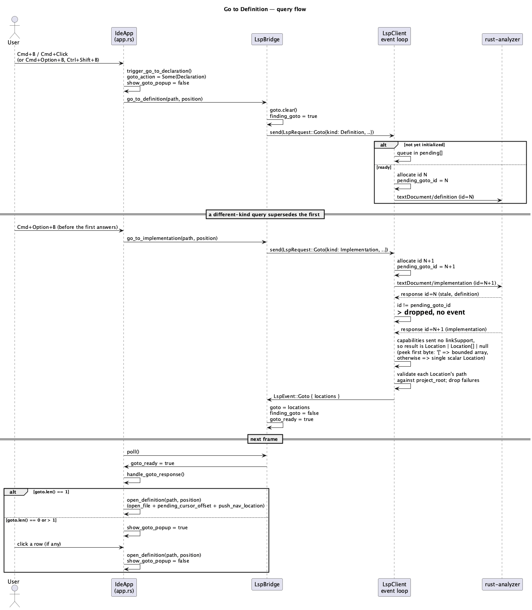

# Go to Definition (C1)

## 1. Purpose

Adds three more `rust-analyzer` code-navigation requests on top of the
already-merged `ide-lsp` connection (`rust-language-support.md`,
`find-usages.md`): **Go to Declaration** (`textDocument/definition`), **Go
to Type Declaration** (`textDocument/typeDefinition`) and **Go to
Implementation** (`textDocument/implementation`). Given the cursor position
in the active editor tab, ask the server where the symbol under the cursor
is declared/typed/implemented, and jump there — or, when the server names
more than one candidate (the common case for "Go to Implementation" on a
trait method with several `impl`s), show a small dismissable popup to pick
from, the same shape `richer-highlighting-and-usages-popup.md` already
established for Show Usages.

This phase also **fixes a gesture-semantics bug** flagged in
`docs/roadmap.md` §5.3: `Cmd+Click` and `Cmd+B` currently trigger Find
Usages, which is not what either gesture means in JetBrains IDEs or VS
Code. After this phase:

- `Cmd+Click` / `Cmd+B` → **Go to Declaration** (was: find usages).
- `Cmd+Option+B` → **Go to Implementation** (new).
- `Ctrl+Shift+B` → **Go to Type Declaration** (new).
- `Cmd+Option+F7` → **Show Usages** popup (moved off `Cmd+B`, which it
  incorrectly occupied — the popup itself, its bottom-panel counterpart on
  `Option+F7`, and `textDocument/references` are otherwise **unchanged**,
  see `find-usages.md`/`richer-highlighting-and-usages-popup.md`).
- `Cmd+Option+Left` / `Cmd+Option+Right` → **Back / Forward** navigation
  history (new *keyboard* bindings for the top bar's existing back/forward
  arrows — `NavHistory`/`nav_back`/`nav_forward` already exist, unbound
  from any key since `fleet-shell.md`; see §3.5 for why this also requires
  a small fix in the editor widget's own key handling).

v1 scope:

- `ide-lsp` gains one new request/event pair, `LspRequest::Goto` /
  `LspEvent::Goto`, parameterized by a `GotoKind` (`Definition`/
  `TypeDefinition`/`Implementation`) — one shared wire mechanism for all
  three, mirroring `References`'s existing single-pending-id-slot
  supersede-by-overwrite design (§2.1, §3).
- `ide-ui` gains three thin `LspBridge` trigger methods, three `IdeApp`
  trigger methods (one per `Cmd+B`/`Cmd+Option+B`/`Ctrl+Shift+B`), a
  jump-or-popup response handler, and a new floating popup for the
  multi-candidate case.
- The pre-existing `Cmd+Click`/`Cmd+B` → Find Usages wiring is repointed to
  Go to Declaration; `Show Usages`'s binding moves to `Cmd+Option+F7`.
- Back/Forward get real keyboard bindings; a narrow, pre-existing collision
  in the editor widget's own `Cmd+Option+Left/Right` handling (currently
  swallowed as "move to line start/end", §3.5) is fixed so the chord
  reaches the app-level command registry instead.

**Explicitly deferred**: hover/quick-documentation (`A7`), autocompletion,
rename (`D1`), code actions (`A8`), semantic highlighting (`A10`). Falling
back to Find Usages when Go to Declaration finds nothing (some IDEs do
this) is **not** implemented — a zero-result Go to Declaration shows the
same "No declaration found." popup a zero-result query of any other kind
shows (§3.4), never silently re-queries a different LSP method.
`LocationLink`-shaped responses (target range distinct from selection
range, common when a client advertises `textDocument.definition
.linkSupport`) are out of scope — see §4's justification for why v1 can
assume the server never sends one.

Does not touch `crates/core/**`.

## 2. Interface / API

### 2.1 `ide-lsp` (additions to the existing public API)

```rust
/// Which of the three symmetric "go to X" queries a `Goto` request/event
/// pair is for. Carried on both the request and (implicitly, via the
/// caller already knowing what it asked for) consumed on the `ide-ui`
/// side — the event itself doesn't repeat it (see `LspEvent::Goto`).
#[derive(Debug, Clone, Copy, PartialEq, Eq)]
pub enum GotoKind {
    Definition,
    TypeDefinition,
    Implementation,
}

pub enum LspRequest {
    // ... existing: DidOpen, DidChange, DidClose, References ...
    /// Query where `position` in `path` is declared (`Definition`), typed
    /// (`TypeDefinition`), or implemented (`Implementation`). Shares one
    /// supersede-by-overwrite pending-id slot across all three kinds —
    /// sending any `Goto` request while another is outstanding (regardless
    /// of which `GotoKind`) supersedes it, the same "client tracks only
    /// the most recent" discipline `References` already uses (§3, §4).
    Goto {
        kind: GotoKind,
        path: PathBuf,
        position: Position,
    },
}

pub enum LspEvent {
    // ... existing: Diagnostics, ServerExited, References ...
    /// The result of the most recently sent, not-yet-superseded `Goto`
    /// query of any kind — delivered exactly once per non-superseded
    /// request, including empty/unparseable responses, mirroring
    /// `LspEvent::References`'s delivery guarantee (§3, §4). Does not
    /// repeat the `GotoKind` — the UI already knows what it asked for
    /// (`IdeApp::goto_action`, §2.2), and only one `Goto` query is ever
    /// meaningfully in flight at a time.
    Goto { locations: Vec<Location> },
}
```

Everything else in `ide-lsp`'s existing public API (`Position`, `Range`,
`Location`, `LspClient`, `byte_offset_to_position`,
`position_to_byte_offset`, `LspError`, `Diagnostic`,
`DiagnosticSeverity`, `MAX_CONTENT_LENGTH`) is unchanged.

### 2.2 `ide-ui`

```rust
// crates/ui/src/lsp_bridge.rs — additions to the existing LspBridge
struct LspBridge {
    // ... existing: client, diagnostics, server_error, references,
    //     finding_references ...
    /// Result of the most recent (non-superseded) `Goto` query of any
    /// kind — replaced wholesale on each `LspEvent::Goto`, same one-query-
    /// at-a-time shape as `references` (§2.1).
    goto: Vec<Location>,
    /// True from the moment a `go_to_*` method sends the request until a
    /// matching `LspEvent::Goto` (or `ServerExited`) arrives.
    finding_goto: bool,
    /// True for exactly the one `poll()` call that processed the
    /// most-recently-arrived `LspEvent::Goto` — reset to `false` at the
    /// top of every `poll()` call, so `IdeApp::handle_goto_response`
    /// (§2.2, called once per frame right after `poll()`) can tell "a
    /// response just landed this frame" apart from "nothing changed"
    /// without re-deriving it from `finding_goto`'s edge, which flips
    /// false on every poll after the fact, not just the frame it
    /// happened on.
    goto_ready: bool,
}

impl LspBridge {
    /// No-op (including leaving `finding_goto`/`goto_ready` untouched) if
    /// no client is running — same shape as `find_references`. Otherwise
    /// clears `goto`, sets `finding_goto`, and sends `LspRequest::Goto {
    /// kind: GotoKind::Definition, .. }`.
    fn go_to_definition(&mut self, path: &Path, position: Position);
    /// Same shape, `GotoKind::TypeDefinition`.
    fn go_to_type_definition(&mut self, path: &Path, position: Position);
    /// Same shape, `GotoKind::Implementation`.
    fn go_to_implementation(&mut self, path: &Path, position: Position);
}
```

`IdeApp` (in `app.rs`) gains:

- `goto_action: Option<GotoKind>` — which of the three queries is the most
  recently *triggered* one (set by each `trigger_go_to_*` method before it
  calls the matching `LspBridge` method); read by `render_goto_popup` for
  its title/empty-state text (§3.4) and by `handle_goto_response` for
  nothing else — the branch on `self.lsp.goto.len()` doesn't need to know
  the kind, only the popup's *wording* does.
- `show_goto_popup: bool` — mirrors `show_usages_popup`, but (unlike it)
  is never set `true` by a trigger method directly; only
  `handle_goto_response` opens it, and only for zero or multiple results
  (§3.4).
- Three trigger methods, one per gesture, all sharing `find_usages_target`
  unchanged (§3.1) — reused as-is despite its find-usages-specific name
  (see §4's note on why it isn't renamed):
  - `trigger_go_to_declaration(&mut self)`
  - `trigger_go_to_type_declaration(&mut self)`
  - `trigger_go_to_implementation(&mut self)`

  Each: no-op under `find_usages_target`'s existing no-op conditions
  (no active tab, untitled tab, no cursor offset, not the Editor view);
  otherwise sets `goto_action`, clears `show_goto_popup`, and calls the
  matching `LspBridge::go_to_*` method.
- `handle_goto_response(&mut self)` — called once per frame, immediately
  after `self.lsp.poll()` (§3.4). No-op unless `self.lsp.goto_ready`. On a
  single result, jumps immediately via `open_definition` without ever
  opening the popup; on zero or more-than-one results, opens
  `show_goto_popup` (rendered by the new `render_goto_popup`, §3.4).
- `open_definition(&mut self, path: &Path, position: Position)` — thin
  wrapper over the existing `open_at` (already shared by `open_diagnostic`/
  `open_usage`), documented as pulling its `path`/`position` only from
  `LspBridge::goto` entries, already validated against `project_root`
  inside `ide-lsp` (same provenance discipline `open_usage` already
  follows for `LspBridge::references`, `find-usages.md` §4).
- `sorted_goto(&self) -> Vec<Location>` — the popup's ordering, same shape
  as the existing `sorted_references` (path, then `range.start`), applied
  to `self.lsp.goto` instead.
- `goto_action_label(&self) -> &'static str` — `"Declaration"` /
  `"Type Declaration"` / `"Implementation"` for whatever `self.goto_action`
  currently holds (`"Declaration"` if `None`, which the popup never
  actually observes — `handle_goto_response` only opens it once
  `goto_action` has just been set by the trigger that led here).

`command.rs` gains five `CommandAction` variants — `GoToDeclaration`,
`GoToTypeDeclaration`, `GoToImplementation`, `NavigateBack`,
`NavigateForward` — registered under the existing `"Navigate"` category
(same as `FindUsages`/`ShowUsages`/`FindAction`), bindings per §3.5. The
existing `ShowUsages` entry's *binding* changes (`Cmd+B` → `Cmd+Option
+F7`); its id, title, category and action are unchanged.

## 3. Behaviour

### 3.1 Triggering a query

- `Cmd+B` (`Ctrl+B` off macOS) and `Cmd+Click`/`Ctrl+Click` on a symbol in
  the editor both call `trigger_go_to_declaration`. `Cmd+Click` is wired
  exactly where Find Usages used to be: `render_tabs_and_editor` still
  reads `output.clicked_link` from the editor widget (unchanged —
  `richer-highlighting-and-usages-popup.md`'s Cmd-hover-underline
  affordance is untouched, only the click's *effect* changes), but the
  branch that used to call `trigger_find_usages_popup` now calls
  `trigger_go_to_declaration` instead.
- `Cmd+Option+B` (`Ctrl+Alt+B` off macOS) calls `trigger_go_to_implementation`.
- `Ctrl+Shift+B` calls `trigger_go_to_type_declaration`.
- All three share `find_usages_target`'s existing no-op gating (view mode,
  active tab, path, cursor offset) — same as `find_usages`/`ShowUsages`
  already do, so there's exactly one "is there a sensible thing to query
  right now" answer shared by five actions rather than five independent
  ones.

### 3.2 Query lifecycle

- A `go_to_*` `LspBridge` method behaves exactly like `find_references`
  did for `References`: no-op (nothing sent, `finding_goto` left
  untouched) if no client is running; otherwise clears `goto`, sets
  `finding_goto = true`, sends `LspRequest::Goto { kind, path, position }`.
- `ConnectionState` (in `ide-lsp`'s client event loop) gains one
  `pending_goto_id: Option<u64>` slot, shared by all three `GotoKind`s —
  sending a new `Goto` request of *any* kind overwrites it, exactly the
  supersede-by-overwrite discipline `pending_references_id` already
  implements. A response for an old id (whether the old query was the same
  kind or a different one) no longer matches and is dropped, no event
  emitted.
- Response parsing, permissive exactly like `References` (`find-usages.md`
  §3/§4): a JSON-RPC error or a `null` result becomes an empty
  `LspEvent::Goto { locations: vec![] }`. Otherwise, since v1's
  `initialize` sends `"capabilities": {}` — declaring no
  `textDocument.definition.linkSupport` — the LSP spec requires the server
  to answer with `Location | Location[]`, never `LocationLink[]` (§4), so
  the client only needs to distinguish those two shapes: a `result` whose
  first non-whitespace byte is `[` deserializes as a bounded array of
  `lsp_types::Location` (same `MAX_LOCATIONS_PER_MESSAGE`-capped shape
  `BoundedLocations` already implements for `References` — reused
  unchanged, generalized in its doc comment to cover both request kinds);
  anything else deserializes as one scalar `lsp_types::Location`, becoming
  a one-element vec on success. Either way, an unparseable `result`
  produces an empty vec rather than being dropped — same "something must
  always clear a waiting UI" rationale `References` already documents.
  Individual entries (from the array case) whose URI doesn't convert to a
  path, or whose path fails `validate_path` against `project_root`, are
  skipped without discarding the rest — matching `References`'s existing
  per-entry provenance check.
- `LspBridge::poll` resets `goto_ready = false` at the top of every call,
  then on `LspEvent::Goto` sets `self.goto = locations; self.finding_goto
  = false; self.goto_ready = true`. `ServerExited` clears `finding_goto`
  (not `goto_ready` — a crash mid-query never produces a "response just
  landed" frame, so there's nothing for `handle_goto_response` to react
  to).

### 3.3 The jump-vs-popup branch

`IdeApp::handle_goto_response` runs once per frame, right after
`self.lsp.poll()` (the same call site `sync_tab_diagnostics` already
follows it with):

- `self.lsp.goto.len() == 1` → jump immediately: `open_definition(&loc
  .path, loc.range.start)`. No popup ever appears for the overwhelmingly
  common single-target case — this is the JetBrains/VS Code "just goes
  there" behavior for an ordinary declaration.
- `self.lsp.goto.len() == 0` or `> 1` → `show_goto_popup = true`, rendered
  by the popup (§3.4). Zero results still open it (with an empty-state
  message) rather than silently doing nothing — same "the gesture always
  visibly acknowledges itself" convention the Usages popup already
  established, not a new one invented here.

### 3.4 The Go to popup

New `render_goto_popup`, structurally identical to the existing
`render_usages_popup` (`richer-highlighting-and-usages-popup.md` §3) —
same `egui::Window`, same `ScrollArea`, same `file:line` row labelling via
`display_path` — but titled from `goto_action_label()` (`"Declaration"` /
`"Type Declaration"` / `"Implementation"`) instead of the fixed `"Usages"`,
sourced from `sorted_goto()` instead of `sorted_references()`, and its
empty-state text is `"No {label} found."` instead of `"No usages found."`.
Clicking a row calls `open_definition` and closes the popup. `Escape`
closes it (added to the same `show_usages_popup && escape` check in
`render.rs`, now covering `show_goto_popup` too).

### 3.5 Command registry & the `Cmd+Option+Left/Right` collision fix

| Action | Chord | `CommandAction` |
|---|---|---|
| Go to Declaration | `⌘B` | `GoToDeclaration` |
| Go to Implementation | `⌘⌥B` | `GoToImplementation` |
| Go to Type Declaration | `⌃⇧B` | `GoToTypeDeclaration` |
| Back | `⌘⌥←` | `NavigateBack` |
| Forward | `⌘⌥→` | `NavigateForward` |
| Show Usages *(rebind only)* | `⌘⌥F7` *(was `⌘B`)* | `ShowUsages` *(unchanged)* |

`GoToDeclaration`/`GoToImplementation`/`GoToTypeDeclaration` are enabled
whenever `active_tab.is_some()` (joining the existing
`FindUsages`/`ShowUsages`/... group in `is_command_enabled` — the finer
"is there actually a symbol here" check happens at query time via
`find_usages_target`, same as those). `NavigateBack`/`NavigateForward` are
enabled by `self.nav.can_go_back()`/`can_go_forward()` — the same
predicate the top bar's arrow buttons already gate on
(`render.rs`), so the keyboard shortcut and the button agree on when the
action does something.

`run_command` gains: `GoToDeclaration => trigger_go_to_declaration()`,
`GoToImplementation => trigger_go_to_implementation()`,
`GoToTypeDeclaration => trigger_go_to_type_declaration()`, `NavigateBack
=> nav_back()`, `NavigateForward => nav_forward()`.

**The collision**: `crates/ui/src/editor/input.rs`'s `key_intent` computes
horizontal-motion granularity as `if modifiers.command { Line } else if
modifiers.alt { Word } else { Character }`, and `Key::ArrowLeft`/
`Key::ArrowRight` match unconditionally on every modifier combination.
Because the `command` check comes first, `⌘⌥←`/`⌘⌥→` currently resolves to
*Line*-granularity motion (move to line start/end) inside the editor
widget itself, unconditionally claiming the chord and preventing it from
ever reaching `handle_shortcuts`/the command registry while the editor has
focus — the same shape of pre-existing collision `roadmap.md` §5.3 already
documents for `⌘B`/`⌘Click`, just never previously named because nothing
had tried to bind `⌘⌥←`/`⌘⌥→` to anything before this phase. Fix: two new
match arms in `key_intent`, checked *before* the existing unconditional
`Key::ArrowLeft`/`Key::ArrowRight` arms, returning `None` (unclaimed, the
documented meaning `intent_for`'s own doc comment already gives that
return value) when both `command` and `alt` are held — regardless of
`shift`, since JetBrains has no Back/Forward-adjacent editor-local binding
on that chord either. Everything else about horizontal motion (`⌘←`/`⌘→`
alone, `⌥←`/`⌥→` alone, all four with `shift`) is unchanged.

## 4. Constraints & invariants

- **Path/position provenance** (mirrors `find-usages.md` §4): the three
  trigger methods' `path`/`position` come only from the active tab's own
  `buffer.path()` and cursor offset via `find_usages_target`/
  `byte_offset_to_position` — never constructed from anything else.
  `open_definition`'s `path`/`position` come only from `LspBridge::goto`
  entries, themselves already validated against `project_root` inside
  `ide-lsp` before the event is ever emitted.
- **`LspClient::send`'s existing path-validation** applies to `Goto`
  exactly as it already applies to `References`/`DidOpen`/`DidChange`/
  `DidClose` — a `Goto` request for a path outside the project root is
  never sent, no id allocated.
- **One shared pending-id slot across all three `GotoKind`s is a
  deliberate simplification**, not a per-kind design: a user firing, say,
  `⌘B` then immediately `⌘⌥B` on the same symbol only ever cares about the
  most recent gesture's answer, the same reasoning `References`'s single
  slot already rests on. `rust-analyzer` may still compute and answer the
  superseded request; the client just discards the response unmatched.
- **No `LocationLink` handling in v1, and this is safe, not merely
  convenient**: the LSP spec (`textDocument/definition`'s response type)
  says a server may only return `LocationLink[]` when the client's
  `initialize` request declared `textDocument.definition.linkSupport:
  true` (identically worded for `typeDefinition`/`implementation`). This
  client's `initialize` sends `"capabilities": {}` — no such declaration,
  for any of the three methods — so a spec-compliant server (rust-analyzer
  included) is contractually required to answer with `Location |
  Location[]` only. If a future phase adds capability negotiation
  (mirrored from the DAP client's, per `CLAUDE.md`'s dev-chain section)
  and starts advertising `linkSupport`, this parsing logic must be
  revisited then — it is correct *because of*, and only because of, the
  currently-empty capabilities object, not by coincidence.
- **Response permissiveness is the same deliberate asymmetry from
  `publishDiagnostics` handling** `find-usages.md` §4 already describes,
  extended to `Goto`: a request/response pair has a waiting caller
  (`finding_goto`) that needs a definite answer, so a malformed *response*
  still produces an (empty) event rather than being dropped the way a
  malformed *notification* safely can be. A malformed/unreadable *frame*
  is still fatal regardless of method, as before.
- **`find_usages_target` is reused unrenamed** despite three of its five
  callers no longer being about "find usages" — renaming it (and updating
  every call site plus its tests) is churn outside this phase's declared
  scope (`crates/ui/**` only, and specifically not a refactor of
  `find-usages.md`'s existing surface) for a private method whose
  behavior is completely unchanged. A future phase is free to rename it if
  a sixth caller makes the name actively misleading.
- **The `⌘⌥←`/`⌘⌥→` fix only removes a claim, it adds no new editor
  behavior** — `key_intent` returning `None` for that chord means the
  editor widget does nothing with it at all (not even a no-op `Intent`);
  the chord's actual effect (`nav_back`/`nav_forward`) lives entirely in
  `handle_shortcuts`/the command registry, same layer every other
  app-level shortcut already lives in.
- **The Go to popup never shows partial results mid-query.** `goto` is
  cleared the instant a `go_to_*` method sends a new request (before any
  response arrives), and `show_goto_popup` is force-cleared by every
  trigger method too — a second gesture fired while a popup from a first
  one is still open closes it immediately rather than leaving stale rows
  visible under a new "finding…" state (there is no "finding…" state for
  the popup at all, precisely because it never opens until the answer is
  already known — contrast with the Usages popup, which opens immediately
  and shows "Finding usages…", a UX difference that is intentional: this
  phase's popup only exists for the ambiguous-answer case, not the
  in-flight case).

## 5. Examples

**Go to Declaration on an unambiguous symbol (the common case):**

```rust
// Cmd+B or Cmd+Click:
app.trigger_go_to_declaration();
// ... next frame, after LspBridge::poll() processes LspEvent::Goto:
app.handle_goto_response();
// self.lsp.goto has exactly one entry -> open_definition jumps there
// directly; show_goto_popup stays false, nothing is shown to pick from.
```

**Go to Implementation on a trait method with three `impl`s:**

```rust
app.trigger_go_to_implementation(); // sets goto_action = Some(GotoKind::Implementation)
// ...
app.handle_goto_response();
// self.lsp.goto has three entries -> show_goto_popup = true;
// render_goto_popup titles the window "Implementation" and lists all three,
// each `file:line`, ordered by sorted_goto(). Clicking one jumps there and
// closes the popup; the other two rows are simply not visited.
```

**A `Goto` request superseding an in-flight one of a different kind:**

```rust
lsp.go_to_declaration(path, position);   // allocates id N, pending_goto_id = N
lsp.go_to_implementation(path, position); // allocates id N+1, pending_goto_id = N+1
// A response for id N arriving now is dropped unmatched — only a response
// for N+1 becomes LspEvent::Goto.
```

## 6. Dependencies & integration points

- No new external dependencies in either crate. `Goto`'s wire encoding
  reuses `lsp_types::Location` (already a dependency, per
  `rust-language-support.md` §6) exactly as `References` already does; the
  scalar-vs-array response distinction is hand-rolled (peeking the raw
  JSON text's first non-whitespace byte, no new dependency needed for
  that) rather than pulling in `lsp_types::GotoDefinitionResponse`, since
  that type's third variant (`LocationLink`) is unreachable in v1 anyway
  (§4) and using it would mean handling — or explicitly rejecting — a
  shape this client can prove it will never receive.
- Builds entirely on the already-merged `ide-lsp` connection/event-loop
  machinery and the `References` request/response precedent it
  established — no new subprocess, no new spawn path, no new wire framing,
  no new id-allocation mechanism (just one more slot in the existing
  `ConnectionState`).
- `ide-ui`: extends `lsp_bridge.rs`, `app.rs`, `app/render.rs`,
  `command.rs`, and `editor/input.rs` (the `⌘⌥←`/`⌘⌥→` collision fix, §3.5)
  only. Does not touch `crates/ui/src/cargo_panel.rs` or
  `crates/ui/src/claude_panel.rs` — neither of `CLAUDE.md`'s declared-
  sensitive `ide-ui` paths is in this role's diff, so (per that file's own
  rule) a `hacker` pass is not required for `rust-ui-dev` this phase, only
  for `rust-lsp-dev` (`crates/lsp/**` is unconditionally on the sensitive
  list).

## 7. Diagram

**Go-to query flow, including the shared-pending-id supersede case and the
jump-vs-popup branch:**


