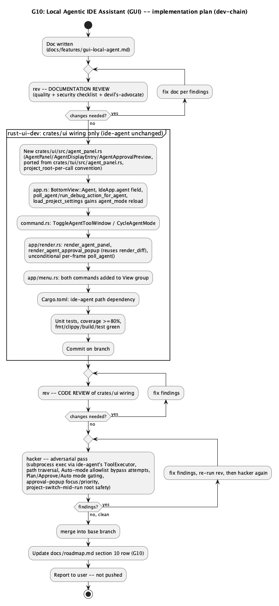

# G10: Local Agentic IDE Assistant (GUI)

## 1. Purpose

Ports [T56](tui-local-agent.md)'s local agentic assistant — the model
calling a fixed set of tools (read/search/list files, edit files, run
shell commands, read Docker logs, control an already-running debug
session) in a loop, gated by a `Plan`/`Approve`/`Auto` permission mode —
to the GUI. T56's own doc scoped this out explicitly, on direct user
instruction: *"lets make for both, but do not make it for UI, just add in
core crates and integrate in tui"* — the engine (`ide-agent`) was
deliberately built so a later GUI integration needs only its own thin UI
layer, not a redesign. [G9](gui-ai-orchestration.md) (the plain chat/FIM
port) left this explicitly out of its own scope and even flagged the
gap in its own row: *"Вне периметра — T56 ... `AiConfig.agent_mode`
читается транзитом, но не используется."* This feature closes that gap.

**Origin**: direct user request — *"gui have agentic panel?"* (no, TUI
only), followed by *"lets start this feature"*.

**What's genuinely new here vs. a mechanical port**: `ide-agent`
(`crates/agent`) is consumed **unchanged** — zero lines of `ide-agent`,
`ide-core`, `ide-ai`, or `ide-dap` change for this feature, the same
"engine reused as-is, only the frontend layer is new" shape G9 established
for `ide-ai`. Everything in this doc is `crates/ui/**`: a new
`crates/ui/src/agent_panel.rs` (state/logic, ported from
`crates/tui/src/agent_panel.rs`) plus `app.rs`/`command.rs`/
`app/render.rs`/`app/menu.rs` wiring. The one piece of real, non-mechanical
design work is §2.2's `AwaitingDebugExecution` handling and §3's
mode-persistence/project-switch timing — both differ from the TUI's shape
because `ide-ui`, unlike `ide-tui`, can switch projects mid-session and
has no project root at construction time.

**Pre-existing gap closed by this doc's own `CLAUDE.md` edit**: T56's own
doc (§4) declared its `hacker` pass "mandatory, and broader than T49/T55's"
— and a `hacker` pass was in fact run
(`docs/security-findings/tui-local-agent-2026-09-08.md`) — but
`crates/agent/**` and `crates/tui/src/agent_panel.rs` were never actually
added to the root `CLAUDE.md`'s security-sensitive-paths list. This is the
identical class of gap G9 found and closed for `crates/ai/**`/
`crates/sanitizer/**`. Closed here: `crates/agent/**`,
`crates/tui/src/agent_panel.rs`, and (new) `crates/ui/src/agent_panel.rs`
all added to that list as part of this doc landing.

**Implementation plan** — one role, `rust-ui-dev` (mirrors T56's own
collapsed single-role plan: no core-crate changes means no `rust-core-dev`
step; `ide-agent` needs no changes at all, so there's no `rust-tui-dev`
step either this time), mandatory `hacker`:



## 2. Interface / API

### 2.1 `crates/ui/src/agent_panel.rs` (new — `rust-ui-dev`)

Direct port of `crates/tui/src/agent_panel.rs`'s `AgentDisplayEntry`/
`AgentPreparedRequest`/`AgentPanel`/`describe_tool`/`describe_result`/
`truncate_for_display`/`run_agent` — same types, same `ide_agent::
{AgentEvent, AgentHandle, AgentLoop, AgentTool, DebugAction, DoneReason,
ToolError, ToolExecutor, ToolResult}` and `ide_ai::{classify_task_role,
decide_threshold, mask_outgoing, resolve_role_route, AiConfig, ChatMessage,
ChatRole, PermissionMode, TaskRole}` imports, same one-thread-per-request/
`mpsc`-drained-by-`poll` shape, same masking/role-routing reuse (T56 §3.3,
unchanged). `AgentEvent::ToolFinished`'s real, unmasked `ToolResult` is
shown as-is locally exactly like the TUI (masking only ever applies to
what `AgentLoop` re-sends to the model); no `restore_originals` pass on
displayed model text, same accepted v1 simplification T56 already made.

One real signature deviation, and one real behavioral addition, both
driven by the same root cause — `ide-ui` has no project root at
construction time and can switch projects mid-session, neither of which
`ide-tui` ever does:

```rust
pub struct AgentPanel {
    pub mode: PermissionMode,
    pub input: String,
    pub history: Vec<AgentDisplayEntry>,
    chat_history: Vec<ChatMessage>,
    current_model_text: String,
    streaming: bool,
    handle: Option<AgentHandle>,
    rx: Option<Receiver<AgentEvent>>,
    pub pending_approval: Option<AgentTool>,
    runner: AgentRunner,
    // No `root: PathBuf` field (TUI has one) -- every method that needs
    // the project root takes `project_root: &Path`, this crate's
    // established convention (`AiPanel`, `CargoPanel`, `CustomActionsPanel`).
}

impl Default for AgentPanel {
    /// `mode` starts at `PermissionMode::Plan` (the safe default), not
    /// loaded from any project's `.ide/ai.json` -- there may be no
    /// project open yet at construction time (`IdeApp::new`'s
    /// `initial_project: Option<PathBuf>`). The real per-project mode is
    /// loaded into `self.mode` by `load_project_settings` (§2.3), the
    /// established hook every other project-scoped panel setting already
    /// uses (`self.custom_actions.actions = custom_actions::load(root)`
    /// is the exact precedent).
    fn default() -> Self { Self::with_runner(run_agent) }
}

impl AgentPanel {
    pub(crate) fn with_runner(runner: AgentRunner) -> Self;
    pub fn is_in_flight(&self) -> bool;
    pub fn cancel(&mut self);

    /// Cycles `Plan -> Approve -> Auto -> Plan` and persists to
    /// `.ide/ai.json` via the given root (fail-open write, matching
    /// `custom_actions.rs`'s convention) -- `project_root: &Path` per
    /// call, not a cached field.
    pub fn cycle_mode(&mut self, project_root: &Path);

    /// Appends the prompt to history and spawns the background run.
    /// No-op on a blank prompt or while a run is already in flight.
    /// `project_root: &Path` per call, read synchronously (via
    /// `ToolExecutor::new`/`AiConfig::load`) before anything is spawned --
    /// the exact same "fully synchronous `prepare`, no stale-root race"
    /// shape `AiPanel::submit` already established and `hacker` already
    /// verified clean for it (`docs/security-findings/
    /// rust-ui-dev-gui-ai-orchestration-2026-09-08.md`).
    pub fn submit(&mut self, prompt: String, project_root: &Path);

    pub fn approve_pending(&mut self);
    pub fn deny_pending(&mut self);
    pub fn resolve_debug(&mut self, result: Result<String, ToolError>);

    /// `EditFile` -> `Option<ide_core::FileDiff>` via `ide_core::
    /// diff_text` (not TUI's `Vec<String>` of pre-flattened lines --
    /// `app/render.rs` already has a real diff-rendering function,
    /// `render_diff(ui, tokens, diffs: &[FileDiff])`, used for the
    /// refactor-preview/workspace-edit popups; the approval popup reuses
    /// it directly instead of TUI's plain-text `diff_to_lines`).
    /// `RunShellCommand`/`DebugControl`/everything else: same one-line
    /// `describe_tool` string TUI already produces.
    pub fn pending_approval_preview(&self) -> AgentApprovalPreview;

    pub fn poll(&mut self) -> Option<DebugAction>;
}

/// `EditFile`'s preview needs a real `FileDiff` for `render_diff`;
/// everything else is one descriptive line -- both cases the same popup
/// renders, so this replaces TUI's `Vec<String>` with an enum rather than
/// stringifying the diff too.
pub enum AgentApprovalPreview {
    Diff(Box<ide_core::FileDiff>),
    Text(String),
    /// `EditFile` targeting a path `ide_core::diff_text` returns no
    /// textual diff for (e.g. binary content) -- same fallback TUI's
    /// `"EditFile {path} (no textual diff)"` line covers, kept as its own
    /// variant here instead of collapsing into `Text` so `render_diff`
    /// is never handed a diff-shaped `Text` string to mis-render.
    NoDiff(String),
}
```

`describe_tool`/`describe_result`/`truncate_for_display`/
`MAX_DISPLAY_RESULT_CHARS`/`run_agent` port verbatim (identical logic, no
signature change needed — `run_agent` never touches `project_root`, it
only consumes the already-resolved `AgentPreparedRequest` `submit` built).

### 2.2 `crates/ui/src/app.rs` (`rust-ui-dev`)

- `BottomView` gains a tenth variant, `Agent` (`Ai` was the ninth, G9).
- `IdeApp` gains `agent: crate::agent_panel::AgentPanel`.
- **No new field for a paused-debug-execution flag.** Unlike TUI (whose
  main loop calls `poll_agent()` once per tick as a distinct step outside
  `eframe`'s per-frame draw), `ide-ui`'s equivalent is a new `poll_agent`
  method called from the same unconditional per-frame poll block G9 added
  `self.ai.poll()`/`self.poll_fim()` to (`app/render.rs`, §2.4):

  ```rust
  /// Mirrors `crates/tui/src/app.rs::poll_agent` exactly: drains
  /// `self.agent`'s event channel, and for the one event the panel can't
  /// resolve itself (`AwaitingDebugExecution`) runs the action against
  /// this struct's own real `self.debug: DebugPanel` session on this
  /// (the only) thread `IdeApp` ever runs on, then resolves it before
  /// the next poll tick. Returns whether anything changed, so the caller
  /// can `ctx.request_repaint()` -- the one shape difference from TUI's
  /// `poll_agent`, which has no repaint concept to report back.
  fn poll_agent(&mut self) -> bool {
      let Some(action) = self.agent.poll() else { return false; };
      let result = self.run_debug_action_for_agent(action);
      self.agent.resolve_debug(result);
      true
  }

  /// Byte-for-byte the same mapping as `ide-tui`'s own
  /// `run_debug_action_for_agent` -- `ToggleBreakpoint` works with no
  /// active session, every other variant requires one
  /// (`ToolError::NoDebugSession` otherwise). Verified `crates/ui/src/
  /// debug_panel.rs` has the identical seven methods by name
  /// (`resume`/`step_over`/`step_into`/`step_out`/`pause`/`stop`/
  /// `toggle_breakpoint`, plus `is_active()`) T56's own round-4 review
  /// verified for the TUI's `DebugPanel` -- this doc does the same
  /// verification for the GUI's, not assumed from the method names.
  fn run_debug_action_for_agent(
      &mut self,
      action: ide_agent::DebugAction,
  ) -> Result<String, ide_agent::ToolError> { /* identical body to ide-tui's */ }
  ```

- `load_project_settings` (§2.1's `Default` note above) gains one line:
  `self.agent.mode = ide_ai::AiConfig::load(root).agent_mode;` — the
  project-scoped reload every other panel setting already gets there
  (`self.custom_actions.actions = ...`, `self.theme = ...`). This is the
  one line this feature adds to that function; G9's own `ai_panel.rs` port
  needed none, since `AiPanel` caches no project-scoped setting on itself.
- `current_agent_approval` (mirrors `current_ai_context`'s shape, not a
  new pattern): reads `self.agent.pending_approval_preview()` for
  `render_agent_approval_popup` to draw.
- Two new commands (§2.3) get `run_command`/`is_command_enabled` arms:
  `ToggleAgentToolWindow` (enabled whenever `self.project.is_some()`, same
  gate `ToggleAiToolWindow` uses) and `CycleAgentMode` (same gate, plus a
  no-op if no project is open since `cycle_mode` needs a root to persist
  to — mirrors `TriggerFimAutocomplete`'s `active_tab.is_some()`-style
  precondition check).

### 2.3 `crates/ui/src/command.rs` (`rust-ui-dev`)

Two new `CommandAction` variants + `Command` entries:
- `ToggleAgentToolWindow` — category `Window`, binding `None` (mirrors
  `ToggleAiToolWindow`).
- `CycleAgentMode` — category `View`, binding `None` (mirrors
  `ToggleTheme`'s category — both are "cycle through more than two states"
  commands, `ToggleTheme` is this crate's only existing precedent for
  that shape).

Approve/Deny are **not** commands — mouse-only buttons on the approval
popup, the same non-palette treatment every other confirm popup in this
crate already gets (`render_discard_confirm_popup`'s `Discard`/`Cancel`
buttons are plain `ui.button(...)` clicks, never registered `CommandAction`
variants).

### 2.4 `crates/ui/src/app/render.rs` (`rust-ui-dev`)

- Bottom-panel tab row gains a tenth tab, "Agent"; `match self.bottom_view`
  gains `BottomView::Agent => self.render_agent_panel(ctx, ui)`.
- `render_agent_panel`: mirrors `render_ai_panel`'s structure (scrollable
  history, input row, Send button + Enter-to-submit) with two additions —
  a mode indicator/cycle button in the header (`ui.button(format!("Mode:
  {:?}", self.agent.mode))`, click calls `self.agent.cycle_mode(&root)`),
  and `AgentDisplayEntry` has five variants to render instead of `AiPanel`'s
  three (`User`/`ModelText`/`ToolStarted`/`ToolFinished`/
  `ToolCallParseFailed` — `ToolStarted`/`ToolFinished`/
  `ToolCallParseFailed` each get their own `ui.label`/`ui.colored_label`,
  matching T56's TUI rendering of the same five cases one-for-one).
- New `render_agent_approval_popup(&mut self, ctx: &egui::Context)`,
  added to the same unconditional-every-frame popup block
  `render_discard_confirm_popup`/`render_branches_popup`/
  `render_worktrees_popup` already sit in (`app/render.rs`, ~line 5134):
  early-returns if `self.agent.pending_approval` is `None`; otherwise an
  `egui::Window::new("Approve agent action?")` showing
  `pending_approval_preview()`'s content (`AgentApprovalPreview::Diff` via
  the existing `Self::render_diff(ui, tokens, &[*diff])`; `Text`/`NoDiff`
  via `ui.label`) with `Approve`/`Deny` buttons calling
  `self.agent.approve_pending()`/`self.agent.deny_pending()`.
- `self.poll_agent()` (§2.2) added to the same unconditional per-frame
  poll block `self.ai.poll()`/`self.poll_fim()` sit in — not gated on the
  Agent tab being visible, same rationale G9 already established for
  `AiPanel` (a paused-on-approval or actively-tool-calling run must keep
  draining regardless of which dock tab is on screen, so a background
  request never silently stalls while the user is looking at a different
  panel).

### 2.5 `crates/ui/src/app/menu.rs` (`rust-ui-dev`)

`ToggleAgentToolWindow` goes in the "View" group's `ToggleXToolWindow`
cluster (after `ToggleAiToolWindow`); `CycleAgentMode` goes in the "View"
group immediately after `ToggleTheme` (same category, same "cycle a
mode" shape). Both required by `every_non_build_command_appears_in_the_
native_menu_exactly_once`.

### 2.6 `crates/ui/Cargo.toml`

One new path dependency: `ide-agent = { path = "../agent" }`. No new
external crates — `ide-agent` brings nothing `ide-ui` doesn't already
depend on transitively via `ide-core`/`ide-ai`/`ide-dap` (all three
already GUI dependencies since the debugger (T27/`ide-dap`) and G9
(`ide-ai`) features).

## 3. Behaviour

Identical to [T56 §3](tui-local-agent.md#3-behaviour) in every respect
that doesn't depend on which thread owns the UI loop: permission-mode
table (§3.1), loop termination (§3.2, `MAX_AGENT_STEPS`/step-limit
summarization), sanitizer/role-routing reuse (§3.3, unchanged — `ide-ai`
doesn't know or care which frontend called it), and the `Auto`-mode
shell-command allowlist (§3.4, entirely inside `ide-agent`, untouched by
this port). Nothing in this doc redefines any of those; `ide-agent` is
the single source of truth for all four and this feature adds no
frontend-side copy of any of that logic.

The one behavioral point genuinely specific to the GUI: **project-switch
timing**. If the user switches the open project while an agent run is in
flight, that run keeps executing against the project root it was
`submit`-ted with (`ToolExecutor` already canonicalized that root at
construction, §2.1 of T56) — switching projects mid-run does not redirect
a live tool call to the new project, matching `AiPanel`'s already-verified
`project_root`-per-call safety property. `self.agent.mode` in the panel
header, however, *does* visibly change to the new project's persisted
mode the moment `load_project_settings` runs (§2.2) — a run already in
flight keeps using the `PermissionMode` it was constructed with regardless
(`AgentLoop::new(self.mode, ..)` captures it once, at `submit` time,
same as T56's TUI panel already does), so an in-flight run's gating never
silently changes mid-run even though the header label might.

## 4. Constraints and invariants

Every constraint in [T56 §4](tui-local-agent.md#4-constraints-and-invariants)
applies unchanged — no shell ever, every path validated via
`ide_dap::path::validate_path`/the `EditFile`-parent-canonicalization
carve-out, bounded resources (`MAX_AGENT_STEPS`/`MAX_TOOL_RESULT_CHARS`),
one tool call at a time, `ide-agent` never launches a debug session (only
controls one a human already started), and indirect prompt injection is
the same named, accepted residual risk in `Auto` mode. This doc adds
nothing to that list and removes nothing from it — `ide-agent` is
consumed as a sealed unit.

One GUI-specific addition: **the approval popup must render before any
other input in the frame reaches the agent panel's own input field** —
mirrors T56's TUI requirement that the approval popup "outrank every
other check" for keyboard focus (`crates/tui/src/app.rs`'s `pending_
approval.is_some()` early-return ahead of every other key-dispatch path).
In `egui`, an `egui::Window` already captures pointer/keyboard focus while
open by default, so this is enforced by the widget itself rather than a
hand-written priority check — worth stating explicitly rather than
assuming it's automatic, since `hacker`/`rev` should confirm this
(§ Constraints for the review, not a runtime assertion this doc adds).

`hacker` pass mandatory, same reasoning as T56 §4: this is the first GUI
feature where a model's own output can directly cause subprocess execution
and file mutation, and `Auto` mode is a supported "no confirmation at all"
configuration. `crates/ui/src/agent_panel.rs` is added to `CLAUDE.md`'s
security-sensitive-paths list as part of this doc landing (§1).

## 5. Examples

Identical scenarios to [T56 §5](tui-local-agent.md#5-examples) — Approve
mode editing a file, Plan mode refusing a mutation, Auto mode falling back
to approval for a non-allowlisted shell command, Auto mode controlling an
already-running debug session, Plan mode refusing `DebugControl` with no
session — all reproduce identically in the GUI, since `ide-agent` drives
every one of those decisions and is unchanged. The only GUI-specific
difference is presentation: the approval popup is a mouse-driven
`egui::Window` with Approve/Deny buttons instead of a `y`/`n` keyboard
prompt, and the diff preview is `render_diff`'s real syntax-aware diff
view instead of TUI's plain-text `@@ -n +n @@`/`+`/`-` lines.

## 6. Dependencies & integration points

- `ide-agent`: consumed via its existing public API (`AgentEvent`,
  `AgentHandle`, `AgentLoop`, `AgentTool`, `DebugAction`, `DoneReason`,
  `ToolError`, `ToolExecutor`, `ToolResult`) — zero changes to this crate.
- `ide-ai`: `Router`/`ChatMessage`/`ChatRole`/`PermissionMode`/`AiConfig`
  (already a GUI dependency since G9), plus T49/T55's masking/role-routing,
  reused unchanged exactly as `ide-agent` itself already reuses them.
- `ide-core`: `diff_text`/`FileDiff` (already used elsewhere in
  `app.rs`/`app/render.rs` for refactor/workspace-edit previews);
  `project_settings::write`/`read` for `agent_mode` persistence (already
  a GUI dependency via `custom_actions.rs`/`app.rs`'s existing preference
  persistence).
- `ide-dap`/`crates/ui/src/debug_panel.rs`: `DebugPanel`'s seven existing
  methods (`resume`/`step_over`/`step_into`/`step_out`/`pause`/`stop`/
  `toggle_breakpoint`, plus `is_active()`), called from `app.rs`'s
  `run_debug_action_for_agent` exactly like the human-facing debug
  keybindings already call them — no new `DebugPanel` methods needed.
- No new external crate dependencies (§2.6).

## Revision notes

None yet — first draft, not yet reviewed.
