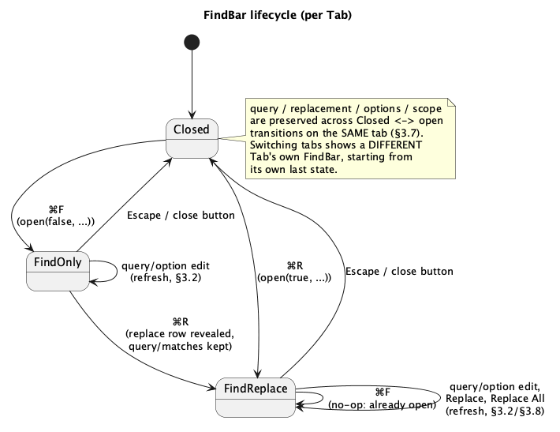

# In-Buffer Find & Replace

## 1. Purpose

Every other editing surface in this IDE already has some form of search
(`⌘⇧F` "Find in Path" walks the whole project, `⌃G` add-next-occurrence
drives multi-cursor selection), but there is still no way to search *within
the file currently open in a tab* — no highlighting of matches, no replace,
no `⌘F`. `docs/roadmap.md` §2.1/§7 calls this out explicitly (item **A5**)
as the next gap to close after the file watcher (**G6**), and flags the
search engine underneath it as the piece **C7** ("search-in-path v2") will
later reuse for a regex-and-glob-aware project-wide search.

This phase adds:

- A find/replace panel docked above the active tab's editor: `⌘F` opens
  find-only, `⌘R` opens with the replace row visible too.
- Case-sensitive, whole-word and regex match modes, and an "in selection"
  scope restriction.
- Match navigation (`⌘G` / `⌘⇧G`) and a "N of M" counter.
- Every match highlighted in the visible text, plus a marker strip next to
  the scrollbar showing where matches sit in the whole file.
- Replace (current match) and Replace All, both going through the buffer's
  existing undo-able transaction machinery — a replace is one more entry on
  the same undo stack as typing, never a special case.

`crates/core/src/text/find.rs`'s own module doc already anticipated this:
*"A3 [multi-cursor add-occurrence] is case-sensitive and literal on
purpose: A5 is the phase that adds case-insensitivity and regex."* This
phase does not touch that module — `text::find` stays exactly as it is,
serving A3's occurrence commands; this phase adds a separate, richer engine
next to it for the find/replace panel (see §7).

### 1.1 Scope

In scope: the search/replace engine (`ide-core`), the panel UI, match
highlighting, scrollbar markers, and the four keybindings above.

Out of scope, explicitly deferred:

- Project-wide find/replace (**C7** upgrades `crate::search`'s existing
  `search_tree`, reusing this phase's regex engine, but that is a separate
  future doc).
- Regex capture-group replacement beyond the `regex` crate's own built-in
  `$1`/`$name` substitution syntax in the replacement string — no custom
  transform language.
- Persisting search history across app restarts, or a "search in file
  history" dropdown — v1 remembers the last query only within the running
  session (§3.7).
- Look-ahead/look-behind regex syntax: the `regex` crate is deliberately
  non-backtracking (linear-time matching, no catastrophic-backtracking
  DoS) and does not support either construct. A pattern that uses one
  fails to compile like any other invalid pattern (§3.3) — this is a
  property of the crate, not a gap this phase works around.

## 2. Interface / API

### 2.1 `ide_core`: the search engine (new, `crates/core/src/buffer_search.rs`)

```rust
/// Ceiling on how many matches one `find_matches`/`replace_all` call
/// reports/replaces. Buffer content is file content, i.e. untrusted, and a
/// one-character literal query against a large file yields hundreds of
/// thousands of matches -- which the panel would try to highlight, list on
/// a scrollbar, and (for Replace All) fold into one gigantic transaction.
/// Same value, same reasoning as `text::find::MAX_OCCURRENCES` and
/// `crate::search::MAX_SEARCH_RESULTS` -- each of those modules keeps its
/// own copy of this constant rather than sharing one, and this module
/// follows that existing precedent rather than introducing a shared one.
pub const MAX_SEARCH_MATCHES: usize = 1000;

#[derive(Debug, Clone, Copy, PartialEq, Eq, Default)]
pub struct SearchOptions {
    pub case_sensitive: bool,
    pub whole_word: bool,
    pub regex: bool,
}

/// The result of one `find_matches` call. A named struct rather than a
/// `(Vec<Range<usize>>, bool)` tuple for the same reason
/// `crate::search::SearchResults` (`crates/core/src/search.rs`) already
/// exists for the identical "matches + truncated" shape -- this module
/// follows that precedent instead of introducing a second, positional way
/// to say the same thing (a bare `.1` for "was this truncated" is easy to
/// transpose with `.0`).
#[derive(Debug, Clone, PartialEq, Eq)]
pub struct MatchResults {
    pub matches: Vec<Range<usize>>,
    /// `true` if [`MAX_SEARCH_MATCHES`] was reached and the scan stopped
    /// early.
    pub truncated: bool,
}

/// The result of one `replace_all` call.
#[derive(Debug, Clone, PartialEq, Eq)]
pub struct ReplaceResult {
    pub transaction: Transaction,
    /// Same meaning as [`MatchResults::truncated`]: `true` means matches
    /// beyond [`MAX_SEARCH_MATCHES`] exist and were not included in
    /// `transaction`.
    pub truncated: bool,
}

#[derive(Debug, thiserror::Error, PartialEq, Eq)]
pub enum SearchQueryError {
    /// Carries `regex::Error`'s own `Display` output verbatim -- it already
    /// names the offending part of the pattern, which is exactly what a
    /// user typing a regex into the panel needs to see.
    #[error("invalid pattern: {0}")]
    InvalidRegex(String),
}

/// A compiled, ready-to-search query. Opaque on purpose: callers never
/// match on its variants, only pass it to `find_matches`/`replace_one`/
/// `replace_all` and recompile a new one when the query string or options
/// change (compiling is cheap enough to do on every keystroke -- the panel
/// does exactly that, §3.1).
pub struct SearchQuery { /* private */ }

impl SearchQuery {
    /// Compiles `pattern` under `options`. Empty `pattern` always succeeds
    /// and matches nothing (`find_matches` on it returns an empty
    /// `MatchResults`) -- mirrors
    /// `text::find::all_occurrences`'s existing "empty needle -> empty
    /// result" contract, so an empty search field never errors, it just
    /// shows no matches.
    ///
    /// `options.regex` selects the engine: `false` compiles `pattern` as a
    /// literal substring (`options.case_sensitive` controls case folding);
    /// `true` compiles it as a `regex::Regex`, and a syntax error is
    /// reported via `SearchQueryError::InvalidRegex`. `options.whole_word`
    /// applies identically to both engines as a post-match filter (§3.4),
    /// not by mangling the pattern.
    pub fn compile(pattern: &str, options: SearchOptions) -> Result<Self, SearchQueryError>;
}

/// Every non-overlapping match of `query` in `text`, left to right, at most
/// [`MAX_SEARCH_MATCHES`] of them. `scope`, if given, restricts results to
/// matches fully contained within that byte range -- but the search still
/// runs over the *whole* `text`, then filters (§3.5), so a regex's word
/// boundaries and lookaround-free context are computed correctly regardless
/// of where `scope` cuts. `MatchResults::truncated` is `true` when the cap
/// was hit, so a match beyond the 1000th is known to exist but not
/// enumerated.
///
/// **Zero-width matches are excluded** (e.g. a regex like `x*` or `^` can
/// otherwise match an empty range). A highlight with no width is not a
/// useful, clickable, or replaceable target, and most editors' Find boxes
/// don't surface these either -- excluding them outright avoids the
/// question of how `paint_search_matches` (§3.6) would render a rect with
/// zero width, and how the whole-word filter (§3.4) would evaluate a
/// "before" and "after" character that are the same neighbouring pair on
/// both sides of a single point.
pub fn find_matches(
    text: &str,
    query: &SearchQuery,
    scope: Option<Range<usize>>,
) -> MatchResults;

/// Builds the one-`Change`-per-match `Transaction` that replaces every
/// match of `query` in `text` with `replacement`, honouring `scope` and the
/// zero-width exclusion exactly as `find_matches` does. `None` when there is
/// nothing to replace (no matches in scope) -- the caller must not call
/// `Buffer::apply` on an empty result, so it never pushes a no-op undo step
/// (mirrors `Transaction::is_empty`'s existing role elsewhere in this
/// crate). Capped at `MAX_SEARCH_MATCHES` matches per call, same as
/// `find_matches` -- `ReplaceResult::truncated` carries the same meaning as
/// `MatchResults::truncated`, so a caller can tell the user "replaced 1000
/// of 1000+ matches, run Replace All again" rather than silently replacing
/// only part of the file with no signal (`file-watcher.md`'s "never
/// silence" precedent, applied here to replacement too).
///
/// When `query` is a regex, `replacement` is expanded through
/// `regex::Regex`'s own `$1`/`${name}` capture-group syntax; a literal `$`
/// that isn't part of a capture reference must be written `$$` (the
/// `regex` crate's own escaping rule -- this function does not add a
/// second one). When `query` is a literal (non-regex) query, `replacement`
/// is inserted verbatim, `$` included -- there are no capture groups to
/// expand.
pub fn replace_all(
    text: &str,
    query: &SearchQuery,
    replacement: &str,
    scope: Option<Range<usize>>,
) -> Option<ReplaceResult>;

/// Builds a one-`Change` `Transaction` replacing exactly `range` with
/// `replacement`, applying `replace_all`'s same `$1`-expansion rule when
/// `query` is a regex. `range` is trusted to be a match `query` actually
/// produced against this same `text` (typically the panel's own "current
/// match," from the last `find_matches` call) -- like `Transaction::replace`,
/// this function does not re-verify that, it only builds the edit.
///
/// Takes `text`, unlike `find_matches`/`replace_all`'s other read-only
/// helpers might suggest is unnecessary here: expanding a regex
/// capture-group reference (`$1`) requires knowing what was actually
/// captured at `range`, which only the source text can answer. Internally
/// this re-derives the match's `Captures` via `Regex::captures_at(text,
/// range.start)` -- searching the *real* `text` starting from the match's
/// known start -- rather than `Regex::captures` against an isolated
/// `&text[range]` slice. That isolated-slice approach looks equivalent but
/// silently breaks any context-dependent zero-width assertion: `\B`
/// (matches only where there is *no* word boundary) can be true in `range`
/// only because of a character just outside it, and re-checking `\B`
/// against a standalone copy of just the matched text strips that context
/// -- position 0 of any standalone string starting with a word character
/// always reads as a boundary, so `\B` would wrongly fail there even though
/// it held in the original text. `captures_at` avoids this because it
/// searches the real, full `text`, just starting the scan later.
pub fn replace_one(
    text: &str,
    query: &SearchQuery,
    range: Range<usize>,
    replacement: &str,
) -> Transaction;
```

Re-exported at the crate root: `pub use buffer_search::{find_matches,
replace_all, replace_one, MatchResults, ReplaceResult, SearchOptions,
SearchQuery, SearchQueryError, MAX_SEARCH_MATCHES};`

### 2.2 `ide-ui`: state (new, `crates/ui/src/find_bar.rs`)

```rust
/// Per-tab find/replace session -- one `FindBar` per `Tab`, not one shared
/// by the whole app, because "3 of 17" and "which match is current" are
/// meaningless once you're not looking at the buffer they were computed
/// against (§3.7 covers what *does* carry over between tabs).
#[derive(Default)]
pub struct FindBar {
    open: bool,
    replace_open: bool,
    query: String,
    replacement: String,
    options: SearchOptions,
    /// Restrict matches to the selection active when the bar was opened or
    /// "In Selection" was turned on (§3.5). `None` means "whole buffer."
    scope: Option<Range<usize>>,
    matches: Vec<Range<usize>>,
    truncated: bool,
    /// Index into `matches` of the current match, `None` when `matches` is
    /// empty.
    current: Option<usize>,
    /// Set when `query`, compiled with `regex: true`, fails to parse.
    /// Cleared on the next successful compile. Mutually exclusive with a
    /// non-empty `matches` -- a query that doesn't compile has no matches.
    error: Option<String>,
}

impl FindBar {
    pub fn is_open(&self) -> bool;
    /// Whether the replace row is showing.
    pub fn replace_open(&self) -> bool;

    /// Opens the bar. `with_replace` sets `replace_open`; opening an
    /// already-open bar with `with_replace: true` just reveals the replace
    /// row without resetting `query`/`matches` (§3.1's `⌘R`-on-open-bar
    /// case). `initial_query`, if `Some`, replaces `query` and re-searches
    /// (the "seed from selection" behaviour, §3.1); `None` leaves whatever
    /// query was already there (possibly from a previous session on this
    /// tab) and re-searches `text` with it, since `text` may have changed
    /// since the bar was last open.
    pub fn open(&mut self, with_replace: bool, initial_query: Option<String>, text: &str);

    /// Clears `matches`/`current`/`error` and `open`/`replace_open`.
    /// Deliberately keeps `query`/`replacement`/`options`/`scope` -- the
    /// next `open` on this tab starts from where this one left off (§3.7).
    pub fn close(&mut self);

    /// Recompiles and re-searches `text` with the current `query`/
    /// `options`/`scope`. Called after every edit to `query`, every toggle,
    /// and after `text` itself changes (an edit in the buffer, or a switch
    /// back to this tab after an external reload, §3.6). `near`, if given,
    /// picks the match `current` lands on (the first match at or after
    /// `near`, wrapping); `None` keeps `current` at the same match index if
    /// one still exists at that index, else `0` if `matches` is non-empty,
    /// else `None`.
    pub fn refresh(&mut self, text: &str, near: Option<usize>);

    pub fn set_query(&mut self, query: String, text: &str);
    pub fn set_replacement(&mut self, replacement: String);
    pub fn set_case_sensitive(&mut self, on: bool, text: &str);
    pub fn set_whole_word(&mut self, on: bool, text: &str);
    pub fn set_regex(&mut self, on: bool, text: &str);
    /// `Some(range)` turns scope restriction on with that range (typically
    /// the selection active the moment the checkbox was ticked); `None`
    /// turns it off. Either way, re-searches `text`.
    pub fn set_scope(&mut self, scope: Option<Range<usize>>, text: &str);

    pub fn query(&self) -> &str;
    pub fn replacement(&self) -> &str;
    pub fn options(&self) -> SearchOptions;
    pub fn is_scoped(&self) -> bool;
    pub fn matches(&self) -> &[Range<usize>];
    pub fn truncated(&self) -> bool;
    pub fn current_match(&self) -> Option<Range<usize>>;
    /// 0-based index for internal use; the panel displays `current_index()
    /// + 1` (§3.4's "3 of 17").
    pub fn current_index(&self) -> Option<usize>;
    pub fn error(&self) -> Option<&str>;

    /// Advances `current` to the next match, wrapping past the end.
    /// Returns the new current match, or `None` if `matches` is empty.
    pub fn next(&mut self) -> Option<Range<usize>>;
    /// Same, backward.
    pub fn prev(&mut self) -> Option<Range<usize>>;
}
```

### 2.3 `ide-ui`: `IdeApp`/`Tab` integration (`crates/ui/src/app.rs`)

```rust
pub struct Tab {
    // ... existing fields unchanged ...
    find: FindBar,
}

impl IdeApp {
    /// `⌘F`: opens the active tab's `FindBar` find-only, seeded from the
    /// active selection if non-empty (§3.1). No-op if there is no active
    /// tab.
    fn open_find(&mut self);
    /// `⌘R`: same, with the replace row shown.
    fn open_replace(&mut self);
    /// `Escape` while the bar owns focus, or its own close button (§3.6).
    fn close_find(&mut self);

    /// `⌘G`. No-op if the active tab's bar isn't open or has no matches.
    /// Moves the caret/selection to the new current match (§3.4).
    fn find_next(&mut self);
    /// `⌘⇧G`.
    fn find_previous(&mut self);

    /// The replace-row "Replace" button / `⏎` in the replacement field:
    /// replaces the current match, then advances to the next one (the
    /// match list is recomputed against the now-shorter/longer text, so
    /// "next" here means "next after the edit," not literally
    /// `current + 1` against a stale list). No-op if there is no current
    /// match.
    fn replace_current_match(&mut self);
    /// "Replace All". No-op if there are no matches. Reports the count
    /// replaced and whether it was capped (§2.1) through `self.error` when
    /// capped -- capping is not a failure, but the user must be told
    /// (§4.5), and `self.error`'s single-line-message slot is the existing
    /// channel this app already uses for exactly that shape of notice
    /// (`file-watcher.md` §3.6 uses it the same way for a non-fatal
    /// degradation).
    fn replace_all_matches(&mut self);
}
```

## 3. Behaviour

### 3.1 Opening the bar

`⌘F` calls `open_find`; `⌘R` calls `open_replace`. Both read the active
tab's current selection: if it is non-empty **and** does not span a
newline (a multi-line seed is almost never what the user wants to search
for, and would make the panel's own text field wrap awkwardly), its text
becomes `initial_query`. Otherwise `initial_query` is `None` and
`FindBar::open` reuses whatever `query` this tab's bar already had (empty,
on a tab that has never had the bar open before).

Opening always focuses the query text field (`egui::Response::request_focus`
on the panel's first frame after `open` transitions `false -> true`, or
after `with_replace` flips a bar that was already open) -- a find bar you
have to click into before typing is not the JetBrains behaviour this
project follows.

`⌘R` on an already-open find-only bar reveals the replace row without
closing/reopening -- `FindBar::open` with `with_replace: true` is
idempotent in that sense: calling it twice in a row, or once after `⌘F`,
converges to the same state (`open: true, replace_open: true`).

### 3.2 Live search as you type

There is no explicit "search" button or Enter-to-search step: every
keystroke in the query field calls `set_query`, which recompiles and
re-searches immediately, the same "type and see results now" shape
`search_panel.rs`'s project-wide search debounces over a background thread
for (because that one walks the filesystem); this one runs synchronously
against a single in-memory `&str` (a file this app has already read
through `Buffer::open`'s existing `MAX_OPEN_BYTES` cap, §4.8), which is
fast enough that no debounce or background thread is needed. Toggling
case-sensitive/whole-word/regex/in-selection re-searches the same way.

### 3.3 Match modes

- **Plain (default)**: substring search. Case-insensitive unless
  `case_sensitive` is on -- ASCII and Unicode case-folding both go through
  the same `str::to_lowercase`-based approach `crate::search::search_tree`
  already uses (including its `char_indices`-based scan that keeps a
  Unicode length-changing fold like `'İ' -> "i̇"` from desyncing byte
  offsets, §2.1 of that module's own doc comment) -- this phase's plain
  mode reuses that exact technique rather than inventing a second one, so
  the two "case-insensitive substring in text" implementations in this
  codebase agree on edge cases.
- **Regex**: compiled via `regex::Regex::new` (case-insensitivity via the
  pattern's `(?i)` flag, set automatically when `case_sensitive` is off
  rather than requiring the user to type it). A pattern that fails to
  compile — including one using `\b`-adjacent Unicode-class syntax the
  crate doesn't support, or any look-around, which it never supports — sets
  `FindBar::error` to the crate's own error message and leaves `matches`
  empty; it is not a panic and not silently treated as "no matches," the
  distinction is visible in the panel (§3.4).

### 3.4 Whole word

Applies identically to both modes as a post-match filter, not a pattern
rewrite: a raw match is kept only if the character immediately before its
start (if any) and the character immediately after its end (if any) are
both *not* `char::is_alphanumeric() || c == '_'` — the exact predicate
`crates/core/src/text/selection_hierarchy.rs::word_at` already uses for
double-click word selection, redefined locally in `buffer_search.rs` rather
than imported, since `word_at` returns a range around an offset and this
needs a boundary predicate, a different enough shape that sharing a
function would mean one of the two reaching into the other's internals for
no real reuse. A match at the very start or end of `text` has no neighbour
on that side, which always passes (there's nothing there to be a
word-character).

### 3.5 Scope ("In Selection")

Ticking "In Selection" calls `set_scope(Some(selection.range()), text)`
with whatever the active selection is *at that moment*; it is a snapshot,
not a live-tracked range -- editing the buffer afterward does not move the
scope boundary (consistent with `FindBar::refresh` being buffer-content-
aware but not selection-aware). Unticking, or ticking with an empty/no
selection, calls `set_scope(None, text)`.

`find_matches`/`replace_all` (§2.1) always run the query over the *whole*
`text` and filter matches to ones fully contained in `scope` afterward --
never by slicing `text[scope]` and searching that substring, because a
sliced search sees different regex context at the cut boundary (e.g. `\b`
right at the slice's start behaves as if `text` began there, which is
wrong when there was a word character immediately before the slice in the
real buffer).

### 3.6 Navigation and highlighting

Every match in `FindBar::matches` is painted as a background highlight
behind the text (`search_match_bg`, a new `Colors` token, §7), the same
"draw a rect behind this byte range on every visible line it touches"
technique `CodeEditor`'s existing `paint_selections` already uses for
selection highlighting (`crates/ui/src/editor/mod.rs`) — extended with a
new `search_matches: &[Range<usize>]` + `current_match_index: Option<usize>`
pair of fields threaded through the same builder-method pattern
`.diagnostics(...)`/`.link(...)` already use, and a new
`paint_search_matches` method mirroring `paint_selections`'s per-line
clipping logic. The current match gets a second, more prominent token
(`search_match_current_bg`, §7) painted on top, exactly as
`bracket_match_bg` already gets its own token distinct from
`selection_bg` for the same "has to stay visually distinct from an
ordinary highlight" reason (`crates/ui/src/theme/mod.rs`'s existing
comment on `bracket_match_bg`).

`⌘G`/`⌘⇧G` (`find_next`/`find_previous`) call `FindBar::next`/`prev`, then
set the *editor's real selection* to the new current match — not a
separate visual-only cursor — via the same mechanism `CodeEditor`'s
existing `goto_offset` builder param uses to place a caret and scroll it
into view (`crates/ui/src/editor/mod.rs`), generalised from a bare caret
offset to a range: the new current match becomes
`Selections::single(Selection::new(range.start, range.end))` and
`state.pending_scroll` is set to `range.start`, so the match is both
selected (visibly, and ready to be overtyped or replaced) and scrolled
into view, matching what every JetBrains IDE's Find Next already does.
Wrapping past the last match goes to the first, and vice versa, mirroring
`text::find::next_occurrence`'s existing wrap-around contract.

A thin marker strip is painted along the right edge of the editor's
viewport (not inside egui's own `ScrollArea` scrollbar widget — stock egui
does not expose a hook to draw inside it — a separate narrow overlay column
the editor paints itself, at `viewport.right() - marker_width`). Each match
in `matches` becomes one short tick at
`viewport.top() + (line_of(match.start) / total_lines) * viewport.height()`,
in `search_match_bg`; the current match's tick uses
`search_match_current_bg` and is drawn last (on top) so it's never hidden
under an ordinary tick at the same proportional position.

### 3.7 The counter and errors

The panel shows, immediately right of the query field:

- `"{current_index + 1} of {matches.len()}{+ if truncated}"` when
  `!matches.is_empty()` (e.g. `"3 of 17"`, or `"412 of 1000+"` when
  `truncated`);
- `"No matches"` when `matches.is_empty()` and `error.is_none()` and
  `!query.is_empty()`;
- nothing extra when `query.is_empty()`;
- `error`'s text (in the danger colour, §7) when `Some`, replacing the
  count entirely -- a query that fails to compile has no meaningful match
  count.

Closing the bar (`Escape`, or its own close button) does **not** clear
`query`/`replacement`/`options`/`scope` — the next `⌘F`/`⌘R` on the *same
tab* reopens with all of that intact, so toggling the bar to glance at code
and back doesn't lose a half-typed search. Switching tabs is a harder
boundary: each `Tab` owns its own `FindBar`, so a different tab's bar
starts from whatever it was last left at (empty, the first time), never
copying another tab's query. Closing a tab drops its `FindBar` along with
the rest of the `Tab`.

### 3.8 Replace

`replace_current_match` (the replace row's "Replace" button, or `⏎` in the
replacement field): builds `replace_one(text, query, current_match_range,
replacement)` and applies it via `Buffer::apply` — one undo step, exactly
like a normal edit. After applying, `FindBar::refresh(new_text,
Some(old_match_start))` recomputes matches against the now-changed buffer
and lands `current` on the next match at or after where the replaced one
used to start (if the replacement text itself still matches the query —
e.g. replacing `"foo"` with `"foobar"` under a plain-text `"foo"` query —
the very next match found there may be the tail end of what was just
inserted; this is the same "did I just replace into a new match"
edge case every find/replace UI has, and this phase does not special-case
it beyond what a straightforward re-search naturally produces: refresh
sees the buffer as it now stands, no memory of what was just replaced).

`replace_all_matches` (the "Replace All" button, or `⌘⇧R` as a
`CommandAction::ReplaceAll` global command -- added after this phase
originally shipped with no keyboard binding for it at all; JetBrains'
real macOS keymap does bind `⌘⇧R` to Replace All, so per this project's
"never invent a binding, use the real one" rule the button-only original
scope was a gap, not a deliberate cut. Gated the same as `Find`/`Replace`
(`self.active_tab.is_some()`); the underlying method's own existing
no-matches no-op means invoking it with the bar closed or empty is
harmless): builds
`replace_all(text, query, replacement, scope)`. `None` (no matches) is a
no-op. `Some(ReplaceResult { transaction, truncated })` applies the transaction via
`Buffer::apply` — one undo step for the *entire* replace-all, not one per
match, so `⌘Z` immediately after undoes all of it at once — then calls
`FindBar::refresh` against the new text. If `truncated`, `self.error` is
set to a message naming how many were replaced and that more remain
(§2.1's "never silence" requirement); the bar stays open with its
(now smaller, since the just-replaced matches are gone from the query's
results unless the replacement text itself re-matches) match list so
Replace All can simply be invoked again.

## 4. Constraints & invariants

1. **One `FindBar` per `Tab`**, never shared app-wide state (§2.2).
2. **`text::find` is untouched.** A3's occurrence commands keep using
   their own case-sensitive literal `all_occurrences`/`next_occurrence`;
   this phase adds a parallel, richer engine, it does not generalize or
   replace the existing one (§1).
3. **Replace is always transactional.** Every replace, single or all, goes
   through `Buffer::apply(Transaction)` — never a direct string edit on the
   buffer's text — so undo/redo, the dirty flag, and (via the existing
   `notify_lsp_changed` path already wired to `CodeEditor::show`'s
   `changed` output) language-server notification all keep working exactly
   as they do for typed edits, with zero special-casing in any of those
   three systems for "this edit came from Replace."
4. **Matches never overlap.** Both `find_matches` and the `Transaction`
   `replace_all` builds inherit this from `Transaction::new`'s existing
   overlap rejection (`crates/core/src/text/edit.rs`) — a well-formed query
   result should never trigger it, but the invariant is enforced by
   construction, not merely assumed.
5. **Capped at [`MAX_SEARCH_MATCHES`], always signaled.** Both
   `find_matches` and `replace_all` report `truncated` rather than either
   silently stopping or trying to enumerate an unbounded match list
   (§2.1, §3.8).
6. **Regex is never catastrophically slow.** The `regex` crate guarantees
   linear-time matching with no backtracking blowup regardless of pattern
   or input — this is why the roadmap names this specific crate (`CLAUDE.md`
   dependency table) rather than "some regex crate": a user's own
   pathological-looking pattern against their own large file cannot hang
   the UI thread the way a backtracking engine's would.
7. **Scope is a snapshot, not tracked live** (§3.5) — an edit after ticking
   "In Selection" does not move or invalidate the remembered range; the
   next search still filters against the byte range captured when it was
   set, until the checkbox is toggled again.
8. **The panel never blocks the frame loop.** Search/replace over a
   `Buffer::open`-sized file (`MAX_OPEN_BYTES` already caps this) runs
   synchronously inside the same frame the query changed in — no thread,
   no channel, no poll method (unlike `search_panel.rs`'s project-wide
   search, which walks a filesystem tree and genuinely needs one).

## 5. Examples

**Compiling and searching (core):**

```rust
let options = SearchOptions { case_sensitive: false, whole_word: true, regex: false };
let query = SearchQuery::compile("todo", options)?;
let results = find_matches(buffer.text(), &query, None);
// matches every whole-word, case-insensitive "todo"/"TODO"/"ToDo", not "todoist"
```

**Replace all, scoped to a selection:**

```rust
let query = SearchQuery::compile(r"\bfoo\b", SearchOptions { regex: true, ..Default::default() })?;
if let Some(ReplaceResult { transaction, truncated }) =
    replace_all(buffer.text(), &query, "bar", Some(selection.range()))
{
    buffer.apply(transaction);
    if truncated {
        eprintln!("replaced {} of 1000+ matches in selection", MAX_SEARCH_MATCHES);
    }
}
```

**Replace just the current match (the panel's single "Replace" action):**

```rust
let query = SearchQuery::compile("foo", SearchOptions::default())?;
let results = find_matches(buffer.text(), &query, None);
if let Some(current) = results.matches.first().cloned() {
    let tx = replace_one(buffer.text(), &query, current, "bar");
    buffer.apply(tx);
}
```

**Panel session (ui, illustrative — actual calls happen from `IdeApp`):**

```rust
let mut bar = FindBar::default();
bar.open(false, Some("needle".into()), buffer.text()); // ⌘F, seeded from selection
bar.set_case_sensitive(true, buffer.text());
if let Some(m) = bar.next() { /* scroll to and select `m` */ }
bar.close(); // query/options remembered for next ⌘F on this tab
```

## 6. Diagram



## 7. Dependencies & integration points

- **New dependency**: `regex` (`crates/core/Cargo.toml` only — the engine
  compiles patterns in `ide-core`; `ide-ui` never depends on `regex`
  directly). Pre-approved for this phase in `CLAUDE.md`'s dependency table.
- **`crates/core/src/buffer_search.rs`** (new) — the engine (§2.1).
  `crates/core/src/lib.rs` gains the re-export listed there.
- **`crates/core/src/text/find.rs`** — read, not modified (§4.2).
- **`crates/ui/src/find_bar.rs`** (new) — `FindBar` (§2.2).
- **`crates/ui/src/app.rs`** — `Tab.find: FindBar` field; the seven methods
  in §2.3; `handle_shortcuts` (`crates/ui/src/app/render.rs`) gains four
  bindings (`⌘F`, `⌘R`, `⌘G`, `⌘⇧G`) following the existing pattern
  (`i.modifiers.command && i.key_pressed(egui::Key::F)`, etc.) — no
  conflicts with any binding already read there (`S`, `Z`/`⇧Z`, `⌥F7`,
  `⌘B`, `⌘⇧F`, per the current `handle_shortcuts` body). `Escape`'s
  existing ownership arbitration (already split between the usages popup
  and the editor's own multi-cursor collapse, `multiple-cursors.md` §3.6)
  gains a third claimant: the find bar, checked before the usages popup so
  an open find bar always wins Escape over either of the other two.
- **`crates/ui/src/editor/mod.rs`/`paint.rs`** — `CodeEditor` gains
  `.search_matches(...)`; `paint_search_matches` alongside the existing
  `paint_selections`; the marker-strip painting call in the same per-frame
  paint pass that already calls `paint_gutter` (§3.6).
- **`crates/ui/src/theme/mod.rs`/`palette.rs`** — two new `Colors` fields,
  `search_match_bg` and `search_match_current_bg`, defined for both
  built-in palettes and covered by the existing contrast-floor test
  convention (`theme::palette::tests`, e.g. the existing
  `bracket_match_bg`/`selection_bg`-style checks) — new tokens follow that
  convention rather than being exempted from it.

## Revision notes

Round 1 (`rev`, `changes_needed`):

1. Fixed six broken section cross-references left dangling after §6
   "Diagram" was inserted between §5 Examples and what had been §6
   "Dependencies & integration points" (now §7): four `§6` references in
   §1/§3.6/§3.7 that meant the Dependencies section now correctly say `§7`;
   `§4.6`→`§4.5` and `§4.5`→`§4.8` in §2.3/§3.2, which had been transposed
   against the actual numbered list in §4.
2. §7's `crates/ui/src/app.rs` bullet said "the six methods in §2.3" —
   corrected to "seven" (§2.3 lists `open_find`, `open_replace`,
   `close_find`, `find_next`, `find_previous`, `replace_current_match`,
   `replace_all_matches`).
3. Added a `replace_one` usage example to §5 — it had none, violating "at
   least one example per public entry-point."
4. §2.1 now states explicitly that `find_matches`/`replace_all` exclude
   zero-width matches (e.g. from a regex like `x*` or `^`), rather than
   leaving their interaction with highlighting (§3.6) and the whole-word
   filter (§3.4) as an unstated implementation choice.
5. Replaced `find_matches`' `(Vec<Range<usize>>, bool)` and `replace_all`'s
   `Option<(Transaction, bool)>` bare-tuple return shapes with named
   structs (`MatchResults`, `ReplaceResult`), matching the existing
   `crate::search::SearchResults` precedent for the same "results +
   truncated" shape instead of introducing a second, positional one.

`rust-core-dev` implementation (spec correction, not a `rev` round):

6. `replace_one`'s §2.1 signature gained a `text: &str` parameter it
   originally lacked. As specified, `replace_one` had no way to expand a
   regex capture-group reference (`$1`) in `replacement`, since expanding
   one requires knowing what was actually captured at `range`, and that is
   only recoverable from the source text `replace_one` never received. The
   role also found and avoided a related correctness trap while
   implementing this: naively expanding by re-running the regex against an
   isolated copy of the matched slice (`&text[range]`) rather than the real
   `text` breaks any context-dependent zero-width assertion like `\B`,
   which can be satisfied in the original text only because of a character
   just outside the match. Both `replace_one` and `replace_all` now derive
   `Captures` via `Regex::captures_at(text, range.start)` against the real
   text instead.

`rust-ui-dev` implementation (spec correction, not a `rev` round):

7. `FindBar` gains a `pub fn scope(&self) -> Option<Range<usize>>` beyond
   §2.2's original method list. `IdeApp::replace_all_matches` (§2.3) must
   pass the bar's scope range through to `ide_core::replace_all`'s `scope`
   parameter, and §2.2's `is_scoped() -> bool` only reports whether a scope
   is set, not what it is — there was no way to recover the range itself.
   `scope()` returns the same `Option<Range<usize>>` `is_scoped` already
   holds internally.
