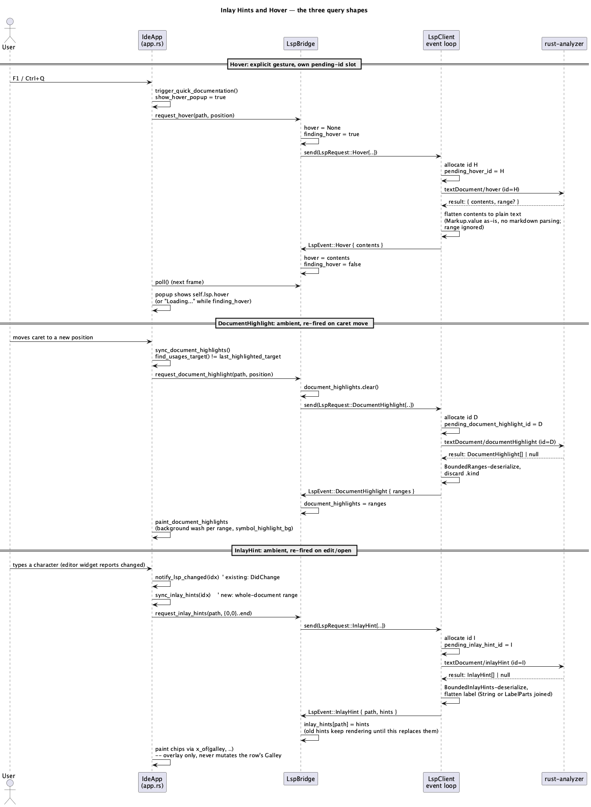

# Inlay Hints and Hover (A7)

## 1. Purpose

Adds three more `rust-analyzer` queries on top of the already-merged
`ide-lsp` connection (`rust-language-support.md`, `find-usages.md`,
`goto-definition.md`): **Hover** (`textDocument/hover`), **Inlay Hints**
(`textDocument/inlayHint`) and **Document Highlight**
(`textDocument/documentHighlight`). Together they close the largest
remaining "this doesn't feel like an IDE yet" gap `docs/roadmap.md` §2.1
calls out: no inferred-type/parameter-name chips inline in the code, no way
to see a symbol's documentation without navigating away, and no visual
feedback for where else the symbol under the caret is used in the current
file.

- **Quick Documentation** (`F1` on macOS / `Ctrl+Q` elsewhere) — shows the
  language server's hover text for the symbol at the caret in a small
  popup.
- **Inlay hints** — small, muted, non-interactive chips rendered inline in
  the editor (inferred types after `let` bindings, parameter names before
  call arguments, whatever `rust-analyzer` sends), refreshed after every
  edit.
- **Symbol highlighting** — every occurrence of the symbol at the caret,
  in the current file, gets a subtle background highlight, refreshed as
  the caret moves. No keybinding — purely ambient, mirroring JetBrains'
  "Highlight usages of element at caret".

v1 scope is deliberately narrower than the roadmap line's full wishlist
(`hover, inlayHint, documentHighlight` — тултип Quick Documentation, плюс
по ховеру, Quick Definition, Parameter Info, подсветка вхождений) —
see "Explicitly deferred" below for exactly what's cut and why. The three
LSP requests are the concrete, declared technical deliverable; this phase
implements exactly the UI behavior each one maps to 1:1, and no more.

**Explicitly deferred**:

- **Mouse-hover-triggered tooltips.** v1's Quick Documentation is
  keyboard-triggered only, querying the caret's position — not the mouse
  pointer's. A dwell-timer, mouse-position-triggered popup is a
  self-contained follow-up (it needs its own debounce/race-with-popup-
  dismissal state machine, unrelated to the request/response plumbing this
  phase adds) and is not implemented here.
- **Quick Definition** (`⌥Space`, JetBrains' non-navigating "peek" popup).
  This is conceptually built on `textDocument/definition` (already merged
  in `C1`, `goto-definition.md`), not on any of this phase's three
  requests — it needs its own design (reading a source-file snippet around
  the target and rendering it read-only) that doesn't belong bundled into
  a hover/inlay-hints/highlight phase. Deferred to a future micro-phase.
- **Parameter Info** (`⌘P`). JetBrains' real Parameter Info is backed by
  `textDocument/signatureHelp`, a fourth LSP request this phase does not
  add (the roadmap line names it as a UI wishlist item, but the "new
  LSP-запросы" it actually commits to are exactly the three above).
  Approximating it with `Hover` would give wrong results while the caret
  sits inside a call's argument list rather than on the callee's name —
  worse than not having it. Deferred until `signatureHelp` is added.
- **`DocumentHighlight.kind`** (`Text`/`Read`/`Write`) — v1 renders every
  occurrence with one uniform highlight color, no read/write distinction.
- **`Hover.range`** (the server's own opinion of what span the hover
  answer covers) — v1 doesn't use it for anything; the popup is always
  keyed to whatever position was asked, not re-anchored.
- **`InlayHint.textEdits`/`.command`/`.tooltip`/interactive chips** — v1
  chips are decorative and read-only: no click-to-accept, no hover-for-
  more-detail. `.kind` (Type vs. Parameter) is not used to vary styling —
  every chip renders identically.
- **Viewport-scoped / incremental inlay-hint fetching.** v1 always
  requests hints for the *entire* open document, refetching the whole
  thing after every edit and on open — see §4 for why this is a
  deliberate, revisitable-later simplification, not an oversight.
- Semantic highlighting of the hovered/highlighted symbol's *kind* (is it
  a type, a function, a mutable binding — that's `A10`, a differently-
  named, differently-scoped phase despite the similar-sounding "highlight
  based on meaning" description) is unrelated to this phase's plain
  "same-identifier" highlighting.

Does not touch `crates/core/**`.

## 2. Interface / API

### 2.1 `ide-lsp` (additions to the existing public API)

```rust
/// One inlay hint's already-flattened, already-permission-checked shape --
/// `ide-lsp`'s own simplified wire type, mirroring how `Location`/
/// `Diagnostic` already wrap the richer `lsp_types` shapes down to exactly
/// what `ide-ui` needs (§3.3 on why `label` is a flat `String`).
#[derive(Debug, Clone, PartialEq, Eq)]
pub struct InlayHint {
    pub position: Position,
    pub label: String,
    pub padding_left: bool,
    pub padding_right: bool,
}

pub enum LspRequest {
    // ... existing: DidOpen, DidChange, DidClose, References, Goto ...
    /// Query hover text for the symbol at `position` in `path`. One
    /// pending-id slot (`pending_hover_id`), independent of every other
    /// request kind's slot -- sending a new `Hover` request never
    /// supersedes an in-flight `References`/`Goto`/`DocumentHighlight`/
    /// `InlayHint` query and vice versa (§3.2).
    Hover { path: PathBuf, position: Position },
    /// Query every occurrence of the symbol at `position` in `path`,
    /// within that same file. Own pending-id slot
    /// (`pending_document_highlight_id`).
    DocumentHighlight { path: PathBuf, position: Position },
    /// Query inlay hints for `range` in `path`. v1's only caller
    /// (`ide-ui`) always passes the whole document as `range` (§4). Own
    /// pending-id slot (`pending_inlay_hint_id`).
    InlayHint { path: PathBuf, range: Range },
}

pub enum LspEvent {
    // ... existing: Diagnostics, ServerExited, References, Goto ...
    /// The result of the most recently sent, not-yet-superseded `Hover`
    /// query -- delivered exactly once per non-superseded request, even
    /// when empty (§3.2). `None` for a `null` result, a JSON-RPC error, or
    /// contents this client can't flatten to text (§3.3) -- never
    /// distinguished from each other, same "a definite empty answer beats
    /// a permanently-waiting UI" permissiveness `References`/`Goto`
    /// already establish.
    Hover { contents: Option<String> },
    /// The result of the most recently sent, not-yet-superseded
    /// `DocumentHighlight` query, even when empty.
    DocumentHighlight { ranges: Vec<Range> },
    /// The result of the most recently sent, not-yet-superseded
    /// `InlayHint` query, even when empty. Carries `path` (unlike
    /// `References`/`Goto`/`Hover`/`DocumentHighlight`'s events) because
    /// `ide-ui` keeps inlay hints in a per-file map, not a single "answer
    /// to the last question" slot (§2.2, §4) -- it needs to know which
    /// file this snapshot belongs to.
    InlayHint { path: PathBuf, hints: Vec<InlayHint> },
}
```

Everything else in `ide-lsp`'s existing public API is unchanged.

### 2.2 `ide-ui`

```rust
// crates/ui/src/lsp_bridge.rs -- additions to the existing LspBridge
struct LspBridge {
    // ... existing: client, diagnostics, server_error, references,
    //     finding_references, goto, finding_goto, goto_ready ...
    /// Most recent (non-superseded) `Hover` answer -- replaced wholesale
    /// on each `LspEvent::Hover`, cleared the instant a new `Hover`
    /// request is sent (§3.2, same "clear at send-time" convention
    /// `goto`/`references` already follow).
    hover: Option<String>,
    /// True from the moment `request_hover` sends the request until a
    /// matching `LspEvent::Hover` (or `ServerExited`) arrives.
    finding_hover: bool,
    /// Most recent (non-superseded) `DocumentHighlight` answer, for
    /// whatever position was last queried -- cleared at send-time.
    document_highlights: Vec<Range>,
    /// Inlay hints, keyed by file -- unlike `hover`/`goto`/`references`,
    /// this isn't "the answer to the one most recent question": v1
    /// refetches per open file on every edit (§4), and stale hints for a
    /// file the user has switched away from must keep rendering correctly
    /// if that tab is revisited before its own next refetch. Mirrors
    /// `diagnostics: HashMap<PathBuf, Vec<Diagnostic>>`'s existing shape
    /// exactly. Replaced wholesale per path on each `LspEvent::InlayHint`
    /// for that path (matches `publishDiagnostics`' snapshot-not-delta
    /// semantics `diagnostics` already documents, even though this is a
    /// request/response, not a push notification).
    inlay_hints: HashMap<PathBuf, Vec<InlayHint>>,
}

impl LspBridge {
    /// No-op (leaving `hover`/`finding_hover` untouched) if no client is
    /// running -- same shape as `find_references`/`go_to_*`. Otherwise
    /// clears `hover`, sets `finding_hover`, sends `LspRequest::Hover`.
    fn request_hover(&mut self, path: &Path, position: Position);
    /// Same shape, clears/refills `document_highlights`, sends
    /// `LspRequest::DocumentHighlight`.
    fn request_document_highlight(&mut self, path: &Path, position: Position);
    /// Clears `document_highlights` without sending anything -- the
    /// counterpart `request_document_highlight` has no use for: there's
    /// no query to send when `find_usages_target()` returns `None` (§3.4),
    /// but the previous target's highlights must not keep rendering.
    fn clear_document_highlights(&mut self);
    /// Same shape, sends `LspRequest::InlayHint { path, range }`. Does
    /// *not* clear `inlay_hints[path]` at send-time (unlike the other
    /// three) -- the existing hints stay visible, stale-but-plausible,
    /// until the fresh response replaces them; clearing immediately would
    /// make every chip flicker away and back on every keystroke.
    fn request_inlay_hints(&mut self, path: &Path, range: Range);
}
```

`IdeApp` (in `app.rs`) gains:

- `show_hover_popup: bool` — whether the Quick Documentation popup is
  open. No separate "which query" tag like `goto_action`: there's only
  one kind of hover query, so the popup's title is a fixed `"Documentation"`.
- `last_highlighted_target: Option<(PathBuf, Position)>` — the
  `(path, position)` `sync_document_highlights` most recently fired a
  `DocumentHighlight` query for; lets it tell "the caret moved to
  somewhere new" apart from "still sitting where it was last frame"
  without re-querying every single frame (§3.4).
- `trigger_quick_documentation(&mut self)` — same no-op gating as
  `trigger_go_to_declaration` et al. via `find_usages_target` (unchanged,
  reused as-is, §3.1); sets `show_hover_popup = true` and calls
  `LspBridge::request_hover`. Unlike the Goto popup (`goto-definition.md`
  §3.4, which never shows a "finding…" state because it only opens once
  the answer is known), the hover popup opens *immediately* and shows a
  loading state while `self.lsp.finding_hover` is true -- same shape the
  pre-existing Usages popup already established, since there's no
  jump-vs-popup branch to defer opening for here (there is always exactly
  one hover answer to show, never zero-or-many).
- `sync_document_highlights(&mut self)` — called once per frame,
  immediately after `self.lsp.poll()` (§3.4). Computes
  `find_usages_target()`; if it's `Some((path, position))` and differs
  from `last_highlighted_target`, calls
  `LspBridge::request_document_highlight` and updates
  `last_highlighted_target`. If it's `None` (no active tab, not the
  Editor view, no cursor offset — same gating `find_usages_target`
  already enforces), calls `LspBridge::clear_document_highlights` and
  clears `last_highlighted_target` too, so a later return to a valid
  target re-queries rather than staying silently stale.
- `sync_inlay_hints(&mut self, idx: usize)` — called from the same two
  sites `notify_lsp_changed` already fires from (right after it, §3.5):
  once when a tab's `DidOpen` is sent, and once every time
  `notify_lsp_changed` actually sends a `DidChange` (i.e. gated by the
  editor widget's `changed` output, same as `notify_lsp_changed` itself —
  an idle tab doesn't refetch every frame). Computes the buffer's
  end-of-document `Position` via `ide_lsp::byte_offset_to_position(text,
  text.len())` and calls `LspBridge::request_inlay_hints(path, Range {
  start: Position { line: 0, character: 0 }, end })`.
- `active_inlay_hints(&self) -> &[InlayHint]` — the active tab's entry in
  `self.lsp.inlay_hints`, or `&[]` if there's no active tab or no entry
  yet (brand new tab, or a query still in flight). Read by
  `render_tabs_and_editor` to feed `CodeEditor::inlay_hints`.

`command.rs` gains one `CommandAction` variant, `QuickDocumentation`,
registered under the existing `"Navigate"` category (joining
`FindUsages`/`ShowUsages`/`GoToDeclaration`/...). Binding is a genuine
`mac != other` split, not `Binding::same` — the one case CLAUDE.md's own
keyboard-shortcuts section already names as a real divergence (`F1` on
macOS, `Ctrl+Q` elsewhere), the first command this registry actually needs
it for.

```rust
// crates/ui/src/editor/mod.rs -- additions to the existing CodeEditor
impl<'a> CodeEditor<'a> {
    /// Every occurrence of the symbol at the caret, in this file --
    /// painted as a background wash the same way `search_matches` already
    /// is (§3.4). Raw `ide_lsp::Range`s, not pre-converted byte offsets --
    /// same convention `diagnostics` already uses; conversion happens
    /// inside the widget (`paint.rs`), not at the call site.
    pub fn document_highlights(mut self, ranges: &'a [Range]) -> Self;
    /// Inlay hints for this file -- painted as small muted chips inline,
    /// immediately after the buffer column each hint's `position` names
    /// (§3.5). Purely additive painting: never mutates the line's own
    /// `Galley`/`LayoutJob`, so buffer byte offsets and on-screen text
    /// stay in exact 1:1 correspondence everywhere cursor/selection math
    /// already depends on that (§4).
    pub fn inlay_hints(mut self, hints: &'a [InlayHint]) -> Self;
}
```

## 3. Behaviour

### 3.1 Triggering Quick Documentation

`F1` (`Ctrl+Q` off macOS) calls `trigger_quick_documentation`, gated by
`find_usages_target`'s existing no-op conditions (no active tab, untitled
tab, no cursor offset, not the Editor view) — the same single "is there a
sensible thing to query right now" answer `find-usages`/`goto-definition`
already share, now joined by a fourth caller.

### 3.2 Query lifecycle

All three requests follow the exact shape `References`/`Goto` already
established (`find-usages.md` §3, `goto-definition.md` §3.2), each with
its *own* independent pending-id slot in `ConnectionState`:

- `send_request`'s match gains three arms: `validate_path` the target
  file, allocate an id from the same monotonic counter, set the request's
  own `pending_*_id`, build the LSP params, send. `Hover`/
  `DocumentHighlight` send `{ textDocument: { uri }, position: { line,
  character } }` — no `context` field, same shape `Goto` already uses.
  `InlayHint` sends `{ textDocument: { uri }, range: { start, end } }`.
- `handle_incoming`'s id-bearing-no-method dispatch chain grows from
  `handle_references_response.or_else(handle_goto_response)` to a
  five-way `.or_else` chain, adding `handle_hover_response`,
  `handle_document_highlight_response`, `handle_inlay_hint_response`. All
  five ids come from the same monotonic allocator, so at most one ever
  matches — trying all five in sequence is safe, not a race (same
  reasoning `handle_incoming`'s existing doc comment already gives for the
  two-way chain).
- Response parsing is permissive exactly like `References`/`Goto`: a
  JSON-RPC error or a `null`/unparseable result becomes an empty answer
  (`None` for `Hover`, `vec![]` for the other two) rather than being
  dropped — something must always clear a waiting UI.
  - **Hover**: `result: { contents, range? } | null`. `range` is ignored
    (§1). `contents` is `MarkupContent { kind, value } |
    MarkedString | MarkedString[]` (`lsp_types::HoverContents`) —
    flattened to plain text (§3.3): `Markup` → `.value` as-is (no
    markdown parsing, §4); `Scalar`/`Array` → each `MarkedString`'s plain
    string (a `LanguageString`'s `.value`, ignoring `.language`), joined
    with a blank line for the array case.
  - **DocumentHighlight**: `result: DocumentHighlight[] | null`, each
    entry `{ range, kind? }`. Deserialized via a new
    `BoundedDocumentHighlights` wrapper — same shape and cap
    (`MAX_LOCATIONS_PER_MESSAGE`, reused rather than a new constant: same
    per-entry cost class as `Location`, no separate justification needed)
    `BoundedLocations` already uses, bounded-deserializing
    `Vec<lsp_types::DocumentHighlight>` the same way `BoundedLocations`
    bounded-deserializes `Vec<lsp_types::Location>`; `.range` is then
    extracted from each entry (`.kind` is read no further, discarded per
    §1) — no URI-to-path step, unlike `Location`: a `DocumentHighlight`
    entry has no path of its own, it's always within the file the request
    already named and validated.
  - **InlayHint**: `result: InlayHint[] | null` (`lsp_types::InlayHint`
    per entry). Deserialized via a new `BoundedInlayHints` wrapper, same
    cap. Each entry converts to `ide_lsp::InlayHint`: `label` flattens
    `InlayHintLabel::String(s)` → `s` directly, `LabelParts(parts)` →
    each part's `.value` concatenated (ignoring `.tooltip`/`.location`/
    `.command` — §1); `padding_left`/`padding_right` default to `false`
    when absent (`Option<bool>` → `bool`, matching the spec's own
    "omitted means false" note). No per-entry path validation — an
    `InlayHint` carries a `position`, not a URI, so there's no path to
    validate; it's implicitly "within the file the request named," and
    that file was already validated before the request was ever sent.
- `LspBridge::poll` handles all three new events the same way `Goto`
  already is: `Hover` sets `hover = Some(contents)` (or clears to `None`)
  and `finding_hover = false`; `DocumentHighlight` replaces
  `document_highlights` wholesale; `InlayHint` replaces
  `inlay_hints[path]` wholesale (inserting the key if this is the file's
  first-ever response). `ServerExited` clears `finding_hover`,
  `document_highlights`, and `inlay_hints` entirely — a dead server has
  nothing valid left to show for any of the three, unlike `Diagnostics`
  (a `Diagnostics` map entry, once received, stays meaningful even after
  the server dies, since it describes the file as of the last time it was
  checked — but a stale set of inlay hints or highlights, silently
  displayed as if still current, is actively misleading in a way stale
  diagnostics arguably aren't, so v1 clears rather than leaves-stale
  here).

### 3.3 Rendering hover contents as plain text — a deliberate choice, not a gap

`MarkupContent.value` is markdown (rust-analyzer's hover responses are
always `kind: "markdown"`). v1 renders it as **plain text**, via
`egui::Label`/`ui.label`, wrapped in a `ScrollArea` for long answers — no
markdown parsing, no bold/code-block/link rendering. This is both a scope
cut (a markdown renderer isn't in CLAUDE.md's approved-dependency table,
and adding one is a decision for the user, not this phase) and a
deliberate security property worth stating explicitly (`rev`/`hacker`
will be looking at exactly this): `lsp_types`' own doc comment on
`MarkupContent` notes "clients might sanitize the return markdown ... to
avoid script execution" — v1 sidesteps that class of concern entirely,
not by sanitizing markdown, but by never interpreting it as markup in the
first place. `egui::Label` draws a `String` as literal glyphs; there is no
HTML/markdown parser anywhere in this path for a malicious server's hover
text to exploit.

### 3.4 Symbol highlighting

`sync_document_highlights` (§2.2) fires a fresh query whenever
`find_usages_target()` names a different `(path, position)` than the last
one queried, and clears `document_highlights` immediately when there's no
valid target at all (mirrors `go_to_*`/`find_references`'s existing
"clear at send-time, not at response-time" convention, applied here to
the *no-target* case too, so switching to a tab with no LSP client running
doesn't leave the previous file's highlights visibly bleeding through). A
window of up to one frame exists between the caret moving to a new
position and the corresponding query being sent (nothing polls
mid-frame), and up to one round-trip between sending and the highlights
actually updating — both exactly the same latency `References`/`Goto`/
`DocumentHighlight`'s siblings already have between trigger and answer;
no new synchronization concern is introduced.

Rendering: `render_tabs_and_editor` passes `&self.lsp.document_highlights`
into `CodeEditor::document_highlights`. Inside the widget, each `Range` is
converted to a buffer byte range the same way `diagnostic_marks` already
converts `Diagnostic.range` (`ide_lsp::position_to_byte_offset(text,
range.start)` / `..end)`, both already-public `ide-lsp` functions, giving
document-wide absolute offsets — then, per row, made relative to that
row's own start via the existing `line_bounds(line)` before being handed
to `x_of`, exactly the same two-step conversion §3.5 spells out for inlay
hints), then painted as a background rect per range via a new
`paint_document_highlights`, structurally identical to the
existing `paint_search_matches` (same `x_of`-derived left/right bounds,
same per-row loop position) but using a new `Colors::symbol_highlight_bg`
token — a genuinely new visual need (occurrence highlighting is
semantically distinct from find/replace match highlighting, which already
owns `search_match_bg`/`search_match_current_bg`), added to `palette.rs`
following the exact pattern `search_match_bg` already established
(contrast check against `bg_editor`, collision check against every other
token — see the existing `palette.rs` test module).

### 3.5 Inlay hint chips

`render_tabs_and_editor` passes `self.active_inlay_hints()` into
`CodeEditor::inlay_hints`. Inside the widget's per-row paint loop (`mod.rs`
`paint`), for each hint whose `position.line` falls on the row currently
being painted: convert `position` to a within-line byte offset in two
steps — `ide_lsp::position_to_byte_offset(text, hint.position)` first
(document-wide absolute offset, the same already-public function
`find_usages_target`'s counterpart `byte_offset_to_position` already sits
next to), then subtract that row's own `line_bounds(line).start` (an
existing helper) to land on the offset `x_of` actually expects — then
compute its on-screen x via the existing `x_of` helper
(`galley.pos_from_cursor` against the row's *own, unmodified* `Galley`),
and paint the label —
padded with a literal leading/trailing space when `padding_left`/
`padding_right` is set — via `ui.painter().text(...)` immediately after
that x position, in `Colors::fg_muted` (reused as-is: an inlay hint is a
de-emphasized annotation, the same visual weight the fold placeholder
`" ⋯"` marker already renders at with this exact token — no new color
needed here, unlike §3.4). This is the same paint-time-overlay shape
`paint_fold_placeholder` already establishes for "extra text after a
line's real content that isn't part of the buffer" — extended here to
mid-line insertion points (`x_of` already supports an arbitrary
`offset_in_line`, not just end-of-line) and to N chips per line instead of
one fixed marker.

**Never touches the row's own `Galley`, `LayoutJob`, or its underlying
text string.** The chip is a separate `painter.text` call over the
already-laid-out, unmodified line — the same string every cursor-offset/
click-position/selection calculation in this widget already assumes is
byte-identical to the buffer's own text for that line. This is the
concrete resolution of the concern `docs/roadmap.md`'s A7 line raises
("возможно только на своём виджете") without needing to make inlay hints
participate in text layout, wrapping, or hit-testing at all — they are
inert decoration, not editable/selectable/clickable content (§1's
explicit deferral of interactive chips).

### 3.6 Refetching inlay hints

`sync_inlay_hints` fires alongside `notify_lsp_changed` (§2.2) — every
`DidOpen` and every actual (not idle-frame) `DidChange`. There is no
separate debounce: `notify_lsp_changed` is already gated on the editor
widget's own `changed` output, so a request only ever fires on a frame
where the buffer's text genuinely changed, the same rate limiting that
already protects `DidChange` notifications from being sent every idle
frame.

## 4. Constraints & invariants

- **Path/position provenance** (mirrors `find-usages.md`/
  `goto-definition.md` §4): `trigger_quick_documentation` and
  `sync_document_highlights`'s `path`/`position` come only from
  `find_usages_target` — never constructed from anything else.
  `sync_inlay_hints`'s `path` comes from the tab's own `buffer.path()`;
  its `range` is always `{0,0}..end-of-document`, computed from the
  buffer's own text length, never from any external input.
- **`LspClient::send`'s existing path-validation** applies to `Hover`/
  `DocumentHighlight`/`InlayHint` exactly as it already applies to every
  other request kind — a request for a path outside the project root is
  never sent, no id allocated.
- **Three independent pending-id slots, not one shared slot.** Unlike
  `Goto`'s three kinds (which deliberately share one slot — a user only
  ever cares about the most recent gesture's answer,
  `goto-definition.md` §4), `Hover`/`DocumentHighlight`/`InlayHint` are
  conceptually unrelated queries that can legitimately be in flight
  simultaneously (the caret moves — firing a new `DocumentHighlight` —
  while a `Hover` popup from a moment ago is still loading; an edit fires
  a new `InlayHint` request while both of those are still outstanding).
  Sharing a slot across them would make an unrelated query silently
  cancel this one's in-flight answer.
- **Why v1 always requests the whole document's inlay hints, not just the
  visible viewport.** A viewport-scoped design would need to know the
  visible line range at request time, refire on scroll (not just on
  edit), and debounce that separately from edit-driven refetching — a
  meaningfully bigger design than this phase's other two requests need.
  Requesting the whole document keeps `sync_inlay_hints` exactly as
  simple as `notify_lsp_changed`, its existing trigger-point twin.
  `rust-analyzer` computing hints for an entire (possibly large) file on
  every keystroke is a real perf question for a future revision if it
  turns out to matter in practice — not addressed here, since it doesn't
  change correctness, only latency.
- **No markdown/HTML interpretation anywhere in the hover path** (§3.3)
  — a security property, not an incidental limitation. If a future phase
  adds real markdown rendering, it inherits the sanitization
  responsibility `lsp_types`' own doc comment flags; until then, there is
  nothing in this path capable of executing or rendering markup at all.
- **`InlayHint` rendering never mutates the buffer, the `Galley`, or any
  cursor/selection/click-position calculation** (§3.5) — the strongest
  invariant this phase adds, since violating it would corrupt an
  invariant `code-editor-widget.md` (A2)'s entire click/selection model
  already depends on.
- **`document_highlights`/`inlay_hints` are cleared on `ServerExited`,
  never left stale** (§3.2) — unlike `diagnostics`, which intentionally
  keeps showing the last-known state after a crash.
- **No per-field string-length cap on `Hover.contents`/
  `InlayHint.label`**, matching the existing precedent: `Diagnostic
  .message` has no such cap either — only `MAX_CONTENT_LENGTH` (the
  16 MiB whole-frame bound, already verified in a prior `hacker` pass to
  be an effective bound even for pathological nesting) and the
  per-message entry-count caps (`MAX_DIAGNOSTICS_PER_MESSAGE`,
  `MAX_LOCATIONS_PER_MESSAGE`/`BoundedRanges`/`BoundedInlayHints`'s reuse
  of it) exist. A single oversized string field is still bounded by the
  frame it arrived in; this phase doesn't need a new, narrower bound to
  stay consistent with how every other free-text server field in this
  client is already handled.
- **`find_usages_target` is reused unrenamed** (`goto-definition.md` §4
  already establishes and justifies this for three callers; this phase
  adds a fourth, `trigger_quick_documentation`, for the same reason).

## 5. Examples

**Quick Documentation on a function call:**

```rust
// F1 (or Ctrl+Q off macOS):
app.trigger_quick_documentation();
// show_hover_popup = true immediately; popup shows "Loading…" while
// self.lsp.finding_hover is true.
// ... next frame, after LspBridge::poll() processes LspEvent::Hover:
// self.lsp.hover = Some("fn foo(x: i32) -> bool"), finding_hover = false.
// The popup now shows that text, plain, unstyled.
```

**Symbol highlighting as the caret moves:**

```rust
app.sync_document_highlights(); // caret on `foo` at (path, pos_a)
// last_highlighted_target = Some((path, pos_a)); a DocumentHighlight
// query for pos_a is sent, document_highlights cleared to empty in the
// meantime.
// ... user moves the caret onto `bar`, same file ...
app.sync_document_highlights(); // find_usages_target() now returns pos_b
// pos_b != last_highlighted_target -> a new query fires for pos_b,
// last_highlighted_target updated; the still-in-flight answer for pos_a
// (if it arrives late) is simply never requested to matter -- there's
// only ever one pending_document_highlight_id, so it was already
// superseded at the ide-lsp layer the moment the pos_b request was sent.
```

**Inlay hints refreshing after an edit:**

```rust
// User types `let x = foo();` and the editor widget reports `changed`:
app.notify_lsp_changed(idx);  // existing: sends DidChange
app.sync_inlay_hints(idx);    // new: sends InlayHint{path, range: whole doc}
// ... next frame, LspEvent::InlayHint{path, hints} arrives:
// self.lsp.inlay_hints[path] = hints -- e.g. one hint after `x`,
// label ": i32", padding_left: true. render_tabs_and_editor's next call
// to CodeEditor::inlay_hints paints " : i32" right after `x` on that row.
```

## 6. Dependencies & integration points

- No new external dependencies in either crate. `Hover`/
  `DocumentHighlight`/`InlayHint`'s wire encoding reuses
  `lsp_types::{Hover, DocumentHighlight, InlayHint}` (already a
  dependency) exactly as `Goto` already reuses `lsp_types::Location` —
  `BoundedRanges`/`BoundedInlayHints` are hand-rolled bounded-deserialize
  wrappers mirroring `BoundedLocations`, not new dependencies.
- Builds entirely on the already-merged `ide-lsp` connection/event-loop
  machinery and the request/response precedent `References`/`Goto`
  already established — no new subprocess, no new spawn path, no new wire
  framing, no new id-allocation mechanism (three more independent slots in
  the existing `ConnectionState`).
- `ide-ui`: extends `lsp_bridge.rs`, `app.rs`, `app/render.rs`,
  `command.rs`, `editor/mod.rs`, `editor/paint.rs`, and `theme/mod.rs` +
  `theme/palette.rs` (the new `symbol_highlight_bg` token, §3.4). Does not
  touch `crates/ui/src/cargo_panel.rs` or `crates/ui/src/claude_panel.rs`
  — neither of `CLAUDE.md`'s declared-sensitive `ide-ui` paths is in this
  role's diff, so (per that file's own rule) a `hacker` pass is not
  required for `rust-ui-dev` this phase, only for `rust-lsp-dev`
  (`crates/lsp/**` is unconditionally on the sensitive list). `lsp_bridge
  .rs` itself is *not* on that list (only `crates/ui/src/lsp_bridge.rs`'s
  language-server *command-string* surface is — untouched by this diff,
  same reasoning `goto-definition.md` §6 already gives).

## 7. Diagram

**Shared request/response shape across all three new queries (parameterized
by which one), plus the two ambient-refresh triggers (`DocumentHighlight`
on caret move, `InlayHint` on edit) that don't wait for an explicit user
gesture the way `Hover` does:**



## Revision notes

- Added `LspBridge::clear_document_highlights` (§2.2) and wired it into
  §3.4's no-valid-target branch — the first draft described the desired
  end state (highlights don't bleed across tabs) without providing any
  API surface to reach it from `app.rs`; `request_document_highlight`'s
  clear-at-send-time behavior only fires when there's actually something
  to query.
- §3.4/§3.5 now name `ide_lsp::position_to_byte_offset` explicitly as the
  first step of the position→x-coordinate conversion, and spell out the
  second step (subtracting that row's `line_bounds(line).start`, since
  `position_to_byte_offset` returns a document-wide absolute offset, not
  a within-line one) — the first draft said "convert to a within-line
  byte offset" without naming either the existing function to reuse or
  the subtraction step needed to get there.
- Renamed `BoundedRanges` → `BoundedDocumentHighlights` (§3.2) and
  clarified it bounded-deserializes `Vec<lsp_types::DocumentHighlight>`
  (mirroring `BoundedLocations`'s existing shape exactly), not bare
  `Range`s — the original name and description didn't match the actual
  wire shape it needs to parse.
