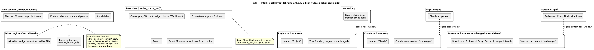

# IntelliJ shell (B2b)

## 1. Purpose

Roadmap phase **B2b** (`docs/roadmap.md` §6, §9). B1b
(`intellij-look-foundation.md`) retargeted every color token to the
Darcula/IntelliJ Light palette but touched no layout code — the shell
still looks like Fleet wearing IntelliJ colors: an unlabeled icon rail,
a plain three-column top bar, flat `selectable_label` tabs. B2b is the
actual "re-design of panels... according to JetBrains GoLand/RustRover/
PhpStorm UI" the user asked for: it restyles the chrome and panel
structure to read as IntelliJ **New UI (2023.1+)** — labeled tool-window
stripes, a proper main toolbar, framed tool-window headers, boxed editor
tabs with an active-tab accent, and a denser IntelliJ-flavoured status
bar carrying the Smart Mode indicator that the top bar currently owns.

Per §9 of the roadmap (the 2026-08-24 decision record), this is a full
pivot for chrome/layout, not just a palette swap. It does **not** touch:

- The A2 editor widget's own geometry, cursor, selection, or input
  handling (`crates/ui/src/editor/**`) — B2b only changes what surrounds
  the editor, never the editor surface itself.
- Search Everywhere / Find Action (already IntelliJ-shaped since their
  own feature docs).
- The JetBrains macOS keymap (`docs/roadmap.md` §5) — no shortcut is
  added, removed, or rebound by this doc.
- `ToolWindow`/`BottomView`/`SmartModeState` state and the
  `is_tool_window_open`/`toggle_tool_window`/`toggle_bottom_tool_window`/
  `toggle_zen_mode` logic in `crates/ui/src/app.rs` — every one of these
  stays byte-for-byte unchanged. B2b is a rendering-layer restyle of
  `crates/ui/src/app/render.rs`, not a state-model change.
- The single shared `Bottom` tool window's internal-tabs structure
  (Problems/Cargo Output/Usages/Search as tabs of one `BottomView`
  window). Real GoLand/RustRover give Problems, Run, and Find genuinely
  separate tool windows. Splitting `BottomView` into four independent
  `ToolWindow` variants would be a real information-architecture change
  (new persisted state, new keymap targets, new rail slots) layered on
  top of a look-and-feel change, and conflating the two raises the risk
  of this run for no visual payoff — the current shared-tabs panel can be
  restyled to look exactly like an IntelliJ tool window's own internal
  tab strip (§2.5) without touching what triggers it. The 4-window split
  is left as an explicit **future consideration**, not started here.

## 2. Behaviour

### 2.1 Main toolbar (was `render_top_bar`)

Same three logical content groups, same `egui::Panel::top("top_bar")`
placement, same click behaviours (back/forward nav, context label opens
the command palette, problems count opens the Bottom tool window on
`BottomView::Problems`) — only the chrome and the right-hand group's
contents change:

- The panel gets an explicit 1px bottom border in `tokens.color.border`
  (IntelliJ's toolbar-to-editor seam) and `tokens.space.xl` vertical
  padding (this is `space.xl`'s first real consumer — see §2.6) instead
  of the panel's implicit default inset.
- Column 3 (currently: branch, `Σ errors/warnings`, Smart Mode) is
  reduced to **just the git branch label**, each item in that group
  separated by a thin `ui.separator()` divider rather than bare spacing
  — mirroring the vertically-ruled widget group IntelliJ's own toolbar
  uses. The problems-count and Smart Mode widgets move to the status bar
  (§2.6); duplicating them in both bars, as `render_top_bar` and
  `render_status_bar` do independently today, is dropped.
- Back/forward buttons and the project-name label in column 1 keep their
  current glyphs and behaviour untouched — IntelliJ's own toolbar keeps
  a plain nav-arrows-plus-project-name left group in New UI too, so
  nothing here needs to change beyond the surrounding chrome.

Everything else about column 1/2 (nav enablement, context-line click
opening the command palette, "No file open" fallback text) is unchanged.

### 2.2 Tool-window stripes (was `render_rail_icon`/`RailIconShape`)

`RailIconShape` and the shape-drawing `match` in `render_rail_icon`
(circle/diamond/triangle-up/triangle-right/loupe painter calls) are
unchanged — same five shapes, same geometry, same fill-vs-stroke
open/closed convention. The function is renamed
`render_stripe_icon`/`StripeIconShape` (an IntelliJ "stripe button", not
a Fleet "rail icon" — naming now matches what it represents) and gains
two things:

1. **A short label.** Every stripe button gets a `name: &str` parameter
   (`"Project"`, `"Claude"`, `"Problems"`, `"Run"`, `"Find"`) applied via
   `.on_hover_text(name)`. Real IntelliJ rotates the label glyphs 90° for
   the left/right stripes; reproducing true rotated text is out of scope
   for this doc — `egui::TextShape` supports an `angle` field, but the
   layout math to keep rotated multi-stripe labels from overlapping each
   other is a distinct problem from "restyle the shell to read as
   IntelliJ" and isn't worth the added risk for this pass. A hover
   tooltip gets every stripe button an accurate, discoverable label
   without new layout code — noted here explicitly as a deliberate
   simplification, not an oversight, should the doc be revisited later.
2. **A hover fill.** `bg_hover` (currently unused outside `theme/mod.rs`
   — see §2.6) paints a filled rounded rect (`radius.sm`) behind the
   icon on `response.hovered()`, matching IntelliJ's stripe-button hover
   affordance. The existing fill-vs-stroke color logic for `open` is
   unchanged; the hover fill is a rect painted *before* the shape, only
   while hovered and not open (an open button is already fully filled by
   its shape, so a hover rect under it would be invisible anyway).

`render_project_rail`, `render_claude_rail`, and `render_bottom_rail`
change their call sites to pass the new `name` argument and the renamed
function/enum; their surrounding logic (`is_tool_window_open`,
`toggle_tool_window`, `toggle_bottom_tool_window`, the
`egui::Panel::left/right/bottom` calls, the conditional early-return on
`!open`) is untouched.

### 2.3 Tool-window header chrome

Each of the three tool-window content panels (`tree_panel`,
`claude_panel`, `bottom_panel`) currently opens directly into its
content with no header row — the stripe icon to its side is the only
indication of which window is open. Each gains a one-line header,
rendered as the first `ui.horizontal` inside the panel's existing
`egui::Panel::show` closure (no new `Panel` — same panel, same
resizable/default-size settings, just content added at its top):

- `tree_panel`: header text `"Project"`.
- `claude_panel`: header text `"Claude"`.
- `bottom_panel`: **no added header row** — its existing
  `selectable_label` tab strip (§2.5) already serves as the header; a
  static `"Bottom"` label above per-tab labels would be redundant
  chrome IntelliJ itself doesn't show (a real IntelliJ tool window with
  internal tabs shows the tabs, not a window title *and* tabs).
- Header row background: same panel background (`bg_base`, unchanged —
  B1b already gives it a surface distinct from `bg_editor`); a bottom
  border in `tokens.color.border` separates it from the content below,
  same treatment as the toolbar's own bottom border (§2.1).
- No close button is added to the header. Clicking the header's own
  stripe icon again already closes the window (`toggle_tool_window`'s
  existing "click while open → close" branch) — an IntelliJ-shaped
  extra "×" in the header would be a second control for the same action
  with no behavioural difference, so it's left out.

### 2.4 Project tool window density

The existing `render_tree_entry` row height/indent is unchanged — the
"standard density" roadmap bullet (§4b point 5) is satisfied entirely by
the header (§2.3) and stripe relabeling (§2.2); the tree itself was never
Fleet's "ultra-compact" density in the first place (confirmed by reading
`render_tree_entry`: it uses local layout constants,
`INDENT_PER_DEPTH: f32 = 14.0` and `ICON_SIZE: f32 = 8.0`, and default
text sizing via the applied `Style` rather than a direct `tokens.text.*`
read — nothing here reads as a deliberate "ultra-compact" Fleet
convention that needs undoing), so there is nothing to change in the
tree rows themselves.

### 2.5 Boxed tabs (editor tabs and the Bottom window's internal tabs)

Both `render_tabs_and_editor`'s per-tab loop and `render_bottom_rail`'s
`bottom_panel` tab row currently build each tab from
`ui.selectable_label(selected, text)` — a borderless, egui-default
highlight. Both are replaced with one shared helper,
`render_boxed_tab(ui, tokens, selected, label) -> egui::Response`:

- Allocates a rect sized to the label text plus `tokens.space.sm`
  padding on each side (`ui.allocate_exact_size` after measuring the
  galley, the same pattern `render_stripe_icon` already uses for its
  fixed-size allocation).
- Fill: `bg_active` (unused outside `theme/mod.rs` today — first real
  consumer, see §2.6) when `selected`, transparent otherwise; `bg_hover`
  on hover when not selected (same hover-before-shape ordering as
  §2.2).
- A 2px top border in `tokens.color.accent` when `selected`, drawn as a
  short `painter.line_segment` across the rect's top edge — the
  IntelliJ New UI active-tab accent stroke. No border when not selected.
- Corner radius `tokens.radius.md` (unused outside `theme/mod.rs` today
  — first real consumer, see §2.6) on the top two corners only
  (`egui::Rounding` with bottom corners zeroed), so the selected tab
  reads as "attached to" the content below it rather than floating.
- Returns the click `Response`; callers keep their existing
  `.clicked()` branches (`self.active_tab = Some(idx)`,
  `self.bottom_view = BottomView::X`) unchanged.

`render_tabs_and_editor`'s dirty-dot prefix (`"\u{25cf} {title}"`) and
hover-only close button (`row.response.hovered()` +
`ui.small_button("x")`) are unchanged — both already match IntelliJ New
UI's own modified-indicator dot and hover-only close convention, so
there is nothing to restyle there.

### 2.6 Status bar

`render_status_bar` keeps its existing content and click behaviours
(cursor position, `COLUMN` mode badge, charset/EOL/indent labels,
clicking the errors/warnings label opens Problems, branch label) and
gains the Smart Mode indicator moved from the top bar (§2.1) — the exact
same `match state { ... }` label/color construction
`render_top_bar` currently has, appended as the last item in the
`ui.horizontal`, separated by `ui.separator()` like the fields before
it. `render_top_bar`'s copy of this block, and its now-redundant
`Σ {errors}/{warnings}` label (superseded by the status bar's own
`"Errors: {errors}  Warnings: {warnings}"` label, which already existed
and already opens the same `BottomView::Problems` target), are removed
from `render_top_bar` per §2.1.

The panel gains `tokens.space.xl` padding (first consumer, shared with
§2.1's toolbar padding) and a 1px top border in `tokens.color.border`,
mirroring the toolbar's bottom border so the editor region is framed by
two ruled bars top and bottom, an IntelliJ New UI convention.

No other status-bar content changes. `render_status_bar`'s existing
early-exit shape (fields render nothing when there's no active tab or no
repo) is unchanged.

### 2.7 Zen mode

`toggle_zen_mode` and the `if !self.zen_mode { ... }` guards around
`render_top_bar`/`render_project_rail`/`render_claude_rail`/
`render_bottom_rail`/`render_status_bar` in `ui()` are unchanged — zen
mode continues to hide exactly the same five calls, which now render the
restyled IntelliJ chrome instead of the old Fleet rail, so no doc or code
change is needed to zen mode's own logic.

## 3. Constraints & invariants

- No new `egui::Panel`/`SidePanel`/`TopBottomPanel` is introduced and no
  panel changes edge (`top`/`left`/`right`/`bottom`) or ID
  (`"top_bar"`, `"project_rail"`, `"tree_panel"`, `"claude_rail"`,
  `"claude_panel"`, `"bottom_rail"`, `"bottom_panel"`, `"status_bar"`
  all keep their current string IDs) — B2b only adds content and styling
  inside panels that already exist, and only in the order they're
  already called from `ui()` (§ shown in Problem Solving of the prior
  session — `render_top_bar` → rails → `CentralPanel` → popups). Popup
  ordering (`render_usages_popup` through `render_confirm_modal`) is
  untouched.
- No new dependency. `egui::TextShape`'s `angle` field (mentioned in
  §2.2 as the reason true rotated stripe labels are out of scope) is not
  used — this doc deliberately does not reach for it.
- `RailIconShape`/`render_rail_icon` are **renamed**, not duplicated —
  every existing call site (`render_project_rail`, `render_claude_rail`,
  3 call sites inside `render_bottom_rail`) updates to the new name in
  the same commit; no dead old-named function is left behind.
- `tokens.color.accent`, `accent_hover`, `fg_on_accent`, `bg_hover`,
  `bg_active`, `border_strong`, `space.xl`, `radius.md`, `radius.lg` were
  all checked live (`grep` across `crates/ui/src`, run before writing this
  doc) before assuming any of them were actually unused. Two turned out to
  already be consumed indirectly, not by any doc claim: `bg_hover`,
  `bg_active`, and `border_strong` already feed `Theme::visuals()`'s
  `widgets.hovered`/`widgets.active`/`widgets.open` mapping
  (`theme/mod.rs`'s `widget()` helper), so they carry **no**
  `#[allow(dead_code)]` marker today and none needs removing — egui's
  default widget styling already paints them on any *standard* widget's
  hover/active state; the stripe icons and boxed tabs are raw
  `ui.painter()` draw calls, not standard widgets, so §2.2/§2.5 still add
  their own explicit reads of these same tokens, just not a "first"
  consumer. `radius.md` already feeds `window_corner_radius`
  (`Theme::visuals()`) despite carrying a marker — a pre-existing stale
  annotation, not something this doc's own code makes newly-live; the
  marker still comes off, because it's simply wrong today independent of
  this doc. `space.xl` is the only field with zero prior consumer anywhere
  before this doc (confirmed by the same grep) — §2.1/§2.6 are its first
  real call sites, and only its marker is a genuine "unused → used"
  transition. `accent` already has 2 real call sites pre-B2b (unaffected
  either way). `accent_hover`, `fg_on_accent`, `border_strong`,
  `radius.lg` get zero call sites from this doc — their current marker
  state (present or absent) is untouched.
- No change to `Colors`/`Spacing`/`Radii`/`TextSizes` struct shape —
  every token this doc uses already exists in `theme/mod.rs` (confirmed
  live, not from B1b's doc-time claim, since B1b only touched values —
  see the earlier `bg_chrome` correction in `intellij-look-foundation.md`
  §4/§6 for why that field turned out unnecessary).
- No test coverage requirement beyond the existing convention: every
  function this doc touches or adds (`render_top_bar`,
  `render_stripe_icon`, `render_project_rail`, `render_claude_rail`,
  `render_bottom_rail`, `render_status_bar`, `render_tabs_and_editor`,
  `render_boxed_tab`) is pure-rendering egui draw-call code with no
  branching business logic of its own — the same category
  `render_rail_icon` (its unrenamed predecessor) already is today,
  which has zero dedicated unit tests (confirmed via `grep` before
  writing this doc: no `render_rail_icon` reference exists anywhere in
  a `#[cfg(test)]` module). `rust-ui-dev`'s own skill instructions
  already carve out pure-rendering code from the 80% coverage floor;
  this doc adds nothing that falls outside that carve-out. If a fix
  round on this doc's implementation ever adds real branching logic
  (e.g. computing which stripe to highlight from something more complex
  than `is_tool_window_open`), that logic gets its own test the same way
  `is_tool_window_open`/`toggle_tool_window` already do in `app.rs`'s
  existing test module — but nothing in this doc's scope requires it.
- Not security-sensitive: none of the files this doc touches
  (`crates/ui/src/app/render.rs`, and `crates/ui/src/theme/mod.rs` only
  if the `#[allow(dead_code)]` markers change) appear on CLAUDE.md's
  declared security-sensitive path list. `hacker` is expected to be
  skipped for this role's diff, pending confirmation against the real
  `git diff --name-only` once the branch exists (dev-chain's own rule:
  check the actual diff, don't assume from the doc).

## 4. Examples

**Stripe icon call site**, before and after (`render_project_rail`):

```rust
// before
if Self::render_rail_icon(ui, tokens, RailIconShape::Circle, open).clicked() {
    self.toggle_tool_window(ToolWindow::Project);
}

// after
if Self::render_stripe_icon(ui, tokens, StripeIconShape::Circle, "Project", open).clicked() {
    self.toggle_tool_window(ToolWindow::Project);
}
```

**Boxed tab call site**, before and after (inside
`render_tabs_and_editor`'s per-tab loop):

```rust
// before
if ui.selectable_label(self.active_tab == Some(idx), label).clicked() {
    self.active_tab = Some(idx);
}

// after
if Self::render_boxed_tab(ui, tokens, self.active_tab == Some(idx), label).clicked() {
    self.active_tab = Some(idx);
}
```

**Status bar**, Smart Mode block moved verbatim from `render_top_bar`
into `render_status_bar`'s existing `ui.horizontal`, after the branch
label:

```rust
if self.git.is_repo() {
    if let Some(branch) = self.git.current_branch.clone() {
        ui.separator();
        ui.label(branch);
    }
}
ui.separator();
let state = self.smart_mode_state();
let (label, color) = match state {
    SmartModeState::Off => ("Smart Mode: Off", tokens.color.fg_muted),
    SmartModeState::On => ("Smart Mode: On", tokens.color.success),
    SmartModeState::Error => ("Smart Mode: Error", tokens.color.danger),
};
if ui
    .add(egui::Label::new(egui::RichText::new(label).color(color)).sense(egui::Sense::click()))
    .clicked()
{
    self.toggle_smart_mode();
}
```

## 5. Dependencies & integration points

- Depends on B1b (`intellij-look-foundation.md`, merged) for every color
  token this doc references (`accent`, `bg_hover`, `bg_active`,
  `border`, `fg_muted`, `success`, `danger`) — all already carry
  IntelliJ-targeted values, so B2b needs no new palette work.
- Single role: `rust-ui-dev` only. No `ide-core`/`ide-lsp` API is
  touched or needed — every symbol this doc references
  (`ToolWindow`, `BottomView`, `SmartModeState`, `is_tool_window_open`,
  `toggle_tool_window`, `toggle_bottom_tool_window`, `smart_mode_state`,
  `toggle_smart_mode`, `problems_count`, `Tokens`/`Colors`/`Spacing`/
  `Radii`) already exists in `crates/ui`.
- Blocks nothing further in the roadmap's B track — B3 (command
  registry) and B4 (Smart Mode's final placement) are both already
  marked complete/settled per `docs/roadmap.md` §6's existing
  annotations (B4's note already points at the status bar as the final
  placement, which this doc implements).
- After this doc's chain completes, `docs/roadmap.md` resumes at run
  #18 (`A10 semantic-highlighting`) per the note added in §7 during the
  B1b/B2b planning session — not part of this doc's own scope.

## 6. Diagram



## 7. Revision notes

- §2.4: corrected a factual claim about `render_tree_entry`'s sizing.
  It does not read `tokens.space.sm`/`tokens.text.body` directly — it
  uses local constants (`INDENT_PER_DEPTH`, `ICON_SIZE`) and default
  text sizing via the applied `Style`. The conclusion (no change needed
  in the tree rows) was already correct; only the stated reasoning was
  wrong. Caught by `rev`'s live re-verification against
  `crates/ui/src/app/render.rs`.
- §3: corrected the `#[allow(dead_code)]` bullet. `bg_hover`, `bg_active`,
  and `border_strong` turned out to already be consumed by
  `Theme::visuals()`'s `widget()` mapping (`theme/mod.rs` lines 69-71) and
  carry no marker to remove; `radius.md` carried a stale marker despite
  already being read at `window_corner_radius` before this doc. Only
  `space.xl` was a genuine unused-to-used transition. Found during
  `rust-ui-dev` implementation, not by `rev` — self-corrected before code
  review to keep the doc accurate for that pass.
