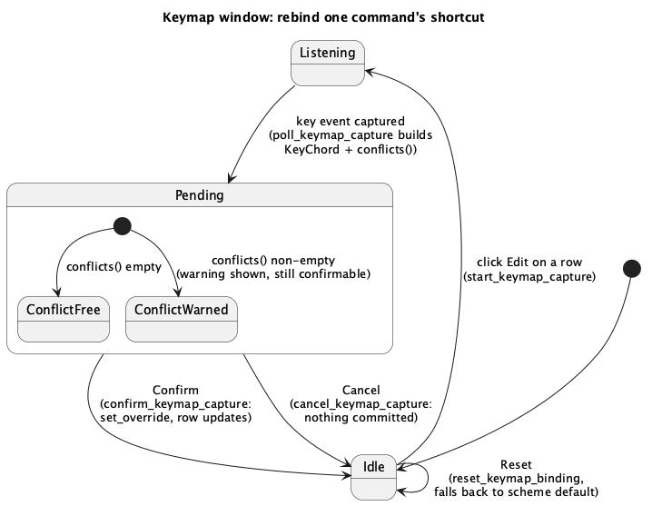

# Keymap — user-editable bindings, presets, accords (G2)

## 1. Purpose

`B3` (`command-palette.md`) made the command registry (`crates/ui/src/
command.rs`) the single source of truth for every action's *default*
binding, but that default is still fixed at compile time — nothing lets a
user change it. `docs/roadmap.md` §5 requires the keymap to be **fully
editable**, and — because it's raised to run-order position 9, immediately
after B3, per the customer's own explicit requirement — this phase closes
that gap before the binding table grows past a dozen entries.

Concretely, this phase adds:

- A per-user **override** layered over the registry's defaults, with
  conflict detection on assignment, reset-to-default, and persistence via
  `eframe::Storage` (same mechanism already used for `theme` and
  `custom_languages`).
- Three **preset schemes** the override layers on top of: JetBrains macOS
  (today's hardcoded defaults, unchanged), Fleet, and VS Code — sourced
  from each product's own official keymap reference, not invented (§5).
- Plain-text **export/import** of a user's whole customization.
- A **Keymap…** settings window: list every command with its effective
  binding, edit/reset per row, search by action or by the binding's own
  label text, switch scheme, export/import, reset all.
- The two trigger shapes `egui` has no primitive for and that the
  JetBrains-macOS default table needs: **double-tap** (already minimally
  implemented in A3 for `⌥⌥`+arrow) and **accords/prefixes** (`⌃T`→letter,
  needed by D2's Refactor This, not implemented anywhere yet). This phase
  generalises the former into a shared, documented registry entry and adds
  the primitive for the latter — see §6 for the deliberate scope boundary
  around what "generalise" does and does not include here.

## 2. Interface

New module `crates/ui/src/keymap.rs`. No `IdeApp` dependency, same shape as
`command.rs` — depends on `command.rs` (reads `command::commands()`) but
not the reverse.

### 2.1 `command.rs` additions (existing file, additive only)

`KeyChord` and `Binding` (both already `Copy`) gain `#[derive(serde::
Serialize, serde::Deserialize)]`. This needs no new dependency and no
`Cargo.toml` change: `eframe`'s already-enabled `persistence` feature
already turns on `egui`'s own `serde` feature transitively (confirmed via
`cargo tree -e features -i egui` — `egui`'s `Cargo.lock` entry already
lists `serde` as a direct dependency in this build), so `egui::Modifiers`
and `egui::Key` are already `Serialize`/`Deserialize` today; this phase is
the first to actually derive it on a type that wraps them.

Nothing else in `command.rs` changes — `Command`, `CommandAction`, and
`commands()` keep exactly their B3 shape. `KeymapOverlay` (§2.2) stores
`Binding`s, the same type `Command::binding` already uses, so no new
trigger type needs to reach `command.rs`'s dispatch path.

### 2.2 `KeymapScheme`

```rust
#[derive(Clone, Copy, Debug, PartialEq, Eq, Default, serde::Serialize, serde::Deserialize)]
pub enum KeymapScheme {
    #[default]
    JetBrainsMacOs,
    Fleet,
    VsCode,
}

impl KeymapScheme {
    pub const ALL: [KeymapScheme; 3] = [Self::JetBrainsMacOs, Self::Fleet, Self::VsCode];

    /// "JetBrains macOS" / "Fleet" / "VS Code" — settings-screen label.
    pub fn label(&self) -> &'static str;

    /// This scheme's own default for `id`, or `None` if this scheme leaves
    /// the command unbound. `JetBrainsMacOs` always equals `command::
    /// commands()`'s own `binding` field for `id` — it is not a second,
    /// hand-copied table that could drift from B3's, it *is* B3's table,
    /// looked up by id.
    pub fn default_binding(&self, id: &str) -> Option<Binding>;
}
```

`Fleet` and `VsCode`'s tables are hand-written constants inside `keymap.rs`
(`fleet_binding(id) -> Option<Binding>` / `vscode_binding(id) -> Option<
Binding>`, called from `default_binding`), sourced from each product's own
official reference (JetBrains' published Fleet keymap PDF; VS Code's own
`code.visualstudio.com/docs/reference/default-keybindings` page), not
invented — see §5 for the full sourced table and the two modelling
decisions it required.

### 2.3 `Gesture` / `GestureTrigger` — the double-tap/accord registry

```rust
#[derive(Debug, Clone, Copy, PartialEq)]
pub enum GestureTrigger {
    /// Two presses of `modifier` within `editor::double_tap::
    /// DOUBLE_TAP_WINDOW` arm the gesture (`editor::double_tap::
    /// DoubleTap`, already implemented in A3).
    DoubleTap { modifier: egui::Modifiers },
    /// `prefix` pressed, then `key` alone within `ACCORD_ARMED_WINDOW`
    /// (`Accord`, new in this phase, §2.4).
    Accord { prefix: KeyChord, key: egui::Key },
}

pub struct Gesture {
    pub id: &'static str,
    pub title: &'static str,
    pub category: &'static str,
    pub default: GestureTrigger,
}

/// Every gesture-triggered action, for display in the Keymap settings
/// window (§3.6) — **not** dispatched from here; see §6 for why gesture
/// dispatch stays where each gesture's effect actually lives instead of
/// routing through `command::Command`/`IdeApp::run_command`.
pub fn gestures() -> &'static [Gesture];
```

This phase's only entry: `Gesture { id: "CloneCaretUpDown", title: "Clone
Caret Above/Below", category: "Edit", default: GestureTrigger::DoubleTap {
modifier: egui::Modifiers::ALT } }` — the existing A3 gesture
(`editor/mod.rs`'s `alt_tap` field), now discoverable in the settings
window for the first time; its detection code and binding (`⌥⌥`) do not
change.

### 2.4 `Accord`

Mirrors `editor::double_tap::DoubleTap`'s shape exactly (fed frame time,
not a timer; every rule testable without a clock) — lives in `keymap.rs`,
not `editor/`, since an accord's second key can target any part of the UI,
not just the editor widget:

```rust
pub const ACCORD_ARMED_WINDOW: f64 = 1.0;

#[derive(Debug, Default, Clone, Copy, PartialEq)]
pub struct Accord {
    armed_until: Option<f64>,
}

impl Accord {
    /// Call once the prefix chord (e.g. `⌃T`) is detected pressed this
    /// frame. Arms for `ACCORD_ARMED_WINDOW`.
    pub fn arm(&mut self, now: f64);
    pub fn is_armed(&self, now: f64) -> bool;
    /// Always disarms — unlike `DoubleTap::disarm`, an accord's prefix
    /// isn't "half of the next accord" the way a double-tap's first press
    /// is, so nothing is preserved across this call.
    pub fn disarm(&mut self);
}
```

No call site exists yet: `docs/roadmap.md`'s own binding table assigns
`⌃T`'s first real consumer (Refactor This) to **D2**, a later, unscheduled
phase — building the detector ahead of its consumer here is the same
pattern the roadmap already used in the other direction for `DoubleTap`
(built in A3 for its own immediate consumer, generalised here); nothing
in this phase invents a speculative *feature*, only the primitive the
roadmap already committed G2 to deliver.

**This has one concrete build-time consequence, spelled out here so the
implementer doesn't have to rediscover it:** `ide-ui` is a `bin`-only
crate under `-D warnings`, and this project has already hit (`command-
palette.md`'s implementation notes, `KeyChord::ctrl()`) the case of a
`pub` item with zero non-test call site tripping `dead_code` even under
`--all-targets` (the plain, non-`cfg(test)` bin compilation still sees it
as unused, regardless of what `#[cfg(test)] mod tests` exercises). Unlike
`ctrl()` — an unplanned, speculative builder nobody's spec called for,
correctly deleted rather than suppressed — `Accord` *is* an explicit,
named roadmap deliverable for this exact phase with its first consumer
already scheduled for a specific later phase (D2), not a hypothetical
"might be useful someday." Resolve the `dead_code` lint here with
`#[allow(dead_code)]` on the `Accord` struct and its impl block, with a
comment naming this doc section and `docs/roadmap.md`'s D2 row as the
reason it's intentionally unconsumed — do not delete `Accord` to make the
warning go away, and do not silently invent a fake call site to dodge it.

### 2.5 `KeymapOverlay`

```rust
#[derive(Clone, Debug, Default, serde::Serialize, serde::Deserialize)]
pub struct KeymapOverlay {
    pub scheme: KeymapScheme,
    overrides: std::collections::BTreeMap<String, Option<Binding>>,
}

impl KeymapOverlay {
    /// `overrides.get(id)`, including an explicit `Some(None)` (user
    /// turned the default off), else `scheme.default_binding(id)`.
    pub fn effective_binding(&self, id: &str) -> Option<Binding>;

    /// Explicit assignment — `Some(binding)` to bind, `None` to unbind.
    /// Always `Binding::same(chord)`: the capture UI (§3.5) reads one
    /// chord on the running platform, so a custom binding cannot diverge
    /// mac/other the way a *preset scheme's* table can (§3.3 note).
    pub fn set_override(&mut self, id: &str, binding: Option<Binding>);

    /// Removes `id`'s override, falling back to `scheme`'s default again.
    pub fn reset(&mut self, id: &str);

    pub fn reset_all(&mut self);

    pub fn is_customized(&self, id: &str) -> bool;

    /// Every other registered command whose effective binding, resolved
    /// through this same overlay, resolves to the same platform chord as
    /// `proposed`. Call before `set_override` commits an assignment;
    /// non-empty does not block the assignment (JetBrains' own keymap
    /// editor allows a shared shortcut too), it only warns.
    pub fn conflicts(&self, id: &str, proposed: KeyChord) -> Vec<&'static str>;

    /// Hand-rolled plain-text serialisation (§3.4) — not `serde_json`:
    /// the project's approved-dependency table (CLAUDE.md) does not list
    /// a JSON crate, and this format only ever needs to round-trip this
    /// one struct, so a small hand-written parser avoids a new dependency
    /// entirely.
    pub fn export(&self) -> String;

    /// Parses `export`'s format. Fully validates before mutating: on any
    /// malformed line, returns `Err` and leaves the overlay this method is
    /// called on untouched. An id `export` never produced (e.g. a file
    /// from a newer build with commands this build doesn't know) is not
    /// an error — it's collected into `ImportReport::skipped_unknown_ids`
    /// instead of silently dropped, so the caller can surface it.
    pub fn import(&mut self, text: &str) -> Result<ImportReport, ImportError>;
}

#[derive(Debug, Default)]
pub struct ImportReport {
    pub skipped_unknown_ids: Vec<String>,
}

#[derive(Debug, thiserror::Error)]
pub enum ImportError {
    #[error("unsupported keymap file version: {0}")]
    UnsupportedVersion(String),
    #[error("malformed line {line}: {text:?}")]
    MalformedLine { line: usize, text: String },
    #[error("unknown key name {0:?}")]
    UnknownKey(String),
}
```

### 2.6 `IdeApp` additions (`crates/ui/src/app.rs`)

New field `keymap: keymap::KeymapOverlay`, loaded/saved exactly like
`theme`/`custom_languages` (`app/render.rs`'s existing `fn save`):

```rust
const KEYMAP_STORAGE_KEY: &str = "ide_keymap";
// in IdeApp::new / app_without_gui:
let keymap = cc.storage
    .and_then(|s| eframe::get_value::<KeymapOverlay>(s, KEYMAP_STORAGE_KEY))
    .unwrap_or_default();
// in fn save:
eframe::set_value(storage, KEYMAP_STORAGE_KEY, &self.keymap);
```

Settings-window state, mirroring `show_language_settings`/
`language_settings_error`'s existing shape exactly:

```rust
show_keymap_settings: bool,
keymap_search: String,
keymap_capture_target: Option<&'static str>,   // id currently being (re)bound
keymap_capture_pending: Option<(KeyChord, Vec<&'static str>)>, // captured chord + its conflicts, awaiting confirm
keymap_import_error: Option<String>,
```

New methods on `IdeApp`:

```rust
/// Ids of `command::commands()` whose title, category, or effective
/// binding's label (both mac and non-mac form) contains `keymap_search`
/// case-insensitively, in registry order. Empty query returns every id —
/// same shape as `filtered_commands` (`command-palette.md` §3.2), reused
/// here for the same reason: one obviously-correct filter, not two.
fn keymap_filtered_ids(&self) -> Vec<&'static str>;

/// Starts capture mode for `id`: sets `keymap_capture_target`, clears any
/// stale `keymap_capture_pending`.
fn start_keymap_capture(&mut self, id: &'static str);

/// Called once per frame while `keymap_capture_target.is_some()`: reads
/// the frame's key events directly (the one place in `ide-ui` allowed to,
/// per §4.2), and on the first `Event::Key { pressed: true, .. }` whose
/// `key` is not one of `egui::Key`'s eight physical-modifier variants
/// (`ShiftLeft`, `ShiftRight`, `ControlLeft`, `ControlRight`, `AltLeft`,
/// `AltRight`, `SuperLeft`, `SuperRight` — confirmed present in `egui`
/// 0.36.1's `Key` enum), builds a `KeyChord` from that key plus the
/// event's own `modifiers` field, computes `self.keymap.conflicts(target,
/// chord)`, stores both in `keymap_capture_pending`, and clears
/// `keymap_capture_target` (capture is one-shot). Excluding those eight
/// variants is required, not cosmetic: without it, pressing bare `⌘` to
/// start holding a chord could itself be captured as the chord's `key`,
/// producing a binding that can never fire again.
fn poll_keymap_capture(&mut self, ctx: &egui::Context);

/// Commits `keymap_capture_pending`'s chord via `set_override`, clears
/// the pending state. No-op if `keymap_capture_pending` is `None`.
fn confirm_keymap_capture(&mut self);

/// Clears `keymap_capture_pending`/`keymap_capture_target` without
/// committing anything.
fn cancel_keymap_capture(&mut self);

/// `self.keymap.reset(id)`.
fn reset_keymap_binding(&mut self, id: &str);

/// `self.keymap.export()`, written to a user-chosen path via
/// `rfd::FileDialog::new().save_file()` — same pattern as `save_active_as`.
fn export_keymap(&mut self);

/// Reads a user-chosen path via `rfd::FileDialog::new().pick_file()`,
/// parses via `self.keymap.import`. On `Ok`, replaces `self.keymap`
/// wholesale (scheme + overrides) and, if `skipped_unknown_ids` is
/// non-empty, sets `self.error` to a message listing them (the same
/// "signal, don't silence" treatment `in-buffer-find-replace.md` §3.7
/// gives search-cap truncation). On `Err`, sets `keymap_import_error`.
fn import_keymap(&mut self);
```

## 3. Behaviour

### 3.1 Dispatch through the overlay

`handle_shortcuts` (`app/render.rs`) changes its per-command lookup from
`cmd.binding` (B3's compile-time default) to `self.keymap.effective_binding
(cmd.id)`. Everything else about the loop — palette-open suppression,
`is_command_enabled` gating — is unchanged from B3.

**New invariant this phase introduces:** the loop dispatches at most the
**first** enabled command (in registry order) whose effective chord
matches this frame's input, then stops, rather than firing every match.
Under B3 alone this never mattered (the 11 defaults are all distinct), but
once a user's override can make two commands share a chord (`conflicts`
warns but does not forbid this, §2.5), firing both from one keypress would
be surprising and hard to reason about; JetBrains itself resolves this by
context (only one of the colliding actions is usually enabled at a time) —
picking the first enabled match is this project's equivalent, simpler
resolution.

### 3.2 Scheme selection

Switching `keymap.scheme` (Keymap window's scheme picker) changes which
defaults unassigned commands fall back to; it does **not** touch
`overrides`. A binding the user customized under one scheme stays
customized after switching to another — a user who moved "Comment Line"
away from both JetBrains' and Fleet's own default almost certainly wants
to keep that choice regardless of which preset they're now on.

### 3.3 Preset scheme tables

`Fleet` and `VsCode`'s `default_binding` cover every id `command::
commands()` registers as of this phase (§5 has the full table). Two
modelling gaps required an explicit decision rather than a literal port:

- **`FindUsages` / `ShowUsages` collapse.** Neither Fleet nor VS Code has a
  separate default-bound "popup" vs. "panel" Find Usages the way this
  registry's B3-era split does — Fleet has one Find Usages action (`⌘U`);
  VS Code's closest default is its peek/"Go to References" (`⇧F12`). Both
  presets bind `FindUsages` to that single analogue and leave `ShowUsages`
  **unbound** (`default_binding` returns `None`) rather than inventing a
  second binding neither product actually has.
- **Fleet's `SaveAll`/`Undo`/`Redo` bind to the platform-standard chord,
  not "unbound."** Fleet's own published keymap reference card omits
  these three entirely, but that omission is a documentation choice about
  what counts as *Fleet-specific*, not evidence the shortcut is inert —
  this app has no OS-level fallback (`effective_binding` returning `None`
  makes `handle_shortcuts` skip the command outright, §3.1), so treating
  "not in Fleet's diff-from-the-OS-standard reference" as "unbound" would
  make `⌘S` silently do nothing under the Fleet preset. The Fleet preset
  therefore binds all three to the same chord JetBrains macOS already
  uses (`⌘S` / `⌘Z` / `⇧⌘Z`).
- **`SaveAll` → plain Save, not VS Code's own Save All.** This app's
  `SaveAll` command only ever saves the *active* tab (`try_save_active` →
  `save_active`, scoped to `self.active_tab`) — despite its name, it is
  not multi-file. VS Code's own `saveAll` command (`⌥⌘S`) *is* genuinely
  multi-file, a different scope entirely; VS Code's plain Save (`⌘S`,
  `workbench.action.files.save`) is the semantically-matching action, so
  the VS Code preset maps `SaveAll` → `⌘S`, not `⌥⌘S`.

### 3.4 Export/import format

Plain text, one directive per line, no external serialisation crate
(§2.5). Line shapes:

```
keymap/1
scheme <JetBrainsMacOs|Fleet|VsCode>
bind <id> <key-name> [<mod>[,<mod>...]]
unbind <id>
```

`<key-name>` is `egui::Key::name()`'s own output (`Key::from_name` is its
exact, egui-provided inverse — confirmed by reading `egui-0.36.1/src/data/
key.rs` directly rather than assuming Debug output round-trips). `<mod>`
is one or more of `command`, `shift`, `alt`, comma-joined — exactly the
three builder methods `KeyChord` exposes (`.command()`/`.shift()`/
`.alt()`); `ctrl`/`mac_cmd` are never emitted or parsed directly, since
nothing in this codebase sets them except as `command`'s own platform
echo. A version line other than `keymap/1` is `Err(UnsupportedVersion)`;
any line that isn't one of the four shapes above, or names a key
`Key::from_name` rejects, is `Err(MalformedLine)`. An unrecognised `<id>`
is not an error (§2.5) — collected into `ImportReport::skipped_unknown_ids`
and applied to nothing.

### 3.5 Keymap settings window

`egui::Window::new("Keymap…")`, opened by a new toolbar button next to the
existing "Languages…" one, gated on `show_keymap_settings` exactly like
`render_language_settings_window`. Contents:

1. Scheme picker (`egui::ComboBox` over `KeymapScheme::ALL`).
2. Search field bound to `keymap_search`.
3. One row per id in `keymap_filtered_ids()` order: title, category,
   effective binding's label (`for_platform().label(cfg!(target_os =
   "macos"))`, or "—" if unbound), an "Edit" button (calls
   `start_keymap_capture`), a "Reset" button (calls
   `reset_keymap_binding`, disabled via `ui.add_enabled_ui` when `!self
   .keymap.is_customized(id)` — mirrors B3's disabled-row pattern). Rows
   for `gestures()` entries render alongside command rows (same list,
   distinguished by an icon/label noting "gesture"), showing their default
   trigger's description; they have no Edit/Reset button this phase (§6).
4. While `keymap_capture_target` is `Some`, the target row's binding cell
   shows "Press a shortcut…" instead of a label, and `poll_keymap_capture`
   runs every frame the window is open.
5. While `keymap_capture_pending` is `Some((chord, conflicts))`, a small
   inline confirmation replaces that row's controls: the proposed label,
   a conflict warning line naming every id in `conflicts` if non-empty,
   Confirm (`confirm_keymap_capture`) / Cancel (`cancel_keymap_capture`).
6. "Reset All" (`reset_all`), "Export…" (`export_keymap`), "Import…"
   (`import_keymap`) buttons. Import errors render in red from
   `keymap_import_error`, cleared the same way `language_settings_error`
   already is on next success.

**Search by pressed combination**, per `docs/roadmap.md` §6's row for this
phase, is served by `keymap_filtered_ids` matching the query against the
effective binding's *label text* (both platform forms) in addition to
title/category — e.g. typing `⌘⇧A` or `Ctrl+Shift+A` filters to `FindAction`
— rather than a second live key-capture search mode. A literal
hold-a-chord-to-search input would need its own capture sub-state on top
of the row-editing one in §3.5.4, disproportionate to what a text filter
already delivers; recorded here as a deliberate scope choice, not an
oversight.

### 3.6 Gesture display (§2.3)

The Keymap window lists `gestures()` entries for discoverability only —
before this phase, `⌥⌥`+arrow was undocumented anywhere a user could find
it outside the roadmap doc itself. Detection, arming, and dispatch for
`CloneCaretUpDown` are entirely unchanged from A3 (`editor/mod.rs`'s
`alt_tap`/`handle_keys`/`rewrite`); this phase adds no new call site there.

## 4. Constraints

1. `keymap.rs` has no `IdeApp`/`egui::Ui` dependency beyond the `egui`
   types `command.rs` already pulls in (`Key`, `Modifiers`) — same
   boundary `command.rs` itself holds.
2. `poll_keymap_capture` is `ide-ui`'s only other allowed direct
   `ctx.input`/key-event read outside `command.rs`'s own dispatch and the
   pre-B3 exceptions `command-palette.md` §4.5 already lists (escape
   arbitration, palette-local nav) — capturing an arbitrary new binding is
   definitionally not expressible through the registry it's populating.
3. `KeymapOverlay::import` never partially mutates `self` on `Err` — the
   whole text is parsed into a fresh overlay first; only a fully-valid
   parse replaces the live one.
4. `conflicts` warns, never blocks — `set_override`/`import` always
   succeed regardless of collisions; §3.1's first-match dispatch rule is
   what keeps a collision's runtime behaviour predictable rather than
   forbidding the assignment outright.
5. `Fleet`/`VsCode`'s tables are sourced, not invented (§3.3, §5) — the
   same "не выдумывать" constraint `docs/roadmap.md` §5.2 states for the
   JetBrains-macOS table applies here to the two alternates.

## 5. Sourced preset tables

**Fleet** (JetBrains' official keymap reference PDF, macOS page):

| id | Fleet macOS |
|---|---|
| Find | `⌘F` |
| Replace | `⌥⌘F` |
| FindNext | `⌘G` |
| FindPrevious | `⇧⌘G` |
| FindInPath | `⇧⌘F` |
| FindUsages | `⌘U` |
| ShowUsages | *(unbound, §3.3)* |
| FindAction | `⇧⌘K` (Fleet's "Go to Action") |
| SaveAll | `⌘S` |
| Undo / Redo | `⌘Z` / `⇧⌘Z` |

**VS Code** (`code.visualstudio.com/docs/reference/default-keybindings`,
macOS column):

| id | VS Code macOS |
|---|---|
| Find | `⌘F` |
| Replace | `⌥⌘F` |
| FindNext | `⌘G` (`editor.action.nextMatchFindAction`) |
| FindPrevious | `⇧⌘G` (`editor.action.previousMatchFindAction`) |
| FindInPath | `⇧⌘F` |
| FindUsages | `⇧F12` (`editor.action.goToReferences`, §3.3) |
| ShowUsages | *(unbound, §3.3)* |
| FindAction | `⇧⌘P` ("Command Palette") |
| SaveAll | `⌘S` (§3.3 — not VS Code's own `⌥⌘S` Save All) |
| Undo / Redo | `⌘Z` / `⇧⌘Z` |

## 6. Deliberate scope boundary: gestures are not user-rebindable this phase

`gestures()` (§2.3) makes `CloneCaretUpDown` (and, once D2 lands, any
accord-triggered command) *listed and documented* by the same module that
now owns every other binding fact, and `Accord` (§2.4) gives that future
D2 consumer a tested primitive to build on — both genuinely satisfy
"generalises [double-tap] into part of the registry and adds accords."
What this phase does **not** do is let `KeymapOverlay` reassign a
gesture's trigger (e.g. rebind clone-caret from `⌥⌥` to `⌃⌃`), because a
gesture's effect lives inside a specific widget's own per-frame state
(`CodeEditor`'s `alt_tap` field), not `IdeApp::run_command` — forcing that
dispatch up into `IdeApp` just to fit `command::Command`'s existing shape
would be exactly the kind of premature, forced abstraction CLAUDE.md's
conventions warn against, for a rebinding UI this phase has no concrete
user need for yet (no second gesture exists to collide with the first).
`command::Command`/`CommandAction`/`run_command` are therefore untouched
by this phase entirely; the Keymap window's Edit/Reset controls apply only
to `command::commands()` rows, never to `gestures()` rows.

## 7. Examples

**Rebind Save All from `⌘S` to `⌘⇧S`:** open Keymap…, find the "Save All"
row, click Edit, press ⌘⇧S. `poll_keymap_capture` builds the chord, `self
.keymap.conflicts("SaveAll", chord)` returns `[]` (nothing else uses
`⌘⇧S`), the row shows "⇧⌘S" with no warning and a Confirm button; clicking
it calls `set_override("SaveAll", Some(Binding::same(chord)))`. From the
next frame, `⌘S` no longer triggers Save All and `⌘⇧S` does.

**Switch to the Fleet preset, then override one action anyway:** set
`keymap.scheme = KeymapScheme::Fleet` — `SaveAll`/`Undo`/`Redo` keep firing
on `⌘S`/`⌘Z`/`⇧⌘Z` (§3.3's Fleet-binds-the-platform-standard-chord
reasoning); only `ShowUsages` goes unbound (§3.3's collapse reasoning).
Later, `set_override("FindAction", Some(...⌘⇧A))` puts JetBrains' Find
Action binding back on top of the otherwise-Fleet scheme; switching
schemes again to `VsCode` leaves that override in place (§3.2) since it
lives in `overrides`, not derived from `scheme`.

**Export, edit elsewhere is out of scope, reimport a file missing one id:**
`export()` on an overlay with two overrides produces:

```
keymap/1
scheme JetBrainsMacOs
bind SaveAll S command,shift
unbind ShowUsages
```

Importing this same text into a build where `ShowUsages` was since removed
returns `Ok(ImportReport { skipped_unknown_ids: vec!["ShowUsages"] })`;
`SaveAll`'s override still applies. `import_keymap` surfaces the skipped
id via `self.error` rather than silently dropping it.

## 8. Diagram



## 9. Dependencies & integration points

- `command.rs` — read-only dependency (`commands()`, `Binding`, `KeyChord`)
  plus the additive `serde` derives in §2.1; no existing signature changes.
- `app/render.rs` — `handle_shortcuts`'s lookup source changes (§3.1); new
  `render_keymap_settings_window`, wired after `render_language_settings_
  window` in the main update loop; `fn save` gains the `KEYMAP_STORAGE_KEY`
  line.
- `app.rs` — new `keymap` field + loader (§2.6), new toolbar button next to
  "Languages…".
- `editor/double_tap.rs` — read-only reference for `Gesture`'s displayed
  default (§3.6); no code changes.
- `eframe::Storage` / `rfd::FileDialog` — both already-approved
  dependencies, used exactly per their existing `theme`/`custom_languages`
  and `save_active_as` precedents respectively; no new dependency, no new
  `Cargo.toml` feature flag (§2.1).

## Revision notes

1. §5/§3.3/§7 — Fleet's `SaveAll`/`Undo`/`Redo` were originally marked
   unbound, reasoning that Fleet's reference card omitting them meant the
   OS-standard chord stayed "untouched." That's wrong for this app: an
   unbound command means `handle_shortcuts` skips it outright, so `⌘S`
   would silently do nothing under the Fleet preset — directly
   contradicted by this doc's own example claiming they "keep working."
   Fixed: Fleet now binds all three to the same chord JetBrains macOS
   uses, and §3.3/§7 were reworded to match.
2. §2.4 — added an explicit instruction to resolve `Accord`'s inevitable
   `dead_code` warning (this project already hit the identical situation
   once, in B3's `KeyChord::ctrl()`) via `#[allow(dead_code)]` with a
   comment tying it to this section and the roadmap's D2 row, rather than
   leaving the implementer to rediscover the lint failure and improvise
   — deletion, B3's resolution for `ctrl()`, is explicitly ruled out here
   since `Accord` is a named roadmap deliverable with a scheduled
   consumer, not unplanned speculative surface.
3. §2.6 — spelled out the exact eight `egui::Key` physical-modifier
   variants `poll_keymap_capture` must exclude from capture, replacing
   the vaguer "not a bare modifier."
4. §2.6 — `poll_keymap_capture` no longer clears `keymap_capture_target`
   once a chord is captured. `keymap_capture_pending` (`(KeyChord,
   Vec<&'static str>)`) carries no command id, so clearing `target` at
   that point would lose which command the pending capture is *for* --
   `confirm_keymap_capture` would have nothing to call `set_override` on.
   Found while implementing: both fields now stay set together from
   `start_keymap_capture` through whichever of `confirm_keymap_capture`/
   `cancel_keymap_capture` runs, which is what actually clears both.
5. §2.6 — `export_keymap`/`import_keymap` are implemented as
   `export_keymap_to(&self, path: &Path)`/`import_keymap_from(&mut self,
   path: &Path)`, split from the `rfd::FileDialog` call rather than
   owning it. The existing `save_active_as`/its render.rs "Save As…"
   button already use exactly this split; a method that opens a real OS
   file dialog itself can't be exercised by `cargo test`, which the
   original zero-argument signatures would have made true of these two
   as well. `import_keymap_from` still returns `ImportReport`/`String`
   as documented, and still leaves `self.keymap` untouched on `Err`
   (`KeymapOverlay::import`'s own atomicity, unaffected by this split).
