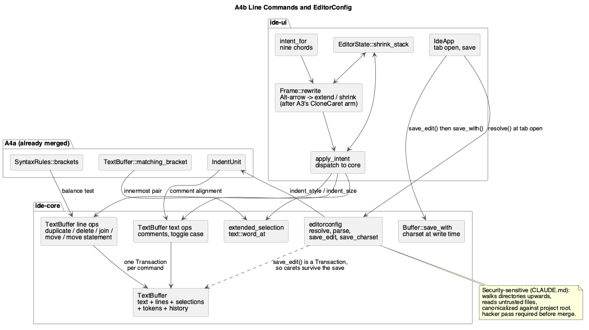

# Line Commands and EditorConfig

Roadmap phase **A4b**, the second of the two sets `docs/roadmap.md`'s A4 row
was split into. It builds directly on **A4a** (`smart-editing.md`), which
must be merged first: `IndentUnit`, `SyntaxRules::brackets` and
`TextBuffer::matching_bracket` all come from there. Two roles in the
project's declared order: **`rust-core-dev`** for the line operations, the
selection hierarchy and the EditorConfig reader, then **`rust-ui-dev`** for
the nine bindings and the config wiring.

**`crates/core/src/editorconfig.rs` is a security-sensitive path** by
`CLAUDE.md`'s rule "any code that reads a user-chosen directory as a project
root … path traversal / symlink escape": resolving `.editorconfig` walks
*upwards* from the edited file, reads whatever it finds, and does so on
files the user never opened. The core role's diff therefore requires a
`hacker` pass before merge. Nothing in the UI role's scope touches a
declared sensitive path.

## 1. Purpose

A4a made typing language-aware. This set adds the *commands* — the chords a
JetBrains user reaches for without thinking, all of them acting on whole
lines rather than at the caret — and it stops the editor ignoring the
project's own `.editorconfig` while happily writing tabs into a spaces-only
tree.

Every operation is multi-cursor by construction: one `Transaction` over
every selection, so a command with N cursors is still one undo step. A3
landed the cursors; nothing here re-derives that guarantee.

### 1.1 Scope

In:

| # | Feature | Where |
|---|---|---|
| 1 | Duplicate / Delete / Join / Move Line | core + ui |
| 2 | Move Statement (balanced-span variant of Move Line) | core + ui |
| 3 | Toggle Line Comment / Block Comment | core + ui |
| 4 | Extend / Shrink Selection | core + ui |
| 5 | Toggle Case | core + ui |
| 6 | EditorConfig: read, apply on input, apply on save | core + ui |

Out, and named so the boundary is explicit:

- **Everything in A4a**, which is already merged by the time this set
  starts.
- **Code style settings UI** — the roadmap's own G1. This set reads
  `.editorconfig` and nothing else; there is no settings panel and no
  per-language style dialog.
- **Reformat Code (`⌘⌥L`)** — A9.
- **Semantic statement movement.** IntelliJ's Move Statement understands
  the language's AST. There is no parser here, so feature 2 is defined on
  *balanced bracket spans* and §3.2 says so rather than pretending
  otherwise.
- **The command registry** — B3.

### 1.2 Bindings, and the four collisions with what is already shipped

From `docs/roadmap.md` §5.2, verbatim — `CLAUDE.md`: never invent a binding.

| Action | JetBrains macOS | Windows/Linux (B3's `other` half) |
|---|---|---|
| Comment with Line Comment | `⌘/` | `Ctrl+/` |
| Comment with Block Comment | `⌘⌥/` | `Ctrl+Shift+/` |
| Duplicate Line or Selection | `⌘D` | `Ctrl+D` |
| Delete Line | `⌘⌫` | **`Ctrl+Y`** |
| Move Line Up / Down | `⌥⇧↑` / `⌥⇧↓` | `Alt+Shift+Up` / `Down` |
| Move Statement Up / Down | `⌘⇧↑` / `⌘⇧↓` | `Ctrl+Shift+Up` / `Down` |
| Join Lines | `⌃⇧J` | `Ctrl+Shift+J` |
| Extend / Shrink Selection | `⌥↑` / `⌥↓` | `Ctrl+W` / `Ctrl+Shift+W` |
| Toggle Case | `⌘⇧U` | `Ctrl+Shift+U` |

Three of these rows diverge by more than a modifier substitution (Delete
Line, Extend/Shrink, and — because `command` is Ctrl off macOS — Move
Statement); they join §1.2's list in `multiple-cursors.md` as `{ mac, other }`
entries B3 will have to spell out. This phase ships the macOS half, and
§2.5's predicates are chosen so none of them fires off macOS on a key
JetBrains binds to something else.

**Four bindings already mean something else today**, and A4 takes them over.
Each is a deliberate change, not an oversight:

1. **`⌥↑`/`⌥↓` — Extend/Shrink Selection vs. A3's Clone Caret.** No conflict
   in fact: A3's gesture is `⌥⌥`+arrow, and `Frame::rewrite` already checks
   `DoubleTap::is_armed` first. An *armed* `⌥↑` clones a caret; an unarmed
   one extends the selection. That is exactly IntelliJ's own behaviour, and
   the ordering in `rewrite` is what implements it — the new arm goes
   *after* the `CloneCaret` arm, never before.
2. **`⌥↑`/`⌥↓` vs. A2's vertical movement.** A2's `vertical_granularity`
   ignores `alt`, so `⌥↑` currently moves one row. It stops doing that.
   Plain `↑`/`↓` are untouched.
3. **`⌘⌫` — Delete Line vs. A2's delete-to-line-start.** A2 maps
   `Backspace` with `command` to `Granularity::Line`, i.e. the macOS system
   behaviour. §5.2 binds Delete Line there, and the JetBrains keymap wins:
   this is a JetBrains-keymap IDE, stated in `CLAUDE.md`. Delete-to-line-start
   loses its binding and gets none (B3 makes it bindable).
4. **`⌘⇧↑`/`⌘⇧↓` — Move Statement vs. A2's extend-to-document-end.** Same
   resolution and the same reason. A2's `Key::Home`/`Key::End` do **not**
   cover the loss: `input.rs`'s `key_intent` maps them to
   `Granularity::Line`, i.e. the *line's* ends, not the document's. So this
   phase moves extend-to-document onto `⌘⇧Home`/`⌘⇧End` explicitly — one
   added predicate in §2.5 — rather than letting the capability disappear
   until B3. That is not an invented binding: it is the macOS system
   binding for document-extent selection, and JetBrains leaves it in place.

`Tab` was a fifth, softer case; A4a already resolved it (`smart-editing.md`
§1.2) and nothing here revisits it.

## 2. Interface / API

### 2.1 `TextBuffer` line and text operations (core)

Every one of these is one `Transaction` over **every** selection, therefore
one undo step, and every one leaves the selections where §3 says. They are
`TextBuffer` methods rather than free functions returning a `Transaction`
because each needs `text`, `lines` and `selections` together and each must
set the resulting selections itself — the same shape `insert_at_selections`
already has. Each returns `bool`: whether anything changed.

```rust
impl TextBuffer {
    /// §3.1. Copies each selection's full line span below itself; a
    /// non-empty selection inside one line duplicates the selection instead.
    pub fn duplicate_selection_lines(&mut self) -> bool;

    /// §3.1. Deletes each selection's full line span, including its
    /// newline. Deleting every line leaves an empty buffer, not a
    /// zero-selection one.
    pub fn delete_selection_lines(&mut self) -> bool;

    /// §3.1. Joins each selection's line span onto one line, collapsing the
    /// newline and the next line's leading whitespace into a single space —
    /// and into nothing when the next line starts with a closing bracket
    /// from `syntax()`'s `brackets`.
    pub fn join_selection_lines(&mut self) -> bool;

    /// §3.1. Swaps each selection's line span with the line above/below,
    /// carrying the selections with it. No-op for a span already at the
    /// buffer's edge in that direction.
    pub fn move_selection_lines(&mut self, direction: LineDirection) -> bool;

    /// §3.2. Like `move_selection_lines`, but the span moved and the span
    /// jumped over are both grown to the smallest **bracket-balanced** line
    /// spans containing them.
    pub fn move_selection_statements(&mut self, direction: LineDirection) -> bool;

    /// §3.3. Adds or removes `syntax()`'s first `line_comment_prefixes`
    /// entry on every line each selection touches. Uncomments only when
    /// *every* touched line is already commented; otherwise comments all of
    /// them, which is JetBrains' rule and the only one that is its own
    /// inverse. `false` when the language has no line comment.
    ///
    /// `unit` is needed to *measure*, not to insert: the prefix goes at the
    /// shallowest common indentation of the touched lines (§3.3), and
    /// comparing indentation across lines that mix tabs and spaces means
    /// comparing columns, which is `IndentUnit::columns_of`.
    pub fn toggle_line_comment(&mut self, unit: IndentUnit) -> bool;

    /// §3.3. Wraps each selection in `syntax()`'s `block_comment`, or
    /// unwraps it when the selection is already exactly a block comment.
    /// `false` when the language has none.
    pub fn toggle_block_comment(&mut self) -> bool;

    /// §3.5. `lower` → `UPPER` → `lower`: a selection that is entirely
    /// lowercase becomes uppercase, anything else becomes lowercase. An
    /// empty selection acts on the word under the caret (`word_at`).
    pub fn toggle_selection_case(&mut self) -> bool;
}

#[derive(Debug, Clone, Copy, PartialEq, Eq)]
pub enum LineDirection { Up, Down }
```


### 2.2 `Buffer` learns which charset to write (core)

```rust
impl Buffer {
    /// `save`, but writing under `charset` rather than plain UTF-8: a
    /// `Utf8Bom` prepends the BOM, `Utf8` and `None` write the text as-is.
    /// The BOM lives here rather than in the buffer's text because it is a
    /// property of the file — a BOM inside `TextBuffer` would render as a
    /// character in the editor (§3.6).
    ///
    /// The charsets the buffer cannot represent never reach this method:
    /// `editorconfig::save_charset` returns `None` for them.
    pub fn save_with(&mut self, charset: Option<Charset>) -> Result<(), BufferError>;
}
```

`save()` stays exactly as it is — `save_with(None)` — so every existing
caller is unaffected.

### 2.3 The selection hierarchy (core)

```rust
impl TextBuffer {
    /// §3.4. The next range out in the selection hierarchy from `selection`:
    /// caret → word → the contents of the innermost enclosing bracket pair
    /// → that pair including its brackets → the next pair out → … → the
    /// whole buffer. `None` when `selection` is already the whole buffer.
    pub fn extended_selection(&self, selection: Selection) -> Option<Selection>;
}
```

/// The run of identifier characters `offset` touches — `[A-Za-z0-9_]` plus
/// any `char::is_alphanumeric`, resolving leftwards at a boundary the way
/// `ide_ui::word_range_at` does. Unlike that one it does **not** reject a
/// run starting with a digit: `⌥↑` on `42` should select `42`, while a
/// hover link on `42` should stay unlit. The two rules differ on purpose
/// and the rustdoc on each says so.
pub fn word_at(text: &str, offset: usize) -> Option<Range<usize>>;
```

Shrinking is not a core operation: it is a pop from a stack the UI keeps
(§2.6), because "the range I came from" is history, not a property of the
text. A shrink with an empty stack falls back to `word_at`, then to a caret.

### 2.4 `crates/core/src/editorconfig.rs` (new, core)

```rust
/// The six properties `docs/roadmap.md`'s A4 row names, each `None` when no
/// matching section set it. Deliberately not a defaults-filled struct: the
/// caller distinguishes "the project says 2 spaces" from "the project says
/// nothing", and only the former should override an editor default.
#[derive(Debug, Default, Clone, PartialEq, Eq)]
pub struct EditorConfig {
    pub indent_style: Option<IndentStyle>,
    pub indent_size: Option<usize>,
    pub trim_trailing_whitespace: Option<bool>,
    pub insert_final_newline: Option<bool>,
    pub end_of_line: Option<EndOfLine>,
    pub charset: Option<Charset>,
}

#[derive(Debug, Clone, Copy, PartialEq, Eq)]
pub enum EndOfLine { Lf, Crlf, Cr }

/// Only the encodings the editor can honour losslessly. `Utf8Bom` is
/// honoured on save (the BOM is written); the UTF-16 and Latin-1 spellings
/// are *recognised and reported*, never applied — see §3.6's charset rule.
#[derive(Debug, Clone, Copy, PartialEq, Eq)]
pub enum Charset { Utf8, Utf8Bom, Latin1, Utf16Le, Utf16Be }

/// The **only** way resolution fails. Everything else §3.6 calls
/// "skipped" really is skipped and never reaches the caller: a file too
/// large to read, a directory that cannot be listed, a line that does not
/// parse and a section header that does not compile all narrow what
/// matches, they do not abort the walk. Opening a file must never fail
/// because of a `.editorconfig` above it, and an error enum with variants
/// the caller can only ignore would invite exactly that.
#[derive(Debug, thiserror::Error, PartialEq, Eq)]
pub enum EditorConfigError {
    #[error("`{0}` is not inside the project root")]
    OutsideRoot(PathBuf),
}

/// Largest `.editorconfig` that will be read. The file is untrusted content
/// found by walking directories the user did not open (§4.5).
pub const MAX_EDITORCONFIG_BYTES: u64 = 64 * 1024;
/// Most `[section]`s honoured in one file; the rest are ignored.
pub const MAX_EDITORCONFIG_SECTIONS: usize = 256;
/// Most directory levels walked upwards before giving up, independent of
/// `root = true`.
pub const MAX_EDITORCONFIG_DEPTH: usize = 64;

/// Resolves the effective config for `file` by walking from its directory
/// upwards, stopping at `root` (inclusive), at a file declaring
/// `root = true`, or after `MAX_EDITORCONFIG_DEPTH` levels — whichever
/// comes first. Nearer files win, and within one file a later matching
/// section wins, which is the EditorConfig specification's own precedence.
///
/// `file` must be inside `root` after canonicalization; `OutsideRoot`
/// otherwise, which is what stops a symlinked file from pulling in a
/// `.editorconfig` from anywhere on the filesystem (§4.5).
///
/// A file too large to read, an unreadable directory, an unparsable line
/// and an uncompilable section header are all skipped, never fatal: a
/// malformed `.editorconfig` somewhere up the tree must not make a file
/// unopenable. `OutsideRoot` is the one thing the caller is told about, and
/// even then §3.6 says what it does with it: treat it as "no config" and
/// fall back to `IndentUnit::default()`.
pub fn resolve(root: &Path, file: &Path) -> Result<EditorConfig, EditorConfigError>;

/// Parses one file's content, for tests and for `resolve`'s own use.
/// Sections are matched against `relative_path`, which must be relative and
/// use `/` separators regardless of platform.
pub fn parse(content: &str, relative_path: &str) -> EditorConfig;

/// The save-time half of the config, as the **minimal** edit that applies
/// it: one `Change` per affected line rather than one replacing the whole
/// buffer. `None` when nothing would change.
///
/// Minimal and not a whole-buffer replace because the caller applies this
/// through `TextBuffer::apply`, and `Selections::map` carries the user's
/// cursors through it — a `0..len` replacement would collapse every caret
/// on every `⌘S` (§3.6).
///
/// Order is fixed and matters: trailing whitespace is trimmed first, then
/// the final newline is inserted, then line endings are normalised —
/// otherwise a trimmed trailing `\r` would be re-added by the newline rule.
pub fn save_edit(text: &str, config: &EditorConfig) -> Option<Transaction>;

/// The charset the file is written under. Split out from `save_edit` because a
/// BOM is a property of the **file**, not of the buffer: putting one in the
/// buffer would show it as a character in the editor. `None` when the
/// config names no charset or names one the buffer cannot represent
/// (§3.6's charset rule).
pub fn save_charset(config: &EditorConfig) -> Option<Charset>;
```

Glob support in section headers is the EditorConfig spec's subset, and only
this subset: `*` (anything but `/`), `**` (anything), `?` (one character
but `/`), `[abc]` and `[!abc]` (character class), `{a,b}` (alternation),
`{1..9}` (numeric range). A header that fails to parse matches nothing
rather than matching everything — the safe direction. The matcher is
iterative over the pattern with a single backtrack point per `*`, so a
pathological pattern is linear in `pattern × path`, not exponential (§4.5).

### 2.5 `ide-ui`: intents and predicates

`Intent` gains ten variants:

```rust
pub enum Intent {
    // ... A2's ten and A3's six, unchanged ...

    /// `⌘D`.
    DuplicateLines,
    /// `⌘⌫`.
    DeleteLines,
    /// `⌃⇧J`.
    JoinLines,
    /// `⌥⇧↑` / `⌥⇧↓`.
    MoveLines(LineDirection),
    /// `⌘⇧↑` / `⌘⇧↓`.
    MoveStatements(LineDirection),
    /// `⌘/`.
    ToggleLineComment,
    /// `⌘⌥/`.
    ToggleBlockComment,
    /// `⌥↑` unarmed. `⌥↓` unarmed is `ShrinkSelection`.
    ExtendSelection,
    ShrinkSelection,
    /// `⌘⇧U`.
    ToggleCase,
}
```

The predicates, in `key_intent`, spelled the way A3's §2.2 established
(`command` where the two JetBrains keymaps agree modulo the modifier,
`mac_cmd` where they diverge):

| Binding | Predicate | `egui::Key` |
|---|---|---|
| `⌘/` | `command && !alt && !shift` | `Key::Slash` |
| `⌘⌥/` | `mac_cmd && alt` | `Key::Slash` |
| `⌘D` | `command && !shift && !alt` | `Key::D` |
| `⌘⌫` | `mac_cmd && !shift && !alt` | `Key::Backspace` |
| `⌥⇧↑`/`↓` | `alt && shift && !command` | `Key::ArrowUp`/`ArrowDown` |
| `⌘⇧↑`/`↓` | `mac_cmd && shift && !alt` | `Key::ArrowUp`/`ArrowDown` |
| `⌃⇧J` | `ctrl && !command && shift` | `Key::J` |
| `⌥↑`/`↓` | `alt && !shift && !command` | `Key::ArrowUp`/`ArrowDown` |
| `⌘⇧U` | `command && shift && !alt` | `Key::U` |
| `⌘⇧Home`/`End` | `command && shift` | `Key::Home`/`Key::End` |

`⌘⌫`, `⌘⌥/` and `⌘⇧↑`/`⌘⇧↓` use `mac_cmd` rather than `command` precisely
because their Windows/Linux counterparts are different keys — `Ctrl+Y`,
`Ctrl+Shift+/` (not `Ctrl+Alt+/`), and `Ctrl+Shift+Up` which *is* Move
Statement there but would collide with the `command`-spelled reading of A2's
extend-to-document. Shipping the macOS half only is what §1.2 requires, and
`command` is reserved for the rows where the two keymaps agree modulo the
modifier: `⌘/`→`Ctrl+/`, `⌘D`→`Ctrl+D`, `⌘⇧U`→`Ctrl+Shift+U`, and the
`⌘⇧Home`/`⌘⇧End` row this phase adds to replace what collision 4 takes
away.

The `⌘⇧Home`/`⌘⇧End` row produces
`Intent::Move { direction: Up|Down, granularity: Document, extend: true }` —
the same intent A2's `⌘⇧↑`/`⌘⇧↓` produced, moved to a chord Move Statement
does not want. `Key::Home` and `Key::End` **without** `command` keep A2's
line-granularity meaning unchanged.

`⌥↑`/`⌥↓` cannot be decided by a pure predicate, so `intent_for` returns the
simple reading and `Frame::rewrite` — A3's existing hook, which A4a already
uses for `Tab` — resolves it:

- `Intent::Move { Up|Down, .. }` with `alt` and no `shift` becomes
  `ExtendSelection`/`ShrinkSelection` — **after** A3's `CloneCaret` arm, so
  an armed `⌥⌥` still clones (§1.2, collision 1).

### 2.6 `ide-ui`: state

```rust
pub struct EditorState {
    // ... A2's six, A3's four and A4a's three, unchanged ...

    /// Ranges `⌥↑` grew through, newest last, so `⌥↓` can walk back down
    /// them. Cleared by any edit and by any selection change that did not
    /// come from these two commands.
    shrink_stack: Vec<Selections>,
}
```

A4a already added `EditorState::indent` and defaulted it. This set changes
only *where its value comes from*: `IdeApp` calls `EditorState::set_indent`
at tab open with what `editorconfig::resolve` returned (§3.6). Nothing that
reads it changes.

`EditorOutput` gains nothing: every command here acts on the buffer in
place, and `changed`/`cursor_offset` already report what the caller needs.


## 3. Behaviour

### 3.1 Line operations

All four take each selection's **line span**: from the start of the line
containing `selection.start()` to the end of the line containing
`selection.end()`. Overlapping spans from different selections are merged
before editing, so two cursors on one line duplicate that line once, not
twice.

- **Duplicate (`⌘D`)** inserts a copy of the span below itself, and moves the
  selections onto the copy — so pressing it twice makes two copies rather
  than duplicating the original twice. A non-empty selection *within* a
  single line duplicates just the selected text, immediately after itself,
  which is JetBrains' "Duplicate Line or Selection".
- **Delete (`⌘⌫`)** removes the span and its trailing newline; the last line
  of the buffer takes its *leading* newline instead, so deleting it does not
  leave a stray blank line. Each surviving caret lands at the start of the
  line that took the deleted one's place.
- **Join (`⌃⇧J`)** collapses every newline inside the span, plus the next
  line's leading whitespace, into one space — into nothing when the next
  line's first non-whitespace character is a closing bracket, and into
  nothing when the current line already ends in whitespace. A caret with no
  selection joins its line with the one below. The caret lands at the join
  point, which is where JetBrains leaves it.
- **Move (`⌥⇧↑`/`⌥⇧↓`)** swaps the span with the single line above or below
  it and carries the selections along, so holding the chord walks a block up
  the file. Indentation is **not** adjusted: this phase moves text, and
  re-indenting on move is a formatter's job (A9).

### 3.2 Move Statement — and exactly what it is here

`⌘⇧↑`/`⌘⇧↓` behave as Move Line, except that both the span being moved and
the span being jumped over are first grown to the smallest **bracket-balanced**
line span containing them: a line span in which every bracket opened is also
closed, counting only brackets outside strings and comments.

So on

```rust
fn a() {
    one();
}
fn b() {}
```

with the caret in `one()`, `⌘⇧↓` moves the single line `one();`. With the
caret on `fn a() {`, the span grows to all three lines and jumps over
`fn b() {}` as a whole.

This is an approximation of IntelliJ's AST-driven behaviour and it is
deliberately named as one. It is right for brace languages, degenerates to
Move Line for languages with no brackets (Markdown, `.env`), and is wrong in
exactly the cases a bracket count cannot see — a Python block, which has no
brackets at all. For a language with `brackets: &[]` the command is
therefore *identical* to Move Line rather than silently doing nothing, which
is the more useful of the two failure modes.

Growth is capped at `MAX_OCCURRENCES` lines, reusing A3's ceiling and its
reasoning: an unbalanced `{` at the top of a file must not grow the span to
the whole buffer.

### 3.3 Comments

- **Line (`⌘/`)** acts on every line each selection touches, using
  `line_comment_prefixes[0]`. If **every** touched line already starts
  (after leading whitespace) with the prefix, all of them are uncommented;
  otherwise all of them are commented. The prefix goes at the *shallowest*
  common indentation of the touched lines, not at column zero — so a
  commented block keeps its shape — and one space follows it. Uncommenting
  removes the prefix and one following space when there is one.
- **Block (`⌘⌥/`)** wraps each selection in `block_comment`. When a
  selection is exactly a block comment already (ignoring surrounding
  whitespace), it is unwrapped instead. With an empty selection the
  delimiters are inserted around the caret and the caret is left between
  them.
- A language with no `line_comment_prefixes` no-ops on `⌘/`; one with no
  `block_comment` no-ops on `⌘⌥/`. Neither falls back to the other: a fallback
  would make the same key do two different things depending on the file, which
  is worse than doing nothing.

Nested block comments are not detected. `/*` inside an existing block comment
produces text the language will reject, exactly as typing it by hand would.

### 3.4 Extend and Shrink Selection

`⌥↑` replaces each selection with `extended_selection`'s next range out:

caret → the word under it → the contents of the innermost enclosing bracket
pair → that pair including its brackets → the next pair out → … → the whole
buffer.

Each step pushes the *previous* `Selections` onto `EditorState::shrink_stack`,
and `⌥↓` pops it. The stack is cleared by any edit and by any selection
change from another source (a click, an arrow key), because after either of
those "where I came from" is no longer true. A shrink with an empty stack
falls back to the word under the caret, then to a bare caret — never to
nothing.

The hierarchy is bracket-based, so in a language with no brackets `⌥↑` goes
caret → word → whole buffer in two steps. That is the honest consequence of
having no parser and is called out here so it is not read as a bug.

### 3.5 Toggle Case

`⌘⇧U` upper-cases every selection that is entirely lower-case and
lower-cases everything else — the two-state toggle JetBrains ships, not a
three-state cycle through Title Case. An empty selection acts on the word
under the caret and leaves the selection covering it, so a second press
toggles back.

Case mapping goes through `str::to_uppercase`/`to_lowercase`, which are
Unicode-correct and may change the text's byte length (`ß` → `SS`); the
`Transaction` handles that the way it handles any other length change, and
the selections map through it.

### 3.6 EditorConfig

**Resolution.** When a tab is opened for a file inside the current project,
`editorconfig::resolve(project.root(), path)` runs once and its
`indent_style`/`indent_size` become the tab's `IndentUnit`. Untitled buffers
and files outside any project get `IndentUnit::default()`. Resolution
re-runs after Save As, since the new path may sit under different rules.

Resolution is synchronous and happens off the paint path (at tab open, not
per frame). It reads at most `MAX_EDITORCONFIG_DEPTH` files of at most
`MAX_EDITORCONFIG_BYTES` each.

**On input.** Only `indent_style` and `indent_size` affect typing, through
`IndentUnit`: A4a §3.1's auto-indent, A4a §3.5's `Tab`, and §3.3's comment
alignment. Nothing else in the config touches a keystroke.

**On save.** `save_edit` runs immediately before the write, in this fixed
order:

1. `trim_trailing_whitespace` — spaces and tabs before each newline, and at
   end of buffer.
2. `insert_final_newline` — appends one `\n` when the text is non-empty and
   does not end in one; when the property is `false`, *removes* trailing
   newlines, which is what the property means and what makes it round-trip.
3. `end_of_line` — normalises every line ending to `Lf`/`Crlf`/`Cr`.

The order is not arbitrary and §2.4's rustdoc states why: normalising line
endings first would leave a `\r` for the trim step to remove, and trimming
after inserting the final newline would remove it again on a whitespace-only
buffer.

The sequence is the UI's, and it is exactly two calls:

```rust
if let Some(edit) = editorconfig::save_edit(tab.buffer.text(), &tab.config) {
    tab.buffer.apply(edit);            // marks dirty, one undo step
}
tab.buffer.save_with(editorconfig::save_charset(&tab.config))?;  // clears dirty
```

The edit goes through the normal edit path, so it is undoable and
`Selections::map` carries the user's cursors through it — which is the whole
reason §2.4 returns a minimal `Transaction` and not a replacement string.
Saving a file therefore *can* modify the buffer: that is the feature, it is
one undo step, and the tab is clean afterwards because `save_with` clears
the dirty flag after the transaction set it.

**Charset.** `Utf8` and `Utf8Bom` are honoured by `Buffer::save_with`
(§2.2), which prepends the BOM at write time. The BOM never enters
`TextBuffer`, where it would render as a character in the editor. `Latin1`, `Utf16Le` and `Utf16Be` are parsed and stored but never
applied: the buffer is a Rust `String` and is UTF-8 by construction, and
silently writing mojibake would be worse than ignoring the property. A file
whose config asks for one of them is saved as UTF-8 and the UI shows a
one-line notice the first time it happens per tab.

**Malformed input is never fatal.** An unparsable line is skipped, an
unknown property is ignored, an unreadable directory ends the upward walk,
and a section header that fails to parse matches nothing. Opening a file must
never fail because of a `.editorconfig` somewhere above it.

## 4. Constraints & invariants

1. **One command, one `Transaction`, one undo step.** Every operation in
   §2.1 builds exactly one `Transaction` covering every selection,
   inheriting A1's guarantee rather than re-deriving it.
2. **Selections stay valid.** Every operation either lets `Selections::map`
   carry the cursors through its own transaction or sets them explicitly via
   `set_selections`; nothing constructs a `Selections` that skips
   normalisation.
3. **Byte offsets stay on char boundaries.** Every range here comes from
   `LineIndex`, from `tokens()`, or from a `char_indices` walk. No operation
   indexes a `str` by an arithmetic offset it did not derive from one of
   those.
4. **No new keyboard reading outside `intent_for`/`rewrite`.** `⌥↑`/`⌥↓`'s
   context-dependence goes through A3's existing `rewrite` hook, which A4a
   already uses for `Tab` and which is the one place allowed to consult
   state.
5. **`.editorconfig` is untrusted input.** It is found by walking
   directories the user did not open, it is read without being asked for,
   and its content decides how files are written. Therefore: the walk stops
   at the project root after canonicalizing both sides (a symlinked file
   cannot pull rules in from outside), it is depth-capped independently of
   `root = true`, each file is size-capped and section-capped, the glob
   matcher is linear rather than backtracking-exponential, and a parse
   failure narrows what matches rather than widening it. None of the six
   properties can name a path, run a program, or select an encoding the
   buffer cannot represent (§3.6's charset rule).
6. **Move Statement degrades rather than guessing.** Its balance test reads
   `tokens()` to skip brackets in strings and comments, and above
   `MAX_HIGHLIGHTED_FILE_BYTES` there are no tokens — the same condition
   A4a §3.4 states. There, `move_selection_statements` degenerates to
   `move_selection_lines` rather than counting brackets inside string
   literals. Growth is separately capped at `MAX_OCCURRENCES` lines (§3.2).
7. **Saving may edit the buffer**, and does so through the normal edit path
   so it is undoable. This is the one place in the app where a non-input
   action changes text, and §3.6 states it explicitly so a reviewer does
   not read it as a bug.
8. **Cost.** Line operations are O(lines touched); `extended_selection` is
   one `matching_bracket` per level; `editorconfig::resolve` is
   O(depth × file size) once per tab open. Nothing here is in the paint
   path at all.

## 5. Examples

**Toggling a comment over a multi-cursor selection:**

```rust
let mut buffer = TextBuffer::new("let a = 1;\nlet b = 2;\n", Some(&RUST));
buffer.set_selections(Selections::new(
    vec![Selection::caret(0), Selection::caret(11)],
    0,
));
buffer.toggle_line_comment(IndentUnit::default());
assert_eq!(buffer.text(), "// let a = 1;\n// let b = 2;\n");

// Every touched line is commented, so the same key uncomments them.
buffer.toggle_line_comment(IndentUnit::default());
assert_eq!(buffer.text(), "let a = 1;\nlet b = 2;\n");

// ...and it was one undo step each way.
assert!(buffer.undo());
assert_eq!(buffer.text(), "// let a = 1;\n// let b = 2;\n");
```

**Moving a line, and the statement around it:**

```rust
let mut buffer = TextBuffer::new("fn a() {\n    one();\n}\nfn b() {}\n", Some(&RUST));
buffer.set_selections(Selections::single(Selection::caret(13))); // inside `one()`
assert!(buffer.move_selection_lines(LineDirection::Down));
assert_eq!(buffer.text(), "fn a() {\n}\n    one();\nfn b() {}\n");

let mut buffer = TextBuffer::new("fn a() {\n    one();\n}\nfn b() {}\n", Some(&RUST));
buffer.set_selections(Selections::single(Selection::caret(0))); // on `fn a() {`
// the span grows to the whole balanced block, and jumps the whole of `fn b`
assert!(buffer.move_selection_statements(LineDirection::Down));
assert_eq!(buffer.text(), "fn b() {}\nfn a() {\n    one();\n}\n");
```

**Resolving and applying an `.editorconfig`:**

```rust
let config = editorconfig::parse(
    "root = true\n\n[*.rs]\nindent_style = space\nindent_size = 4\n\
     trim_trailing_whitespace = true\ninsert_final_newline = true\n",
    "src/main.rs",
);
assert_eq!(config.indent_size, Some(4));
assert_eq!(
    editorconfig::save_edit("fn main() {}   ", &config)
        .map(|edit| edit.changes().len()),
    // one Change trimming the trailing spaces, one appending the newline --
    // not one replacing the whole buffer
    Some(2),
);
```

**Extend selection:**

```rust
// caret inside `x` in `f(x + 1)`
let mut selection = Selection::caret(2);
selection = buffer.extended_selection(selection).unwrap(); // `x`
selection = buffer.extended_selection(selection).unwrap(); // `x + 1`
selection = buffer.extended_selection(selection).unwrap(); // `(x + 1)`
```

## 6. Dependencies & integration points

**Depends on**: **A4a** (`smart-editing.md`) — `IndentUnit` for comment
alignment and indent measurement, `SyntaxRules::brackets` for Move
Statement's balance test, `TextBuffer::matching_bracket` for the selection
hierarchy, `EditorState::indent` for `.editorconfig` to write into, and
A3's `rewrite` hook which A4a already extended. A4a must be merged before
this set's worktree is opened.

**Consumed by**: A5 (find/replace shares the selection model), A9 (Reformat
Code), A11 (live templates), G1 (a code-style UI writes what §3.6 reads),
B3 (every binding here becomes a registry entry, and the `⌥↑`/`⌥↓`
`rewrite` case becomes a registry condition).

**No new dependencies.** The glob matcher is hand-written against the
subset §2.4 lists rather than pulling in a crate, because `CLAUDE.md`'s
dependency table does not include one and the subset is small enough to
implement and test directly. `thiserror` is already a core dependency.

**Tests** — `#[cfg(test)] mod tests` alongside the code, ≥80% line coverage
on every non-rendering file touched, listed per feature.

*Features 1/2 — line and statement ops (core):*
1. Duplicate, Delete, Join, Move: each over a single caret, over a
   multi-line selection, over two cursors on one line (one operation, not
   two), and at the buffer's first and last line.
2. `move_selection_statements` grows to a balanced span; degenerates to
   Move Line for `brackets: &[]` and for an untokenized buffer; stops at
   the growth cap.

*Feature 3 — comments (core):*
3. Comment/uncomment round-trips; the mixed case comments everything;
   the prefix lands at the common indentation; no-ops for a language
   without the relevant comment style.

*Features 4/5 — hierarchy and case (core + ui):*
4. `extended_selection` walks caret → word → contents → pair → outer pair →
   buffer, and returns `None` at the buffer.
5. `word_at` accepts a run starting with a digit where
   `ui::word_range_at` rejects it — the one deliberate difference.
6. The shrink stack pops back down the same path and is cleared by an edit.
7. `toggle_selection_case` on lower, on mixed, and on an empty selection.

*Feature 6 — EditorConfig (core, plus the security cases):*
8. `parse`: section precedence within a file; the last matching section
   wins; unknown properties and malformed lines are skipped; each of the
   six properties round-trips.
9. Glob subset: `*`, `**`, `?`, `[abc]`, `[!abc]`, `{a,b}`, `{1..9}`; a
   malformed header matches nothing.
10. `resolve`: nearer file wins; `root = true` stops the walk; the depth cap
    stops it without one; an unreadable directory ends it without error.
11. **Security**: a file outside `root` is rejected; a symlink pointing
    outside `root` is rejected after canonicalization; a file over
    `MAX_EDITORCONFIG_BYTES` is refused; a file with more than
    `MAX_EDITORCONFIG_SECTIONS` sections is truncated, not read whole; a
    pathological glob (`{a,b}` nesting, many `*`) completes in linear time.
12. `save_edit`: each property alone, all together in the documented order,
    `None` when nothing changes, and — the point of returning a
    `Transaction` — a multi-caret buffer keeps every caret across the edit
    rather than collapsing to one. `save_charset` returns `None` for
    `Latin1`/`Utf16Le`/`Utf16Be` and `Some(Utf8Bom)` for a BOM config;
    `Buffer::save_with` writes the BOM and `save()` still does not.

*UI-level:*
13. `intent_for`: every row of §2.5's predicate table, and the near misses —
    `⌘⇧↑` off macOS yields `None`, `⌘⌫` off macOS yields `None`, `⌘⌥/` off
    macOS yields `None` (Windows/Linux binds `Ctrl+Shift+/`), `⌘⇧Home` still
    yields document-granularity movement, and every other A2/A3/A4a binding
    still maps to what it did.
14. `rewrite`: an armed `⌥⌥`+`↑` still clones (A3 regression); an unarmed
    `⌥↑` extends; A4a's `Tab` case still resolves as it did.
15. A tab opened inside a project picks up its `.editorconfig` indent, and
    saving applies the save-time properties in one undo step.

## 7. Diagram



## Revision notes

> Section numbers below are the **undivided** A4 doc's, not this file's:
> these rounds were reviewed before the split. The mapping is in the split
> note at the end.

Round 1 review (7 findings, 6 blocking).

1. **§1.2 collision 4 rested on a false claim about A2.** It said
   extend-to-document survived on `⌘⇧Home`/`⌘⇧End`; `input.rs`'s `key_intent`
   actually maps `Key::Home`/`Key::End` to `Granularity::Line`, so the
   capability would simply have been lost. §1.2 now states the fact, and
   §2.7 gained a `command && shift` + `Home`/`End` row that moves
   extend-to-document there deliberately — the macOS system binding, not an
   invented one.
2. **`IndentUnit::one` could not return `&'static str`.** The spaces case
   depends on the runtime `width`. Changed to `Cow<'static, str>`.
3. **§3.2 required state §2.8 never declared.** Type-over's "same undo
   group" rule needs to know which closers the auto-closer inserted. Added
   `EditorState::auto_closed: Vec<usize>` with its lifetime spelled out: one
   keystroke, rewritten by an auto-close and cleared by anything else.
4. **`⌘⌥/`'s predicate invented a Windows/Linux binding.** `command` is Ctrl
   off macOS, so `command && alt` would have fired on `Ctrl+Alt+/`, which
   JetBrains does not bind there (it uses `Ctrl+Shift+/`). Changed to
   `mac_cmd && alt`, and the paragraph after §2.7's table now lists which
   rows use which and why.
5. **The EditorConfig error model contradicted §3.11.** `TooLarge` and
   `Unreadable` were error variants for conditions §3.11 said were skipped.
   `EditorConfigError` now has exactly one variant, `OutsideRoot`, and
   §3.11 says what the caller does with it (treat as no config, use the
   default indent).
6. **The bracket scan cap capped nothing, and the string skip failed
   silently on large files.** §3.4 reused `MAX_HIGHLIGHTED_FILE_BYTES` — a
   2 MiB *file-size* threshold — as a scan *distance*. Added
   `MAX_BRACKET_SCAN_BYTES` for the distance, and, more importantly, made
   the no-tokens case explicit: above the tokenizer's threshold `tokens()`
   is empty, so brackets inside string literals would have counted.
   `matching_bracket` now refuses, `newline_indent` copies the previous
   indent and Move Statement degenerates to Move Line, as invariant §4.7 and
   test 22.
7. **Save-time EditorConfig would have collapsed every caret, and the BOM
   had nowhere to live.** `apply_on_save -> Option<String>` could only be
   applied as a `0..len` replacement, through which `Selections::map`
   collapses the user's cursors on every `⌘S`; it is now
   `save_edit -> Option<Transaction>` built from minimal per-line changes.
   And a BOM is a property of the file, not the buffer — putting it in
   `TextBuffer` would show it as a character — so it moved to a new
   `Buffer::save_with(Option<Charset>)` (§2.1b), with `save()` unchanged as
   `save_with(None)`.

Round 2 review (6 findings, 1 blocking) — all of them consequences of round
1's own edits, none a design change.

8. **§4.5 still named the constant round-1 finding 6 replaced.** It said
   bracket scanning was bounded by `MAX_HIGHLIGHTED_FILE_BYTES`, the
   file-size threshold that bounds nothing when read as a distance. Now
   `MAX_BRACKET_SCAN_BYTES`, with a pointer to §4.7 for the separate
   no-tokens rule.
9. §2.7 said eleven `Intent` variants and listed thirteen — the same
   miscount A3 caught only at the code stage. Corrected.
10. `Charset`'s rustdoc pointed at "§3.11's error rule", which round 1
    dissolved; it is §3.11's **charset** rule.
11. `save_charset`'s rustdoc described a `text` parameter the signature
    never had.
12. `toggle_line_comment`'s `IndentUnit` parameter was unexplained and read
    as vestigial. It is there to measure the common indentation in columns
    across lines that mix tabs and spaces; now stated.
13. `JumpToMatchingBracket`'s comment opened with `⌘⇧M`, which reads as a
    binding when the point is that there is none. Rewritten to lead with
    the absence.

### Split note

Rounds 1–3 above were reviewed against the single, undivided A4 doc; they
are preserved here in full because most of what they changed — the error
model, the save path, the `⌘⌥/` predicate, the `Intent` count — ended up in
this half. A4a's `smart-editing.md` lists the four that landed there.

A4 was split into `smart-editing.md` (A4a) and this file after the doc was
approved, at the user's request; the undivided phase was eleven features
across two crates and its own §0 said so. The split point is the one place
the dependencies run in a single direction: this set consumes A4a's
`IndentUnit`, `brackets` and `matching_bracket`, and A4a consumes nothing
from here. Every section's text was carried over unchanged except for the
framing (§1, §6), the renumbering that followed the split, and references
to A4a material now marked as such.

