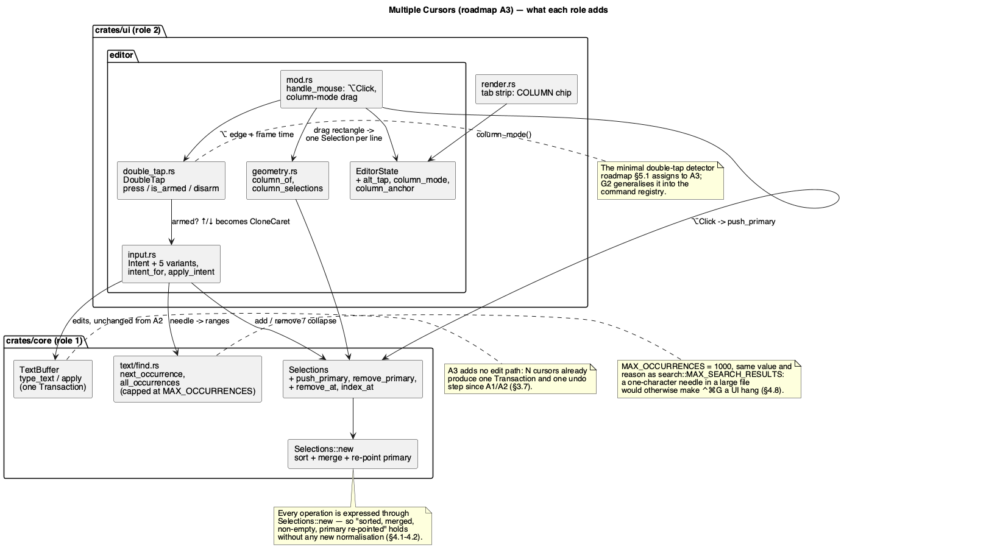

# Multiple Cursors

Roadmap phase **A3** (`docs/roadmap.md` §6, track A). Two roles, in the
project's declared order: **`rust-core-dev`** first, for the occurrence
search and the four `Selections` operations of §2.1, then **`rust-ui-dev`**
for the commands, the gestures and the double-tap detector. No
security-sensitive path is touched by either diff, so `hacker` is skipped.

## 1. Purpose

A2 already renders and edits N carets: `TextBuffer::selections()` holds a
`Selections`, `insert_at_selections`/`type_text`/`delete` build **one**
`Transaction` across all of them, and the widget paints every caret and
every selection. What is missing is the half that creates the second
cursor. Today a buffer always has exactly one, because nothing in the UI
ever calls `Selections::push`.

This phase adds the commands and gestures that create, remove and move
cursors, and nothing else — the editing machinery underneath is already
built and does not change.

Two consequences of that split are worth stating up front, because they are
what makes this phase small:

- **No new edit path.** Every multi-cursor edit goes through the
  `apply_intent` code A2 already ships, so "one edit, one `Transaction`,
  one undo step" (`docs/roadmap.md` A3 row) is inherited rather than
  re-implemented.
- **No new selection normalisation.** `Selections::new` already sorts,
  merges genuine overlaps, keeps touching selections apart and re-points
  `primary` at whichever selection absorbed the old one
  (`editor-engine.md` §2.4). Every operation below is expressed in terms of
  it.

### 1.1 Scope

In, by roadmap assignment (`docs/roadmap.md` §5.2 rows and the A3 row):

| Action | Binding | Kind |
|---|---|---|
| Add Caret | `⌥Click` | mouse |
| Add Selection for Next Occurrence | `⌃G` | key |
| Unselect Occurrence | `⌃⇧G` | key |
| Select All Occurrences | `⌃⌘G` | key |
| Clone Caret Above / Below | `⌥⌥` + `↑` / `↓` (double-tap) | key |
| Column Selection Mode | `⌘⇧8` | key (mode toggle) |
| Collapse to the primary caret | `Esc` | key |

Out: everything that merely *benefits* from multi-cursor and belongs to a
later phase — A4's smart indent over N carets, A5's find/replace (which
shares the occurrence search this phase introduces, and extends it with
case-insensitivity and regex), A11's live templates, D1's inline rename.
The command **registry** is B3: until it lands, these bindings live in the
same `handle_shortcuts`/`intent_for` pattern A2 uses, spelled exactly as
`docs/roadmap.md` §5.2 spells them (`CLAUDE.md`: never invent a binding).

### 1.2 One binding note for later

§5.2's table is the **JetBrains macOS** keymap, which is this project's
default. Four of this phase's bindings are among the cases where the
JetBrains Windows/Linux keymap genuinely diverges rather than just
substituting a modifier:

| Action | macOS (shipped here) | Windows/Linux (B3's `other` half) |
|---|---|---|
| Add Selection for Next Occurrence | `⌃G` | `Alt+J` |
| Unselect Occurrence | `⌃⇧G` | `Alt+Shift+J` |
| Select All Occurrences | `⌃⌘G` | `Ctrl+Alt+Shift+J` |
| Column Selection Mode | `⌘⇧8` | `Alt+Shift+Insert` |

This phase implements the macOS binding and records the divergence here;
entering both halves as `{ mac, other }` is B3's job, since that is where
the registry that can hold two halves is built (`docs/roadmap.md` §5.1).
§2.2's predicates are chosen so that none of these fires off macOS, rather
than firing on whatever key the modifier substitution happens to land on.

## 2. Interface / API

### 2.0 What already exists and is used unchanged

`Selections::{push, collapse_to_primary, all, primary, primary_index, len,
is_multiple, new, map}` and `Selection::{caret, new, start, end, range,
is_empty}` (`crates/core/src/text/selection.rs`), plus the whole of
`apply_intent` (`crates/ui/src/editor/input.rs`). Nothing in this phase
changes their behaviour.

### 2.1 `ide-core`: occurrence search and two `Selections` operations (role 1)

**New module `crates/core/src/text/find.rs`**, re-exported from
`crates/core/src/text/mod.rs` and from the crate root the same way
`Selection`/`Selections` are:

```rust
/// Byte range of the first occurrence of `needle` at or after `from`,
/// wrapping once to the start of the text. Plain, case-**sensitive**
/// substring matching: A5 is the phase that adds case-insensitivity and
/// regex, and doing it here would ship a half of A5 that A5 then has to
/// undo.
///
/// `None` when `needle` is empty, when it does not occur at all, or when
/// `from` is past `text.len()`.
pub fn next_occurrence(text: &str, needle: &str, from: usize) -> Option<Range<usize>>;

/// Every non-overlapping occurrence of `needle`, left to right, capped at
/// `MAX_OCCURRENCES`. Empty when `needle` is empty. Non-overlapping means
/// the scan resumes at the end of each match, so `"aa"` in `"aaaa"` yields
/// two matches, not three.
///
/// The cap is a hard requirement, not a nicety — see §4.8.
pub fn all_occurrences(text: &str, needle: &str) -> Vec<Range<usize>>;

/// Ceiling on the cursors one "Select All Occurrences" can create. Same
/// value and the same reason as `search::MAX_SEARCH_RESULTS`: buffer
/// content is untrusted file content, and an unbounded match count on a
/// one-character needle is a UI hang, not a big result set (§4.8).
pub const MAX_OCCURRENCES: usize = 1000;
```

**Three additions to `Selections`:**

```rust
impl Selections {
    /// Adds `selection` and makes it primary — the difference from `push`,
    /// which keeps the existing primary. "Add selection for next
    /// occurrence" needs it: the newly added occurrence is what `⌃⇧G`
    /// removes next and what the view scrolls to.
    ///
    /// Returns `false` when normalisation absorbed the new selection into
    /// an existing one, exactly as `push` does; the primary is then left
    /// where it was.
    pub fn push_primary(&mut self, selection: Selection) -> bool;

    /// Removes the primary selection and makes its predecessor (or, for
    /// index 0, its successor) primary. `false` and no change when there is
    /// only one selection — the type is non-empty by construction.
    pub fn remove_primary(&mut self) -> bool;

    /// Removes the selection at `index`. `false` and no change when
    /// `index` is out of range or when it would empty the set. `⌥Click` on
    /// an existing caret needs this: the cursor under the pointer is
    /// generally *not* the primary one (§3.1).
    ///
    /// `primary` keeps pointing at **the same selection** it pointed at,
    /// whatever index that selection shifts to. Only when `index` *is* the
    /// primary does it fall back the way `remove_primary` does — to the
    /// predecessor, or to the successor at index 0.
    pub fn remove_at(&mut self, index: usize) -> bool;

    /// Index of the selection `offset` falls in, if any — how `⌥Click`
    /// finds the cursor it may have to remove. A bare caret matches when
    /// `offset == head`; a non-empty selection matches when
    /// `start() <= offset && offset < end()`.
    pub fn index_at(&self, offset: usize) -> Option<usize>;
}
```

That is the entire `ide-core` diff. In particular **no new `TextBuffer`
method**: the search functions take `&str`, so the caller passes
`buffer.text()`, and nothing has to grow a second way to reach the text.

### 2.2 `ide-ui`: new intents (role 2)

`crates/ui/src/editor/input.rs`'s `Intent` gains six variants:

```rust
pub enum Intent {
    // ... A2's ten variants, unchanged ...

    /// `⌃G`. The needle is resolved by `apply_intent`, not by the caller:
    /// the primary selection's text, or the word under the primary caret
    /// when it is empty.
    AddNextOccurrence,
    /// `⌃⇧G`.
    UnselectOccurrence,
    /// `⌃⌘G`.
    SelectAllOccurrences,
    /// `⌘⇧8`. A mode toggle rather than an edit: it flips
    /// `EditorState::column_mode` and drops any anchor left over from a
    /// previous drag.
    ToggleColumnMode,
    /// `⌥⌥`+`↑`/`↓`. Only `Direction::Up`/`Down` are constructed.
    CloneCaret(Direction),
    /// `Esc`, when the editor is focused and has more than one selection.
    CollapseSelections,
}
```

**The exact predicates.** A binding name is not an implementation: egui's
`Modifiers` carries `ctrl`, `command` and `mac_cmd` separately, and
`command` is Cmd on macOS but **Ctrl** on Windows/Linux — so `ctrl &&
command` would fire on a plain `Ctrl+G` off macOS, where JetBrains binds
something else entirely (§1.2). `intent_for` matches exactly these:

| Binding | Predicate | `egui::Key` |
|---|---|---|
| `⌃G` | `ctrl && !command && !shift` | `Key::G` |
| `⌃⇧G` | `ctrl && !command && shift` | `Key::G` |
| `⌃⌘G` | `ctrl && mac_cmd` | `Key::G` |
| `⌘⇧8` | `mac_cmd && shift` | `Key::Num8` |
| `Esc` | `modifiers.is_none()` | `Key::Escape` |

**`command` or `mac_cmd`, and why the choice is not stylistic.**
`Modifiers::command` is Cmd on macOS and **Ctrl** everywhere else, which is
right exactly when the two JetBrains keymaps agree modulo that
substitution — which is why A2's `⌘S`/`⌘A`/`⌘Z` use it and keep working on
Windows/Linux as Ctrl+S/A/Z. All four of this phase's chorded bindings are
in the other category (§1.2): their Windows/Linux counterparts are
different keys entirely, so `command` would fire a binding that keymap does
not have — an invented binding by the back door. `mac_cmd` is never set off
macOS, so it ships the macOS half and nothing else. `⌃G`/`⌃⇧G` need no
`mac_cmd` because `ctrl` already means the physical Control key on every
platform; they only need `!command` so that a plain `Ctrl+G` off macOS —
where `ctrl` and `command` are both set — stays unclaimed.

The Windows/Linux halves are entered as the `other` half of a
`{ mac, other }` binding when B3 builds the registry that can hold two
halves. These predicates are what B3 replaces.

`intent_for` stays pure and stays the only place raw key events become
intents, with one exception it cannot own: `CloneCaret` depends on *when*
`⌥` was pressed, which is state. That state lives in a new pure module:

```rust
// crates/ui/src/editor/double_tap.rs

/// The minimal double-tap detector `docs/roadmap.md` §5.1 says A3 needs and
/// G2 later generalises into the command registry. Deliberately not a
/// timer: it is fed the frame's time, so it is testable without a clock.
#[derive(Debug, Default, Clone, Copy, PartialEq)]
pub struct DoubleTap {
    last_press: Option<f64>,
    armed_until: Option<f64>,
}

/// Two presses of the tracked modifier within this long arm the gesture.
pub const DOUBLE_TAP_WINDOW: f64 = 0.35;
/// How long the armed state survives without an arrow key.
pub const ARMED_WINDOW: f64 = 1.0;

impl DoubleTap {
    /// Feed the modifier's edge-detected state once per frame. Returns the
    /// new armed state, which is also `is_armed`'s answer until it expires.
    pub fn press(&mut self, now: f64) -> bool;
    pub fn is_armed(&self, now: f64) -> bool;
    /// Consumed when the gesture fires, so one double-tap clones one caret
    /// per arrow press but does not stay armed forever.
    pub fn disarm(&mut self);
}
```

`EditorState` gains four fields:

```rust
pub struct EditorState {
    // ... A2's six fields, unchanged ...

    /// `⌥⌥` detector for Clone Caret (§3.4).
    alt_tap: DoubleTap,
    /// `⌥`'s state last frame. `DoubleTap` is fed edges, and a modifier has
    /// no key event of its own to edge-detect from: `InputState::modifiers`
    /// follows only `Event::ModifiersChanged`.
    alt_down: bool,
    /// Column Selection Mode (§3.5). Public through `column_mode()` so the
    /// tab strip can show that it is on.
    column_mode: bool,
    /// Where a column-mode drag started, as `(line, column)` — the corner
    /// the rectangle is anchored at.
    column_anchor: Option<(usize, usize)>,
}

impl EditorState {
    pub fn column_mode(&self) -> bool;
}
```

`EditorOutput` is unchanged: every one of these commands acts on the buffer
in place, and the caller already learns about the caret through
`cursor_offset` and about edits through `changed`.

### 2.3 Geometry: two functions that column mode needs

Column selection is the one feature here that is genuinely geometric — it
maps a rectangle on screen to one selection per line. Two additions to
`crates/ui/src/editor/geometry.rs`, both pure:

```rust
/// The column (char index within the line) an absolute byte offset sits at.
pub fn column_of(buffer: &TextBuffer, offset: usize) -> usize;

/// One `Selection` per line in `lines`, spanning `columns` clamped to each
/// line's own length. Lines shorter than `columns.start` yield a bare caret
/// at their end rather than being skipped, which is what makes a column
/// selection usable for appending to ragged lines.
pub fn column_selections(
    buffer: &TextBuffer,
    lines: Range<usize>,
    columns: Range<usize>,
) -> Vec<Selection>;
```

## 3. Behaviour

### 3.1 `⌥Click` — add a caret

A click with `⌥` held adds a bare caret at the clicked offset instead of
replacing the selection, via `Selections::push_primary`. The new caret
becomes primary, so a subsequent `⌃⇧G` removes it and typing is visible at
the place the user just clicked.

`⌥Click` is a **toggle**, resolved before anything is added:
`Selections::index_at(offset)` is consulted first, and

- if it names a **bare caret** (`is_empty()`) — the cursor the user is
  clicking off — that index is removed with `remove_at`, unless it is the
  last one left, in which case nothing happens;
- if it names a **non-empty** selection, the gesture is a no-op: removing a
  range the user selected on purpose is not what it means;
- otherwise a bare caret is added with `push_primary`.

`⌥` is otherwise still the word-granularity modifier for arrows and
`⌥⌫`; there is no conflict, because that is the keyboard and this is the
pointer.

### 3.2 `⌃G` — add selection for next occurrence

1. If the primary selection is **empty**, the first `⌃G` selects the word
   under it (`geometry::word_range_at`, the same function the `Cmd`-hover
   link uses) and stops. This is JetBrains' behaviour and it is what makes
   the second `⌃G` unambiguous: the needle is now visible.
2. Otherwise the needle is the primary selection's text. `next_occurrence`
   is called with `from = primary.end()`, wrapping once, and the result is
   added with `push_primary`.
3. If `push_primary` returns `false` — the next occurrence is one the user
   already has — the command is a no-op. That is the natural stopping point
   once every occurrence is selected, and it needs no separate "did we wrap
   all the way round" bookkeeping.

The caret scrolls to the newly added occurrence (`EditorState::
pending_scroll`, the mechanism A2 already uses for keyboard movement).

Word-under-caret uses `word_range_at`'s existing rule, including its "a run
starting with a digit is a number, not a symbol" exception: on a number
literal the first `⌃G` selects nothing and the command is a no-op.

### 3.3 `⌃⇧G` and `⌃⌘G`

- **`⌃⇧G` (Unselect Occurrence)** removes the primary selection
  (`Selections::remove_primary`), which is the most recently added one for
  any sequence of `⌃G` presses. With one selection left it is a no-op.
- **`⌃⌘G` (Select All Occurrences)** resolves the needle exactly as `⌃G`
  does (word under an empty primary, otherwise the primary's text), calls
  `all_occurrences`, and replaces the selections with one per match. The
  match containing the old primary stays primary, so the view does not
  jump. On no needle it is a no-op. When the buffer holds more than
  `MAX_OCCURRENCES` matches, the first `MAX_OCCURRENCES` of them are
  selected and the rest are not — the truncation is silent in the model but
  visible in the editor (the cursors simply stop partway down the file),
  and §4.8 says why the alternative is worse.

Both are one `set_selections` call, so neither touches the undo history
beyond the group break `set_selections` already performs.

### 3.4 `⌥⌥` + `↑`/`↓` — clone caret above/below

The gesture is: press and release `⌥` twice within `DOUBLE_TAP_WINDOW`,
then press `↑` or `↓` while still holding `⌥` down. The detector sees only
the modifier's edges — `press` is called on the frame `modifiers.alt`
becomes true, having been false the frame before — so it never depends on
key repeat and it is fed `ui.input(|i| i.time)`, which is the same clock
`last_click` already uses.

While armed, `↑`/`↓` add a caret one line above/below **every** existing
caret, at each caret's own column, instead of moving them:

- A cloned caret lands at `min(column, target line's length)`, the same
  clamp vertical movement already uses, but the sticky `desired_column` is
  **not** consulted and **not** written: cloning is not movement, and
  letting it write the sticky column would make a subsequent `↓` jump to a
  column the user never chose.
- A clone that would land on an existing caret is absorbed by normalisation
  and simply does not appear, which is what makes holding `⌥⌥↓` at the
  bottom of the file stop cleanly.
- The gesture is disarmed by the arrow press (`disarm`), by
  `ARMED_WINDOW` elapsing, and by releasing `⌥`. So `⌥⌥↓↓` clones twice
  only if the second `↓` comes with the modifier still held and within the
  window — otherwise the second `↓` is plain movement again.

Plain `⌥↑`/`⌥↓` without the double-tap keep A2's meaning (move one row —
`vertical_granularity` ignores `alt`), so nothing that worked before
changes.

**Where the rewrite happens.** `intent_for` is pure and must stay that way,
so it keeps returning `Intent::Move { direction: Up | Down, .. }` for the
arrow. `Frame::handle_keys` is what consults `DoubleTap::is_armed(now)`:
when armed, it replaces that vertical `Move` with
`Intent::CloneCaret(direction)` and calls `disarm` before handing it to
`apply_intent`. Nothing else inspects the armed state, and `apply_intent`
never sees the modifier.

### 3.5 `⌘⇧8` — column selection mode

A toggle on `EditorState`. While it is on:

- A **drag** in the text area selects a rectangle: from the press point's
  `(line, column)` to the current `(line, column)`, producing one selection
  per line through `geometry::column_selections`. The selections are
  handed to `set_selections` as a whole; the line the pointer is on is
  primary.
- A plain **click** still places one caret, and every keyboard command
  still behaves as it does outside the mode. Column mode changes what a
  *drag* means and nothing else — which is why it is a mode and not a
  modifier gesture.
- The tab strip shows a small `COLUMN` chip while it is on
  (`EditorState::column_mode()`), because a mode with no visible state is a
  trap. There is no status bar in this app yet; when the B-track adds one,
  the indicator moves there.

Toggling the mode off leaves the selections it created alone — they are
ordinary selections.

### 3.6 `Esc` — collapse

`intent_for` cannot know how many selections there are, so it always maps
`Esc` to `Intent::CollapseSelections`, and `apply_intent` no-ops when there
is only one — that is the whole of the pure part.

The rest is about *consumption*, and it needs stating precisely because the
A2 widget consumes nothing: `handle_keys` reads
`ui.input(|i| i.events.clone())`, and `IdeApp::handle_shortcuts` reads the
context independently, so without a deliberate consume, one `Esc` would
collapse the cursors **and** dismiss the Usages popup **and** release
editor focus (A2 left `escape` out of the focus lock —
`code-editor-widget.md` §3.5), all in the same frame.

So: when the editor is focused **and** has more than one selection, it
consumes the key —
`ui.input_mut(|i| i.consume_key(egui::Modifiers::NONE, egui::Key::Escape))`
— before handling it. That stops egui from releasing focus, which is the
half of the problem the editor can solve on its own.

**Consumption alone is not enough, because the key never arrives.** A2 left
`escape` out of the widget's focus-lock filter (`code-editor-widget.md`
§3.5), and egui's `Focus::begin_pass` drops focus on `Esc` *before* any
widget's frame runs — so with `escape: false` the editor's `handle_keys`
never sees the event and could not consume or act on it. The filter is
therefore set per frame from the state that decides ownership:

```rust
let collapsible = self.buffer.text_buffer().selections().is_multiple();
ui.memory_mut(|m| {
    m.set_focus_lock_filter(
        self.id,
        egui::EventFilter { tab: true, horizontal_arrows: true,
                            vertical_arrows: true, escape: collapsible },
    );
});
```

With one cursor `escape` stays unlocked and `Esc` releases the editor
exactly as A2 shipped it; with several it is locked, the event reaches
`handle_keys`, and the `consume_key` above keeps egui from also dropping
focus on the same press. This supersedes `code-editor-widget.md` §3.5's
"`escape` stays unlocked".

**The popup needs the other half, because consumption is too late.**
`IdeApp::update` calls `handle_shortcuts` at `render.rs:774`, before any
panel is drawn, while the editor's `handle_keys` runs inside the central
panel much later in the same frame — so the popup's `Esc` check has already
read the key by the time the editor could consume it. `handle_shortcuts`
therefore gates its own dismissal on the editor not owning the key:

```rust
// render.rs, handle_shortcuts
let collapsing_cursors = self
    .active_tab
    .filter(|_| self.view_mode == ViewMode::Editor)
    .is_some_and(|idx| self.tabs[idx].buffer.text_buffer().selections().is_multiple());
if self.show_usages_popup
    && !collapsing_cursors
    && ctx.input(|i| i.key_pressed(egui::Key::Escape))
{
    self.show_usages_popup = false;
}
```

The condition is a plain predicate over state `handle_shortcuts` can
already reach, needs no ordering change, and reads as what it is: with
several cursors up, `Esc` belongs to the editor; otherwise it belongs to
the popup. This is the one place the editor consumes an event and the one
place `handle_shortcuts` yields one — deliberate on both sides, because
this is the only unmodified key two features both want.

Column selection mode is **not** cancelled by `Esc`: it is a mode, toggled
by its own binding, and JetBrains does not cancel it with `Esc` either.

### 3.7 Editing with N cursors

Unchanged from A2, and stated here only because it is the point of the
phase: `type_text`, `insert_at_selections` and `delete` each build one
`Transaction` covering every selection, so a multi-cursor edit is one undo
step, and `Selections::map` moves every cursor through the edit afterwards.
A run of typed characters still coalesces into a single undo step
(`editor-engine.md` §3.5).

## 4. Constraints & invariants

1. **Non-empty by construction.** Every *adding* operation goes through
   `Selections::new`, and the removing ones refuse to remove the last
   selection, so there is always at least one.
2. **Sorted and non-overlapping.** Guaranteed by `Selections::new` for
   everything that adds; nothing constructs a `Selections` field-by-field
   from outside the type. **Removal is the exception, and deliberately so:**
   `remove_at`/`remove_primary` drop one element and re-point `primary`
   themselves, because taking an element out of a sorted, non-overlapping
   list cannot reorder it or create an overlap — and because re-running
   `new` would re-derive `primary` from a marker, which is exactly what
   §2.1's "primary follows the same selection" rule forbids.
3. **Byte offsets on char boundaries.** `next_occurrence`/`all_occurrences`
   return `str::find`-derived ranges, which are boundaries by construction;
   `column_selections` goes through `geometry`'s existing
   `byte_offset_in_line`, which clamps to the line's end.
4. **One edit, one undo step** — inherited from A1/A2 (§3.7), not
   re-implemented.
5. **No new keyboard reading outside `intent_for`.** The double-tap
   detector consumes `modifiers.alt` state the widget already reads; it does
   not add a second `ctx.input` call site, and it is what B3 will lift into
   the registry (`CLAUDE.md`'s rule).
6. **Cost.** `next_occurrence` is O(n) in the buffer, `all_occurrences`
   O(n) once; both run on a keystroke, not per frame. `column_selections`
   is O(lines in the rectangle). Nothing here is in the paint path, so A2's
   O(visible) frame bound is untouched.
7. **No colour literals** — the `COLUMN` chip uses `Tokens`, and the ban
   test's file list grows by `editor/double_tap.rs`
   (`fleet-look-foundation.md` §4.1).
8. **At most `MAX_OCCURRENCES` cursors from one command.** A buffer holds
   file content, which is untrusted, and the needle can be a single
   character the user selected. Without a cap, `⌃⌘G` on `"e"` in a 5 MB
   file yields on the order of 500 000 selections, and two things then fall
   over: A2's painter walks **every** selection for **every** visible line
   (`editor/mod.rs`'s `paint_selections`/`paint_carets` are called inside
   the per-visible-line loop), so a frame becomes tens of millions of
   iterations; and the next keystroke builds a single `Transaction` with
   half a million changes. `crates/core/src/search.rs`'s
   `MAX_SEARCH_RESULTS` is the same decision for the same reason, so this
   phase reuses its value. Selecting 1000 occurrences and stopping is a
   worse result than selecting all of them, and a much better one than a
   frozen window. Independently of the cap, paint cost stays
   O(selections × visible lines) until some later phase narrows the per-line
   lookup to a binary search — with the cap it is bounded, not fixed.

## 5. Examples

**Select every occurrence of the word under the caret, then edit them all:**

```rust
// ⌃⌘G
let needle = "count";
let ranges = ide_core::all_occurrences(buffer.text(), needle);
let selections = Selections::new(
    ranges.iter().map(|r| Selection::new(r.start, r.end)).collect(),
    0,
);
buffer.text_buffer_mut().set_selections(selections);

// typing now replaces all of them in one transaction, one undo step
buffer.text_buffer_mut().type_text("total");
```

**Adding occurrences one at a time, and running out:**

```rust
let mut selections = buffer.text_buffer().selections().clone();
let primary = selections.primary();
let needle = &buffer.text()[primary.range()];
if let Some(next) = ide_core::next_occurrence(buffer.text(), needle, primary.end()) {
    // false once every occurrence is already selected: ⌃G becomes a no-op
    let added = selections.push_primary(Selection::new(next.start, next.end));
    assert!(added || selections.len() == all_occurrences(buffer.text(), needle).len());
}
```

**The double-tap detector, tested without a clock:**

```rust
let mut tap = DoubleTap::default();
assert!(!tap.press(0.00));            // first ⌥ press: not armed
assert!(tap.press(0.20));             // second within the window: armed
assert!(tap.is_armed(0.50));
assert!(!tap.is_armed(1.40));         // ARMED_WINDOW elapsed
```

## 6. Dependencies & integration points

**Depends on**: A1's `Selections`/`Transaction`/`TextBuffer` and A2's
widget, `EditorState`, `apply_intent` and `geometry` — all merged.

**Consumed by**: A4 (smart indent must respect N carets), A5 (find/replace
reuses `next_occurrence`/`all_occurrences` and extends them),
A11 (live templates are multi-cursor with tab-stops), D1 (inline rename
edits every occurrence at once), G2 (generalises `DoubleTap` into the
registry, per §5.1).

**Tests.** `#[cfg(test)] mod tests` alongside the code, ≥80% line coverage
on every non-rendering file touched.

*Role 1 (`ide-core`):*

1. `next_occurrence`: found after `from`; wraps to an earlier match; `None`
   for an empty needle, a needle that does not occur, and `from >
   text.len()`; a match at exactly `from`; a multi-byte needle, asserting
   the returned range is on char boundaries.
2. `all_occurrences`: every match, left to right; non-overlapping (`"aa"`
   in `"aaaa"` is two); empty needle is empty; no match is empty; **stops
   at `MAX_OCCURRENCES`** on a text with more matches than that.
3. `push_primary`: adds and re-points primary; returns `false` and leaves
   primary alone when absorbed.
4. `remove_primary`: removes the primary and re-points at the predecessor;
   at index 0 re-points at the successor; `false` with one selection left.
   `remove_at`: removes a non-primary selection and keeps primary pointing
   at the same selection it did before; `false` out of range and `false`
   on the last one. `index_at`: finds a caret at exactly that offset, finds
   the selection containing an interior offset, `None` outside.

*Role 2 (`ide-ui`):*

5. `DoubleTap`: two presses inside the window arm; two outside do not; the
   armed state expires after `ARMED_WINDOW`; `disarm` clears it; a third
   press re-arms.
6. `intent_for`: each row of §2.2's predicate table maps to its intent, and
   the near misses do **not** — `⌘G` yields `None`, `⌃G` with `command`
   also set (a plain `Ctrl+G` off macOS) yields `None`, and every A2
   binding still maps to what it mapped to before.
7. `apply_intent`: `AddNextOccurrence` on an empty primary selects the word;
   on a selection adds the next occurrence; is a no-op when everything is
   already selected; `SelectAllOccurrences` selects all;
   `UnselectOccurrence` removes the last added and is a no-op at one;
   `CollapseSelections` collapses, and is a no-op on a single selection
   (which is what leaves `Esc` to the popup).
8. `CloneCaret`: clones above and below at the same column; clamps to a
   short line; is absorbed at the file's edges; does not write
   `desired_column`.
9. `column_of` / `column_selections`: a rectangle over ragged lines yields
   one selection per line, clamped; a rectangle whose columns are reversed
   is normalised; a single-column rectangle yields bare carets.
10. Harness (`egui_kittest`): `⌥Click` adds a second caret and typing edits
    both in one undo step; a second `⌥Click` on that caret removes it;
    `Esc` collapses back to one.
11. `Esc` precedence, at `IdeApp` level (no harness needed — it is a
    predicate): with the Usages popup open and the active tab holding
    several selections, `handle_shortcuts` leaves the popup open; with one
    selection, or in Source Control view, or with no active tab, it closes
    it exactly as it does today.

## 7. Diagram



## Revision notes

Round 1 review (5 findings, 4 blocking).

1. **`⌥Click` had no API behind it.** §3.1 specified removing the cursor
   under the pointer, but §2.1 offered only `remove_primary`, and that
   cursor is generally not the primary one. Added `Selections::remove_at`
   and `index_at`, and rewrote §3.1 as an explicit three-way toggle
   (bare caret → remove, non-empty selection → no-op, otherwise → add).
2. **Binding names were not tied to predicates, and one pair collided off
   macOS.** `egui::Modifiers::command` is Cmd on macOS but Ctrl elsewhere,
   so a naive `⌃⌘G` would have fired on a plain `Ctrl+G` on Windows/Linux.
   §2.2 gained the predicate table, with `mac_cmd` for the one binding that
   needs to be macOS-only, and the `egui::Key` names spelled out.
3. **`⌃⌘G` could freeze the window.** `all_occurrences` was uncapped, and a
   one-character needle in a large file yields hundreds of thousands of
   selections — which A2's painter walks per visible line, and which the
   next keystroke turns into one enormous `Transaction`. Added
   `MAX_OCCURRENCES` (1000, the value and rationale `search.rs` already
   uses), the truncation behaviour in §3.3, and invariant §4.8.
4. **§3.6 described event consumption the widget does not do.** A2 consumes
   nothing, so `Esc` would have collapsed the cursors *and* dismissed the
   Usages popup *and* released focus in one frame. §3.6 now splits the pure
   part (always an intent, no-op on one selection) from the consumption
   (`consume_key`, only when focused with more than one selection) and says
   why this is the one place the editor consumes.
5. §3.4 didn't say who rewrites an armed `⌥⌥` + arrow into `CloneCaret`.
   It is `handle_keys`, so `intent_for` stays pure — now stated, with
   `disarm` at the same point.

Round 2 review (4 findings, 2 blocking).

6. **`⌘⇧8`'s predicate invented a Windows/Linux binding.** `command` is
   Ctrl off macOS, so `command && shift` would have fired on Ctrl+Shift+8,
   which JetBrains' Windows/Linux keymap does not bind (it uses
   `Alt+Shift+Insert`). Changed to `mac_cmd && shift`, added the row to
   §1.2's divergence table, and stated the rule the choice follows:
   `command` where the two keymaps agree modulo the modifier (as A2's
   `⌘S`/`⌘A`/`⌘Z` do), `mac_cmd` where they diverge.
7. **The `Esc` hand-off could not work as written.** `handle_shortcuts`
   runs at `render.rs:774`, before any panel is drawn, so the Usages
   popup reads `Esc` earlier in the frame than the editor's `consume_key`
   could remove it — the popup would have closed anyway. §3.6 now gives
   `handle_shortcuts` an explicit gate (`!collapsing_cursors`), keeps the
   `consume_key` for the focus-release half, and §6 gained test 11 for the
   precedence.
8. `remove_at`'s primary re-pointing was specified two ways (§2.1 said
   "like `remove_primary`", §6 said "keeps pointing at the same
   selection"). Stated once, in §2.1: it follows the same selection, and
   falls back only when the removed index *is* the primary.
9. `index_at`'s boundary was unstated; §2.1 now says a caret matches at
   `offset == head` and a non-empty selection on `start() <= offset <
   end()`.

Round 3 review (5 findings, 4 in the code, 1 here).

10. **§2.2 listed five `Intent` variants but bound six.** The predicate
    table has always carried `⌘⇧8`, which needs an intent of its own;
    `ToggleColumnMode` is now spelled out with the others.
11. **§2.2's `EditorState` needed a fourth field.** `DoubleTap` is fed the
    modifier's *edges*, and a modifier has no key event to edge-detect
    from — `InputState::modifiers` follows only `Event::ModifiersChanged`.
    `alt_down: bool` holds last frame's state so the rising edge is
    computable.
12. **§3.6's `consume_key` could not run as written.** egui's
    `Focus::begin_pass` drops focus on `Esc` before any widget's frame, so
    with A2's `escape: false` filter the event never reached `handle_keys`
    at all. §3.6 now sets the filter's `escape` from
    `selections().is_multiple()` — locked exactly while `Esc` belongs to
    the editor — and says that this supersedes `code-editor-widget.md`
    §3.5.
13. The other three findings were code-only and fixed in
    `rust-ui-dev/multiple-cursors` before merge: `select_all_occurrences`
    re-pointed `primary` from the caret rather than from the resolved
    needle range (a caret at a word's end made the view jump to the first
    match, contradicting §3.3); a column-mode drag had no ceiling on the
    selections it could create, which §4.8 requires of `⌃⌘G` for the same
    painter-cost reason, and is now clamped to `MAX_OCCURRENCES` lines; and
    a misplaced rustdoc block in `app.rs`.
