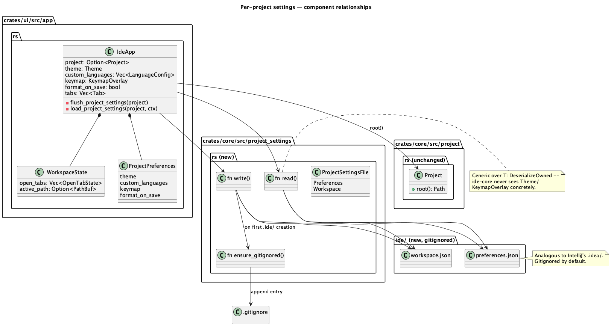
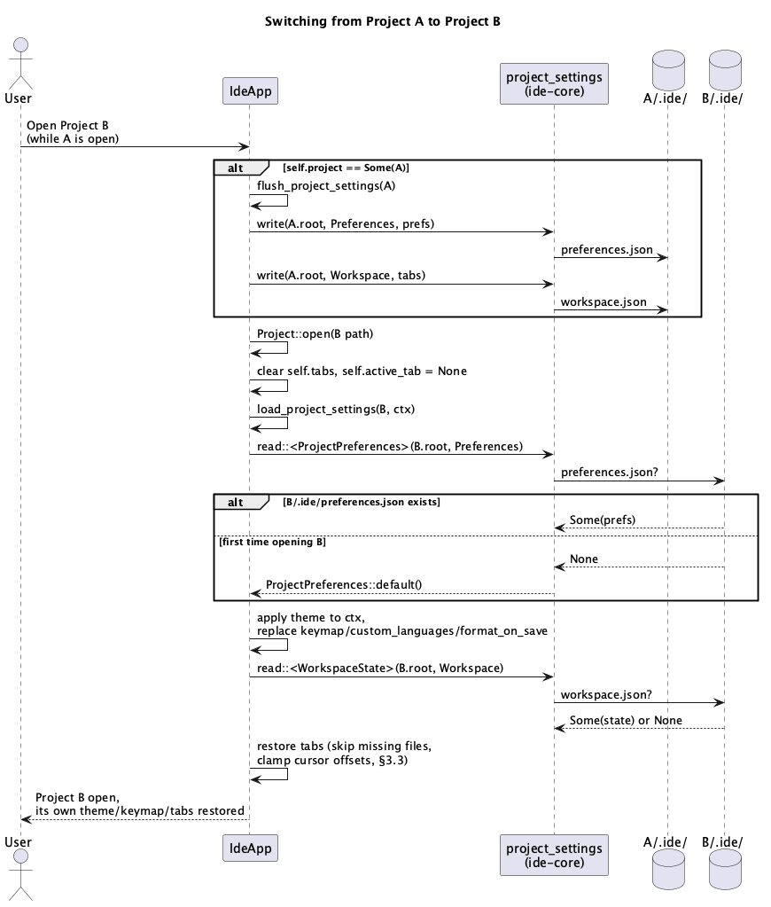

# Per-project settings (`.ide/`)

## 1. Purpose

Today every user-adjustable setting that has any persistence at all
(theme, custom language-server configs, keymap overrides, format-on-save)
is written to **one global `eframe::Storage` blob**, shared across every
project this IDE has ever opened on this machine. Opening project B after
project A shows A's theme, A's keymap overrides and A's language configs
in B — there is no such thing as a project-specific preference, and open
tabs/cursor positions aren't persisted at all, so every restart starts
from a blank editor.

This feature moves those settings into a directory inside each project's
own root, `<project_root>/.ide/`, mirroring IntelliJ-based IDEs' `.idea/`
directory. Switching projects switches settings; each project remembers
its own open tabs and cursor positions across restarts; and because the
directory lives inside the project, a team could choose to check it in
(not the default here — see §3.5).

**Explicitly per-project as of this feature:** theme, custom language
configs, keymap overrides, format-on-save, and (new) open tabs/cursor
position. **Stays global:** which project to reopen at startup
(`LAST_PROJECT_STORAGE_KEY`, unaffected by this doc) — that's a fact about
the IDE, not about any one project. A future run-configurations/database-
connections feature (not built yet) is expected to add its own file(s)
under the same `.ide/` directory rather than growing the two files this
doc defines; see §3.4.

### 1.1 Diagrams




## 2. Interface

### 2.1 `ide-core`: `crates/core/src/project_settings.rs`

A generic, project-root-scoped read/write helper. Knows nothing about
`Theme`/`KeymapOverlay`/tab state — those types live in `ide-ui` (`Theme`
wraps `egui::Visuals` choices, out of reach for `ide-core`); this module
only needs `T: Serialize`/`DeserializeOwned`.

```rust
pub const SETTINGS_DIR_NAME: &str = ".ide";

#[derive(Debug, Clone, Copy, PartialEq, Eq)]
pub enum ProjectSettingsFile {
    /// Stable preferences: theme, keymap overrides, custom language
    /// configs, format-on-save. Analogous to IntelliJ's non-workspace
    /// `.idea/*.xml` files.
    Preferences,
    /// Volatile session state: open tabs, active tab, cursor offsets.
    /// Analogous to IntelliJ's `.idea/workspace.xml`.
    Workspace,
}

impl ProjectSettingsFile {
    /// `"preferences.json"` / `"workspace.json"`.
    fn file_name(self) -> &'static str { .. }
}

#[derive(Debug, thiserror::Error)]
pub enum ProjectSettingsError {
    #[error("io error: {0}")]
    Io(#[from] std::io::Error),
    #[error("malformed settings file: {0}")]
    Malformed(#[from] serde_json::Error),
}

/// Reads and deserializes `project_root/.ide/<file>`. Returns `Ok(None)`
/// if the file doesn't exist yet (a brand-new project, or a project that
/// has never saved this particular file) -- this is the expected,
/// non-error case for a project's first session, not a failure.
/// `Malformed` on a file that exists but doesn't parse (hand-edited into
/// invalid JSON, truncated by a crash mid-write) -- the caller falls back
/// to defaults exactly as it would for `Ok(None)`; see §3.2.
pub fn read<T: serde::de::DeserializeOwned>(
    project_root: &std::path::Path,
    file: ProjectSettingsFile,
) -> Result<Option<T>, ProjectSettingsError>;

/// Serializes `value` and writes it to `project_root/.ide/<file>`,
/// pretty-printed (these files are meant to be human-readable, same as
/// `.idea/*.xml`). Creates `.ide/` if it doesn't exist yet, and on that
/// first creation also calls `ensure_gitignored` (see below). Writes to
/// `<file>.tmp` in the same `.ide/` directory first, then renames it over
/// the real target (`std::fs::rename`) so a crash mid-write can never
/// leave a truncated/corrupt file in place -- the rename is atomic
/// because the temp file is always a sibling of its target, same
/// filesystem by construction.
pub fn write<T: serde::Serialize>(
    project_root: &std::path::Path,
    file: ProjectSettingsFile,
    value: &T,
) -> Result<(), ProjectSettingsError>;

/// Appends a `.ide/` ignore entry to `project_root/.gitignore`, creating
/// that file if it doesn't exist. No-ops if an entry already covers it
/// (a literal `.ide/`, `.ide`, or `/.ide/` line -- checked textually, not
/// via gitignore pattern semantics, since anything fancier is out of
/// scope for one directory). Called automatically by `write` the first
/// time it creates `.ide/` for a project; also exposed standalone in case
/// a future caller needs it without writing a settings file in the same
/// call.
pub fn ensure_gitignored(project_root: &std::path::Path) -> std::io::Result<()>;
```

**Path safety.** `project_root` is always the caller's already-canonicalized
`Project::root()` (§2.2 of `project.rs`) — this module never accepts a
project root from anywhere else. `.ide/` is joined from the fixed literal
`SETTINGS_DIR_NAME`, never from caller input, so there is no new path-
traversal surface at the directory level. Individual entries *inside*
`Workspace`'s tab list are relative paths supplied by `ide-ui`
(§2.2 below) — `ide-core` does not interpret them (they're just strings
inside a JSON payload it round-trips).

`ide-ui`'s restore path is a **new** path-provenance source, not an
existing one: `open_file`'s current doc comment (`crates/ui/src/app.rs`)
states paths must come only from `scan_tree()` or a native-dialog result
— there is no existing generic "is this path inside the project root"
helper to reuse, so this feature must add one rather than assuming
precedent. `Path::join` silently discards the base when the joined
component is absolute (`project_root.join("/etc/passwd")` ==
`/etc/passwd`), so the exact check before ever calling `open_file` with a
restored path is: reject `state.path` outright if `Path::components()`
yields an absolute prefix or any `Component::ParentDir` (`..`); otherwise
join onto `project_root`, canonicalize via the existing
`canonicalize_best_effort`, and require the result to `starts_with`
`project_root`. A restored path failing this check is skipped exactly
like a missing file (§3.3) — never passed to `open_file`. `open_file`'s
doc comment gains this as a third, gated path source when this lands.

### 2.2 `ide-ui`: `crates/ui/src/app.rs`

```rust
/// Everything this feature moves out of the old global `eframe::Storage`
/// keys and into `.ide/preferences.json`. Not `#[derive(Default)]`: the
/// fallback values must match exactly what `IdeApp::new` used to fall
/// back to when a global key was absent (`Theme::Dark`, `false`, ...),
/// so this has its own explicit `impl Default`.
#[derive(Debug, Clone, serde::Serialize, serde::Deserialize)]
struct ProjectPreferences {
    theme: Theme,
    custom_languages: Vec<ide_core::LanguageConfig>,
    keymap: KeymapOverlay,
    format_on_save: bool,
}

/// `.ide/workspace.json`'s shape. Paths are relative to the project root
/// (portable if the directory ever moves; also just less noisy to read
/// by hand than an absolute path would be).
#[derive(Debug, Clone, Default, serde::Serialize, serde::Deserialize)]
struct WorkspaceState {
    open_tabs: Vec<OpenTabState>,
    /// The relative path of the tab that was active, not an index --
    /// indices don't survive a restore where some remembered files are
    /// missing (see §3.3).
    active_path: Option<std::path::PathBuf>,
}

#[derive(Debug, Clone, serde::Serialize, serde::Deserialize)]
struct OpenTabState {
    path: std::path::PathBuf,
    /// Primary cursor's byte offset only -- not multi-cursor state, not
    /// fold state. A deliberate v1 cut, same shape as `claude-terminal.md`
    /// §4.3's "resize does not reflow": worth doing, not worth blocking
    /// this feature on. Clamped to the reopened buffer's length on
    /// restore in case the file shrank since the offset was saved.
    cursor_offset: usize,
}
```

New private `IdeApp` methods:

```rust
/// Builds `ProjectPreferences`/`WorkspaceState` from current in-memory
/// state and writes both to `project.root()`. Called from `save()` and
/// from `load_project` right before switching away from the
/// currently-open project (§3.1). A write failure is swallowed (matches
/// `eframe::App::save`'s `()` return -- there is no caller to propagate
/// an error to); this frame's settings simply don't persist, and the
/// next successful write catches up.
fn flush_project_settings(&mut self, project: &ide_core::Project);

/// Reads `project.root()`'s `.ide/preferences.json` (or
/// `ProjectPreferences::default()` if absent/malformed) into `self`,
/// re-applying the theme to `ctx` immediately. Then reads
/// `.ide/workspace.json` and restores tabs (§3.3).
fn load_project_settings(&mut self, project: &ide_core::Project, ctx: &egui::Context);
```

## 3. Behaviour

### 3.1 Project switch (`load_project`)

1. If `self.project` is `Some(old)` (this is a *switch*, not the first
   project of the session), call `flush_project_settings(old)` before
   touching anything else. This runs unconditionally, even if step 2
   below ends up failing — flushing the old project's own settings to
   its own directory is harmless either way, so there's nothing to roll
   back.
2. Open the new project (existing `Project::open`/`Project::create` logic,
   unchanged).
3. On success: **clear `self.tabs = Vec::new()` and `self.active_tab =
   None`.** `load_project`'s current body (`crates/ui/src/app.rs`) does
   not clear the tab list on a switch today — tree scan and LSP restart
   are async and don't touch `self.tabs` either — so without this
   explicit step, the new project's restored tabs (step 5) would append
   onto whatever the old project had open instead of replacing it. This
   also happens to fix a latent pre-existing gap (today, switching
   projects already leaves the old tabs open); that's an intentional
   side effect of this step, not a separate change.
4. Call `load_project_settings(&new_project, ctx)`'s preferences half —
   this **overwrites** `self.theme`/`self.custom_languages`/
   `self.keymap`/`self.format_on_save` with the new project's saved
   values, or with `ProjectPreferences::default()` if it has none yet. A
   project's preferences are never inherited from whatever the previous
   project had in memory — that would silently defeat the whole point of
   this feature. This must run before any of `load_project`'s existing
   LSP/active-language detection (which reads `self.custom_languages`) —
   in practice this is automatic, since that detection happens later,
   asynchronously, via `poll_tree_scan` → `redetect_language`, well after
   this synchronous call returns.
5. `load_project_settings`'s workspace half restores tabs into the
   now-empty `self.tabs` per §3.3.
6. Continue the rest of `load_project`'s existing logic (tree scan, LSP
   setup) unchanged — it already re-derives everything from the fresh
   project root.

### 3.2 First open of a project with no `.ide/` yet

`read` returns `Ok(None)`; `ProjectPreferences::default()`/
`WorkspaceState::default()` are used (no tabs restored, preferences reset
to the same defaults a fresh install would show). Nothing is written to
disk until the next `flush_project_settings` call — opening a project
read-only-so-far (never edited, never switched away from, app not yet
closed) never creates `.ide/` on its own.

### 3.3 Workspace restore

For each `OpenTabState` in `open_tabs`, in order: run the absolute-or-`..`
rejection and canonicalized-containment check from §2.1's path-safety
note, and confirm the result still exists, before calling the existing
`open_file` path. A path that fails either check is skipped, not an
error — the file was deleted, moved outside the project, escapes the
project root, or the settings file was hand-edited. After
every openable tab is restored, find the live tab whose path matches
`active_path` and set `self.active_tab` to its index; if none matches
(the previously-active file is the one that's now missing), fall back to
the first restored tab, or `None` if nothing restored. Each restored
tab's cursor offset is clamped to `0..=buffer.len()` before
`set_selections`, since the file may have shrunk since the offset was
saved.

Untitled/unsaved tabs are never included in `open_tabs` — they have no
stable path to restore by, so they're simply not there next session, same
as today.

`workspace.json` is untrusted input — it can arrive hand-edited or from a
cloned repository the user hasn't yet audited — so restore only processes
the first `MAX_RESTORED_TABS` (50) entries in `open_tabs`, silently
ignoring the remainder the same way an individual failing entry is
silently skipped. Without this cap, `open_file`'s existing per-open
tab-dedup scan makes restoring `n` distinct entries an `O(n²)` operation
run synchronously on the UI thread, so an `open_tabs` array listing many
thousands of a large repository's real (already-existing) files is a
live, practically-reachable UI freeze on project open, not just a
theoretical one — found and confirmed via a live cost-model benchmark
during this feature's `ide-ui` hacker pass
(`docs/security-findings/rust-ui-dev-project-settings-2026-08-25.md`).

### 3.4 Extensibility for future settings

`ProjectSettingsFile` is a closed enum today (`Preferences`, `Workspace`)
because those are the only two categories that exist. A future feature
needing its own project-scoped state (run configurations, saved database
connections — neither exists yet) adds a **new variant** (its own file,
e.g. `run_configurations.json`) rather than growing `ProjectPreferences`
or `WorkspaceState` — keeps an unrelated feature's bug from corrupting
these two, and keeps this doc's two structs from becoming a dumping
ground. Every field in every settings struct uses `#[serde(default)]` (or,
for the top-level structs, tolerates a wholly missing file via `read`'s
`Ok(None)`) specifically so that adding a field later never breaks
deserialization of a settings file written by an older build.

### 3.5 `.gitignore`

Per the user's explicit choice, `.ide/` is gitignored by default:
`ensure_gitignored` runs the first time `write` creates the directory for
a project. This only touches the project's `.gitignore` textually
(append, create-if-absent) — it never touches git's index or working
tree state, and never runs at all for a project that already has some
form of `.ide` ignore entry.

## 4. Constraints & invariants

- All I/O in `crates/core/src/project_settings.rs` is synchronous
  `std::fs`, matching `ide-core`'s existing convention (`project.rs`'s
  own module doc) — these files are small (a settings struct, a short
  tab list), so unlike `scan_tree` there is no need to thread this.
- `write` never leaves a partially-written file in place on crash/power
  loss (write-to-temp-then-rename).
- No `unwrap`/`expect` on any path reachable from real filesystem state —
  a malformed or truncated `.ide/*.json` degrades to defaults, never
  panics or blocks opening the project.
- The four migrated global `eframe::Storage` keys
  (`THEME_STORAGE_KEY`/`CUSTOM_LANGUAGES_STORAGE_KEY`/
  `KEYMAP_STORAGE_KEY`/`FORMAT_ON_SAVE_STORAGE_KEY`) are removed from
  `IdeApp::new`'s startup read and from `save()`'s write — an old global
  storage file that still has these keys is simply never read again
  (harmless orphan data, not a migration this doc needs to handle: this
  is a personal, unshipped dev tool with no real users to migrate).
  `LAST_PROJECT_STORAGE_KEY` is untouched.
- With no project open (welcome screen), theme/keymap/format-on-save use
  their hardcoded defaults — there is no longer a "global last-used"
  fallback for these, matching this feature's per-project framing.

## 5. Examples

### 5.1 `ide-core` read/write round trip

```rust
use ide_core::project_settings::{self, ProjectSettingsFile};
use serde::{Deserialize, Serialize};

#[derive(Serialize, Deserialize, PartialEq, Debug)]
struct Example { count: u32 }

let dir = tempfile::tempdir().unwrap();
assert_eq!(
    project_settings::read::<Example>(dir.path(), ProjectSettingsFile::Preferences).unwrap(),
    None,
);

project_settings::write(dir.path(), ProjectSettingsFile::Preferences, &Example { count: 3 }).unwrap();

assert_eq!(
    project_settings::read::<Example>(dir.path(), ProjectSettingsFile::Preferences).unwrap(),
    Some(Example { count: 3 }),
);
assert!(dir.path().join(".gitignore").exists());
```

`ensure_gitignored` is also directly testable on its own: called twice in
a row on the same directory writes the ignore entry once (idempotent —
the second call is a no-op since the entry already covers `.ide/`), and
called on a directory with a pre-existing `.gitignore` containing
unrelated entries appends rather than overwrites.

### 5.2 Project switch preserves each project's own theme

```text
open ProjectA (no .ide/ yet)      -> theme = Theme::Dark (default)
set theme = Theme::Light, edit some files
switch to ProjectB                -> flush_project_settings(A) writes
                                      A/.ide/preferences.json {theme: Light, ...}
                                   -> B has no .ide/ yet -> theme = Theme::Dark
switch back to ProjectA           -> flush_project_settings(B)
                                   -> load_project_settings(A) reads
                                      A/.ide/preferences.json -> theme = Light
```

### 5.3 Workspace restore skips a deleted file

```text
session 1: ProjectA open with tabs [src/lib.rs, src/main.rs], active = src/main.rs
           -> .ide/workspace.json: open_tabs=[lib.rs@40, main.rs@0], active_path=main.rs
(user deletes src/main.rs outside the IDE)
session 2: open ProjectA
           -> lib.rs restored (cursor at offset 40, clamped to its length)
           -> main.rs skipped (no longer exists)
           -> active_path "main.rs" matches no live tab -> falls back to lib.rs
```

## 6. Dependencies & integration points

- `serde_json` becomes a **direct** dependency of `ide-core`
  (`crates/core/Cargo.toml`). Not a new crate in the workspace — it's
  already a direct dependency of `ide-lsp` for JSON-RPC framing and
  already resolves in `Cargo.lock` — this only adds it to a second
  crate's `Cargo.toml` for the same purpose (JSON (de)serialization) it
  already serves. **This is not self-approving**: `serde_json` isn't in
  CLAUDE.md's dependency table, which is an explicit enumerated
  exception list ("anything beyond this table still needs asking
  first") — the reasoning above is the case *for* asking, not a
  substitute for it. The user needs to explicitly sign off before
  `rust-core-dev` adds the line, even though the crate itself is already
  vetted elsewhere in this workspace.
- `crates/core/src/project_settings.rs` is new, alongside the existing
  flat-file module convention (`project.rs`, `buffer.rs`, `language.rs`)
  rather than a new subdirectory.
- `crates/ui/src/app.rs`: removes the four global-storage read/write call
  sites (`IdeApp::new`, `eframe::App::save`), adds `ProjectPreferences`/
  `WorkspaceState`/`OpenTabState`, `flush_project_settings`,
  `load_project_settings`, and wires both into `load_project`.
- `docs/roadmap.md`/`CLAUDE.md` are not otherwise touched by this doc —
  this is additive to the existing dev-chain security-sensitive-paths
  list, not a new entry: `crates/core/src/project_settings.rs` sits next
  to `crates/core/src/project.rs`, already covered by CLAUDE.md's "Any
  code that reads a user-chosen directory as a project root" bullet, so
  the existing rule already routes this through a `hacker` pass without
  needing a wording change.

## Revision notes

First `rev` pass found one implementation-blocking gap and one
under-specified security check, both fixed in place:

1. §3.1 didn't clear `self.tabs`/`self.active_tab` before restoring the
   new project's workspace state. `load_project`'s actual current body
   never clears the tab list on a switch (tree scan/LSP restart are async
   and don't touch it either), so as originally written the new
   project's restored tabs would have appended onto the old project's
   still-open ones. Fixed by adding an explicit clear step (now step 3)
   and renumbering the rest of the sequence.
2. §2.1/§3.3's path-safety reasoning cited a precedent that doesn't
   actually exist (`open_file`'s real invariant is provenance
   restriction, not a reusable containment-check helper) and didn't
   specify the actual check, leaving an absolute-path `Path::join`
   footgun open. Fixed by specifying the exact algorithm (reject
   absolute/`..` components, then canonicalize-and-`starts_with`) and
   correcting the precedent claim.
3. Three Low nits: §6 now says explicitly that the `serde_json`
   dependency still needs the user's sign-off (the "already used
   elsewhere" reasoning doesn't self-approve it under CLAUDE.md's
   enumerated-exceptions rule); §5.1 gained a couple of sentences on
   `ensure_gitignored`'s own idempotency/append behavior; §2.1's temp-file
   naming is now spelled out (`<file>.tmp`, same directory).
4. `ide-ui` hacker pass (post-merge-review, `rust-ui-dev-project-settings-
   2026-08-25.md`) found a Medium DoS: §3.3's restore loop had no cap on
   `open_tabs`, and `open_file`'s existing per-open dedup scan makes
   restoring `n` distinct entries `O(n²)`, live-benchmarked as a
   multi-second-to-minutes UI-thread freeze at realistic repository file
   counts. Fixed by capping restore to the first `MAX_RESTORED_TABS` (50)
   entries; §3.3 now documents the cap and its rationale.
