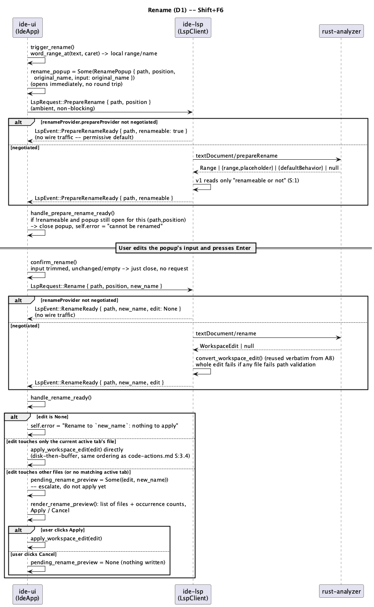

# Rename Refactoring (D1)

## 1. Purpose

`⇧F6` — rename the symbol at the caret, project-wide, via
`textDocument/prepareRename` + `textDocument/rename`. `docs/roadmap.md`
names this the phase that opens track **D** (refactoring): every later
refactoring in that track (extract, inline, change signature) is another
`CodeAction`-shaped `WorkspaceEdit` on top of the exact machinery
`code-actions.md` (A8) already built and this phase reuses without
modification — `convert_workspace_edit`, `apply_workspace_edit_to_disk`,
and the disk-phase-then-buffer-phase apply ordering. Rename is the first
consumer of that machinery from a source *other than* a code action or a
server-initiated `workspace/applyEdit`.

- **Trigger**: `⇧F6` (identical across JetBrains keymap variants — one of
  the roadmap's `Binding::same` cases, `docs/roadmap.md` §5.2). Opens a
  small popup over the editor, pre-filled with the symbol's current name,
  editable in place — this is the "inline" half of the roadmap's "inline
  rename directly in the editor" line.
- **Confirm** (Enter, or the popup's own button) sends the real
  `textDocument/rename` request with the typed name. The response applies
  **immediately**, with no further confirmation, when it touches only the
  file the rename was triggered from. When it touches *any other* file —
  the overwhelmingly common case for a real rename, since renaming a
  function also updates every call site — it instead opens a **preview**
  listing every affected file with an Apply/Cancel gate, matching the
  roadmap's second bullet ("плюс диалог с превью изменений").
- **Cancel** (Escape, or the popup's own Cancel/close) at any point before
  confirming sends nothing and touches nothing.

**Explicitly deferred** (each is a considered scope cut, not an oversight):

- **Live, per-keystroke multi-cursor "ghost typing" across every
  occurrence, à la IntelliJ's in-place template.** `multiple-cursors.md`
  §1.1 flags `all_occurrences`/`Selections` as machinery "D1's inline
  rename" might use — this phase deliberately does **not** wire the
  editor's real buffer to the popup's keystrokes. Doing so would mean
  editing the buffer *before* the actual `rename` request is sent, which
  would desync the server's view of the document (already updated by this
  client's own `didChange` notifications, per `rust-language-support.md`'s
  full-document-sync discipline) from the identifier `rename` is asked to
  resolve — the position the user invoked rename at would, by the time the
  request goes out, already contain the *new* name rather than the
  original one, making semantic resolution fragile and server-dependent in
  a way this client has no way to reason about generically (`CLAUDE.md`'s
  language-agnostic-by-construction principle for LSP/DAP integrations
  argues against depending on a specific server's tolerance for this).
  Keeping the buffer untouched until the real `rename` response lands
  avoids the desync entirely, at the cost of the visual "every occurrence
  updates as I type" effect a literal multi-cursor implementation would
  give. The *result* still lands as one atomic edit across every
  occurrence at once (§3.4) — what's deferred is only the live preview
  while typing, not the atomicity.
- **`PrepareRename`'s `range`/`placeholder` fields.** The response can name
  an exact range to select and a placeholder string to prefill — v1 reads
  only whether the position is renameable at all (§2.1, §3.2) and always
  prefills from the client's own locally-computed `word_range_at` instead.
  Most real-world identifiers (Rust, and every language this project's
  `syntax.rs` already tokenizes) don't need a server-adjusted range for
  this to be correct; a future revision can read these fields without
  touching `ide-lsp`'s request-sending code again, only its response
  parsing.
- **A "Preview" toggle in the popup.** Real JetBrains IDEs offer an
  explicit checkbox; v1 makes the decision automatically instead (§3.5) —
  same-file-only applies immediately, anything else previews. This is
  strictly a simplification of the *UI*, not of what gets checked:
  the automatic rule is exactly IntelliJ's own default behavior when no
  checkbox is touched.
- **Renaming a file** (`RenameFile` resource operations inside a
  `WorkspaceEdit`, e.g. a module rename that wants to move `foo.rs`). Same
  deferral `code-actions.md` §1 already made for every resource operation;
  a `RenameFile`/`CreateFile`/`DeleteFile` entry anywhere in the response
  still fails the *whole* conversion, per `convert_workspace_edit`'s
  existing, unmodified behavior.
- **Renaming from other entry points** (the project tree, a Find Usages
  result, a Search Everywhere symbol result). v1 is caret-only, exactly
  like every other position-addressed LSP feature this client has shipped
  (`find_usages_target`'s existing four callers, joined by a fifth here).
- **Document-version-checked responses.** Same accepted-risk carryover
  `code-actions.md` §4 already states for every `WorkspaceEdit` this
  client applies — unchanged, not re-litigated here.

Does not touch `crates/dap/**` or `crates/core/**` — no core-owned
behaviour changes; `ide-core`'s existing `workspace_edit.rs` (A8) is reused
as-is. Roles: `rust-lsp-dev` then `rust-ui-dev` (`docs/roadmap.md`'s `lsp +
ui` row for D1); `rust-core-dev` is not part of this chain run.

## 2. Interface / API

### 2.1 `ide-lsp` (additions to the existing public API)

```rust
pub enum LspRequest {
    // ... existing ...
    /// "Can the symbol at `position` be renamed?" Own pending-id slot
    /// (`pending_prepare_rename`), independent of every other request
    /// kind's slot and of `Rename`'s own slot below — a `PrepareRename` in
    /// flight must not be confused with or superseded by an unrelated
    /// ambient query, nor by the `Rename` request the same popup will send
    /// moments later.
    PrepareRename { path: PathBuf, position: Position },
    /// `new_name` is the user's already-finalized choice — there is no
    /// per-keystroke traffic (§1). Own pending-id slot (`pending_rename`).
    Rename { path: PathBuf, position: Position, new_name: String },
}

pub enum LspEvent {
    // ... existing ...
    /// Answers `PrepareRename`. `renameable: true` covers three cases
    /// alike: the server explicitly said yes (any non-null, non-error
    /// response shape), the server doesn't support `prepareRename` at all
    /// (permissive default — this is only ever a fast, optional
    /// early-reject; the real gate is `RenameReady` below), or the
    /// request's path failed validation (deliberately *not* treated as a
    /// negative signal here, since a stale/invalid path says nothing about
    /// whether the *position* is renameable — `false` only for an
    /// explicit "not renameable" answer from a server that does support
    /// the capability: a `null` result, or a JSON-RPC error).
    PrepareRenameReady { path: PathBuf, renameable: bool },
    /// Answers `Rename`. `edit: None` covers: unsupported capability
    /// (`renameProvider` absent — no wire traffic), a path-validation
    /// failure on the response, or the server returned `null`/an error —
    /// permissively folded into one outcome, the same shape `FormatReady`
    /// (`formatting.md` §2.1) already establishes. `new_name` is echoed
    /// back from the request so `ide-ui` can build a result message
    /// without caching it separately.
    RenameReady {
        path: PathBuf,
        new_name: String,
        edit: Option<WorkspaceEdit>,
    },
}
```

`WorkspaceEdit`/`FileEdit`/`TextEdit` are unchanged, already exported
since `code-actions.md`. No new public type beyond the two `LspEvent`
variants and the `bool`/`Option<WorkspaceEdit>` shapes above — unlike
`formatting.md`'s `BoundedTextEdits`, `Rename`'s response is a full
`lsp_types::WorkspaceEdit`, converted by the *existing*
`convert_workspace_edit(project_root, raw)` function (`code-actions.md`
§3.3) verbatim, including its existing `MAX_LOCATIONS_PER_MESSAGE`-class
bounding and all-or-nothing path-validation behaviour — no new bounding
logic is written for this phase.

### 2.2 `ide-lsp` (internal — `client.rs`)

```rust
// ConnectionState gains:
rename_provider: bool,           // default false
prepare_rename_provider: bool,   // default false
pending_prepare_rename: Option<(u64, PathBuf)>,
pending_rename: Option<(u64, PathBuf, String)>,  // id, path, new_name
```

Capability parsing, added to the same narrow `InitializeResultCapabilities`
struct `formatting.md` §3.2 introduced, read once while still `!ready`:

```rust
rename_provider: Option<lsp_types::OneOf<bool, lsp_types::RenameOptions>>,
```

- Absent, or `Left(false)` → `rename_provider = false`,
  `prepare_rename_provider = false`.
- `Left(true)` → `rename_provider = true`, `prepare_rename_provider =
  false` (a bare boolean carries no `prepareProvider` flag to read).
- `Right(RenameOptions { prepare_provider, .. })` → `rename_provider =
  true` (an options object's mere presence means the method is offered,
  same rule `document_formatting_provider` already established);
  `prepare_rename_provider = prepare_provider.unwrap_or(false)`.

Both flags fail closed on anything malformed, exactly like every prior
capability flag in this file.

`send_request`'s match gains two arms, each following `Format`'s exact
"always emit, never silently drop" shape (`formatting.md` §2.1's own
divergence from this file's older per-request precedent, now the estab-
lished pattern for anything a popup/UI state can be waiting on):

- `PrepareRename`: path-validation failure → `PrepareRenameReady {
  path (raw, unvalidated — nothing else to report it against), renameable:
  true }` (§2.1's "not a negative signal" rule). `!prepare_rename_provider`
  → same event, `renameable: true`, no wire traffic. Otherwise: allocate an
  id, set `pending_prepare_rename`, send `textDocument/prepareRename`.
- `Rename`: path-validation failure → `RenameReady { path, new_name,
  edit: None }`. `!rename_provider` → same event, no wire traffic.
  Otherwise: allocate an id, set `pending_rename = Some((id, validated,
  new_name))`, send `textDocument/rename` with params `{ textDocument,
  position, newName: new_name }`.

Two new response handlers, wired into `handle_incoming`'s id-bearing-no-
method dispatch chain (grows by two more links):

- `handle_prepare_rename_response`: matches `pending_prepare_rename`'s id
  (stale/no match → ignored, same as every other slot). `result: null` or
  a JSON-RPC error → `renameable: false`. Any other shape (`Range`,
  `{range, placeholder}`, or `{defaultBehavior}` — `PrepareRenameResponse`
  is `#[serde(untagged)]` in `lsp_types`, so this is a single permissive
  "did it parse as any of the three, or not" check) → `renameable: true`.
  §1 states why `range`/`placeholder` aren't read further.
- `handle_rename_response`: matches `pending_rename`'s `(id, path,
  new_name)` (stale/no match → ignored). Result is `WorkspaceEdit | null`,
  parsed with the exact same permissiveness `handle_code_action_response`
  already applies to a resolved action's `edit` field: `null` → `edit:
  None`; present → `convert_workspace_edit(project_root, raw)`, which
  itself may still yield `None` (a path inside the edit fails validation,
  or it contains a resource operation — §1). Either way, exactly one
  `RenameReady` is emitted.

## 2.3 `ide-ui`

```rust
// crates/ui/src/lsp_bridge.rs -- additions to LspBridge
struct LspBridge {
    // ... existing ...
    /// The `(path, position)` the current `prepare_renameable` answers,
    /// so a response that lands after the popup has already moved on
    /// (superseded by a second trigger, or already closed) is
    /// identifiable and ignored rather than misapplied.
    prepare_rename_target: Option<(PathBuf, Position)>,
    prepare_renameable: Option<bool>,
    /// One-frame-true, reset unconditionally at the top of `poll()` --
    /// SAFE here, unlike `format_ready` (`formatting.md`'s post-review
    /// fix): `request_prepare_rename`/`request_rename` below are ordinary
    /// silent-no-op-without-a-client methods, never self-resolving
    /// synchronously outside `poll()`'s own drain loop, so they belong to
    /// the same safe category `goto_ready`/`workspace_edit_ready` already
    /// are. `ide-ui` itself checks `is_running()` before ever calling
    /// either method (§3.1) — there is no automatic/passive caller here
    /// needing an "always eventually resolves" guarantee the way Format
    /// on Save needed one.
    prepare_rename_ready: bool,

    rename_edit: Option<WorkspaceEdit>,
    rename_new_name: Option<String>,
    rename_ready: bool,   // same reset-at-top-of-poll() safety as above
}

impl LspBridge {
    /// No-op if no client is running (ordinary shape, unlike `Format`'s
    /// self-resolving one -- see `prepare_rename_ready`'s doc comment).
    fn request_prepare_rename(&mut self, path: &Path, position: Position);
    fn request_rename(&mut self, path: &Path, position: Position, new_name: String);
}
```

`IdeApp` (in `app.rs`) gains:

```rust
struct RenamePopup {
    path: PathBuf,
    position: Position,     // the caret position sent as the rename anchor
    original_name: String,
    /// Editable text the popup's `egui::TextEdit` widget binds to directly
    /// (same "render code mutates the field" convention the find bar's
    /// query already uses) -- pre-filled with `original_name`.
    input: String,
}
```

- `rename_popup: Option<RenamePopup>` — presence *is* visibility, no
  separate `show_*` bool (unlike `show_hover_popup`'s pair with `lsp.
  hover`: that content is worth keeping around after the popup closes for
  a possible reopen; a `RenamePopup` has no such reason to survive its own
  close).
- `pending_rename_preview: Option<(ide_lsp::WorkspaceEdit, String)>` —
  `(edit, new_name)` awaiting the user's Apply/Cancel; same "presence is
  visibility" reasoning.
- `trigger_rename(&mut self)` — `⇧F6`'s entry point (§3.1).
- `confirm_rename(&mut self)` — the popup's Enter/confirm action (§3.3).
- `cancel_rename(&mut self)` — the popup's Escape/Cancel action: `self.
  rename_popup = None`, nothing else.
- `handle_prepare_rename_ready(&mut self)` — called once per frame,
  alongside `handle_goto_response`/`handle_format_ready` (§3.2).
- `handle_rename_ready(&mut self)` — called once per frame, alongside the
  above (§3.4).
- `apply_workspace_edit(&mut self, edit: ide_lsp::WorkspaceEdit, what:
  &str) -> Result<usize, String>` — **new shared primitive**, extracted
  from `handle_workspace_edit_ready`'s existing disk-then-buffer body
  (`code-actions.md` §3.4) with no behavioural change to that method: it
  now reads `let file_count = match self.apply_workspace_edit(edit, &what)
  { Ok(n) => n, Err(e) => { self.error = Some(format!("{what}: {e}"));
  return; } };` in place of its old inline logic, producing the exact same
  messages it already did. Rename's own direct-apply and preview-confirm
  paths (§3.4, §3.5) call the same method. Mirrors `save_tab_at`'s
  precedent (`formatting.md`) — a behaviour-preserving extraction that
  turns one feature's private logic into a primitive a second, later
  feature reuses.

`command.rs` gains one `CommandAction` variant, `Rename`, in a **new**
category, `"Refactor"` — the first phase in track D, and `"Edit"`/
`"Navigate"` are both already established for different kinds of action
(mutating the buffer directly vs. moving the caret/opening a query),
neither of which "invoke a multi-file, server-driven code transformation"
accurately fits. `binding: Some(Binding::same(KeyChord::new(Key::F6).
shift()))` — `⇧F6` is identical on every JetBrains keymap variant
(`docs/roadmap.md` §5.2), a genuine `Binding::same` the same way `⌥↩`
already is (`code-actions.md` §2.3). `is_command_enabled` requires both an
active tab with a path (mirrors `ReformatCode`) **and** `self.lsp.
is_running()` — unlike `ReformatCode`, there is no self-resolving fallback
that makes triggering Rename meaningful without a server, so the palette
greys it out instead of opening a popup that can only ever fail.

## 3. Behaviour

### 3.1 Triggering (`trigger_rename`)

No-op if there's no active tab, or the active tab's buffer has no path
(untitled buffer — same gating `ReformatCode` already uses). No-op with
`self.error = Some("Rename: no language server is running".into())` if
`!self.lsp.is_running()`. No-op with `self.error = Some("Rename: no symbol
under the caret".into())` if `editor::geometry::word_range_at(text,
caret_offset)` returns `None`.

Otherwise, **immediately, with no round trip**:

1. `local_range = word_range_at(...)`, `original_name =
   text[local_range].to_string()`, `position =
   ide_lsp::byte_offset_to_position(text, local_range.start)` (the exact
   same conversion `find_usages_target` already performs for every other
   position-addressed query).
2. `self.rename_popup = Some(RenamePopup { path, position, original_name:
   original_name.clone(), input: original_name })` — the popup opens this
   frame, prefilled and ready to type into.
3. `self.lsp.request_prepare_rename(&path, position)` — fired
   ambiently, in parallel with the popup being open, not gating it (§1).

### 3.2 `handle_prepare_rename_ready`

No-op unless `self.lsp.prepare_rename_ready`. If `self.lsp.
prepare_renameable == Some(false)` **and** `self.rename_popup` is `Some`
with a matching `(path, position)` (the same "does this response still
answer what's currently open" check `format_on_save_target` matching
already establishes in `formatting.md`) → close it: `self.rename_popup =
None`, `self.error = Some("Rename: this element cannot be renamed".into())`.
In every other case (renameable, or the popup was already closed/
superseded by a second trigger) → no-op; v1 never uses this response to
*change* an already-open popup's prefilled text (§1).

### 3.3 Confirming (`confirm_rename`)

Reads `input = self.rename_popup.take().map(|p| p.input)` — the popup
closes the instant confirm is pressed, regardless of outcome. If
`input.trim()` is empty, or equals the popup's `original_name` — nothing
to rename — no request is sent, no message is shown (JetBrains itself
treats confirming with an unchanged name as a silent cancel). Otherwise:
`self.lsp.request_rename(&path, position, input.trim().to_string())`.

### 3.4 `handle_rename_ready`

No-op unless `self.lsp.rename_ready`. Takes `edit =
self.lsp.rename_edit.take()`, `new_name =
self.lsp.rename_new_name.take().unwrap_or_default()`, builds `what =
format!("Rename to `{new_name}`")`.

- `edit: None` → `self.error = Some(format!("{what}: nothing to
  apply"))`.
- `edit: Some(edit)` where `edit.edits` is exactly one entry **and** that
  entry's path equals the *currently* active tab's path (re-read fresh at
  this point — the active tab may have changed since the request was sent,
  the same "never trust a stale index/tab" discipline `formatting.md`'s
  `save_tab_at`-by-path-not-by-active-tab already established) → apply
  immediately: `self.apply_workspace_edit(edit, &what)`, same
  success/failure message wording `handle_workspace_edit_ready` already
  produces.
- Anything else (more than one file, or the one file isn't the current
  tab's, or there is currently no active tab at all) → escalate:
  `self.pending_rename_preview = Some((edit, new_name))`. Nothing is
  applied yet.

### 3.5 The preview

Rendered whenever `self.pending_rename_preview.is_some()`, an
`egui::Window` titled `"Rename Preview"` (same convention every other
popup in this codebase already follows — `render_hover_popup`/
`render_code_actions_popup`), showing:

- A summary line: `"Rename to `{new_name}`: {N} occurrence{s} across {M}
  file{s}"`, where `N = edit.edits.iter().map(|f|
  f.text_edits.len()).sum()` and `M = edit.edits.len()`.
- One row per `FileEdit`: its path, and its own occurrence count.
- **Apply**: `self.apply_workspace_edit(edit, &what)` (same shared
  primitive §2.3 above), then `self.pending_rename_preview = None`.
- **Cancel**, or the window's own close button: `self.pending_rename_
  preview = None`. Nothing is read from or written to disk or any buffer —
  the `rename` request already completed and was answered; cancelling here
  only declines to *apply* its answer.

No per-line diff/snippet view in v1 (§1) — a file-and-count list is enough
to answer "is this the rename I meant," the question a preview gate exists
to let the user catch, without building a diff-rendering widget this
phase doesn't otherwise need.

### 3.6 Escape

`rename_popup`/`pending_rename_preview` join the existing priority chain
in `handle_shortcuts` (`crates/ui/src/app/render.rs`) at the same tier as
`show_usages_popup`/`show_goto_popup`/`show_hover_popup`/`show_code_
actions_popup` — `Esc` closes whichever of these is open (never applying
anything) before falling through to the editor's own multi-cursor-collapse
handling, exactly the existing rule these four already implement.

## 4. Constraints & invariants

- **`PrepareRenameReady`'s `renameable` is never a hard gate — only
  `RenameReady`'s `edit` is** (§2.1, §3.2). A server that doesn't support
  `prepareRename` at all must not make Rename impossible to use; the
  popup always opens, and the *only* way a rename can be reported as
  impossible is either an explicit `renameable: false` from a server that
  does support the check, or `Rename`'s own real response coming back
  empty.
- **The buffer the user is renaming in is never mutated before the real
  `rename` response arrives** (§1). This is the invariant that makes the
  whole design's server-desync-avoidance argument hold; violating it
  (e.g. a future revision adding a live per-keystroke echo *into the real
  buffer*) reopens exactly the failure mode §1 explains at length.
- **A `WorkspaceEdit` is applied as one atomic unit, never partially** —
  unchanged from `code-actions.md` §4 (`convert_workspace_edit`'s
  fail-the-whole-batch rule, `apply_workspace_edit_to_disk`'s rollback);
  this phase adds a new *decision* (apply now vs. preview first) in front
  of that existing all-or-nothing application, not a new application
  mechanism.
- **The preview-vs-direct-apply decision is re-evaluated against the
  active tab at response time, not trigger time** (§3.4) — the same
  "resolve fresh, never trust stale UI state" discipline `formatting.md`'s
  `save_tab_at`-by-index already established for its own follow-up save.
- **Capability negotiation fails closed** (§2.2): `Rename`/`PrepareRename`
  are only sent when the server's `initialize` response set the
  corresponding flag; a missing, malformed, or absent capability is
  `false`, never assumed `true`. `poll()`'s reset-at-top-of-frame for
  `prepare_rename_ready`/`rename_ready` is safe by construction (§2.3) —
  neither field is ever set synchronously outside `poll()`'s own drain
  loop, avoiding the exact bug class `formatting.md`'s post-merge `rev`
  round found and fixed for `format_ready`.
- **`crates/lsp/**`'s existing path-validation discipline is unchanged,
  just applied to two more request kinds.** `validate_path(project_root,
  ...)` gates every path `PrepareRename`/`Rename` name or that a `Rename`
  response's `WorkspaceEdit` touches, the same as every prior query.

## 5. Examples

**Same-file rename, applies immediately:**

```rust
// Caret sits on a local variable `x`, used three times in this file only.
app.trigger_rename();
// rename_popup = Some(RenamePopup { original_name: "x", input: "x", .. })
// LspRequest::PrepareRename sent ambiently; a frame or so later:
// lsp.prepare_renameable = Some(true) -- popup stays open, unchanged.

// User types "count", presses Enter:
app.confirm_rename();
// rename_popup = None; LspRequest::Rename { new_name: "count", .. } sent.

// Response arrives:
// LspEvent::RenameReady { path, new_name: "count",
//   edit: Some(WorkspaceEdit { edits: [FileEdit { path, text_edits: [3 edits] }] }) }
app.handle_rename_ready();
// edit.edits.len() == 1 and its path == the active tab's path
// -> apply_workspace_edit() runs immediately, one Transaction, one undo step.
// self.error = Some("Rename to `count`: applied to 1 file".into())
```

**Cross-file rename, escalates to preview:**

```rust
// Caret sits on a public function used from two other modules.
app.trigger_rename();
app.confirm_rename(); // typed "process_batch"

// Response touches 3 files (the definition's own file plus two call sites):
app.handle_rename_ready();
// edit.edits.len() == 3 -> pending_rename_preview = Some((edit, "process_batch".into()))
// Nothing applied yet. render_rename_preview() shows:
//   "Rename to `process_batch`: 4 occurrences across 3 files"
//   src/pipeline.rs -- 1 occurrence
//   src/batch/mod.rs -- 2 occurrences
//   src/batch/worker.rs -- 1 occurrence
//   [Apply] [Cancel]

// User clicks Apply:
// apply_workspace_edit() runs: disk subset (the two non-open files, if
// neither has an open tab) writes and rolls back atomically on any
// failure per code-actions.md S:3.4; only once that fully succeeds does
// the open tab's buffer subset apply.
```

**Not renameable:**

```rust
app.trigger_rename(); // caret on a keyword or punctuation
// word_range_at returns None -> self.error = Some("Rename: no symbol
// under the caret".into()); rename_popup stays None, nothing opens.
```

## 6. Dependencies & integration points

- No new external dependencies. `PrepareRename`/`Rename`'s wire encoding
  reuses `lsp_types::{RenameParams, RenameOptions, PrepareRenameResponse,
  WorkspaceEdit}` (all already available via the existing `lsp_types`
  dependency).
- Reuses, unmodified: `convert_workspace_edit`, `apply_workspace_edit_to_
  disk`, `ide_core::workspace_edit`'s `FileEdit`/`WorkspaceEdit`/
  `Transaction` machinery (all from `code-actions.md`), `word_range_at`
  (`richer-highlighting-and-usages-popup.md`), `byte_offset_to_position`
  (already public in `ide-lsp`).
- `ide-lsp`: extends `types.rs`, `client.rs`; `lib.rs`'s re-exports gain
  `LspRequest::{PrepareRename, Rename}` and `LspEvent::
  {PrepareRenameReady, RenameReady}` (both enums already public — no new
  top-level export needed beyond the variants themselves).
- `ide-ui`: extends `lsp_bridge.rs`, `app.rs`, `app/render.rs`,
  `command.rs`. Does not touch `crates/ui/src/cargo_panel.rs` or
  `crates/ui/src/claude_panel.rs`.
- `crates/lsp/**` is unconditionally on `CLAUDE.md`'s security-sensitive
  list — `hacker` is required for `rust-lsp-dev` regardless of diff
  content, same as every prior LSP-touching phase.
- `crates/ui/src/lsp_bridge.rs` is named on `CLAUDE.md`'s security-
  sensitive list (the language-server command it passes to `start_with_
  command`) — that code is untouched by this phase's diff, exactly the
  same shape `formatting.md` §6 already reasoned through for its own
  `rust-ui-dev` half; whether `hacker` is actually warranted for this
  phase's `rust-ui-dev` round must still be independently re-checked
  against the real diff before merge (this doc's own existence doesn't
  decide it) — the genuinely new consideration this phase adds is that
  `handle_rename_ready`/the preview's Apply button are a **second** path
  (besides `handle_workspace_edit_ready`) that turns server-supplied edit
  content into a real disk write, worth the same scrutiny `formatting.md`'s
  `rust-ui-dev` `hacker` pass already gave the first one.

## 7. Diagram

**The full round trip: ambient `PrepareRename` alongside an immediately-
opened popup, then `Rename` on confirm, then the apply-now-or-preview
decision:**


