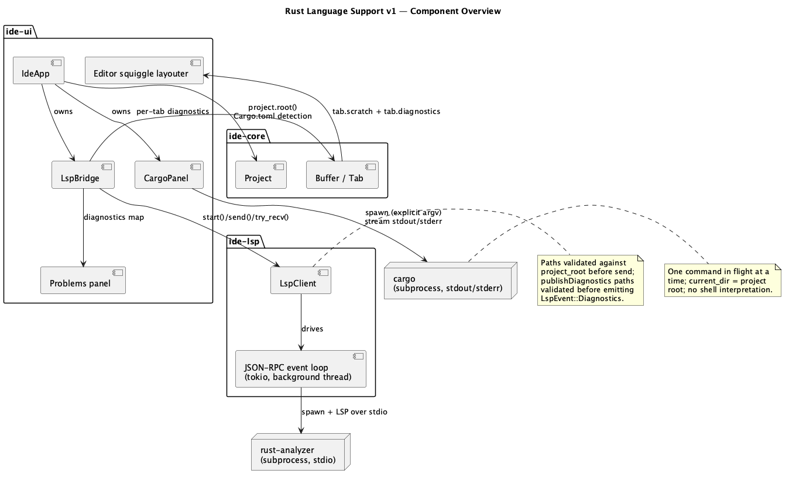
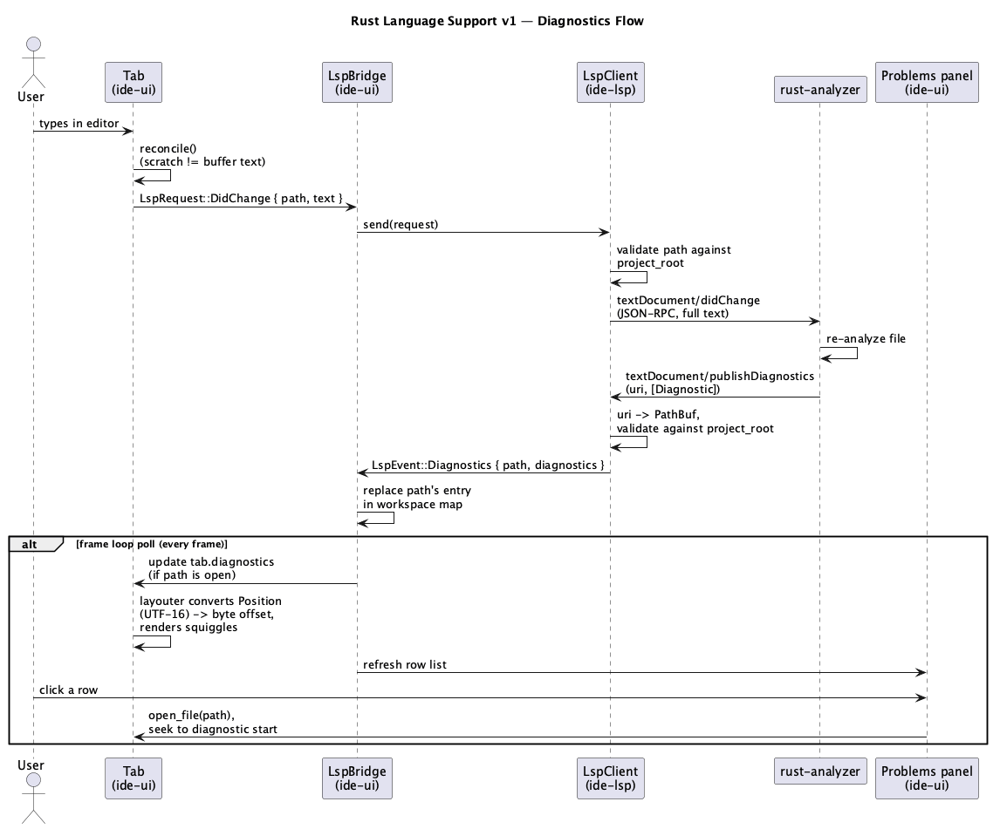
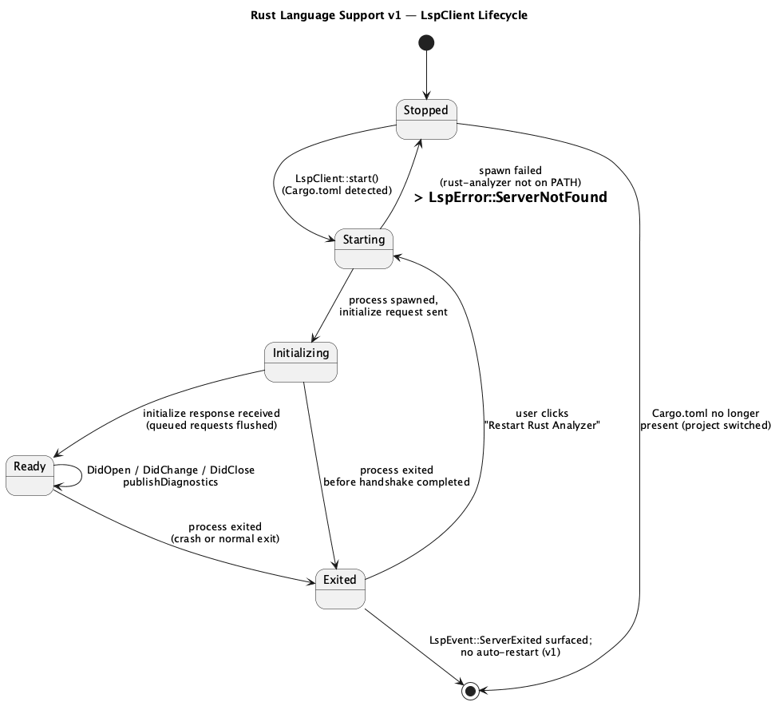

# Rust Language Support v1

## 1. Purpose

Adds Rust-specific language tooling on top of the editor shell and git
support: live diagnostics from `rust-analyzer` (errors/warnings shown as
squiggles in the editor and listed in a Problems panel) and a Cargo
command panel (Build/Run/Test/Check/Clippy) that shells out to the
`cargo` CLI and streams its output.

v1 scope:

- Auto-detect a Rust project (a `Cargo.toml` at the project root) on
  project open/create/refresh, the same detection hook git-support uses
  for repository detection.
- Start a `rust-analyzer` subprocess per opened Rust project, speak LSP
  over stdio, keep it in sync with open/edited/closed files.
- Surface `textDocument/publishDiagnostics` as: (a) inline squiggle
  markers under the offending text span in the editor, and (b) a
  Problems panel listing every diagnostic across the whole workspace
  (not just open tabs), clickable to open the file.
- Cargo commands (Build/Run/Test/Check/Clippy) triggered from the
  toolbar, each shelling out to `cargo <subcommand>` with an explicit
  argument vector, streaming stdout/stderr into an Output panel line by
  line as the process runs.

**Explicitly deferred** to a future feature: hover, autocompletion,
go-to-definition, find-references, rename, code actions/quick-fixes, and
any other LSP request beyond the diagnostics-producing open/change/close
notifications above. Also deferred: parsing `cargo build
--message-format=json` into structured diagnostics (v1's Cargo Output
panel is plain text); automatic restart of a crashed `rust-analyzer`
process (v1 exposes a manual "Restart Rust Analyzer" action instead);
incremental `textDocument/didChange` (v1 always sends the full document
text — see §4).

Does not touch `crates/core/**` — `Cargo.toml` detection is a plain
`project.root().join("Cargo.toml").exists()` check in `ide-ui`; nothing
this feature needs is missing from `Project`'s existing public API.

## 2. Interface / API

### 2.1 `ide-lsp`

```rust
use std::path::{Path, PathBuf};

#[derive(Debug, thiserror::Error)]
pub enum LspError {
    #[error("language server not found on PATH: {0}")]
    ServerNotFound(String),
    #[error("io error: {0}")]
    Io(#[from] std::io::Error),
    #[error("malformed LSP frame: {0}")]
    Protocol(String),
}

#[derive(Debug, Clone, Copy, PartialEq, Eq)]
pub struct Position {
    pub line: u32,
    /// UTF-16 code units into the line — LSP's mandatory baseline
    /// encoding; see §4 for why v1 doesn't negotiate an alternative.
    pub character: u32,
}

#[derive(Debug, Clone, Copy, PartialEq, Eq)]
pub struct Range {
    pub start: Position,
    pub end: Position,
}

#[derive(Debug, Clone, Copy, PartialEq, Eq)]
pub enum DiagnosticSeverity {
    Error,
    Warning,
    Information,
    Hint,
}

#[derive(Debug, Clone, PartialEq, Eq)]
pub struct Diagnostic {
    pub range: Range,
    pub severity: DiagnosticSeverity,
    pub message: String,
}

/// What the UI tells the client to do; sent via `LspClient::send`.
/// `text` is the *entire* current document content — v1 uses
/// full-document sync, not incremental (§4).
pub enum LspRequest {
    DidOpen { path: PathBuf, text: String },
    DidChange { path: PathBuf, text: String },
    DidClose { path: PathBuf },
}

/// What the client tells the UI; received via `LspClient::try_recv`.
pub enum LspEvent {
    /// Replaces the full diagnostic set for `path` — matches LSP's
    /// `publishDiagnostics` semantics: each notification is a complete
    /// snapshot for that file, not a delta against the previous one.
    Diagnostics {
        path: PathBuf,
        diagnostics: Vec<Diagnostic>,
    },
    /// The language server process exited (crash or normal exit). v1
    /// does not auto-restart (§4) — the UI surfaces this and the user
    /// re-triggers `LspClient::start` via a manual action.
    ServerExited { message: String },
}

/// Dropping an `LspClient` tears down its subprocess: a best-effort LSP
/// `shutdown`/`exit` notification is sent, then the child process is
/// killed if it hasn't exited promptly. There is no separate `stop`
/// method — replacing an `Option<LspClient>` (project switch, or the
/// "Restart Rust Analyzer" action re-calling `start`) *is* the teardown
/// path, and it always fully replaces any previous instance rather than
/// running two clients concurrently.
pub struct LspClient { /* private */ }

impl LspClient {
    /// Spawns `rust-analyzer` (must already be on `PATH`), sends the
    /// LSP `initialize` handshake, and starts a background thread
    /// running the JSON-RPC event loop. Returns as soon as the process
    /// spawns successfully — `initialize` completes asynchronously;
    /// requests sent via `send` before it completes are queued
    /// internally and flushed once the server is ready.
    ///
    /// A spawn failure with `io::ErrorKind::NotFound` is reported as
    /// `LspError::ServerNotFound(command)`; every other spawn/I/O
    /// failure is reported as `LspError::Io`.
    pub fn start(project_root: impl AsRef<Path>) -> Result<Self, LspError>;

    /// Like `start`, but spawns `command` instead of `"rust-analyzer"`
    /// — for tests, or a future user-configured server path.
    pub fn start_with_command(
        project_root: impl AsRef<Path>,
        command: &str,
    ) -> Result<Self, LspError>;

    /// Non-blocking; queues `request` for the background thread. Every
    /// path is validated against `project_root` before being sent
    /// (§4) — a path outside the root is silently dropped rather than
    /// erroring, since the caller should never construct one (same
    /// provenance discipline as `ide_core::GitRepo::resolve_conflict`).
    pub fn send(&self, request: LspRequest);

    /// Non-blocking poll; returns one event per call. Callers should
    /// call this in a loop each frame to drain everything available,
    /// same as `ClaudePanel::poll`'s pattern. Takes `&mut self` — forced
    /// by `tokio::sync::mpsc::UnboundedReceiver::try_recv`'s own
    /// signature, which the internal event channel is built on.
    pub fn try_recv(&mut self) -> Option<LspEvent>;
}

/// Converts an LSP `Position` (UTF-16 code units into a line) into a
/// byte offset into `text`. `None` if the position is out of range —
/// a buggy/malicious server response, or a transient client/server
/// text desync; callers should skip the diagnostic rather than error.
pub fn position_to_byte_offset(text: &str, position: Position) -> Option<usize>;
```

### 2.2 `ide-ui`

Not a library API — behavior specified in §3. Public-ish surface worth
naming for review purposes:

```rust
// crates/ui/src/lsp_bridge.rs
struct LspBridge {
    client: Option<LspClient>,
    /// Every diagnostic rust-analyzer has reported, across the whole
    /// workspace (not just open tabs) — backs the Problems panel.
    diagnostics: HashMap<PathBuf, Vec<Diagnostic>>,
    server_error: Option<String>,
}

// crates/ui/src/cargo_panel.rs
enum CargoCommand {
    Build,
    Run,
    Test,
    Check,
    Clippy,
}

struct CargoPanel {
    output: Vec<String>, // accumulated lines, oldest first
    running: Option<CargoCommand>,
}
```

`Tab` (in `app.rs`) gains a `diagnostics: Vec<Diagnostic>` field, kept in
sync with `LspBridge`'s per-path map every frame.

`IdeApp` gains an `LspBridge`, a `CargoPanel`, and a bottom-panel view
toggle ("Problems" / "Cargo Output") using the same toggle-button
convention as the existing Editor/Source Control toolbar toggle. The
toolbar gains Build/Run/Test/Check/Clippy buttons and a "Restart Rust
Analyzer" action, all shown only when the open project has a
`Cargo.toml` at its root.

## 3. Behaviour

### Rust-project detection

- On project open/create/refresh (the same hooks git-support's
  repository detection uses), also check for `Cargo.toml` at
  `project.root()`. If present and no `LspClient` is running for this
  project, call `LspClient::start(project.root())`; on `Err` (e.g.
  `rust-analyzer` not on `PATH`), show a one-line message near the
  Rust toolbar buttons rather than a blocking modal, and don't retry
  automatically. If absent, shut down any client from a previously
  open project and hide the Rust-specific toolbar buttons.

### LSP lifecycle / file sync

- `open_file` (existing action) additionally sends `LspRequest::DidOpen`
  with the buffer's initial text, if an `LspClient` is present.
- `Tab::reconcile` (existing per-frame edit-sync point) additionally
  sends `LspRequest::DidChange` with the full updated text whenever the
  buffer actually changed this frame — mirrors the existing "only touch
  the buffer when `scratch` differs" gate, so an idle tab doesn't flood
  the server with no-op notifications every frame.
- `close_tab_now` (existing action) additionally sends
  `LspRequest::DidClose`.
- The frame loop polls `LspBridge` (which drains `LspClient::try_recv`
  in a loop, not just once, same as `ClaudePanel::poll`'s repaint
  pattern) every frame. Each `Diagnostics` event replaces that path's
  entry in the workspace-wide map; if a tab for that path is open, its
  `diagnostics` field is updated too.
- A `ServerExited` event is stored and shown as a one-line message near
  the Rust toolbar buttons; "Restart Rust Analyzer" calls
  `LspClient::start` again, dropping the old instance first (see §2.1).
- A malformed JSON-RPC frame from the server (bad `Content-Length`,
  truncated body, invalid JSON) is treated as fatal, the same as a
  process exit: the client logs `LspError::Protocol`, tears down the
  connection (killing the subprocess if still alive), and emits
  `LspEvent::ServerExited` — it never attempts to resynchronize and keep
  reading mid-stream. An oversized `Content-Length` (see §4's cap) is
  rejected the same way, before any read-buffer allocation happens.

### Diagnostics UI

- Editor view: the active tab's `TextEdit` uses a custom layouter that
  overlays each of `tab.diagnostics`' ranges as an underline
  (`DiagnosticSeverity::Error` red, `Warning` yellow/orange,
  `Information`/`Hint` blue), converting each `Range`'s `Position`s to
  byte offsets via `ide_lsp::position_to_byte_offset`. A range that
  fails to convert (out-of-range position) is skipped, not shown as an
  error.
- Problems panel (bottom, toggled against Cargo Output — see below):
  one row per diagnostic across every path in the workspace-wide map,
  grouped by file, showing a severity icon and the message. Clicking a
  row opens that file (`open_file`, same as clicking a directory-tree
  entry) and best-effort places the cursor at the diagnostic's start
  position.

### Cargo commands

- Toolbar Build/Run/Test/Check/Clippy buttons call
  `CargoPanel::run(project.root(), <command>)`: spawns `cargo
  <subcommand>` (`build`/`run`/`test`/`check`/`clippy`) with
  `current_dir(project.root())` and no other arguments in v1, off the UI
  thread, streaming stdout+stderr lines into `output` as they arrive
  (not buffered until exit) via the same non-blocking poll-once-per-frame
  pattern as `ClaudePanel`. Only one cargo command runs at a time;
  clicking another button while one is in flight is a no-op — unlike
  `ClaudePanel`'s prompt queue, queuing multiple build/test runs isn't
  useful, so v1 just ignores the click rather than queueing it.
- The bottom panel's "Cargo Output" view shows `output` line by line,
  auto-scrolled to the latest line while a command is running.

### Bottom panel toggle

- A "Problems" / "Cargo Output" toggle (same convention as the
  toolbar's Editor/Source Control toggle) switches which view the
  bottom panel shows. Both accumulate state independently regardless of
  which is currently visible.

## 4. Constraints & invariants

- No incremental sync: `LspRequest::DidChange` always carries the full
  document text (`TextDocumentSyncKind::Full`), never a diff — simpler
  and correct by construction (no risk of a client/server offset-
  tracking desync), at the cost of re-sending the whole file on every
  edit. Acceptable for v1 given typical source file sizes; revisit only
  if this becomes a measured perf problem.
- LSP position encoding is always UTF-16 code units (the spec's
  mandatory baseline) — v1 does not negotiate the `positionEncoding`
  capability, so `Position::character` is unambiguous without an extra
  handshake round-trip.
- Every path in `LspRequest`/`LspEvent` is validated against
  `project_root` before use: `LspClient::send` validates outgoing paths
  (defense in depth — the UI should never construct one from anything
  but an already-open tab's path or the directory tree, same
  provenance rule as `resolve_conflict`); `LspEvent::Diagnostics`'
  `path` is derived from the server's own `publishDiagnostics` `uri`,
  converted and validated against `project_root` before the event is
  emitted — a malicious or buggy server claiming diagnostics for a path
  outside the project is dropped, not surfaced.
- The `rust-analyzer` subprocess is spawned with an explicit, non-shell
  argument vector; its executable name/path is never built by
  concatenating untrusted input.
- `LspClient` does not auto-restart a crashed/exited server (§3) —
  avoids an unbounded restart loop if the binary is fundamentally
  broken for this project; the user re-triggers it explicitly.
- `CargoPanel` runs at most one command at a time. `cargo run` executes
  the open project's own code, which is inherent to the command's
  purpose — not a new trust boundary beyond "the user opened this
  project," the same boundary the editor and git panels already operate
  inside.
- Rust-specific UI (toolbar buttons, LSP auto-start) is gated on a
  `Cargo.toml` existing at `project.root()` — v1 doesn't attempt to run
  `rust-analyzer` or offer cargo commands for a non-Rust project.
- Incoming JSON-RPC frames are size-bounded: a `Content-Length` header
  above 16 MiB is rejected as `LspError::Protocol` (see §3) before any
  buffer is allocated for the body — a malicious or buggy server
  response can't force an unbounded allocation. 16 MiB is generous for
  any legitimate `publishDiagnostics`/response payload from
  `rust-analyzer`; revisit only if a real workspace legitimately needs
  more. The *header* section of a frame (before `Content-Length` is even
  known) is separately bounded too — otherwise a server that never sends
  a line-terminating newline could grow a header buffer without limit,
  defeating the body cap's purpose entirely.
- The internal channel `LspClient::send`/`try_recv` are backed by is
  unbounded, so `send`'s "non-blocking" guarantee holds regardless of
  how fast the UI thread drains `try_recv`.

## 5. Examples

**Starting the LSP client and reacting to diagnostics:**

```rust
let mut client = LspClient::start(project.root())?;
client.send(LspRequest::DidOpen {
    path: file.clone(),
    text: initial_text,
});
// ... later, once per frame:
while let Some(event) = client.try_recv() {
    if let LspEvent::Diagnostics { path, diagnostics } = event {
        // update the Problems panel / the open tab's squiggles for `path`
    }
}
```

**Converting a diagnostic's range for rendering:**

```rust
let start = position_to_byte_offset(&tab.scratch, diag.range.start).unwrap_or(0);
let end = position_to_byte_offset(&tab.scratch, diag.range.end).unwrap_or(start);
// underline tab.scratch[start..end] in the TextEdit layouter
```

**Running a cargo command:**

```rust
cargo_panel.run(project.root(), CargoCommand::Test);
// ... later, once per frame:
if cargo_panel.poll() {
    ctx.request_repaint();
}
```

## 6. Dependencies & integration points

- New in `ide-lsp`: `tokio` (async process I/O + the background event
  loop — a persistent bidirectional subprocess connection needs real
  async I/O, not just a one-shot background thread like the Claude
  panel's), `lsp-types` (LSP protocol type definitions — avoids
  hand-rolling hundreds of request/response/notification structs and
  staying spec-conformant), `serde`/`serde_json` (JSON-RPC envelope),
  `url` (`file://` URI ↔ path conversion — fiddly to get right by hand
  across platforms, especially Windows drive letters), `thiserror`.
- No new dependencies in `ide-ui`: `cargo_panel.rs` reuses the
  `std::process::Command` + background-thread + `mpsc` pattern already
  established by `claude_panel.rs`; `lsp_bridge.rs` only needs
  `ide-lsp`'s existing public API.
- Builds on `ide-core`'s `Project` (`project.root()` for both the
  `Cargo.toml` detection and as the LSP/cargo working directory) and
  `Buffer` (`Tab::reconcile`'s existing edit-sync point, extended to
  also emit `LspRequest::DidChange`).
- Assumes `rust-analyzer` is already installed and on `PATH` — same
  assumption `claude_panel.rs` makes for the `claude` CLI
  (`LspError::ServerNotFound` surfaces the same way `claude_panel`'s
  "claude CLI not found on PATH" message does).
- Does not touch `crates/core/**` (§1) or `crates/ui/src/claude_panel.rs`
  / `crates/ui/src/git_panel.rs` — this feature adds new files/hooks
  alongside them, doesn't modify their behavior.

## 7. Diagrams

**Component overview:**



**Diagnostics flow:**



**LSP client lifecycle:**



## Revision notes

Per `rev`'s first-pass findings:

- Documented `LspClient`'s `Drop`-based teardown and that replacing the
  `Option<LspClient>` is the only teardown path (no separate `stop`) —
  closes the ambiguity around what happens to a previous instance on
  project switch or manual restart.
- Disambiguated `LspError::ServerNotFound` vs `LspError::Io`: a spawn
  failure with `io::ErrorKind::NotFound` maps to `ServerNotFound`,
  everything else to `Io`.
- Added an explicit contract for malformed JSON-RPC frames: treated as
  fatal, same handling as a process exit (`LspEvent::ServerExited`, no
  resync attempt) — gives the implementing role and the later `hacker`
  pass a defined-correct behavior to build/test against.
- Added a 16 MiB cap on incoming `Content-Length`, rejected before
  allocation — closes the same unbounded-allocation DoS class the
  git-support `hacker` pass found via `MAX_DIFF_FILES`.
- Stated the internal `send`/`try_recv` channel is unbounded, so the
  documented "non-blocking" guarantee on `send` actually holds.

Per `rev`'s code review of the `rust-lsp-dev` implementation:

- Corrected `try_recv`'s signature to `&mut self` (and the §5 example to
  `let mut client`) — `tokio::sync::mpsc::UnboundedReceiver::try_recv`,
  which the internal event channel is built on, requires `&mut self`;
  the original `&self` in this doc wasn't actually implementable without
  unnecessary interior-mutability overhead.
- Added a header-section size bound (§4) alongside the existing 16 MiB
  body cap, after the implementation review found the body cap alone
  didn't stop a server from growing an unbounded buffer via a
  never-terminated header line.
