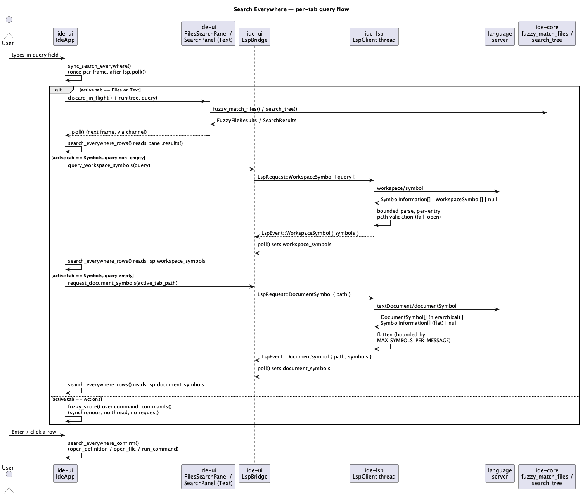

# Search Everywhere (C2)

## 1. Purpose

Today the only ways to jump somewhere in a project are typing-position-
specific (`goto-definition.md`'s Cmd+Click/Cmd+B) or content-specific
(`global-search-and-languages.md`'s Find in Path). There is no way to jump
to a file, a symbol, or a registered action by *approximate name* — the
single most-used navigation gesture in a JetBrains-style IDE.

This phase adds:

- A **fuzzy matcher** in `ide-core` (`crates/core/src/fuzzy.rs`), used both
  by a new file-name search and reused by the UI for ranking commands.
- Two new LSP queries in `ide-lsp` (`textDocument/documentSymbol`,
  `workspace/symbol`), following the exact request/response shape every
  prior LSP feature in this project already established (own pending-id
  slot, supersede-by-overwrite, bounded deserialization, per-entry path
  validation).
- A single tabbed **Search Everywhere** popup in `ide-ui` — Files / Symbols
  / Actions / Text — opened by double-tapping Shift (`⇧⇧`, JetBrains'
  binding), plus four standalone shortcuts that each open the popup
  pre-scoped to one tab: Go to File (`⌘⇧O`), Go to Class (`⌘O`), Go to
  Symbol (`⌘⌥O`), and Go to Line (`⌘L`, a distinct small dialog — see §3.6).

This closes `docs/roadmap.md`'s item 15 (§7), immediately after A8. It
does **not** implement recent-files/recent-locations history (scheduled
separately as **C4**) or file-structure breadcrumbs (**C3**) — the
`documentSymbol` machinery this phase adds is deliberately general enough
for C3 to reuse without changes, but C3's UI (breadcrumbs, a dedicated
outline popup) is out of scope here.

## 2. Interface

### 2.1 `crates/core/src/fuzzy.rs` (new module)

```rust
/// One fuzzy match's score and the matched character positions, for
/// highlighting. Higher `score` is a better match. `indices` are byte
/// offsets into the *original* (not lowercased) candidate string, one per
/// matched pattern character, in ascending order — same original-vs-
/// lowered indexing discipline as `search.rs::find_match_in_line`.
#[derive(Debug, Clone, PartialEq, Eq)]
pub struct FuzzyMatch {
    pub score: i64,
    pub indices: Vec<usize>,
}

/// Case-insensitive subsequence match: every character of `pattern`, in
/// order, must appear somewhere in `candidate` (not necessarily
/// contiguous). Returns `None` if `pattern` is not a subsequence of
/// `candidate`. An empty `pattern` always matches with
/// `FuzzyMatch { score: 0, indices: vec![] }`.
///
/// **Algorithm (deliberately greedy, not globally optimal — see below):**
/// walk `pattern`'s characters left to right; for each one, find its next
/// occurrence in `candidate` starting at (one past) the previous match's
/// position, using a case-insensitive comparison. If any character has no
/// remaining occurrence, return `None`. Each match's position contributes
/// to `score`:
///
/// - **Gap**: let `gap` = the number of unmatched candidate characters
///   between this match and the previous one (or before the first match,
///   counted from position 0). If `gap == 0` and this is not the first
///   match, add `SCORE_CONSECUTIVE` (15). Otherwise subtract `gap` (i.e.
///   add `-1 * gap`, `PENALTY_GAP = -1` per skipped character).
/// - **Boundary**: add `SCORE_BOUNDARY` (10) if this match is at
///   `candidate`'s first character, or the character immediately before
///   it is one of `/ _ - . ` (a separator), or the character immediately
///   before it is lowercase/a digit and this matched character is
///   uppercase (a camelCase boundary).
/// - **Case**: add `SCORE_CASE` (1) if the matched candidate character's
///   original case equals the pattern character's original case.
///
/// `score` is the sum of every match's contribution.
///
/// This is a single left-to-right greedy pass (each pattern character
/// takes the *nearest* remaining occurrence), not a dynamic-programming
/// search over every possible subsequence assignment — it can miss a
/// higher-scoring alignment when multiple candidate occurrences of the
/// same character exist ahead of the greedy choice (e.g. pattern `"ab"`
/// against candidate `"a_ab"` greedily matches the first `a` then the
/// `b` two characters later, scoring lower than matching the second `a`
/// then `b` contiguously). Accepted as a deliberate v1 simplification: for
/// the file names, symbol names, and command titles this is actually run
/// against, the common cases (prefix match, exact word match, contiguous
/// substring, camelCase-initials match) all still score at or near the
/// top, which is what users perceive as "good" fuzzy ranking; a globally
/// optimal matcher is meaningfully more code for a difference that only
/// shows up on adversarially-constructed inputs.
pub fn fuzzy_score(pattern: &str, candidate: &str) -> Option<FuzzyMatch>;

/// One file whose path fuzzy-matched a query.
#[derive(Debug, Clone, PartialEq, Eq)]
pub struct FuzzyFileMatch {
    pub path: PathBuf,
    /// `path` relative to the scanned tree's root, `/`-joined regardless
    /// of platform — what `fuzzy_score` was actually run against, and
    /// what `indices` indexes into.
    pub relative: String,
    pub score: i64,
    pub indices: Vec<usize>,
}

#[derive(Debug, Clone, PartialEq, Eq)]
pub struct FuzzyFileResults {
    pub matches: Vec<FuzzyFileMatch>,
    /// `true` if more than `MAX_FUZZY_FILE_RESULTS` files scored a match
    /// — the list was sorted then truncated, not stopped early (unlike
    /// `search_tree`, ranking requires scoring every candidate before any
    /// of them can be dropped; see §4).
    pub truncated: bool,
}

/// Cap on `FuzzyFileResults::matches`' length after sorting.
pub const MAX_FUZZY_FILE_RESULTS: usize = 200;

/// Fuzzy-matches every **file** (not directory) in `tree` against `query`
/// by its `relative` path, using `fuzzy_score`. `query.trim().is_empty()`
/// returns `FuzzyFileResults { matches: vec![], truncated: false }`
/// immediately without walking anything (mirrors `search_tree`'s own
/// empty-query short-circuit). Skips the same directory names
/// `search_tree` skips (`.git`, `target`, `node_modules` —
/// `search::SKIPPED_DIR_NAMES`, made `pub(crate)` so this module can
/// reuse it instead of duplicating the list). Sorted by score descending;
/// ties broken by shorter `relative` length, then lexicographically. Every
/// file is scored (no early stop — see `truncated`'s doc comment above);
/// only the final sorted list is capped to `MAX_FUZZY_FILE_RESULTS`.
pub fn fuzzy_match_files(tree: &DirEntry, query: &str) -> FuzzyFileResults;
```

`crates/core/src/lib.rs` re-exports `fuzzy_score`, `FuzzyMatch`,
`fuzzy_match_files`, `FuzzyFileMatch`, `FuzzyFileResults`,
`MAX_FUZZY_FILE_RESULTS`.

### 2.2 `crates/lsp/src/types.rs` additions

```rust
/// Flattened `lsp_types::SymbolKind` — every variant the LSP spec defines,
/// used for both `documentSymbol` and `workspace/symbol` results (same
/// "own flattened enum, not the raw spec type" precedent as
/// `DiagnosticSeverity`).
#[derive(Debug, Clone, Copy, PartialEq, Eq)]
pub enum SymbolKind {
    File, Module, Namespace, Package, Class, Method, Property, Field,
    Constructor, Enum, Interface, Function, Variable, Constant, String,
    Number, Boolean, Array, Object, Key, Null, EnumMember, Struct, Event,
    Operator, TypeParameter,
}

/// One symbol, from either a `documentSymbol` or `workspace/symbol`
/// response — the two share this one flattened shape (`ide-lsp`'s own
/// summary, same precedent as `Location`/`CodeAction`).
#[derive(Debug, Clone, PartialEq, Eq)]
pub struct Symbol {
    pub name: String,
    pub kind: SymbolKind,
    /// The enclosing symbol's name, if any — e.g. a method's containing
    /// type. For a flattened child of a hierarchical `documentSymbol`
    /// response, this is the parent's own `name` (see §3.2). `None` for a
    /// top-level symbol, or when the server didn't report one.
    pub container_name: Option<String>,
    /// Already validated against `project_root` — same discipline as
    /// `Location` (see §4).
    pub location: Location,
}
```

`LspRequest` gains:

```rust
/// Query every symbol in `path`'s current document. Own pending-id slot,
/// independent of every other request kind's slot (see §3.2, §4).
DocumentSymbol { path: PathBuf },
/// Query every symbol in the whole project whose name matches `query`
/// server-side (the server does its own fuzzy/substring matching — this
/// is not `ide_core::fuzzy_score`, which only ever runs client-side over
/// *files*, never over LSP symbol results; see §3.3). Own pending-id
/// slot. An empty `query` is sent as-is — servers commonly treat it as
/// "list everything" or "list nothing"; `ide-ui` never relies on either
/// behavior (§3.3).
WorkspaceSymbol { query: String },
```

`LspEvent` gains:

```rust
/// The result of the most recently sent, not-yet-superseded
/// `DocumentSymbol` query, even when empty. Carries `path`, same reason
/// as `InlayHint`'s/`CodeAction`'s events.
DocumentSymbol { path: PathBuf, symbols: Vec<Symbol> },
/// The result of the most recently sent, not-yet-superseded
/// `WorkspaceSymbol` query, even when empty.
WorkspaceSymbol { symbols: Vec<Symbol> },
```

### 2.3 `crates/lsp/src/client.rs`

`ConnectionState` gains `pending_document_symbol_id: Option<u64>` and
`pending_workspace_symbol_id: Option<u64>` — two more independent slots,
same shape as `pending_hover_id`/`pending_inlay_hint_id`/etc.

`send_request`'s match gains two arms:

- `DocumentSymbol { path, .. }` — validates `path` (existing
  `validate_path` helper, same as every other path-bearing request),
  allocates an id, sets `pending_document_symbol_id`, sends
  `textDocument/documentSymbol` with `{ textDocument: { uri } }`.
- `WorkspaceSymbol { query }` — no path to validate. Allocates an id, sets
  `pending_workspace_symbol_id`, sends `workspace/symbol` with
  `{ query }`.

Two new response handlers, wired into `handle_incoming`'s id-bearing
dispatch chain alongside the existing seven:

- `handle_document_symbol_response` — the result is
  `DocumentSymbol[] | SymbolInformation[] | null` per the LSP spec (two
  genuinely different JSON shapes: `DocumentSymbol` is hierarchical
  — `range`/`selectionRange` plus optional `children` — `SymbolInformation`
  is flat — `location` plus optional `containerName`, no children).
  Attempts to deserialize as `Vec<DocumentSymbol>` first; on failure,
  falls back to `Vec<SymbolInformation>`; on `null` or a total failure of
  both shapes, treats it as `vec![]` (a definite empty answer beats a
  permanently-waiting UI — same permissiveness `Hover`'s doc comment
  already establishes). A hierarchical `DocumentSymbol[]` result is
  flattened depth-first: each entry becomes one `Symbol` (`location` built
  from `path` + the entry's own `range`, since `DocumentSymbol` carries no
  URI — it's implicitly "this document"), each of its `children` becomes
  further `Symbol`s with `container_name: Some(entry.name.clone())`,
  recursively. Flattening stops (does not recurse further, does not
  process remaining siblings past the cap) once
  `MAX_SYMBOLS_PER_MESSAGE` (500 — see §4) total symbols have been
  produced, mirroring `BoundedLocations`/`BoundedCodeActions`'s existing
  cap-while-deserializing discipline, not a post-hoc truncation of an
  unbounded intermediate `Vec`.
- `handle_workspace_symbol_response` — the result is
  `SymbolInformation[] | WorkspaceSymbol[] | null`. `WorkspaceSymbol` (LSP
  3.17+) is a newer variant whose `location` field may be *either* a full
  `Location` *or* a bare `{ uri }` with no range, meant to be resolved
  later via `workspaceSymbol/resolve` — v1 does not implement that resolve
  round-trip (out of scope; unlike `codeAction/resolve`, nothing in this
  phase's UI needs the extra fields resolve would add). An entry whose
  `location` is the bare-`uri` shape, or whose path fails
  `validate_path` against `project_root`, is skipped individually — same
  per-entry permissiveness `References`/`Goto` already use, deliberately
  **not** `WorkspaceEdit`'s fail-whole-batch rule (there is no batch
  atomicity concern here: dropping one bad symbol from a list of
  navigation candidates loses nothing the way applying half a multi-file
  edit would). Bounded the same way as `handle_code_action_response`
  already is: stop deserializing once `MAX_SYMBOLS_PER_MESSAGE` valid
  entries have been produced.

Both handlers emit their event (`WorkspaceEditReady`'s "always emit, even
on total failure" precedent) rather than silently dropping the response.

## 3. Behaviour

### 3.1 `crates/ui/src/lsp_bridge.rs`

`LspBridge` gains:

```rust
document_symbols_path: Option<PathBuf>,
document_symbols: Vec<Symbol>,
workspace_symbols: Vec<Symbol>,
```

(no `finding_*`/`*_ready` flag for either — nothing in this phase's UI
needs to distinguish "still waiting" from "empty result so far", unlike
`WorkspaceEditReady`'s one-shot-application semantics; the popup just
renders whatever's currently in these fields, same as `code_actions`.)

Two new methods, same no-op-if-no-client shape as every existing
`LspBridge` request method:

```rust
fn request_document_symbols(&mut self, path: &Path);
fn query_workspace_symbols(&mut self, query: &str);
```

`poll()` gains `LspEvent::DocumentSymbol`/`WorkspaceSymbol` match arms
(sets the corresponding field(s) wholesale — supersede-by-overwrite, same
as `document_highlights`/`code_actions`), and both fields are cleared in
`start_with_command`/`stop`/on `ServerExited`, same as every existing
per-query field.

### 3.2 `IdeApp` — Search Everywhere popup state (`crates/ui/src/app.rs`)

```rust
#[derive(Debug, Clone, Copy, PartialEq, Eq)]
enum SearchEverywhereTab { Files, Symbols, Actions, Text }

struct IdeApp {
    // ...
    search_everywhere_open: bool,
    search_everywhere_tab: SearchEverywhereTab,
    search_everywhere_query: String,
    search_everywhere_selected: usize,
    pending_search_everywhere_focus: bool,
    /// Set by Go to Class (§3.5) to restrict the Symbols tab's results to
    /// class-like kinds (`Class`, `Struct`, `Interface`, `Enum`) until the
    /// popup closes or the tab is switched away and back. `false` for
    /// every other entry point (Search Everywhere itself, Go to Symbol).
    search_everywhere_class_filter: bool,
    /// The query text `workspace_symbols`/`document_symbols` were last
    /// requested for — avoids re-sending an identical LSP request every
    /// frame the popup is open with an unchanged query (§3.3's request
    /// cadence), same "only send on distinct target" discipline
    /// `last_code_actions_target` already established.
    last_workspace_symbol_query: Option<String>,
    /// The path `request_document_symbols` was last *sent* for (as
    /// opposed to `LspBridge::document_symbols_path`, which only updates
    /// once a *response* arrives) — without this, the empty-query
    /// `Symbols` branch below would re-send a fresh `documentSymbol`
    /// request every single frame while waiting on a slow response, since
    /// `document_symbols_path` stays stale for the whole wait. Same "track
    /// what I last asked for, not what I last received" shape
    /// `last_workspace_symbol_query` already uses for the non-empty-query
    /// branch, applied symmetrically here.
    document_symbols_requested_for: Option<PathBuf>,
    /// A second, independent instance of the existing `search_panel::
    /// SearchPanel` (background-thread + generation-counter search) for
    /// the Text tab — not shared with the Find in Path tool window's own
    /// instance, since that one also tracks tool-window-specific options
    /// (case-sensitive, whole-word, scope) this popup doesn't expose.
    search_everywhere_text: search_panel::SearchPanel,
    /// Same background-thread + generation-counter shape as `SearchPanel`,
    /// wrapping `ide_core::fuzzy_match_files` instead of `search_tree`
    /// (new module `crates/ui/src/files_search.rs`, structurally a
    /// straight copy of `search_panel.rs` with the one call swapped — see
    /// §4 on why this is a sibling module, not a shared generic).
    search_everywhere_files: files_search::FilesSearchPanel,
    show_go_to_line: bool,
    go_to_line_input: String,
    /// Fed Shift's rising/falling edge every frame, same shape as
    /// `editor::mod::EditorState::alt_tap`/`alt_down` (§3.6). Reuses
    /// `editor::double_tap::DoubleTap` directly — that module's `mod
    /// double_tap;` becomes `pub(crate) mod double_tap;` in
    /// `editor/mod.rs` so `app.rs` can name the type without duplicating
    /// the detector.
    search_everywhere_double_tap: editor::double_tap::DoubleTap,
    search_everywhere_shift_down: bool,
}
```

Methods:

```rust
/// Opens the popup on `tab`, resetting query/selection and requesting
/// focus next frame (`pending_search_everywhere_focus`, same deferred-
/// focus mechanism `open_find_bar`/`open_command_palette` already use).
/// `class_filter` is only meaningful when `tab == Symbols` (§3.4/§3.5).
fn open_search_everywhere(&mut self, tab: SearchEverywhereTab, class_filter: bool);

/// Escape, the window's own close affordance, or a successful jump/run
/// (§3.4). Discards any in-flight Files/Text background search
/// (`discard_in_flight`, same as closing the Find in Path panel) and
/// resets `search_everywhere_class_filter`.
fn close_search_everywhere(&mut self);

fn search_everywhere_owns_escape(&self) -> bool;

/// Cycles `search_everywhere_tab` by `delta` (`+1`/`-1`, wrapping) among
/// the four variants in declaration order, resetting `search_everywhere_
/// selected` to 0. Does not clear `search_everywhere_query` — switching
/// tabs keeps what was typed, same as JetBrains' own Search Everywhere.
fn search_everywhere_switch_tab(&mut self, delta: isize);

/// Called once per frame, right after `self.lsp.poll()` (same call site
/// `sync_code_actions`/`handle_workspace_edit_ready` already follow poll
/// with). No-op unless `search_everywhere_open`. Drives whichever tab is
/// active:
///
/// - `Files`/`Text`: if `search_everywhere_query` differs from what that
///   tab's panel last ran, and `self.project.is_some()`, calls
///   `discard_in_flight` then `run` on that tab's panel with a fresh
///   `project.scan_tree()` and the current query (empty query: the panel
///   is not run at all — both `search_tree`/`fuzzy_match_files` already
///   return nothing for an empty query on their own, so running one
///   would only cost a needless background thread + tree scan).
/// - `Symbols`: if `search_everywhere_query` is empty, there is an active
///   tab with a path, and `document_symbols_requested_for.as_deref() !=
///   Some(path.as_path())`, calls `request_document_symbols(path)` and
///   sets `document_symbols_requested_for = Some(path.clone())` — gating
///   on what was *asked for*, not `LspBridge::document_symbols_path`
///   (which only updates once the *response* arrives, and so would re-fire
///   every frame while a request is still in flight; see
///   `document_symbols_requested_for`'s own doc comment above). This seeds
///   the tab with the current file's outline before the user types
///   anything, giving `documentSymbol` a real, immediate use in this phase
///   rather than sitting unused until C3. If the query is non-empty and differs from
///   `last_workspace_symbol_query`, calls `query_workspace_symbols` and
///   updates `last_workspace_symbol_query`.
/// - `Actions`: nothing to drive — computed synchronously each render
///   (§3.3).
fn sync_search_everywhere(&mut self);

/// Every result the active tab currently has to show, as a small internal
/// enum (not exposed beyond `app.rs`/`app/render.rs`):
///
/// ```rust
/// enum SearchEverywhereRow {
///     File(ide_core::FuzzyFileMatch),
///     Symbol(ide_lsp::Symbol),
///     Action(&'static command::Command),
///     Text(ide_core::SearchMatch),
/// }
/// ```
///
/// `Files`: `search_everywhere_files.results()`'s matches, already sorted.
/// `Symbols`: `self.lsp.workspace_symbols` (non-empty query) or
/// `self.lsp.document_symbols` (empty query), filtered to class-like
/// kinds first when `search_everywhere_class_filter` is set — no
/// re-sorting (`workspace/symbol`'s server-side ranking is preserved
/// as-is; `documentSymbol`'s own document order is preserved as-is,
/// which is already the file's declaration order, a reasonable default
/// for an unfiltered outline).
/// `Actions`: every `command::commands()` entry, `fuzzy_score`'d against
/// `format!("{} {}", cmd.title, cmd.category)`, kept if `Some`, sorted by
/// score descending (ties: declaration order, same tie-break `command-
/// palette.md` already documents for its own substring filter). Empty
/// query: every command in declaration order, score 0 (`fuzzy_score`'s
/// own empty-pattern behavior, §2.1).
/// `Text`: `search_everywhere_text.results()`'s matches, in `search_tree`'s
/// existing order (already the closest thing to "most relevant" this
/// engine produces — no additional client-side ranking).
fn search_everywhere_rows(&self) -> Vec<SearchEverywhereRow>;

/// Moves `search_everywhere_selected` by `delta`, wrapping, no-op on an
/// empty row list — same shape as `command_palette_move_selection`.
fn search_everywhere_move_selection(&mut self, delta: isize);

/// Enter, or clicking a row: dispatches on the selected `SearchEverywhereRow`
/// — `File`/`Text` open the file (`open_file` + `open_search_result`-style
/// cursor placement); `Symbol` calls `open_definition(&location.path,
/// location.range.start)` (reusing `goto-definition.md`'s existing
/// helper — a workspace/document symbol jump is not meaningfully
/// different from a `Goto` result); `Action` checks `is_command_enabled`
/// first (disabled: no-op, popup stays open, same as the command
/// palette's own disabled-row behavior) then calls `run_command` and
/// closes. Every successful dispatch calls `close_search_everywhere`; a
/// disabled `Action` row is the only no-op (popup stays open).
fn search_everywhere_confirm(&mut self);
```

### 3.3 Request cadence and cancellation

Every background-thread panel (`Files`, `Text`) follows `search_panel.rs`'s
existing, already-audited discipline exactly: `run` no-ops while a search
for that panel is already in flight (bounding concurrent threads to one
per panel, never one-per-keystroke), and switching tabs or closing the
popup calls `discard_in_flight` so a slow, still-running search's result
is dropped on arrival rather than overwriting a newer/no-longer-relevant
state.

The `Symbols` tab has no local thread to bound — `workspace/symbol`
requests go through `ide-lsp`'s existing pending-id supersede-by-overwrite
mechanism (a new `WorkspaceSymbol` request while one is outstanding simply
replaces the pending id; the superseded response, if it ever arrives, is
discarded by `handle_incoming`'s existing id-mismatch check, same as every
other request kind). `sync_search_everywhere` naturally rate-limits this
to "at most one new request per distinct query value" — the same request
rate `sync_code_actions` already accepts for its own cursor-position-keyed
query, not a new debounce mechanism.

### 3.4 Rendering (`crates/ui/src/app/render.rs`)

`render_search_everywhere_popup` — structurally `render_command_palette`'s
`egui::Window` + text field + `ScrollArea` of `selectable_label` rows
shape (§ command-palette.md §3), extended with:

- A tab strip above the query field (`Files` / `Symbols` / `Actions` /
  `Text`, `selectable_label(tab == search_everywhere_tab, ...)`,
  clicking one calls `search_everywhere_switch_tab` to the clicked
  variant's offset from the current one).
- Each row renders per its `SearchEverywhereRow` variant: `File`/`Text`
  show the relative path (or `SearchMatch::line_text` plus `line + 1`)
  with `indices`/the match span bolded; `Symbol` shows `name` with `kind`
  as a subtitle and `container_name` if present (mirrors
  `inlay-hints-and-hover.md`'s existing hover-popup subtitle styling);
  `Action` shows `title` / `category` / binding label, identical to the
  command palette's own row.
- A results-truncated footer ("+N more, refine your search") when the
  active tab's underlying result carries `truncated: true` (`Files`) or
  hit `MAX_SEARCH_RESULTS`/`MAX_SYMBOLS_PER_MESSAGE` (`Text`/`Symbols`).

`render_go_to_line_dialog` — a small `egui::Window` in the "Discard unsaved
changes?" confirm-dialog's shape (not the tabbed-popup shape): one
`text_edit_singleline` for `go_to_line_input` (format `line` or
`line:column`, 1-based on screen, `search_panel.rs`'s existing 1-based
display convention followed for consistency), Enter or an OK button calls
a new `confirm_go_to_line` (parses the input; on a valid, in-range line —
clamped the same way `TextBuffer::apply` already clamps an offset, not
rejected — moves the cursor via `pending_cursor_offset` +
`push_nav_location`, closes the dialog; on an unparseable or empty input,
does nothing and leaves the dialog open, same "malformed input is a no-op,
not an error toast" precedent the rest of this codebase's small dialogs
use), Escape or Cancel closes without moving anything.

Escape arbitration (`handle_shortcuts`'s existing priority chain) gains
`search_everywhere_owns_escape()` and `show_go_to_line` in the same
position as `command_palette_owns_escape()` — these popups are mutually
exclusive with the command palette and with each other by construction
(opening one always goes through a method that leaves every other popup's
`_open`/`show_*` flag as it already was, and nothing in this phase adds a
call site that opens two at once), so ordering among them is not
observable; they're listed together for clarity, not because ordering
matters here.

`sync_search_everywhere()` is called from the same per-frame call site
`sync_code_actions`/`handle_workspace_edit_ready` already occupy, right
after `self.lsp.poll()`. `render_search_everywhere_popup`/`render_go_to_line_dialog`
are called from the same per-frame popup-rendering call site every other
`render_*_popup` already is.

### 3.5 The `⇧⇧` gesture and the four standalone commands (`crates/ui/src/command.rs`, `keymap.rs`)

`command.rs` gains four `CommandAction` variants under category
`"Navigate"`:

| Command | mac | other | Enabled when |
|---|---|---|---|
| Go to File | `⌘⇧O` | `Ctrl+Shift+N` | `self.project.is_some()` |
| Go to Class | `⌘O` | `Ctrl+N` | `self.project.is_some()` |
| Go to Symbol | `⌘⌥O` | `Ctrl+Alt+Shift+N` | `self.project.is_some()` |
| Go to Line | `⌘L` | `Ctrl+G` | `self.active_tab.is_some() && self.view_mode == ViewMode::Editor` |

(Every row here is a genuine mac/other divergence per JetBrains' own
published keymaps, spelled out explicitly per `Binding`'s existing
convention — none of these four are a `Binding::same`.) `run_command`
dispatches `GoToFile` → `open_search_everywhere(Files, false)`, `GoToClass`
→ `open_search_everywhere(Symbols, true)`, `GoToSymbol` →
`open_search_everywhere(Symbols, false)`, `GoToLine` →
`trigger_go_to_line` (sets `show_go_to_line = true`, resets
`go_to_line_input`, requests focus next frame — same deferred-focus
mechanism as every other dialog in this phase).

`keymap.rs`'s `gestures()` gains one entry: `Gesture { id:
"SearchEverywhere", title: "Search Everywhere", category: "Navigate",
default: GestureTrigger::DoubleTap { modifier: egui::Modifiers::SHIFT } }`.

Unlike A3's `⌥⌥`+arrow (which *arms* on the second tap and waits for a
following key), `⇧⇧` triggers immediately on the second tap — there is no
"following key" for Search Everywhere to wait for. Detection lives in
`app/render.rs`'s per-frame update (not the editor widget — this must fire
regardless of which panel has focus, or none does), mirroring
`editor/mod.rs::handle_keys`'s existing edge-detection shape exactly:

```rust
let (now, shift) = ctx.input(|i| (i.time, i.modifiers.shift));
if shift && !self.search_everywhere_shift_down {
    if self.search_everywhere_double_tap.press(now) {
        self.open_search_everywhere(SearchEverywhereTab::Files, false);
    }
} else if !shift {
    self.search_everywhere_double_tap.disarm();
}
self.search_everywhere_shift_down = shift;
```

`is_armed`/a follow-up key is never checked — `press()`'s return value
alone is the trigger. This must be skipped while any text field owns
keyboard focus (typing "IDE" involves two `Shift` presses in quick
succession) — gated with `if !ctx.text_edit_focused() { /* the block
above */ }` (`egui::Context::text_edit_focused` — confirmed against this
project's pinned `egui` 0.36.1 — is true exactly when the currently
focused widget is a `TextEdit`; deliberately not the broader
`egui_wants_keyboard_input`, which is true for *any* focused widget,
including a `selectable_label` row in this very popup, which would wrongly
suppress `⇧⇧` while a Search Everywhere row itself has focus). This
project has no existing occurrence of this exact call, but the need —
"don't fire a global gesture while a text field is being typed into" — is
the same one `handle_shortcuts`' existing popup-open checks already solve
for individual shortcuts, generalized here to cover *every* text field
including ones outside this project's own popups, e.g. project
rename/git-commit-message fields).

### 3.6 Go to Line's input format

`confirm_go_to_line` parses `go_to_line_input` as either `"<line>"` or
`"<line>:<column>"` (both 1-based, matching how `search_panel.rs` already
displays 1-based line numbers to the user — this is the only user-facing
place in the app that *accepts* a 1-based line number as typed input, so
there is no existing parser to reuse). Whitespace-trimmed; a `<column>`
that's absent defaults to column 1. Both values must parse as a positive
integer (`u32`); anything else (empty, non-numeric, `0`, a bare `:`) is a
no-op, dialog stays open — no error toast, consistent with this phase's
"malformed dialog input is a silent no-op" convention (§3.4). A `line`
past the buffer's actual line count clamps to the last line (same
clamping precedent `TextBuffer::apply` and `code_action_gutter_line`
already establish for the same underlying "the LSP/user's outside-the-buffer
line" reasoning), and a `column` past that line's length clamps to the
line's end.

## 4. Constraints & invariants

- **`fuzzy_match_files` never stops the scan early.** Unlike
  `search_tree`'s "stop at `MAX_SEARCH_RESULTS`" — a plain substring test
  can decide relevance without seeing later files — a *ranking* has no
  correct notion of "good enough, stop looking": file #5,001 alphabetically
  might outscore every file seen so far. This is why `fuzzy_match_files`
  only caps the **output** length, not the walk. It is run off the UI
  thread (`files_search.rs`'s background-thread wrapper), same
  performance discipline the A8 hacker pass established: **nothing in
  this phase computes a fuzzy score, sorts a symbol list, or runs
  `search_tree` synchronously on the UI thread inside a per-frame method**
  — `sync_search_everywhere` only ever starts/polls background work or
  reads an already-computed result field.
- **`fuzzy_match_files`/`files_search.rs` is a sibling module to
  `search.rs`/`search_panel.rs`, not a generic merge of the two.** Both
  existing modules already document this project's "three similar lines
  is better than a premature abstraction" preference at exactly this
  shape (a tree-walk producer + a background-thread consumer); introducing
  a shared generic here to save the duplication would touch
  `search.rs`/`search_panel.rs` themselves for a feature that doesn't need
  to.
- **`MAX_SYMBOLS_PER_MESSAGE = 500`** bounds both `documentSymbol` and
  `workspace/symbol` deserialization — the same DoS-shaped concern
  `MAX_LOCATIONS_PER_MESSAGE`/`BoundedCodeActions` already exist to close
  (a malicious or buggy language server sending an unbounded or deeply
  nested symbol array must not be able to make `ide-ui` allocate
  unboundedly or hang flattening it).
- **`workspaceSymbol`/`documentSymbol` capabilities are not checked before
  sending a request** — consistent with every existing request kind
  except `CodeAction`'s resolve step (the *only* capability this client
  tracks at all is `code_action_resolve_provider`, because resolving is a
  genuinely separate wire round-trip that must not be attempted against a
  server that never advertised it; `documentSymbol`/`workspace/symbol`
  have no such second step). A server that doesn't support either request
  is expected to reply with an LSP error or an empty/`null` result, both
  already handled as "empty" by this phase's response handlers.
- **`Symbol::location` path validation is per-entry, fail-open on the bad
  entry, not fail-whole-batch** (§2.3) — this phase never applies a
  `WorkspaceEdit`, so `code-actions.md`'s fail-closed-whole-batch rationale
  (partial application of a multi-file edit is worse than no application)
  does not apply; dropping one path-invalid symbol from a navigation list
  is strictly better than discarding the whole list.
- **The `⇧⇧` gesture is gated on `!ctx.text_edit_focused()`** (§3.5) —
  without this, typing any word containing two capital letters in quick
  succession (or just typing fast with Shift held for capitalization)
  would spuriously pop the Search Everywhere window open mid-sentence in
  any text field anywhere in the app, not just the editor.
- **The Symbols tab's empty-query outline can go stale.**
  `document_symbols_requested_for` (§3.2) only re-triggers a
  `documentSymbol` request on a path change, not on the file's content
  changing — closing the popup, editing the active file, then reopening
  Search Everywhere on `Symbols` with an empty query on that same file can
  briefly show the pre-edit outline, until a query keystroke or a file
  switch clears the guard. Accepted as a known, self-correcting limitation
  (`rev`'s third-pass review, §Revision notes) rather than a design change
  — the same class of tradeoff `code_actions`' cursor-position-keyed
  refresh already accepts elsewhere in this codebase.
- **Fuzzy scoring is never applied to LSP symbol results** (§2.1's doc
  comment on `WorkspaceSymbol`'s `query` field) — `workspace/symbol`'s
  matching is entirely server-side; `ide-core::fuzzy_score` is a
  client-side-only concern for `Files` and `Actions`, both backed by data
  `ide-ui`/`ide-core` already hold locally with no server round-trip.

## 5. Examples

**Go to File**, project containing `crates/ui/src/app.rs`:

```rust
app.open_search_everywhere(SearchEverywhereTab::Files, false);
// user types "appuirs"
// ide_core::fuzzy_match_files ranks "crates/ui/src/app.rs" near the top:
// every character of "appuirs" is a subsequence of the relative path,
// each occurring right after a `/` or at a word start.
```

**Go to Class**, filtering the Symbols tab:

```rust
app.open_search_everywhere(SearchEverywhereTab::Symbols, true);
// search_everywhere_rows() only returns Symbol rows whose `kind` is
// Class, Struct, Interface, or Enum, even before any query is typed
// (seeded from the active file's documentSymbol outline, §3.2).
```

**Go to Line**:

```rust
app.trigger_go_to_line();       // show_go_to_line = true
app.go_to_line_input = "42:7".to_string();
app.confirm_go_to_line();       // cursor moves to line 42 (1-based), col 7
```

## 6. Dependencies & integration points

- Depends on A2's `CodeEditor` widget (cursor placement) and A3's
  `editor::double_tap::DoubleTap` (reused directly, §3.5).
- Depends on B3's command registry (`command::commands()`, reused
  read-only by the `Actions` tab) and G2's `Gesture`/`GestureTrigger`
  registry (this phase's one new entry, §3.5).
- Depends on `global-search-and-languages.md`'s `search_tree`/
  `SearchResults`/`SearchPanel` (reused as-is for the `Text` tab) and
  `editor-shell.md`'s `Project`/`DirEntry`/`scan_tree` (reused as-is for
  both `Files` and `Text`).
- `goto-definition.md`'s `open_definition` is reused as-is for jumping to
  a `Symbol` row (§3.2) — no new jump primitive is introduced.
- Sets up (but does not itself build) **C3** (`file-structure-and-
  breadcrumbs.md`, `documentSymbol`-based) and **C4** (`recent-files.md`,
  which will want its own tab or its own popup reusing this phase's row
  UI) — both are separate, later, unscheduled-by-this-doc phases.

## 7. Diagram



## Revision notes

Per `rev`'s first-pass review:

- §3.5/§4: replaced the non-existent `egui::Context::wants_keyboard_input`
  with the real, version-verified `text_edit_focused` (chosen over the
  also-real `egui_wants_keyboard_input` because it's exactly true when a
  `TextEdit` has focus, not any focused widget — the latter would wrongly
  suppress `⇧⇧` while a popup row itself has keyboard focus).
- §3.2: resolved `sync_search_everywhere`'s Symbols-tab ambiguity —
  gating a new `DocumentSymbol` request now reuses `LspBridge::
  document_symbols_path` directly instead of leaving the tracking
  mechanism unspecified; no new `IdeApp` field.
- §3.2: trimmed `search_everywhere_confirm`'s doc comment — dropped a
  hedge about a self-referential command that can't occur among this
  phase's own registered commands.

Per `rev`'s second-pass re-review (the fix above, on its own, introduced a
new gap):

- §3.2: added `document_symbols_requested_for` and rewrote the `Symbols`
  empty-query branch to gate on it instead of `LspBridge::
  document_symbols_path` — the latter only updates once a response
  arrives, so gating on it alone would have re-sent a fresh
  `documentSymbol` request every frame (up to ~60/sec) for the entire
  duration a slow language server took to respond.

`rev`'s third pass approved the doc with one non-blocking note (added to
§4): the round-2 fix's `document_symbols_requested_for` only re-triggers
on a path change, not a content change, so the empty-query outline can
briefly go stale across a close/edit/reopen cycle on the same file —
accepted as a documented, self-correcting limitation rather than a fourth
review round.
