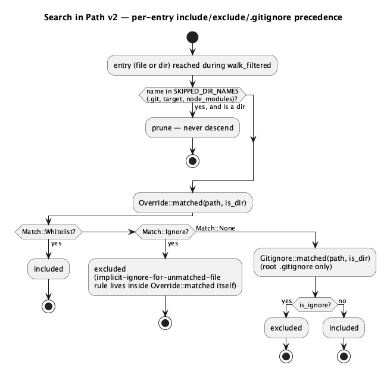
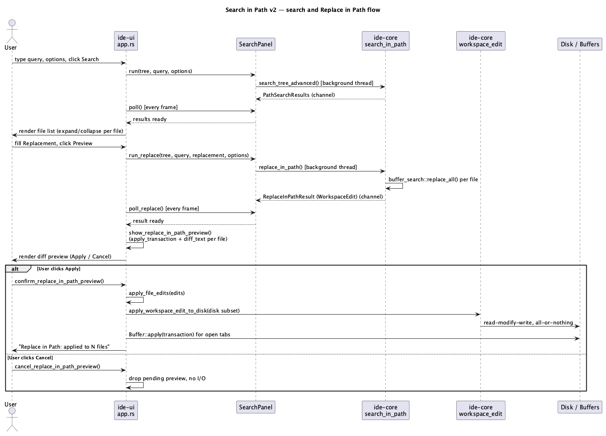

# Search in Path v2 (C7)

## 1. Purpose

`docs/roadmap.md` C7: upgrade global "Find in Path" (`global-search-and-
languages.md`, currently a plain case-insensitive substring scan) with:
regex search (reusing A5's in-buffer engine, `ide_core::buffer_search`),
include/exclude glob filters, `.gitignore`-aware skipping, a Replace in
Path flow with a diff preview before anything is written, and a results
list grouped by file with per-file expand/collapse.

The existing `ide_core::search_tree`/`crates/ui/src/search_panel.rs`/
`render_search_panel` stay exactly as they are — `ide-tui`'s `todo_panel.rs`
(T24) depends on `search_tree`'s current plain-substring behavior, and nothing
about that dependency changes here. C7 adds a second, parallel engine
(`ide_core::search_in_path`) and reworks only `ide-ui`'s Search panel to use
it; `search.rs`/`search_tree` are untouched.

## 2. Interface

### 2.1 `ide-core` additions — `crates/core/src/search_in_path.rs` (new module)

```rust
#[derive(Debug, Clone, PartialEq, Eq)]
pub struct PathSearchOptions {
    pub search: ide_core::buffer_search::SearchOptions, // case_sensitive / whole_word / regex
    pub include: Vec<String>,        // glob patterns; empty = no include filter
    pub exclude: Vec<String>,        // glob patterns; empty = no exclude filter
    pub respect_gitignore: bool,
}

#[derive(Debug, Clone, PartialEq, Eq)]
pub struct PathSearchMatch {
    pub path: PathBuf,
    pub line: u32,          // 0-based
    pub column: u32,        // 0-based, BYTES from line start (see §3.2 — deliberately
                             // not char-based, unlike search::SearchMatch::column)
    pub byte_offset: usize, // byte offset of the match's start within the file's full text
    pub line_text: String,
}

#[derive(Debug, Clone, PartialEq, Eq)]
pub struct PathSearchResults {
    pub matches: Vec<PathSearchMatch>,
    pub truncated: bool, // MAX_SEARCH_RESULTS (reused from crate::search) was reached
}

#[derive(Debug, Clone, PartialEq, Eq)]
pub struct ReplaceInPathResult {
    pub edit: ide_core::WorkspaceEdit, // ide_core::workspace_edit::WorkspaceEdit
    pub truncated: bool,
}

// PathSearchOptions must derive Clone: `SearchPanel::run`/`run_replace`
// (§2.2) take it by value into a background-thread closure while
// `IdeApp::search_options` keeps its own copy alive for the live UI — the
// call site does `self.search_options.clone()`.
//
// `ReplaceInPathResult`'s derive line requires `ide_core::workspace_edit::
// {FileEdit, WorkspaceEdit}` to derive the same traits -- verified (`grep
// derive crates/core/src/workspace_edit.rs`) that today they derive
// nothing at all, not even `Debug`. Part of this doc's core-role scope:
// add `#[derive(Debug, Clone, PartialEq, Eq)]` to both `FileEdit` and
// `WorkspaceEdit` in `crates/core/src/workspace_edit.rs` -- purely
// additive (every field, `PathBuf`/`ide_core::text::Transaction`, already
// supports all four), no behavior change, and `workspace_edit.rs` is
// already in this run's `hacker`-review scope via `search_in_path.rs`
// (both land in the same core-role diff), so this doesn't add a review
// surface that wasn't already there.
#[derive(Debug, thiserror::Error)]
pub enum PathSearchError {
    #[error("invalid search pattern: {0}")]
    InvalidQuery(#[from] ide_core::buffer_search::SearchQueryError),
    #[error("invalid glob {glob:?}: {source}")]
    InvalidGlob { glob: String, source: ignore::Error },
}

pub fn search_tree_advanced(
    tree: &DirEntry,
    query: &str,
    options: &PathSearchOptions,
) -> Result<PathSearchResults, PathSearchError>;

pub fn replace_in_path(
    tree: &DirEntry,
    query: &str,
    replacement: &str,
    options: &PathSearchOptions,
) -> Result<ReplaceInPathResult, PathSearchError>;
```

Both functions require `tree` to be the **root** `DirEntry` a
`Project::scan_tree()` call returned (same implicit contract `search_tree`
already has — `tree.path` is used directly as the `.gitignore`/override
matcher root, exactly mirroring how `search_tree`'s own `walk` assumes
`tree` is the root for `SKIPPED_DIR_NAMES` purposes).

`crates/core/Cargo.toml` gains one dependency: `ignore = "0.4"` (approved by
the user for this run — real `.gitignore` and glob matching, the same
engine ripgrep and VS Code's search use, rather than a hand-rolled
matcher). `ignore::overrides::{Override, OverrideBuilder}` covers the
include/exclude glob filters too — no separate `globset` dependency needed,
it's already pulled in transitively.

### 2.2 `ide-ui` changes

**`crates/ui/src/search_panel.rs`** (reworked):

```rust
pub struct SearchPanel {
    pub results: Option<ide_core::PathSearchResults>,
    pub searching: bool,
    pub expanded: HashSet<PathBuf>,      // NEW — per-file collapse state; a path present
                                          // means "expanded" (default: absent == expanded,
                                          // see §3.4)
    pub replace_preview: Option<ide_core::ReplaceInPathResult>,
    pub replacing: bool,
    // generation/rx fields exist twice, once per op — see §3.1
    ...
}

impl SearchPanel {
    pub fn run(&mut self, tree: DirEntry, query: String, options: PathSearchOptions);
    pub fn poll(&mut self) -> bool;
    pub fn discard_in_flight(&mut self);

    pub fn run_replace(&mut self, tree: DirEntry, query: String, replacement: String, options: PathSearchOptions);
    pub fn poll_replace(&mut self) -> bool;
    pub fn discard_replace_in_flight(&mut self);

    pub fn toggle_expanded(&mut self, path: &Path); // flips membership in `expanded`
}
```

`run`/`poll`/`discard_in_flight` keep their exact current generation-counter
contract (doc comments already on the existing code), just retargeted at
`ide_core::search_tree_advanced` instead of `ide_core::search_tree`, and
now also thread a compile/glob `PathSearchError` back through the channel
as `Result<PathSearchResults, PathSearchError>` instead of always
succeeding (a bad regex or bad glob no longer silently reports zero
results — see §3.5). `run_replace`/`poll_replace`/
`discard_replace_in_flight` are a second, independent instance of the exact
same shape (own generation counter, own `rx`), calling
`ide_core::replace_in_path` — kept as a second pair of methods rather than
a generic "run one of two ops" abstraction, since the two ops have
different inputs (`replacement: String`) and different result types, and
this module already has exactly one existing precedent to extend, not
three-plus call sites that would justify a shared abstraction.

**`crates/ui/src/app.rs`**:

- New `IdeApp` fields: `search_options: ide_core::PathSearchOptions`
  (default: `respect_gitignore: true`, everything else empty/default —
  §3.6), `search_replacement: String`, `search_replace_open: bool`,
  `pending_replace_in_path_preview: Option<ReplaceInPathPreview>`.
- New private struct (mirrors `RefactorPreview`'s existing shape, at the
  `ide_core::WorkspaceEdit` level instead of `ide_lsp::WorkspaceEdit`):
  ```rust
  struct ReplaceInPathPreview {
      edit: ide_core::WorkspaceEdit,
      diffs: Vec<Option<ide_core::FileDiff>>,
  }
  ```
- `run_search`/`trigger_search`: unchanged signatures, now pass
  `&self.search_options` through to `SearchPanel::run`.
- New: `trigger_replace_in_path` (opens the Search view and reveals the
  replacement field — mirrors `find_bar.rs`'s existing `replace_open`
  convention, does **not** itself compute a preview), `run_replace_preview`
  (the panel's "Preview" button — no-op on an empty query/replacement or no
  project, otherwise calls `SearchPanel::run_replace`), and, once a result
  arrives: `show_replace_in_path_preview(edit: ide_core::WorkspaceEdit)`,
  `confirm_replace_in_path_preview`, `cancel_replace_in_path_preview` — see
  §3.3 for their exact bodies (all three closely mirror
  `show_refactor_preview`/`confirm_refactor_preview`/
  `cancel_refactor_preview`, at the `ide_core`-native edit type rather than
  the LSP one).
- **Refactor** (behavior-preserving): `apply_workspace_edit`'s existing
  disk/buffer-split body is factored out into a new private
  `apply_file_edits(&mut self, edits: Vec<ide_core::FileEdit>, what: &str)
  -> Result<usize, String>`, which `apply_workspace_edit` now calls after
  its own `ide_lsp::TextEdit` → `ide_core::text::Transaction` conversion
  loop, and which `confirm_replace_in_path_preview` calls directly (its
  edits are already `ide_core::FileEdit`s, no LSP conversion needed). See
  §3.3.

**`crates/ui/src/app/render.rs`**:

- `render_search_panel` reworked: query field, case/whole-word/regex
  checkboxes (same `ui.checkbox(&mut opt, "Aa"/"Word"/".*")` convention
  `render_find_bar` already uses), Include/Exclude glob text fields, a
  "Respect .gitignore" checkbox, and — only when `search_replace_open` is
  true — a Replacement field plus a "Preview" button. Results render as a
  per-file heading (click toggles `SearchPanel::toggle_expanded`) followed
  by its matched lines only while expanded — see §3.4 for why this,
  not a literal nested directory tree, satisfies the roadmap's "results as
  a file tree with expand" requirement.
- New `render_replace_in_path_preview` — structurally the same window
  `render_refactor_preview` already renders (`Self::render_diff` per file,
  Apply/Cancel), a new, separate method against
  `pending_replace_in_path_preview`/`ReplaceInPathPreview` rather than
  reusing `RefactorPreview` itself, since that struct's `edit` field is
  concretely typed `ide_lsp::WorkspaceEdit` and Replace in Path's edits
  never touch LSP at all (§3.3). Window title: "Replace in Path Preview" —
  deliberately not "Refactor Preview" (the existing window's title), so a
  user doesn't read an LSP-refactor label on a plain-text bulk edit.
  Wired into `eframe::App::update`'s popup-render dispatch list alongside
  `render_refactor_preview`.

**`crates/ui/src/command.rs`**:

- **Bug fix, found during this run's research**: `CommandAction::ReplaceAll`
  (A5, in-buffer Replace All) is currently bound to `⌘⇧R`
  (`Binding::same(KeyChord::new(Key::R).command().shift())`). Verified
  against the real JetBrains macOS keymap (`https://www.jetbrains.com/
  help/idea/reference-keymap-mac-default.html`, fetched directly — see
  §7 Sources) that no standalone "Replace All" action exists in JetBrains
  at all; the two real "Replace"-named actions are "Replace..." (`⌘R`,
  already `CommandAction::Replace`'s binding here) and "Replace in
  Files..." (`⌘⇧R`). This is CLAUDE.md's "never invent a binding" rule
  being violated by A5 — the same class of bug D4 (Optimize Imports/⌘⌥O)
  and C1 (Go to Declaration/⌘B) already found and fixed. Fixed as part of
  this run: `ReplaceAll`'s registry entry gets `binding: None` (still
  reachable from the command palette and its own "Replace All" button,
  same as any other no-default-binding command), and the now-free `⌘⇧R`
  goes to the new command below. The existing test
  `replace_all_is_cmd_shift_r_distinct_from_replace` is rewritten to
  assert `ReplaceAll.binding.is_none()` instead.
- New `Command`:
  ```rust
  Command {
      id: "ReplaceInPath",
      title: "Replace in Path",
      category: "Search",
      binding: Some(Binding::same(KeyChord::new(Key::R).command().shift())),
      action: CommandAction::ReplaceInPath,
  }
  ```
  (category "Search", same category `FindInPath` already uses, right next
  to it in the registry.) `is_command_enabled` gates it on
  `self.project.is_some()` — the same condition `FindInPath` already uses.
  `run_command` dispatches to `self.trigger_replace_in_path()`.

## 3. Behaviour

### 3.1 Off-thread execution, two independent async ops

`SearchPanel` already runs `search_tree` on a background thread and polls a
channel once per frame (`docs/features/global-search-and-languages.md`
§2.2's generation-counter state machine) so a large project's scan never
blocks `eframe`'s frame loop. C7 keeps that shape for
`search_tree_advanced` and adds a second, independently-tracked op for
`replace_in_path` (its own `generation`/`rx`/`searching`-equivalent flag) —
running a search and previewing a replace are two logically separate
requests a user could in principle fire close together (e.g. adjust the
query while a stale replace-preview computation is still in flight); each
has its own single-in-flight-at-a-time + stale-result-discard contract,
independently of the other.

### 3.2 Byte offsets, byte columns — not char columns

`search_in_path.rs` converts each `ide_core::buffer_search::find_matches`
byte-range match to `(line, column)` via `ide_core::text::LineIndex::
position_at(offset)`, whose own doc comment is explicit: `column` is
**bytes** from the line start, not chars. This is deliberately different
from `crate::search::SearchMatch::column`'s char-based convention (that
module hand-rolls its own char-index tracking in `find_match_in_line`
because it doesn't have `LineIndex` in its path); `PathSearchMatch` reuses
`LineIndex` as-is rather than re-deriving a char index that nothing in
this new module's UI consumer actually needs (the UI only ever displays
`{line+1}:{column+1}` as a label and uses `byte_offset` to seek — same
pattern `open_search_result` already follows for the byte offset). `line_text`
comes from `LineIndex::line_range(line, text)`.

### 3.3 Replace in Path: preview and apply

`ide_core::replace_in_path` walks the same `.gitignore`/override-filtered
file set `search_tree_advanced` would for the same query+options, and for
every file with at least one match, calls
`ide_core::buffer_search::replace_all(text, &compiled_query, replacement,
None)` — the **exact same A5 engine** that powers in-buffer Replace All,
so regex capture-group expansion (`$1`, `${name}`), whole-word filtering
and case sensitivity all behave identically in Replace in Path and in a
single open buffer's own Replace All. Each successful `ReplaceResult`
becomes one `ide_core::FileEdit { path, transaction }`; all of them
together become one `ide_core::WorkspaceEdit`. A per-file
`ReplaceResult::truncated` (a single file has more than
`buffer_search::MAX_SEARCH_MATCHES` matches) and an aggregate cap (total
changes across every file reaches `crate::search::MAX_SEARCH_RESULTS`,
reused as-is rather than introducing a third constant) both set
`ReplaceInPathResult::truncated`; hitting the aggregate cap stops the walk
early, same early-stop-not-truncate-after-the-fact policy `search_tree`
already uses for its own matches list.

`ide-ui` never writes anything on receipt of a `ReplaceInPathResult` — it
builds a preview first (`show_replace_in_path_preview`, called once
`SearchPanel::poll_replace` reports a result): for each `FileEdit`, reads
the **current** text (an open tab's buffer if any, else a fresh disk read —
same source `show_refactor_preview` already reads from) — deliberately
re-read at preview-build time rather than trusting whatever text
`replace_in_path` itself read moments earlier off-thread, since a file
could have changed on disk in between — computes the post-edit text via
`ide_core::apply_transaction`, and diffs old/new via `ide_core::diff_text`,
exactly mirroring `show_refactor_preview`'s own body. `render_replace_in_
path_preview` shows one `Self::render_diff` block per file plus Apply/
Cancel. **Apply** (`confirm_replace_in_path_preview`) calls the newly
extracted `apply_file_edits` directly with `preview.edit.edits` — the same
all-or-nothing disk write (`ide_core::apply_workspace_edit_to_disk`,
already symlink-race-safe and already on CLAUDE.md's security-sensitive
list) followed by buffer application for any open tab, that every other
multi-file apply path in this crate already uses. **Cancel** just drops
`pending_replace_in_path_preview` — no I/O has happened yet at that point,
identical to `cancel_refactor_preview`.

A file rewritten on disk by Replace in Path that's *also* open in a tab
elsewhere and *wasn't* matched (so it went through `apply_file_edits`'s
disk path, not its buffer path) is picked up by the existing file-watcher/
`ExternalChange` mechanism (`handle_external_modification`,
`reload_active_from_disk`) exactly as any other external edit would be —
no new buffer-sync code needed for this feature; this only differs from a
matched-and-open file, which `apply_file_edits` updates via `Buffer::apply`
directly and which the watcher's own already-existing "ignore a write we
just made ourselves" handling (if any) or a same-content no-op reload
covers either way.

### 3.4 Results as a file list with per-file expand/collapse

The roadmap line asks for "результаты деревом файлов с раскрытием и
превью строк" (results as a file tree, with expand, and line previews).
`render_search_panel` implements this as a flat, alphabetically-ordered
list of file headings (`results.matches` is already grouped by consecutive
same-path runs, same as the current panel), each independently
expand/collapsible via `SearchPanel::toggle_expanded` — clicking a heading
hides/shows that file's matched-line rows underneath it. This is a
deliberate scope reading, not a literal nested-directory-tree widget: the
project's directory tree already exists as its own panel
(`docs/features/...` tree docs), and a second, independent recursive tree
widget duplicating it purely for search-result grouping is meaningfully
more UI surface than "a tree of files, expandable, with line previews"
requires — a flat list of expandable per-file groups delivers the same
*information hierarchy* (file → its matching lines, collapsible) that a
literal tree would, at a fraction of the implementation cost. `expanded`
tracks *collapsed-out* exclusion by absence — a path not in the set is
expanded by default (matches the current panel's always-expanded
behavior for anyone who never interacts with the new expand/collapse
control at all).

### 3.5 Errors

`SearchQuery::compile` (invalid regex) and `OverrideBuilder::add`/`build`
(invalid glob) both surface as `PathSearchError`, threaded back through
`SearchPanel::poll`/`poll_replace`'s channel as `Result<_, PathSearchError>`
rather than the panel silently showing zero results the way today's
`search_tree` (which cannot itself fail) does. `render_search_panel` shows
`PathSearchError`'s message (via its `Display`/`thiserror` message,
already user-facing text — "invalid pattern: ...", "invalid glob ...:
...") in place of the results list, the same "error replaces content"
convention `render_find_bar` already uses for `find.error()`.

### 3.6 `.gitignore` scope: root-level only

`ide_core::search_in_path::build_matchers` (private) only ever loads
`<project root>/.gitignore` — not any nested-directory `.gitignore`, not
global/user-level git excludes, not `.git/info/exclude`. This is
deliberately not a correctness compromise relative to real git semantics,
combined with the walk's own top-down pruning: once a directory is pruned
(root `.gitignore` marks it ignored, or an exclude override matches it),
nothing under it is ever visited, so a nested `.gitignore` re-including a
file inside an excluded parent — which real git also refuses to honor
("a excluded directory cannot be re-included by a nested rule") — would
never have mattered anyway. The gap this scope cut *does* leave is a
nested `.gitignore` that excludes something the root `.gitignore` doesn't
already exclude and that no exclude-override glob covers either — such a
file is currently still searched/replaced. Documented as a known v1 limit,
not silently dropped.

`Gitignore::empty()`/`Override::default-empty` cover: missing `.gitignore`
file (root has none — `GitignoreBuilder::add`'s `Option<Error>` for a
missing/unreadable file is intentionally discarded, same "skip on I/O
failure" convention `search_file` already uses for unreadable files),
`respect_gitignore: false`, and no include/exclude patterns at all
(`Override::matched` always returns `Match::None` when there are no
overrides, verified from the crate's own source — every file is included
by the override layer, gitignore is then the sole decider).

**Verified precedence** (read directly from `ignore` 0.4.33's own
`src/dir.rs`, not assumed): the override matcher (include/exclude globs)
is checked first and wins outright whenever it returns anything other than
`Match::None`; the `.gitignore` matcher is only consulted when the
override layer has no opinion. An include pattern list with a file
matching none of them is treated as ignored **for files only** — a
directory is never implicitly excluded just because it (or its future
descendants) fails to match an include glob, since include globs describe
*files*, not directory membership, and the walk still has to descend to
find out. This exact "no match + at least one whitelist glob exists + not
a directory → implicit ignore" rule is implemented inside `Override::
matched` itself (`ignore-0.4.33/src/overrides.rs`), not re-derived by this
module.

### 3.7 Directory skip list unchanged

`crate::search::SKIPPED_DIR_NAMES` (`.git`, `target`, `node_modules`) is
still applied unconditionally, before any gitignore/override check —
same as `search_tree`'s existing `walk`. This list stays independent of
`.gitignore`/overrides; a project without a `.gitignore` at all, or one
whose `.gitignore` doesn't mention `target`, still never has C7 descend
into it.

## 4. Constraints & invariants

- `search_tree_advanced`/`replace_in_path` never construct their own
  filesystem walk — both walk the caller-provided `DirEntry` tree
  (`Project::scan_tree`'s existing output), inheriting its symlink-escape
  protection for free, same as `search_tree` today. No new `std::fs`
  traversal is added by this module.
- `replace_in_path` never writes to disk — it only builds a
  `WorkspaceEdit` in memory. All disk I/O happens in `ide-ui`'s
  `apply_file_edits`, gated behind the user clicking Apply in the preview
  window.
- `apply_file_edits`'s disk-then-buffer ordering (unchanged from
  `apply_workspace_edit`'s existing contract) means a disk failure never
  leaves any buffer edited — the all-or-nothing property
  `apply_workspace_edit_to_disk` already guarantees for the disk subset
  extends to the whole multi-file edit this way.
- `MAX_SEARCHABLE_FILE_BYTES`/`MAX_SEARCH_RESULTS` (from `crate::search`)
  and `buffer_search::MAX_SEARCH_MATCHES` are reused verbatim, not
  reimplemented with new values — one file that's too large to search is
  still too large to include in a Replace in Path edit.
- `PathSearchOptions`/`PathSearchMatch`/`PathSearchResults`/
  `ReplaceInPathResult`/`PathSearchError` have zero dependency on
  `ide-lsp` or `ide-ui` — `ide-core` gains a new capability, not a new
  outward dependency.

## 5. Examples

```rust
// Search: literal, case-insensitive, *.rs only, respecting .gitignore.
let project = ide_core::Project::open(root)?;
let tree = project.scan_tree();
let options = ide_core::PathSearchOptions {
    search: ide_core::buffer_search::SearchOptions::default(),
    include: vec!["*.rs".to_string()],
    exclude: vec![],
    respect_gitignore: true,
};
let results = ide_core::search_tree_advanced(&tree, "TODO", &options)?;
for m in &results.matches {
    println!("{}:{}:{} {}", m.path.display(), m.line + 1, m.column + 1, m.line_text);
}
```

```rust
// Replace in Path: regex, across every file, capture-group expansion.
let options = ide_core::PathSearchOptions {
    search: ide_core::buffer_search::SearchOptions { regex: true, ..Default::default() },
    include: vec![],
    exclude: vec!["*.lock".to_string()],
    respect_gitignore: true,
};
let result = ide_core::replace_in_path(&tree, r"foo_(\w+)", "bar_$1", &options)?;
// result.edit is an ide_core::WorkspaceEdit -- caller (ide-ui) previews it
// via apply_transaction/diff_text before ever calling
// apply_workspace_edit_to_disk.
```

## 6. Dependencies & integration points

- `ignore = "0.4"` — new `crates/core/Cargo.toml` dependency (user-approved
  for this run). Root `CLAUDE.md`'s own "Dependencies" table (not
  `docs/roadmap.md` — verified `roadmap.md` only narrates approvals in
  prose per completion entry, e.g. its T26 entry; `CLAUDE.md`'s table is
  the actual ongoing approved-dependency list) gains a `| ignore | C7 |
  .gitignore + glob include/exclude matching for Search in Path |` row.
- Reuses, unmodified: `ide_core::buffer_search::{SearchOptions, SearchQuery,
  SearchQueryError, find_matches, replace_all, MAX_SEARCH_MATCHES}` (A5),
  `ide_core::text::LineIndex`, `ide_core::{FileEdit, WorkspaceEdit,
  apply_transaction, apply_workspace_edit_to_disk}` (A8/code-actions),
  `ide_core::{diff_text, FileDiff}` (git diff rendering), `crate::search::
  {SKIPPED_DIR_NAMES, MAX_SEARCHABLE_FILE_BYTES, MAX_SEARCH_RESULTS}`
  (existing Find in Files).
- `crates/ui/src/app.rs`'s `apply_workspace_edit` is refactored (behavior
  preserved) to share `apply_file_edits` with the new Replace in Path apply
  path — touches an existing, already-tested function; existing tests for
  `apply_workspace_edit`'s callers (code actions, rename) must still pass
  unmodified after the extraction.
- `crates/ui/src/command.rs`'s `ReplaceAll` binding fix touches an
  existing, already-tested command; `crates/ui/src/app.rs`'s three
  `CommandAction::ReplaceAll` references (dispatch match arms + tests) are
  unaffected by the fix since none of them assert on the actual key chord.
- `docs/features/global-search-and-languages.md` is unaffected — it
  documents `search_tree`/`ide-ui`'s *old* Search panel behavior, which no
  longer exists once this doc's `ide-ui` changes land; a follow-up note
  should be added there pointing at this doc, but that file's own content
  describes `ide-tui`'s continued use of `search_tree` too (§1 above) so it
  is not simply superseded wholesale — left for the `rust-ui-dev`/`rev`
  pass to flag precisely, not rewritten here.

### CLAUDE.md follow-up

`crates/ui/src/app.rs`'s new `apply_file_edits`/`confirm_replace_in_path_
preview` path writes to arbitrary project files via
`ide_core::apply_workspace_edit_to_disk`, fed by a regex/glob-driven
multi-file edit built from a user-typed pattern+replacement — the same
shape of surface `crates/core/src/workspace_edit.rs` is already listed
for, but reached from a new call site. Root `CLAUDE.md`'s security-
sensitive-paths list should gain a line for `crates/core/src/
search_in_path.rs` (new `.gitignore`/glob-pattern-driven file selection,
untrusted `.gitignore` content parsing) and note that `crates/ui/src/
app.rs`'s Replace in Path apply path is covered by the existing `crates/
core/src/workspace_edit.rs` entry's rationale. This edit is made once the
core role's diff exists (mirrors the `docker_panel.rs`/`k8s_panel.rs`
follow-up-note precedent).

## 7. Diagrams





## 8. Sources

- `https://www.jetbrains.com/help/idea/reference-keymap-mac-default.html`
  — fetched directly (not taken from search-engine summaries, which gave
  two different wrong answers first) to verify: "Find in Files..." = `⌘⇧F`
  (already `FindInPath`'s existing binding, unchanged), "Replace in
  Files..." = `⌘⇧R` (new `ReplaceInPath`'s binding), and that no standalone
  "Replace All" action exists in the real keymap at all (the basis for the
  `ReplaceAll` binding-fix in §2.2/§7).
- `ignore` crate v0.4.33 source, read directly from the local cargo
  registry cache (`~/.cargo/registry/src/.../ignore-0.4.33/src/{gitignore,
  overrides,dir}.rs`) rather than from memory or crate docs alone — used to
  verify `GitignoreBuilder`/`OverrideBuilder`'s exact method signatures,
  the override-implicit-ignore-for-files rule (`overrides.rs`), and the
  override-wins-over-gitignore precedence (`dir.rs`).

## Revision notes

- §6: corrected which file gains the `ignore` dependency-table row —
  root `CLAUDE.md`'s own "Dependencies" table, not `docs/roadmap.md`
  (verified `roadmap.md` only narrates dependency approvals in prose per
  completion entry; `CLAUDE.md` holds the actual ongoing table).
- §2.1: added explicit derive lists to `PathSearchOptions`,
  `PathSearchMatch`, `PathSearchResults`, `ReplaceInPathResult` —
  `PathSearchOptions: Clone` in particular is load-bearing (cloned into a
  background-thread closure by `SearchPanel::run`/`run_replace` while
  `IdeApp` keeps its own copy). Discovered in the process that
  `ide_core::workspace_edit::{FileEdit, WorkspaceEdit}` currently derive
  nothing at all, which would block `ReplaceInPathResult`'s derive line —
  added a small, additive, behavior-preserving derive addition to both
  types to this doc's core-role scope to unblock it.
