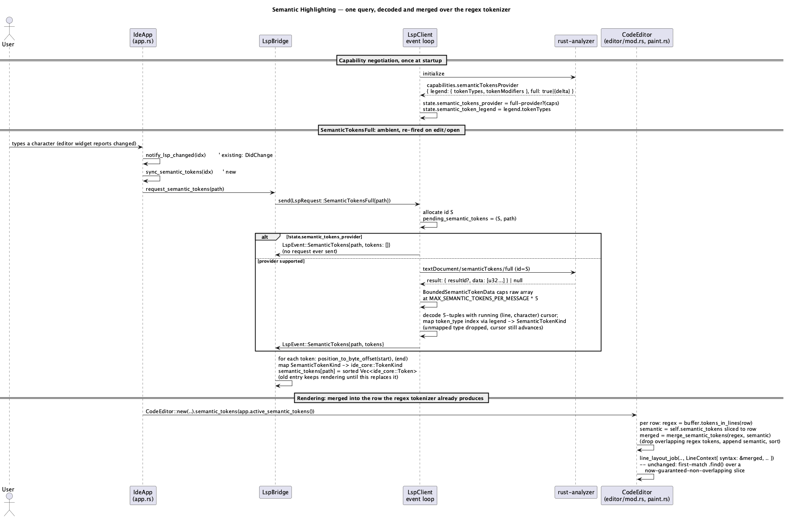

# Semantic Highlighting (A10)

## 1. Purpose

Layers `rust-analyzer`'s `textDocument/semanticTokens/full` answer on top of
the existing hand-rolled regex tokenizer (`crates/core/src/syntax.rs`,
`syntax-highlighting.md`). Closes the gap `docs/roadmap.md` §2.1 names
explicitly: "нет семантики (вызов ≠ определение, тип ≠ переменная той же
формы)" — the regex tokenizer has no symbol table, so it cannot tell a type
name from a local variable of the identical shape (`Foo` vs `foo` is the
only signal it has), and cannot tell a function *call* from a function
*definition* at all. The language server can, because it actually resolved
the identifier.

**Priority rule (the one behavioral contract this whole phase exists to
satisfy):** wherever the server has an opinion about a span, its opinion
wins over the regex tokenizer's guess for that span. Everywhere the server
has no opinion (no client running, still starting, crashed, or the file is
simply outside anything it tagged — punctuation, most keywords, comments,
strings, all of which the regex tokenizer already gets right), the regex
tokenizer's own output is what renders, unchanged. There is no third state
where semantic tokens *replace* the whole line's coloring — they only ever
narrow or widen which spans get which color, never blank a span out.

Builds on the already-merged `ide-lsp` connection (`rust-language-support.md`)
and reuses the exact request/response/capability-negotiation shape
`goto-definition.md`/`rename-refactoring.md`/`inlay-hints-and-hover.md`
already established — this phase adds one more request kind to that same
machinery, not a new subsystem.

**Explicitly deferred**:

- **`textDocument/semanticTokens/full/delta`.** v1 always requests a full
  re-tag on every edit, the same choice `inlay-hints-and-hover.md` §4
  already made for `InlayHint` and for the identical reason: delta support
  needs `resultId` tracking and an edit-application step that roughly
  doubles this phase's protocol surface for a latency win that only matters
  once a real file turns out to be slow to re-tag in practice. Not
  addressed here; a future revision can add it without changing anything
  this doc specifies, since `SemanticTokensFull`'s wire shape is a strict
  subset of what delta support would need.
- **`textDocument/semanticTokens/range`.** Same reasoning as `InlayHint`'s
  whole-document choice: no viewport-scoped request, no scroll-triggered
  refetch, one fewer trigger point to keep in sync with editing.
- **Token modifiers** (`readonly`, `static`, `declaration`, `async`,
  `defaultLibrary`, …). v1 reads only `token_type`; `token_modifiers_bitset`
  is decoded far enough to skip past it correctly (the wire format is
  positional) but never inspected. No styling (bold, italic, strikethrough)
  varies by modifier. Same class of cut as A7's `DocumentHighlight.kind`.
- **Full LSP token-type coverage.** The nine-way mapping in §3.2 covers the
  common identifier-classification cases; token types with no reasonable
  existing (or newly added) `TokenKind` counterpart — `regexp` — are
  dropped rather than forcing a new category into existence for one rare
  type. See §3.2 for the exact table and what happens to an unmapped type.
- **A `range` field on the semantic-tokens legend response beyond
  `full`.** `SemanticTokensOptions.range` (whether the server also supports
  range-scoped requests) is read no further than not being read at all —
  irrelevant once `range` requests are out of scope.

Does not touch `crates/dap/**`, `crates/ui/src/cargo_panel.rs`, or
`crates/ui/src/claude_panel.rs`.

## 2. Interface / API

### 2.1 `ide-core` (one additive change to the existing public API)

```rust
// crates/core/src/syntax.rs
pub enum TokenKind {
    // ... existing eleven variants, unchanged ...
    /// A value binding the regex tokenizer cannot distinguish from a type
    /// by shape alone -- local variables, parameters, struct fields, enum
    /// members, event bindings. Never produced by the regex tokenizer
    /// itself (no `SyntaxRules` field maps to it); exists solely as a
    /// target for semantic-token classification (`semantic-highlighting.md`
    /// §3.2), so that "is `foo` a type or a variable" -- the exact gap
    /// `docs/roadmap.md` §2.1 names -- has an answer once a language
    /// server is attached. Colored identically to plain text (§3.4): real
    /// JetBrains IDEs don't give local variables a strikingly distinct
    /// color either, so this needs no new palette token.
    Variable,
}
```

Every other existing `TokenKind` variant (the current eleven --
`Keyword`/`String`/`Number`/`Comment`/`Punctuation`/`Key`/`Function`/
`Type`/`Macro`/`Constant`/`Operator`), and every other `ide-core` type
(`Token`, `SyntaxRules`, `TextBuffer`, `tokens_in_lines`, …), is unchanged.
`TextBuffer` gains no new field and no new method — semantic tokens never
enter `ide-core` at all, the same architectural choice
`inlay-hints-and-hover.md` §1 already made for `InlayHint`/
`DocumentHighlight` ("Does not touch `crates/core/**`"), extended here to
cover this phase's one small exception (the new enum variant) rather than
storing LSP-sourced data inside the buffer.

### 2.2 `ide-lsp` (additions to the existing public API)

```rust
/// ide-lsp's own small mirror of the subset of LSP standard semantic token
/// types this client can render distinctly -- mirrors how `InlayHint`/
/// `Location` already wrap richer `lsp_types` shapes down to exactly what
/// `ide-ui` needs. Deliberately smaller than `lsp_types::SemanticTokenType`'s
/// full standard set (§3.2's mapping table names every type this omits and
/// why).
#[derive(Debug, Clone, Copy, PartialEq, Eq)]
pub enum SemanticTokenKind {
    Type,
    Function,
    Macro,
    Keyword,
    String,
    Number,
    Comment,
    Operator,
    Variable,
}

/// One decoded, already-delta-resolved semantic token -- absolute
/// position, not the wire's relative-to-previous-token encoding (§3.2
/// does that decoding once, in `ide-lsp`, so nothing downstream ever
/// touches `delta_line`/`delta_start`).
#[derive(Debug, Clone, Copy, PartialEq, Eq)]
pub struct SemanticToken {
    pub position: Position,
    /// UTF-16 code units, matching `Position.character`'s own unit --
    /// converted to a byte length only in `ide-ui`, the same point where
    /// every other `Position` this crate returns is converted (§3.3).
    pub length: u32,
    pub kind: SemanticTokenKind,
}

pub enum LspRequest {
    // ... existing: DidOpen, DidChange, DidClose, References, Goto,
    //     Hover, DocumentHighlight, InlayHint, CodeAction,
    //     ApplyCodeAction, DocumentSymbol, Format, FormatRange,
    //     PrepareRename, Rename ...
    /// Query semantic tokens for the whole of `path`. Own pending-id slot
    /// (`pending_semantic_tokens`), independent of every other request
    /// kind's slot -- same reasoning `InlayHint`'s slot already documents.
    SemanticTokensFull { path: PathBuf },
}

pub enum LspEvent {
    // ... existing: Diagnostics, ServerExited, References, Goto, Hover,
    //     DocumentHighlight, InlayHint, CodeActionsReady,
    //     WorkspaceEditReady, DocumentSymbolsReady, FormatReady,
    //     PrepareRenameReady, RenameReady ...
    /// The result of the most recently sent, not-yet-superseded
    /// `SemanticTokensFull` query, even when empty -- carries `path`, same
    /// reason `InlayHint`'s event does (`ide-ui` keeps this per-file, not
    /// as a single "answer to the last question" slot).
    SemanticTokens {
        path: PathBuf,
        tokens: Vec<SemanticToken>,
    },
}
```

Everything else in `ide-lsp`'s existing public API is unchanged.

### 2.3 `ide-ui`

```rust
// crates/ui/src/lsp_bridge.rs -- additions to the existing LspBridge
struct LspBridge {
    // ... existing: client, diagnostics, server_error, references, goto,
    //     hover, document_highlights, inlay_hints, ... ...
    /// Semantic tokens, keyed by file, **raw** -- `ide_lsp::SemanticToken`,
    /// `Position`-based, exactly as `ide-lsp` decoded them. `LspBridge` has
    /// no buffer text of its own to convert `Position` to a byte offset
    /// against (see the `inlay_hints`/`document_highlights` fields right
    /// above this one, which are stored the same raw way for the same
    /// reason), so unlike this doc's original draft, the
    /// `Position`-to-byte-offset conversion and the
    /// `SemanticTokenKind`-to-`TokenKind` mapping (§3.2's table) both
    /// happen downstream, inside `CodeEditor::show()` (§2.3, `mod.rs`),
    /// the same place `document_highlight_marks` already does the
    /// equivalent conversion for `document_highlights` -- see the
    /// Revision notes at the bottom of this doc. Same per-file-map shape
    /// as `inlay_hints`, same "replaced wholesale per path, old entry
    /// keeps rendering until the fresh one arrives" convention.
    semantic_tokens: HashMap<PathBuf, Vec<ide_lsp::SemanticToken>>,
}

impl LspBridge {
    /// No-op if no client is running -- same shape as
    /// `request_inlay_hints`. Sends `LspRequest::SemanticTokensFull`. Does
    /// *not* clear `semantic_tokens[path]` at send-time, same
    /// stale-but-plausible-until-replaced choice `request_inlay_hints`
    /// already makes and for the same reason (no per-keystroke flicker).
    fn request_semantic_tokens(&mut self, path: &Path);
}
```

`IdeApp` (in `app.rs`) gains:

- `sync_semantic_tokens(&mut self, idx: usize)` — called from the same two
  sites `sync_inlay_hints` already fires from, immediately alongside it
  (§3.3): once on a tab's `DidOpen`, once on every actual (not idle-frame)
  `DidChange`. Calls `LspBridge::request_semantic_tokens(path)`.
- `active_semantic_tokens(&self) -> &[ide_lsp::SemanticToken]` — the active
  tab's entry in `self.lsp.semantic_tokens`, or `&[]` if there's no active
  tab or no entry yet. Same shape as `active_inlay_hints`, raw
  `Position`-based data (see the Revision notes). Read by
  `render_tabs_and_editor` to feed `CodeEditor::semantic_tokens`.

```rust
// crates/ui/src/editor/mod.rs -- additions to the existing CodeEditor
impl<'a> CodeEditor<'a> {
    /// Raw semantic tokens for this file, whole-buffer, `Position`-based --
    /// same convention `inlay_hints` already uses (raw LSP data handed in
    /// at construction time). Converted to absolute byte ranges once,
    /// inside `show()`, via `semantic_token_marks` (§2.3, Revision notes),
    /// the same call-time-conversion point `document_highlight_marks`
    /// already established for `document_highlights`. §3.4 is where the
    /// converted tokens actually change what gets painted.
    pub fn semantic_tokens(mut self, tokens: &'a [ide_lsp::SemanticToken]) -> Self;
}
```

```rust
// crates/ui/src/editor/paint.rs -- new pure functions
/// Converts raw, `Position`-based semantic tokens to absolute-byte-range
/// `ide_core::Token`s against `text`, mapping `SemanticTokenKind` to
/// `TokenKind` via §3.2's table -- called once inside `show()`, the same
/// call-time conversion point `document_highlight_marks` already
/// established. A token whose start or end position doesn't resolve to a
/// valid byte offset (`position_to_byte_offset` returns `None`) is
/// dropped, not inserted, the same "buggy/malicious server response"
/// tolerance §3.2 already specifies. Uses `saturating_add` when combining
/// a `Position`'s `character` with `length`, since both are untrusted
/// `u32` values sourced directly from the language server's response.
pub fn semantic_token_marks(text: &str, tokens: &[ide_lsp::SemanticToken]) -> Vec<Token>;

/// Binary-searches (via `partition_point`, the same technique
/// `TextBuffer::tokens_in_lines` already uses internally) a sorted-by-
/// `range.start` token slice down to the entries overlapping `range`.
/// Generalizes `tokens_in_lines`'s technique to an arbitrary token slice
/// and byte range, rather than the buffer's own line-indexed storage.
pub fn tokens_in_range(tokens: &[Token], range: Range<usize>) -> &[Token];

/// Merges `semantic` over `regex` for one row's worth of tokens: keeps
/// every `regex` token that doesn't overlap any `semantic` token, appends
/// every `semantic` token verbatim, sorts the result by `range.start`.
/// Guarantees no two tokens in the returned `Vec` overlap -- see §3.4 for
/// why that guarantee is what makes `line_layout_job`'s existing
/// first-match-wins boundary walk correct here without any change to that
/// function itself.
pub fn merge_semantic_tokens(regex: &[Token], semantic: &[Token]) -> Vec<Token>;
```

`theme/mod.rs`'s existing `SyntaxColors::of` (reached via `theme.tokens()
.color.syntax.of(...)`, the same accessor `paint.rs`'s `line_layout_job`
already calls) gains one arm: `TokenKind::Variable => default` (the same
"no distinct color" arm `TokenKind::Punctuation` already has) — no new
`Colors` field, no new contrast-check test (§3.4 explains why this reuse
is deliberate, not a placeholder). `of`'s own doc comment ("`default` is
returned for `TokenKind::Punctuation` only") needs updating to name both
variants once this lands, since it will no longer be true as written.

## 3. Behaviour

### 3.1 Capability negotiation

`InitializeResultCapabilities` gains a `semantic_tokens_provider:
Option<lsp_types::SemanticTokensServerCapabilities>` field, parsed from
`InitializeResult.capabilities.semanticTokensProvider` the same
best-effort way `rename_provider`/`document_formatting_provider` already
are (absent or malformed → `None`, never an error). Two accessors, both
fail-closed on absence or a shape this client doesn't recognize, matching
every other capability accessor's existing convention exactly:

- `semantic_tokens_full_provider(&self) -> bool` — `true` only when the
  (possibly-registration-wrapped) options' `full` field is present and
  is either the bare `true` boolean or the `{ delta: .. }` object shape
  (delta being supported implies full is too); `false` for `full: false`,
  an absent `full` field, or an absent `semanticTokensProvider` entirely.
- `semantic_tokens_legend(&self) -> Vec<String>` — the options' `legend
  .token_types`, each converted to a plain `String` via `.as_str()
  .to_string()`; an empty `Vec` for every failure case above, including a
  present-but-`full: false` provider (there's nothing to decode indices
  against if full isn't even requested).

`ConnectionState` stores both as `semantic_tokens_provider: bool` and
`semantic_token_legend: Vec<String>`, set once at the same
`InitializeResult`-handling site every other capability flag already is,
plus `pending_semantic_tokens: Option<(u64, PathBuf)>` — a fourth
independent pending-id slot alongside `pending_inlay_hint`/
`pending_document_highlight_id`/`pending_hover_id`, same reasoning as
those three (an edit firing `SemanticTokensFull` must not race with an
in-flight `Hover`/`DocumentHighlight`/`InlayHint`).

### 3.2 Query lifecycle

Follows the exact shape `Hover`/`DocumentHighlight`/`InlayHint` already
established:

- `send_request`'s match gains one arm: `SemanticTokensFull { path }`.
  `validate_path`s the target file first (same fail-closed
  `LspEvent::SemanticTokens { path, tokens: vec![] }` on an invalid path
  as `PrepareRename`/`Rename` emit on theirs). If `!state
  .semantic_tokens_provider`, emits the same empty event immediately,
  *without allocating an id or sending anything* — the fail-closed
  capability gate lives in `ide-lsp`, exactly where `PrepareRename`'s
  `!state.prepare_rename_provider` gate already lives, not pushed up into
  `ide-ui`. Otherwise allocates an id, sets `pending_semantic_tokens`,
  sends `{ "textDocument": { "uri": ... } }` as
  `textDocument/semanticTokens/full`.
- `handle_incoming`'s id-bearing-no-method `.or_else` chain grows by one:
  `handle_semantic_tokens_response`.
- **Response parsing**: `result: SemanticTokens | null`, read directly
  against the `data`/`resultId` shape rather than through
  `lsp_types::SemanticTokensResult`'s untagged `Tokens`/`Partial` enum —
  this client never sends `partialResultToken` (§1), so a compliant
  server has no reason to ever answer with the `Partial` shape, making it
  unreachable in practice rather than something that needs its own
  handling branch. A `BoundedSemanticTokenData` wrapper, structurally
  the same custom-`Deserialize`-with-an-early-stop shape
  `BoundedInlayHints`/`BoundedLocations` already use, caps the *raw* `u32`
  array at `MAX_SEMANTIC_TOKENS_PER_MESSAGE * 5` elements
  (`MAX_SEMANTIC_TOKENS_PER_MESSAGE = 20_000` — a new constant, not a
  reuse of `MAX_LOCATIONS_PER_MESSAGE`'s `1000`: a real multi-thousand-line
  source file legitimately produces far more semantic tokens than it ever
  would `Location`/`InlayHint` entries, so `1000` would visibly truncate
  highlighting on an ordinary large file, not just an adversarial one;
  `20_000` is generous for any realistic single file while still bounding
  the O(n) decode-and-merge work below a message this large could force).
  Capping the *raw* array (a multiple of 5, preserving the wire chunking)
  rather than the *decoded* `Vec<SemanticToken>` keeps every truncation
  boundary aligned to a whole token, never a partial one.
  - Each chunk of 5 raw `u32`s is `(delta_line, delta_start, length,
    token_type, token_modifiers_bitset)`, decoded with a running
    `(line, character)` cursor exactly per the LSP spec's delta encoding:
    `line += delta_line`; `character = delta_start` if `delta_line != 0`
    (a new line resets the running character), else `character +=
    delta_start` (same line as the previous token, delta is relative to
    it). `token_modifiers_bitset` is read and discarded (§1). This decode
    runs over *every* raw entry within the cap, even ones that end up
    dropped in the next step — the running cursor has to see every entry
    in order or every token after a dropped one decodes to the wrong
    position.
  - `token_type` indexes into `state.semantic_token_legend`
    (out-of-bounds index → this entry dropped, cursor still advances).
    The resolved type name is mapped to a `SemanticTokenKind` via a fixed
    table; a name with no entry (or an index that resolved but the name
    doesn't appear below) is dropped, cursor still advances:

    | LSP `SemanticTokenType` | `SemanticTokenKind` |
    |---|---|
    | `type`, `class`, `enum`, `interface`, `struct`, `typeParameter`, `namespace` | `Type` |
    | `function`, `method` | `Function` |
    | `macro`, `decorator` | `Macro` |
    | `keyword`, `modifier` | `Keyword` |
    | `comment` | `Comment` |
    | `string` | `String` |
    | `number` | `Number` |
    | `operator` | `Operator` |
    | `variable`, `parameter`, `property`, `enumMember`, `event` | `Variable` |
    | `regexp`, or any server-defined type outside this table | dropped |

  - A JSON-RPC error or a `null` result becomes `tokens: vec![]` (same
    permissive convention every other query already follows — "a definite
    empty answer beats a permanently-waiting UI").
- `LspBridge::poll` handles `SemanticTokens` the same way it handles
  `InlayHint`: the raw `Vec<ide_lsp::SemanticToken>` from the event
  replaces `semantic_tokens[path]` wholesale, unconverted (see the
  Revision notes — `LspBridge` has no buffer text to convert `Position` to
  a byte offset against, so that conversion, and the `SemanticTokenKind`
  → `ide_core::TokenKind` mapping below, both happen downstream in
  `CodeEditor::show()` via `semantic_token_marks` instead of here).
  `ServerExited` clears `semantic_tokens` entirely, same reasoning
  `inlay_hints`/`document_highlights` already give (stale semantic
  coloring left up after a crash is actively misleading, unlike stale
  diagnostics).
  `semantic_token_marks` (§2.3, `paint.rs`) is where the actual per-token
  work happens: `position` and `position` + `length` UTF-16 code units
  (`character.saturating_add(length)`, since both are untrusted values
  from the server) each convert via `ide_lsp::position_to_byte_offset`
  (skipped — not inserted — if either returns `None`, the same
  "buggy/malicious server response" tolerance the function's own doc
  comment already documents for diagnostics); `SemanticTokenKind` maps to
  `ide_core::TokenKind` (`Type→Type`, `Function→Function`, `Macro→Macro`,
  `Keyword→Keyword`, `String→String`, `Number→Number`, `Comment→Comment`,
  `Operator→Operator`, `Variable→Variable`); the result is sorted by
  `range.start` (mirrors `tokens_in_lines`'s own sortedness invariant,
  since §3.4's merge assumes it).

### 3.3 Refetching

`sync_semantic_tokens` fires alongside `notify_lsp_changed`/
`sync_inlay_hints`, at the exact two call sites those already fire from —
one `DidOpen`, one per actual `DidChange`. No separate debounce, no new
rate limiting: it's gated on the same "did the buffer's text genuinely
change this frame" signal every sibling refetch already is.

### 3.4 Rendering: merging into the row's token stream

`render_tabs_and_editor` passes `app.active_semantic_tokens()` into
`CodeEditor::semantic_tokens`. Inside `show()`, the raw slice is converted
once via `semantic_token_marks` (§2.3, Revision notes) into absolute-byte-
range `ide_core::Token`s, sorted by `range.start`. Then, inside the
widget's existing per-row loop (`mod.rs`, the site currently reading
`syntax: buffer.tokens_in_lines(line..line + 1)`), the row's semantic-token
slice is found via `tokens_in_range` — the same `partition_point`-based
technique `tokens_in_lines` uses internally, generalized to an arbitrary
sorted token slice and byte range (§2.3) — and the two slices are combined
via `merge_semantic_tokens` (§2.3) before being stored into
`LineContext.syntax` — everywhere else in the row-painting path
(`line_layout_job`, boundary construction, the `.find()` that resolves a
sub-range's color) is completely unchanged, because both inputs to the
merge are already the same `ide_core::Token` shape it already consumes.

**Why "drop the overlapping regex token, keep the semantic one" instead of
an exact-range-match-only override:** a semantic token's span doesn't
always land on the same boundary the regex tokenizer's own heuristics
picked (e.g. the regex tokenizer's `Function` rule matches "identifier
immediately followed by `(`", which may cover a different span than
rust-analyzer's own opinion of where the callee name starts/ends). Requiring
an exact match would silently fail to override in every case the two
tokenizers disagree about span boundaries — precisely the cases where the
semantic answer is most worth having. Dropping any regex token that
*overlaps at all* and inserting the semantic token in its place, instead,
guarantees the merged slice has no two overlapping tokens (the invariant
`line_layout_job`'s first-match `.find()` silently depends on for a
deterministic answer — see the doc comment on `merge_semantic_tokens`),
without requiring boundaries to agree. A semantic token's own boundaries
are always used verbatim.

**On a file with no attached language server, or one that hasn't answered
yet**, `active_semantic_tokens()` is empty and `merge_semantic_tokens`
degrades to returning `regex` untouched — the fallback the whole phase's
purpose statement (§1) promises, falling out of the general algorithm with
no special case.

**On a file too large for the regex tokenizer**
(`text.len() > MAX_HIGHLIGHTED_FILE_BYTES`, `syntax-highlighting.md`'s
existing 2 MiB cap), `buffer.tokens_in_lines` already returns an empty
slice regardless of semantic tokens. `merge_semantic_tokens` with an empty
`regex` input still works correctly — the merged result is just the
semantic tokens verbatim — so a huge file the regex tokenizer gave up on
still gets whatever coloring the language server is willing to compute for
it, a bonus that falls out of the algorithm rather than needing its own
branch.

### 3.5 `TokenKind::Variable`'s color

Renders identically to plain text (`theme/mod.rs`'s `of()` returns
`default`, the caller-supplied fallback color, for it — the same arm
`Punctuation` already has). This is a deliberate visual choice, not an
unfinished one: JetBrains' own New UI color schemes render ordinary local
variables in the same neutral foreground as unstyled text, reserving
distinct colors for the categories that already exist in this palette
(`Type`, `Function`, `Keyword`, `Macro`, …). Adding `TokenKind::Variable`
still matters even with no color of its own, because it's what lets a
semantic token *claim* a span away from whatever the regex tokenizer would
otherwise have guessed there (commonly nothing, since bare identifiers
aren't tokenized by most `SyntaxRules` at all) — the visible effect is a
`Type`-shaped identifier that the regex tokenizer would have miscategorized
(or a `Type`-colored false positive from `capitalized_is_type` on a
variable that merely happens to start with a capital letter) getting
corrected back to plain text once the server's answer arrives, not a new
color appearing.

## 4. Constraints & invariants

- **`crates/core/**` gains exactly one enum variant and nothing else.**
  `TextBuffer` never stores, receives, or is aware of semantic tokens —
  the same boundary `inlay-hints-and-hover.md` §1 already drew for
  `InlayHint`/`DocumentHighlight`, held here even though this phase's data
  is, in the end, still "coloring for a span of buffer text."
- **`merge_semantic_tokens`'s no-overlap postcondition is load-bearing.**
  `line_layout_job`'s boundary walk resolves a sub-range's color via the
  *first* token in iteration order whose range contains the point (§2.3) —
  it has no explicit priority field to break a tie with. Any future change
  to how the merged slice is built must preserve "no two tokens in the
  slice handed to `LineContext.syntax` ever overlap," or color resolution
  becomes order-dependent by accident instead of correct by construction.
- **Four independent pending-id slots for `Hover`/`DocumentHighlight`/
  `InlayHint`/`SemanticTokensFull`**, not one shared slot — same reasoning
  `inlay-hints-and-hover.md` §4 already gives for its three: these are
  legitimately-concurrent, conceptually-unrelated queries, and sharing a
  slot would let one silently cancel another's in-flight answer.
- **`semantic_tokens_provider`/`semantic_token_legend` are fail-closed
  exactly like every other capability flag this client already tracks** —
  absent, malformed, or a shape this client doesn't parse all mean "don't
  send the request," never "send it and hope."
- **The delta-decode cursor must process every raw entry within the cap,
  including ones later dropped for an unrecognized token type** (§3.2) —
  skipping a dropped entry's contribution to the running `(line,
  character)` cursor would desynchronize every subsequent token's decoded
  position, not just the dropped one's.
- **`semantic_tokens[path]` is cleared on `ServerExited`, never left
  stale** — same reasoning `inlay_hints`/`document_highlights` already
  establish for themselves, extended here.
- **No markdown/HTML interpretation anywhere in this path** — inherited
  trivially, since nothing in this phase renders any free-text server
  field at all (only enum-indexed token types and integer positions/
  lengths), unlike `Hover`'s `contents`.
- **`sync_semantic_tokens` is reused unrenamed as a fourth caller of the
  same "gated on the editor widget's own `changed` output" trigger point**
  `notify_lsp_changed`/`sync_inlay_hints` already establish and justify.

## 5. Examples

**Initial open — server tags `Foo` as a type, `count` as a variable:**

```rust
app.notify_lsp_changed(idx);       // existing: sends DidOpen
app.sync_semantic_tokens(idx);     // new: sends SemanticTokensFull{path}
// ... next frame, LspEvent::SemanticTokens{path, tokens} arrives after
// LspBridge::poll() converts it:
// self.lsp.semantic_tokens[path] = [
//     Token { range: 10..13, kind: TokenKind::Type },     // "Foo"
//     Token { range: 18..23, kind: TokenKind::Variable }, // "count"
// ]
// render_tabs_and_editor's next call to CodeEditor::semantic_tokens feeds
// this into the per-row merge; "Foo" renders in the Type color even
// though the regex tokenizer's capitalized_is_type rule would have
// already gotten this one right on its own, and "count" renders as plain
// text even if some SyntaxRules' upper_case_is_constant-adjacent guess
// would have colored it differently -- the server's answer wins either way.
```

**A file with no language server attached (or one still starting):**

```rust
app.active_semantic_tokens(); // &[] -- no entry in self.lsp.semantic_tokens
// merge_semantic_tokens(regex_tokens_for_row, &[]) == regex_tokens_for_row
// (by construction: nothing to drop, nothing to append) -- rendering is
// byte-for-byte what it was before this phase existed.
```

**Server crashes mid-session:**

```rust
// LspEvent::ServerExited arrives:
// self.lsp.semantic_tokens.clear();
// Every open tab's next paint frame falls back to regex-only coloring --
// no stale Type/Variable claims survive the crash.
```

## 6. Dependencies & integration points

- No new external dependencies in either crate. `SemanticTokensFull`'s
  wire encoding reuses `lsp_types::{SemanticTokensResult, SemanticToken,
  SemanticTokensServerCapabilities}` (already a dependency, used the same
  way `Hover`/`InlayHint`/`Rename` already reuse their own `lsp_types`
  counterparts). `BoundedSemanticTokenData` is a hand-rolled bounded-
  deserialize wrapper mirroring `BoundedInlayHints`'s existing shape, not
  a new dependency.
- Builds entirely on the already-merged `ide-lsp` connection/event-loop
  machinery and the four-way request/response precedent `Hover`/
  `DocumentHighlight`/`InlayHint`/`Rename` already established — no new
  subprocess, no new spawn path, no new wire framing, one more independent
  slot in the existing `ConnectionState`.
- `ide-core`: one new `TokenKind` variant in `crates/core/src/syntax.rs`.
  Does not touch `TextBuffer`, `buffer.rs`, or any other module.
- `ide-ui`: extends `lsp_bridge.rs`, `app.rs`, `app/render.rs`,
  `editor/mod.rs`, `editor/paint.rs`, and `theme/mod.rs` (one new match
  arm, no new `Colors` field, no new palette test). Does not touch
  `crates/ui/src/cargo_panel.rs` or `crates/ui/src/claude_panel.rs` —
  neither of `CLAUDE.md`'s declared-sensitive `ide-ui` paths is in this
  role's diff, so a `hacker` pass is not required for `rust-ui-dev` this
  phase, only for `rust-lsp-dev` (`crates/lsp/**` is unconditionally on
  the sensitive list, same as every prior LSP-adding phase).

## 7. Diagram

**The one new query shape, parameterized against the same connection every
sibling query already shares — request/response plus the two things that
make this phase different from `InlayHint`: legend-based decode and the
per-row merge with the regex tokenizer's own output:**



## Revision notes

- §2.1: corrected `TokenKind`'s existing variant count from ten to eleven
  (`Keyword`/`String`/`Number`/`Comment`/`Punctuation`/`Key`/`Function`/
  `Type`/`Macro`/`Constant`/`Operator`, verified against
  `crates/core/src/syntax.rs`).
- §2.3/§3.5: corrected the color-resolution type name from "`Tokens::of`"
  to `SyntaxColors::of` (`Tokens` is the unrelated design-token struct);
  noted that its existing doc comment needs updating once `Variable`
  joins `Punctuation` as a second `default`-returning arm.
- §3.2: reworded the `SemanticTokensResult::Partial` handling — it's
  unreachable given this client never opts into partial results, not an
  actively-detected "unrecognized shape" case as the first draft implied.
- §2.3/§3.2/§3.4 (post-implementation correction): `LspBridge.semantic_tokens`
  stores raw `ide_lsp::SemanticToken` (`Position`-based), not pre-converted
  `ide_core::Token` as originally specified — `LspBridge` has no buffer
  text of its own, so it cannot do the `Position`-to-byte-offset
  conversion the original draft assumed happened at response time (the
  same reason `document_highlights` is already stored raw). The
  conversion, and the `SemanticTokenKind`-to-`TokenKind` mapping, now
  happen once per paint call inside `CodeEditor::show()` via a new
  `semantic_token_marks` function (`paint.rs`), mirroring
  `document_highlight_marks`'s existing call-time-conversion pattern
  exactly. `CodeEditor::semantic_tokens`'s parameter type changed
  accordingly (`&[ide_lsp::SemanticToken]`, not `&[ide_core::Token]`), and
  a new `tokens_in_range` helper generalizes `tokens_in_lines`'s
  `partition_point` technique to slice the converted, sorted token vector
  per row. The merge algorithm, its no-overlap postcondition, and every
  other behavioral guarantee in §3.4/§4 are unchanged — only *where* the
  conversion physically happens moved, from `LspBridge::poll` to
  `CodeEditor::show()`.
