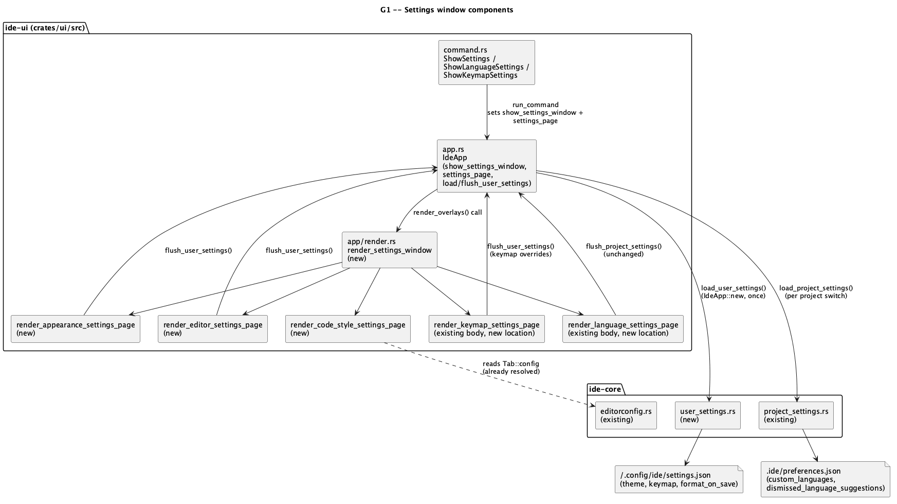

# Settings window (G1)

Roadmap `docs/roadmap.md` §6 Track G, `G1`, size L. Roles: `rust-core-dev`
then `rust-ui-dev`.

## 1. Purpose

`ide-ui` has no unified settings surface today. Preferences are scattered
across independent floating popups (`render_language_settings_window`,
`render_keymap_settings_window`) and a handful of bare toggle commands
(`ToggleTheme`, `ToggleFormatOnSave`) with no page to see or set them from
directly. Worse: every one of those preferences — theme, keymap overrides,
format-on-save — is persisted **per project** (`.ide/preferences.json`, via
`ide_core::project_settings`), so a user who customizes their keymap or
picks a theme in one project starts from scratch, back at hard-coded
defaults, in every other project they open. There is no user-level
(cross-project) preference file anywhere in `ide-ui` at all.

This feature adds:

1. A real, navigable Settings window (`⌘,` / `Ctrl+,`) with page tabs
   down the left side, consolidating existing and new preference UI into
   one place instead of one-off floating popups.
2. A genuine **user-level** settings file (`~/.config/ide/settings.json`),
   parallel to the existing project-level `.ide/preferences.json`
   mechanism, so the preferences that are really about *this user*
   (theme, keymap, format-on-save) follow them across every project
   instead of resetting.

### 1.1 Scope: five pages, not seven

`docs/roadmap.md`'s G1 line lists seven pages: Appearance, Editor, Code
Style, Languages, Keymap, Version Control, Tools. This doc ships **five**
— Appearance, Editor, Code Style, Languages, Keymap — and cuts Version
Control and Tools, for the same reason G3 cut loadable theme files and G8
cut the mockup's drag-and-drop chrome model: there is currently **no
configurable behavior to put on either page**. `ide-ui`'s git integration
(`git_panel.rs`) has no user-facing preferences (no autofetch interval, no
default-branch setting, nothing); there is no external-tool integration of
any kind (`CLAUDE.md`'s own security-sensitive-paths list only mentions a
hypothetical future external formatter — `crates/core/src/editorconfig.rs`
already covers today's actual formatting-adjacent behavior, and it isn't a
subprocess). Building two pages of currently-nonexistent preferences just
to match a page count would be inventing scope, not shipping a settings
window for what the app already does. `SettingsPage` (§2.1) is a plain
enum with five variants — adding `VersionControl`/`Tools` later, once
either frontend actually grows a preference to put there, is a one-variant
addition to an already-established pattern, not a redesign.

## 2. Interface / API

### 2.1 `ide-core`: `crates/core/src/user_settings.rs` (new, `rust-core-dev`)

Generic user-level (home-directory-scoped) JSON read/write helper,
deliberately parallel in shape to the existing project-level
`project_settings.rs` — same "generic over payload type, never knows about
`ide-ui`-only types" design (`project_settings.rs`'s own doc comment),
same atomic-write-via-tempfile discipline, same path-injectable testable
core wrapped by a convenience function that resolves the real path. Unlike
`project_settings.rs`, there is exactly one file (no multi-slot enum) —
nothing in `ide-ui`/`ide-tui` needs a second user-level JSON blob yet, and
`ProjectSettingsFile`'s own doc comment shows the project already has a
precedent for growing a one-variant enum into a multi-variant one later
without disruption, so starting with a single fixed file is not a
one-way door.

```rust
/// `~/.config/ide/settings.json` (or `%USERPROFILE%\.config\ide\settings.json`
/// on Windows -- same `HOME`-then-`USERPROFILE` resolution
/// `crates/tui/src/keymap.rs::keymap_file_path`/`crates/tui/src/state.rs`
/// already use, no new dependency). `ide`, not `ide-ui` or `ide-tui`: this
/// is genuinely frontend-independent infrastructure living in `ide-core`
/// (like `ProjectSettingsFile`'s own doc comment already establishes for
/// project-scoped slots) -- `ide-tui` keeps its own separate
/// `~/.config/ide-tui/*.json` files unchanged in this run (out of scope,
/// `rust-tui-dev` not pulled into this chain), but nothing here is
/// `ide-ui`-specific and a future `ide-tui` run could adopt this module
/// instead of hand-rolling its own equivalent.
pub fn config_dir() -> Option<PathBuf>;

/// `config_dir().map(|d| d.join("settings.json"))`.
pub fn settings_path() -> Option<PathBuf>;

/// Reads and deserializes the file at `path`. `None` if it doesn't exist,
/// can't be read, or doesn't parse -- same fail-open-to-defaults posture
/// `project_settings::read` uses (a hand-edited or crash-truncated file
/// falls back to `T::default()` at the call site, never panics).
pub fn read_from<T: serde::de::DeserializeOwned>(path: &Path) -> Option<T>;

/// Convenience wrapper: `settings_path()` then `read_from`. `None` if
/// `config_dir()` itself can't be resolved (no `HOME`/`USERPROFILE` --
/// treated as "use defaults," not an error).
pub fn read<T: serde::de::DeserializeOwned>() -> Option<T>;

/// Serializes `value` and writes it to `path`, pretty-printed, atomically
/// (temp file in the same directory via `tempfile::Builder`, then
/// `persist`, exactly `project_settings::write`'s existing discipline --
/// same collision-proof temp name, same crash-can't-corrupt guarantee).
/// Creates the parent directory if it doesn't exist.
pub fn write_to<T: serde::Serialize>(path: &Path, value: &T) -> std::io::Result<()>;

/// Convenience wrapper: `settings_path()` then `write_to`. No-ops
/// (returns `Ok(())`) if `config_dir()` can't be resolved -- best-effort,
/// matching `flush_project_settings`'s existing "a write failure is
/// swallowed, this frame's settings simply don't persist" posture.
pub fn write<T: serde::Serialize>(value: &T) -> std::io::Result<()>;
```

`read`/`write` are what `ide-ui` calls in practice; `read_from`/`write_to`
exist so tests never touch the real `$HOME` (mirrors
`crates/tui/src/keymap.rs`'s `save_to(path: &Path, ...)` /
`keymap_file_path() -> Option<PathBuf>` split exactly).

### 2.2 `ide-ui`: `UserPreferences` moves three fields out of `ProjectPreferences`

Today (`crates/ui/src/app.rs`), `ProjectPreferences` holds `theme: Theme`,
`custom_languages: Vec<LanguageConfig>`, `keymap: KeymapOverlay`,
`format_on_save: bool`, `dismissed_language_suggestions: Vec<String>`, all
five in `.ide/preferences.json`. This doc splits it:

```rust
/// New. `~/.config/ide/settings.json` via `ide_core::user_settings`.
/// Everything here is genuinely about *this user*, not *this project* --
/// the exact three fields `ProjectPreferences` is losing.
#[derive(Debug, Clone, Serialize, Deserialize, Default)]
struct UserPreferences {
    theme: Theme,
    keymap: KeymapOverlay,
    format_on_save: bool,
}

/// Unchanged file (`.ide/preferences.json`), fewer fields.
#[derive(Debug, Clone, Serialize, Deserialize, Default)]
struct ProjectPreferences {
    custom_languages: Vec<LanguageConfig>,
    dismissed_language_suggestions: Vec<String>,
}
```

`custom_languages`/`dismissed_language_suggestions` stay project-scoped
deliberately: a Python project's custom language configs (or a dismissed
"install rust-analyzer?" suggestion for a language this project doesn't
even use) have no business following the user into an unrelated Rust
project. Only the three fields that are legitimately "how I like my IDE to
look and behave, everywhere" move.

**No migration code.** `serde_json` ignores unknown JSON fields by
default (`#[serde(deny_unknown_fields)]` is never used anywhere in this
project's `*Preferences`/`*State` structs) — an existing
`.ide/preferences.json` with a `"theme"`/`"keymap"`/`"format_on_save"` key
from before this change simply has those three keys ignored on the next
read, and the next write omits them. This is the same "no migration
convention for `.ide/*.json`, and inventing one for a low-stakes local
settings file costs more than the problem" call the project already made
explicitly for `T47`'s `custom_actions.json` shape change — cited here as
precedent, not re-litigated.

### 2.3 `IdeApp` fields (both new)

```rust
show_settings_window: bool,
settings_page: SettingsPage,
```

```rust
#[derive(Debug, Clone, Copy, PartialEq, Eq, Default)]
enum SettingsPage {
    #[default]
    Appearance,
    Editor,
    CodeStyle,
    Languages,
    Keymap,
}
```

### 2.4 New/changed methods (`app.rs`)

- `fn load_user_settings(&mut self, ctx: &egui::Context)` — called once
  from `IdeApp::new`, **not** from `load_project_settings` (§3.1 explains
  why). Reads via `ide_core::user_settings::read::<UserPreferences>()`
  (`.unwrap_or_default()`), sets `self.theme`/`self.keymap`/
  `self.format_on_save`, applies the theme to `ctx`
  (`crate::theme::apply`, same call `load_project_settings` already
  makes today).
- `fn flush_user_settings(&self)` — builds `UserPreferences` from current
  `self.theme`/`self.keymap`/`self.format_on_save` and writes it via
  `ide_core::user_settings::write`. Called immediately after any of the
  three fields changes through the Settings window or an existing
  quick-toggle command (`ToggleTheme`, `ToggleFormatOnSave`, a keymap
  override/reset) — the same "immediate application, no separate Save
  button" pattern `crates/tui/src/keymap.rs` (T22) and
  `crates/tui/src/theme.rs` (T41) already established, cited directly
  since this doc's Appearance/Keymap pages are functionally the GUI
  counterparts of those two TUI popups.
- `load_project_settings`/`flush_project_settings` (existing methods):
  drop the three moved fields from both the read and the write side —
  `flush_project_settings` no longer builds `theme`/`keymap`/
  `format_on_save` into `ProjectPreferences` at all, `load_project_settings`
  no longer assigns `self.theme`/`self.keymap`/`self.format_on_save` from
  the project file.
- `fn render_settings_window(&mut self, ctx: &egui::Context)` — one
  `egui::Window` (not `egui::Modal` — this crate's established default;
  the local-input-only Modal exception from `docs/features/
  gui-local-agent.md` §4 doesn't apply, nothing irreversible happens by a
  stray click landing outside this window), open state driven by
  `self.show_settings_window`. Calls `self.poll_keymap_capture(ctx)`
  unconditionally at the top, before constructing the window — the exact
  call the existing `render_keymap_settings_window` already makes
  (`app/render.rs:3338`), moved here because it needs `ctx` and this is
  now the only page-dispatching method that has it. Unconditional (not
  gated on `self.settings_page == Keymap`) so an in-progress key capture
  is never silently dropped if the user clicks to a different page
  mid-capture. Left column: five page labels (`SettingsPage::ALL` order),
  clicking one sets `self.settings_page`. Right side: `match
  self.settings_page` dispatches to one of the five page-render methods
  below, each taking `ui: &mut egui::Ui` only (none of the five needs
  `ctx` — confirmed by reading both existing window bodies this doc
  relocates: neither's closure references `ctx`, only the now-obsolete
  outer `.show(ctx, ...)` wrapper did).

  Replaces the two existing per-frame call sites outright:
  `app/render.rs:5245-5246`'s `self.render_language_settings_window(&ctx);`
  / `self.render_keymap_settings_window(&ctx);` are both **deleted**, and
  a single `self.render_settings_window(&ctx);` takes their place at the
  same position in the render chain.
- `fn render_appearance_settings_page(&mut self, ui: &mut egui::Ui, ctx: &egui::Context)`
  — direct theme picker: one row per `Theme` variant (`Light`/`Dark`/
  `Ember`) as a selectable label/radio, not the existing cycle-only
  `Theme::next()`. Picking a different theme sets `self.theme`,
  reapplies it (`crate::theme::apply(ctx, self.theme)`, same call
  `toggle_theme` already makes), and calls `flush_user_settings`. This is
  the direct answer to `G3`'s own recorded `[controversial]` finding
  ("cyclical `next()` without direct pick is a step back from `T41`'s own
  precedent, which got a real Theme Settings popup as soon as there were
  more than two themes") — resolved here, not re-argued. `ToggleTheme`
  (cycle) stays as a quick shortcut, but — unlike this page — is not
  presentation-unchanged: see below, it gains the same flush call.
- `fn render_editor_settings_page(&mut self, ui: &mut egui::Ui)` —
  one checkbox, "Format on save" (`self.format_on_save`), toggling it
  calls `flush_user_settings`. `ToggleFormatOnSave` command stays, same
  target field — see below, it also gains the same flush call.

- `fn render_code_style_settings_page(&mut self, ui: &mut egui::Ui)` —
  **read-only**. Shows the active tab's already-resolved
  `Tab::config: ide_core::EditorConfig` (populated at open time via
  `editorconfig::resolve`, already audited/security-sensitive-declared
  under `crates/core/src/editorconfig.rs` — this page adds no new call to
  `resolve`, no new I/O, just reads the field that already exists on the
  active `Tab`) — one row per `EditorConfig` field (indent style, indent
  size, trim trailing whitespace, insert final newline, end-of-line,
  charset), each rendered as `"<value>"` when `Some`, `"(editor default)"`
  when `None`. No active tab: `"Open a file to see its effective code
  style."` No override controls in v1 — this page is diagnostic
  ("what's actually in force, and why"), not a second place to configure
  what `.editorconfig` already configures; a future run can add
  in-app-editable style overrides (real IDEs do) as a separate, later
  feature if it turns out to be wanted.
- `fn render_language_settings_page(&mut self, ui: &mut egui::Ui)` /
  `fn render_keymap_settings_page(&mut self, ui: &mut egui::Ui)` — the
  **existing** `render_language_settings_window`/
  `render_keymap_settings_window` bodies, with their `egui::Window::new(...)`
  wrapper stripped off (their inner content becomes what's rendered into
  the settings window's right-hand `ui` instead of a second floating
  window) and rendered when `self.settings_page` is `Languages`/`Keymap`
  respectively. Every other detail of these two pages — `add_custom_language`,
  the debug-adapter-command/args fields, `language_settings_error`, the
  keymap capture flow, `show_language_settings`/`show_keymap_settings`
  themselves — is **unchanged**; this is a rendering-location move, not a
  rewrite. `show_language_settings`/`show_keymap_settings` stay as they
  are and still gate whether these two bodies render, but `ShowLanguageSettings`/
  `ShowKeymapSettings` (§2.5) now additionally open the settings window
  and jump `self.settings_page` to the right page, rather than opening an
  independent floating window.

### 2.4a Existing mutation sites gain an immediate flush (not optional)

Today, none of `toggle_theme` (`app.rs:1398-1401`), the
`ToggleFormatOnSave` handler (`app.rs:5282`, `self.format_on_save =
!self.format_on_save`), or the keymap capture confirm/reset call sites
(`app.rs:5585`, `5596`, `self.keymap.set_override(...)`/`self.keymap.reset(...)`)
persist anything themselves — all three rely entirely on the *next*
`flush_project_settings` call (today, triggered by a project switch or
app exit) to write the change to disk. That is an acceptable gap today
because project switches are frequent. **After §3.1's migration, project
switches stop touching `theme`/`keymap`/`format_on_save` at all** — so if
these three existing call sites are left as-is, a user who only ever
uses the quick-toggle commands (never opens the new Settings window)
would have their changes persist *exclusively* at cooperative app exit
(`save()`), strictly worse than today's already-imperfect-but-frequent
flush cadence, and a real, silent data-loss regression on any crash or
force-quit.

This doc therefore requires all three existing call sites to gain a
`self.flush_user_settings()` call, in addition to (not instead of) the
`render_appearance_settings_page`/`render_editor_settings_page` call sites
already specified above:

- `toggle_theme`: add the call right after `crate::theme::apply(ctx,
  self.theme)`.
- The `ToggleFormatOnSave` `run_command` arm: add the call right after
  the field flip.
- `confirm_keymap_capture` (the method containing the `set_override` call
  at `app.rs:5585`) and `reset_keymap_binding`-or-equivalent (the method
  containing the `reset` call at `app.rs:5596` — the implementing role
  should confirm the exact method name/boundary, since this doc's own
  research only traced the two call sites, not their enclosing method
  signatures): add the call at the end of each, after the mutation.

### 2.5 Commands (`command.rs`)

```rust
CommandAction::ShowSettings,          // new
CommandAction::ShowLanguageSettings,  // existing, action changes (see below)
CommandAction::ShowKeymapSettings,    // existing, action changes (see below)
```

- `ShowSettings` — new. Category `"Settings"` (already exists, currently
  holds only `ShowLanguageSettings`/`ShowKeymapSettings`). Binding
  `{mac: "⌘,", other: "Ctrl+,"}` — `docs/roadmap.md` §5.2's own default
  table already reserves exactly this binding for `Settings`/`G1`
  (`| Settings | ⌘, | G1 |`), so this is not a new invented binding, it's
  filling in one the roadmap already committed to. `run_command`:
  `self.show_settings_window = true; self.settings_page = SettingsPage::Appearance;`.
- `ShowLanguageSettings` — title/category/id unchanged (`"Languages…"`,
  `"Settings"`). `run_command` changes from
  `self.show_language_settings = true` to
  `self.show_language_settings = true; self.show_settings_window = true; self.settings_page = SettingsPage::Languages;`.
- `ShowKeymapSettings` — symmetric change, `SettingsPage::Keymap`.

`is_command_enabled`: all three always enabled (matches
`ShowLanguageSettings`/`ShowKeymapSettings`'s existing unconditional
`true`, and the existing
`is_command_enabled_always_allows_tool_window_and_zen_toggles` test's
precedent for this class of command).

Native macOS menu (`crates/ui/src/app/menu.rs`): `ShowSettings` added
to whichever `MenuGroup` already holds `ShowLanguageSettings`/
`ShowKeymapSettings` — required by the existing
`every_non_build_command_appears_in_the_native_menu_exactly_once` test,
the same integration point G8/G9 both had to add their own new commands
to.

## 3. Behaviour

### 3.1 User settings load once; project settings load per switch

`load_user_settings` runs exactly once, from `IdeApp::new`, before any
project is opened — theme/keymap/format-on-save are properties of the
*running IDE session*, not of whichever project happens to be open, so
switching projects must never reset or reload them. This is a real
behavior change from today: currently `load_project_settings` resets
`self.theme`/`self.keymap`/`self.format_on_save` to whatever (or nothing)
the newly-opened project's `.ide/preferences.json` had, on every switch —
after this change, opening a different project leaves all three
untouched, and only `custom_languages`/`dismissed_language_suggestions`
still reload per-switch as before.

### 3.2 Immediate write-through, no Save/Cancel

Every settings change (theme pick or cycle, format-on-save toggle, a
keymap override/reset via the existing keymap-capture flow, a custom
language added/edited via the existing language form) applies
immediately and writes through to disk — `flush_user_settings` for
theme/keymap/format-on-save (both the two new page methods **and** the
three existing quick-toggle call sites, §2.4a — this doc changes existing
behavior here, it does not just add new call sites alongside an
already-immediate existing one), `flush_project_settings` (unchanged) for
language changes — no draft state, no explicit Save button, no Cancel
that discards anything. This matches `add_custom_language`'s existing
immediate-apply shape and both TUI precedents this doc cites (`T22`,
`T41`); §2.4a is what makes the *quick-toggle* commands match it too,
since today they don't actually flush immediately themselves, they only
benefit from `flush_project_settings` happening to run soon after for an
unrelated reason (a project switch). Introducing a draft/commit model for
only the new pages while everything else stays immediate-apply would be
an inconsistent, surprising split for no stated benefit — so the new
pages match the *intended* pattern, and §2.4a brings the pre-existing
commands up to that same standard rather than leaving them on the older,
weaker one.

### 3.3 Window open/close

`show_settings_window` starts `false`. `ShowSettings`/
`ShowLanguageSettings`/`ShowKeymapSettings` set it `true` (and set
`settings_page`, §2.5). The window's own close button (`egui::Window`'s
built-in one) or `Escape` (already-established `handle_shortcuts`
convention for every other `bool`-flag popup in this crate) sets it back
to `false`. Switching pages via the left-hand list never closes the
window. `show_language_settings`/`show_keymap_settings` (the two
existing flags) stay `true` for the lifetime of `show_settings_window`
being open once either has been set — they gate whether the corresponding
page's *content* renders when selected, not whether the window itself is
open; nothing currently reads them to decide window visibility once this
lands, so their `true` value while unrelated pages are showing is inert,
matching the "defensive, never-should-observably-matter" posture already
used elsewhere in this crate rather than threading a redundant
`settings_page == Languages` check through their own render bodies too.

### 3.4 Project switch and the moved fields

Because `theme`/`keymap`/`format_on_save` no longer live in
`ProjectPreferences`, `load_project_settings`'s existing
`self.theme = preferences.theme` / `self.keymap = preferences.keymap` /
`self.format_on_save = preferences.format_on_save` lines are deleted
outright (not replaced) — confirmed via the current `load_project_settings`
body (`crates/ui/src/app.rs:2217-2229`) and `flush_project_settings`
(`crates/ui/src/app.rs:2166-2174`), both read as part of this doc's own
research, not assumed.

## 4. Constraints & invariants

- `ide_core::user_settings` is **not** on `CLAUDE.md`'s security-sensitive
  list, and this doc does not add it there: the path it reads/writes is
  always the fixed, literal `~/.config/ide/settings.json` (or the
  `%USERPROFILE%` equivalent) — never a project-supplied, user-typed, or
  otherwise untrusted path, no subprocess, no network. This is the exact
  same trust shape as `crates/tui/src/keymap.rs`/`crates/tui/src/state.rs`
  (already shipped, never flagged, never added to the sensitive-paths
  list) — `hacker` is not required for this module for the same reason it
  wasn't required for those.
- The Code Style page performs no new disk I/O and calls no new function
  — it reads `Tab::config`, already populated by an already-audited
  `editorconfig::resolve` call this doc does not modify.
- `UserPreferences`/`ProjectPreferences` must not both claim ownership of
  any field — `theme`/`keymap`/`format_on_save` exist in exactly one of
  the two structs after this change, never both (a duplicate would mean
  two different call sites disagreeing about which value is live,
  depending on load order).
- `SettingsPage` has no `Deserialize`/persistence of its own — which page
  was last open is not remembered across restarts (`ShowSettings` always
  opens on `Appearance`); a documented v1 simplification, not an oversight.

## 5. Examples

Opening Settings and picking a theme (from `render_settings_window`'s
call site, `app/render.rs`, alongside every other popup render call):

```rust
// app/render.rs, in IdeApp::render_overlays (or equivalent existing
// per-frame popup-render call site):
self.render_settings_window(&ctx);
```

```rust
// Inside render_settings_window, Appearance page selected:
for theme in [Theme::Light, Theme::Dark, Theme::Ember] {
    if ui.selectable_label(self.theme == theme, theme.label()).clicked() {
        self.theme = theme;
        crate::theme::apply(ctx, self.theme);
        self.flush_user_settings();
    }
}
```

A brand-new project, opened for the first time, on a machine where the
user already picked `Ember` and customized two keymap bindings in a
different project earlier the same session:

```text
IdeApp::new
  -> load_user_settings()          // self.theme = Ember, self.keymap = {2 overrides}
  -> open_project(new_project_root)
     -> load_project_settings(root, ctx)
        // custom_languages/dismissed_language_suggestions load from
        // new_project_root/.ide/preferences.json (likely empty/absent)
        // theme/keymap are NOT touched -- still Ember, still the two
        // overrides, exactly as the user left them
```

## 6. Dependencies & integration points

- `ide-core`: new `crates/core/src/user_settings.rs` (§2.1). No new
  external dependency — `tempfile`/`serde`/`serde_json` are all already
  workspace dependencies of `ide-core` (`project_settings.rs` already
  uses all three).
- `ide-ui`: `Theme`/`KeymapOverlay` (existing, already `Serialize`/
  `Deserialize` via their use in today's `ProjectPreferences`),
  `ide_core::EditorConfig` (existing, read-only use via `Tab::config`),
  `command.rs`/`app/menu.rs` (existing integration points every prior
  new-command run already touches).
- No new external crate dependencies.
- `crates/tui/**` is explicitly **not** touched by this run (`ide-tui`
  keeps its existing separate `~/.config/ide-tui/*.json` files) — a
  future run could point `ide-tui` at `ide_core::user_settings` instead
  of its own hand-rolled equivalents, but that is a separate decision for
  whoever owns that follow-up, not implied or required by this doc.

## 7. Diagrams



## Revision notes

`rev` DOCUMENTATION REVIEW (round 1) found two real gaps and one
precision issue, all fixed in place above:

1. **[quality] §3.2/§2.4** — the original text claimed immediate
   write-through already "matches... `toggle_theme`," which is false:
   `toggle_theme`/the `ToggleFormatOnSave` handler/the keymap capture
   confirm+reset call sites don't flush anything themselves today, they
   rely on the *next* `flush_project_settings` (a project switch or app
   exit) to persist. Since this doc's own migration makes project
   switches stop touching these three fields entirely, leaving those
   three call sites unchanged would mean user-level settings persist
   only at cooperative app exit — a real reliability regression, not a
   neutral no-op. Fixed: new §2.4a requires all three existing call sites
   to gain a `flush_user_settings()` call; §3.2 corrected to state this
   plainly instead of asserting a false precedent.
2. **[docs] §2.4** — `poll_keymap_capture(ctx)`, which the existing
   `render_keymap_settings_window` calls unconditionally before building
   its window, had no stated new call site once that window's `ctx`-taking
   wrapper goes away and the keymap page body becomes a `ui`-only method.
   Fixed: specified it now runs unconditionally at the top of
   `render_settings_window` itself (the one page-dispatching method that
   still has `ctx`), so an in-progress capture is never dropped by
   switching pages.
3. **[docs] §5** — the example hedged with "(or equivalent existing
   per-frame popup-render call site)" instead of naming the actual
   integration point. Fixed: `render_settings_window`'s own description
   now names `app/render.rs:5245-5246` explicitly and states both
   existing calls there are deleted, not left alongside the new one.

`rev` DOCUMENTATION REVIEW (round 2) verified all three round-1 fixes are
genuinely present and correct in the doc text (including cross-checking
every `app.rs`/`app/render.rs` line citation added by fix #3 against the
current source — all accurate), and found one new structural defect
introduced by round 1's edit itself:

4. **[docs] §2.4/§2.4a** — inserting the `### 2.4a` heading directly after
   the `render_editor_settings_page` bullet (to satisfy round-1 finding 1)
   left the three remaining page-method bullets
   (`render_code_style_settings_page`, `render_language_settings_page`,
   `render_keymap_settings_page`) structurally nested under the `2.4a`
   heading instead of `2.4` — misleading to a reader navigating by
   section, since those three bullets have nothing to do with "existing
   mutation sites gaining a flush." Fixed: moved `### 2.4a` to after the
   full five-bullet `§2.4` method list (right before `### 2.5 Commands`),
   so all five page-method bullets stay together under `§2.4` and `2.4a`
   reads as its own distinct addendum section, as originally intended.
