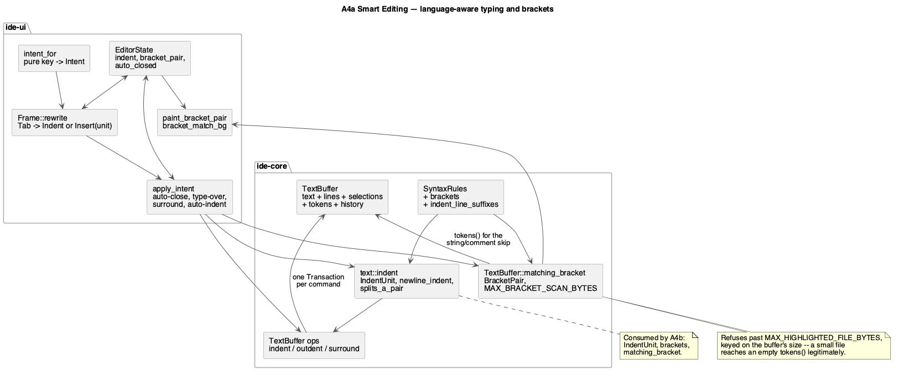

# Smart Editing — Language-Aware Typing and Brackets

Roadmap phase **A4a**, the first of the two sets `docs/roadmap.md`'s A4 row
was split into (`line-commands-and-editorconfig.md` is A4b). Two roles in
the project's declared order: **`rust-core-dev`** for the indent model, the
bracket matching and the two new `SyntaxRules` fields, then
**`rust-ui-dev`** for the typing behaviours and the pair highlight.

**Why the split.** A4 as the roadmap stated it was eleven features across
two crates — roughly three times A3, with a config-file parser that reads
untrusted files off disk bolted onto a set of typing behaviours it has
almost nothing in common with. It is split along the one boundary where the
dependencies run in a single direction: this set introduces `IndentUnit`,
`SyntaxRules::brackets` and `TextBuffer::matching_bracket`, and A4b builds
its line commands, its selection hierarchy and its EditorConfig reader on
top of them. Nothing here depends on anything in A4b, so this set can merge
and ship on its own.

No path in either role's scope is security-sensitive by `CLAUDE.md`'s list,
so `hacker` is skipped for this set. A4b's `editorconfig.rs` is the part
that needs it.

## 1. Purpose

A2 gave the editor a caret and A3 gave it many. What neither gave it is any
notion of *what the text means*: `Enter` inserts a bare newline at column
zero, `{` is one character rather than half a pair, and nothing on screen
says which brace closes which.

This set adds the behaviours that happen while you type — all of them
multi-cursor by construction, because A3 landed the cursors and every
operation here is one `Transaction` over every selection, which is what
keeps "one edit, one undo step" true without re-deriving it.

### 1.1 Scope

In:

| # | Feature | Where |
|---|---|---|
| 1 | Auto-indent on `Enter`, language-driven | core + ui |
| 2 | Auto-close brackets and quotes, type-over of the closing one | core + ui |
| 3 | Surround selection by typing an opening bracket or quote | core + ui |
| 4 | Matching-bracket search, pair highlight, jump to match | core + ui |
| 5 | `Tab` / `⇧Tab` indent and outdent over a selection | core + ui |

Out, and named so the boundary is explicit:

- **Everything in A4b** — Duplicate/Delete/Join/Move Line, Move Statement,
  Toggle Comment, Extend/Shrink Selection, Toggle Case, EditorConfig. That
  set consumes this one's `IndentUnit`, `brackets` and `matching_bracket`.
- **`IndentUnit` from a config file.** This set defines `IndentUnit` and
  defaults it (four spaces); A4b is where `.editorconfig` starts deciding
  its value. Everything here reads it through the same accessor either way,
  so A4b changes where the value comes from and nothing else.
- **Reformat Code (`⌘⌥L`)** — A9, and a different problem: it reformats
  existing code through an external formatter, while everything here acts at
  the caret.
- **Live templates / Surround With… templates (`⌥⌘T`)** — A11. "Surround
  With" in this set means only what feature 3 says: typing `(` with a
  selection wraps it. It is a typing behaviour, not a command, and it has no
  binding.
- **The command registry** — B3. Until it lands these bindings live in
  `intent_for`/`handle_shortcuts` exactly as A2's and A3's do.

### 1.2 Bindings

This set claims exactly one chord, and it is one A2 already owns.

| Action | JetBrains macOS | Windows/Linux |
|---|---|---|
| Indent Selection | `Tab` | `Tab` |
| Unindent Selection | `⇧Tab` | `Shift+Tab` |

Neither diverges between the two keymaps, so both are plain entries when B3
builds the `{ mac, other }` registry. A4b carries all four of the chord
collisions the undivided A4 doc catalogued (`⌘⌫`, `⌘⇧↑`/`⌘⇧↓`, `⌥↑`/`⌥↓`,
`⌘⌥/`); none of them is reachable from this set.

**`Tab` is a change to A2, not an addition.** A2 maps bare `Tab` to
inserting a literal `"\t"`. Feature 5 keeps a bare caret inserting one
indent *unit* — which is `"\t"` only when the unit is tabs — and gives
`Tab` the indenting meaning when the selection is non-empty or spans more
than one line. Since this set defaults the unit to four spaces, `Tab` at a
bare caret starts inserting spaces; that is the intended change, and A4b's
`.editorconfig` is what will make it project-controlled.

`Enter`, and typing a bracket or a quote, are not bindings at all — they are
what the existing `Intent::Newline` and `Intent::Insert` already do, with
new behaviour behind them.

## 2. Interface / API


### 2.1 `SyntaxRules` gains two fields (core)

```rust
pub struct SyntaxRules {
    // ... the eighteen fields A2/the highlighting phases already ship ...

    /// Bracket pairs, `(open, close)`. Drives auto-closing (§3.2),
    /// matching (§3.4), auto-indent's block detection (§3.1) and — in A4b —
    /// Move Statement's balance test. Empty for a language with no
    /// bracketing worth the behaviour (Markdown prose, `.env`).
    ///
    /// Each `open` must be distinct from every other `open` and from every
    /// `close`; a language that uses one character for both (there is none
    /// here) would break the scan in §3.4. Quotes are **not** listed here —
    /// they are `string_quotes`, and they are matched by a different rule
    /// precisely because they are their own closer.
    pub brackets: &'static [(char, char)],

    /// A line whose trimmed content *ends* with one of these opens an
    /// indented block even though no bracket is left open — Python's and
    /// YAML's `":"`. Checked after the bracket rule and combined with it:
    /// a line that both opens a bracket and ends with a trigger still
    /// indents by exactly one unit (§3.1).
    pub indent_line_suffixes: &'static [&'static str],
}
```

Values per language. Every one of the nineteen `SyntaxRules` constants gains
both fields; the ones not listed get `brackets: &[]` and
`indent_line_suffixes: &[]`.

| Language | `brackets` | `indent_line_suffixes` |
|---|---|---|
| Rust, Go, Java, JavaScript, C | `('{','}'), ('(',')'), ('[',']')` | `&[]` |
| JSON | `('{','}'), ('[',']')` | `&[]` |
| CSS | `('{','}'), ('(',')')` | `&[]` |
| SQL | `('(',')')` | `&[]` |
| Python | `('{','}'), ('(',')'), ('[',']')` | `&[":"]` |
| YAML | `('[',']'), ('{','}')` | `&[":"]` |
| TOML, INI, systemd unit | `('[',']')` | `&[]` |
| Shell, Makefile, Dockerfile | `('(',')'), ('{','}')` | `&[]` |
| XML | `('<','>')` | `&[]` |
| Markdown | `('[',']'), ('(',')')` | `&[]` |
| ENV | `&[]` | `&[]` |

### 2.2 `TextBuffer` gains an accessor it never had (core)

```rust
impl TextBuffer {
    /// The rules this buffer is tokenized under. Needed by every operation
    /// in §2.4 that is language-dependent (comments, brackets, indent) and
    /// by the UI's typing behaviours; until A4 the field was write-only
    /// through `set_syntax`.
    pub fn syntax(&self) -> Option<&'static SyntaxRules>;
}
```

### 2.3 `crates/core/src/text/indent.rs` (new, core)

```rust
/// How one indent level is spelled. Defaulted here; A4b resolves it from
/// `.editorconfig` instead, without changing anything that reads it.
#[derive(Debug, Clone, Copy, PartialEq, Eq)]
pub struct IndentUnit {
    pub style: IndentStyle,
    /// Columns per level. For `Tabs` this is the *display* width, used only
    /// to measure existing indentation, never to emit spaces.
    pub width: usize,
}

#[derive(Debug, Clone, Copy, PartialEq, Eq)]
pub enum IndentStyle { Spaces, Tabs }

impl Default for IndentUnit {
    /// Four spaces — what every language this IDE highlights uses by
    /// default except Makefile and Go, whose `.editorconfig` (A4b) is the
    /// user's place to say so, not this default's to guess.
    fn default() -> Self;
}

impl IndentUnit {
    /// One level, as text: `"\t"` for `Tabs`, `width` spaces for `Spaces`.
    /// Not `&'static str`: the spaces case depends on the runtime `width`,
    /// so only the tab arm can borrow.
    pub fn one(&self) -> Cow<'static, str>;
    /// The display column `indent` (a run of spaces and tabs) ends at,
    /// with tabs advancing to the next multiple of `width`.
    pub fn columns_of(&self, indent: &str) -> usize;
    /// `columns` worth of indentation, spelled in this unit. Rounds down
    /// to a whole number of tabs plus the remainder in spaces when
    /// `style == Tabs`, which is what keeps a tab-indented file from
    /// growing half-tabs at a continuation line.
    pub fn render(&self, columns: usize) -> String;
}

/// The leading whitespace of `line`, as a subslice. Never includes a
/// newline: `line` is expected to come from `TextBuffer::line_text`, which
/// already excludes it.
pub fn leading_whitespace(line: &str) -> &str;

/// What `Enter` at `offset` should insert: `"\n"` followed by the new
/// line's indentation (§3.1). `rules` decides whether the current line
/// opens a block; `unit` decides how a level is spelled.
pub fn newline_indent(
    text: &str,
    lines: &LineIndex,
    offset: usize,
    rules: Option<&SyntaxRules>,
    unit: IndentUnit,
) -> String;

/// Whether `Enter` at `offset` sits *between* a bracket pair that was
/// opened on this line and closed immediately after the caret — `{|}`. The
/// UI turns a `true` here into the three-line expansion of §3.1.
pub fn splits_a_pair(text: &str, offset: usize, rules: Option<&SyntaxRules>) -> bool;
```

### 2.4 Indenting a selection, and surrounding it (core)

Two kinds of `TextBuffer` method, each one `Transaction` over every
selection and therefore one undo step, each returning whether anything
changed. They are methods rather than free functions returning a
`Transaction` because each needs `text`, `lines` and `selections` together
and each sets the resulting selections itself — the same shape
`insert_at_selections` already has.

```rust
impl TextBuffer {
    /// §3.5. Adds one indent level to every line each selection touches.
    pub fn indent_selection_lines(&mut self, unit: IndentUnit) -> bool;

    /// §3.5. Removes up to one indent level from every line each selection
    /// touches. Lines with no leading whitespace are left alone rather than
    /// blocking the whole operation.
    pub fn outdent_selection_lines(&mut self, unit: IndentUnit) -> bool;

    /// §3.3. Wraps every non-empty selection in `open`/`close` and leaves
    /// the selection covering the original text, not the delimiters.
    /// `false` when every selection is empty — the caller then types the
    /// character normally.
    pub fn surround_selections(&mut self, open: char, close: char) -> bool;
}
```


### 2.5 Brackets (core)

```rust
impl TextBuffer {
    /// §3.4. The offset of the bracket matching the one at or immediately
    /// before `offset`, together with both brackets' ranges. `None` when
    /// `offset` is not touching a bracket, when the bracket is unmatched,
    /// or when it is inside a string or a comment.
    ///
    /// Brackets inside strings and comments are skipped on **both** sides:
    /// the scan consults `tokens()`, which the buffer already maintains
    /// incrementally, so this costs a binary search plus the scan and never
    /// re-tokenizes.
    pub fn matching_bracket(&self, offset: usize) -> Option<BracketPair>;
}

/// Not `Copy`: `Range<usize>` isn't, and two of them is the whole type.
#[derive(Debug, Clone, PartialEq, Eq)]
pub struct BracketPair {
    /// The opening bracket's byte range, always the earlier of the two.
    pub open: Range<usize>,
    pub close: Range<usize>,
}

/// How far `matching_bracket` scans away from the caret before giving up.
/// Deliberately **not** `MAX_HIGHLIGHTED_FILE_BYTES`: that one is a
/// file-size threshold (2 MiB, `syntax.rs`), so reusing it as a distance cap
/// would cap nothing at all in any file below it. This is a distance, and it
/// bounds the per-frame highlight on an unmatched bracket at the top of a
/// large file.
pub const MAX_BRACKET_SCAN_BYTES: usize = 128 * 1024;
```

### 2.6 `ide-ui`: intents and predicates

`Intent` gains three variants:

```rust
pub enum Intent {
    // ... A2's ten and A3's six, unchanged ...

    /// `Tab` with a selection worth indenting (§3.5).
    Indent,
    /// `⇧Tab`.
    Outdent,
    /// No JetBrains binding exists for jump-to-match, so this ships with
    /// **no default binding** — `CLAUDE.md`: register with none rather than
    /// invent one. It becomes reachable from the command palette once B3
    /// lands; until then the pair highlight is the only sign of the match.
    JumpToMatchingBracket,
}
```

| Binding | Predicate | `egui::Key` |
|---|---|---|
| `⇧Tab` | `shift && !command && !alt && !ctrl` | `Key::Tab` |

`Tab` is the one that cannot be decided by a pure predicate, so `intent_for`
keeps returning A2's `Intent::Insert("\t")` for it and `Frame::rewrite` —
A3's existing hook — turns that into `Intent::Indent` when any selection is
non-empty or spans more than one line, and into
`Intent::Insert(unit.one())` otherwise (§3.5).

Auto-close, type-over and surround are likewise not new intents: they are
new behaviour inside `apply_intent`'s existing `Insert` and `DeleteBackward`
arms, because from the keyboard's point of view the user typed a character.


### 2.7 `ide-ui`: state and theme

```rust
pub struct EditorState {
    // ... A2's six and A3's four, unchanged ...

    /// The indent unit in force for this buffer. `IndentUnit::default()`
    /// throughout this set; A4b sets it from `.editorconfig` at tab open.
    indent: IndentUnit,
    /// The pair under the caret this frame, recomputed after input and
    /// painted by `paint_bracket_pair`. `None` when the caret is not on a
    /// bracket.
    bracket_pair: Option<BracketPair>,
    /// Offsets of closing delimiters **this** auto-closer inserted, one per
    /// selection, as of the last keystroke. Type-over (§3.2) consults it and
    /// nothing else, which is what stops it from eating a closer the user
    /// typed themselves. Rewritten on every keystroke: an auto-close fills
    /// it, any other intent clears it. It therefore survives exactly one
    /// keystroke, which is the whole of the "same undo group" rule §3.2
    /// states.
    auto_closed: Vec<usize>,
}

impl EditorState {
    pub fn indent(&self) -> IndentUnit;
    pub fn set_indent(&mut self, unit: IndentUnit);
}
```

`Colors` gains one token, defined for both themes in `theme/palette.rs` and
covered by that module's existing contrast test:

```rust
pub struct Colors {
    // ...
    /// Background behind a matched bracket pair. Distinct from
    /// `selection_bg` so a pair inside a selection is still legible.
    pub bracket_match_bg: Color32,
}
```

`EditorOutput` gains nothing: every behaviour here acts on the buffer in
place, and `changed`/`cursor_offset` already report what the caller needs.


## 3. Behaviour

### 3.1 `Enter` — auto-indent

`newline_indent` returns `"\n"` plus the indentation for the new line:

1. Start from the current line's `leading_whitespace`, measured in columns
   through `IndentUnit::columns_of` so a tab-indented line and a
   space-indented one behave alike.
2. Add one level when the text between the line's start and the caret leaves
   a bracket **open**, counted by a scan **local to that text** — it tracks
   quotes it both opens and closes there, and stops at a
   `line_comment_prefixes` match, so a `{` inside a single-line string or
   after a `//` does not indent. The scan does not consult `tokens()`: the
   `&str` + `LineIndex` signature of §2.3 has no buffer to ask, and the
   payoff is that auto-indent keeps working on a file too large to tokenize
   (§4.6). The price is two blind spots — a bracket inside a string or a
   block comment that *began on an earlier line* is counted, and produces
   one level of indentation too many. That is the cheap direction to be
   wrong in: one `⇧Tab`, or one `Backspace`, undoes it.
3. Add one level when the text between the line's start and the caret,
   trimmed, ends with one of
   `indent_line_suffixes` — Python's `:`. Steps 2 and 3 add **one** level
   between them, never two.
4. Subtract one level when the text immediately after the caret begins with
   a closing bracket whose opener is on an earlier line. This is what makes
   `Enter` before a dangling `}` land at the brace's own level.
5. Render through `IndentUnit::render`, so a spaces project gets spaces and
   a tabs project gets tabs.

**The `{|}` case.** When `splits_a_pair` is true — the caret sits between an
opening bracket and its closer, both on the current line — `Enter` inserts
*two* lines: the caret's line indented one level in, and the closing
bracket's line at the original level, with the caret left on the first of
them. This is one `Transaction`, so one undo step, and it is the only place
in this phase where a single keystroke produces two newlines.

Auto-indent applies to every selection independently: each caret gets the
indentation of *its own* line, which is what makes `Enter` with cursors on
differently-indented lines do the obvious thing.

Trailing whitespace left behind on the line the caret left is **not**
trimmed. Trimming it would make `Enter`-then-undo not round-trip, and A4b's
`trim_trailing_whitespace` handles it at the moment that matters.

### 3.2 Auto-closing brackets and quotes, and typing over the closer

Typing an opening bracket from `brackets`, or a `string_quotes` character,
with an **empty** selection inserts the pair and leaves the caret between
them — but only when the character right after the caret is one of:
end-of-line, whitespace, or a closing bracket. Typing `(` immediately before
an identifier inserts one `(`, because the user is far more likely to be
wrapping what follows than opening an empty pair.

Quotes carry one extra guard: the pair is inserted only when the caret is
not already inside a string or a comment, which `tokens()` answers directly.
Without it, typing an apostrophe inside a comment would produce `''`.

**Type-over.** Typing a closing bracket when the character right after the
caret is that same closing bracket, and that closer was inserted by rule
above on the immediately preceding keystroke, moves the caret past it
instead of inserting. That qualifier is what keeps type-over from eating a
closer the user typed themselves five minutes ago; it is
`EditorState::auto_closed` (§2.7), rewritten by an auto-close and cleared by
anything else.

**Backspace symmetry.** `Backspace` with an empty selection, the character
before the caret an opener and the character after its matching closer,
deletes both. One `Transaction`.

Every one of these is per-selection: N carets typing `(` produce N pairs in
one undo step.

### 3.3 Surround

Typing an opening bracket or a quote with a **non-empty** selection wraps
the selection instead of replacing it — `surround_selections` — and the
selection afterwards covers the original text, not the delimiters, so
typing `(` then `"` nests cleanly.

This is the whole of "Surround With" in this set. It needs no binding
because it is not a command, and it deliberately overrides the "typing
replaces the selection" behaviour A2 ships, for opening delimiters only. A
closing bracket typed with a selection still replaces it.

### 3.4 Matching brackets

`matching_bracket` scans forward from an opener or backward from a closer,
tracking depth, skipping any bracket whose byte range falls inside a token
of kind `String` or `Comment` — a binary search into `tokens()` per
candidate, and the tokens are already there.

The caret "touches" a bracket when the character immediately after it is one,
or, failing that, when the character immediately before it is. After-first is
the rule, because that is where the caret sits when the user has just typed
the bracket.

- **Highlight.** Both ranges get a `bracket_match_bg` rect behind them, painted
  by the same per-visible-line loop `paint_selections` uses, so the cost stays
  O(visible lines). The pair is recomputed once per frame after input, from the
  **primary** selection only — highlighting N pairs for N cursors is noise, and
  it is what IntelliJ does too.
- **Jump.** `JumpToMatchingBracket` moves the primary caret just past the
  matching bracket, collapsing to a single selection. It ships with **no
  default binding** (§2.7).
- **Unmatched.** An unmatched bracket highlights nothing. There is no "error"
  colouring in this set; A8's inspections are where that belongs.

Scanning is capped by `MAX_BRACKET_SCAN_BYTES` (§2.5): the search abandons
after that much text and returns `None`. An unmatched `(` at the top of a
20 MB file must not cost a full-buffer scan every frame.

**Above the tokenizer's own threshold there are no tokens, and this feature
says so rather than degrading quietly.** `tokenize` returns an empty vector
for a file larger than `MAX_HIGHLIGHTED_FILE_BYTES` (2 MiB,
`crates/core/src/syntax.rs`), so in such a file nothing is a `String` or a
`Comment` token and the string/comment skip would silently start counting
brackets inside string literals. The rule is therefore explicit: **on a
buffer past that threshold `matching_bracket` returns `None`** — a wrong
pair highlight is worse than none, and a 2 MiB source file is already
outside what this editor claims to highlight.

The test is the **buffer's size**, not `tokens().is_empty()`. An empty token
list is not evidence of a refused tokenization: a six-byte Markdown file
(`[a](b)`) and a Rust line of nothing but identifiers both tokenize to zero
tokens, and refusing there would break bracket matching in exactly the small
files where it is cheapest and most obviously right.

`newline_indent` is unaffected by the threshold in either direction: its
scan is local (§3.1 step 2) and never consulted `tokens()` to begin with, so
auto-indent behaves identically above and below 2 MiB — with the two blind
spots §3.1 names.

### 3.5 `Tab` and `⇧Tab`

`Tab` with every selection empty and on one line inserts one indent level
(`IndentUnit::one`) — note this is a *change* from A2's literal `"\t"`
(§1.2), and it is what makes a spaces-configured project stop growing tabs
once A4b makes the unit configurable.

`Tab` with any selection non-empty or spanning more than one line indents
every touched line by one level; `⇧Tab` outdents. Outdent removes up to one
level's worth of leading whitespace, measured in columns, and leaves a line
with none alone rather than refusing the whole operation. Selections are
preserved over the same text, which is what makes repeated `Tab` walk a
block right.

Both take each selection's **line span**: from the start of the line
containing `selection.start()` to the end of the line containing
`selection.end()`. Overlapping spans from different selections are merged
before editing, so two cursors on one line indent it once, not twice.

## 4. Constraints & invariants

1. **One command, one `Transaction`, one undo step.** Every operation in
   §2.4 builds exactly one `Transaction` covering every selection,
   inheriting A1's guarantee rather than re-deriving it. The `{|}` expansion
   of §3.1 and the paired `Backspace` of §3.2 are included: two edits, one
   transaction.
2. **Selections stay valid.** Every operation either lets `Selections::map`
   carry the cursors through its own transaction or sets them explicitly via
   `set_selections`; nothing constructs a `Selections` that skips
   normalisation.
3. **Byte offsets stay on char boundaries.** Every range here comes from
   `LineIndex`, from `tokens()`, or from a `char_indices` walk. No operation
   indexes a `str` by an arithmetic offset it did not derive from one of
   those.
4. **No new keyboard reading outside `intent_for`/`rewrite`.** `Tab`'s
   context-dependence goes through A3's existing `rewrite` hook, which is
   the one place already allowed to consult state.
5. **Bracket scanning is bounded** by `MAX_BRACKET_SCAN_BYTES` (§2.5) — a
   scan *distance*, not the tokenizer's file-size threshold, which is the
   separate rule in §4.6. It does not run per frame on the whole buffer:
   the pair highlight is recomputed only after input changed something.
6. **No language behaviour is guessed when the tokens are gone.** Above
   `MAX_HIGHLIGHTED_FILE_BYTES` the tokenizer produces nothing, so
   `matching_bracket` refuses — keyed on the buffer's size, never on
   `tokens().is_empty()`, which a small file reaches legitimately (§3.4).
   `newline_indent` needs no such rule: it never reads `tokens()`, so it
   degrades to its documented blind spots (§3.1 step 2) and to nothing
   else. Every feature that depends on knowing what is a string has a
   defined, weaker behaviour rather than a wrong one.
7. **No colour literals** — `bracket_match_bg` is a `Tokens` entry defined in
   `theme/palette.rs` for both themes, and the ban test's file list grows by
   any new UI file.
8. **Cost.** `matching_bracket` is O(distance to the match) with an O(log T)
   token lookup per bracket; indent/outdent are O(lines touched);
   `newline_indent` is O(the current line). Nothing here is in the paint
   path except the pair highlight, which is two rects.

## 5. Examples

**Auto-indent, in core:**

```rust
let buffer = TextBuffer::new("fn main() {\n    let x = 1;", Some(&RUST));
let insert = indent::newline_indent(
    buffer.text(),
    buffer.lines(),
    buffer.len(),
    buffer.syntax(),
    IndentUnit::default(),
);
assert_eq!(insert, "\n    "); // the block is open, and so is the previous line's indent
```

**Matching a bracket, skipping one inside a string:**

```rust
let buffer = TextBuffer::new(r#"f("(" , x)"#, Some(&RUST));
let pair = buffer.matching_bracket(1).expect("the call's parens match");
assert_eq!(pair.open, 1..2);
assert_eq!(pair.close, 9..10); // not the '(' inside the string literal
```

**Surrounding a multi-cursor selection, and indenting a block:**

```rust
let mut buffer = TextBuffer::new("alpha bravo", Some(&RUST));
buffer.set_selections(Selections::new(
    vec![Selection::new(0, 5), Selection::new(6, 11)],
    0,
));
assert!(buffer.surround_selections('"', '"'));
assert_eq!(buffer.text(), r#""alpha" "bravo""#);
// the selections still cover the words, not the quotes
assert_eq!(&buffer.text()[buffer.selections().all()[0].range()], "alpha");

let mut buffer = TextBuffer::new("a\nb\n", Some(&RUST));
buffer.set_selections(Selections::single(Selection::new(0, 3)));
assert!(buffer.indent_selection_lines(IndentUnit::default()));
assert_eq!(buffer.text(), "    a\n    b\n");
assert!(buffer.outdent_selection_lines(IndentUnit::default()));
assert_eq!(buffer.text(), "a\nb\n");
```

**Measuring and rendering an indent unit:**

```rust
let tabs = IndentUnit { style: IndentStyle::Tabs, width: 4 };
assert_eq!(tabs.columns_of("\t  "), 6);  // tab to column 4, then two spaces
assert_eq!(tabs.render(6), "\t  ");      // one whole tab plus the remainder
assert_eq!(tabs.one(), "\t");
```

## 6. Dependencies & integration points

**Depends on**: A1's `TextBuffer`/`Transaction`/`Selections`, A2's widget and
`apply_intent`, A3's `rewrite` hook, and the syntax phases'
`SyntaxRules`/`tokens()`. All merged.

**Consumed by**: **A4b** directly — `IndentUnit` for its comment alignment,
`brackets` for Move Statement's balance test, `matching_bracket` for its
selection hierarchy, and `EditorState::indent` for `.editorconfig` to write
into. Then A9 (Reformat Code replaces §3.1's heuristics for whole-file work
but keeps them for typing), A11 (live templates build on §3.3's surround),
B3 (the two bindings become registry entries, and `Tab`'s `rewrite` case
becomes a registry condition).

**No new dependencies.**

**Tests** — `#[cfg(test)] mod tests` alongside the code, ≥80% line coverage
on every non-rendering file touched, listed per feature.

*Feature 1 — auto-indent (core `indent.rs`, ui `input.rs`):*
1. `IndentUnit::columns_of` measures mixed tabs and spaces; `render` emits
   tabs-plus-remainder for `Tabs` and only spaces for `Spaces`; `one`
   borrows for `Tabs` and owns for `Spaces`.
2. `newline_indent`: copies the current indent; adds a level after an open
   bracket; adds a level after a Python `:`; adds only *one* level when both
   apply; subtracts one before a dangling closer; ignores a bracket inside a
   string.
3. `splits_a_pair` is true for `{|}` and false when the closer is on another
   line; the UI's three-line expansion is one undo step.

*Features 2/3 — pairs and surround (core + ui):*
4. Auto-close fires before EOL, whitespace and a closer; does not fire
   before an identifier; quotes do not auto-close inside a string or a
   comment.
5. Type-over skips a closer the previous keystroke inserted; does not skip
   one the user typed earlier.
6. Paired `Backspace` deletes both halves in one transaction.
7. `surround_selections` wraps every non-empty selection and leaves the
   selection on the original text; returns `false` when all are empty.

*Feature 4 — brackets (core):*
8. `matching_bracket` matches forward from an opener and backward from a
   closer; prefers the bracket *after* the caret; skips brackets in strings
   and comments; `None` for unmatched, for a non-bracket, and past the
   scan cap.
9. Past `MAX_HIGHLIGHTED_FILE_BYTES` `matching_bracket` is `None`; on a
   *small* buffer that also tokenizes to nothing (`[a](b)` in Markdown) it
   still matches, which is what proves the guard is the size and not the
   empty token list.

*Feature 5 — indent/outdent (core + ui):*
10. `Tab` on a bare caret inserts one unit, not `"\t"`; indent/outdent
    round-trip over a multi-line selection; outdent leaves an unindented
    line alone; two cursors on one line indent it once.

*UI-level:*
11. `intent_for`: `⇧Tab` maps to `Outdent`, and every A2/A3 binding still
    maps to what it did.
12. `rewrite`: `Tab` with a multi-line selection becomes `Indent`, with a
    bare caret becomes `Insert(unit.one())`; an armed `⌥⌥`+`↑` still clones
    (A3 regression).
13. Harness (`egui_kittest`): typing `(` with a selection surrounds it;
    `Enter` inside `{}` produces the three-line expansion and one undo puts
    it back.

## 7. Diagram



## Revision notes

Rounds 1–3 (13 findings) were applied against the single, undivided A4 doc
and are preserved in full at the bottom of
`line-commands-and-editorconfig.md`, since several of them — the error
model, the save path, the `⌘⌥/` predicate — concern material that ended up
in that half. The ones that landed here:

- `IndentUnit::one` returns `Cow<'static, str>`, not `&'static str`: the
  spaces case depends on the runtime `width`.
- `EditorState::auto_closed` exists at all — §3.2's "same undo group" rule
  named state the interface never declared.
- `MAX_BRACKET_SCAN_BYTES` is a distance, separate from
  `MAX_HIGHLIGHTED_FILE_BYTES` which is a file-size threshold, plus the
  explicit no-tokens degradation rule (§3.4, §4.6).
- `JumpToMatchingBracket` leads with the absence of a binding rather than
  naming one.

### Round 4 — from the `rust-core-dev` code review

Four corrections, all of them cases where the implementation was right and
this doc was not. None changed a signature the UI role will build against
except `BracketPair`'s derive.

- **`BracketPair` cannot be `Copy`.** `Range<usize>` isn't, so §2.5's derive
  list was impossible as written.
- **The no-tokens rule was wrong, and dangerously so.** §3.4/§4.6/§6-9 keyed
  `matching_bracket`'s refusal on `tokens().is_empty()`. Measured: `[a](b)`
  in Markdown, and a Rust line of plain identifiers, both tokenize to *zero*
  tokens, so that rule would have refused bracket matching in ordinary small
  files. The guard is the buffer's size against
  `MAX_HIGHLIGHTED_FILE_BYTES`, which is what the paragraph was reaching for
  all along.
- **`newline_indent` never reads `tokens()`.** §2.3 gave it `&str` +
  `LineIndex` and no buffer, so its bracket counting is a scan local to the
  caret's line. §3.1 step 2 now says so, names the two blind spots it buys
  (a string or block comment opened on an earlier line) and the thing it
  buys them for (auto-indent survives above 2 MiB), and §4.6 no longer
  promises a degradation that never fires.
- **§3.1 step 3** said "the caret's line, trimmed"; the trigger is measured
  on the text *before* the caret, like step 2 — which is the correct
  behaviour for `Enter` in the middle of a line.

### Split note

A4 was split into this set and `line-commands-and-editorconfig.md` after the
doc was approved, at the user's request — the undivided phase was eleven
features across two crates, and its own §0 said so. The split point is the
one place the dependencies run in a single direction: everything here is
consumed by A4b and nothing here consumes A4b. Every section's text was
carried over unchanged except for the framing (§1, §6), the renumbering that
followed removing the moved sections, and the removal of forward references
to material that moved.
