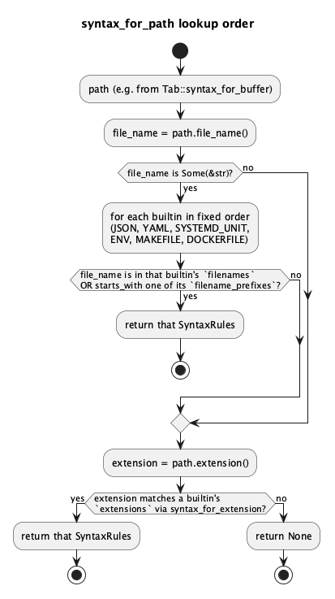

# Syntax Highlighting: env files, Makefiles, Dockerfiles v1

Extends `docs/features/syntax-highlighting.md` (the base tokenizer/
rendering pipeline is unchanged) with three more built-in `SyntaxRules`:
`.env` files, Makefiles, and Dockerfiles.

## 1. Purpose

The base feature's language lookup, `syntax_for_extension`, keys purely on
a path's file extension. That's a problem for all three formats this doc
adds: `.env`, `Makefile`, and `Dockerfile` are conventionally bare or
dotfile names with **no extension** at all. Rust's `Path::extension()`
returns `None` for a dotfile with no second `.` (`.env`) and for any
extensionless bare filename (`Makefile`, `Dockerfile`) — so
`syntax_for_extension` can never match any of them, no matter what rules
are registered.

This doc's core addition is therefore not just three new `SyntaxRules`
values (a straightforward, additive follow of the base doc's own stated
extensibility story) but a new lookup dimension: filename-based matching,
checked before falling back to the existing extension-based match. The
tokenizer engine itself (`tokenize`, `TokenKind`, `Token`, the fixed
8-step rule order) is completely unchanged — this is purely new rule data
plus a smarter lookup entry point.

**Scope**: `.env` (plus `.env.local`/`.env.production`/etc. and
`*.env`-suffixed files), `Makefile`/`makefile`/`GNUmakefile` (plus
`*.mk`), and `Dockerfile`/`dockerfile` (plus `Dockerfile.dev`-style
variants and `*.dockerfile`). Still not a general-purpose parser for any
of these — Makefile recipe lines and Dockerfile instruction arguments are
tokenized with the same generic rule set as everything else, not
format-aware shell/arg parsing.

## 2. Interface / API

### 2.1 `ide-core` (`crates/core/src/syntax.rs`)

`SyntaxRules` gains two new fields (both empty for the three existing v1
languages — an additive, non-breaking change to every existing
`SyntaxRules` value):

```rust
pub struct SyntaxRules {
    // ...existing fields unchanged...

    /// Exact bare-filename matches (the full `file_name()`, not an
    /// extension), checked case-sensitively against a short enumerated
    /// list of known spellings -- e.g. `["Makefile", "makefile",
    /// "GNUmakefile"]`. Deliberately exact-match rather than
    /// case-normalized: the realistic spelling variants are few and
    /// known in advance, so enumerating them is simpler and less
    /// surprising than a lowercasing pass (which risks matching
    /// filenames nobody intended to match). Empty for JSON/YAML/
    /// SYSTEMD_UNIT (extension-only languages).
    pub filenames: &'static [&'static str],
    /// Prefix matches against a bare filename, for suffix-variant
    /// conventions like `Dockerfile.dev`/`Dockerfile.prod` or
    /// `.env.local`/`.env.production`. Same case-sensitivity rationale
    /// as `filenames`. Empty for JSON/YAML/SYSTEMD_UNIT.
    pub filename_prefixes: &'static [&'static str],
}
```

New built-in rule sets, same shape/derivation as the base doc's three:

```rust
pub const ENV: SyntaxRules;
pub const MAKEFILE: SyntaxRules;
pub const DOCKERFILE: SyntaxRules;
```

New primary lookup entry point:

```rust
/// Looks up a built-in `SyntaxRules` for `path`: filename match (exact
/// or prefix), then (falling back) extension match via
/// `syntax_for_extension` -- see §3 for the precise order and why. The
/// new primary entry point callers (`ide-ui`) should use; `None` if
/// nothing matches.
pub fn syntax_for_path(path: &std::path::Path) -> Option<&'static SyntaxRules>;
```

`syntax_for_extension` is unchanged in signature and behavior (still
public, still useful standalone, still what `syntax_for_path` falls back
to) — not deprecated, just no longer the primary entry point `ide-ui`
calls directly.

### 2.2 `ide-ui`

`Tab::syntax_for_buffer` (private helper added by the base feature)
simplifies from its current extension-extraction chain to a single call:

```rust
// before (base feature):
buffer.path()
    .and_then(|p| p.extension())
    .and_then(|ext| ext.to_str())
    .and_then(syntax_for_extension)

// after:
buffer.path().and_then(ide_core::syntax_for_path)
```

No other `ide-ui` change: `Tab`'s fields, `reconcile`'s recompute cadence,
and `tab_layout_job`'s boundary-merge are all untouched — this doc only
changes *which* `SyntaxRules` a tab resolves to, not anything about what
happens once one is resolved.

## 3. Behaviour

### `syntax_for_path`'s lookup order

1. Take `path.file_name()`, converted to `&str` (`None` — e.g. a path
   ending in `..`, or non-UTF-8 — skips step 2 entirely and falls through
   to the extension lookup in step 3).
2. For each built-in `SyntaxRules`, in the fixed builtin-list order
   (`JSON, YAML, SYSTEMD_UNIT, ENV, MAKEFILE, DOCKERFILE`), check whether
   the full file name is either an exact match against that builtin's
   `filenames` or a `starts_with` match against one of its
   `filename_prefixes` — whichever comes first for a single builtin. The
   first builtin satisfying either check wins. This is a single pass over
   the fixed builtin list, not two full passes across all builtins (an
   exact-match-anywhere-beats-any-prefix-match-anywhere guarantee isn't
   needed and isn't what a natural implementation gives you); builtin-list
   order is the tie-breaker, exactly as `syntax_for_extension` already
   documents "first match wins" for its own lookup. In practice this never
   matters here — the three new languages' `filenames`/`filename_prefixes`
   sets are disjoint from each other and from every other builtin's.
3. If no filename match at all, fall back to `path.extension()` →
   `syntax_for_extension` (the base feature's existing, unchanged
   extension lookup, now second in this dimension rather than the only
   one).
4. `None` if nothing matched at any step.

Filename matching intentionally runs *before* extension matching, not
after: a file like `Dockerfile.dev` has no meaningful "extension" in the
Rust `Path` sense that should independently resolve to some other
language (`.dev` isn't a registered extension for anything), so ordering
doesn't actually create a conflict in v1 — but the doc states the order
explicitly since a future filename-conflicting-with-extension case (e.g.
a hypothetical `*.env` file that a user also wants treated as something
else) should resolve predictably to filename-wins, rather than depending
on which dimension a future implementer happened to check first.

One edge case worth stating outright, since it looks like a collision and
isn't: a file named exactly `Dockerfile` matches `DOCKERFILE`'s
`filenames` entry `"Dockerfile"` and does **not** also match its
`filename_prefixes` entry `"Dockerfile."` — `"Dockerfile".starts_with(
"Dockerfile.")` is `false`, since the bare name has no trailing `.`. Both
checks resolve to the same builtin regardless, so even a different check
order couldn't produce a wrong answer here.

### New `SyntaxRules` definitions

**`ENV`** (`.env` / `.env.*` / `*.env`): same INI-flavored `Key=Value` +
`#` comment shape as `SYSTEMD_UNIT`, minus `[Section]` headers.
`filenames: [".env"]`, `filename_prefixes: [".env."]`,
`extensions: ["env"]`, `line_comment_prefixes: ["#"]`,
`string_quotes: ['"', '\'']` (many `.env` values are quoted),
`keywords: []`, `punctuation: ['=']`, `key_separator: Some('=')`.

**`MAKEFILE`** (`Makefile`/`makefile`/`GNUmakefile` / `*.mk`):
`filenames: ["Makefile", "makefile", "GNUmakefile"]`,
`filename_prefixes: []`, `extensions: ["mk"]`,
`line_comment_prefixes: ["#"]`, `string_quotes: []` (see limitation
below), `keywords:` the common directives
(`ifeq`/`ifneq`/`ifdef`/`ifndef`/`else`/`endif`/`include`/`export`/
`unexport`/`override`/`define`/`endef`), `punctuation: [':', '=']`,
`key_separator: Some(':')` — `key_separator` is a single `Option<char>`,
so exactly one of `':'` (target lines) and `'='` (variable assignments)
can be styled as a `Key`, and both are common in real Makefiles. `':'` is
picked because every Makefile has at least one target line (that's what a
Makefile is *for*), while plenty of Makefiles have no top-level variable
assignments at all — so `':'` is the choice that highlights something in
strictly more files. It's a pick between two reasonable options, not a
claim that assignments are rare; `VAR = value`/`VAR := value` lines are
consequently handled asymmetrically (see limitations).

**`DOCKERFILE`** (`Dockerfile`/`dockerfile` / `Dockerfile.*`/
`dockerfile.*` / `*.dockerfile`): `filenames: ["Dockerfile",
"dockerfile"]`, `filename_prefixes: ["Dockerfile.", "dockerfile."]`,
`extensions: ["dockerfile"]`, `line_comment_prefixes: ["#"]`,
`string_quotes: ['"', '\'']`, `keywords:` the instruction set (`FROM`,
`RUN`, `CMD`, `LABEL`, `MAINTAINER`, `EXPOSE`, `ENV`, `ADD`, `COPY`,
`ENTRYPOINT`, `VOLUME`, `USER`, `WORKDIR`, `ARG`, `ONBUILD`,
`STOPSIGNAL`, `HEALTHCHECK`, `SHELL`) — case-sensitive exact match per
`tokenize`'s existing keyword rule, so only the conventional uppercase
spelling highlights (documented limitation below); `punctuation: []`
(nothing at the instruction level is worth boundary-marking — and per
the base doc's round-1 finding about YAML's colon, an empty vs.
populated `punctuation` list is only ever visible when it changes
whether something is grouped as one token, never as a color difference,
since `Punctuation` is always the default color); `key_separator: None`
(a Dockerfile line isn't `key<sep>value`-shaped at the instruction level;
`ENV KEY=VALUE` is an argument to the `ENV` keyword, not a line-start key
— out of scope for this generic rule set, same category of simplification
as the base doc's "not a general-purpose parser" stance).

### Known v1 limitations (documented, not fixed)

- **Makefile recipe lines**: a tab-indented recipe line is not
  distinguished from a target/variable line before the Key rule runs — if
  a recipe line's shell command happens to contain a `:` before any
  newline/quote/comment-prefix, that line gets a spurious `Key` token
  (e.g. `echo "note: done"` as a recipe line). Same class of accepted
  limitation as the base doc's YAML flow-mapping case: cosmetic-only,
  rare in practice, not worth a third rule dimension (recipe-line
  detection would need tracking whether the *previous* line was a target
  line, which `tokenize`'s stateless-between-lines design doesn't do).
- **Makefile `VAR = value` / `VAR := value` asymmetry**: only `:=`-style
  assignments get `Key` styling for the variable name (the `:` is what
  `key_separator` matches); a bare `VAR = value` line does not. Accepted
  rather than modeling two separator characters (the `key_separator`
  field is intentionally a single `Option<char>`, and doubling it for one
  language's asymmetric convention isn't worth the complexity it would
  add to every other language's rule set).
- **Dockerfile case sensitivity**: `tokenize`'s keyword rule is exact
  case-sensitive match (base doc §3 step 6, unchanged) — a lowercase
  `from ubuntu:22.04` instruction (valid Docker syntax) does not
  highlight as a keyword. Consistent with the existing tokenizer design,
  not a new limitation this doc introduces.
- **Dockerfile numeric-looking tags**: the generic Number rule doesn't
  know `22.04` in `FROM ubuntu:22.04` is a version tag rather than a
  decimal — it tokenizes as one `Number` token regardless. Harmless (same
  color either way isn't claimed to be "correct" parsing, just
  classification), included here as a documented quirk rather than a
  limitation requiring a fix.

## 4. Constraints & invariants

- All constraints from the base doc (`tokenize`'s O(n) bound,
  `MAX_HIGHLIGHTED_FILE_BYTES` cap, sortedness/non-overlap, no I/O, no new
  dependency) apply unchanged — this doc adds no new code path through
  `tokenize` itself, only new `SyntaxRules` data and a new lookup
  function that runs once per tab creation/Save-As, not per-token.
- `syntax_for_path` is `O(number of built-in languages)` — a fixed,
  small constant (six after this doc) — not a function of path length or
  file content; no new performance concern.
- Adding `filenames`/`filename_prefixes` to `SyntaxRules` is
  backward-compatible with the base doc's `JSON`/`YAML`/`SYSTEMD_UNIT`
  definitions (both fields simply set to `&[]` for those three) —
  confirms the base doc's §1 extensibility claim in practice: this is
  exactly the "new field, update the fixed set of existing definitions"
  shape it described, not a redesign.

## 5. Examples

**`.env`:**

```rust
let rules = ide_core::syntax_for_path(std::path::Path::new(".env")).unwrap();
let tokens = ide_core::tokenize("FOO=bar\n# comment\n", rules);
// tokens: Key("FOO"), Punctuation('='), Comment("# comment")
// -- "bar" matches no rule (not a keyword, ENV's keyword list is empty)
// so it's an implicit plain gap, same convention as every other example
// in the base doc.
```

**Makefile target + recipe line:**

```rust
let rules = ide_core::syntax_for_path(std::path::Path::new("Makefile")).unwrap();
let tokens = ide_core::tokenize("build: main.o\n\tgcc -o build main.o\n", rules);
// tokens: Key("build"), Punctuation(':')
// -- "main.o" (no rule matches '.', "main"/"o" aren't keywords) and the
// entire tab-indented recipe line are implicit plain gaps: the recipe
// line's Key-rule attempt fails because it contains no ':' before its
// own trailing newline, so it correctly falls through without a spurious
// Key token (see §3's limitation note for the case where a recipe line
// *does* contain a ':').
```

**Dockerfile instructions:**

```rust
let rules = ide_core::syntax_for_path(std::path::Path::new("Dockerfile")).unwrap();
let tokens = ide_core::tokenize("FROM ubuntu:22.04\nRUN echo hi\n", rules);
// tokens: Keyword("FROM"), Number("22.04"), Keyword("RUN")
// -- "ubuntu" and "echo"/"hi" match no rule (not keywords) so they're
// implicit plain gaps; the ':' between "ubuntu" and "22.04" also matches
// no rule (Dockerfile's punctuation list is empty) so it's a plain gap
// too -- seen here as three tokens with unstyled text in between, not
// five with an extra Punctuation(':').
```

**Filename-vs-extension fallback:**

```rust
assert!(ide_core::syntax_for_path(std::path::Path::new("Dockerfile.dev")).is_some()); // filename_prefixes match
assert!(ide_core::syntax_for_path(std::path::Path::new("app.env")).is_some());        // extensions fallback match
assert!(ide_core::syntax_for_path(std::path::Path::new("Dockerfile")).is_some());     // filenames exact match, NOT a "Dockerfile." prefix match
assert!(ide_core::syntax_for_path(std::path::Path::new("README.md")).is_none());      // nothing matches
// `is_none()` rather than `assert_eq!(.., None)`: `SyntaxRules` derives
// only `Debug`, not `PartialEq`, so `assert_eq!` wouldn't compile -- same
// shape the base feature's `syntax_for_extension` tests already use.
```

## 6. Dependencies & integration points

- `ide-core`: `syntax.rs` gains two `SyntaxRules` fields (both existing
  const definitions updated to `&[]`), three new consts (`ENV`,
  `MAKEFILE`, `DOCKERFILE`), and one new function (`syntax_for_path`).
  `syntax_for_extension`'s own implementation is refactored to share the
  same built-in-rules list `syntax_for_path` iterates, rather than
  duplicating `[&JSON, &YAML, &SYSTEMD_UNIT]` as a second, now-stale
  literal — no behavior change to `syntax_for_extension` itself. No new
  dependency.
- `ide-ui`: `Tab::syntax_for_buffer`'s body simplifies to a single
  `ide_core::syntax_for_path` call (§2.2) — its one call site
  (`Tab::from_buffer`) needs no change beyond that, since the helper's
  signature is unchanged.
- Does not touch `crates/lsp` or `ide_core::detect_language`/
  `LanguageConfig` — same separation-of-concerns reasoning as the base
  doc's §1 (this is still a per-file, non-configurable, highlighting-only
  concern). `rust-lsp-dev` is not a required role.

## 7. Diagrams

**`syntax_for_path` lookup order:**



## Revision notes

Round 1 review findings, all addressed in place:

1. **§5's fallback example wouldn't compile.** `assert_eq!(syntax_for_path(..),
   None)` needs `SyntaxRules: PartialEq`, which it doesn't derive (only
   `Debug`) — the same mistake already caught and fixed for
   `syntax_for_extension` during the base feature's implementation.
   Rewritten as `assert!(..).is_none())`, with a comment saying why, and a
   `Dockerfile` exact-match assertion added alongside it.
2. **§3's lookup order over-specified a guarantee the design doesn't need.**
   It described two full passes across all builtins (exact-match-anywhere
   beating prefix-match-anywhere), which no natural implementation
   produces and which nothing in v1 requires. Rewritten as a single pass
   over the fixed builtin list, checking each builtin's `filenames` and
   `filename_prefixes` together, with builtin-list order as the
   (currently moot) tie-breaker — matching `syntax_for_extension`'s
   existing "first match wins" framing. Steps renumbered, the
   `file_name() == None` path corrected to skip to the extension step, and
   the `"Dockerfile"` vs `"Dockerfile."` non-collision stated explicitly
   rather than left for a reader to work out. The lookup diagram was
   regenerated to match.
3. **Makefile `key_separator: ':'` rested on an unsupported claim.** The
   original justification asserted target lines are "more common" than
   variable assignments, which isn't true of real Makefiles. Rewritten
   around what actually holds — every Makefile has at least one target
   line, not every Makefile has top-level assignments — and framed
   honestly as a pick between two reasonable options forced by
   `key_separator` being a single `Option<char>`, not a claim that
   assignments are rare. The design choice itself is unchanged; only its
   stated reasoning is.
