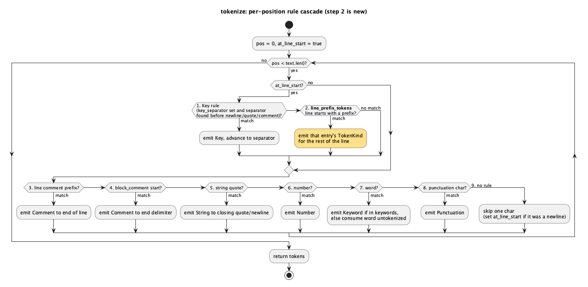

# Syntax Highlighting: Rust, TOML, Shell, Python, Go, Markdown, XML/HTML v1

Extends `docs/features/syntax-highlighting.md` (the base tokenizer) and
`docs/features/syntax-highlighting-env-make-docker.md` (filename-based
lookup) with seven more built-in `SyntaxRules`, plus one new tokenizer
mechanism that Markdown needs and the existing model can't express.

## 1. Purpose

The IDE currently highlights six data/config formats and none of the
languages anyone actually writes in it — including the language it is
itself written in. This doc adds:

| Language | Resolves via | New mechanism needed |
|---|---|---|
| Rust | `.rs` | `block_comment` (first real user) |
| TOML | `.toml`, `Cargo.lock` | none |
| Shell | `.sh`/`.bash`/`.zsh`/`.ksh`, `.bashrc`/`.zshrc`/`.profile`/… | none |
| Python | `.py`, `.pyi` | none |
| Go | `.go` | `block_comment` |
| Markdown | `.md`, `.markdown` | **`line_prefix_tokens`** (new field) |
| XML/HTML | `.xml`, `.html`, `.htm`, `.xhtml`, `.svg` | `block_comment` |

Six of the seven are pure data — new `SyntaxRules` values over machinery
that already exists, exactly the extensibility story the base doc §1
promised. Two things are genuinely new:

1. **`block_comment` gets its first user.** The field has existed since
   the base feature and `try_block_comment` has been implemented and
   tested since then, but no language set it to anything but `None`.
   Rust, Go, and XML/HTML all need it. No code change — the branch is
   already in `tokenize`'s cascade.
2. **`line_prefix_tokens` is a new field and a new step in the cascade.**
   Markdown's structure is line-prefix-based (`# Heading`), which nothing
   in the current model expresses: `line_comment_prefixes` would colour a
   heading comment-grey, and there is no other rule that consumes "the
   rest of this line" as a chosen kind. This is the "a new field, one more
   branch in `tokenize`" shape the base doc §1 explicitly anticipated.

**Scope**: still not general-purpose parsers. No nesting, no cross-line
state, no semantic awareness. Every limitation this produces per language
is enumerated in §3 rather than papered over.

## 2. Interface / API

### 2.1 `ide-core` (`crates/core/src/syntax.rs`)

`SyntaxRules` gains one field (empty for all nine existing languages — an
additive change of the same shape as the previous doc's two fields):

```rust
pub struct SyntaxRules {
    // ...existing fields unchanged...

    /// Line-start prefixes that claim the whole rest of the line as a
    /// single token of the given kind -- e.g. `[("#", TokenKind::Keyword)]`
    /// for Markdown headings. Checked only at a line's first
    /// non-whitespace character, like the Key rule, and matched by
    /// `starts_with` so `##`/`###` are covered by the `"#"` entry. Distinct
    /// from `line_comment_prefixes`, which hardcodes `TokenKind::Comment`;
    /// this exists because a heading is structurally a comment-shaped rule
    /// with a different colour, and there was no way to say that. Empty for
    /// every language except Markdown.
    pub line_prefix_tokens: &'static [(&'static str, TokenKind)],
}
```

Seven new built-in rule sets:

```rust
pub const RUST: SyntaxRules;
pub const TOML: SyntaxRules;
pub const SHELL: SyntaxRules;
pub const PYTHON: SyntaxRules;
pub const GO: SyntaxRules;
pub const MARKDOWN: SyntaxRules;
pub const XML: SyntaxRules;
```

All seven are appended to the existing `BUILTINS` list, which both
`syntax_for_path` and `syntax_for_extension` already iterate — no change
to either function's body or signature.

`TokenKind`, `Token`, `tokenize`'s signature, `MAX_HIGHLIGHTED_FILE_BYTES`,
`syntax_for_path`, and `syntax_for_extension` are all unchanged. **No new
`TokenKind` variant** — see §3's "Why headings reuse `Keyword`".

### 2.2 `ide-ui`

**No production change.** `Tab::syntax_for_buffer` already calls
`ide_core::syntax_for_path`, which picks up new languages automatically
via `BUILTINS`; `tab_layout_job`'s colour table is keyed on `TokenKind`,
and this doc adds no variant.

One **test** change is required, though, and this doc originally missed
it: `ide-ui`'s `from_buffer_with_unrecognized_extension_has_no_syntax_or_tokens`
used a `main.rs` fixture, encoding "`.rs` resolves to nothing" — an
expectation this feature deliberately invalidates. Any test in any crate
that asserts a *newly supported* extension resolves to no language must be
repointed at one that's still unclaimed (`png`/`bin`). `ide-core` has two
of these; `ide-ui` has one. `rust-ui-dev` is therefore needed for a
test-only pass, not skippable as first stated.

## 3. Behaviour

### `tokenize`'s rule order (one step added)

The base doc's fixed cascade becomes nine steps. The new step is #2:

1. **Key** — line start only, if `key_separator` is set.
2. **Line-prefix token** *(new)* — line start only. If the text at the
   line's first non-whitespace character `starts_with` one of
   `line_prefix_tokens`' prefixes, emit one token of that entry's kind
   spanning from there to the next `\n` (or end of text), and advance past
   it. First matching entry wins. Runs after Key so a language setting
   both keeps the base doc's established precedence; no v1 language sets
   both, so the order is currently unobservable and stated only to pin it
   down.
3. Line comment
4. Block comment
5. String literal
6. Number
7. Keyword
8. Punctuation
9. Skip one character

Steps 3–9 are byte-for-byte the base doc's behaviour. Step 2 is
structurally identical to step 3 (scan to end of line, emit one token)
differing only in that the kind comes from the rule rather than being
hardcoded to `Comment`, so it preserves the O(n) invariant for the same
reason: it consumes forward only, never re-scanning.

### Why headings reuse `Keyword` rather than a new `TokenKind`

A `TokenKind::Heading` variant would be the "purer" model, but it forces a
cross-crate change (`render.rs`'s colour table must map every variant) for
a purely cosmetic gain, and it puts a Markdown-specific concept into an
enum otherwise made of universal token classes. Reusing `Keyword` keeps
this feature `ide-core`-only and reads correctly: a heading marker is the
structural keyword of a Markdown line. The `line_prefix_tokens` field
carries a `TokenKind` precisely so a future doc can point a prefix at a
new variant without redesigning anything.

### New `SyntaxRules` definitions

Every field not listed for a language below is empty/`None`
(`filenames: []`, `filename_prefixes: []`, `block_comment: None`,
`line_prefix_tokens: []`, `key_separator: None`) — stated once here so the
per-language lists stay readable, and enumerated explicitly wherever a
language sets one.

**`RUST`** — `extensions: ["rs"]`, `filenames: []`,
`filename_prefixes: []`, `line_comment_prefixes: ["//"]`,
`block_comment: Some(("/*", "*/"))`, `string_quotes: ['"']`,
`line_prefix_tokens: []`,
`punctuation: ['{','}','(',')','[',']',';',',',':','&','=','<','>']`,
`key_separator: None`, `keywords:` the reserved-word set (`as`, `async`,
`await`, `break`, `const`, `continue`, `crate`, `dyn`, `else`, `enum`,
`extern`, `false`, `fn`, `for`, `if`, `impl`, `in`, `let`, `loop`,
`match`, `mod`, `move`, `mut`, `pub`, `ref`, `return`, `self`, `Self`,
`static`, `struct`, `super`, `trait`, `true`, `type`, `unsafe`, `use`,
`where`, `while`).

`'` is deliberately **not** a string quote for Rust. Rust uses `'` for
both char literals (`'a'`) and lifetimes (`&'a str`), and the tokenizer
can't tell them apart without lookahead it doesn't do — including `'`
would make every lifetime open an unterminated string that swallows the
rest of the line. Excluding it costs char-literal highlighting (a rare,
short token) and buys correct behaviour on lifetimes (common, and the
failure mode would be loud). Note the contrast with `GO` below, which
*does* include `'`: Go's single quotes are unambiguously rune literals.

**`TOML`** — `extensions: ["toml"]`, `filenames: ["Cargo.lock"]` (TOML
content, no extension of its own that anything else claims),
`line_comment_prefixes: ["#"]`, `string_quotes: ['"', '\'']`,
`keywords: ["true", "false"]`, `punctuation: ['[',']','=',',','.']`,
`key_separator: Some('=')` — same `Key=Value` shape `SYSTEMD_UNIT` and
`ENV` already use, and `[section]` header lines fall through the Key rule
correctly because they contain no `=` (verified in §5).

**`SHELL`** — `extensions: ["sh","bash","zsh","ksh"]`,
`filenames: [".bashrc",".zshrc",".bash_profile",".zprofile",".profile",".bash_aliases"]`
(a real payoff of the previous doc's filename dimension — every one of
these is extensionless), `line_comment_prefixes: ["#"]`,
`string_quotes: ['"', '\'']`, `punctuation: ['(',')','{','}',';','|','&','<','>','=']`,
`key_separator: None`, `keywords:` shell reserved words plus the
assignment-adjacent builtins (`if`, `then`, `else`, `elif`, `fi`, `for`,
`while`, `until`, `do`, `done`, `case`, `esac`, `in`, `function`,
`select`, `return`, `break`, `continue`, `local`, `export`, `readonly`,
`declare`, `source`, `exit`, `shift`, `trap`, `set`, `unset`).

`key_separator` is `None` despite `VAR=value` being a real shell shape:
the Key rule scans the whole line for its separator, so a line like
`for i in a=b; do` would emit a spurious `Key` covering `for i in a`.
Shell lines contain `=` in too many non-assignment positions for the
line-start heuristic to hold, unlike `.env`/TOML where a line *is* an
assignment. Assignments therefore highlight only their quoted values.

**`PYTHON`** — `extensions: ["py","pyi"]`, `filenames: []`,
`filename_prefixes: []`, `block_comment: None`,
`line_comment_prefixes: ["#"]`, `line_prefix_tokens: []`,
`string_quotes: ['"', '\'']`, `punctuation: ['(',')','[',']','{','}',':',',','=']`,
`key_separator: None` (a `def f():` line would otherwise emit a `Key` for
`def f()`, which is wrong in exactly the way the Makefile recipe-line case
is), `keywords:` the reserved-word set (`and`, `as`, `assert`, `async`,
`await`, `break`, `class`, `continue`, `def`, `del`, `elif`, `else`,
`except`, `False`, `finally`, `for`, `from`, `global`, `if`, `import`,
`in`, `is`, `lambda`, `None`, `nonlocal`, `not`, `or`, `pass`, `raise`,
`return`, `True`, `try`, `while`, `with`, `yield`).

**`GO`** — `extensions: ["go"]`, `filenames: []`, `filename_prefixes: []`,
`line_prefix_tokens: []`, `line_comment_prefixes: ["//"]`,
`block_comment: Some(("/*", "*/"))`, `string_quotes: ['"', '`', '\'']`
(backtick raw strings and single-quoted runes both work with the existing
same-open-and-close string rule), `punctuation: ['{','}','(',')','[',']',';',',',':','=','<','>','&']`,
`key_separator: None`, `keywords:` the 25 reserved words plus `nil`,
`true`, `false` (`break`, `case`, `chan`, `const`, `continue`, `default`,
`defer`, `else`, `fallthrough`, `for`, `func`, `go`, `goto`, `if`,
`import`, `interface`, `map`, `package`, `range`, `return`, `select`,
`struct`, `switch`, `type`, `var`).

**`MARKDOWN`** — `extensions: ["md","markdown"]`, `filenames: []`,
`filename_prefixes: []`, `block_comment: None`,
`line_prefix_tokens: [("#", TokenKind::Keyword)]`,
`string_quotes: ['`']` (inline code spans read as strings — the same
open-equals-close rule, and code spans are the one Markdown construct
that genuinely is a delimited literal), `line_comment_prefixes: []`,
`keywords: []`, `punctuation: []`, `key_separator: None`.

**`XML`** — `extensions: ["xml","html","htm","xhtml","svg"]`,
`filenames: []`, `filename_prefixes: []`, `line_prefix_tokens: []`,
`block_comment: Some(("<!--", "-->"))`, `string_quotes: ['"', '\'']`
(attribute values), `line_comment_prefixes: []`, `keywords: []`,
`punctuation: ['<','>','/','=']`, `key_separator: None`. Named `XML`
rather than `HTML` because the rule set is the XML-generic subset; HTML
files resolve to it via `extensions`.

### Known v1 limitations (documented, not fixed)

- **Rust char literals aren't highlighted** — deliberate, per the
  lifetime-ambiguity reasoning above. `'a'` tokenizes as plain text.
- **Rust nested block comments** — `/* outer /* inner */ still outer */`
  ends the `Comment` token at the *first* `*/`, since `try_block_comment`
  scans for the end delimiter without a nesting counter. Rust permits
  nesting; this is rare in practice and would need a counter in the
  block-comment scan. Same accept-and-document class as the base doc's
  YAML flow-mapping case.
- **Rust raw strings** — `r"..."` and `r#"..."#` highlight from the first
  `"` only; the `r`/`r#` prefix is plain and a `"` inside an `r#"…"#`
  literal ends the token early.
- **Python triple-quoted strings** — `"""doc"""` tokenizes as an empty
  string (`""`) followed by ordinary content, not one docstring token. The
  string rule has no concept of a multi-character delimiter. Output stays
  sorted and non-overlapping, so this is cosmetic, not corrupting.
- **Shell/Python/Go/Rust identifiers after keywords** — function and type
  names are plain text; only reserved words highlight. The tokenizer has
  no notion of declaration context.
- **Shell `$VAR` interpolation** — not distinguished, inside or outside
  strings. `"$HOME/bin"` is one `String` token.
- **Indented Markdown headings still highlight** — `tokenize` skips a
  line's leading whitespace *before* reaching the line-start rules, so
  `   # x` is treated as a heading. Real Markdown requires column 0, and
  four spaces of indent means a code block instead. Accepted rather than
  threading a "was there leading whitespace" flag through the line-start
  block for one language's edge case; the visible cost is an indented
  `#` line highlighting when it shouldn't.
- **Markdown emphasis, lists, links, fenced blocks** — not highlighted.
  Only `#`-prefixed headings and backtick code spans. A fenced block's
  opening ``` ``` ``` is seen by the string rule as an empty code span
  followed by a code span starting at the third backtick, which ends at
  the line's end — visually noisy on fenced blocks, and the honest v1
  boundary of a flat tokenizer against a block-structured format.
- **XML/HTML tag names aren't distinguished** — `<div>` highlights the
  `<`/`>` as punctuation and leaves `div` plain, because tag-name
  awareness needs the tokenizer to know it's just inside a `<`. Comments
  and attribute values do highlight, which is most of the visual value;
  a keyword list of HTML tag names was rejected as both incomplete for
  HTML and wrong for XML, where tag names are arbitrary.
- **Markdown/XML have no `Number` suppression** — a bare `2024` in prose
  or between tags highlights as a number. Harmless, same category as the
  previous doc's Dockerfile version-tag quirk.

## 4. Constraints & invariants

- Every base-doc invariant holds unchanged: `tokenize` is O(n) (step 2
  scans forward to the line end exactly once and never re-enters at a
  passed position), output stays sorted and non-overlapping, token ranges
  stay on UTF-8 character boundaries, `MAX_HIGHLIGHTED_FILE_BYTES` still
  short-circuits before any scanning, no I/O, no new dependency.
- `line_prefix_tokens` is additive and backward-compatible: all nine
  existing `SyntaxRules` values set it to `&[]` and behave identically.
- `BUILTINS` grows from 6 to 13 entries. `syntax_for_path` and
  `syntax_for_extension` stay O(number of languages) — a fixed small
  constant, unrelated to input size.
- Extension sets across all 13 languages must remain disjoint; the
  existing `builtin_extension_sets_are_disjoint` test enforces this
  mechanically and covers the new entries automatically.

## 5. Examples

**Rust** (`fn main() { let x = 42; } // done`):

```rust
let rules = ide_core::syntax_for_path(std::path::Path::new("src/main.rs")).unwrap();
let tokens = ide_core::tokenize("fn main() { let x = 42; } // done", rules);
// Keyword("fn") 0..2, Punctuation 7..8, 8..9, 10..11,
// Keyword("let") 12..15, Punctuation('=') 18..19, Number("42") 20..22,
// Punctuation(';') 22..23, Punctuation('}') 24..25,
// Comment("// done") 26..33
// -- "main"/"x" are plain gaps (not keywords).
```

**TOML** (`[package]\nname = "ide"\n`):

```rust
let rules = ide_core::syntax_for_path(std::path::Path::new("Cargo.toml")).unwrap();
let tokens = ide_core::tokenize("[package]\nname = \"ide\"\n", rules);
// Punctuation('[') 0..1, Punctuation(']') 8..9,
// Key("name") 10..14, Punctuation('=') 15..16, String("\"ide\"") 17..22
// -- the "[package]" line contains no '=', so the Key rule's forward scan
// hits '\n' and correctly fails, exactly as SYSTEMD_UNIT's "[Unit]" line
// does in the base doc's §5.
```

**Markdown** — a heading plus an inline code span, exercising the new
step 2 (see the literal in the snippet below):

```rust
let rules = ide_core::syntax_for_path(std::path::Path::new("README.md")).unwrap();
let tokens = ide_core::tokenize("# Title\n\nSome `code` here\n", rules);
// Keyword("# Title") 0..7, String("`code`") 14..20
// -- the heading token spans the whole line including the '#' marker and
// stops before the '\n'; "Some"/"here" are plain (Markdown has no
// keywords).
```

**Go** (raw string + block comment):

```rust
let rules = ide_core::syntax_for_path(std::path::Path::new("main.go")).unwrap();
let tokens = ide_core::tokenize("package main /* x */\nvar s = `raw`\n", rules);
// Keyword("package") 0..7, Comment("/* x */") 13..20,
// Keyword("var") 21..24, Punctuation('=') 27..28, String("`raw`") 29..34
```

**Python** (`def main():\n    return None\n`):

```rust
let rules = ide_core::syntax_for_path(std::path::Path::new("app.py")).unwrap();
let tokens = ide_core::tokenize("def main():\n    return None\n", rules);
// Keyword("def") 0..3, Punctuation('(') 8..9, Punctuation(')') 9..10,
// Punctuation(':') 10..11, Keyword("return") 16..22, Keyword("None") 23..27
```

**Shell** (extensionless `.bashrc` via the filename dimension):

```rust
let rules = ide_core::syntax_for_path(std::path::Path::new("/home/u/.bashrc")).unwrap();
assert_eq!(rules.name, "Shell");
let tokens = ide_core::tokenize("# rc\nexport PATH=\"/bin\"\n", rules);
// Comment("# rc") 0..4, Keyword("export") 5..11,
// Punctuation('=') 16..17, String("\"/bin\"") 17..23
```

**XML** (`<!-- c -->\n<a href="x">t</a>\n`):

```rust
let rules = ide_core::syntax_for_path(std::path::Path::new("index.html")).unwrap();
let tokens = ide_core::tokenize("<!-- c -->\n<a href=\"x\">t</a>\n", rules);
// Comment("<!-- c -->") 0..10, Punctuation('<') 11..12,
// Punctuation('=') 18..19, String("\"x\"") 19..22, Punctuation('>') 22..23,
// Punctuation('<') 24..25, Punctuation('/') 25..26, Punctuation('>') 27..28
// -- "a"/"href"/"t" are plain: tag and attribute names aren't
// distinguished (see §3's limitations).
```

## 6. Dependencies & integration points

- `ide-core`: `syntax.rs` gains one `SyntaxRules` field (all nine existing
  consts updated to `line_prefix_tokens: &[]`), seven new consts, seven
  new `BUILTINS` entries, and one new branch in `tokenize`'s cascade
  (step 2) with a `try_line_prefix` helper mirroring `try_line_comment`'s
  shape. `lib.rs` re-exports the seven new consts. No new dependency, no
  signature change to any existing public item.
- `ide-ui`: **no change** (§2.2). New languages reach the editor through
  the existing `syntax_for_path` call.
- `crates/lsp`: untouched. This remains a per-file highlighting concern
  with no relationship to `detect_language`/`LanguageConfig`'s per-project
  LSP selection — note in particular that adding `RUST` here does *not*
  interact with the existing rust-analyzer integration.
- Required roles: `rust-core-dev`, plus a test-only `rust-ui-dev` pass
  (see §2.2 — `ide-ui` has one test whose expectation this feature
  invalidates).

## 7. Diagrams

**`tokenize`'s extended rule cascade (new step highlighted):**



## Revision notes

Round 1 review findings, all addressed in place:

1. **XML example had a wrong byte range.** The closing `</a>`'s `>` sits
   at index 27, not 28 — `28..29` is the trailing newline, which produces
   no token. Corrected to `27..28`. Every other range in all seven
   examples hand-traced clean against the merged tokenizer.
2. **Five languages' field lists were incomplete.** `RUST`, `PYTHON`,
   `GO`, `MARKDOWN`, and `XML` omitted `filenames`/`filename_prefixes`
   (and in places `block_comment`/`line_prefix_tokens`), unlike the two
   predecessor docs which enumerated every field. Added a blanket
   "everything unlisted is empty/`None`" statement plus the explicit
   fields on each of the five.
3. **Step 2's whitespace interaction was unstated.** `tokenize` skips
   leading whitespace before the line-start rules, so an indented `# x`
   highlights as a heading even though real Markdown requires column 0.
   Added to the limitations list as accepted behaviour with its cost
   stated.
4. **The Markdown example's heading nested backticks inside a backtick
   span**, rendering broken. Re-worded to point at the literal in the
   snippet instead.

### Post-merge correction

Caught by the chain's CI phase, after both reviews had passed: §2.2
originally claimed `ide-ui` needed no change at all. That was true of
production code but wrong about tests — `cargo test --workspace` failed on
`from_buffer_with_unrecognized_extension_has_no_syntax_or_tokens`, which
asserted a `.rs` file resolves to no language. Neither doc review nor
either code review caught it, because each role verified only its own
crate (`-p ide-core` / `-p ide-ui`) and the doc had declared `rust-ui-dev`
unnecessary, so nothing ran the UI suite against the new core until the
workspace-wide CI step. §2.2 and §6 are corrected above. The general
lesson for the next language batch: adding a language is a *behavioural*
change to every crate that asserts on language resolution, not just an
additive one to `ide-core`.
