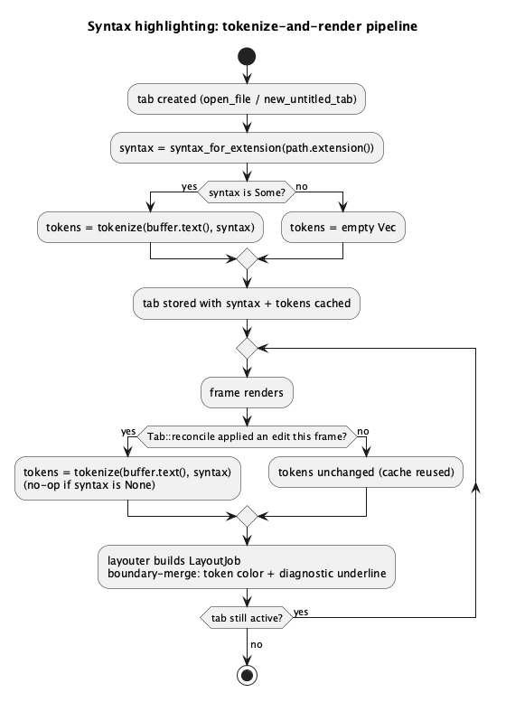

# Syntax Highlighting (JSON / YAML / systemd unit files) v1

## 1. Purpose

The editor currently has **zero** syntax highlighting for any file type —
`crates/ui/src/app/render.rs`'s `diagnostics_layout_job` only overlays LSP
diagnostic underlines on otherwise-plain monospace text. This feature adds
a small, hand-rolled, pure-Rust tokenizer and wires its output into that
same `LayoutJob`, giving colorized text (keywords, strings, numbers,
comments, punctuation, and — for the two key/value formats — the key
itself) for three file types: JSON, YAML, and systemd unit files
(`.service`/`.socket`/`.timer`/`.mount`/`.target`/... — all INI-shaped:
`[Section]` headers, `Key=Value` lines, `#`/`;` comments).

**Explicitly out of scope for v1**: Rust or any other full programming
language. This is a deliberate, separate future addition — the tokenizer
engine's data model is designed so that adding a programming language
later (block comments, escaped multi-line strings, larger keyword sets)
is a matter of supplying a richer `SyntaxRules` value and, if needed,
extending `tokenize`'s rule-matching order, not a redesign. It is *not* a
general-purpose parser (no AST, no bracket-matching, no indentation
tracking) — just enough token classification to color text.

**Why not an existing crate (e.g. `syntect`)**: this project's own stated
philosophy is a small, pure-Rust dependency set (`git2`, `egui`/`eframe`,
`tokio`, `serde`, `thiserror` are the only real ones so far). A
Sublime-Text-grammar-based crate would also need a hand-written grammar
for systemd unit files anyway (not a built-in grammar anywhere), so it
buys little for this scope while adding a large dependency and bundled
grammar/theme data. Deliberately choosing the smaller, hand-rolled path
now — see §4 for why this doesn't box in a fuller implementation later.

**Relationship to `ide_core::detect_language`/`LanguageConfig`**
(`global-search-and-languages.md`): that feature detects a *project's*
language to decide which LSP server to start (`Cargo.toml` marker, or a
user-added `custom_languages` extension→command mapping) — a per-project,
user-configurable, LSP-server concern. Syntax highlighting here is a
per-*file* concern: which token rules apply to *this open tab*, based
purely on its own file extension, using a fixed, non-configurable set of
three built-in language definitions. The two mechanisms are intentionally
kept separate — conflating them would mean, for example, that a user
without a Go LSP server configured (so no `active_language`) couldn't get
JSON syntax highlighting in an unrelated `.json` file they opened inside a
Go project, which makes no sense given highlighting has nothing to do with
what LSP server (if any) is running.

## 2. Interface / API

### 2.1 `ide-core` (new module `crates/core/src/syntax.rs`)

```rust
use std::ops::Range;

/// How a single token should be colored. Deliberately flat/small for v1's
/// three data-shaped languages — a future programming-language addition
/// may need more (e.g. a distinct `Type`/`Function` kind), which is an
/// additive change to this enum, not a redesign of anything around it.
#[derive(Debug, Clone, Copy, PartialEq, Eq)]
pub enum TokenKind {
    Keyword,
    String,
    Number,
    Comment,
    Punctuation,
    /// The key half of a `Key=Value` (systemd) or `key: value` (YAML)
    /// line — see `SyntaxRules::key_separator`. JSON has no bare keys
    /// (object keys are ordinary `String` tokens), so this never appears
    /// when tokenizing with `JSON`.
    Key,
}

#[derive(Debug, Clone, PartialEq, Eq)]
pub struct Token {
    /// Byte range within the tokenized text.
    pub range: Range<usize>,
    pub kind: TokenKind,
}

/// A language's token rules, applied in a fixed priority order by
/// `tokenize` (see its doc comment). Every field is data — no per-language
/// code — so a new language is a new `SyntaxRules` value, and a build-out
/// to a fuller programming-language tokenizer later means adding fields
/// here (e.g. multi-char operators, nested-string interpolation) plus the
/// matching branch in `tokenize`, not replacing the three existing
/// definitions.
pub struct SyntaxRules {
    pub name: &'static str,
    /// No leading `.` — matched against a path's extension the same way
    /// `ide_core::LanguageConfig::extension` is, but this list is fixed
    /// and not user-configurable (see §1).
    pub extensions: &'static [&'static str],
    /// A line starting with one of these (after leading whitespace, column
    /// position irrelevant otherwise) comments out the rest of the line.
    pub line_comment_prefixes: &'static [&'static str],
    /// `(start, end)` delimiter pair for a block comment. `None` for all
    /// three v1 languages (none of JSON/YAML/systemd-unit-files have
    /// block comments) — present now so a future C-like/Rust addition
    /// doesn't need a new field.
    pub block_comment: Option<(&'static str, &'static str)>,
    /// Characters that open/close a string literal (each is both the open
    /// and close delimiter for itself, e.g. `'"'`). Escaped via `\`
    /// inside the literal; unterminated at end-of-line is treated as
    /// ending there (none of these three languages have real multi-line
    /// quoted strings).
    pub string_quotes: &'static [char],
    /// Case-sensitive exact-word matches, e.g. `["true", "false", "null"]`.
    pub keywords: &'static [&'static str],
    /// Single characters tokenized individually as `Punctuation`, e.g.
    /// `['{', '}', '[', ']', ':', ',']` for JSON.
    pub punctuation: &'static [char],
    /// If set, a line (after skipping leading whitespace) is checked for
    /// this character: a continuous forward scan from the line's first
    /// non-whitespace character, stopping only at a newline, a
    /// `string_quotes` char, or a `line_comment_prefixes` match — if this
    /// separator is reached first, having consumed at least one character,
    /// the whole scanned (trimmed) span is `Key`; otherwise the line falls
    /// through to keyword/plain handling. See §3 step 1 for the exact
    /// scan. `'='` for systemd unit files, `':'` for YAML — note this
    /// scan does *not* stop at internal whitespace, so a multi-word YAML
    /// key like `foo bar: value` is still recognized as `Key("foo bar")`.
    /// `None` for JSON (object keys are quoted strings, already covered by
    /// `string_quotes`).
    pub key_separator: Option<char>,
}

pub const JSON: SyntaxRules;
pub const YAML: SyntaxRules;
pub const SYSTEMD_UNIT: SyntaxRules;

/// Looks up a built-in `SyntaxRules` by file extension (case-insensitive,
/// no leading `.`) — `None` if the extension isn't one of the three v1
/// languages. `"json"` → `JSON`; `"yaml"`/`"yml"` → `YAML`;
/// `"service"`/`"socket"`/`"timer"`/`"mount"`/`"target"`/`"slice"`/
/// `"path"`/`"swap"`/`"scope"` (the standard systemd unit-file suffixes)
/// → `SYSTEMD_UNIT`.
pub fn syntax_for_extension(extension: &str) -> Option<&'static SyntaxRules>;

/// Tokenizes `text` above which no highlighting is attempted — see §3/§4
/// for why (the tokenizer's per-frame cost has to stay bounded).
pub const MAX_HIGHLIGHTED_FILE_BYTES: usize = 2 * 1024 * 1024;

/// Tokenizes `text` per `rules` into a flat, non-overlapping,
/// position-ordered `Vec<Token>`. Untokenized regions (plain text between
/// tokens — most of any real file) are simply absent from the result, the
/// same "gaps mean default formatting" convention `app/render.rs`'s tab
/// layouter (see §2.2) already uses for its own diagnostic marks. Returns
/// an empty `Vec` immediately, without scanning anything,
/// if `text.len() > MAX_HIGHLIGHTED_FILE_BYTES`. See §3 for the exact
/// per-position rule-matching order.
pub fn tokenize(text: &str, rules: &SyntaxRules) -> Vec<Token>;
```

### 2.2 `ide-ui`

`Tab` (in `app.rs`) gains:

- `syntax: Option<&'static ide_core::SyntaxRules>` — set once in
  `Tab::from_buffer`/`Tab::untitled`, from `buffer.path()`'s extension via
  `ide_core::syntax_for_extension`, or `None` for an untitled buffer or an
  extension none of the three languages claim. Never recomputed after
  creation: a "Save As" that changes a tab's extension mid-session keeps
  that tab's original (or absent) highlighting for the rest of the
  session — a known, accepted v1 limitation (reopening the file, or
  restarting the app, picks up the new extension via a fresh `Tab`).
- `tokens: Vec<ide_core::Token>` — the cached tokenization of the tab's
  current `buffer.text()`, recomputed only when `Tab::reconcile` actually
  applies an edit (or once, right after `syntax` is set, for the tab's
  initial content) — **not** recomputed unconditionally every render
  frame, unlike `diagnostics_layout_job`'s own marks (see §4 for why the
  cost profile differs enough to need this).

`app/render.rs`'s existing `diagnostics_layout_job` is renamed
`tab_layout_job` and gains a `tokens: &[ide_core::Token]` parameter,
merging syntax-token coloring and diagnostic underlining into one
boundary-merge pass over the text (see §3) rather than two independent
non-overlapping mark lists.

## 3. Behaviour

### Tokenization (`ide_core::tokenize`)

A single left-to-right scan over `text`'s byte positions (always restarting
at the next char boundary after whatever was just consumed). At each
position, in this fixed order, the first matching rule wins and its match
is emitted as a `Token`; if nothing matches, the current char is skipped
without emitting anything (it becomes part of an implicit "plain" gap):

1. **Key** (only tried at the start of a line, i.e. position 0 or right
   after a `\n`, after skipping leading whitespace — and only if
   `rules.key_separator` is `Some`): scan forward over any non-quote
   characters, including whitespace (a multi-word key like `foo bar:
   value` is still one `Key` span — whitespace is not a stop condition
   here); if `rules.key_separator` is reached before a newline or one of
   `rules.string_quotes`/a comment-prefix match, and at
   least one character was consumed, the whole trimmed span is a `Key`
   token and the scan resumes at the separator itself, which then matches
   as ordinary `Punctuation` — exactly like systemd's `=` does after its
   own `Key` token (see §5's worked example). YAML's `SyntaxRules` *does*
   list `:` in `punctuation` for this same reason: there is no actual
   conflict in re-matching the separator as `Punctuation` right after it
   closed a `Key` span, and keeping YAML consistent with systemd's `=`
   handling avoids an unjustified special case (an earlier draft of this
   doc excluded `:` from YAML's `punctuation` on the mistaken belief that
   including it would "double-purpose" the character — it wouldn't, since
   `Punctuation`'s color is the same default text color either way, and
   the systemd example already proves this exact pattern works). If the separator isn't
   found before one of those stop conditions, nothing is emitted here and
   matching falls through to the remaining rules starting from the
   original position (so, e.g., a YAML list item `- value` at column 0
   doesn't get misread as a keyless "key line"). **Known v1 limitation**:
   the stop-condition set is newline/quote/comment-prefix only — it does
   *not* include `{`/`[`, so a YAML flow-style mapping that itself starts
   a line (e.g. a bare top-level document `{a: 1, b: 2}`) has its opening
   span misread as `Key("{a")` rather than left as plain/punctuation text.
   Cosmetic-only (wrong color on a rare input shape, not a crash or data
   issue) — accepted rather than adding a third stop-character class for
   it in v1.
2. **Line comment**: if `text[pos..]` starts with any of
   `rules.line_comment_prefixes`, the rest of the line (up to but
   excluding the `\n`, or to end-of-text) is one `Comment` token.
3. **Block comment**: if `rules.block_comment` is `Some((start, end))` and
   `text[pos..]` starts with `start`, scan forward for the next
   occurrence of `end` (or to end-of-text if unterminated) and emit the
   whole span, delimiters included, as one `Comment` token. (Unused by
   all three v1 `SyntaxRules` values; exists for a future language.)
4. **String literal**: if the current char is one of `rules.string_quotes`,
   scan forward handling `\`-escapes (an escaped char, including an
   escaped quote, is consumed without ending the literal) until the same
   quote char recurs or a `\n`/end-of-text is hit (whichever first — no
   real multi-line quoted strings in any v1 language), and emit the whole
   span, delimiters included, as one `String` token.
5. **Number**: if the current char is an ASCII digit, or `-`/`+`
   immediately followed by one, scan forward consuming digits plus at most
   one `.` and one `e`/`E` exponent marker (with an optional following
   `-`/`+`), and emit as one `Number` token.
6. **Keyword**: if the current char is alphabetic or `_`, scan forward
   consuming alphanumeric/`_` characters; if the resulting word exactly
   (case-sensitively) matches an entry in `rules.keywords`, emit it as one
   `Keyword` token. If it doesn't match, nothing is emitted (the word is
   plain text) — the scan still advances past the whole word, not just one
   char, so a non-keyword identifier isn't re-scanned character-by-character
   against the keyword list.
7. **Punctuation**: if the current char is in `rules.punctuation`, emit it
   as a one-character `Punctuation` token.
8. Otherwise: advance one char with nothing emitted.

The returned `Vec<Token>` is therefore always sorted by `range.start` and
non-overlapping — a direct consequence of the scan never re-visiting a
byte position it already consumed.

### Rendering (`app/render.rs::tab_layout_job`)

Composes two independent overlay dimensions onto the same text — token
**color** (from `tokens`, possibly none) and diagnostic **underline**
(from `diagnostics`, possibly none, exactly as `diagnostics_layout_job`
already computed it) — via a boundary-merge, written generally rather
than assuming the two never overlap. In practice they don't co-occur
*yet*: LSP diagnostics only ever apply to Rust tabs, and Rust tabs have no
`syntax` in v1. But a special-cased "only one of these is ever active at
a time" implementation would silently produce wrong output the day a
future language addition makes both apply to the same tab, so the merge
is correct for the general case now rather than deferring that cost to
whenever that happens:

1. Collect every token's `range` (color source) and every valid,
   in-bounds diagnostic range converted via `position_to_byte_offset`
   (underline source, identical to `diagnostics_layout_job`'s existing
   filter/convert step).
2. Build a sorted, deduplicated list of every boundary offset (0, `text.
   len()`, and every token/diagnostic range's start and end).
3. For each consecutive pair of boundaries `[b1, b2)`: look up which
   token (if any) covers `b1` for the color, and which diagnostic (if
   any) covers `b1` for the underline/severity, and append
   `text[b1..b2]` to the `LayoutJob` with an `egui::TextFormat` combining
   both — a token's color (or the default text color if none applies) and
   a diagnostic's underline stroke (or none), using the same
   Error=red/Warning=orange/Information·Hint=blue mapping
   `diagnostics_layout_job` already uses.

Token colors (fixed constants, not theme-derived — matching
`diagnostics_layout_job`'s own existing precedent of fixed
`egui::Color32` severity colors rather than pulling from
`ui.visuals()`):

| `TokenKind`   | Color                          |
|---------------|---------------------------------|
| `Keyword`     | `Color32::from_rgb(198, 120, 221)` (purple) |
| `String`      | `Color32::from_rgb(152, 195, 121)` (green)  |
| `Number`      | `Color32::from_rgb(209, 154, 102)` (orange) |
| `Comment`     | `Color32::from_rgb(128, 128, 128)` (gray)   |
| `Punctuation` | default text color (unchanged)              |
| `Key`         | `Color32::from_rgb(97, 175, 239)` (blue)    |

### Tab lifecycle

- `Tab::from_buffer`/`Tab::untitled` set `syntax` once via
  `buffer.path().and_then(|p| p.extension()).and_then(syntax_for_extension)`
  (`None` for `untitled` — no path yet — and for any extension none of
  the three languages claim), then compute `tokens` once immediately
  (`ide_core::tokenize(buffer.text(), rules)` if `syntax` is `Some`, else
  `Vec::new()`).
- `Tab::reconcile` (already the single place per-frame edits land, per
  `editor-shell.md`) recomputes `tokens` from the post-reconcile
  `buffer.text()` whenever it actually applied a diff (its existing
  `true`/`false` return value) — reusing that existing change-detection
  gate rather than adding a second one, and skipping the recompute
  entirely on a no-op frame the same way it already skips `DidChange`.
- Switching `active_tab` needs no extra work — each `Tab` already carries
  its own `tokens` cache, read directly by the layouter for whichever tab
  is currently rendered.

## 4. Constraints & invariants

- `tokenize` performs no I/O and holds no state across calls — pure
  function of `(text, rules)`. `ide-core` gains no new dependency.
- **Worst-case time complexity**: `tokenize` must be O(n) in `text.len()`
  — a direct consequence of §3's single forward pass that never revisits a
  byte position, with O(1)-amortized work per position (a fixed, small
  number of rule checks, each a bounded-length prefix/char comparison, not
  a rescan of the remaining text). This must hold even under adversarial
  input shapes the byte cap alone doesn't rule out — e.g. a multi-megabyte
  line consisting entirely of unterminated string-quote characters, or a
  long run of comment-prefix lookalikes — so an implementation must not,
  for instance, restart a `String`/`Comment` scan from the rule's own
  start position on failure, or use a rule check whose cost scales with
  the remaining unscanned text rather than a fixed lookahead.
- **Cost bound**: `tokenize` returns `Vec::new()` immediately for any text
  over `MAX_HIGHLIGHTED_FILE_BYTES` (2 MiB) without scanning it — smaller
  than `Buffer`'s general `MAX_OPEN_BYTES` (50 MiB) open-file cap, the
  same "narrower cap for a more expensive/more frequent per-byte
  operation" reasoning `search.rs`'s `MAX_SEARCHABLE_FILE_BYTES` (5 MiB,
  vs. the same 50 MiB `MAX_OPEN_BYTES`) already established — tokenizing
  costs more per byte than a substring search, and unlike a search
  (one-shot, user-triggered), this can re-run on every edit.
- **Recompute cadence**: `tokens` is cached on `Tab` and only recomputed
  when `Tab::reconcile` signals a real edit happened (or once at tab
  creation) — *not* recomputed inside the `TextEdit` layouter closure
  itself, which egui may invoke more than once per frame (for wrapping/
  measurement passes) regardless of whether anything changed. Recomputing
  there would multiply an already-bounded-but-non-trivial cost by however
  many times egui calls the layouter, for zero benefit on an idle tab —
  this is the concrete reason the recompute cadence differs from
  `diagnostics_layout_job`'s (whose own mark list is cheap — usually a
  handful of diagnostics — so recomputing it inside the layouter has
  never mattered).
- `tokenize`'s output is always sorted, non-overlapping, and every
  `Token.range` is a valid char-boundary-respecting slice of `text` (a
  direct consequence of the single-pass, never-revisit-a-position scan —
  no separate validation pass is needed by callers).
- Extending to a programming language later is additive to
  `SyntaxRules`/`tokenize`, not a redesign: `block_comment` already
  exists unused; new fields (e.g. multi-char operators, raw/multi-line
  strings) would follow the same "new field, one more branch in the fixed
  match order" shape §3 already establishes.

## 5. Examples

**Looking up and tokenizing a `.json` file:**

```rust
let rules = ide_core::syntax_for_extension("json").unwrap();
let tokens = ide_core::tokenize(r#"{"ok": true, "n": 42}"#, rules);
// tokens: Punctuation('{'), String("\"ok\""), Punctuation(':'),
//         Keyword("true"), Punctuation(','), String("\"n\""),
//         Punctuation(':'), Number("42"), Punctuation('}')
```

**A YAML mapping key, list item, and comment:**

```rust
let rules = ide_core::syntax_for_extension("yaml").unwrap();
let tokens = ide_core::tokenize("key: value\n- item\n# note\n", rules);
// tokens: Key("key"), Punctuation(':'), Comment("# note")
// -- "value" and the whole "- item" line match no rule and are implicit
// plain gaps, same as "/usr/bin/foo" in the systemd example below.
// "- item": the Key rule's forward scan from column 0 hits the line's
// '\n' before finding ':' anywhere on that line, so it fails and falls
// through -- the list item is never misread as a keyless "key line".
// "# note": the Key rule's scan stops immediately at the comment-prefix
// match (0 characters consumed), so it falls through to the Line comment
// rule instead of the (failed) Key rule.
```

**A systemd unit file's key line:**

```rust
let rules = ide_core::syntax_for_extension("service").unwrap();
let tokens = ide_core::tokenize("[Unit]\nExecStart=/usr/bin/foo # launch\n", rules);
// tokens: Punctuation('['), Punctuation(']'),
//         Key("ExecStart"), Punctuation('='), Comment("# launch")
// -- "/usr/bin/foo" itself matches no rule (no string_quotes match it,
// it's not a keyword/number/punctuation char run) so it's an implicit
// plain gap, same as most of any real file.
```

**An unrecognized extension:**

```rust
assert_eq!(ide_core::syntax_for_extension("rs"), None);
// render_tabs_and_editor's layouter falls back to today's plain-text
// coloring for such a tab -- diagnostics still render on top exactly as
// before this feature.
```

## 6. Dependencies & integration points

- `ide-core` gains one new module, `syntax.rs`, no new dependency.
- `ide-ui`'s `app/render.rs::diagnostics_layout_job` is renamed
  `tab_layout_job` and its signature grows a `tokens: &[ide_core::Token]`
  parameter — its one call site (`render_tabs_and_editor`'s layouter
  closure) is updated to pass `&self.tabs[idx].tokens`.
- `Tab` gains two fields (`syntax`, `tokens`); `Tab::reconcile`'s existing
  return value gates the new recompute, no new call sites needed beyond
  that.
- Deliberately does **not** touch `ide_core::detect_language`/
  `LanguageConfig`/`active_language`, or anything in `crates/lsp` — see
  §1 for why these are a separate concern. `rust-lsp-dev` is not a
  required role for this feature.

## 7. Diagrams

**Tokenize-and-render pipeline:**



## Revision notes

Round 1 `rev` findings addressed:

1. Added a YAML worked example to §5 (`key: value` / `- item` / `# note`)
   — previously only JSON and systemd had worked examples, leaving the
   Key rule's trickiest behavior (line-start fallthrough) with zero
   hand-verifiable coverage.
2. §3 step 1's rationale for excluding `:` from YAML's `punctuation` was
   factually wrong (re-matching a separator as `Punctuation` right after
   a `Key` token is exactly systemd's own working `=` behavior) —
   simplified by including `:` in YAML's `punctuation`, removing the
   unjustified special case, and corrected the prose.
3. While hand-building the new YAML example, found and fixed a real
   contradiction: §2.1's `key_separator` field doc described a
   "consume one word, then skip whitespace, then check separator"
   algorithm, while §3 step 1 described a continuous scan that only stops
   at newline/quote/comment-prefix (whitespace isn't a stop condition
   there). Rewrote §2.1's comment to match §3's actual (simpler) scan.
4. Documented, as an explicit known v1 limitation in §3 step 1, that a
   line-initial YAML flow-style mapping (e.g. a bare top-level `{a: 1}`)
   has its opening span mis-tokenized as `Key("{a")` — cosmetic-only,
   accepted rather than adding a third stop-character class.
5. Added an explicit O(n) worst-case time-complexity invariant to §4,
   with a concrete adversarial-input example, so the implementing role
   doesn't inadvertently write a per-position rule check whose cost
   scales with the remaining unscanned text.
6. Minor: fixed a stale reference to the pre-rename `diagnostics_layout_job`
   name in `tokenize`'s §2.1 doc comment.

**2026-08-28**: added a twentieth built-in, `GITIGNORE` (`.gitignore`,
matched by exact filename like `ENV`/`MAKEFILE`/`DOCKERFILE` — no
extension, since the file has none). `#` line comments; `!`/`*`/`?`
(negation and glob wildcards — the characters that actually change a
pattern's meaning) as `Operator`; everything else, including path
segments and `[...]` character classes, stays plain text. No brackets, no
key/value rule — gitignore patterns aren't structured that way. Fixes a
user-reported gap: `.gitignore` files previously matched no `SyntaxRules`
at all and rendered with no highlighting.
