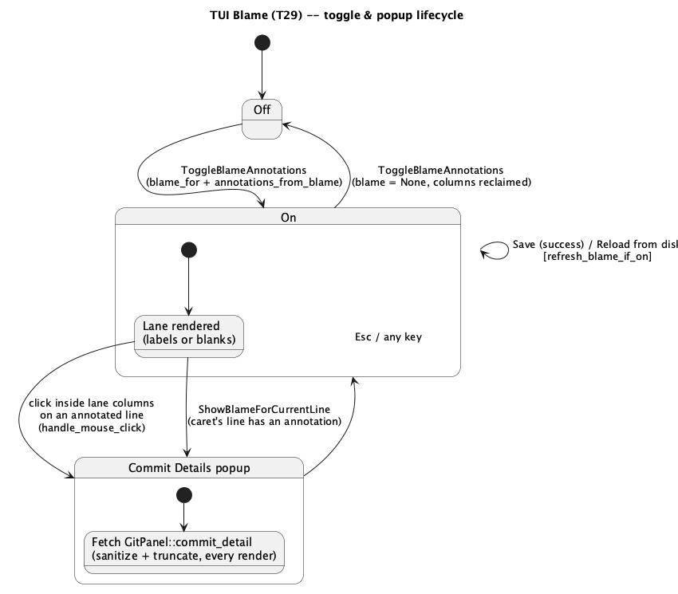

# TUI Blame (T29)

## 1. Purpose

`docs/features/tui-git-staging-branches-and-log-filters.md` (`T28`)
explicitly deferred blame — the other half of `git-branches-and-blame.md`
(**E2**) — to "a future `T29`", since it needs a new per-line editor
rendering decision the Git Panel overlay itself doesn't touch. This phase
is that `T29`: a per-tab toggleable annotation showing, for each line,
who last committed it and when, plus a "Commit Details" popup for the
full message. `ide-core`'s side of this (`GitRepo::blame_file`,
`GitRepo::commit_detail`, `BlameLine`, `CommitDetail`,
`MAX_BLAME_LINES`) is already merged and `hacker`-reviewed as part of
**E2** — this is a `crates/tui/**`-only diff, same shape as every prior
`T`-item.

### 1.1 Why this isn't a gutter port, architecturally

`ide-ui`'s blame lane is a fixed-width column reserved **left of the line
numbers** in `editor/geometry.rs`'s `Metrics`. `ide-tui` has no gutter
column at all — no line numbers, no marker lane — a fact already load-
bearing for two prior phases (`tui-debugger.md` §2.4: a breakpointed line
washes its whole background instead of getting a gutter dot;
`tui-code-folding.md`: no gutter/mouse, keyboard-only port). A background
wash (the debugger's own precedent) doesn't work for blame either, since
blame's whole point is showing *text* (author, relative time) per line,
not a boolean state.

The design this phase uses instead: a fixed-width **text prefix**
prepended to each visible line's rendered `ratatui::text::Line`, active
only for the tab that toggled blame on. This is a new rendering pattern
for this crate (append-at-end has a precedent — folding's trailing
`" ⋯"` collapsed-range marker — prepend-at-start does not), but it is the
closest terminal-native equivalent to a gutter lane: it reserves the same
kind of fixed horizontal budget the GUI's `Metrics.blame_lane_width`
does, just realized as leading columns of the same `Line` instead of a
separate `egui::Rect`. This is exactly what `git blame`'s own CLI output
looks like (`<hash> <author> <date>) <code>`), so it also reads as
idiomatic for a terminal tool, not just a workaround.

**Zero new `ide-core` API** — every type/method this phase calls
(`BlameLine`, `CommitDetail`, `GitRepo::blame_file`/`commit_detail`) is
already merged.

## 2. Interface

### 2.1 `crates/tui/src/blame_gutter.rs` (new — pure logic, no `ratatui`)

Ported **near-verbatim** from `crates/ui/src/editor/blame_gutter.rs` —
that module already has zero `egui` dependency (the same "pure
conversion, no I/O" contract this crate's own `folding.rs`/`highlight.rs`
already keep), so this is a straight copy, not a redesign:

```rust
#[derive(Debug, Clone, PartialEq, Eq)]
pub struct BlameAnnotation {
    pub line: usize,
    pub run_len: usize,
    pub commit_id: String,
    pub short_id: String,
    pub author: String,
    pub timestamp: i64,
    pub summary: String,
}

pub fn annotations_from_blame(lines: &[ide_core::BlameLine]) -> Vec<BlameAnnotation>;

/// Ports `docs/security-findings/git-branches-and-blame-ui-2026-09-01.md`
/// finding 1's fix — strips Unicode bidi override/embedding/isolate
/// characters (`U+202A..=U+202E`, `U+2066..=U+2069`, `U+200E`, `U+200F`,
/// `U+061C`) from untrusted repository content (author names, summaries)
/// before it reaches the terminal, the same "Trojan Source" spoofing class
/// that finding closed in `ide-ui`. Every call site that paints
/// repository-sourced text into this crate's UI must run it through this
/// first -- `annotations_from_blame` already does, for author/summary.
pub fn strip_bidi_controls(s: &str) -> String;

/// Ports the same finding's finding-2 fix -- char-boundary-safe truncation
/// with a trailing `'…'` when truncation happened. Shared by the blame
/// lane's inline label (§2.3) and `GitPanel::commit_detail`'s wrapper
/// (§2.2) exactly as it is in `ide-ui`.
pub fn truncate_display(s: &str, max_chars: usize) -> String;

/// A coarse `"Nm/h/d/y ago"` label; `now` is a parameter (not read via
/// `SystemTime::now()` internally) so this stays pure and testable, same
/// as `ide-ui`'s.
pub fn relative_time(timestamp: i64, now: i64) -> String;

/// Reserved column width for the blame prefix, including its trailing
/// separator space -- `BLAME_LANE_CHARS` (18, matching `ide-ui`'s
/// `geometry::BLAME_LANE_CHARS` budget and its own "`jdoe, 3 days ago`
/// truncated" sizing example) plus one space column. Fixed regardless of
/// annotation text length once blame is toggled on for a tab -- the same
/// "don't recompute derived geometry from live content every frame"
/// lesson `search-in-path-v2.md`'s round-1 review burned this project on
/// once (`docs/roadmap.md`'s Прогон №25 entry), applied here to a column
/// budget instead of a text field.
pub const BLAME_LANE_CHARS: usize = 18;
pub const BLAME_LANE_WIDTH: usize = BLAME_LANE_CHARS + 1;
```

Port every existing test in `crates/ui/src/editor/blame_gutter.rs`'s
`#[cfg(test)] mod tests` alongside — they exercise pure functions with no
`egui` dependency, so they carry over unchanged (adjust only the `use`
path).

### 2.2 `crates/tui/src/git_panel.rs` — extended, not replaced

`GitPanel` (already extended twice, by `T11` and `T28`) gains the same
two methods `ide-ui`'s `GitPanel` has for this feature — ported
near-verbatim, including the security-relevant sanitize-then-truncate
wrapper (`docs/security-findings/git-branches-and-blame-ui-2026-09-01.md`
findings 1–2: the fix lives in this wrapper, not in `ide_core` or the
render call site, and this phase must land it at the same layer, not
inline the raw `ide_core::GitRepo::commit_detail` call anywhere else):

```rust
impl GitPanel {
    /// Canonicalizes `absolute_path`, strips the repo's workdir prefix,
    /// and blames the resulting repo-relative path -- returns an empty
    /// `Vec` (not an error) for no repo open, an untracked path, or any
    /// canonicalization failure, mirroring `ide-ui`'s own `blame_for`.
    pub fn blame_for(&self, absolute_path: &Path) -> Vec<ide_core::BlameLine>;

    /// Sanitizes and length-caps every text field before returning --
    /// `author`/`email` truncated to `MAX_COMMIT_DETAIL_NAME_CHARS` (200),
    /// `summary` to `MAX_COMMIT_DETAIL_SUMMARY_CHARS` (200), `body` to
    /// `MAX_COMMIT_DETAIL_BODY_CHARS` (4000), each run through
    /// `blame_gutter::strip_bidi_controls` first, strip-then-truncate in
    /// that order (matching the already-`hacker`-verified order in
    /// `ide-ui` -- stripping after truncation could re-expose an
    /// unterminated override cut mid-sequence). Same three constant
    /// values as `ide-ui`'s, for consistency, not because either value is
    /// derived from anything crate-specific.
    pub fn commit_detail(&self, commit_id: &str) -> Result<ide_core::CommitDetail, String>;
}
```

### 2.3 `crates/tui/src/app.rs`

```rust
pub(crate) struct OpenBuffer {
    // ...existing fields unchanged...
    /// `None` = off. Populated by `toggle_blame_annotations`, refreshed
    /// by `refresh_blame_if_on` after Save and after Reload-from-disk
    /// (`docs/features/tui-file-watcher.md`'s existing two triggers --
    /// `ide-tui` has no Save As, so unlike `ide-ui`'s three call sites
    /// this crate needs exactly two, the same "one call site instead of
    /// two" shape `tui-line-commands-and-editorconfig.md` already
    /// established for `.editorconfig` resolution).
    pub(crate) blame: Option<Vec<crate::blame_gutter::BlameAnnotation>>,
}
```

New `App` fields: `blame_popup: Option<String>` (the commit id whose
detail the popup is showing — mirrors `ide-ui`'s `blame_popup_commit_id`
exactly, including re-fetching `GitPanel::commit_detail` fresh on every
render rather than caching the `CommitDetail`, the same choice `ide-ui`
made) and `blame_popup_scroll: u16` (§2.4's popup-sizing fix — mirrors
`GitPanelState.diff_scroll`'s existing shape; reset to `0` every time
`blame_popup` transitions from `None` to `Some` or from one commit id to
a different one, so opening a second commit's details never starts
scrolled to wherever the first one was left). `blame_popup.is_some()`
added to `any_popup_open`'s list.

New methods:

```rust
impl App {
    /// `ToggleBlameAnnotations` command target. No-op with no active tab.
    /// Toggling off drops the cache back to `None`, immediately freeing
    /// the reserved columns next frame. Toggling on calls `blame_for` +
    /// `annotations_from_blame` against the tab's on-disk path -- same
    /// "blame reflects last-saved content, not the live buffer" rule
    /// `diff_file`'s gutter precedent already establishes, ported as
    /// prose, not enforced by a new type, since nothing here reads the
    /// live buffer at all.
    fn toggle_blame_annotations(&mut self);

    /// Called from `trigger_save_active` (on success) and
    /// `reload_tab_from_disk` -- no-op if blame is off for that tab.
    fn refresh_blame_if_on(&mut self, idx: usize);

    /// `ShowBlameForCurrentLine` command target (§3.4 -- new relative to
    /// `ide-ui`, see that section for why): no-op if the active tab's
    /// blame is off, or the caret's current buffer line has no covering
    /// annotation (e.g. beyond `MAX_BLAME_LINES`). Otherwise sets
    /// `blame_popup` to that annotation's `commit_id` and resets
    /// `blame_popup_scroll` to `0`, identical to what a lane click does
    /// (§2.4).
    fn show_blame_for_current_line(&mut self);

    /// Routes `Up`/`Down` to `blame_popup_scroll` while the popup is
    /// open, checked in `handle_key`'s existing popup-precedence chain
    /// alongside this crate's other single-focus popups (e.g. the
    /// hover/hint popup) -- before, not after, `Focus`-based dispatch,
    /// the same priority every other popup already has via
    /// `any_popup_open`.
    fn handle_blame_popup_key(&mut self, key: KeyEvent);

    /// `0` when the active tab has no `blame` loaded, else
    /// `blame_gutter::BLAME_LANE_WIDTH` -- the single source of the
    /// reserved-column value, called from both `handle_mouse_click`'s
    /// blame-aware split (this module, below) and `ui.rs`'s
    /// `render_editor` (§2.4's native-cursor fix) via the same method
    /// call, not two independent computations. `pub(crate)`, the same
    /// visibility `active_buffer` already has, since `render_editor`
    /// calls this from a different module.
    pub(crate) fn blame_lane_width(&self) -> u16;
}
```

`handle_mouse_click`'s existing `hits.editor_text_area` branch (`docs/
features/tui-mouse-support.md` §3.2.3) gains a blame-aware split:

```rust
if let Some(area) = hits.editor_text_area {
    if area.contains(point.into()) {
        let col = event.column - area.x;
        let row = event.row - area.y;
        let lane = self.blame_lane_width(); // 0 when off for the active tab
        if (col as usize) < lane {
            self.click_blame_lane(row);
        } else {
            self.click_editor_at(col - lane as u16, row);
        }
        self.focus = Focus::Editor;
    }
}
```

`blame_lane_width(&self) -> u16` is the **single** piece of derived state
this feature adds to the click path (round-1 `rev` [controversial]:
originally specified as two separate helpers, `blame_lane_active()`/
`blame_lane_offset()`, for what's really one value — collapsed to one
function used both as the branch condition and as the offset, removing a
redundant lookup) — `0` when the active tab's `blame` is `None`, else
`blame_gutter::BLAME_LANE_WIDTH`. `click_editor_at`'s existing column math
needs no direct knowledge of blame at all — it always receives an
already-blame-adjusted column, exactly as it does today when blame is off.
`click_blame_lane(row)` maps `row` to a buffer line **the same way,
including the same bounds check**, `click_editor_at` already does
(`VisualLines::build` + `buf.scroll`, and the identical "no-op past the
buffer's last visible row/line" guard `click_editor_at`'s own doc comment
already states — ported verbatim, not just structurally mirrored, since a
click below a short file's last line must be exactly as inert here as it
already is for the ordinary caret-placement path), looks up the covering
annotation the same way `show_blame_for_current_line` does, and sets
`blame_popup` (resetting `blame_popup_scroll` to `0`, same as
`show_blame_for_current_line`) on a hit, or does nothing on a miss
(clicking the reserved
columns on a line with no annotation, e.g. blame just toggled on and
still loading — there is no loading state, `blame_for` is synchronous, so
this is only reachable for a line past `MAX_BLAME_LINES`).

**`render_editor`'s existing native-cursor positioning
(`crates/tui/src/ui.rs`, the `frame.set_cursor_position((text_area.x +
screen_column as u16, ...))` call already there for `Focus::Editor`,
round-1 `rev` finding 1) is the second consumer of the exact same
`App::blame_lane_width()` method, alongside the click path above** — not
a lookalike, the identical method call. `render_editor` already takes
`app: &App` as a parameter (confirmed:
`fn render_editor(frame: &mut Frame, app: &App, area: Rect, hits: &mut
HitMap)`) and already derives `buf` from it via `app.active_buffer()`, so
there is no reason for a second, `OpenBuffer`-scoped implementation of
the same derived value — that would reintroduce exactly the
"two things that could drift" risk collapsing the original two-helper
split into one function was meant to remove (round-2 `rev` finding 1
caught an earlier draft of this paragraph proposing exactly that second
function; fixed by removing it). This is not a new call site this phase
invents, it's an existing one that becomes wrong the moment a blame
prefix is prepended to the same line's rendered content (§2.4) and
nothing adjusts for it. The fix is one term: add `app.blame_lane_width()`
to the x-offset before calling `set_cursor_position`, exactly mirroring
the click path's adjustment — which requires `blame_lane_width` to be
declared `pub(crate)` (§2.3's method list), the same visibility
`App::active_buffer` already has for the same cross-module-call reason.
Without this, the terminal's native blinking cursor renders inside or
before the blame label instead of on the actual caret the first frame
blame is toggled on for a tab with focus — a real, visible correctness
bug, not a cosmetic one.

### 2.4 `crates/tui/src/ui.rs`

`render_editor`'s per-row loop (`docs/features/tui-code-folding.md`'s
fold-marker append is the existing precedent for post-processing a
`styled_line` result) prepends the blame prefix when the active tab's
`blame` is `Some`:

```rust
if let Some(annotations) = active_blame {
    let label = blame_label_for_row(annotations, line); // "" if no annotation covers `line`
    styled = prepend_span(styled, pad_or_truncate(&label, blame_gutter::BLAME_LANE_CHARS), style);
}
```

`blame_label_for_row` returns the rendered label (`"{short_id} {author},
{relative_time}"`, truncated via `blame_gutter::truncate_display`) only
for a row equal to some annotation's `.line` (`annotations_from_blame`'s
own run-collapsing already means every other row in a run has no
annotation `.line` matching it); every other covered-or-uncovered row
gets `blame_gutter::BLAME_LANE_CHARS` blank spaces, so the fixed-width
invariant (§1.1, §2.1) holds regardless of whether that particular row
has a label. `style` is `Color::DarkGray` — a plain, unobtrusive label
color distinct from both `highlight.rs`'s existing token colors and
`Color::Yellow`'s selection wash, avoiding a fourth washed-background
color story on the same line.

New `render_blame_popup(frame, app)` — a centered overlay, title
`"Commit Details"` (matching `ide-ui`'s exact title, `rev`'s round-1
convention of checking for accidental title reuse across this crate's
popups already applies — confirmed unique), body lines
`"{short_id}  {summary}"`, `"{author} <{email}>"`, `relative_time(...)`,
then (if `body` is non-empty) a blank line and the body text — every
field read through `GitPanel::commit_detail` (§2.2), **never**
`ide_core::GitRepo::commit_detail` directly, so the sanitize/truncate
wrapper is never bypassed. `Esc` (or any key, matching this crate's other
single-purpose confirm/info popups) closes it by setting
`blame_popup = None`.

**Sizing/scroll (round-1 `rev` finding 2)**: this popup does **not**
reuse `render_git_branches_popup`'s fixed `clamp(6, 16)`-row shape — that
shape is fine for a short list of branches, but `body` can legitimately
wrap to dozens of lines within its 4000-char cap (§2.2), and a fixed
small box with no scroll would silently clip a real commit message with
no on-screen indication more text exists, unlike `ide-ui`'s naturally
resizable/scrollable `egui::Window`. Instead: wrap `body` against the
popup's chosen width (`Paragraph::wrap(Wrap { trim: false })`) to get its
rendered line count, then size the popup's height as
`(4 header lines + wrapped body line count + 2 border rows).min(terminal
height - 4)` — grows to fit realistic commit messages, caps at a sane
margin below the full terminal height for a pathological one. A new
`App` field, `blame_popup_scroll: u16` (mirroring `GitPanelState.
diff_scroll`'s existing precedent exactly — same type, same reset-to-0-
on-open convention), handles the remainder: `Up`/`Down` while the popup
is focused adjust it, `Paragraph::scroll((blame_popup_scroll, 0))`
applies it, and it resets to `0` whenever `blame_popup` is freshly set
(a new commit id, not just a re-render of the same one).

## 3. Behaviour & edge cases

### 3.1 Toggle lifecycle

- `ToggleBlameAnnotations` (palette-only, `binding: None` — `ide-ui`'s
  own primary entry point is its gutter's right-click context menu, which
  has no terminal equivalent at all in this crate; `ide-ui`'s own
  secondary/command-palette entry has no JetBrains macOS default binding
  either, verified by that feature's own doc, so there is nothing to
  translate) flips the active tab's blame off→on or on→off, no-op with no
  active tab.
- Turning on with no repository open, or on an untracked/new file, blames
  to zero annotations (`blame_for`'s existing no-repo/untracked handling)
  — the lane still reserves its columns (blame is "on" for that tab), it
  just never renders a label. Matches `ide-ui`'s identical choice.
- Turning off immediately reclaims the reserved columns on the very next
  frame — no lingering/stale label ever renders after toggling off.
- Reopening a closed tab's file starts with blame off — session-only
  state, not persisted, same as `ide-ui`.
- Refreshes on Save (success only) and on Reload-from-disk, mirroring the
  git gutter/diff precedent that blame reflects last-saved content.

### 3.2 Rendering interaction with folding and selections

Blame's prefix is prepended to a row's `Line` **after** every other
overlay (`semantic_tokens`/`highlights`/`inlay_hints`/`bracket_pair`/
`selections`/breakpoint wash) has already been applied by `styled_line`,
and after the fold-marker append — the blame prefix is genuinely a
distinct lane, not part of the buffer's own content, so none of those
per-character overlays should ever paint into it, and none currently can
(they all operate on byte ranges within the line's own text, which the
blame prefix isn't). No interaction bug is possible here by construction,
not by a runtime guard — worth stating explicitly since `T20`'s own
history shows exactly this kind of "new per-line concept collides with
an established per-cursor/per-overlay assumption" bug class is real for
this codebase.

Column math for click-to-place-caret (`docs/features/tui-mouse-support
.md` §3.2.3) and any future column-based feature touching
`hits.editor_text_area` must go through `blame_lane_width()` (§2.3),
never assume raw `event.column - area.x` is a buffer column directly.
There are exactly **two** existing call sites this phase's blame prefix
affects, not one (round-1 `rev` finding 1 caught the second, missed in
this doc's first draft): `click_editor_at`'s column math (§2.3, confirmed
the only column-math — as opposed to plain rect-containment — use of
`hits.editor_text_area` in `app.rs` by grepping every use of that field
alongside `area_col`/`event.column`), and `render_editor`'s native
`frame.set_cursor_position` call in `ui.rs` (§2.3's closing paragraph).
Both must apply the same adjustment; neither may compute it independently
in a way that could drift from the other.

### 3.3 Commit Details popup

- Clicking inside the reserved blame columns on a line covered by an
  annotation opens the popup for that annotation's `commit_id` — a miss
  (clicking a row within the lane's columns but with no annotation
  covering that line) is a no-op, not an error.
- The popup re-fetches `GitPanel::commit_detail` fresh every render
  frame it's open, not once at open time — matches `ide-ui`'s own choice
  (a single `git2` object lookup per frame is cheap, and this avoids a
  second place holding a stale/cached `CommitDetail`).
- A `commit_detail` `Err` (this crate's `GitPanel::commit_detail` returns
  `Result<_, String>` per §2.2) renders the error text in the popup body
  instead of the normal fields — matches `ide-ui`'s own
  `match ... { Err(e) => ui.label(e) }` fallback, not a silent close.
- The popup's height grows to fit `body`'s wrapped line count, capped
  below the full terminal height (§2.4's sizing fix) rather than the
  fixed small box other list-shaped popups in this crate use; `Up`/`Down`
  scroll a body that still doesn't fit (`blame_popup_scroll`), reset to
  `0` on every new commit id so a second lookup never inherits the first
  one's scroll position.
- While the popup is open it is a normal member of `any_popup_open()`
  (§2.3) — every keyboard/mouse-click routing rule that already treats
  an open popup as owning all input (`docs/features/tui-mouse-support.md`
  §3.2's "while any popup is open, clicks are ignored entirely") applies
  to it with no special-casing needed.

### 3.4 `ShowBlameForCurrentLine` — intentional non-parity addition

`ide-ui` has no keyboard path to the popup at all (§2.4) — its only entry
point is a gutter-label mouse click. `ide-tui`'s mouse support (`tui-
mouse-support.md`) is a real, always-on capability once shipped, but a
terminal session over SSH, tmux, or a mouse-hostile multiplexer can lose
raw mouse-reporting sequences in ways a desktop GUI never does — leaving
a keyboard-only user able to toggle blame on (seeing the inline
author/time label already) but never able to see a commit's full message
body, unlike every other popup-driven detail view in this crate. This
phase adds `ShowBlameForCurrentLine` (palette-only, `binding: None` — no
`ide-ui` action exists to translate a binding from, same "new to this
crate" category `ConfigureDebugAdapter` is already in) as a keyboard
fallback: same popup, same lookup, keyed off the caret's line instead of
a click position. This is called out explicitly as a deliberate,
`ide-ui`-non-parity addition (matching the project's own established
pattern — `T17`'s persistence, `T20`'s generic per-selection driver — of
adding a small TUI-appropriate extra when it's cheap and closes a real
capability gap, not a la carte scope creep) rather than something `rev`
should have to discover and flag as undocumented drift.

## 4. Constraints & invariants

- No new `ide-core` API, no new dependency.
- `blame_gutter::strip_bidi_controls`/`truncate_display` must run on
  every repository-sourced string this phase paints (author, summary,
  full commit body, email) before it reaches a `ratatui::text::Span` —
  the same rule `CLAUDE.md`'s git-integration entry already states in
  general terms, made concrete here for the two new render paths (the
  inline lane label, the Commit Details popup) exactly as `ide-ui`'s own
  `hacker`-verified fix already proves out for the GUI equivalents.
- `commit_detail`'s three length caps (200/4000/200 chars) apply
  regardless of terminal width — a narrow terminal already visually wraps
  or clips a long `Paragraph` line, but the cap exists to bound `git2`/
  string-processing cost and memory, not merely the visible column count,
  matching `ide-ui`'s own reasoning for the same caps.
- The blame lane's reserved width never varies per-frame or per-
  annotation once a tab's blame is toggled on (§2.1's `BLAME_LANE_WIDTH`
  constant) — this is what keeps `blame_lane_width()`'s column-math
  contract in §3.2 sound; a variable-width lane would need both the mouse
  click path and the native-cursor path on that tab's editor re-deriving
  the offset from live content,
  reintroducing exactly the geometry-from-content anti-pattern §2.1 cites
  the precedent for avoiding.
- `blame_for`'s existing path handling (canonicalize, strip repo workdir
  prefix, `Ok(vec![])` on any failure) is reused unchanged — this phase
  introduces no new path-provenance logic of its own to audit.

## 5. Examples

```rust
// Toggling blame on for the active tab (palette: "Toggle Blame Annotations")
app.run_action(Action::ToggleBlameAnnotations);
// tabs[active].blame is now Some(vec![...]) or Some(vec![]) (no repo/untracked)

// Opening Commit Details by clicking inside the reserved lane columns
// on a line covered by an annotation:
app.handle_mouse(mouse_event(MouseEventKind::Down(MouseButton::Left), col, row), &hits);
// app.blame_popup == Some(commit_id)

// Keyboard fallback, no mouse involved:
app.run_action(Action::ShowBlameForCurrentLine);
```

## 6. Dependencies & integration points

- Builds on already-merged, already-`hacker`-reviewed `ide-core` E2
  (`GitRepo::blame_file`/`commit_detail`, `BlameLine`, `CommitDetail`,
  `MAX_BLAME_LINES`) and this crate's own `T11`/`T28` `GitPanel`.
- Interacts with `docs/features/tui-mouse-support.md` (§2.3/§3.2's click
  routing) and `docs/features/tui-file-watcher.md` (the Reload trigger
  `refresh_blame_if_on` hooks into).
- **Security-sensitive** — `crates/tui/src/git_panel.rs` is already on
  `CLAUDE.md`'s declared list; this phase's new `crates/tui/src/
  blame_gutter.rs` renders arbitrary, possibly-untrusted repository
  history content (author names, commit messages) straight into the UI,
  the exact class of surface `docs/security-findings/
  git-branches-and-blame-ui-2026-09-01.md` already found and fixed once
  for the GUI equivalent. A `hacker` pass follows this phase's `rev`
  approval, focused on confirming the sanitize-then-truncate ordering
  actually ported correctly (live-test with the same unterminated-bidi-
  override and oversized-body adversarial inputs that finding used, not
  just re-reading the code) rather than re-deriving new findings from
  scratch.

## 7. Diagrams



## Revision notes

Round 1 `rev` (`changes_needed`) found two `[quality]` gaps and one
`[docs]` gap, all fixed:

1. §2.4 never addressed `render_editor`'s existing native-cursor
   positioning (`crates/tui/src/ui.rs`'s `frame.set_cursor_position`
   call) needing the same blame-lane offset the click path gets — the
   terminal's cursor would have rendered inside/before the blame label
   the moment blame was toggled on for a focused tab. Fixed: §2.3 now
   states this is the second consumer of the lane-width helper, and §3.2
   corrects its earlier (wrong) claim that `click_editor_at` was the only
   affected call site.
2. §2.4's Commit Details popup had no sizing/scroll strategy for a body
   up to 4000 chars, risking silent clipping in a small fixed popup.
   Fixed: popup height now grows with wrapped body content up to a
   terminal-bounded max, plus a new `blame_popup_scroll: u16` field
   (mirroring `GitPanelState.diff_scroll`) for whatever still doesn't
   fit.
3. §2.3's `click_blame_lane` didn't restate `click_editor_at`'s existing
   "no-op past the buffer's last line" bounds check. Fixed: stated
   explicitly as ported verbatim, not just structurally mirrored.

One `[controversial]` note from the same round (collapsing
`blame_lane_active()`/`blame_lane_offset()` into a single
`blame_lane_width()`) was adopted, not just noted — it directly
simplified the fix for finding 1 above (one helper reused by both
consumers, rather than two to keep in sync), so this wasn't purely a
style preference once a second consumer existed.

Round 2 `rev` (`changes_needed`) found one `[quality]` gap in round 1's
own fix, now fixed:

1. §2.3's cursor-positioning fix claimed `render_editor` "doesn't have
   `&App`'s method directly" and proposed a second, `OpenBuffer`-scoped
   `blame_lane_width(buf: &OpenBuffer)` function alongside `App`'s own —
   false: `render_editor` already takes `app: &App` (verified directly
   against `crates/tui/src/ui.rs`'s real signature). That second function
   would have reintroduced the exact "two things that could drift" risk
   the round-1 `[controversial]` adoption was supposed to remove. Fixed:
   the proposed duplicate is gone; `render_editor` calls
   `app.blame_lane_width()` directly, the identical method the click path
   uses, now declared `pub(crate)` in §2.3's method list (the same
   visibility `active_buffer` already has, for the same cross-module-call
   reason).
