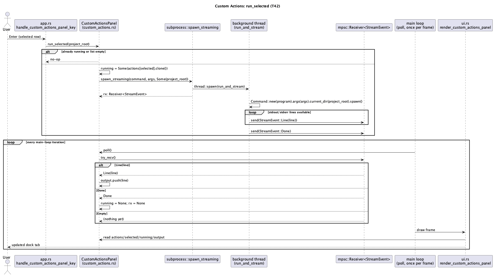

# TUI: Custom Actions (T42)

## 1. Purpose

This is the second, independent half of the `claude.ai/design` import of
`Orbit TUI.dc.html` (the first half, a selectable color theme, shipped as
`T41` — `docs/features/tui-theme.md`). The mockup's own in-app
documentation screen ("Keys & Pane Actions") describes an extensibility
model: every pane edge (a Top status bar, Pane 1/Left, Pane 3/Right, a
Bottom pane) is a "slot" rendered as `[+] bind` until the user attaches a
named external command to it, declared through a colon-command
(`: bind bottom run cargo test`) and persisted to a config file the mockup
calls `.orbit/tui.toml`.

**This doc does not implement that visual metaphor literally**, for two
concrete reasons, both worth stating for reviewability (the same
translation-choice convention `T41` §3.3 established for fonts/hover):

1. **`ide-tui` has no four-edge model.** Its real focus surface is
   `Focus::LeftDock` / `Focus::Editor` / `Focus::BottomDock` (`app.rs`,
   three variants, not four), and since `T33` (`tui-tool-window-docking.md`)
   arbitrary tool output lives in **dock tabs** (`LeftDockTab`/
   `BottomDockTab`), not in per-edge popups. Inventing a fictional
   Top/Left/Right/Bottom slot grid with no rendering surface behind three
   of its four edges would be UI theater, not a feature. This doc instead
   generalizes the mockup's actual payoff — *run a user-declared, named
   external command from inside the IDE and see its output inline* — into
   **one new bottom-dock tool window**, `BottomDockTab::CustomActions`,
   using the exact "always-alive struct + derived dock visibility" pattern
   every other `T33` tool window (Docker/Kubernetes/Cargo/Problems/GitLog)
   already uses.
2. **`ide-tui` has no colon-command mode.** Nothing in this crate parses a
   `:`-prefixed command line today (confirmed by inspection — the closest
   analog, the Command Palette, is a fuzzy-filtered list, not a text
   grammar). Rather than inventing a parser for a one-off feature, actions
   are declared through a **Manage Custom Actions popup** — Add (`n`) /
   Edit (`Enter`) / Delete (`d`) over a list, Tab-cycled Name/Command/Args
   text fields for the add/edit form — mirroring `tui-git-worktrees.md`'s
   already-shipped add-worktree popup (`WorktreeAddField`, `'n'`/`'r'`
   list-management keys) almost field-for-field, and
   `confirm_debug_adapter_config`'s already-shipped **separate** Command +
   Args (space-separated) fields rather than one combined command-line
   string — sidestepping the ambiguity of parsing "where does the program
   name end" that a single free-text command line would otherwise force.

**Branding note:** `.orbit/tui.toml` is not adopted (`CLAUDE.md`'s standing
"never use Orbit branding" rule). Actions persist through the
already-existing, already-hardened `ide_core::project_settings` mechanism
(`.ide/custom_actions.json`, mirroring `Preferences`/`Workspace`/
`Navigation`'s existing slots) via one new `ProjectSettingsFile` variant —
a small `rust-core-dev` addition this run needs first, since `rust-tui-dev`
builds against it. This makes actions **project-scoped** (a project's own
build/test/lint helpers, not global across every project `ide-tui` ever
opens) — the more useful scope for "things you'd bind a pane action to" in
practice, and consistent with the mockup's own project-relative
`.orbit/tui.toml` (a dotfile beside the project, not a user-global
preference).

**Security posture, stated up front:** executing a bound action spawns a
real subprocess with a user-typed program name and arguments — the same
security shape `CLAUDE.md` already declares sensitive for
`cargo_panel.rs`/`docker_panel.rs`/`k8s_panel.rs`, and the first feature to
land the general "any panel that spawns a run configuration... argument
vector, environment and cwd all come from user config" shape that
`CLAUDE.md`'s security-sensitive-paths list already anticipates in the
abstract. Unlike `T41`, **this run needs a `hacker` pass** before merge.
No shell is ever invoked (§4 spells out why this can't be an injection
vector regardless of what a user types into Name/Command/Args), and no
action ever runs without an explicit `Enter` from the user in the dock —
loading `.ide/custom_actions.json` (including one carried in from a freshly
cloned, untrusted repository) never executes anything by itself, the same
"config, not code" posture `debug_config.rs` already established for
per-language debug-adapter commands.

## 2. Interface / API

### 2.1 `ide-core`

One new variant on the existing per-project settings enum
(`crates/core/src/project_settings.rs`):

```rust
pub enum ProjectSettingsFile {
    Preferences,
    Workspace,
    Navigation,
    /// User-declared named external commands, invocable from the TUI's
    /// Custom Actions dock tab (`docs/features/tui-custom-actions.md`,
    /// `T42`). Content-named, not frontend-named, the same way
    /// `Navigation` already is — nothing about the name or file ties it to
    /// `ide-tui` specifically, should `ide-ui` ever want the same
    /// capability.
    CustomActions,
}
```

`file_name(self)` gains `ProjectSettingsFile::CustomActions =>
"custom_actions.json"`. No other change to this module — `read`/`write`/
`settings_dir`/`ensure_gitignored` are already generic over the payload
type and already handle the `.ide/` symlink-escape and atomic-write
guarantees this new slot needs for free.

### 2.2 `ide-lsp` / `ide-dap`

None.

### 2.3 `ide-tui`

**New file `crates/tui/src/custom_actions.rs`:**

```rust
/// One user-declared, named external command. `args` is already a real
/// argv (split once, at save time, in `App::confirm_action_form` -- see
/// §3.2) -- never re-split from a raw string at run time, so there is
/// exactly one place in this feature that turns typed text into argv
/// elements.
#[derive(Debug, Clone, PartialEq, Eq, Serialize, Deserialize)]
pub(crate) struct CustomAction {
    pub(crate) name: String,
    pub(crate) command: String,
    pub(crate) args: Vec<String>,
}

/// The `.ide/custom_actions.json` payload shape -- a struct, not a bare
/// `Vec<CustomAction>`, so a future field (e.g. a per-action `cwd`
/// override) doesn't need a breaking top-level shape change.
#[derive(Debug, Default, Clone, PartialEq, Serialize, Deserialize)]
pub(crate) struct CustomActionsFile {
    pub(crate) actions: Vec<CustomAction>,
}

/// Best-effort load: missing file, malformed JSON, or a `.ide/` symlink
/// escape all collapse to an empty list -- the same fail-open posture
/// `project_state::load`/`state::load` already establish. Never blocks
/// `App::new`.
pub(crate) fn load(project_root: &Path) -> Vec<CustomAction> { .. }

/// Best-effort save -- swallows every failure the same way
/// `project_state::save` does; losing a just-added action to a permission
/// error is a worse UX than a silent no-op, but never worth crashing an
/// editing session over.
pub(crate) fn save(project_root: &Path, actions: &[CustomAction]) { .. }

/// The dock tab's always-alive state (`docs/features/
/// tui-tool-window-docking.md` §2.1 pattern) -- `actions` is the one
/// in-memory copy the Manage popup also reads/writes directly (§3.2); the
/// dock tab and the popup are two views over the same `Vec`, not two
/// copies that need syncing.
#[derive(Default)]
pub(crate) struct CustomActionsPanel {
    pub(crate) actions: Vec<CustomAction>,
    pub(crate) selected: usize,
    /// A **clone** of the action currently running, not an index into
    /// `actions` -- deleting or reordering the definition mid-run (via the
    /// Manage popup, which can be open at the same time) must never
    /// invalidate an in-flight run or panic on re-index. Mirrors
    /// `CargoPanel::running: Option<CargoCommand>` (there `Copy`; here
    /// `Clone`, since `CustomAction` holds `String`s).
    pub(crate) running: Option<CustomAction>,
    pub(crate) output: Vec<String>,
    rx: Option<Receiver<crate::subprocess::StreamEvent>>,
}

impl CustomActionsPanel {
    /// No-op if `running.is_some()` -- same "at most one in flight" v1
    /// scope `CargoPanel::run`'s own doc comment already states, applied
    /// here too rather than inventing per-action concurrency. No-op if
    /// `actions` is empty or `selected` is out of range (nothing to run).
    pub(crate) fn run_selected(&mut self, project_root: &Path) { .. }

    /// Identical shape to `CargoPanel::poll` -- call once per loop
    /// iteration regardless of dock visibility, same reasoning (a running
    /// action keeps streaming even while the dock tab isn't the visible
    /// one).
    pub(crate) fn poll(&mut self) { .. }
}
```

`run_selected`/`poll`'s bodies are a direct reuse of
`crates/tui/src/subprocess.rs`'s already-shared, already-hardened
`spawn_streaming(program: &str, args: &[String], current_dir: Option<&Path>)
-> Receiver<StreamEvent>` (the same helper `docker_panel.rs`/`k8s_panel.rs`
already use) — no new subprocess-spawning code, no new byte-cap logic (the
existing `MAX_CAPTURED_BYTES_PER_STREAM` in `subprocess.rs` already applies
here for free), no new "not found on PATH" handling (already covered by
`run_and_stream`'s existing `ErrorKind::NotFound` branch, which will fire
routinely here since a mistyped custom-action program name is the expected
common failure mode, not an edge case).

**`crates/tui/src/app.rs`:**

```rust
pub(crate) enum BottomDockTab {
    Docker,
    Kubernetes,
    Cargo,
    CustomActions, // new -- inserted between Cargo and Problems
    Problems,
    GitLog,
}
```

`next()`/`previous()` extend their existing cycle to include the new
variant in that same position (`Cargo -> CustomActions -> Problems` and the
symmetric reverse).

```rust
/// Which field of the add/edit form has focus; `Tab`/`BackTab` cycle it.
/// Mirrors `WorktreeAddField` (`tui-git-worktrees.md` §2.2) exactly.
pub(crate) enum ActionFormField {
    Name,
    Command,
    Args,
}
impl ActionFormField {
    pub(crate) fn next(self) -> Self { .. } // Name -> Command -> Args -> Name
    pub(crate) fn prev(self) -> Self { .. } // exact reverse
}

/// The Manage Custom Actions popup's state. `adding` doubles as "add" and
/// "edit" mode (mirrors `GitWorktreesPopupState::adding`) --
/// `editing_index: Some(i)` means the form was opened via `Enter` on
/// `actions[i]` and `Enter` in the form overwrites that index instead of
/// pushing a new entry.
pub(crate) struct ManageActionsPopupState {
    pub(crate) selected: usize,
    pub(crate) adding: bool,
    pub(crate) editing_index: Option<usize>,
    pub(crate) add_field: ActionFormField,
    pub(crate) new_name: String,
    pub(crate) new_command: String,
    /// Raw typed text, space-separated -- split into `Vec<String>` only
    /// in `confirm_action_form` (§3.2), the same one-parse-site discipline
    /// `confirm_debug_adapter_config`'s `args: String` field already
    /// establishes for the identical reason.
    pub(crate) new_args: String,
}
```

`App` gains two fields (placed near `keymap_popup`/`theme_popup`, same
"presence is visibility" idiom):

```rust
pub(crate) custom_actions: CustomActionsPanel,
pub(crate) manage_actions_popup: Option<ManageActionsPopupState>,
```

- `App::new` initializes `custom_actions: CustomActionsPanel { actions:
  crate::custom_actions::load(project.root()), ..Default::default() }`
  (same spot/shape `nav_state: project_state::load(project.root())`
  already uses) and `manage_actions_popup: None`.
- `close_all_overlays()` gains `self.manage_actions_popup = None;`.
- `any_popup_open()` gains `|| self.manage_actions_popup.is_some()`.
- The main key-routing chain gains, at the same tier as every other popup
  check: `if self.manage_actions_popup.is_some() { return
  self.handle_manage_actions_popup_key(key); }`.
- `handle_bottom_dock_key`'s tab-dispatch match gains `BottomDockTab::
  CustomActions => { self.handle_custom_actions_panel_key(key); }`.
- The enclosing method that already calls `self.cargo.poll();` (`app.rs`
  around line 1116) and `self.docker.poll();` (around line 1131) once per
  main-loop iteration gains a sibling `self.custom_actions.poll();` call
  alongside them.

New methods (full sketches — behavior detailed in §3):

```rust
fn toggle_manage_actions_popup(&mut self) { .. }       // `ManageCustomActions` command
fn toggle_custom_actions_panel(&mut self) { .. }       // `ToggleCustomActionsPanel` command; `self.show_bottom_dock_tab(BottomDockTab::CustomActions)`
fn handle_custom_actions_panel_key(&mut self, key: KeyEvent) -> LoopSignal { .. }
fn handle_manage_actions_popup_key(&mut self, key: KeyEvent) -> LoopSignal { .. }
fn handle_action_form_key(&mut self, key: KeyEvent) -> LoopSignal { .. }
fn confirm_action_form(&mut self) { .. }
fn persist_custom_actions(&self) { crate::custom_actions::save(&self.project_root, &self.custom_actions.actions); }
```

**`crates/tui/src/commands.rs`** — two new palette-only entries (no default
binding, same reasoning as `ToggleCargoPanel`/`ToggleDockerPanel`/
`ToggleThemeSettings`: a new settings/tool-window surface with no
reference-IDE keybinding to translate):

```rust
Action::ManageCustomActions,
Action::ToggleCustomActionsPanel,

Command { id: "ManageCustomActions", title: "Custom Actions: Manage", binding: None, action: Action::ManageCustomActions },
Command { id: "ToggleCustomActionsPanel", title: "Custom Actions", binding: None, action: Action::ToggleCustomActionsPanel },
```

**`crates/tui/src/ui.rs`** — two new render functions, no signature changes
to anything existing:

- `render_custom_actions_panel(frame, app, area)` — the `BottomDockTab::
  CustomActions` dock tab's content, mirroring `render_docker_panel`'s
  list-with-cursor-highlight shape: one row per `app.custom_actions.
  actions` entry (`"<name>  —  <command> <args...>"`), `Modifier::REVERSED`
  on `app.custom_actions.selected`, and — mirroring `render_cargo_panel`'s
  own output area — a scrolling pane below showing `app.custom_actions.
  output`'s tail plus a header line naming `app.custom_actions.running`
  when `Some` ("Running: <name>…"). Empty-list case renders a single
  placeholder row ("No custom actions yet — <palette hint for
  `ManageCustomActions`>"), same convention `render_scratch_files_popup`
  already uses for its own empty state. Uses `app.theme.theme().error_text`
  (not a hardcoded `Color::Red`) for a `"<program> not found on PATH"`/
  nonzero-exit-style line, consistent with every other error-text site
  `T41` already converted.
- `render_manage_actions_popup(frame, app, area)` — mirrors `render_git_
  worktrees_popup`'s list/add-form split: while `!adding`, a centered
  popup listing every action with the cursor highlight, title `"Custom
  Actions  (n: new, Enter: edit, d: delete, Esc: close)"`; while `adding`,
  three labeled text fields (Name/Command/Args) with the focused one
  highlighted, title `"New Action"` or `"Edit Action"` depending on
  `editing_index`.

Both wired into the existing render dispatches the same way every sibling
already is (`render_custom_actions_panel` inside the bottom-dock tab-content
match alongside `render_cargo_panel`/`render_docker_panel`;
`render_manage_actions_popup` inside the top-level popup-dispatch `if`
chain alongside `render_theme_popup`).

## 3. Behaviour

### 3.1 Running an action (dock tab)

- `ToggleCustomActionsPanel` (palette-only) opens the bottom dock on the
  `CustomActions` tab (same `show_bottom_dock_tab` idempotent-toggle
  behavior every other dock-tab command already has).
- `Up`/`Down`: move the row cursor, clamped `[0, actions.len() - 1]`, no
  wraparound (matches `handle_docker_panel_key`'s own `Up`/`Down`
  clamping).
- `Enter`: `run_selected` — no-op if another action is already running
  (v1 scope: at most one in flight, matching `CargoPanel`) or if the list
  is empty. Otherwise clones the highlighted `CustomAction` into `running`,
  clears `output`, and spawns it via `subprocess::spawn_streaming` with
  `current_dir: Some(&self.project_root)`.
- Output streams into `app.custom_actions.output` one line at a time as
  `poll()` drains the channel each loop iteration, exactly like
  `CargoPanel`/`DockerPanel` already do — visible whether or not the dock
  tab is the currently-focused one.
- Deleting the running action's definition from the Manage popup mid-run
  (possible: the popup and the dock tab are independent, both can be
  reached without stopping a run) does **not** stop the run or corrupt
  `running`'s display, since `running` is a clone, not an index (§2.3). The
  action simply no longer appears in the list on the next render.

### 3.2 Declaring an action (Manage popup)

- `ManageCustomActions` (palette-only) opens the popup, list mode,
  `selected: 0`.
- List mode: `Up`/`Down` move the cursor (clamped, no wraparound, same as
  every other list popup); `Esc` closes the whole popup; `n` opens the
  form blank (`editing_index: None`, `add_field: Name`, all three text
  fields cleared); `Enter` opens the form pre-filled from `actions
  [selected]` (`editing_index: Some(selected)`, `new_args` rebuilt via
  `action.args.join(" ")` — the one place args are ever rejoined into
  displayable text, purely for the form's own text field, never re-parsed
  from this joined form); `d` removes `actions[selected]` immediately (no
  confirmation step — deleting a config entry is not a destructive
  filesystem/git operation the way worktree removal is, so `handle_git_
  worktree_remove_confirm_key`'s force-confirm precedent does not apply
  here; this matches every other low-stakes list-delete already in this
  crate) and calls `persist_custom_actions()`; if the deleted row was at or
  after `selected`, clamp `selected` back into range.
- Form mode: `Tab`/`BackTab` cycle `add_field`; `Backspace`/`Char` (any
  `Char` not chorded with `Ctrl`) edit whichever field `add_field` names;
  `Esc` discards the form (clears all three text fields, `adding = false`,
  returns to list mode — the *popup* stays open, only the form closes,
  mirroring `handle_git_worktree_add_key`'s own `Esc` behavior exactly);
  `Enter` calls `confirm_action_form`.
- `confirm_action_form`: trims `new_name`/`new_command`; either being
  empty after trimming rejects via `self.notify(...)` and leaves the form
  open (mirrors `confirm_debug_adapter_config`'s "command cannot be empty"
  rejection shape) — `new_args` has no such requirement, an action with no
  arguments is valid. On success, splits `new_args` on whitespace into
  `Vec<String>` (the one and only split site, §2.3), builds a
  `CustomAction`, and either overwrites `actions[editing_index]` (edit) or
  pushes a new entry (add), then calls `persist_custom_actions()` and
  returns to list mode with the form's text fields cleared.
  `editing_index`, when `Some`, is guaranteed to still be a valid index
  into `actions` at this point — the key-routing chain (§2.3) only ever
  delivers input to *one* of the list view or the form view at a time, so
  nothing can shrink or reorder `actions` out from under an open form the
  way `handle_git_worktree_add_key`'s identical single-mode-at-a-time
  shape already guarantees for its own `new_name`/`new_path`/`new_branch`.
  An implementer does not need (and should not add) a defensive fallback
  for an out-of-bounds `editing_index` — it cannot occur.
- **Known limitation, hand-edited files only:** opening Edit rebuilds
  `new_args` via `actions[i].args.join(" ")`, and confirming re-splits it
  via `split_whitespace()`. For every action this feature itself ever
  creates, join-then-split is lossless, since `args` only ever contains
  whitespace-free elements to begin with. It is **not** lossless for an
  entry a user hand-edited directly in `.ide/custom_actions.json` to
  contain a single argument with an embedded space (e.g. a quoted path)
  — opening and re-confirming Edit on such an entry silently splits that
  one argument into several. This is an accepted limitation of the
  popup's plain-text form, not a bug to fix here — the same "hand-edited
  input degrades gracefully but isn't specially preserved" posture
  `state.rs`'s malformed-JSON-collapses-to-default handling already
  accepts elsewhere in this crate.
- Persistence is unconditional on every add/edit/delete (not deferred to
  popup-close) — the same "save immediately" convention `toggle_format_
  on_save`/`T41`'s `persist_theme` already established, so a crash or
  forced-quit between edits never loses one already confirmed.

### 3.3 Restart

`App::new` loads `.ide/custom_actions.json` into `custom_actions.actions`
unconditionally (empty `Vec` if the file doesn't exist yet, the ordinary
first-session-in-this-project case) — no popup interaction needed to
restore previously-declared actions, matching `T41`'s own theme-restore
behavior.

### 3.4 What does not carry over from the mockup (stated for reviewability)

- **No literal per-edge `[+]` slots.** See §1 — generalized to one dock
  tab, `BottomDockTab::CustomActions`, holding every declared action
  rather than fixed Top/Left/Right/Bottom bind points that have no
  rendering surface in `ide-tui`'s real 3-region focus model.
- **No colon-command mode.** Declaring an action is a popup form (§3.2),
  not a `: bind <edge> <name> <command>` text grammar — `ide-tui` has no
  colon-command paradigm to extend, and inventing one for this single
  feature would be a bigger, riskier addition than the feature itself.
- **No shell semantics.** Pipes, redirects, `&&` chaining, globbing, and
  environment-variable expansion inside Command/Args are **not**
  supported — every action is exactly one program plus a fixed argv, the
  same scope `cargo_panel.rs`/`docker_panel.rs`/`k8s_panel.rs` already
  have. The mockup's own worked example (`bind bottom run cargo test`)
  fits this fine (`command: "cargo"`, `args: ["test"]`); a
  `"cargo build && cargo test"`-style compound command typed into Args
  would simply fail as unrecognized arguments to `cargo build` — that's a
  deliberate limitation, not a bug, and should be flagged as such in an
  implementer's or reviewer's first read rather than "fixed" by
  introducing a shell.
- **No always-present dashed "+" affordance in a key-hint ribbon.**
  `ide-tui` has no persistent bottom key-hint ribbon distinct from its
  status line; the equivalent discoverability path is the Command Palette
  (`ManageCustomActions`), the same path every other palette-only command
  in this crate already relies on for discoverability.

## 4. Constraints & invariants

- **No shell is ever invoked, regardless of Name/Command/Args content.**
  `subprocess::spawn_streaming`/`run_and_stream` call `std::process::
  Command::new(program).args(args)` — `program` and every element of
  `args` reach the OS `exec`-family call as literal, independent argv
  elements. Shell metacharacters a user types into Command or Args
  (`;`, `` ` ``, `|`, `$(...)`, `&&`, `>`) have **no special meaning** —
  they're passed through as literal bytes of a program name or a single
  argv element, which in practice means "program not found on PATH" or
  "unrecognized argument to `<program>`," never command injection. This is
  the load-bearing property `hacker` should verify holds for this
  feature's specific call sites, not re-derive from scratch — it's
  identical to `cargo_panel.rs`'s and `subprocess.rs`'s own existing,
  already-reviewed guarantee, reused verbatim.
- **No action ever runs without an explicit `Enter` in the dock.** Loading
  `.ide/custom_actions.json` (§3.3) only populates `custom_actions.
  actions` — never calls `run_selected`. A malicious or careless
  `.ide/custom_actions.json` (e.g. arriving via `git clone` of an
  untrusted repository, since `.ide/` is `.gitignore`d by `ensure_
  gitignored` **only after this project's own first write** — a file
  already committed to a repository before that project ever ran
  `ide-tui` is not retroactively ignored) can pre-populate a
  deceptively-named entry, but cannot execute it without the user reading
  its name/command and pressing `Enter` on it. This is the same trust
  boundary `debug_config.rs`'s persisted debug-adapter command/args
  already accepted for the identical reason (config, not code) — `hacker`
  should confirm this reasoning still holds for this new file, not assume
  it transfers automatically.
- `current_dir` for every run is always `&self.project_root` — never a
  user-typed path, never any per-action override (no such field exists on
  `CustomAction`). This keeps the cwd trust boundary identical to
  `cargo_panel.rs`'s.
- `CustomAction`/`CustomActionsFile` are plain `Serialize`/`Deserialize`
  data, no interior mutability, no `unsafe`.
- `ProjectSettingsFile::CustomActions`'s file (`custom_actions.json`)
  reuses `project_settings::write`'s existing atomic-temp-file-then-persist
  write path and `settings_dir`'s existing symlink-escape rejection — no
  new file-I/O code, no new path-validation code, in `ide-core`.
- At most one action runs at a time (v1 scope, §2.3) — a second `Enter`
  while one is running is a no-op, not queued and not an error.

## 5. Examples

**Declaring and running an action:**

```rust
// `plain_key` is this crate's existing test helper (`app.rs`'s test
// module); typing a whole string is just one `plain_key(KeyCode::Char(c))`
// per character -- there is no separate "type a string" helper to reuse.
fn type_str(app: &mut App, s: &str) {
    for c in s.chars() {
        app.handle_key(plain_key(KeyCode::Char(c)));
    }
}

let mut app = App::new(project_root)?;
assert!(app.custom_actions.actions.is_empty()); // fresh project, nothing declared yet

app.run_action(Action::ManageCustomActions);
app.handle_key(plain_key(KeyCode::Char('n')));           // open the add form
type_str(&mut app, "Run tests");                          // Name field
app.handle_key(plain_key(KeyCode::Tab));
type_str(&mut app, "cargo");                              // Command field
app.handle_key(plain_key(KeyCode::Tab));
type_str(&mut app, "test");                               // Args field
app.handle_key(plain_key(KeyCode::Enter));                // confirm_action_form

assert_eq!(app.custom_actions.actions.len(), 1);
assert_eq!(app.custom_actions.actions[0].command, "cargo");
assert_eq!(app.custom_actions.actions[0].args, vec!["test".to_string()]);

app.handle_key(plain_key(KeyCode::Esc));                  // close the Manage popup

app.run_action(Action::ToggleCustomActionsPanel);
app.handle_key(plain_key(KeyCode::Enter));                // run_selected
assert!(app.custom_actions.running.is_some());
```

**Persistence round-trip** (mirrors `T41`'s own example shape):

```rust
// after declaring the action above, with the project's real .ide/ dir:
let loaded = crate::custom_actions::load(&project_root);
assert_eq!(loaded[0].name, "Run tests");

// a fresh App started against the same project root picks it back up:
let app2 = App::new(project_root.clone())?;
assert_eq!(app2.custom_actions.actions, loaded);
```

## 6. Dependencies

None beyond what both crates already have (`serde`/`serde_json` via
`ide-core`'s existing `project_settings` usage; no new crate in either
`Cargo.toml`).

## 7. Diagram



Covers the one genuinely async, multi-step flow this feature adds
(spawn → background thread → channel → per-frame poll → render) — the
declare/edit/delete flow is a plain synchronous popup form, already fully
described by §3.2's prose, and not diagram-worthy on its own.

## Revision notes

- `rev` (doc review, round 1) found four gaps, all fixed in place:
  1. §5's example used an undefined `type_into` helper that doesn't exist
     anywhere in the crate — replaced with a `type_str` helper defined
     inline in the example itself, spelled out as `plain_key(KeyCode::
     Char(c))` per character (the only real primitive this crate's test
     helpers provide).
  2. §2.3's `poll` integration point hedged on a nonexistent
     `poll_background_work` function name — tightened to point at the
     actual confirmed call sites (`app.rs` lines 1116/1131).
  3. §3.2 didn't state why `confirm_action_form`'s `editing_index` can be
     trusted without a bounds check — added the explicit invariant
     (mutually exclusive list/form key routing) and a note that no
     defensive fallback should be added for it.
  4. §3.2 didn't document that editing a hand-edited action whose `args`
     contains a multi-word single argument silently splits it on
     re-confirm — added as a documented, accepted limitation.
  Also noted two `[controversial]` (non-blocking) findings from the
  devil's-advocate pass, kept here for visibility rather than only in
  chat: (a) collapsing every action into one unscoped bottom-dock list
  loses the mockup's per-pane framing — a narrower alternative (attaching
  actions to the Left vs. Bottom dock specifically, rather than one
  global list) was not fully argued against, just sidestepped; (b) the
  "at most one action running at a time" scope cut, copied from
  `CargoPanel`, doesn't obviously transfer — Cargo's six subcommands are
  naturally mutually exclusive, but arbitrary user-declared actions (e.g.
  a long-running dev server alongside a one-off lint check) may not be,
  making this a real first-cut UX limitation rather than a free
  simplification.
