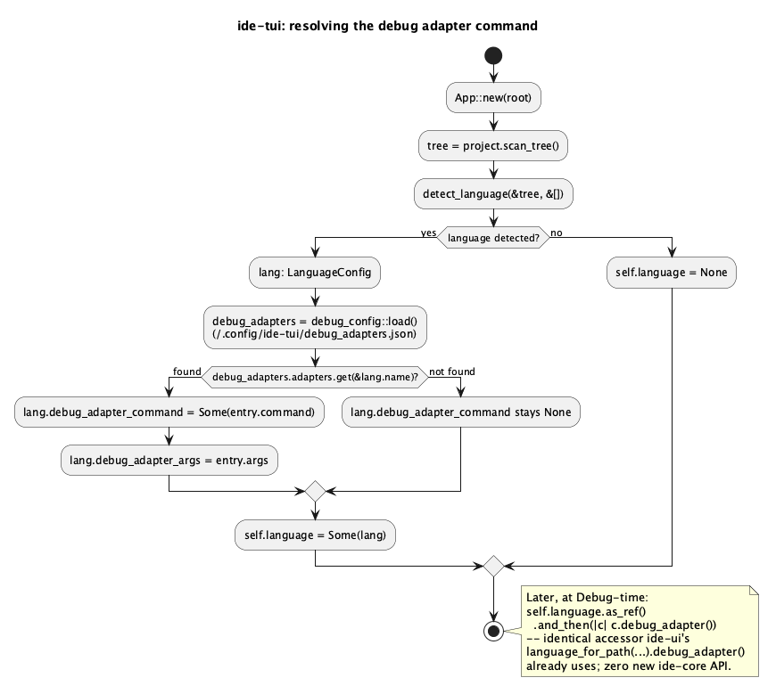

# TUI Debugger (T27) — DAP client parity for `ide-tui`

Brings the F5a debugger (`docs/features/debugger.md`) to `ide-tui`, the
TUI-parity follow-up that doc's own §6 explicitly deferred ("TUI parity for
the debugger is a `T`-track follow-up doc, not part of this run"). Zero new
`ide-core`/`ide-dap` API — both crates already expose everything this doc
needs (`LanguageConfig::debug_adapter()`, `ide_dap::DapClient` and its full
request/event surface). This is a `rust-tui-dev`-only run.

**Out of scope**, same boundary F5a itself drew: F5b (variables/watch/
Evaluate Expression) and F5c (conditional/logging breakpoint *behavior*,
hit-count breakpoints). Also out of scope: a real Run/Debug configuration
picker (F1) — like F5a, this doc works around its absence with a small
popup, not a permanent UI.

## 1. Purpose

`ide-ui` has a working debugger; `ide-tui` has none (confirmed: zero
references to `ide_dap`/`debug_panel` anywhere in `crates/tui/**`). This
doc gives `ide-tui` the same session/breakpoints/stack capability, adapted
to a keyboard-only, gutter-less terminal UI.

**The one real architecture gap**: `ide-ui` resolves `debug_adapter_command`
per language from its persisted "Languages…" settings window
(`.ide/preferences.json`'s `custom_languages`). `ide-tui` has no
language-settings UI or persistence at all — confirmed by `App::new`'s own
comment ("No language-settings UI in `ide-tui` yet... `custom` is always
empty") and by the fact that `detect_language`'s result was, until this
doc, discarded immediately after starting the language server. Per an
explicit user decision (`AskUserQuestion`, this run): rather than typing
the adapter command into an ephemeral per-session popup, `ide-tui` gets a
**minimal persisted debug-adapter config**, keyed by language name, at
`~/.config/ide-tui/debug_adapters.json` — the same "global, per-user JSON
file" shape `state.rs`/`keymap.rs` already established (T21/T22), not a
per-project `.ide/` file (`ide-tui` has never used that model — see T21's
own rationale for why).

## 2. Interface

### 2.1 New module `crates/tui/src/debug_config.rs`

```rust
/// One language's debug adapter override, keyed by `LanguageConfig::name`
/// (e.g. `"Rust"`, `"Go"`) -- not by extension, since a `LanguageConfig`
/// already carries its own canonical `name` and this map's only consumer
/// is `App::new`'s single detected `LanguageConfig`, not a per-file lookup
/// (`ide-tui` still detects exactly one project-wide language, unchanged
/// by this doc).
#[derive(Debug, Default, Clone, PartialEq, serde::Serialize, serde::Deserialize)]
pub struct DebugAdapterConfig {
    pub adapters: std::collections::HashMap<String, DebugAdapterEntry>,
}

#[derive(Debug, Clone, PartialEq, serde::Serialize, serde::Deserialize)]
pub struct DebugAdapterEntry {
    pub command: String,
    #[serde(default)]
    pub args: Vec<String>,
}

/// Best-effort load/save, identical contract to `state::load`/`state::save`
/// (missing file, malformed JSON, or no resolvable `$HOME` all degrade to
/// `DebugAdapterConfig::default()` / a silently-swallowed save failure --
/// persistence here is a convenience, never a requirement to run).
pub fn load() -> DebugAdapterConfig;
pub fn save(config: &DebugAdapterConfig);
```

Persisted at `~/.config/ide-tui/debug_adapters.json` (`load_from`/
`save_to`/`*_file_path_from_home` split the same way `state.rs` splits
them, for the same testability reason: a test points the `_from`/`_to`
helpers at a tempdir path directly rather than faking `$HOME`).

### 2.2 `App` (`crates/tui/src/app.rs`)

```rust
pub struct App {
    // ...existing fields...

    /// The one detected project language, now *retained* instead of being
    /// a `let` local `App::new` discards after starting the LSP server --
    /// this doc's only change to language detection itself. `None` for an
    /// unrecognized project (no built-in/marker match), same as
    /// `detect_language`'s own return type.
    pub(crate) language: Option<LanguageConfig>,
    /// Loaded once at startup (`debug_config::load`); mutated only by
    /// `ConfigureDebugAdapter`'s popup.
    pub(crate) debug_adapters: DebugAdapterConfig,
    pub(crate) debug: DebugPanel,
    /// Debug tool window visibility -- same bare-bool convention as
    /// `cargo_panel_open`/`claude_panel_open`. `self.debug`'s own fields
    /// (session, breakpoints, stack, ...) persist across a close/reopen;
    /// only this flag changes.
    pub(crate) debug_panel_open: bool,
    /// "Configure Debug Adapter" popup state -- presence is visibility,
    /// same convention every other popup in this crate follows.
    pub(crate) debug_adapter_config_popup: Option<DebugAdapterConfigPopupState>,
}

/// `docs/features/tui-debugger.md` §2.2 -- the two-field popup
/// `ConfigureDebugAdapter` opens. `field` tracks which of the two text
/// fields `Tab`/`Shift+Tab` currently targets for char-insert/backspace
/// (`ide-tui`'s only existing text-entry popups, `NewScratchFileState`/
/// `GoToFileState`'s query field, are single-field -- this is the first
/// two-field text popup in this crate).
pub(crate) struct DebugAdapterConfigPopupState {
    pub(crate) command: String,
    pub(crate) args: String,
    pub(crate) field: DebugConfigField,
}

pub(crate) enum DebugConfigField {
    Command,
    Args,
}
```

`App::new` change: after `detect_language(&tree, &[])` returns `Some(lang)`
and starts the LSP server (unchanged), look up
`debug_adapters.adapters.get(&lang.name)` and, if present, overwrite
`lang.debug_adapter_command`/`lang.debug_adapter_args` on that same
`LanguageConfig` before storing it as `self.language` — so
`self.language.as_ref().and_then(|c| c.debug_adapter())` "just works"
exactly like `ide-ui`'s `language_for_path(...).and_then(|c|
c.debug_adapter())` does, with **zero new `ide-core` API**: the persisted
map is purely a `ide-tui`-side enrichment step applied to the one
`LanguageConfig` this crate already keeps.

### 2.3 New module `crates/tui/src/debug_panel.rs`

Ported near-verbatim from `crates/ui/src/debug_panel.rs` (same precedent
`cargo_panel.rs`/`git_panel.rs` already set for "no `egui` dependency in
that file to begin with, so the port is close to line-for-line"):

```rust
pub(crate) const MAX_DEBUG_OUTPUT_LINES: usize = 2000;

#[derive(Default)]
pub(crate) struct DebugPanel {
    session: Option<DapClient>,
    pub(crate) capabilities: Option<Capabilities>,
    ready_for_breakpoints: bool,
    pub(crate) threads: Vec<ThreadInfo>,
    pub(crate) selected_thread: Option<i64>,
    pub(crate) stack: Vec<StackFrame>,
    pub(crate) breakpoints: HashMap<PathBuf, Vec<u32>>,
    pub(crate) confirmed_breakpoints: HashMap<PathBuf, Vec<VerifiedBreakpoint>>,
    pub(crate) output: VecDeque<(OutputCategory, String)>,
    pub(crate) error: Option<String>,
    pub(crate) launch_args_draft: String,
    pub(crate) show_launch_popup: bool,
}

impl DebugPanel {
    pub(crate) fn is_active(&self) -> bool;
    /// Same drains-`try_recv`-in-a-loop shape as `LspBridge::poll`.
    pub(crate) fn poll(&mut self) -> bool;
    pub(crate) fn toggle_breakpoint(&mut self, path: PathBuf, line: u32);
    pub(crate) fn start_session(
        &mut self,
        command: &str,
        args: &[String],
        project_root: impl AsRef<Path>,
        launch_arguments: serde_json::Value,
    );
    pub(crate) fn resume(&mut self);
    pub(crate) fn step_over(&mut self);
    pub(crate) fn step_into(&mut self);
    pub(crate) fn step_out(&mut self);
    pub(crate) fn pause(&mut self);
    pub(crate) fn stop(&mut self);
    pub(crate) fn select_thread(&mut self, id: i64);
}
```

Every method's behavior (event handling, one-session-at-a-time, breakpoint
resync on `ReadyForBreakpoints`, `target_thread()`'s selected-or-first
fallback, `stop()` always sending `Disconnect`) is identical to
`crates/ui/src/debug_panel.rs` — see that file and `debugger.md` §3 for the
normative behavior; this doc does not re-derive it, only the presentation
layer around it differs (§2.4–§2.6 below).

### 2.4 Breakpoint rendering — a line-background wash, not a gutter mark

`ide-tui`'s editor has **no gutter column at all** (confirmed: no line
numbers, no fold-arrow lane, no git-gutter lane anywhere in
`crates/tui/src/ui.rs`/`highlight.rs` — T19's code-folding doc already
notes this explicitly for fold markers). A `ide-ui`-style filled-circle
gutter mark has nothing to attach to here. Deliberate design choice for
this doc: reuse the crate's existing `LineOverlays` boundary-wash mechanism
(the same one `selections`/`highlights`/`bracket_pair` already use) —
a breakpointed line's **entire line** gets a background tint, not a single
character:

```rust
// crates/tui/src/highlight.rs
pub struct LineOverlays<'a> {
    // ...existing fields...
    /// Whole-line ranges with a *verified* breakpoint (`Color::Red`
    /// background) -- `docs/features/tui-debugger.md` §2.4.
    pub breakpoints_verified: &'a [Range<usize>],
    /// Whole-line ranges with an adapter-reported *unverified* breakpoint
    /// (`Color::DarkGray` background, distinct from `breakpoints_verified`
    /// -- mirrors `ide-ui`'s dimmed/hollow-vs-solid circle distinction,
    /// doc §3.4).
    pub breakpoints_unverified: &'a [Range<usize>],
}
```

`ui.rs`'s `render_editor` computes both slices once per frame (same
"whole-buffer data, converted once per frame by the caller" convention
every other `LineOverlays` field already documents), from a new
`App::breakpoint_line_ranges(path) -> (Vec<Range<usize>>, Vec<Range<usize>>)`
helper: for each line in `self.debug.breakpoints.get(path)`, look up
`self.debug.confirmed_breakpoints.get(path)` for that line's `verified`
flag (default `true`, i.e. solid, when no confirmation has arrived yet —
same resolved default `breakpoint_marks_for_active_tab` in `ide-ui` uses),
and convert `line` to a whole-line byte range via
`text_buffer.lines().line_range(line, text_buffer.text())` (the real
two-argument `Lines::line_range` signature — same call shape
`crates/tui/src/editor.rs`'s existing `line_text`/`line_range` helpers
already use, not a bare one-argument method on `TextBuffer` itself; 1-based
DAP line → 0-based buffer line, same off-by-one conversion
`toggle_breakpoint_at_caret`/`breakpoint_marks_for_active_tab` already do
in `ide-ui`).

### 2.5 Popups

**"Debug" launch popup** (`self.debug.show_launch_popup`/
`launch_args_draft`, fields already ported onto `DebugPanel` in §2.3) —
identical content to `ide-ui`'s: a read-only line showing the resolved
adapter command (`self.language.as_ref().and_then(|c|
c.debug_adapter())`), and a single-line raw-JSON text field for launch
arguments (default `"{}"`), `Enter` parses and calls `DebugPanel::
start_session` on success or sets `debug.error` on invalid JSON (mirrors
`confirm_debug_launch` exactly), `Esc` closes without launching. Unlike
`ide-ui`'s multi-line `egui::TextEdit`, this is a single-line field (this
crate's popups have no multi-line text-entry widget anywhere — `"{}"`, a
flat args object, or a short array all fit on one line for the adapters
this project's own dependency table anticipates; a launch payload that
genuinely needs multi-line JSON is already better served by F1's eventual
real run-configuration model than by stretching this stopgap further).

**"Configure Debug Adapter" popup** (new, `ide-tui`-only — `ide-ui`'s
equivalent is its existing Languages… settings window, which `ide-tui`
doesn't have): `Tab`/`Shift+Tab` switches the focused field between
Command and Args (`DebugConfigField`), typing/`Backspace` edit whichever
field has focus (same per-character editing `handle_new_scratch_file_key`
already establishes, just dispatched to one of two fields instead of one),
`Enter` saves: trims `command`, rejects (via `notify`, popup stays open) if
empty; splits `args` on whitespace (same naive convention
`add_custom_language`'s `new_language_args` already uses); on success,
updates `self.language`'s `debug_adapter_command`/`debug_adapter_args` in
place, inserts/overwrites `self.debug_adapters.adapters[&language.name]`,
calls `debug_config::save`, and closes the popup. `Esc` cancels without
saving. Opened pre-filled from `self.language`'s *current* debug-adapter
fields (so re-invoking to edit an already-configured adapter doesn't start
from blank), or empty fields if `self.language` is `None` or has no
adapter configured yet.

### 2.6 Debug tool window (`self.debug_panel_open`)

An overlay popup, same category as Git/Cargo/Docker/K8s panels
(`ToggleDebugPanel` opens/closes it via `close_all_overlays`, `self.debug`
itself is untouched by the toggle — same "closing never resets state"
convention `toggle_cargo_panel`/`toggle_git_panel` already establish).
Three sections, keyboard-navigated (no toolbar buttons — this crate's
click support, per `tui-mouse-support.md` §4, is scoped to tree/tabs/
editor only, not arbitrary panel chrome):

- **Threads** (top): `Up`/`Down` moves selection, `Enter` calls
  `DebugPanel::select_thread`.
- **Stack** (middle, for `self.debug.selected_thread`): `Up`/`Down` moves
  selection, `Enter` on a frame with `source: Some(path)` navigates there
  via the existing `pending_cursor_offset`/`open_or_focus_tab` path (same
  "jump to frame" mechanism `ide-ui`'s click-a-frame does); a frame with
  `source: None` is shown but `Enter` no-ops on it.
- **Output** (bottom): read-only scrolling log, `PageUp`/`PageDown` or the
  mouse wheel (already generic per-popup routing from
  `tui-mouse-support.md` §3.3 — no new wheel-handling code needed, the
  existing "no popup... else position-based" vs "popup open... synthetic
  key" branch already covers this the same way it covers every other
  list-shaped popup).

Single-key shortcuts inside the panel, same `cargo_panel.rs` convention
(`b`/`r`/`t`/`c`/`l`/`f` there) rather than a clickable toolbar:
`c` (**c**ontinue/resume), `o` (step **o**ver), `i` (step **i**nto),
`u` (step o**u**t), `p` (**p**ause), `x` (stop — `s` collides with nothing
existing but `x` matches no existing panel's letter either; chosen to
leave `s`/`r`/etc. free for `Tab`-cycling between the three sections
instead, since threads/stack/output all need their own `Up`/`Down` focus).
`Tab`/`Shift+Tab` cycles focus between Threads/Stack/Output, mirroring
`GitPanelFocus`'s own `Tab`-cycle convention. `Esc` closes the panel.

### 2.7 Commands (`crates/tui/src/commands.rs`)

Same `other`-half bindings `debugger.md`'s table already specifies (no
Rust-team invention — those are the real JetBrains Windows/Linux bindings,
already verified against the reference keymap by that doc):

| Command | binding |
|---|---|
| `Debug` | `Alt+Shift+F9` |
| `ResumeProgram` | `F9` |
| `StepOver` | `F8` |
| `StepInto` | `F7` |
| `StepOut` | `Shift+F8` |
| `ToggleLineBreakpoint` | `Ctrl+F8` |
| `StopDebugging` | `Ctrl+F2` |
| `PauseProgram` | *(no default binding, same as `ide-ui` — not in the reference keymap)* |
| `ToggleDebugPanel` | *(palette-only, no default binding — same convention `ToggleGitPanel`/`ToggleCargoPanel` already use)* |
| `ConfigureDebugAdapter` | *(palette-only, no default binding — `ide-tui`-only command, no `ide-ui` analogue to translate a binding from)* |

Checked against every existing `crates/tui/src/commands.rs` binding: `F7`,
`F8`, `Shift+F8`, `F9`, `Alt+Shift+F9`, `Ctrl+F8`, `Ctrl+F2` are all free.
The F-row is not otherwise empty — plain `F1`, plain `F3`/`Ctrl+F3` (T17
Bookmarks), and `Shift+F6` are already bound — but none of them overlap
any binding this doc adds.

`Debug`'s command form opens the launch popup exactly like `Alt+Shift+F9`
would (both call the same `trigger_debug`); `ToggleLineBreakpoint` toggles
a breakpoint on the active editor's current caret line (`cursor_line_column`
+ `DebugPanel::toggle_breakpoint`, 0-based → 1-based, identical conversion
to `ide-ui`'s `toggle_breakpoint_at_caret`) — there is no gutter click to
also wire this to (§2.4), so the keyboard command is `ide-tui`'s **only**
way to toggle a breakpoint, not an alternate path alongside a mouse one.

`handle_key`'s existing popup-priority chain (`app.rs`) gains three new
branches, inserted in the same position every other popup's is (before the
`keymap.action_for` dispatch, after every earlier-registered popup):

```rust
if self.debug.show_launch_popup {
    return self.handle_debug_launch_key(key);
}
if self.debug_adapter_config_popup.is_some() {
    return self.handle_debug_adapter_config_key(key);
}
if self.debug_panel_open {
    return self.handle_debug_panel_key(key);
}
```

`any_popup_open` gains the same three conditions, for `tui-mouse-support.md`
§3.2/§3.3's wheel-scroll routing to pick them up automatically with no new
mouse-specific code (the "popup open → synthetic key through `handle_key`"
branch already generically covers any popup registered this way).

## 3. Behaviour

Session handshake, one-session-at-a-time, breakpoint sync semantics,
execution-control thread-targeting, `Stop` always sending `Disconnect`,
and DAP path validation are **all identical** to `debugger.md` §3.1–§3.7 —
this doc changes presentation only, never protocol behavior. Restated
briefly for cross-reference:

- One `DapClient` at a time (`DebugPanel::is_active`); `Debug`'s command
  enablement (below) greys it out otherwise identically to `ide-ui`.
- `ReadyForBreakpoints` triggers a full breakpoint resync for every file
  with at least one breakpoint, then `ConfigurationDone` (a no-op if the
  adapter doesn't support it).
- `Stopped` refreshes `threads` and issues `StackTrace` for the reported
  thread, so the tool window shows *why* the program paused without an
  extra keystroke.
- `Stop` always sends `Disconnect { terminate_debuggee: true }`.
- `StackFrame::source` is already `None` whenever it would point outside
  `project_root` — enforced entirely inside `ide_dap` (`debugger.md` §3.6),
  unconditionally for every consumer; nothing in this doc's own code
  re-implements or could weaken that check.

**`Debug`'s enablement gate** (`is_command_enabled`, mirrors `ide-ui`'s
`CommandAction::Debug` arm exactly, substituting `self.language` for
`language_for_path(&self.active_languages, path)` since `ide-tui` has one
project-wide language rather than a per-file lookup):

```
!self.debug.is_active()
    && self.language.as_ref().is_some_and(|c| c.debug_adapter().is_some())
```

No `self.project.is_some()` check needed the way `ide-ui`'s has one —
`ide-tui`'s `App` only exists after `Project::open` already succeeded
(`App::new`'s own signature returns `Result<Self, ProjectError>`), unlike
`ide-ui` where a project may or may not be open at any given moment.

**Configuring an adapter for the first time**: `Debug`'s command is
disabled until `ConfigureDebugAdapter` has been used at least once for the
detected language (no built-in default, matching `debugger.md` §2.2's own
"this doc does not ship a default `codelldb` config" decision — unchanged
here). A user opening a fresh Rust project sees `Debug` greyed out in the
palette until they run `ConfigureDebugAdapter` and type e.g. `codelldb`.

**Persistence granularity**: `debug_adapters.json` maps *language name* →
adapter, not *project* → adapter. Every Rust project shares one entry once
configured (matches `ide-ui`'s own per-language, not per-project, model —
`custom_languages` is also global-per-language, not project-scoped,
inside a given `.ide/preferences.json`... except `ide-ui`'s file is itself
per-project, so this is actually a *coarser* granularity than `ide-ui`'s:
configuring `codelldb` for Rust in one `ide-tui` project configures it for
every `ide-tui` project's Rust files, since there is no per-project file
for `ide-tui` to key it by. This asymmetry is a deliberate, accepted
consequence of `ide-tui` having no per-project settings file at all (T21's
own "no `ProjectPreferences` analogue" precedent) — see §4's controversial
note.

## 4. Constraints & invariants

- Zero new `crates/dap`/`crates/core` API. Every behavior this doc
  specifies is already implemented and tested at that layer; this run is
  presentation-only.
- `crates/dap/**`'s own hard rule (no hardcoded adapter/language) is
  preserved: the command/args this doc's UI passes to `DapClient::start`
  always come from `LanguageConfig::debug_adapter()`, itself populated
  from user-typed config (`debug_config.rs`'s persisted map) — never a
  literal `"codelldb"` or similar baked into `crates/tui/**`.
- `DebugPanel`'s output log stays capped at `MAX_DEBUG_OUTPUT_LINES`
  (2000, same bound `ide-ui`'s copy uses) — an adapter/debuggee producing
  unbounded stdout must not grow `ide-tui`'s memory without limit.
- `debug_adapters.json`'s load/save are both best-effort (never panic on a
  missing file, malformed JSON, or unresolvable `$HOME`) — identical
  contract to `state.rs`/`keymap.rs`.
- Breakpoint toggling has exactly one entry point in `ide-tui`
  (`ToggleLineBreakpoint` on the caret line) — there is no gutter click to
  keep in sync with it, unlike `ide-ui` where the doc for that feature had
  to explicitly reconcile a keyboard command and a gutter click against
  the same underlying state.
- `self.language` is `None` for a project `detect_language` doesn't
  recognize (no `Cargo.toml`, no matching marker file) — `Debug` stays
  disabled in that case, same as `ide-ui`'s "no active file has a
  configured language" case.

## 5. Examples

**Configuring, then launching** (keyboard sequence, palette-only commands
in *italics*):

```
1. Open a Rust project. `self.language` = Some(LanguageConfig::rust())
   (debug_adapter_command: None -- "Debug" is disabled).
2. *ConfigureDebugAdapter* -> type "codelldb" in Command, Enter.
   -> self.language.debug_adapter_command = Some("codelldb")
   -> debug_adapters.json now has {"Rust": {"command": "codelldb", "args": []}}
3. Ctrl+F8 on a line -> DebugPanel::toggle_breakpoint(path, line)
   (works with no session active -- remembered for later).
4. Alt+Shift+F9 -> launch popup opens, shows "codelldb", args draft "{}".
   Enter -> DapClient::start("codelldb", &[], project_root)
   -> DapRequest::Launch { arguments: json!({}) }
5. DapEvent::ReadyForBreakpoints -> SetBreakpoints for every file with a
   breakpoint, then ConfigurationDone.
6. DapEvent::Stopped { thread_id: Some(1), .. } -> Threads + StackTrace
   requests fire automatically; *ToggleDebugPanel* shows the result.
7. F8 (step over) / F9 (resume) / Ctrl+F2 (stop, sends Disconnect).
```

**Re-opening a project where the adapter was already configured**: step 1
above instead yields `debug_adapter_command: Some("codelldb")` immediately
(the `App::new`-time enrichment from `debug_adapters.json`), so `Debug` is
enabled from the first frame — no need to repeat step 2.

## 6. Dependencies & integration points

- `crates/tui/src/debug_config.rs` (new) — no new dependency; `serde`/
  `serde_json` are already in `crates/tui/Cargo.toml` (T21).
- `crates/tui/src/debug_panel.rs` (new) — depends on `ide_dap` (new direct
  dependency for `ide-tui`'s `Cargo.toml`, already an approved crate per
  `debugger.md`'s own precedent; `ide-dap` itself gets zero changes).
- `crates/tui/src/app.rs` — new fields (§2.2), `App::new` enrichment step,
  `trigger_debug`/`confirm_debug_launch`/`toggle_breakpoint_at_caret`
  equivalents, three new `handle_key` branches + `any_popup_open` entries,
  `close_all_overlays` gains the three new popups/panel.
- `crates/tui/src/highlight.rs` — `LineOverlays` gains
  `breakpoints_verified`/`breakpoints_unverified` (§2.4); `styled_line`'s
  boundary-list walk needs no structural change, just two more slices
  folded in the same way `selections`/`bracket_pair` already are.
- `crates/tui/src/ui.rs` — `render_editor` computes the two new slices per
  frame (§2.4); new Debug tool window rendering (§2.6); new "Debug"/
  "Configure Debug Adapter" popup rendering (§2.5).
- `crates/tui/src/commands.rs` — 9 new commands (§2.7).
- **Security-sensitive** (new declarations, `CLAUDE.md` gains both this and
  the pre-existing gap below): `crates/tui/src/debug_panel.rs` is
  security-sensitive by the exact reasoning `debugger.md` §6 already gave
  for `crates/ui/src/debug_panel.rs` (bridges `ide_dap::DapClient` into the
  frame loop, constructs the adapter subprocess command from persisted
  user config, renders adapter-supplied stack traces/output straight into
  the UI) — `crates/dap/**` itself is unchanged and already covered.
  `crates/tui/src/debug_config.rs` is added to the same declaration: it
  decides the `command`/`args` `DapClient::start` receives, the same
  "config, not code" surface `lsp_bridge.rs` is already listed for. This
  run's `rust-tui-dev` diff gets a `hacker` pass before merge.
- **Pre-existing `CLAUDE.md` gap, fixed as part of this run's setup**:
  `debugger.md` §6 already declared `crates/ui/src/debug_panel.rs`
  security-sensitive at F5a merge time, but the "Security-sensitive paths"
  list in `CLAUDE.md` was never actually updated to include it (confirmed
  by grep — no `debug_panel` entry exists in that list today, even though
  `hacker` was in fact run against it per that chain's own history). Fixed
  in the same edit that adds this doc's two new entries, so the list
  matches reality going forward.
- Not required for this run: `ide-core` (unchanged), `ide-dap` (unchanged,
  zero new public API), `ide-lsp` (untouched).

## 7. Diagrams

**Session handshake**: identical protocol to `debugger.md` §3.2 — see that
doc's diagram (`docs/features/diagrams/debugger-handshake.png`), not
duplicated here since nothing about the wire sequence changes for this
frontend.

**Adapter-command resolution** (new — the one genuinely new data flow this
doc introduces):



## Controversial note (carried from §3, not blocking)

`debug_adapters.json`'s per-language-name (not per-project) granularity is
coarser than `ide-ui`'s per-project `custom_languages`. This was an
explicit, deliberate tradeoff for staying inside "minimal persisted
config" scope (the user's own chosen option over building a full
per-project settings file for `ide-tui`) rather than an oversight — flagged
here so `rev` can weigh in on whether that coarseness is acceptable for a
first cut, not because it's expected to block approval.
