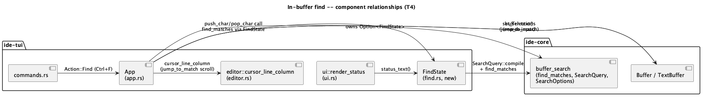
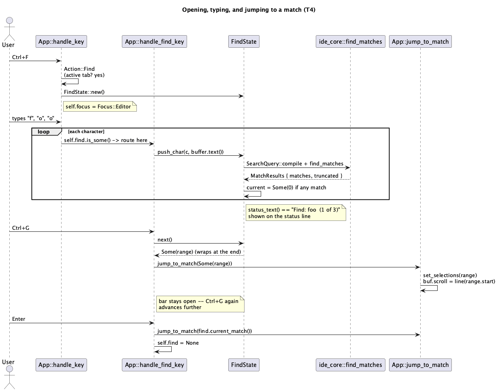

# In-buffer find (T4)

## 1. Purpose

Closes another item from `T1`'s explicitly deferred list
(`docs/features/tui-shell-and-editor.md` §1): `ide-tui` has no way to
search within the currently open tab at all. `ide-core` already ships a
complete, pure-Rust find engine (`crates/core/src/buffer_search.rs`,
`docs/features/in-buffer-find-replace.md`) that `ide-ui` already drives as
a full docked find/replace panel with case-sensitivity, whole-word, regex,
scope, replace, and a match-highlight overlay. `T4` wires a **narrow
slice** of that same `ide-core` engine into `ide-tui` — no new `ide-core`
code, no LSP, and (unlike `ide-ui`'s panel) no replace, no regex/whole-word
toggles, no scope, and no per-match highlight overlay. What `T4` adds:
open a find prompt, type a query, see a live "N of M" count, jump the
caret to the next/previous match, close.

This is a deliberately smaller slice than `ide-ui`'s feature, not a
different design philosophy — see §6 for exactly what's cut and why each
cut is named as its own later batch, the same pattern `T3`'s §6 already
used for viewport-limited rendering vs. semantic highlighting.

Out of scope, same reasoning as every prior batch's scope cuts: LSP
integration, git integration, asynchronous directory scanning, any
subprocess/PTY panel (all still on `T1`'s original deferred list).

## 2. Interface / API

### 2.1 `src/find.rs` (new)

Pure state, no rendering, no `App` dependency — mirrors `T3`'s
`highlight.rs` precedent of keeping tested pure logic out of `ui.rs` so
that file's line-coverage exemption stays unambiguous.

```rust
pub(crate) struct FindState {
    query: String,
    matches: Vec<Range<usize>>,
    truncated: bool,
    current: Option<usize>,
}

impl FindState {
    /// Empty query, no matches.
    pub(crate) fn new() -> Self;

    pub(crate) fn query(&self) -> &str;
    pub(crate) fn current_match(&self) -> Option<Range<usize>>;

    /// Appends `c` to the query and re-searches `text` (the active
    /// buffer's whole text, `Buffer::text()`).
    pub(crate) fn push_char(&mut self, c: char, text: &str);
    /// Removes the last character (no-op on an empty query) and
    /// re-searches.
    pub(crate) fn pop_char(&mut self, text: &str);

    /// Advances to the next match, wrapping past the end. `None` if there
    /// are no matches.
    pub(crate) fn next(&mut self) -> Option<Range<usize>>;
    /// Same, backward.
    pub(crate) fn prev(&mut self) -> Option<Range<usize>>;

    /// `"Find: {query}"` with no suffix while `query` is empty;
    /// `"Find: {query}  ({current+1} of {len}{+ if truncated})"` when
    /// there's a current match; `"Find: {query}  (No matches)"` when
    /// `query` is non-empty and there are none. Rendered verbatim on the
    /// status line (§3.4) -- kept here, not in `ui.rs`, so it's covered by
    /// this module's own unit tests rather than being untestable
    /// rendering code.
    pub(crate) fn status_text(&self) -> String;
}
```

`push_char`/`pop_char` call a private `refresh(&mut self, text: &str)`
that recompiles a literal, case-insensitive query
(`ide_core::SearchQuery::compile(&self.query, SearchOptions::default())`)
and calls `ide_core::find_matches(text, &query, None)`, storing
`.matches`/`.truncated` and resetting `current` to `Some(0)` if any match
exists, else `None`. **`SearchOptions::default()` selects the literal
(non-regex) engine**, which `SearchQuery::compile` never fails to compile
— only `options.regex: true` can produce a `SearchQueryError` (an invalid
pattern), and `T4` never sets that flag (§6 defers a regex toggle to a
later batch). `refresh` therefore calls `.expect(...)` on the `compile`
result with a comment naming this invariant, rather than propagating a
`Result` for an error path that cannot occur — consistent with this
project's "reserve `unwrap`/`expect` for invariants a test proves can't
fail" rule; §5 requires a test proving it for the full range of characters
a user can type into the query field.

`next`/`prev` wrap the same way `text::find::next_occurrence` and
`ide-ui`'s own `FindBar::next`/`prev` already do: `None` when `matches` is
empty, otherwise `(current + 1) % len` / `(current + len - 1) % len`,
treating a `None` `current` as landing on index `0` (`next`) or `len - 1`
(`prev`) the first time either is called.

### 2.2 `src/app.rs`

```rust
pub(crate) struct App {
    // ... existing fields unchanged ...
    pub(crate) find: Option<FindState>,
}
```

- `run_action`'s new `Action::Find` arm (bound to `Ctrl+F`, §2.3): no-op if
  `self.active_buffer()` is `None` (mirrors `ide-ui`'s own
  `open_find`: "No-op if there is no active tab"); otherwise sets
  `self.find = Some(FindState::new())` and `self.focus = Focus::Editor`
  (opening Find always makes the editor the logical target for the
  jump/close that follows, the same way selecting a file in the tree
  already switches `focus` to `Editor` via `open_or_focus_tab`'s call
  site).
- `handle_key` gains a `self.find.is_some()` check, placed immediately
  after the existing `self.palette.is_some()` check and before the
  hardcoded `Ctrl+Shift+A` (open palette) special case -- while Find owns
  input, `Ctrl+Shift+A` does not leak through to open the palette
  underneath it, the same "one modal owns all keys" invariant the palette
  check already establishes for tree/editor keys. `self.find.is_some()`
  routes to a new `handle_find_key`, exactly paralleling
  `handle_palette_key`'s existing shape and placement.
- `handle_find_key(&mut self, key: KeyEvent) -> LoopSignal`: matches on
  `(key.modifiers, key.code)` together, **in this order** -- the two
  `CONTROL`-qualified arms are checked *before* the bare-`Char(c)`
  catch-all, and the catch-all itself only fires when `key.modifiers`
  does not include `CONTROL`. This ordering is load-bearing, not
  stylistic: `crossterm` reports `Ctrl+G` as `KeyCode::Char('g')` with
  `modifiers: CONTROL` -- the same `KeyCode` a plain `g` keystroke
  produces, distinguished only by `modifiers`. A modifier-blind
  `KeyCode::Char(c) => push_char(c, ...)` arm checked first would swallow
  `Ctrl+G` as a literal `'g'` character typed into the query, silently
  defeating that binding -- exactly the "unbound Ctrl-combo gets typed as
  a literal character" failure mode §6 names as a *pre-existing* gap in
  `handle_editor_key`, except here it would be a **newly introduced**
  instance in code this batch writes from scratch, not an inherited one.
  - `(CONTROL, Char('g'))`: `jump_to_match(find.next())`, bar stays open
    (repeatable, so `Ctrl+G` pressed again advances further without
    retyping the query).
  - `(CONTROL.union(SHIFT), Char('g'))`: `jump_to_match(find.prev())`,
    same shape, backward -- **lowercase** `'g'`, not `'G'` (Post-merge
    correction, 2026-08-26; see below).
  - `(NONE, Esc)`: `self.find = None`. No cursor/selection change --
    typing alone never moves the real selection (see `jump_to_match`
    below), so if the user never pressed `Enter`/`Ctrl+G`/`Ctrl+Shift+G`,
    closing via `Esc` leaves the caret exactly where it was before `Find`
    opened, with no extra bookkeeping needed to "restore" a prior
    position.
  - `(NONE, Backspace)`: `find.pop_char(text)`.
  - `(NONE, Enter)`: calls `jump_to_match(find.current_match())` if
    `Some`, then unconditionally `self.find = None` (closes either way --
    matches `vim`'s `/pattern<Enter>` shape: confirm-and-return-to-normal-
    mode, not confirm-and-stay-in-search-mode).
  - `(modifiers, Char(c))` where `modifiers` does not include `CONTROL`
    (so plain and Shift-only characters both reach here, matching how
    typed capital letters already work elsewhere in this crate):
    `find.push_char(c, text)` where `text` is the active buffer's
    `buffer.text()` (`self.active_buffer()` is guaranteed `Some` here --
    `Find` cannot be open without one, since `Action::Find` only ever sets
    `self.find` when an active tab exists, and no tab-close path clears an
    open `find`; §4 states this invariant explicitly).
  - Anything else (including any other `CONTROL`-held combo): ignored --
    not typed into the query, per the ordering rule above.
- `jump_to_match(&mut self, range: Option<Range<usize>>)`: no-op on
  `None`. On `Some(range)`, sets the active buffer's selection to
  `Selections::single(Selection::new(range.start, range.end))` (the whole
  match, not just a caret at its start -- matches `ide-ui`'s own choice in
  `find_next`/`find_previous`, "ready to be overtyped," even though this
  crate has no selection-*highlight* rendering yet to visualize the range,
  §6) and sets `buf.scroll = line.min(u16::MAX as usize) as u16` where
  `line` comes from `editor::cursor_line_column(text_buffer,
  range.start).0` -- top-aligning the matched line unconditionally
  guarantees it's within the viewport without `app.rs` needing to know
  `text_area`'s actual height (that value lives in `ui.rs`, computed fresh
  each frame; see §4's note on why this is a deliberately simple, always-
  correct choice rather than a "only scroll if actually off-screen" one).

### 2.3 `src/commands.rs`

One new entry, following the existing table's shape exactly:

```rust
Command {
    id: "Find",
    title: "Find",
    category: "Edit",
    binding: Some((KeyModifiers::CONTROL, KeyCode::Char('f'))),
    action: Action::Find,
},
```

`ide-ui`'s own `Find` command (`crates/ui/src/command.rs`) binds `⌘F` --
this is that binding's Ctrl-translated form, the same convention `T2`
already established for `NextTab`/`PreviousTab`/`CloseTab`. `Ctrl+G` /
`Ctrl+Shift+G` (`ide-ui`'s `FindNext`/`FindPrevious`, bound to `⌘G`/`⌘⇧G`)
are **not** added to this table -- see §4 for why they're find-bar-local
keys instead of global commands, the same way the palette's own `Up`/
`Down`/`Enter` navigation is handled entirely inside
`handle_palette_key` and never appears in `commands()` either.

### 2.4 `src/ui.rs`

`render_status` gains one new branch, checked **before** the existing
`app.status()` check (Find, while open, is the active modal context, the
same priority the palette's own overlay already gets over the status
line):

```rust
let text = app
    .find
    .as_ref()
    .map(|f| f.status_text())
    .or_else(|| app.status().map(str::to_string))
    .unwrap_or_else(|| { /* existing active-buffer-path / project-root fallback, unchanged */ });
```

No new layout row, no new `Block`/`Rect` split -- reusing the existing
one-line status area (`docs/features/tui-shell-and-editor.md` §2.6) is a
deliberately minimal, terminal-appropriate choice: `ide-ui`'s docked panel
with checkboxes and a marker strip has no analogue worth building for a
single-line query field in a terminal UI (§6).

## 3. Behaviour

### 3.1 Opening

`Ctrl+F` (or selecting "Find" from the command palette, `Ctrl+Shift+A`)
opens the bar via `Action::Find`. No-op with no active tab. Opening always
starts from an empty query -- unlike `ide-ui`'s `FindBar`, `T4` does not
seed the query from the active selection, because `ide-tui` has no way to
produce a non-empty selection yet (`handle_editor_key`'s arrow-key
handling always calls `Selection::caret`, never extends a range -- a
verified, current fact about this crate, not a hypothetical scope cut);
there is nothing to seed from until a future batch adds shift-arrow
selection extension.

### 3.2 Live search as you type

Every keystroke in the query (`push_char`/`pop_char`) recompiles and
re-searches immediately against the active buffer's current text, the
same "no explicit search step" shape `in-buffer-find-replace.md` §3.2
describes for `ide-ui`'s panel -- and for the same reason: search runs
synchronously against a single in-memory `&str` already bounded by
`Buffer::open`'s `MAX_OPEN_BYTES` cap, fast enough that no debounce or
background thread is warranted.

Typing **does not** move the real caret/selection -- only `Enter`,
`Ctrl+G`, and `Ctrl+Shift+G` do (§2.2). This matches the observable shape
of IntelliJ's own incremental find: the match count updates live, but the
caret only jumps on an explicit "go to this match" action.

### 3.3 Navigation, closing

`Ctrl+G`/`Ctrl+Shift+G` jump to the next/previous match and keep the bar
open, so a query can be refined and re-navigated without retyping.
`Enter` jumps to the current match (the first one found, if `Ctrl+G` was
never pressed) and closes the bar in one step. `Escape` closes without
navigating. Every jump top-aligns the matched line in the viewport
(§2.2's `jump_to_match`) and selects the full matched range.

### 3.4 The counter

The status line shows, while `find` is open: `"Find: "` alone for an
empty query; `"Find: {query}  ({n} of {m})"` (or `{m}+` if
`MAX_SEARCH_MATCHES` was reached, `ide_core::buffer_search`'s own existing
cap) once there's a current match; `"Find: {query}  (No matches)"` for a
non-empty query with zero matches. This replaces whatever `app.status()`
would otherwise show for as long as `find` stays open.

## 4. Constraints & invariants

1. **`find.is_some()` implies an active tab exists.** `Action::Find` only
   ever sets `self.find` when `active_buffer()` is `Some`, and no tab-close
   path (`close_active_tab`, `docs/features/tui-multi-buffer-tabs.md`
   §2.1) clears an open `self.find` -- closing the tab a find session
   belongs to isn't reachable while the find bar owns all key input
   (`close_active_tab` is triggered by `Ctrl+W`, a global binding never
   consulted while `handle_find_key` intercepts every key first). This
   means `handle_find_key`'s `self.active_buffer_mut()` calls can be
   `expect`-free `if let Some(buf) = ...` without a "what if there's no
   tab" branch to reason about, and a test is required proving the
   invariant holds across a close attempted mid-find (§5).
2. **`Ctrl+G`/`Ctrl+Shift+G` are find-bar-local, not global commands**
   (§2.3). Registering them globally would make them permanent no-ops
   whenever `find` is closed (there's no persisted match list to act on
   once the bar closes, §6) while simultaneously being *unreachable*
   whenever `find` is open (since `handle_find_key` intercepts every key
   before `binding_for` is ever consulted) -- a command that is either a
   no-op or unreachable in every state it can be reached from is strictly
   worse than not registering it, so this mirrors the palette's own
   internal-only `Up`/`Down`/`Enter` handling instead.
3. **`jump_to_match` always top-aligns, never conditionally scrolls.**
   `ide-tui` currently has *no* scroll-follows-cursor logic anywhere
   (confirmed by inspection: `buf.scroll` is set once, to `0`, in
   `open_or_focus_tab`, and never written anywhere else in the crate
   before this batch) -- arrow-key cursor movement can already carry the
   caret off-screen with no way back short of manual re-scrolling, a
   pre-existing `T1`/`T2` gap this batch does not fix (out of scope, named
   as a follow-up in §6). `jump_to_match` sidesteps needing to know
   whether the target line is *already* visible (which would require
   `text_area.height`, a value only `ui.rs`'s `render_editor` computes,
   fresh, once per frame) by always setting `buf.scroll = line`
   unconditionally -- simpler than a conditional "only scroll if
   necessary" version, and strictly correct: the matched line is always
   the first visible row after a jump, regardless of where it was before.
4. **Query compilation cannot fail in `T4`.** `SearchOptions::default()`
   never sets `regex: true`, and `SearchQuery::compile` only returns
   `Err` for an invalid *regex* pattern (`crates/core/src/buffer_search.rs`'s
   own `compile`: the literal branch never calls anything fallible) -- so
   `refresh`'s `.expect(...)` is sound for every `String` a user can type
   into the query field, not just typical ones.
5. **Every jump-driven selection edit goes through the same
   `Selections::single(Selection::new(..))` call `handle_editor_key`'s
   arrow-key handling already uses** -- no new selection-construction path
   is introduced.

## 5. Examples

**Opening, typing, and confirming:**

```
Ctrl+F                  -- opens the bar, focus moves to Editor
f o o                   -- status line reads "Find: foo  (1 of 3)"
                            (assuming main.rs contains "foo" three times)
Enter                   -- caret jumps to (and selects) the first "foo",
                            bar closes, viewport scrolled so that match's
                            line is the first visible row
```

**Cycling matches without closing:**

```
Ctrl+F
f o o
Ctrl+G                  -- jumps to the 2nd "foo", bar stays open
Ctrl+G                  -- jumps to the 3rd
Ctrl+G                  -- wraps back to the 1st
Escape                  -- closes, caret stays at the 1st "foo"
```

**`FindState` in isolation (pseudocode for the unit tests §2.1 requires):**

```rust
let text = "foo bar foo baz foo";
let mut find = FindState::new();
find.push_char('f', text);
find.push_char('o', text);
find.push_char('o', text);
// find.query() == "foo", 3 matches, current == Some(0)
assert_eq!(find.status_text(), "Find: foo  (1 of 3)");
find.next(); // current == Some(1)
find.next(); // current == Some(2)
find.next(); // wraps: current == Some(0)
```

## 6. Dependencies & integration points

- No new crate dependencies.
- Depends on `ide_core::{SearchOptions, SearchQuery, find_matches}` --
  pre-existing public API (`crates/core/src/buffer_search.rs`, re-exported
  at the crate root), the same surface `ide-ui`'s `FindBar` already drives
  its richer panel from. No `ide-core` changes.
- **Deliberate scope cuts, each with a named follow-up batch** (same
  pattern `T3`'s §6 used):
  - No replace (`replace_one`/`replace_all`, already implemented in
    `ide-core` and already consumed by `ide-ui`) -- a later batch, once
    find navigation itself has been used and validated.
  - No case-sensitive/whole-word/regex toggles -- `SearchOptions` is fixed
    at `default()` (case-insensitive literal) for all of `T4`; a later
    batch can expose these the same way `ide-ui`'s panel does, once this
    crate has an established pattern for a multi-option prompt (today it
    has only single-line text entry, in the palette and now here).
  - No "in selection" scope -- moot until a selection-extension feature
    exists at all (§3.1).
  - No match-highlight overlay or marker strip (`ide-ui`'s
    `paint_search_matches`/scrollbar ticks) -- the status-line counter and
    the terminal cursor landing on the current match's start are this
    batch's only visual feedback. A later batch could extend
    `highlight.rs`'s `styled_line` to also accept search-match ranges and
    layer a background style over them, the same kind of span-splitting
    `ide-ui`'s own `merge_semantic_tokens` already does for a different
    purpose (`docs/features/semantic-highlighting.md`) -- not attempted
    here to keep this batch's diff small and single-purpose.
  - No general "scroll follows cursor" fix for ordinary arrow-key movement
    -- `jump_to_match`'s unconditional top-align (§4.3) only covers find's
    own jump path; a future batch should give `ide-tui`'s editor pane
    real cursor-visibility tracking for *all* movement, not just find's.
  - The pre-existing fact that `handle_editor_key`'s `KeyCode::Char(c)`
    arm matches on `key.code` alone, without checking `key.modifiers`
    (so an unbound `Ctrl+<letter>` combo, e.g. `Ctrl+X`, is typed into the
    buffer as a literal character today) is unrelated to this batch and
    predates it -- `Ctrl+G`/`Ctrl+Shift+G` never reach that arm while
    `find` is open (`handle_find_key` intercepts first), and their
    behavior while `find` is closed (typed as literal `g`/`G`) is no
    different from any other unbound Ctrl-combo already exhibits, not a
    regression this batch introduces. Worth its own fix eventually, but
    out of scope here.
- No security-sensitive path per `CLAUDE.md`'s existing list is touched
  (no subprocess, no credential handling, no new file-path source). No
  `hacker` pass is expected for this role in this batch.

## 7. Diagrams





## Revision notes

`rev`'s doc-review pass (round 1, `changes_needed`) found a concrete
implementation-blocking gap: §2.2's original bullet order for
`handle_find_key` listed the generic `KeyCode::Char(c) => push_char` arm
*before* the `Ctrl+G`/`Ctrl+Shift+G` arms, with no stated modifier guard
on the catch-all. Since `crossterm` reports `Ctrl+G` as the same
`KeyCode::Char('g')` a plain `g` keystroke produces (distinguished only by
`key.modifiers`), implementing the arms in that order -- or without the
guard -- would have silently swallowed both navigation bindings as typed
characters, a newly-introduced instance of the exact failure mode §6
already flags as a pre-existing, out-of-scope gap in `handle_editor_key`.
Fixed by reordering §2.2 so the `CONTROL`-qualified arms are checked
first and the catch-all explicitly excludes `CONTROL`.

Two design choices were also raised as controversial (non-blocking) in
that same pass and debated directly: keeping `Ctrl+G`/`Ctrl+Shift+G`
find-bar-local rather than globally registered (§4.2), and the
unconditional top-align-on-jump scroll behavior (§4.3). Both were
resolved in favor of the design as originally documented -- see the
review's own findings for the arguments on each side. No escalation to
the user was needed for either.

**Post-merge correction (2026-08-26):** `Ctrl+Shift+G`'s implementation
matched `KeyCode::Char('G')` (uppercase), reasoning by analogy with how a
plain typed keystroke folds `Shift` into the char's case. That analogy is
wrong for a `Ctrl` chord and the binding was silently unreachable on any
terminal without the Kitty/CSI-u keyboard protocol active -- discovered
live when a user's real `Ctrl+Shift+R` (this crate's separate Replace All
binding, `tui-replace-all.md`) did nothing in iTerm2, which traced back to
the same root cause here. `main.rs` now opts into that protocol when the
terminal supports it (see its own doc comment); under it, `crossterm`
reports `Shift` as a separate modifier bit and keeps the char at its base
(lowercase) codepoint, so the real event is `(CONTROL.union(SHIFT),
Char('g'))`, never `Char('G')`. Fixed in `app.rs`. On a terminal that
doesn't support the protocol, this binding remains exactly as unreachable
as before -- no regression, just no fix for that terminal either. Full
root-cause writeup in `commands.rs`'s module doc comment.
