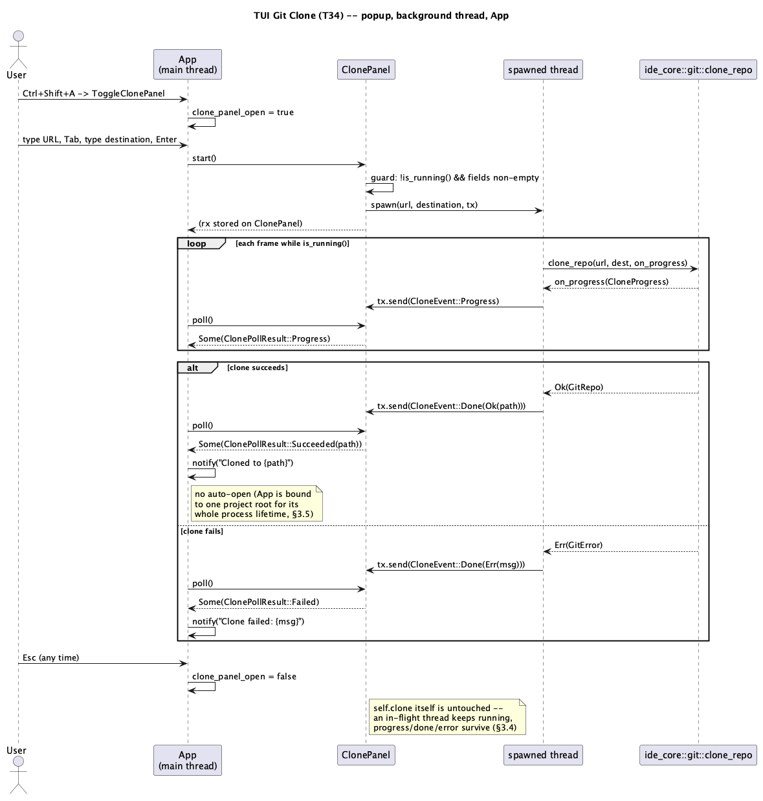

# TUI Git Clone (T34)

## 1. Purpose

Ports the "Clone Repository" half of `docs/features/git-remote.md`
("Batch E") to `ide-tui` — a keyboard-only popup that clones a remote URL
to a local destination via `ide_core::git::clone_repo`, with live
progress. `ide-core`'s `clone_repo` already exists and needs no changes;
this is a `rust-tui-dev`-only run.

`git-remote.md`'s other half (the compact launcher screen) does not port:
`ide-tui` has no "no project open" launcher state at all (`ide_tui::main`
always resolves *some* directory before `App::new` ever runs — an
explicit CLI argument, the last-remembered project (T21), or the current
working directory; see `docs/features/tui-persist-last-project.md`
§`resolve_root`). Cloning in `ide-tui` is therefore always something you
do *from inside* an already-open project, as a convenience ("check out
another repo somewhere while I have this one open"), not a first-launch
flow — the same distinction `docs/features/tui-scratch-files.md` and
`tui-claude-panel.md` already draw between an `ide-ui`-only concept and
its keyboard-only equivalent.

A second, more consequential paradigm gap: `App::new(root: PathBuf)`
binds one project root for the process's entire lifetime — nothing
anywhere in `crates/tui/**` can swap `self.project`/`self.tree`/`self.git`
etc. for a different root at runtime (unlike `ide-ui`'s `open_project`,
which `git-remote.md` §2.3/§3.6 calls on a successful clone). So a
successful clone in `ide-tui` does **not** auto-open the cloned project —
it reports the path and tells the user to relaunch there. See §3.5.

Not security-sensitive on its own (no new `ide-core` code, no new
credential/TLS/path-validation logic — `clone_repo` already carries all
of that, already `hacker`-reviewed under `git-remote.md`), but
`crates/tui/src/git_panel.rs` is unconditionally on `CLAUDE.md`'s
security-sensitive-paths list and this run adds a new sibling module that
feeds a URL and a filesystem destination, both raw user keystrokes, into
that same crate's git surface — `hacker` still runs on this role before
merge, scoped to confirming no new path/URL-handling logic was
introduced (see §6).

## 2. Interface / API

### 2.1 `crates/tui/src/clone_panel.rs` (new)

```rust
/// Mirrors `ide_core::git::CloneProgress`, trimmed to the two fields the
/// popup actually displays -- same shape as `crates/ui/src/clone_panel.rs`'s
/// own `CloneProgress`.
#[derive(Debug, Clone, Copy, PartialEq, Eq, Default)]
pub struct CloneProgress {
    pub received_objects: usize,
    pub total_objects: usize,
}

impl From<ide_core::git::CloneProgress> for CloneProgress {
    fn from(p: ide_core::git::CloneProgress) -> Self {
        Self { received_objects: p.received_objects, total_objects: p.total_objects }
    }
}

enum CloneEvent {
    Progress(CloneProgress),
    Done(Result<PathBuf, String>),
}

/// What `poll` hands back the one frame something changed -- same richer-
/// than-`bool` shape as `ide-ui`'s `ClonePollResult`, for the same reason
/// (the caller needs to tell a progress tick apart from the terminal
/// frame).
#[derive(Debug, Clone, PartialEq, Eq)]
pub enum ClonePollResult {
    Progress,
    Succeeded(PathBuf),
    Failed,
}

/// Which of the popup's two text fields `Tab`/`BackTab` currently target --
/// a 2-way instance of `git_panel.rs`'s existing `WorktreeAddField` shape
/// (`next`/`prev`, wrapping).
#[derive(Debug, Clone, Copy, PartialEq, Eq, Default)]
pub enum ClonePanelField {
    #[default]
    Url,
    Destination,
}

impl ClonePanelField {
    pub fn next(self) -> Self {
        match self {
            Self::Url => Self::Destination,
            Self::Destination => Self::Url,
        }
    }
    pub fn prev(self) -> Self {
        self.next() // 2-way toggle: `Tab` and `Shift+Tab` both flip it.
    }
}

/// Always alive on `App` (`app.clone: ClonePanel`), visibility gated by
/// `App.clone_panel_open: bool` -- the same "always-alive `T`, separate
/// visibility flag" split `docs/features/tui-tool-window-docking.md` (T33)
/// established for the bottom-dock panels, applied here to a standalone
/// modal for the same underlying reason: a background clone must keep
/// running, and its progress must stay readable, across the popup being
/// closed and reopened (§3.4/§4).
#[derive(Default)]
pub struct ClonePanel {
    pub url: String,
    pub destination: String,
    pub field: ClonePanelField,
    pub progress: Option<CloneProgress>,
    pub error: Option<String>,
    /// Set on the frame a clone finishes successfully; cleared only when
    /// a new clone is started. Unlike `ide-ui`'s `ClonePollResult::
    /// Succeeded(PathBuf)` (consumed once, immediately, by `open_project`),
    /// `ide-tui` has nothing to hand this off to (§1) -- it has to persist
    /// somewhere the popup can keep displaying it.
    pub done: Option<PathBuf>,
    rx: Option<Receiver<CloneEvent>>,
}

impl ClonePanel {
    pub fn is_running(&self) -> bool { self.rx.is_some() }

    /// No-op if a clone is already in flight (`ide-ui`'s own `CloneState::
    /// start` convention) or if `url`/`destination` (trimmed) is empty --
    /// the latter is a purely local, no-thread-spawned short-circuit
    /// avoiding a guaranteed-immediate `GitError::EmptyUrl` round trip
    /// through a background thread for a case the popup can already see
    /// from its own text fields.
    pub fn start(&mut self);

    /// Call once per frame while `rx.is_some()` (`App`'s per-frame poll
    /// block, alongside `poll_docker`/`poll_k8s`/etc.) -- drains via
    /// `try_recv()` in a loop, same as every other channel-backed panel in
    /// this crate.
    pub fn poll(&mut self) -> Option<ClonePollResult>;
}
```

`start`'s spawned thread body is byte-for-byte the same shape as `ide-ui`'s
`CloneState::start` (`crates/ui/src/clone_panel.rs:63-82`): call the
blocking `ide_core::git::clone_repo(&url, &dest, |p| { let _ =
tx.send(CloneEvent::Progress(p.into())); })` off the main thread, then
send `CloneEvent::Done(result.map(|repo| repo.workdir().to_path_buf())
.map_err(|e| e.to_string()))`.

### 2.2 `crates/tui/src/commands.rs`

New palette-only entry, same shape as `ToggleDockerPanel`/`ToggleGitPanel`:

```rust
Action::ToggleClonePanel, // new Action variant

Command {
    id: "ToggleClonePanel",
    title: "Clone Repository",
    // Palette-only -- no JetBrains macOS keymap entry this project
    // tracks binds a clone dialog to a fixed key.
    binding: None,
    action: Action::ToggleClonePanel,
},
```

### 2.3 `crates/tui/src/ui.rs`

New `fn render_clone_panel(frame: &mut Frame, app: &App, area: Rect)`,
called from `render()`'s existing flat top-level-modal dispatch sequence
(`ui.rs:127`+, one `if app.X { render_x(frame, app, size); }` per modal —
`palette`, `goto`, `notifications_open`, …, `git_panel.is_some()` at
line 157, and so on):

```rust
if app.clone_panel_open {
    render_clone_panel(frame, app, size);
}
```

`render_clone_panel` centers a small popup over `area` (mirrors the
worktrees popup's own `Clear`-plus-centered-`Rect` construction), renders
the two labeled fields (`URL`, `Destination`) with the current
`app.clone.field` highlighted the same way `render_git_worktrees_popup`'s
add-form already highlights `add_field`, and the one status line
described in §3.1.

### 2.4 `crates/tui/src/app.rs`

- `App` gains two new fields: `clone: ClonePanel` (default) and
  `clone_panel_open: bool` (default `false`).
- `run_action`'s new arm: `Action::ToggleClonePanel =>
  self.toggle_clone_panel()`.
- `fn toggle_clone_panel(&mut self)`: flips `clone_panel_open`. Opening
  does **not** reset `self.clone`'s fields (mirrors `GitLogDockState`
  "never resets" — §3.4 explains why, unlike the worktrees-popup
  precedent that *does* reset on close).
- `handle_key`'s precedence chain gains one more true-modal check,
  ordered with the other top-level modals (`git_panel`, `goto`,
  `notifications`, …), **above** the global keymap lookup:
  ```rust
  if self.clone_panel_open {
      return self.handle_clone_panel_key(key);
  }
  ```
  Unlike T33's Docker/K8s sub-modal fix, this needs no special-cased
  pre-keymap intercept of its own — it sits at the same precedence tier
  every other true modal already occupies, above the keymap lookup by
  construction, not inside a dock's lower-priority `self.focus`
  fallthrough. `any_popup_open()` gains the matching `|| self.clone_panel_open`.
- New `fn handle_clone_panel_key(&mut self, key: KeyEvent) -> LoopSignal`
  (§3.3).
- New per-frame poll call, alongside `poll_docker`/`poll_k8s`/etc.:
  ```rust
  if self.clone.is_running() {
      match self.clone.poll() {
          Some(ClonePollResult::Succeeded(path)) => {
              self.notify(format!("Cloned to {}", path.display()));
          }
          Some(ClonePollResult::Failed) => {
              if let Some(e) = &self.clone.error {
                  self.notify(format!("Clone failed: {e}"));
              }
          }
          Some(ClonePollResult::Progress) | None => {}
      }
  }
  ```
  (`self.clone.done`/`self.clone.error` are already updated by `poll()`
  itself, per §2.1 — this call site only decides what additionally
  surfaces through the existing notification log, the same
  `notify()` mechanism every other background-completion event in this
  crate already uses.)

## 3. Behaviour

### 3.1 Opening and layout

`ToggleClonePanel` (command palette only, `Ctrl+Shift+A`) opens a small
centered popup (mirrors the worktrees-popup's `Clear`-plus-centered-`Rect`
convention) with two labeled text fields (`URL`, `Destination`) and a
one-line status area below them showing, in priority order: `self.clone.
error` if `Some`, else a progress line if `self.clone.progress.is_some()`
(`"{received_objects}/{total_objects} objects"`, or a bare "Cloning…" if
`total_objects == 0` — libgit2 doesn't always know the total until
partway through, matching `git-remote.md` §3.6's indeterminate-before-
first-callback note), else `"Cloned to {path}"` if `self.clone.done` is
`Some`, else nothing.

### 3.2 Field editing

`Tab`/`BackTab` cycle `self.clone.field` between `Url`/`Destination`
(wrapping, 2-way). `Char`/`Backspace` edit whichever field is current,
guarded the same way `handle_git_worktree_add_key` already guards its own
text entry (`Char(c) if !key.modifiers.contains(KeyModifiers::CONTROL)`,
so a stray `Ctrl+`-chord while typing is swallowed rather than inserting a
control character).

### 3.3 Submit, cancel, dismiss

`fn handle_clone_panel_key`:

- `Esc` → `clone_panel_open = false`. Does **not** touch `self.clone` —
  an in-flight clone keeps running in the background (its thread holds no
  reference to `clone_panel_open`), and `self.clone.progress`/`error`/
  `done` all survive to be shown again next time the panel opens (§3.4).
- `Tab`/`BackTab` → cycle `field` (§3.2).
- `Enter` → if `!self.clone.url.trim().is_empty() &&
  !self.clone.destination.trim().is_empty() &&
  !self.clone.is_running()`, call `self.clone.start()`. A no-op otherwise
  (empty field, or a clone already running) — matches `ide-ui`'s own
  "Clone" button being disabled under the same two conditions
  (`git-remote.md` §3.6).
- `Char`/`Backspace` → field editing (§3.2), except while a clone is
  running: both fields keep their last-submitted values visible but stop
  accepting edits. This is a UI-clarity guard, not a correctness one —
  `start()`'s spawned closure already moved an owned copy of `url`/`dest`
  in before the thread started, so editing the displayed fields mid-run
  could never actually change what the running clone is doing; blocking
  the edit just avoids the displayed value looking like it belongs to a
  clone it doesn't.

### 3.4 Why the popup doesn't reset on close

`WorktreesPopupState` resets fully on close (`app.rs`'s
`self.git.worktrees_popup = WorktreesPopupState::default()`) because it
holds no background thread — there's nothing async whose result would be
lost. `ClonePanel` is different: `start` detaches a thread that keeps
running (and, if closed, keeps sending into a channel nobody's currently
draining) regardless of `clone_panel_open`. Resetting `self.clone` on
close would either leak that thread's eventual result into a `try_recv()`
buffer nobody reads (harmless but wasteful) or, worse, `self.rx = None`
on close would make `is_running()` lie (a clone is still physically
running, just untracked) and let the user immediately `start()` a second,
concurrent clone into a different destination while the first is still
writing to disk. So: closing only ever changes `clone_panel_open` (this
doc's own new field), never `self.clone` itself — the same reasoning
T33 already established for why Docker/Cargo/K8s moved off
`Option<T>`-drop-based visibility in the first place.

### 3.5 No auto-open on success

On `ClonePollResult::Succeeded(path)`, `ide-ui` calls `open_project` and
the launcher screen disappears, replaced by the newly cloned project. As
established in §1, `ide-tui` has no equivalent — `App` is bound to one
`Project`/`GitRepo`/tree/tab set for its whole process lifetime, and nothing
in `crates/tui/**` (or its `rust-ui-dev`-owned `ide-tui` caller, the `ide
--tui` unified binary) currently tears that down and rebuilds it against
a different root while running. So the popup's own status line (§3.1)
shows `"Cloned to {path}"` until the user starts a new clone, and the
`notify()` call (§2.4) additionally puts the same path into the
persistent notification log (`Ctrl+Shift+N` opens it, per `docs/features/
tui-shell-and-editor.md`) so it's not lost if the user was looking
elsewhere when the clone finished. The user opens the cloned project by
relaunching (`ide --tui <path>` or `ide-tui <path>`) themselves — a real,
documented capability gap, not a silently missing feature.

## 4. Constraints & invariants

- At most one clone in flight per `ClonePanel` — `start` is a no-op while
  `is_running()`.
- `start` is also a no-op for an empty (post-trim) `url` or `destination`
  — purely a local UI nicety; `ide_core::git::clone_repo` still enforces
  its own `EmptyUrl`/`DestinationNotEmpty` checks independently for any
  caller that doesn't go through this popup (there are none today, but
  the invariant lives in `ide-core`, not here — see `git-remote.md` §4).
- `poll` never blocks — `try_recv()` only.
- Closing the popup (`clone_panel_open = false`) never cancels an
  in-flight clone and never discards `self.clone`'s state (§3.4).
- No new credential, TLS, or path-validation logic anywhere in this
  diff — every trust decision in the clone flow is made inside
  `ide_core::git::clone_repo`, already covered by `git-remote.md` §3.3/
  §3.4/§3.5 and its own `hacker` pass. This role only feeds that
  function two raw strings a human typed into a terminal, then displays
  whatever `Result`/progress it reports.

## 5. Examples

**Happy path:** `Ctrl+Shift+A` → "Clone Repository" → popup opens, `Url`
field focused. Type `https://github.com/rust-lang/log.git`, `Tab`, type
`/tmp/log-clone`, `Enter`. Status line shows `"Cloning…"`, then
`"143/612 objects"` climbing, then `"Cloned to /tmp/log-clone"`; the
notification log also gets an entry. `Esc` closes the popup; reopening it
via `Ctrl+Shift+A` still shows `"Cloned to /tmp/log-clone"` until a new
clone is started.

**Cancel mid-flight (UI-only, clone keeps running):** same as above but
`Esc` right after `Enter`, before the clone finishes. The popup closes
immediately; the clone keeps running in the background. Reopening the
panel later shows whatever `self.clone.progress`/`done`/`error` is
current at that point — possibly already `"Cloned to …"` if it finished
while the popup was closed.

**Validation failure:** `Url` left empty, `Destination` set, `Enter` →
no-op (§3.3) — no thread spawned, no status change.

## 6. Dependencies & integration points

No new dependency (`ide_core::git::clone_repo` already exists;
`std::sync::mpsc`/`std::thread` are already used by
`cargo_panel.rs`/`docker_panel.rs`/`k8s_panel.rs`). Integration points:
`ide_core::git::{clone_repo, CloneProgress}` (reused, not modified),
`App::notify` (existing notification log), and the same background-
thread-plus-channel-plus-per-frame-`poll()` convention `cargo_panel.rs`
already established in this crate.

Security-sensitive review scope: `hacker` runs on this role (per
`crates/tui/src/git_panel.rs`'s unconditional listing in `CLAUDE.md`),
scoped to confirming (a) no new URL-scheme filtering, TLS/host-key, or
credential-handling logic was introduced here (it shouldn't be — all of
that lives in already-reviewed `ide_core::git::clone_repo`), (b) the raw
`destination` string this popup collects reaches `clone_repo` unmodified,
with no separate `std::fs` path construction of this role's own that
could reintroduce a traversal bug `git-remote.md` §3.5 already closed at
the `ide-core` layer, and (c) the background-thread/channel wiring can't
be driven into a double-spawn (two concurrent clones into the same or
different destinations) by any key sequence.

## 7. Diagram



## Revision notes

1. Added §2.3 (`crates/tui/src/ui.rs`), naming the new
   `render_clone_panel` function and its call site in `render()`'s
   existing flat top-level-modal dispatch — the original draft only
   specified `clone_panel.rs`/`commands.rs`/`app.rs` and left the render
   call site to be inferred. Renumbered the old §2.3 (`app.rs`) to §2.4
   and fixed the one cross-reference to it in §3.5.
2. §3.3's justification for blocking field edits while a clone is running
   was imprecise — it framed this as preventing the running clone from
   being changed, but `start()`'s spawned closure already owns a moved
   copy of `url`/`dest` by that point, so editing the displayed fields
   could never affect it. Reworded to state the real reason: UI clarity,
   not correctness.
