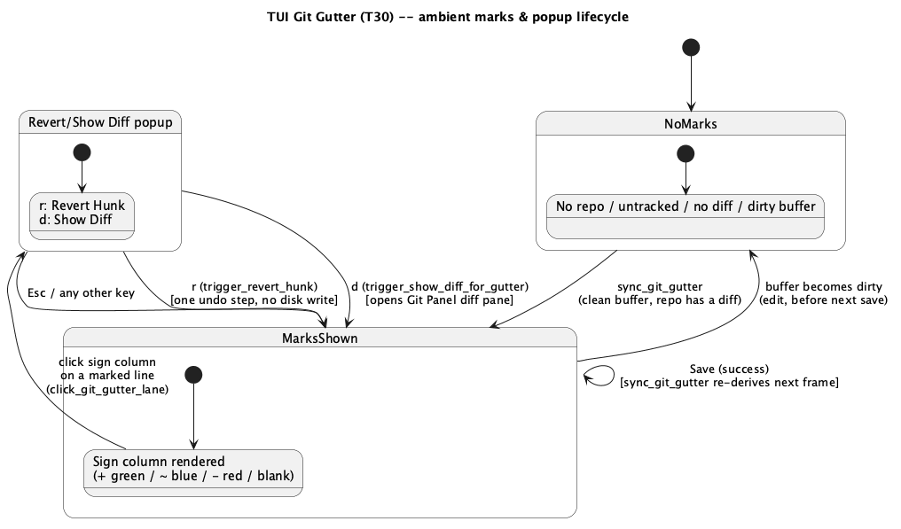

# TUI Git Gutter (T30)

## 1. Purpose

Ports `docs/features/editor-git-gutter.md` (**E7**) to `ide-tui`: a
per-line indicator of lines added, modified, or deleted (relative to
`HEAD`) in the currently open file, plus a small popup offering "Revert
Hunk" and "Show Diff". `ide-core`'s side (`GitRepo::diff_file`,
`DiffHunk`, `DiffLine`) is already merged and already in use by this
crate's own `git_panel.rs` diff pane — this is a `crates/tui/**`-only
diff, same shape as every prior `T`-item.

### 1.1 Why this isn't a literal gutter port, and how it composes with blame

`ide-tui` has no gutter column at all (`tui-blame.md` §1.1 already
established this — no line numbers, no marker lane). Unlike blame,
though, a git-gutter mark carries no text to display, only a *kind*
(`Added`/`Modified`/`Deleted`) — closer in shape to the debugger's
breakpoint indicator (`tui-debugger.md` §2.4's background wash) than to
blame's per-line label. A background wash still doesn't fit well here,
though: three simultaneous kinds (plus "no mark") need to stay visually
distinct at a glance the way a colored `+`/`~`/`-` glyph does and a
uniform wash color doesn't, and washing the *whole* line risks visually
merging with the debugger's own breakpoint wash if both are ever active
on the same line. Instead: a fixed 2-column **sign column** (a single
colored glyph plus a separator space) prepended to each line, matching
the well-established terminal convention real gutter-diff tools already
use (`vim-gitgutter`'s `+`/`~`/`_` signs) and this crate's own diff pane
color convention (`ui.rs`'s `diff_line_to_line`: `Color::Green` for
`Added`, `Color::Red` for removed/`Deleted`; `Modified` gets `Color::Blue`,
matching `ide-ui`'s own `diff_modified_fg` precedent of giving a
paired-remove-and-add line its own color rather than reading as a plain
addition).

Unlike blame, this lane has **no toggle** — it mirrors `ide-ui`'s own
design exactly: always on whenever the active tab's file sits inside a
git repository and the buffer isn't dirty (§3.1), ambient state like the
git-status-derived working-tree diff `sync_git_working_tree_diff` already
computes every frame, not an opt-in annotation layer like blame.

Because both lanes can be active on the same tab at once (blame is
per-tab opt-in; git-gutter is ambient), they compose left-to-right in the
same order `ide-ui`'s own `editor/geometry.rs` establishes for its
gutter ("the gutter is an optional blame lane, **then** a marker lane"):
blame lane first (0 or `BLAME_LANE_WIDTH` columns), then the git-gutter
sign column (0 or 2 columns) immediately after it, then the buffer's own
text. `App::blame_lane_width()` is unchanged; a new, exactly analogous
`App::git_gutter_lane_width()` returns the second offset, and
`App::editor_lane_width()` sums both — the single value both the
mouse-click column math and `render_editor`'s native-cursor-position fix
need, for the same "two things that could drift" reason `tui-blame.md`
§2.3 collapsed its own two lane-width helpers into one.

**Zero new `ide-core` API** — `DiffHunk`/`DiffLine`/`GitRepo::diff_file`
are already merged and already used by this crate's own `git_panel.rs`
diff pane.

### 1.2 Security scope — narrower than `git_panel.rs`, but not exempt

`editor-git-gutter.md` §4 states E7's *original* `ide-ui` implementation
was not on `CLAUDE.md`'s security-sensitive list and skipped `hacker` —
true when E7 shipped. `CLAUDE.md`'s list has since been broadened (during
`tui-blame.md`/T29's own pass) to cover **any** `*_gutter.rs` file in
either crate generically, specifically citing "diff text" among the
repository-sourced content such a file renders. A `GutterMark` itself
carries no free text (`line: usize` + an enum, nothing else), but
`revert_hunk_change`'s reconstructed replacement text (`DiffLine::
Context`/`Removed` lines from the hunk, i.e. historical file content)
gets spliced directly into the **live, editable buffer** on "Revert
Hunk" — arguably a more consequential surface than blame's read-only
popup, since a bidi-override-laden line from an old commit (a "Trojan
Source" payload someone had already "fixed" in a later commit) could be
silently reintroduced into an editable file this way. `crates/tui/src/
git_gutter.rs` is already covered by `CLAUDE.md`'s existing generic
wording (`git_gutter.rs`, `blame_gutter.rs` **in either crate**) — no
`CLAUDE.md` edit is needed this run — but a `hacker` pass is required
before merge per that rule, focused on `revert_hunk_change`'s
reconstructed text reaching the buffer unsanitized. (Whether `ide-ui`'s
already-shipped E7 implementation should retroactively get the same
pass is a decision for the user, not something this run reopens on its
own — flagged here, not silently redone.)

## 2. Interface

### 2.1 `crates/tui/src/git_gutter.rs` (new — pure logic, no `ratatui`)

Ported **near-verbatim** from `crates/ui/src/editor/git_gutter.rs` (zero
`egui` dependency there already):

```rust
#[derive(Debug, Clone, Copy, PartialEq, Eq)]
pub enum GutterMarkKind { Added, Modified, Deleted }

#[derive(Debug, Clone, Copy, PartialEq, Eq)]
pub struct GutterMark {
    pub line: usize,
    pub kind: GutterMarkKind,
}

pub fn marks_from_hunks(hunks: &[ide_core::DiffHunk]) -> Vec<GutterMark>;

pub fn revert_hunk_change(
    hunks: &[ide_core::DiffHunk],
    clicked_line: usize,
    buffer: &ide_core::text::TextBuffer,
) -> Option<ide_core::text::Change>;
```

Same per-segment algorithm as `editor-git-gutter.md` §2.1 (verbatim,
unchanged): walk each hunk's lines with a `new_line` cursor starting at
`hunk.new_start - 1`; `Context` lines advance the cursor; a maximal run
of non-`Context` lines is resolved by pairing the *k*-th `Added` line
against `removed_count` (`Modified` if `k < removed_count`, else
`Added`), and any `Removed` lines left over after that pairing emit one
`Deleted` mark at the cursor's position after the run. `revert_hunk_change`
reconstructs the pre-image from `Context`+`Removed` lines and returns a
single `Change` over the hunk's new-side line range, or `None` if
`clicked_line` isn't covered.

Port every existing test in `crates/ui/src/editor/git_gutter.rs`'s
`#[cfg(test)] mod tests` alongside — hand-built `DiffHunk` fixtures, zero
`egui`/I/O dependency, carry over unchanged apart from the `use` path.

### 2.2 `crates/tui/src/git_panel.rs` — extended, not replaced

```rust
impl GitPanel {
    /// Same canonicalize + `strip_prefix` conversion `blame_for`/
    /// `show_working_tree_diff` already use -- independent of whatever
    /// `self.diff` currently shows. Empty with no repo, an untracked
    /// path, or no diff.
    pub fn hunks_for(&self, absolute_path: &Path) -> Vec<ide_core::DiffHunk>;

    /// `marks_from_hunks(&self.hunks_for(absolute_path))`.
    pub fn gutter_marks_for(&self, absolute_path: &Path) -> Vec<crate::git_gutter::GutterMark>;
}
```

No new path-provenance logic — this phase introduces no new path handling
of its own to audit, reusing the exact canonicalize+`strip_prefix`
pattern `blame_for` (T29) and `show_working_tree_diff` (T11) already
established and already had reviewed.

### 2.3 `crates/tui/src/app.rs`

New `App` fields (ambient, recomputed every frame — **not** per-`OpenBuffer`
like `blame`, since this has no toggle, matching `git.diff`/
`last_git_diff_target`'s own shape rather than `OpenBuffer.blame`'s):

```rust
/// The active tab's gutter marks, recomputed every frame `sync_git_
/// gutter` runs (§3.1) -- empty with no active tab, a dirty buffer, or
/// no repo.
pub(crate) git_gutter: Vec<crate::git_gutter::GutterMark>,
/// The path `git_gutter` answers for -- lets a render call tell "these
/// marks are for the tab on screen right now" apart from one frame of
/// staleness at a tab switch, same role `last_git_diff_target` plays.
git_gutter_path: Option<PathBuf>,
/// The buffer line a sign-column click landed on, while its "Revert
/// Hunk (r) / Show Diff (d)" popup is open. `None` when closed.
pub(crate) git_gutter_popup_line: Option<usize>,
```

New methods:

```rust
impl App {
    /// Called once per frame from `crates/tui/src/lib.rs`'s main loop,
    /// immediately alongside the existing `app.sync_git_working_tree_
    /// diff();`/`app.sync_code_actions();` calls (same file, same "runs
    /// unconditionally every frame" comment convention already used
    /// there for each sibling). Clears `git_gutter`/`git_gutter_path` on
    /// no active tab or a dirty buffer (§3.1 on why); else, only when the
    /// active tab's path differs from `git_gutter_path` (the same
    /// changed-since-last-frame guard those siblings use), recomputes
    /// from `self.git.gutter_marks_for(path)`.
    pub(crate) fn sync_git_gutter(&mut self);

    /// `2` when `self.git.is_repo()` (`GitPanel::is_repo`, already
    /// exists) **and** the active tab's buffer isn't dirty -- i.e. the
    /// same condition under which `sync_git_gutter` would (re)compute
    /// marks at all -- else `0`. Deliberately **not** based on whether
    /// `git_gutter` happens to be empty: a clean, unchanged file still
    /// inside a repo must reserve the same 2 columns a modified one
    /// does, or the lane would jump from 0 to 2 the instant the file's
    /// first hunk appears -- exactly the resize-on-arrival jitter §1.1
    /// says this lane must not have. The single source of the sign-
    /// column's reserved width, mirroring `blame_lane_width`'s own
    /// shape and single-call-site discipline (`tui-blame.md` §2.3).
    pub(crate) fn git_gutter_lane_width(&self) -> u16;

    /// `blame_lane_width() + git_gutter_lane_width()` -- the one value
    /// both the mouse-click column math and `render_editor`'s native-
    /// cursor-position fix use, so neither ever computes the combined
    /// offset independently (same "two things that could drift" concern
    /// `tui-blame.md` §2.3 already resolved for its own single lane).
    pub(crate) fn editor_lane_width(&self) -> u16;

    /// Row is relative to the editor's text area's top-left corner, same
    /// bounds-check shape as `click_blame_lane`/`click_editor_at`
    /// (`VisualLines::build` + `buf.scroll`, no-op past the buffer's
    /// last visible row/line). Maps to a buffer line, looks it up in
    /// `git_gutter` by exact line match (`GutterMark.line`, not a run --
    /// unlike blame annotations, one mark decorates exactly one line);
    /// a hit opens the popup (`git_gutter_popup_line = Some(line)`), a
    /// miss (a reserved-but-unmarked row -- most rows, since only
    /// changed lines carry a mark) does nothing.
    fn click_git_gutter_lane(&mut self, area_row: u16);

    /// Routes the git-gutter popup's two single-letter actions --
    /// `r` (Revert Hunk), `d` (Show Diff) -- checked in `handle_key`'s
    /// popup-precedence chain alongside `blame_popup`; any other key
    /// (including `Esc`) closes it, same "any key closes a confirm-style
    /// popup" convention `handle_blame_popup_key`'s default arm uses.
    fn handle_git_gutter_popup_key(&mut self, key: KeyEvent) -> LoopSignal;

    /// No-op unless `git_gutter_popup_line` and the active tab's path
    /// both resolve. Builds `revert_hunk_change` from `self.git.
    /// hunks_for(path)` against the active buffer's *current* text and,
    /// on `Some`, applies it via `Transaction::new(vec![change]).expect(
    /// "a single change never overlaps")` on the active buffer (one
    /// undo step -- `Ctrl+Z` undoes it) and closes the popup. **Never
    /// writes to disk directly** -- the user's own next `Ctrl+S`
    /// persists it, matching `editor-git-gutter.md` §3.3's rule exactly
    /// (keeps this off the write-to-disk category `CLAUDE.md`'s list
    /// otherwise names, though §1.2 above still requires `hacker` for a
    /// different reason: the *content* reaching the buffer, not the
    /// disk-write path).
    fn trigger_revert_hunk(&mut self);

    /// Closes the popup, opens the Git Panel (`toggle_git_panel`-style),
    /// and calls `self.git.show_working_tree_diff(path)` for the active
    /// tab's path -- reuses the existing diff pane wholesale rather than
    /// a hunk-scrolled sub-view, matching `editor-git-gutter.md` §3.4's
    /// own v1 simplification ("Show Diff" opens the whole file's diff,
    /// not scrolled to the clicked hunk). Also sets `state.view =
    /// GitPanelView::Log` and `state.focus = GitPanelFocus::Diff`
    /// (resetting `state.diff_scroll = 0`) on the freshly-opened panel's
    /// `GitPanelState`, the same pair `handle_git_panel_key`'s existing
    /// "Enter on commit graph" flow sets together (`app.rs:2893-2894`)
    /// -- `show_working_tree_diff` alone only populates `self.git.diff`,
    /// it does not touch panel navigation state, so without this the
    /// panel would open showing whatever view/focus it last had rather
    /// than the diff.
    fn trigger_show_diff_for_gutter(&mut self);
}
```

`handle_mouse_click`'s `hits.editor_text_area` branch (already extended
once by `tui-blame.md` §2.3) gains the second lane:

```rust
if let Some(area) = hits.editor_text_area {
    if area.contains(point.into()) {
        let col = event.column - area.x;
        let row = event.row - area.y;
        let blame_w = self.blame_lane_width();
        let gutter_w = self.git_gutter_lane_width();
        if (col as usize) < blame_w as usize {
            self.click_blame_lane(row);
        } else if (col as usize) < (blame_w + gutter_w) as usize {
            self.click_git_gutter_lane(row);
        } else {
            self.click_editor_at(col - blame_w - gutter_w, row);
        }
        self.focus = Focus::Editor;
    }
}
```

`render_editor`'s existing native-cursor `frame.set_cursor_position` call
(already carrying `+ app.blame_lane_width()` since T29) changes to
`+ app.editor_lane_width()` — the combined helper, not a second addend,
so this call site and the click-routing above always agree on the total
lane width by construction.

`handle_key`'s popup-precedence chain gains
`if self.git_gutter_popup_line.is_some() { return self.handle_git_gutter_popup_key(key); }`
alongside the existing `blame_popup` check (order between the two doesn't
matter — both can't be `Some` at once, since opening either popup routes
through the "while any popup is open, clicks are ignored entirely" rule
`tui-mouse-support.md` §3.2 already establishes, so a gutter click can't
land while the blame popup is open and vice versa). `any_popup_open`
gains `|| self.git_gutter_popup_line.is_some()`.

`trigger_save_active` and `reload_tab_from_disk` need **no** new call —
unlike `blame`'s explicit `refresh_blame_if_on`, `sync_git_gutter` already
re-derives from disk every frame the buffer isn't dirty, and a save
transitions `is_dirty()` from `true` to `false` in the same frame, so the
very next `sync_git_gutter` call picks it up automatically (§3.1's own
dirty-buffer-clears-marks rule already produces "marks reappear the frame
after the next save" for free, with no separate hook needed).

### 2.4 `crates/tui/src/ui.rs`

`render_editor`'s per-row loop gains a second prepend, executed **before**
`tui-blame.md` §2.4's existing blame prepend in the same per-row closure
(order matters here: each prepend is a front-insert into `spans`, so
running git-gutter's first and blame's second is what makes blame end up
outermost/leftmost of the two, per §1.1's stated lane order — blame lane,
then git-gutter lane, then buffer text). Whether the fold-marker append
runs before or after either prepend is irrelevant (fold markers append at
the row's *end*, unrelated to either leading lane):

```rust
if app.git_gutter_lane_width() > 0 {
    let mark = app.git_gutter.iter().find(|m| m.line == line);
    let (glyph, color) = match mark.map(|m| m.kind) {
        Some(GutterMarkKind::Added) => ("+", Color::Green),
        Some(GutterMarkKind::Modified) => ("~", Color::Blue),
        Some(GutterMarkKind::Deleted) => ("-", Color::Red),
        None => (" ", Color::DarkGray),
    };
    let mut spans = vec![Span::styled(format!("{glyph} "), Style::default().fg(color))];
    spans.extend(styled.spans);
    styled = Line::from(spans);
}
```

Same rebuild-the-`Line`-from-a-new-`spans`-vec technique `tui-blame.md`
§2.4's own prepend uses (`ratatui::text::Line` has no in-place
"push to front" method) — applied **before** blame's own prepend runs in
`render_editor`'s per-row closure (this block's `styled.spans` input is
the un-prefixed line; blame's own prepend, running second, then wraps
around this block's output), so blame's span ends up outermost/leftmost
of the two in the final `spans` vec, matching §1.1's stated lane order
(blame lane, then git-gutter lane, then buffer text).

New `render_git_gutter_popup(frame: &mut Frame, app: &App, area: Rect)`:
a small fixed-size popup (same `clamp`-to-small-box shape
`render_git_branches_popup` uses, not the growing shape `render_blame_
popup` needed — this popup's content is two fixed action lines, never
variable-length prose), title `"Git Gutter  (r: Revert Hunk, d: Show
Diff, Esc: close)"`, body listing the two actions. Rendered from `render()`
's dispatch alongside the other single-purpose popups, gated on
`app.git_gutter_popup_line.is_some()`.

## 3. Behaviour & edge cases

### 3.1 Dirty buffers show no marks

Identical rule to `editor-git-gutter.md` §3.1, ported verbatim:
`GitRepo::diff_file` diffs the on-disk file against `HEAD` and has no
notion of an editor's live, unsaved content. `sync_git_gutter` clears
`git_gutter`/`git_gutter_path` whenever the active tab's buffer
`is_dirty()`, so marks never attach to line numbers that no longer match
what's on screen; they reappear the frame after the next successful
save (§2.3's note on why no extra save-hook is needed here, unlike
blame).

### 3.2 Click-and-popup

Clicking the sign column on a marked line opens the popup; clicking a
reserved-but-blank row (most rows) is a no-op, exactly `click_blame_
lane`'s own "miss" behavior. Clicking a different mark while the popup
is already open can't happen — per `tui-mouse-support.md` §3.2, a click
is entirely ignored while any popup (including this one) is open, so the
popup must first close (any key) before a second gutter click can land;
this differs from `ide-ui`'s own click-anywhere-to-move-the-popup
convenience (§3.2 of the GUI doc), a deliberate simplification consistent
with every other popup this crate already has.

### 3.3 Revert Hunk never touches disk directly

`trigger_revert_hunk` applies through `Buffer::apply` — the same mutation
entry point every keystroke, paste, and code action already goes
through — so it's one ordinary undo step, `Ctrl+Z` undoes it, and nothing
reaches disk until the user's own next save. Matches `editor-git-
gutter.md` §3.3 exactly.

### 3.4 What this phase doesn't cover (matches `ide-ui`'s own v1 cuts)

- A deletion at the true end of the file has no following line to attach
  its marker to — it simply doesn't render (§2.1, ported as-is).
- "Show Diff" opens the whole file's diff pane, not scrolled to the
  clicked hunk.
- No hover preview of a hunk's content before clicking.
- Only the three kinds above — no staged-vs-unstaged distinction (this
  project's git integration doesn't surface that split anywhere else in
  either frontend).
- No default keybinding for anything in this phase — the sign column has
  no keyboard-only equivalent of a click (unlike blame's `ShowBlame
  ForCurrentLine` fallback, T29's own deliberate addition): a git-gutter
  mark's *position* is exactly what's being pointed at, so a
  caret-position-based keyboard fallback would just duplicate whatever
  line the caret already sits on — lower value than blame's fallback,
  and not requested. Not adding one is a deliberate scope cut, not an
  oversight.

## 4. Constraints & invariants

- `crates/tui/src/git_gutter.rs`'s two pure functions never touch
  `ratatui`/`crossterm`/disk I/O — ported verbatim from `crates/ui/src/
  editor/git_gutter.rs`.
- The sign column's reserved width never varies per-frame based on mark
  *content* — `git_gutter_lane_width()` is derived from `self.git.is_repo()`
  plus "buffer not dirty" (§2.3), never from whether `git_gutter` itself
  happens to be empty, so a clean file with zero current hunks reserves the
  same 2 columns a modified one does and the lane never resizes the instant
  a hunk appears or disappears — the same "gutter must not resize as marks
  arrive" invariant `editor-git-gutter.md` states for `ide-ui`'s own
  geometry, load-bearing here for the same click-routing-and-cursor-
  position-agreement reason `tui-blame.md` §4 already states for its own
  lane.
- `revert_hunk_change`'s reconstructed text is inserted through the
  ordinary `Transaction`/`Buffer::apply` path — no direct disk write, no
  new subprocess, no new user-supplied path (§1.2, §3.3).
- Every `hunks_for`/`gutter_marks_for` path argument is the active tab's
  own already-open, already-validated path — no new path-provenance logic
  (§2.2).

## 5. Examples

```rust
// A file with one modified line: sync_git_gutter (clean buffer, repo
// present) populates app.git_gutter with one Modified mark.
// render_editor shows a blue "~ " prefix on that line, blank elsewhere.

// Clicking the "~ " prefix opens the popup:
app.handle_mouse(mouse_event(MouseEventKind::Down(MouseButton::Left), col, row), &hits);
// app.git_gutter_popup_line == Some(line)

app.handle_key(plain_key(KeyCode::Char('r'))); // Revert Hunk
// the buffer's line is now the pre-image text, one undo step, popup closed
```

## 6. Dependencies & integration points

- Builds on already-merged `ide-core` (`GitRepo::diff_file`, `DiffHunk`,
  `DiffLine`) and this crate's own `T11` `GitPanel` (`diff_file`'s
  canonicalize+`strip_prefix` pattern, already reused twice: `T11`'s
  `show_working_tree_diff`, `T29`'s `blame_for`).
- `crates/tui/src/lib.rs`'s main per-frame loop gains one new call,
  `app.sync_git_gutter();`, alongside the existing `sync_git_working_tree_
  diff`/`sync_code_actions`/etc. calls at lines ~202-212 -- without this
  wiring `git_gutter` never populates and the lane never renders.
- Interacts with `docs/features/tui-mouse-support.md` (click routing,
  "while any popup is open, clicks are ignored") and `docs/features/
  tui-blame.md` (the combined lane-width composition, §1.1/§2.3 above).
- **Security-sensitive** — §1.2 above. A `hacker` pass follows this
  phase's `rev` approval, focused on `revert_hunk_change`'s reconstructed
  text reaching the live buffer: construct a hunk whose pre-image text
  contains an unterminated bidi override (or other adversarial content)
  and confirm what actually lands in the buffer after "Revert Hunk", not
  just read the code and assume it's inert plain text.

## 7. Diagrams


