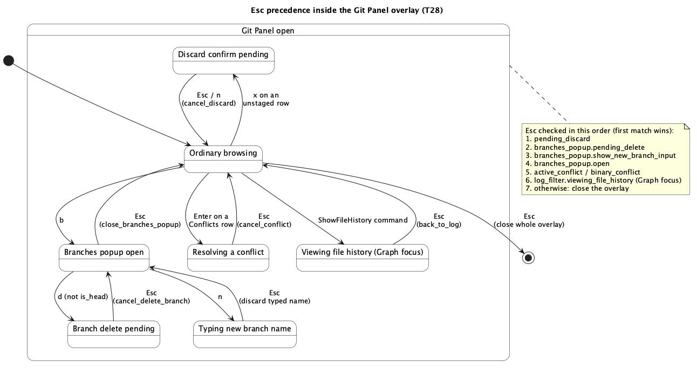

# TUI Git Staging, Branches & Log Filters (T28)

## 1. Purpose

`docs/features/tui-git-panel.md` (`T11`) ported `ide-ui`'s Source Control
panel as it stood at that time: commit graph, unified diff, three-way
conflict resolution. Since then `ide-ui`'s `GitPanel`
(`crates/ui/src/git_panel.rs`) grew three more feature slices —
`git-commit-and-staging.md` (**E1**: working-tree status, stage/unstage/
discard, commit/amend), the *branch* half of `git-branches-and-blame.md`
(**E2**: list/create/checkout/delete/merge, reusing **E1**'s existing
conflict-resolution flow for merge conflicts), and `git-log-viewer.md`
(**E3**: filter the graph by branch/author/path/date/message, plus
"Show History of File"). `ide-tui`'s Git Panel has none of this yet — this
phase closes that gap, extending the same overlay `T11` already built
rather than adding a new one.

**Explicitly out of scope for this phase** (each is its own future
`T`-numbered run):

- **Blame** (**E2**'s other half, `git-branches-and-blame.md` §2.2.3) —
  needs a new per-line rendering decision in the editor (a blame lane,
  analogous to `T27`'s breakpoint background-wash) plus a commit-detail
  popup neither of which this phase's scope (the Git Panel overlay itself,
  no editor changes) touches. A future `T29`.
- **Worktrees** (**E8**, `git-worktrees.md`) — that doc's own §1 states
  plainly: *"This phase is GUI-only; `ide-tui` has no Git panel
  worktree-adjacent UI to extend yet... A TUI port, if wanted later,
  follows the established `T`-track process independently."* Most of
  **E8**'s actual scope (open-in-a-new-OS-window, a multi-window
  open-projects registry, a startup restore prompt) has no meaningful
  terminal equivalent at all — `ide-tui` has no concept of "a second
  window" the way a second OS window is for `ide-ui`. Left alone, per that
  doc's own instruction, for whichever future run wants to design a
  TUI-appropriate subset (list/add/remove worktrees only, almost
  certainly, dropping the window-management two-thirds of that doc
  entirely) rather than assumed here.
- **Hunk-level staging** — `git-commit-and-staging.md` §1 itself scopes
  this out of **E1** for `ide-ui` too ("file-level staging only... revisit
  as a fast-follow"); nothing to port that doesn't exist yet.

**Zero new `ide-core` API** — every type and method this phase's
`crates/tui/src/git_panel.rs` additions call
(`WorkingTreeStatus`/`StatusEntry`/`ChangeKind`, `GitRepo::status`/
`stage_path`/`unstage_path`/`discard_path`/`commit`; `BranchInfo`,
`GitRepo::branches`/`create_branch`/`switch_branch`/`delete_branch`/
`merge_branch`, `MergeOutcome`; `CommitLogFilter`, `GitRepo::commit_graph`'s
existing two-argument form (already the signature `T11`'s port built
against — see that doc's `refresh`, which already passes
`&CommitLogFilter::default()`), `GitRepo::file_history`) is already merged,
already `hacker`-reviewed for the `ide-core`/`ide-ui` halves of **E1**/
**E2**/**E3**. This is a `crates/tui/**`-only diff, same shape as every
prior `T`-item.

### 1.1 Why this ports as one phase, not three

`git-commit-and-staging.md`, the branch half of `git-branches-and-blame
.md`, and `git-log-viewer.md` shipped as three separate `ide-ui` phases,
but by the time all three landed, `crates/ui/src/git_panel.rs`'s own code
had them genuinely interleaved, not three independently-portable slices:
`GitPanel::commit` (**E1**) clears `log_filter.viewing_file_history`
(**E3**'s own field) after creating a commit; `GitPanel::refresh` (`T11`'s
original method) now also resets `status`/`commit_message`/`amend`/
`pending_discard`/`merging` (**E1**) and `log_filter` (**E3**) in the same
breath it already reset `selected_commit`/`diff`/`active_conflict`/
`binary_conflict`; `merge_branch` (**E2**) calls `self.refresh(...)`,
which now touches all of the above too. Porting "just **E1**" would mean
writing a `commit()` that doesn't match its own already-`hacker`-reviewed
source, then having to revisit it again the moment **E3** landed. This
phase ports the methods as they actually exist today — see §2.1 for the
exact list — which happens to cover **E1** plus **E2**'s branch operations
plus **E3** in full.

## 2. Interface

### 2.1 `crates/tui/src/git_panel.rs` — extended, not replaced

Ported near-verbatim from the current `crates/ui/src/git_panel.rs`
(same "zero non-`ide_core` non-`egui`-touching dependency" property `T11`
already established — the additions below only ever call `ide_core::git`
and `std`). Only doc comments referencing `crates/ui`/`IdeApp` are updated
to `crates/tui`/`App`; method *bodies* are copied unchanged. New public
surface:

```rust
#[derive(Default)]
pub struct BranchesPopupState {
    pub open: bool,
    pub filter: String,
    /// `true` while `/` has put the popup into filter-typing mode (added
    /// during implementation -- see "Revision notes").
    pub typing_filter: bool,
    pub selected: usize,
    pub new_branch_name: String,
    pub show_new_branch_input: bool,
    pub pending_delete: Option<String>,
}

#[derive(Default)]
pub struct LogFilterState {
    pub branch: String,
    pub author: String,
    pub path: String,
    pub since: String,
    pub until: String,
    pub query: String,
    pub error: Option<String>,
    pub viewing_file_history: Option<PathBuf>,
}

pub struct GitPanel {
    // ...T11's existing fields unchanged...
    pub status: WorkingTreeStatus,
    pub commit_message: String,
    pub amend: bool,
    pub pending_discard: Option<PathBuf>,
    /// `true` between a `merge_branch` call that returned `Conflicts` and
    /// that merge actually being finished (or abandoned) -- purely a
    /// label/default-message concern, exactly as in `ide-ui` (§3.2 below
    /// covers this phase's one deliberate behavioural deviation:
    /// `ide-tui` closes the branches popup and jumps straight to
    /// `Conflicts` focus in this case, rather than leaving the popup open
    /// alongside an independently-reachable Conflicts UI the way `ide-ui`
    /// does -- there is no "alongside" in a modal terminal overlay).
    pub merging: bool,
    pub branches: Vec<ide_core::BranchInfo>,
    pub branches_popup: BranchesPopupState,
    pub log_filter: LogFilterState,
}

impl GitPanel {
    // ...T11's existing methods unchanged, except refresh() below...
    pub fn refresh(&mut self, project_root: &Path); // extended, see below
    pub fn sync_status(&mut self);
    pub fn stage(&mut self, path: &Path) -> Result<(), String>;
    pub fn unstage(&mut self, path: &Path) -> Result<(), String>;
    pub fn request_discard(&mut self, path: &Path);
    pub fn cancel_discard(&mut self);
    pub fn confirm_discard(&mut self) -> Result<(), String>;
    pub fn commit(&mut self) -> Result<(), String>;
    pub fn apply_log_filter(&mut self);
    pub fn clear_log_filter(&mut self);
    pub fn show_file_history(&mut self, path: &Path);
    pub fn back_to_log(&mut self);
    pub fn open_branches_popup(&mut self, project_root: &Path);
    pub fn close_branches_popup(&mut self);
    pub fn checkout_branch(&mut self, project_root: &Path, name: &str) -> Result<(), String>;
    pub fn create_branch(&mut self, project_root: &Path, name: &str, checkout: bool) -> Result<(), String>;
    pub fn request_delete_branch(&mut self, name: &str);
    pub fn cancel_delete_branch(&mut self);
    pub fn confirm_delete_branch(&mut self, project_root: &Path, force: bool) -> Result<(), String>;
    pub fn merge_branch(&mut self, project_root: &Path, name: &str) -> Result<(), String>;
}
```

`refresh()` gains exactly the lines `git-commit-and-staging.md` §2.2/
`git-log-viewer.md`'s own current source has: loads `self.status = repo.
status().unwrap_or_default()` (or `WorkingTreeStatus::default()` on the
not-a-repo branch) alongside the existing `graph`/`conflicts`/
`current_branch` loads; resets `commit_message`/`amend`/`pending_discard`/
`merging` to their defaults; resets `log_filter = LogFilterState::
default()`. **`branches` is not reloaded here** — verified against
`crates/ui/src/git_panel.rs`'s own `branches` field doc comment: it is
lazily loaded only by `open_branches_popup` and refreshed after every
mutating branch operation, deliberately never by `refresh()` itself (the
comment's own reasoning: a manual Refresh shouldn't pay for a branch
listing nobody's currently looking at). `ide-tui`'s port keeps this exact
laziness — `branches` starts (and stays) empty until the branches popup is
opened the first time. Every method's
behaviour, error handling, and path-provenance discipline is exactly as
documented in `git-commit-and-staging.md` §3, `git-branches-and-blame.md`
§2.1/§3 (branch operations only — ignore that doc's blame sections), and
`git-log-viewer.md` §3 — this doc does not repeat it. Two private free
functions come along with `apply_log_filter`/`build_log_filter`:
`non_empty` and `parse_date_bound` (plus `parse_date_bound`'s own
`days_in_month`/`days_from_civil` helpers) — ported verbatim, **including**
the fixed-width-digit validation `git-log-viewer.md`'s own revision notes
describe (`docs/security-findings/git-log-viewer-ui-2026-09-02.md` finding
1: an unbounded-width year string overflowed `days_from_civil`'s
arithmetic before that fix landed). Porting the post-fix code means this
phase inherits that fix for free — `rev`/`hacker` should confirm the width
check made it across, not re-derive the vulnerability from scratch.

### 2.2 `crates/tui/src/app.rs`

```rust
#[derive(Clone, Copy, PartialEq, Eq, Default)]
enum GitPanelView {
    #[default]
    Log,      // T11's existing Graph/Conflicts/Diff/(new)Filter foci
    Changes,  // new: staged/unstaged status + commit message + amend
}

#[derive(Clone, Copy, PartialEq, Eq, Default)]
enum GitPanelFocus {
    #[default]
    Graph,
    Conflicts,
    Diff,
    Filter, // new -- Log view's log-filter-bar focus
}

#[derive(Clone, Copy, PartialEq, Eq, Default)]
enum ChangesFocus {
    #[default]
    Staged,
    Unstaged,
    Message,
}

#[derive(Clone, Copy, PartialEq, Eq, Default)]
enum FilterField {
    #[default]
    Branch,
    Author,
    Path,
    Since,
    Until,
    Query,
}

#[derive(Default)]
pub(crate) struct GitPanelState {
    view: GitPanelView,           // new
    focus: GitPanelFocus,         // T11, `Filter` variant added
    changes_focus: ChangesFocus,  // new
    filter_field: FilterField,    // new
    graph_selected: usize,
    conflicts_selected: usize,
    diff_scroll: u16,
    staged_selected: usize,       // new
    unstaged_selected: usize,     // new
}
```

`GitPanelFocus::next` (T11's existing cycle helper) grows one more stop:
`Graph → Conflicts (skipped if empty) → Diff → Filter → Graph`. `Tab`
inside `Changes` view instead cycles `ChangesFocus`: `Staged →
Unstaged → Message → Staged` (no skip conditions — an empty staged/
unstaged list is still a visitable, just-empty, list, same as `Conflicts`
being visitable-but-empty was *not* how `T11` chose to handle it; the
difference is `Conflicts` disappearing entirely when empty is what makes
`Diff` reachable on the very next `Tab` without an extra keystroke, which
matters far more for a list that's *usually* empty than for `Staged`/
`Unstaged`, which are the exact two lists a user opening this view came to
look at).

No change to `App`'s own fields beyond what `git`/`git_panel` (`T11`)
already are — `GitPanelState` above replaces `T11`'s narrower one in
place.

New methods (same neighborhood as `T11`'s `sync_git_working_tree_diff`/
`handle_git_panel_key`):

```rust
pub(crate) fn sync_git_status(&mut self);        // §3.1
fn handle_git_changes_key(&mut self, key: KeyEvent) -> LoopSignal;   // §3.3
fn handle_git_branches_key(&mut self, key: KeyEvent) -> LoopSignal;  // §3.4
fn handle_git_filter_key(&mut self, key: KeyEvent) -> LoopSignal;    // §3.5
fn trigger_git_branches(&mut self);   // `GitBranches` command entry point
fn trigger_show_file_history(&mut self); // `ShowFileHistory` command entry point
```

`handle_git_panel_key` (T11's existing dispatcher) gains the interception
layers described in §3.2 in front of its existing `Tab`/`Up`/`Down`/
`Enter`/`Esc` match, and gains `g`/`s`/`b` as new view/popup-switch keys
alongside them. `run_action` gains two new arms:

```rust
Action::GitBranches => self.trigger_git_branches(),
Action::ShowFileHistory => self.trigger_show_file_history(),
```

`close_all_overlays` is unchanged (`git_panel = None` already clears the
whole `GitPanelState`, including the new fields, via `Default`) — the same
"closing resets the browsing cursor, never `self.git`'s own data" split
`T11` already established still holds: `self.git.branches_popup`/
`self.git.log_filter`/`self.git.commit_message` persist across a Git Panel
close/reopen exactly like `self.git.graph`/`conflicts` already do,
resetting only on the next `refresh()` (which — see §1.1 — never runs
again after `App::new`, per `T11`'s own "no manual refresh" scope cut,
still true here).

### 2.3 `crates/tui/src/commands.rs`

Two new `Action`/`Command` entries, both palette-only for the same reason
`ToggleGitPanel` already is (no JetBrains macOS keymap entry exists to
translate — `git-branches-and-blame.md` §2.2.2 and `git-log-viewer.md`
§2.2 already established this for `ide-ui`'s own equivalents):

```rust
Command {
    id: "GitBranches",
    title: "Git Branches",
    binding: None,
    action: Action::GitBranches,
},
Command {
    id: "ShowFileHistory",
    title: "Show History of File",
    binding: None,
    action: Action::ShowFileHistory,
},
```

`ide-ui`'s own new command for **E1** (`git-commit-and-staging.md`) is
just the always-visible Changes section inside its one Source Control
view — no separate open/toggle command exists there to translate either
(confirmed: `crates/ui/src/command.rs` has no `Commit`-named entry despite
`docs/roadmap.md` §5.2's keymap table listing a *target* `⌘K` binding for
a future such command — it was never actually wired). `ide-tui` matches
that: reaching `Changes` view is one keystroke inside the already-open Git
Panel (`s`, §3.2), not a new top-level command.

### 2.4 `crates/tui/src/ui.rs`

`render_git_panel` (T11's existing dispatcher) branches on `state.view`:
`Log` renders exactly what `T11` already renders, with one addition (the
filter bar occupies the branch-line row when `focus == Filter`, replacing
the plain "On branch: ..." text with the six filter fields laid out
inline, the focused one reverse-styled, plus a "← Esc: Back to Log" row
instead when `log_filter.viewing_file_history.is_some()`); `Changes`
renders a new `render_git_changes(frame, app, state, area)` (two
`List`s — Staged, Unstaged — each row `path` plus a one-letter `kind`
badge, matching `git-commit-and-staging.md` §2.3's egui rendering content
translated to plain list rows, and a boxed commit-message text area below
with an `[amend]` indicator when `git.amend` is set). `branches_popup.open`
draws its own centered popup (name/branch/current-marker per row, a
new-branch input row when `show_new_branch_input`, an inline
"not fully merged — press d again to force delete" line when
`pending_delete.is_some()`) over whichever view is active underneath,
matching the existing conflict-resolution popup's own "draw over the
current view" precedent. Pure rendering — exempt from the coverage floor,
per this crate's established convention.

## 3. Behaviour

### 3.1 Status sync

`sync_git_status` runs once per frame from `lib.rs`'s run loop (new call,
alongside `T11`'s `sync_git_working_tree_diff`), unconditionally but cheap
to no-op: returns immediately if `git_panel` is closed, else calls
`git.sync_status()` — same "an open panel stays live against out-of-band
git activity" property `sync_git_working_tree_diff` already gives the
diff pane, now extended to the staged/unstaged lists too (mirrors
`git-commit-and-staging.md` §2.3's own "`sync_status` once per frame the
view renders").

### 3.2 View switching and Esc precedence

While the Git Panel is open, three keys work as view/popup switches —
*but only when the currently-focused sub-widget is a plain navigable list*
(`Graph`, `Conflicts`, `Diff`, `Staged`, `Unstaged`), never while any of
the following is intercepting keys — checked first, before `Tab`/`Up`/
`Down`/`Enter`/`Esc`'s per-view handling in §§3.3–3.5 below:

- a discard confirm (`git.pending_discard.is_some()`),
- a branch-delete confirm (`git.branches_popup.pending_delete.is_some()`),
- new-branch-name typing (`git.branches_popup.show_new_branch_input`),
- branch-filter typing (`git.branches_popup.typing_filter` — added during
  implementation, see "Revision notes"; same reasoning as new-branch-name
  typing, since typing a filter substring like "dev" would otherwise lose
  its `d` to the branches popup's own delete command),
- conflict resolution (`git.active_conflict.is_some() || git.
  binary_conflict.is_some()` — `T11`'s existing mechanism; without this,
  `b` could open the branches popup mid-resolution, a reachable state
  nothing else in this design anticipates two nested modals at once for),
- **`Message` focus** (`state.changes_focus == ChangesFocus::Message`,
  §3.3), or
- **`Filter` focus** (`state.focus == GitPanelFocus::Filter`, §3.5).

The last two are load-bearing, not a stylistic nicety: both are free-text
entry fields, and `g`/`s`/`b` are exactly the kind of letters a real commit
message or a real author/path filter is likely to contain (a message like
"Fix bug in gitignore" has all three). Without this exception, typing such
a message or filter value would silently lose every `g`/`b`/`s` character
to a view switch instead of the text field — this is a text-corrupting
bug, not a missing convenience, so it is checked as strictly as the
already-established discard/delete/new-branch-typing exceptions, not
treated as a lesser case.

- `g` — switch to `Log` view (`state.view = GitPanelView::Log`).
- `s` — switch to `Changes` view.
- `b` — `git.open_branches_popup(&self.project_root)` (works from either
  view; the popup renders over whichever view was active, §2.4).

`Esc`'s precedence, checked in this order (first match wins — this is the
full replacement for `T11`'s single-condition Esc check):

1. `git.pending_discard.is_some()` → `git.cancel_discard()`.
2. `git.branches_popup.pending_delete.is_some()` → `git.cancel_delete_branch()`.
3. `git.branches_popup.show_new_branch_input` → clear it and
   `branches_popup.new_branch_name` without closing the popup.
4. `git.branches_popup.typing_filter` → clear it (`typing_filter =
   false`) without closing the popup and without discarding the typed
   filter text (added during implementation, see "Revision notes").
5. `git.branches_popup.open` → `git.close_branches_popup()`.
6. `git.active_conflict.is_some() || git.binary_conflict.is_some()`
   (`T11`, unchanged) → `git.cancel_conflict()`.
7. `state.view == Log && state.focus == Graph && git.log_filter.
   viewing_file_history.is_some()` → `git.back_to_log()`.
8. `state.view == Log && state.focus == Filter` → `state.focus = Graph`
   without closing the panel and without discarding the typed-but-
   unapplied filter fields (this item was missing from round-1's version
   of this list — see "Revision notes" — which made this case fall
   through to item 9 and close the whole panel, contradicting §3.5's own
   "Esc leaves Filter focus, returning to Graph").
9. Otherwise → close the whole overlay (`git_panel = None`), `T11`'s
   original behaviour.

See `docs/features/diagrams/tui-git-staging-branches-and-log-filters-esc.png`
for the full decision flow.

### 3.3 `Changes` view (`git-commit-and-staging.md` port)

- `Tab`/`BackTab` cycle `ChangesFocus`: `Staged → Unstaged → Message →
  Staged`.
- `Up`/`Down` move `staged_selected`/`unstaged_selected` (clamped to that
  list's length) when `Staged`/`Unstaged` has focus; no effect on
  `Message`.
- `Enter` on `Staged` focus: `git.unstage(&status.staged[selected].path)`
  (repo-relative path, straight from `WorkingTreeStatus` — never
  reconstructed). `Enter` on `Unstaged` focus: `git.stage(...)` the
  highlighted row. `Enter` on `Message` focus: `git.commit()`, surfacing
  an `Err` via `self.status = Some(e)` (see "Revision notes" — not
  `self.notify(...)`: `status` is the convention this exact file's own
  `T11` conflict-resolution code already uses for git-panel errors,
  `notify` is a separate toast mechanism `T27`'s debug-adapter popup
  uses) — a successful commit clears `commit_message`/`amend` as a side
  effect of the ported `commit()` body itself (§2.1), nothing extra
  needed here.
- `x` on `Unstaged` focus: `git.request_discard(&status.unstaged[selected]
  .path)` — not offered on `Staged` (matches `git-commit-and-staging.md`
  §2.3: only unstaged rows get a Discard affordance). **While
  `pending_discard.is_some()`, every key is intercepted** the same way
  `T11`'s conflict-resolution mode already intercepts: `y`/`Enter` →
  `git.confirm_discard()` (surfacing an `Err` via `self.status = Some(e)`,
  same correction as `Enter` on `Message` focus above), `n`/`Esc` →
  `git.cancel_discard()` (§3.2 item 1 already covers the `Esc` case; `n`
  is the same action reachable without relying on Esc's global-precedence
  routing).
- `a` — toggles `git.amend`, available while `ChangesFocus` is `Staged` or
  `Unstaged` — **not** while it is `Message` (see "Revision notes"):
  typing `a` into a commit message must type the letter, not toggle amend,
  the same text-corrupting-shortcut bug class §3.2's `g`/`s`/`b` gating
  already guards against. `Message` focus delegates entirely to a
  dedicated text-entry sub-handler that recognizes no single-letter
  command at all, so this is structural, not a per-key check.
- Typing (`Message` focus only): printable `Char` keys append to
  `git.commit_message`, `Backspace` pops — the exact `handle_debug_launch_
  key`/`handle_debug_adapter_config_key` (`T27`) text-entry shape, reused
  here rather than reinvented.

### 3.4 Branches popup (`git-branches-and-blame.md` §2.1/§2.2 branch half)

Entered via `b` (§3.2); `git.branches_popup.open` gates every key below
before `handle_git_panel_key`'s per-view dispatch runs.

- `/` — enters a filter-typing sub-mode (`branches_popup.typing_filter`,
  see "Revision notes" — added during implementation, not in the original
  design): `Char`/`Backspace` edit `branches_popup.filter`, fuzzy-scored
  against branch names via `ide_core::fuzzy_score` in `App::
  filtered_branch_rows` (ported from `ide-ui`'s own equivalent, which the
  original version of this doc ported the struct field for but never
  wired up). `Up`/`Down`/`Enter` inside this sub-mode act on the
  *filtered* rows, same as outside it; `Esc` leaves the sub-mode without
  clearing the typed filter text.
- `Up`/`Down` move `branches_popup.selected`, clamped to `App::
  filtered_branch_rows().len()` — not `branches.len()`, so keyboard nav
  never disagrees with what the popup renders once a filter is active.
- `Enter` — `git.checkout_branch(&self.project_root, &name)` for the
  selected filtered row, surfacing an `Err` via `self.status = Some(e)`
  (see "Revision notes" — not `notify`, same correction as §3.3's `Enter`
  on `Message` focus; popup stays open on error, per the ported method's
  own behaviour).
- `m` — `git.merge_branch(&self.project_root, &name)` for the selected
  filtered row.
  On success with `git.merging` now `true` (a real, conflicting merge):
  **deliberate deviation from `ide-ui`** — this phase calls
  `git.close_branches_popup()` and sets `state.view = Log`, `state.focus =
  Conflicts` (jumping straight to the freshly-populated conflict list)
  instead of `ide-ui`'s "leave the popup open" behaviour. `ide-ui` can
  leave its popup open because that popup is a floating window layered
  over an independently-visible, independently-clickable Conflicts
  section of the same page; `ide-tui`'s branches popup is modal (it
  intercepts every key, §3.2), so "leave it open" would strand the user
  with no way to reach the Conflicts UI that just gained work to do. This
  is the one behavioural difference from the source doc in this entire
  phase — everywhere else, method bodies and their outcomes are identical.
- `n` — `branches_popup.show_new_branch_input = true`, clears
  `new_branch_name`. While `show_new_branch_input`, `Char`/`Backspace` edit
  `new_branch_name`; `Enter` calls `git.create_branch(&self.project_root,
  &new_branch_name, true)` (**always create-and-checkout** — this phase
  cuts `ide-ui`'s separate "create without checkout" affordance, a v1
  scope trim: `ide-ui`'s own default for that checkbox is already checked,
  i.e. create-and-checkout is the documented common case, and `ide-tui`
  has no second binding to spare for the uncommon one without inventing
  one, which `CLAUDE.md` forbids); `Esc` cancels typing (§3.2 item 3)
  without creating anything.
- `d` — on a row where `is_head` is `true`, no-op (`git-branches-and-blame
  .md` §3: "the popup should therefore never even offer Delete on the row
  marked current"). Otherwise: if `pending_delete` is not already `Some`
  for this exact branch, `git.request_delete_branch(name)` then
  `git.confirm_delete_branch(&self.project_root, false)` (the safe
  attempt); if that call's `Err` leaves `pending_delete` still `Some` (a
  `BranchNotMerged`, per the ported method's own "leaves pending set on
  failure to retry" behaviour), a **second** `d` press on the same
  already-pending branch calls `git.confirm_delete_branch(&self.
  project_root, true)` instead (the force retry) — this is `ide-tui`'s
  keyboard-native rendering of `git-branches-and-blame.md` §2.2.2's
  "confirm inline... with Force Delete instead of popping a second modal"
  UI description, without a mouse to click a relabeled button with.
  `Esc` while `pending_delete.is_some()` cancels (§3.2 item 2) without
  deleting.
- `Esc` with none of the above pending — closes the branches popup
  (§3.2 item 4).

### 3.5 Log filter bar (`git-log-viewer.md` port)

Entered via `f` while `Log` view has `Graph`/`Conflicts`/`Diff` focus
(moves `state.focus = Filter`); reachable through the ordinary `Tab` cycle
too (§2.2). Hidden entirely (not enterable via either path) while
`log_filter.viewing_file_history.is_some()` — matches `git-log-viewer.md`
§2.2's `LogFilterState::viewing_file_history` doc comment exactly ("the
filter bar is hidden while this is set... a Back to Log affordance takes
its place").

- `Tab`/`BackTab` cycle `FilterField`: `Branch → Author → Path → Since →
  Until → Query → Branch`.
- `Char`/`Backspace` edit whichever `LogFilterState` field `FilterField`
  currently points at (`log_filter.branch`/`.author`/`.path`/`.since`/
  `.until`/`.query` — a direct `&mut String` match on `filter_field`).
- `Enter` — `git.apply_log_filter()`. On `Err` (an unresolvable `branch`
  or unparsable date), `log_filter.error` is set by the ported method
  itself and rendered inline (§2.4) — no separate handling needed here.
- `Ctrl+C` — `git.clear_log_filter()` (the "Clear Filter" action). **Not**
  bare `c` (see "Revision notes"): a bare `c` would corrupt any typed
  field value containing that letter (e.g. an author "carol"), the same
  bug class §3.2's `g`/`s`/`b` gating exists to prevent. `Ctrl+C` matches
  this crate's established "a modifier chord is excluded from text-entry
  everywhere" convention (e.g. `Ctrl+R` inside the Replace bar).
- `Esc` — leaves `Filter` focus, returning to `Graph` (does **not** clear
  the typed-but-unapplied field text, matching every other text-entry
  popup in this crate that treats `Esc` as "stop editing," not "discard,"
  unless a doc explicitly says otherwise — this one doesn't).

`ShowFileHistory` (`trigger_show_file_history`, §2.2): no-op if there's no
active tab or no open repository (same "silent no-op on missing
precondition" shape `T27`'s `trigger_debug` already established); else
strips `self.project_root` off the active tab's path (`git-log-viewer.md`
§2.2's own "caller responsible for stripping the project root" contract —
mirrors `sync_git_working_tree_diff`'s existing canonicalize-then-
`strip_prefix` pattern), calls `git.show_file_history(relative_path)`,
opens the Git Panel if it wasn't already (`state.view = Log`, `state.focus
= Graph`) — landing the user directly on the freshly-loaded history.

## 4. Constraints & invariants

- Zero new `ide-core`/`ide-lsp` public API (§1) — every type/method this
  doc names is already merged and already covered by `git-commit-and-
  staging.md`/`git-branches-and-blame.md`/`git-log-viewer.md`'s own
  `hacker` passes.
- The Esc-precedence order (§3.2) must be checked in exactly the stated
  sequence — getting it wrong either strands the user in a modal with no
  way out via `Esc`, or lets `Esc` skip past an unsaved-state confirm
  straight to closing the whole overlay.
- `git.refresh()` still runs exactly once, in `App::new` (`T11`'s original
  invariant, unchanged) — an external `git commit`/`git checkout`/branch
  change made outside the running `ide-tui` process is not picked up
  without restarting it, same as `T11` already documented for the graph/
  conflicts/current-branch data this phase's new `status`/`branches`
  fields now share that exact same one-time-load contract with.
- `create_branch`'s "always create-and-checkout" cut (§3.4) is a real,
  deliberate capability gap versus `ide-ui` (no way to create a branch
  *without* switching to it through this UI) — noted for a future batch,
  not solved by inventing a second keybinding here.
- The branches-popup-closes-on-merge-conflict deviation (§3.4) changes
  *when* the popup closes relative to `ide-ui`, never *what*
  `merge_branch`/the conflict-resolution flow itself do — `git.merging`/
  `git.commit_message`'s pre-fill, `conflicts()`'s repopulation, and
  `mark_resolved`'s eventual effect are all the exact ported method
  bodies, unmodified.
- Not security-sensitive **for the `ide-core`/`ide-ui` halves** (already
  covered) but **is** security-sensitive for this role's own diff:
  `crates/tui/src/git_panel.rs` now performs the same index/working-tree
  writes (stage/unstage/discard/commit) and branch/checkout/merge writes
  `crates/ui/src/git_panel.rs` already does, for the first time from
  `ide-tui`. `CLAUDE.md`'s security-sensitive-paths list gains
  `crates/tui/src/git_panel.rs` alongside the existing `crates/ui/src/
  git_panel.rs` entry, and `hacker` is mandatory before merge, focused on
  the new write paths reachable through the new keyboard interception
  layers (§3.2's precedence order in particular — a bug there could let
  an intercepted key "leak through" to the wrong handler, e.g. a stray
  `Enter` reaching `checkout_branch` while the user thought they were
  still typing a commit message).

## 5. Examples

**Staging and committing:**

```text
Ctrl+Shift+A → type "Git" → Enter   -- opens the overlay (T11, still palette-only)
s                                    -- switch to Changes view
Tab                                  -- Staged -> Unstaged
Down, Down                           -- pick an unstaged file
Enter                                -- stages it
Tab                                  -- Unstaged -> Message
type "Fix the thing"
Enter                                -- commits
```

**Filtering the log and returning:**

```text
g                       -- (back to) Log view
f                       -- enter Filter focus
type "alice" into Author (Tab to get there)
Enter                   -- apply_log_filter(); graph now shows only alice's commits
c                        -- clear_log_filter(); graph back to unfiltered
```

**Creating and checking out a branch:**

```text
b                        -- open branches popup
n                        -- start typing a new branch name
type "feature/x"
Enter                    -- create_branch(..., checkout: true); popup closes
```

## 6. Dependencies & integration points

- No new dependency — everything is already-merged `ide_core::git` surface
  (§1).
- `lib.rs`'s run loop gains one new call, `sync_git_status`, alongside
  `T11`'s `sync_git_working_tree_diff`.
- Does not touch `ide-lsp` or the editor (`crates/tui/src/editor.rs`) —
  blame (deferred, §1) is the only piece of this feature family that
  would.
- `CLAUDE.md` gains `crates/tui/src/git_panel.rs` to its security-
  sensitive-paths list (§4) — this doc's own implementing role makes that
  edit as part of this phase's commit, the same "flag the new entry, add
  it yourself" instruction `git-worktrees.md` §6 gave its own `ide-ui`
  role for `open_in_new_window`.

## 7. Diagrams



## Revision notes

Round 1 `rev` (`changes_needed`) found one factual inaccuracy and one real
design bug, both fixed:

1. §2.1 originally claimed `refresh()` reloads `branches` via
   `reload_branches()`. Verified false by reading `crates/ui/src/git_panel
   .rs`'s actual `refresh()` body and the `branches` field's own doc
   comment: branches are lazily loaded only by `open_branches_popup`,
   deliberately never by `refresh()`. Fixed §2.1 to state this explicitly.
2. §3.2's view-switch-key (`g`/`s`/`b`) exception list omitted `Message`
   focus (Changes view) and `Filter` focus (Log view) — as originally
   written, typing a commit message or filter value containing the
   letters `g`/`s`/`b` would have silently lost those characters to a view
   switch instead of the text field, a text-corrupting bug reachable by
   almost any real commit message. Fixed by adding both to the exception
   list, alongside a third gap in the same list (conflict-resolution mode
   wasn't listed either, allowing the branches popup to open mid-
   resolution) closed for the same reason.

One `[controversial]` note from the same round (whether this phase should
be one `T28` or split into three) was read and is a deliberate, argued
choice — kept as one phase, but on a different justification than §1.1
originally gave: the risk driver is the new TUI interaction-gating logic
itself (text-entry-vs-global-key conflicts, exactly what produced finding
2), not the source-code interleaving, and that risk doesn't shrink by
splitting since the same gating question would just recur across three
separate reviews instead of being solved once here.

Round 2 `rev` (code review, `changes_needed`) found this doc had drifted
from what `rust-tui-dev` actually implemented, in four places — all
caught and fixed *during implementation itself* (the same text-corrupting-
shortcut bug class round 1 already found once, recurring three more
times), but never written back into this doc until this round required it:

1. §3.3's `a` (amend toggle) originally said "available regardless of
   which `ChangesFocus` is active." Implemented instead so `a` only fires
   outside `Message` focus — typing `a` into a commit message would
   otherwise be swallowed as a toggle instead of typed. Fixed §3.3.
2. §3.5's Clear Filter was originally bound to bare `c`. Implemented as
   `Ctrl+C` instead — a bare `c` would corrupt a typed filter value (e.g.
   an author "carol"). Fixed §3.5.
3. §3.2's own Esc-precedence list (old item 6) only named `Graph` focus
   for the file-history case, silently contradicting §3.5's separately-
   stated "Esc leaves Filter focus, returning to Graph" — Filter focus
   would otherwise fall through to "close the whole panel." Implemented
   per §3.5. Fixed §3.2's numbered list (new item 8).
4. `BranchesPopupState.filter` (§2.1) was ported from `ide-ui`'s struct
   but this doc never specified any typing/filtering behaviour for it,
   leaving it dead code — a real `ide-ui` feature (fuzzy-filter the branch
   list as you type) this doc simply missed porting. Flagged to the user
   mid-implementation; asked to implement it now rather than defer.
   Fixed §3.2 (new `typing_filter` text-entry exception and Esc-precedence
   item) and §3.4 (`/` entry point, `filtered_branch_rows` throughout).

Also fixed: §3.3/§3.4's `Enter`-on-`Message`/discard-confirm/checkout
error-surfacing text said `self.notify(...)`; the actual, and correct,
convention in this exact file is `self.status = Some(e)` (`T11`'s own
conflict-resolution code already uses it here; `notify` is a separate
toast mechanism `T27`'s debug-adapter popup uses). Fixed both call sites.

A fifth, non-doc finding from the same round — the discard-confirm
overlay in `render_git_changes` (§2.4) didn't display which path was
about to be discarded, a usability-safety gap for a destructive,
irreversible action — was fixed in `ui.rs` directly rather than in this
doc, since §2.4's own text never specified the confirm dialog's exact
wording either way.
