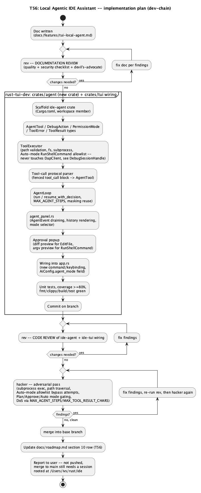
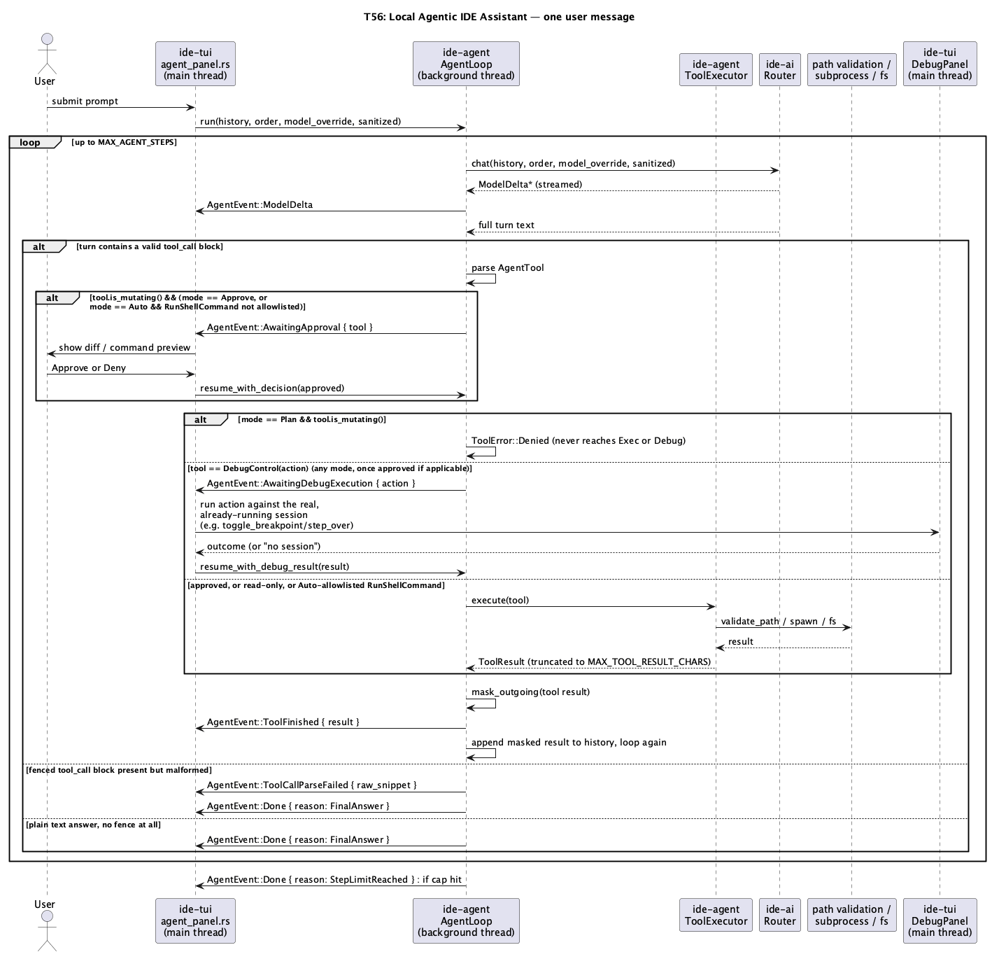
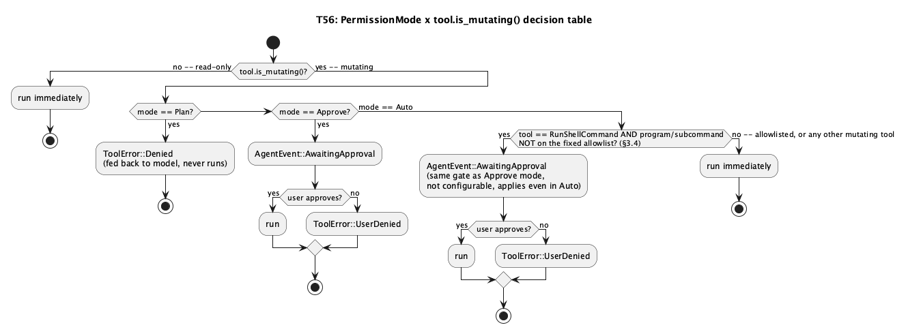

# T56: Local Agentic IDE Assistant

## 1. Purpose

Every AI feature shipped so far ([T49](tui-ai-hybrid-fallback.md),
[T55](tui-ai-task-routing.md)) is chat-only: a model reads context and
replies with text, and nothing it says ever touches the IDE. This feature
turns the existing AI panel into an **agent**: the model can call a fixed
set of tools — read files, search the codebase, edit files, run shell
commands, control the debugger, read Docker logs — in a loop, seeing each
tool's result before deciding its next step, until it produces a final
plain-text answer or hits a bounded step limit.

**Origin**: direct user request, in three parts across one conversation:
1. *"we need a way to integrate local model in our IDE"* — the seed ask.
2. Clarifying question narrowed this to two of three offered directions:
   *"maybe 2-nd and 3-rd parts?"* — agentic tool-use (the model takes
   actions itself, not just replies) and codebase-aware context (it can
   read files beyond the one open buffer) — plus a follow-up correction:
   *"not only AI panel for ask-answer, but for simplicity manage IDE"*.
3. A second clarifying round fixed the concrete shape: **tool scope**
   (edit code, run shell commands, read/search the codebase, navigate the
   IDE — expanded further, mid-turn, to *"run debug, add tests, read
   docker logs etc"*); **permission model**, in the user's own words —
   *"several types of work. plan mode just for question-answer, edit mode
   with approve on each check, auto mode with full access"*; and **crate
   scope** — *"lets make for both, but do not make it for UI, just add in
   core crates and integrate in tui"* (i.e. `ide-ui`/GUI gets nothing new
   from this feature; the tool-execution engine lives in a reusable core
   crate so a GUI integration remains possible later without rework).

**Why a new crate, not folding into `ide-ai`**: `ide-ai` owns "which LLM
provider to talk to and how" (`Router`/`Provider`/`ChatMessage`). Tool
execution is a different concern — it touches `ide-core` (files, search),
`ide-dap` (path validation), and real subprocess execution — and neither
of those is a dependency `ide-ai` has or should gain just to support one
feature built on top of it. A new crate, `ide-agent`, depends on all three
(`ide-core`, `ide-ai`, `ide-dap`) and is depended on only by `ide-tui`.
This mirrors how `ide-ai`/`ide-sanitizer`/`ide-dap` were each split out as
their own crate rather than grown inside an existing one. **`ide-dap` here
means only `path::validate_path`** — `ide-agent` never owns a `DapClient`
or any debug-session state itself; see §2.1's "Why `DebugControl` can't
be just another `ToolExecutor` case" for why it's the one tool this
crate can't fully execute on its own.

**Scope cuts (v1)**:
- **`ide-ui` (GUI) gets nothing in this doc**, per direct instruction —
  `ide-agent` is written so a future GUI integration only needs its own
  thin UI layer (mirroring how `ide-tui`'s wiring in §2.2 is described),
  not a redesign of the engine.
- **No native provider function-calling** (Gemini/Groq/GitHub Models each
  have their own, different, JSON-schema-based tool-call API). Using each
  provider's native format would mean four different tool-call parsers and
  four different failure modes, and would leave local Ollama models
  (which mostly don't support structured function-calling reliably)
  worse off than the cloud providers, backwards from this feature's own
  "local model" origin. v1 uses one hand-rolled, prompt-based protocol
  (§2.1) uniformly across every provider — consistent with this crate's
  existing style of hand-rolling protocol logic (SSE parsing, the T55
  classifier's single-label parsing) rather than reaching for a
  provider-specific SDK.
- **No persistent agent memory across sessions** — each agent run starts
  from the current chat history exactly like today's chat mode; there is
  no vector store, no embeddings, no cross-session recall. "Codebase-aware
  context" in v1 means the model can *ask* to read/search files via tools,
  not that relevant snippets are proactively injected into every prompt.
- **No new tool for "add tests" specifically** — writing a test is just
  `EditFile` (create/modify a `#[test]` fn) followed by `RunShellCommand`
  (`cargo test ...`) to execute it; the user's own example is fully
  covered by composing the two general tools rather than adding a
  test-specific primitive.
- **Docker logs, but not a general Docker-control tool** — `ReadDockerLogs`
  is read-only (`docker logs <id>`); starting/stopping/creating containers
  is out of scope until asked for.
- **`EditFile` can create a new file, but not a new directory** — its
  target's parent directory must already exist; there is no
  directory-creation tool in v1. Creating a file inside a brand-new
  subfolder is unsupported (a real, narrow limitation, not a silent gap
  — see §2.1's `ToolExecutor::execute` doc comment for why).

**Implementation plan** — every step from this doc to merge, in order
(doc review → `rust-tui-dev` builds the new crate and wires it into
`ide-tui` in one continuous pass, §2.1 explains why no `rust-core-dev`
step is needed → code review → mandatory `hacker` pass → merge), each
gated on the previous step's approval exactly like every other feature in
this codebase:



## 2. Interface / API

### 2.1 `ide-agent` (`crates/agent`, new crate — `rust-tui-dev`)

`ide-agent` touches zero lines of `crates/core`, `crates/ai`, or
`crates/dap` — it only consumes their existing public APIs, the same
zero-core-changes shape `ide-ai` itself already has relative to
`ide-core`. Per this project's own precedent (T49/T55: `rust-tui-dev`
built both `crates/ai` and `crates/sanitizer` directly, not a separate
`rust-core-dev` step, since neither path is in that skill's forbidden-
paths list), `rust-tui-dev` owns this crate too — there is no
`rust-core-dev` role in this feature's implementation plan.

```rust
/// One callable action. Read-only variants never require approval in
/// `PermissionMode::Approve`; every other variant does (§3.1).
#[derive(Debug, Clone, PartialEq)]
pub enum AgentTool {
    /// Read one file's full text. Path is relative to the project root.
    ReadFile { path: String },
    /// `ide_core::search_in_path::search_tree_advanced` over the project.
    SearchCode { query: String },
    /// Non-recursive directory listing (file/dir names only, no content).
    ListDirectory { path: String },
    /// `docker logs <container_id>` (read-only; container must already be
    /// running/exist -- this tool never starts one).
    ReadDockerLogs { container_id: String },

    /// Replace one file's full text with `new_text`, creating the file
    /// if it doesn't exist yet (its parent directory must already exist
    /// -- no directory-creation tool in v1, §1). The model always sends
    /// the complete new file content, not a patch -- avoids a second
    /// hand-rolled diff/patch-apply format on top of the one
    /// `ide_core::workspace_edit` already defines for LSP-driven edits.
    EditFile { path: String, new_text: String },
    /// `program` + `args` only -- never a shell string (§4). `cwd` is
    /// always the project root; not configurable per-call.
    RunShellCommand { program: String, args: Vec<String> },
    /// One `ide_dap` session-control action.
    DebugControl(DebugAction),
}

#[derive(Debug, Clone, Copy, PartialEq, Eq)]
pub enum DebugAction {
    Resume,
    StepOver,
    StepInto,
    StepOut,
    Pause,
    Stop,
    /// Toggles one line on/off. `ide_dap::DapRequest::SetBreakpoints`
    /// has no "toggle one" primitive -- it replaces a file's *entire*
    /// breakpoint set -- so `ToolExecutor` keeps its own per-file
    /// breakpoint list (see `ToolExecutor`'s doc comment below) and
    /// sends the full updated list on every toggle.
    ToggleBreakpoint { path: String, line: u32 },
}

/// Whether `AgentTool` needs the user's explicit per-call approval before
/// it runs, independent of `PermissionMode` (`PermissionMode` decides
/// *whether this flag is consulted at all* -- see §3.1).
impl AgentTool {
    pub fn is_mutating(&self) -> bool {
        !matches!(
            self,
            AgentTool::ReadFile { .. }
                | AgentTool::SearchCode { .. }
                | AgentTool::ListDirectory { .. }
                | AgentTool::ReadDockerLogs { .. }
        )
    }
}

/// The three modes the user asked for, by name.
#[derive(Debug, Clone, Copy, PartialEq, Eq, Serialize, Deserialize)]
pub enum PermissionMode {
    /// Read-only: `is_mutating()` tools are refused outright (`ToolError::
    /// Denied`, fed back to the model as-is -- it must answer without
    /// them, never silently retried as something else).
    Plan,
    /// Every mutating tool call pauses the loop and asks the caller (via
    /// `AgentEvent::AwaitingApproval`, §2.2) before running; read-only
    /// tools always run immediately regardless of mode.
    Approve,
    /// Every tool call, mutating or not, runs immediately -- no pause, no
    /// confirmation. See §3.4 for the one exception this mode does not
    /// override.
    Auto,
}

pub struct ToolResult {
    pub tool: AgentTool,
    pub outcome: Result<String, ToolError>,
}

#[derive(Debug, Clone, thiserror::Error)]
pub enum ToolError {
    #[error("path escapes the project root")]
    PathEscape,
    #[error("denied by permission mode")]
    Denied,
    #[error("denied by the user")]
    UserDenied,
    #[error("{0}")]
    Io(String),
    #[error("no active debug session")]
    NoDebugSession,
}

/// Owns the canonicalized project root (canonicalized exactly once, at
/// construction -- the same convention `ide_dap::DapClient::start`
/// already established). Executes one `AgentTool` at a time; never spawns
/// concurrent tool calls. Never touches `AgentTool::DebugControl` -- see
/// the "Why `DebugControl` can't be just another `ToolExecutor` case"
/// note right after this code block for why, and where that tool is
/// actually executed instead.
pub struct ToolExecutor { /* project_root: PathBuf */ }

impl ToolExecutor {
    pub fn new(project_root: &Path) -> std::io::Result<Self>;
    /// Runs `tool` for real (permission-mode/approval gating already
    /// happened in `AgentLoop`, §2.1's `AgentLoop::run` -- this method
    /// always executes). Never called with `AgentTool::DebugControl`
    /// (`AgentLoop` intercepts it before reaching here, see below).
    /// `ReadFile`/`ListDirectory`/`SearchCode`'s path arguments (which
    /// only ever target something that already exists) go through
    /// `ide_dap::path::validate_path(&self.project_root, ..)` directly;
    /// a `None` result is `ToolError::PathEscape`.
    ///
    /// `EditFile` cannot use `validate_path` unmodified: its target may
    /// not exist yet (creating a new file), and `validate_path`
    /// canonicalizes the path itself, which `std::fs::canonicalize`
    /// *requires to already exist* -- confirmed against `ide_dap`'s own
    /// `rejects_nonexistent_path` test, which asserts exactly that
    /// `None` result. Using `validate_path` as-is on `EditFile`'s path
    /// would make creating a new file indistinguishable from a path
    /// escape. Instead `ToolExecutor` validates `EditFile`'s target by
    /// canonicalizing its *parent directory* (which must already exist
    /// in v1 -- no directory-creation tool, see §1's scope cuts) and
    /// checking `starts_with(&self.project_root)` exactly like
    /// `validate_path` does, then joins the file's own name back on;
    /// this is `ide-agent`'s own logic, not a change to `ide_dap::path`
    /// (keeping `crates/dap` untouched, same reasoning as the private
    /// `truncate` duplicate above). A parent that fails to canonicalize
    /// at all (doesn't exist, permission denied) is `ToolError::Io`, not
    /// `PathEscape` -- that variant is reserved for an actual escape.
    pub async fn execute(&mut self, tool: AgentTool) -> ToolResult;
}

/// Bounded round-trip cap: an agent run can call at most this many tools
/// before being forced to stop and answer with whatever it has, exactly
/// the same "never let a broken/adversarial loop run forever" shape
/// `CLASSIFY_TIMEOUT` already established for T55's classifier. 15 is
/// sized off this doc's own worked examples (§5): a realistic multi-step
/// task (read, edit, run tests, read the failure, fix, re-run) lands
/// around 6-10 tool calls, so 15 leaves headroom for one extra retry
/// cycle while still bounding a runaway/adversarial loop to a
/// human-noticeable, not open-ended, number of steps.
pub const MAX_AGENT_STEPS: usize = 15;

/// Each tool result fed back to the model is truncated to this many chars
/// (via `ide_agent`'s own private `truncate` helper -- a small,
/// char-boundary-safe duplicate of `ide_ai`'s crate-private one, since
/// that one has no `pub` modifier and `ide-agent` cannot depend on it;
/// duplicating ~10 lines was chosen over widening `ide-ai`'s visibility
/// for a helper this trivial) before being added to the conversation --
/// a `RunShellCommand`/`ReadDockerLogs`/`ReadFile` result can otherwise
/// be arbitrarily large (a build log, a huge generated file) and blow
/// the context window or the per-message masking cost in one step.
/// 8,000 chars (~2,000 tokens) matches T55's own `MAX_CLASSIFY_INPUT_
/// CHARS` per-message budget reasoning, sized to leave room in a local
/// model's smaller context window for the rest of the conversation.
pub const MAX_TOOL_RESULT_CHARS: usize = 8_000;

pub enum AgentEvent {
    /// A tool is about to run and needs approval (`PermissionMode::
    /// Approve` + `tool.is_mutating()`). The loop is paused until
    /// `AgentHandle::resume_with_decision` is called.
    AwaitingApproval { tool: AgentTool },
    /// An `AgentTool::DebugControl(action)` call that survived permission-
    /// mode gating -- `ToolExecutor` cannot run it (see the note above),
    /// so the caller must execute `action` against its own real debug
    /// session (on its own thread, wherever that session lives) and call
    /// `AgentHandle::resume_with_debug_result`. Every `DebugAction` is
    /// mutating (`is_mutating()` has no exception for `DebugControl`), so
    /// in `Plan` mode it's refused before this event is ever considered;
    /// in `Approve` mode `AwaitingApproval` always fires first and this
    /// event only follows once approved; in `Auto` mode this fires
    /// immediately, with no preceding approval step.
    AwaitingDebugExecution { action: DebugAction },
    ToolStarted { tool: AgentTool },
    ToolFinished { result: ToolResult },
    /// A `` ```tool_call `` fence was present in the model's turn but
    /// failed to parse (bad JSON, unknown tool, wrong-typed args) --
    /// distinct from a turn with no fence at all, which is an ordinary
    /// final answer and never fires this. Purely informational: the
    /// loop still proceeds to `Done { reason: FinalAnswer }` right
    /// after, exactly as if this event didn't exist -- it exists only so
    /// "the model chose not to call a tool" and "the model tried and
    /// got it wrong" are distinguishable to whoever's watching.
    ToolCallParseFailed { raw_snippet: String },
    /// Streaming text delta from the model's current turn (mirrors
    /// `ide_ai::ChatDelta` one-for-one).
    ModelDelta { text: String },
    /// The model produced a final plain-text answer (no further tool
    /// call) or the step cap was hit.
    Done { reason: DoneReason },
}

pub enum DoneReason {
    FinalAnswer,
    StepLimitReached,
    Error(AiError),
}

/// What the caller (main thread) sends back into a paused loop. One
/// enum, two decision channels' worth of payload, since a given pause is
/// always exactly one of these, never both at once -- see
/// `AgentHandle` for why this can't just be two more `&mut self` methods
/// on `AgentLoop` itself.
pub enum AgentResume {
    Approval(bool),
    Debug(Result<String, ToolError>),
}

/// Drives one user message through the tool-calling loop. Consumes an
/// `ide_ai::Router` exactly like the plain chat path does -- agent mode
/// is not a different transport, it's a different system prompt (§2.1's
/// tool-call protocol) plus this loop around it.
pub struct AgentLoop { /* .. */ }

impl AgentLoop {
    /// Constructs a loop and a cheap, cloneable `AgentHandle` for
    /// resuming it later. Returns both because `run` takes `self` by
    /// value: the loop is meant to be moved onto its own background
    /// thread (§2.2, the same `thread::spawn` shape `run_request`
    /// already uses) and run to completion there, so nothing on the
    /// caller's side can hold `&mut AgentLoop` to call a resume method
    /// on it directly once it's spawned -- the handle is the only
    /// surface the caller keeps.
    pub fn new(
        mode: PermissionMode,
        executor: ToolExecutor,
        events: Sender<AgentEvent>,
    ) -> (Self, AgentHandle);

    /// Runs until `AgentEvent::Done` or the `events` channel closes,
    /// pausing on `AgentEvent::AwaitingApproval`/`AwaitingDebugExecution`
    /// by awaiting its own internal `AgentResume` receiver (fed by
    /// whichever `AgentHandle` method the caller calls) before
    /// continuing. `sanitized`/`order`/`model_override` come from the
    /// exact same `AiConfig`-driven resolution the plain chat path
    /// already uses (§3.3) -- agent mode reuses T49/T55's masking and
    /// role-routing unchanged, it does not bypass or duplicate either.
    pub async fn run(
        self,
        history: Vec<ChatMessage>,
        order: &[ProviderId],
        model_override: Option<&str>,
        sanitized: bool,
    );
}

/// The only way the caller interacts with a running `AgentLoop` after
/// spawning it -- everything here is a cheap send into the internal
/// `AgentResume` channel `AgentLoop::run` awaits while paused, not a
/// call requiring shared, exclusive access to the loop itself (there is
/// no existing precedent in this codebase for a main thread sending
/// something *back into* an already-spawned background task --
/// `ai_panel.rs`'s `run_request` is one-directional, background thread
/// to main thread only, via a plain `Sender`/`Receiver` pair -- so this
/// is the one new plumbing shape this feature introduces, not a reuse of
/// an existing one).
#[derive(Clone)]
pub struct AgentHandle { /* resume_tx: mpsc::Sender<AgentResume> */ }

impl AgentHandle {
    /// Resumes a loop paused on `AgentEvent::AwaitingApproval`.
    pub async fn resume_with_decision(&self, approved: bool);

    /// Resumes a loop paused on `AgentEvent::AwaitingDebugExecution`
    /// with the outcome of running that action against the caller's own
    /// real debug session (`Ok` text is whatever's useful to feed back
    /// to the model, e.g. "breakpoint set at line 42" or a stack summary;
    /// `Err(ToolError::NoDebugSession)` if the caller found no active
    /// session -- `AgentLoop` never checks this itself, only the caller
    /// knows).
    pub async fn resume_with_debug_result(&self, result: Result<String, ToolError>);
}
```

**Why `DebugControl` can't be just another `ToolExecutor` case**: §4
requires the agent to only ever *control* a debug session a human
already started via the existing debug panel, never launch one itself.
That real session (`DapClient`, and the per-file breakpoint list needed
to compute `DapRequest::SetBreakpoints`'s full-list argument) is owned
by `ide-tui`'s `DebugPanel` — `pub(crate)`, a different crate, and (just
as importantly) main-thread-only, while `AgentLoop`/`ToolExecutor` run
on the same background thread `run_request` already uses (§2.2). There
is no safe way for `ide-agent` to reach that state directly. So
`DebugControl` is never handed to `ToolExecutor` at all: `AgentLoop`
intercepts it and emits `AgentEvent::AwaitingDebugExecution` instead,
pausing the loop exactly like `AwaitingApproval` does. The caller
(`ide-tui`, on its own main thread, where `DebugPanel` already lives)
runs the action against its own existing session — `ToggleBreakpoint`
calling `DebugPanel::toggle_breakpoint` directly, the other variants
calling whatever `DebugPanel` methods already back the human-facing
debug keybindings — and reports the outcome back via
`AgentHandle::resume_with_debug_result`. There is exactly one breakpoint
tracker in this design (`DebugPanel`'s own, already shipped and tested);
`ide-agent` keeps none.

This makes `DebugControl` the one tool this crate can't execute
end-to-end by itself, unlike the other five — a real asymmetry, not an
oversight: a future GUI integration (§1) would need to implement this
same "run it on your own main thread, tell the loop what happened" side
for whatever debug-session type it owns, exactly as `ide-tui` does here,
rather than getting `DebugControl` for free.

**Tool-call protocol** (the system prompt `AgentLoop` prepends to every
run): the model is told the exact JSON shape for each `AgentTool` variant
and instructed to respond with *either* plain text (a final answer, ending
the loop) *or* exactly one fenced block tagged `` ```tool_call `` containing
a single JSON object `{"tool": "ReadFile", "args": {"path": "..."}}`.
`AgentLoop` looks for that fenced block in the model's complete turn (after
streaming finishes, same as [T55](tui-ai-task-routing.md)'s classifier
draining a full reply before parsing it); anything that isn't a
well-formed match — no fenced block, malformed JSON, an unknown tool name,
missing/wrong-typed args — is treated as a final plain-text answer, not
retried and not surfaced as an error. This keeps a model that ignores or
mangles the protocol degrading to "it just replied with text," identical
to today's non-agent chat behavior, rather than the loop erroring out.
This degrade-silently choice has a real debuggability cost worth naming:
without some signal, "the model decided not to use a tool" and "the model
tried to use a tool and got the JSON wrong" are indistinguishable to
whoever's watching the panel, which matters when the agent isn't doing
what was asked. `AgentLoop` emits `AgentEvent::ToolCallParseFailed {
raw_snippet: String }` (a few hundred chars around the malformed fence,
truncated like any other event payload) whenever a `` ```tool_call ``
fence is *present* but fails to parse — never fired when there's no
fence at all, which is an ordinary final answer needing no signal. `v1`
doesn't require `ide-tui` to render this prominently, but the event
exists so it's at least observable rather than structurally unrecoverable
information.
If a turn contains prose *and* a valid fenced block, only the first
fenced `` ```tool_call `` block is parsed and acted on — any further ones
in the same turn are ignored outright, never queued (preserving §4's "one
tool call at a time" invariant by construction, not by a runtime check).
The surrounding prose is not specially suppressed: it already reached the
panel as ordinary `ModelDelta` streaming before the full turn was parsed,
so it renders in history exactly like any other model text, whether or
not a tool call followed it.

**How the "system prompt" is actually represented**: `ide_ai::ChatRole`
has only `User`/`Assistant` variants — there is no `System` role anywhere
in this codebase. The protocol instructions are realized as a single
`ChatMessage::user(...)` at index 0 of the `Vec<ChatMessage>` sent to
`Router::chat`, the exact same convention `classify_task_role` already
uses to give a model special instructions (`crates/ai/src/lib.rs`'s
`ChatMessage::user(format!(...))` for its own classification prompt) —
not a new mechanism. `AgentLoop::run` prepends this message itself, on
every call, to whatever `history` it's given; it is never persisted into
the `history` the caller (`agent_panel.rs`) stores and passes back in on
the *next* user submission within the same agent-mode session — the
panel's own displayed/stored history never contains it, and the model
never sees it duplicated across turns. For the step-limit-reached final
call (§3.2), `AgentLoop` substitutes a second, tools-omitted variant of
this same index-0 message for that one `Router::chat` call only, without
mutating the stored `history`.

### 2.2 `ide-tui` (`crates/tui/src/agent_panel.rs`, new; `app.rs` — `rust-tui-dev`)

- A **mode selector** on the AI panel (`Plan`/`Approve`/`Auto`, cycled with
  a key, shown in the panel's header) — persisted the same way `AiConfig`
  already persists other panel-adjacent settings, as a new `agent_mode:
  PermissionMode` field on `AiConfig` (default `Plan` — the safest mode is
  the out-of-the-box one, matching every other opt-in default this feature
  set has established, e.g. T55's `auto_route: false`).
- Submitting a prompt while agent mode is anything other than "off"
  (a 4th implicit state: agent mode itself is opt-in per T49's existing
  `ToggleAiPanel`-style pattern — plain chat remains the default panel
  behavior; a new keybinding/command toggles "Agent" on top of the
  existing chat) calls `AgentLoop::new` and moves the returned `AgentLoop`
  onto the same kind of background thread `run_request` already uses to
  run `run` to completion, keeping the returned `AgentHandle` on the
  panel's own side (stored on the panel's state, `Clone`-able so it
  survives being referenced from wherever a popup's Approve/Deny handler
  or the debug-execution poll-tick code needs it) — draining `AgentEvent`s
  into the panel's history instead of `run_request`'s plain
  `AiDisplayMessage`s: `ToolStarted`/`ToolFinished` render as their own
  history entries (tool name + args on start, truncated result on finish)
  so the user watches the whole chain, not just the final answer;
  `ModelDelta` streams exactly like today's `StreamingDelta`.
- `AgentEvent::AwaitingApproval` renders a **confirmation popup**: for
  `EditFile`, a diff preview built with `ide_core::git::diff_text(path,
  old, new) -> Option<FileDiff>` (`FileDiff { old_path, new_path, hunks:
  Vec<DiffHunk>, truncated }` — the exact same type `render_refactor_
  preview`/`render_git_diff` already flatten into `Line`s via
  `diff_line_to_line`, reused verbatim here, not reinvented); for
  `RunShellCommand`, the literal `program` + `args` about to run; for
  `DebugControl`, the action name. Two choices, Approve/Deny, feeding
  `AgentHandle::resume_with_decision`.
- `AgentEvent::AwaitingDebugExecution { action }` is handled entirely on
  the main thread, unlike every other event this loop emits (which just
  render into the panel): the poll loop calls the same `DebugPanel`
  method the human-facing debug keybindings already call for `action`
  (`toggle_breakpoint` for `ToggleBreakpoint`, `step_over`/`step_into`/
  `step_out`/`pause`/etc. for the rest — no new `DebugPanel` methods
  needed, this reuses what's already there), using `DebugPanel`'s own
  existing session-active check to decide between actually running it
  and reporting `Err(ToolError::NoDebugSession)`, then immediately calls
  `AgentHandle::resume_with_debug_result` with the outcome before the next
  poll tick. This never touches a background thread, so there is no
  synchronization to get right beyond what `DebugPanel` already handles
  for its ordinary human-driven use.

## 3. Behaviour

> See `diagrams/tui-local-agent-sequence.png` for the full request →
> tool-call → approval (when applicable) → tool execution → result →
> next-turn loop, and `diagrams/tui-local-agent-modes.png` for how
> `PermissionMode` and a mutating tool's approval gate interact.





### 3.1 Permission modes

| Mode | Read-only tool | Mutating tool |
|---|---|---|
| `Plan` | runs immediately | **refused** (`ToolError::Denied`, fed back to the model as a tool result — it must proceed without it) |
| `Approve` | runs immediately | pauses on `AgentEvent::AwaitingApproval`; runs only if approved, else `ToolError::UserDenied` fed back |
| `Auto` | runs immediately | runs immediately — **except** `RunShellCommand` outside the fixed allowlist in §3.4, which pauses for approval like `Approve` mode would; not a permission-mode setting and cannot be turned off from `.ide/ai.json` |

`DebugControl` is mutating like any other tool in this table (`Plan`
refuses it outright, `Approve` gates it on human approval, `Auto` runs it
without asking) — that part is unchanged. What's different is *how* it
runs once gating clears: in `Auto` mode, or once approved in `Approve`
mode, it still doesn't execute inline the way every other tool does.
It always routes through `AgentEvent::AwaitingDebugExecution` first
(§2.1's "Why `DebugControl` can't be just another `ToolExecutor` case"
note) — a second hop back to the caller's main thread, never something
`ToolExecutor` does itself.

### 3.2 Loop termination

The loop ends when: the model's turn contains no valid tool-call block
(→ `DoneReason::FinalAnswer`); `MAX_AGENT_STEPS` tool calls have run in
this one user message (→ `DoneReason::StepLimitReached`, and the model is
asked one final time, with tools disabled, to summarize where it got to —
never just silently truncated); or the underlying chat request itself
fails the way it already can today (→ `DoneReason::Error`, identical
`AiError` surface as plain chat).

"Tools disabled" for that final call means the system prompt omits the
tool-call protocol instructions and every `AgentTool` schema entirely —
the model is never told tools exist for this one turn. Belt and
suspenders: even if the model emits a `` ```tool_call `` block anyway
(ignoring the system prompt), `AgentLoop` unconditionally treats this
specific turn's output as plain text and ends with `DoneReason::
StepLimitReached` regardless of what it contains — this is the one turn
where the tool-call parser is never consulted, not just discouraged from
matching.

### 3.3 Sanitizer and role-routing wiring — reused, not reimplemented

Every message `AgentLoop` sends to the model — the initial prompt *and*
every tool result fed back on the next turn — goes through the exact same
`mask_outgoing`/`sanitized`-threading T49 established and T55's `hacker`
round hardened. Concretely: `ToolResult`'s text (a file's contents, a
command's stdout/stderr, a Docker log) is exactly the same category of
"project text about to be sent to a possibly-cloud model" as the original
chat prompt, so it is masked before being appended to `history` and passed
back into `AgentLoop::run`, using the same threshold decision
(`decide_threshold`) computed once per user message, not re-decided per
tool call. Role-routing (T55) applies unchanged: `resolve_role_route` picks
the chain/model for the model's *reasoning* turns; it has no opinion about
which tools exist or run — those are identical across every resolved role.

### 3.4 The one thing `Auto` mode does not override

Even in `PermissionMode::Auto`, `RunShellCommand` only ever runs
unattended when it matches a small, fixed, non-configurable **allowlist**
of known-safe invocations — everything else pauses for approval exactly
like `PermissionMode::Approve` would, even though the panel's mode is set
to `Auto`. This is the one case where `Auto` mode is not "everything runs
immediately": a genuinely unbounded denylist can't be built (see the
Revision notes for why an earlier denylist-shaped draft of this section
was rejected), so the safe default is to allowlist the common case and
require a human for everything outside it, rather than try to enumerate
every dangerous case.

`program` is matched by file-stem (a full or relative path to one of
these doesn't evade the check):

- `cargo`, `go`, `ls`, `cat`, `grep` — any arguments, allowlisted
  outright (`go` alongside `cargo` specifically, not the full
  multi-language set this IDE's LSP support otherwise covers — v1 stays
  narrow elsewhere per the same reasoning as the git/docker subsets
  below, easy to extend once real usage shows what else is needed).
- `git` — only when `args[0]` is one of `status`, `diff`, `log`, `show`,
  `branch`, `blame`, `remote`, `fetch`. Any other subcommand (`reset`,
  `push`, `clean`, `checkout`, ...) is not allowlisted.
- `docker` — only when `args[0]` is one of `ps`, `inspect`, `images`.

Anything else — a program not on this list at all (including a shell or
scripting interpreter: `sh`/`bash`/`zsh`/`python`/`node`/etc. are never
allowlisted, so they always fall through to this path, closing the
"model invokes a shell as the tool's own `program`" bypass without a
special case for it), or `git`/`docker` with a subcommand not in their
allowlists — produces `AgentEvent::AwaitingApproval` for that one call,
identical to `Approve` mode's gate, no matter what the panel's mode is
set to. There is no `ToolError::Blocked` outcome for `RunShellCommand`
in this design: nothing is permanently refused, a human can always
choose to approve it when asked, but nothing outside the safe list ever
runs with zero human review, in any mode.

This exists specifically because the user asked for "auto mode with full
access," and full, un-reviewed access to an LLM-driven shell is a
materially different risk than a human typing the same command — a model
can be wrong, and `Auto` mode by definition has no human in the loop by
default. An allowlist keeps the common, low-risk dev-loop actions
(building, testing, inspecting) truly unattended while making every
higher-risk action require the same review `Approve` mode already
provides — this is a real, deliberate reduction in what "full access"
delivers, flagged here explicitly rather than silently shipped as if it
were free.

## 4. Constraints and invariants

- **No shell, ever**: `RunShellCommand` is `Command::new(program).args(args)`
  only, mirroring every other subprocess call already in this codebase
  (`cargo_panel.rs`/`docker_panel.rs`/`custom_actions.rs`'s established,
  audited pattern) — never a formatted shell string, regardless of
  `PermissionMode`.
- **Every path argument is validated**: `ide_dap::path::validate_path`
  against the project root canonicalized once at `ToolExecutor`
  construction (the same convention `DapClient::start` already
  established) — a path that resolves outside the project root is
  `ToolError::PathEscape`, not silently clamped or retried against a
  different path.
- **Bounded resources**: `MAX_AGENT_STEPS` (tool calls per user message),
  `MAX_TOOL_RESULT_CHARS` (per-result truncation before it re-enters the
  conversation) — both hard caps, no configuration surface in v1 (matching
  T55's `MAX_CLASSIFY_INPUT_CHARS`/`CLASSIFY_TIMEOUT` precedent of
  shipping a fixed, reasoned-about constant rather than an
  every-knob-configurable one).
- **One tool call at a time, one debug session at a time**:
  `ToolExecutor::execute` is not reentrant; `AgentLoop` never issues a
  second tool call before the first one's result is fed back to the
  model. A `DebugControl` tool call when no session exists is
  `ToolError::NoDebugSession`, reported by the caller via
  `resume_with_debug_result` — `ToolExecutor` never sees `DebugControl`
  at all, so it isn't the one deciding this (§2.1's "Why `DebugControl`
  can't be just another `ToolExecutor` case" note). The model must have
  no way to implicitly start a debug session
  — that's out of this feature's tool set entirely, v1 only lets the
  agent *control* a session, never *launch* one; starting a debug
  session remains a human action via the existing debug panel, and it's
  that same panel's session the agent controls, not one of its own.
- **`hacker` pass mandatory, and broader than T49/T55's**: this is the
  first AI feature in this codebase where a model's own output can
  directly cause subprocess execution and file mutation, and the first
  where "no confirmation at all" (`Auto` mode) is a supported, requested
  configuration. Every category in the `hacker` skill's checklist that
  previously didn't apply to `ide-ai` (subprocess/sandbox escape, path
  traversal) now does.
- **`ide-ui` (GUI) is explicitly out of scope** for this doc, per the
  user's own instruction — no `crates/ui` changes.
- **Indirect prompt injection is a named, accepted threat, not an
  oversight**: content read via `ReadFile`/`SearchCode`/`ReadDockerLogs`
  is untrusted — it can come from a dependency, a build log, or a
  container's log stream, none of which the user authored — and it
  becomes part of the conversation the model reasons over on its next
  turn. Adversarial text embedded in that content could steer the model
  into issuing a mutating tool call it wouldn't otherwise make. In
  `Plan`/`Approve` mode this is bounded by the same approval gate that
  bounds any other mutating call (a human sees the concrete tool call
  before it runs, regardless of what prompted the model to propose it).
  In `Auto` mode, `RunShellCommand` outside §3.4's allowlist gets that
  same backstop, but `EditFile` and `DebugControl` do not — a model
  steered by injected content into editing a file or stepping a debug
  session in `Auto` mode runs exactly as unattended as one following the
  user's own instructions. This residual gap on `EditFile`/`DebugControl`
  is accepted as part of what "auto mode with full access" means for
  those two tools specifically.

## 5. Examples

**Example — Approve mode, editing a file:**

```
User: "add a doc comment to `resolve_role_route` explaining the fallback"
→ model turn 1: ```tool_call {"tool":"ReadFile","args":{"path":"crates/ai/src/project.rs"}}```
→ AwaitingApproval? No -- ReadFile is read-only, runs immediately.
→ ToolFinished: file contents fed back (truncated to MAX_TOOL_RESULT_CHARS if needed)
→ model turn 2: ```tool_call {"tool":"EditFile","args":{"path":"crates/ai/src/project.rs","new_text":"...full file with the new doc comment..."}}```
→ AwaitingApproval { tool: EditFile } -- panel shows a diff preview, user presses Approve
→ ToolFinished: file written
→ model turn 3: plain text -- "Done, added a doc comment explaining the three fallback cases."
→ Done { reason: FinalAnswer }
```

**Example — Plan mode, the same request:**

```
→ model turn 1: ReadFile (runs -- read-only)
→ model turn 2: tries EditFile -> ToolError::Denied fed back as the tool result
→ model turn 3: plain text -- "I can see the fallback logic, but I'm in
  read-only mode and can't apply the edit. Here's the doc comment you
  could add: ..."
```

**Example — Auto mode, a command outside the allowlist:**

```
→ model turn: RunShellCommand { program: "git", args: ["reset", "--hard"] }
→ "reset" is not in git's Auto-mode subcommand allowlist (§3.4)
→ AgentEvent::AwaitingApproval { tool } -- same gate Approve mode uses,
  even though the panel's mode is Auto
→ user denies -> ToolError::UserDenied fed back as the tool result
→ model turn 2: plain text explaining it can't run that command
```

**Example — Auto mode, controlling an already-running debug session:**

```
User: "step over and tell me the value of `x`"
→ model turn: DebugControl(StepOver)
→ AgentEvent::AwaitingDebugExecution { action: StepOver } -- ToolExecutor
  never sees this; the panel's main-thread poll loop handles it directly
→ ide-tui calls DebugPanel::step_over() (the same method the human-facing
  keybinding already calls) -- a session is active, so it actually steps
→ ide-tui calls AgentHandle::resume_with_debug_result(Ok("stepped over line 42"))
→ ToolFinished: result fed back to the model
→ model turn 2: DebugControl(...) or a plain-text answer, depending on
  whether it still needs to inspect state via another tool
```

**Example — Plan mode, no debug session running:**

```
→ model turn: DebugControl(Resume)
→ DebugControl is mutating -> Plan mode refuses it before it ever reaches
  AwaitingDebugExecution: ToolError::Denied fed back, same as any other
  mutating tool in Plan mode
```

## 6. Dependencies & integration points

- `ide-core`: `search_in_path::search_tree_advanced` (`SearchCode`),
  plain `std::fs` for `ReadFile`/`ListDirectory`/`EditFile`'s actual
  write (`workspace_edit::apply_transaction` is not used — the model
  sends whole-file replacements, not transactions). `git::diff_text`
  (not `workspace_edit::diff_text` — it lives in `crates/core/src/git/
  mod.rs`) is reused purely by `ide-tui` for the approval-popup preview,
  not by `ide-agent` itself.
- `ide-ai`: `Router`/`ChatMessage`/`ChatDelta`, and T49/T55's masking and
  role-routing, unchanged and reused (§3.3). Not `truncate` — it has no
  `pub` modifier in `ide-ai`, so `ide-agent` defines its own private
  equivalent (§2.1).
- `ide-dap`: only `path::validate_path`, for `ReadFile`/`ListDirectory`/
  `SearchCode`/`EditFile`'s path arguments. `ide-agent` never touches
  `DapClient` — `DebugControl` is executed by `ide-tui` itself, against
  its own existing `DebugPanel` session, not by this crate (§2.1's "Why
  `DebugControl` can't be just another `ToolExecutor` case" note).
- `ide-tui`: new `agent_panel.rs` wiring (§2.2), including the
  main-thread `AwaitingDebugExecution` handler described there; depends
  on the new `ide-agent` crate the same way it already depends on
  `ide-ai`/`ide-dap`.
- No new external crate dependencies beyond what `ide-core`/`ide-ai`/
  `ide-dap` already bring in.

## Revision notes

`rev` DOCUMENTATION REVIEW (round 1) found nine findings and one
controversial finding; all nine are fixed in place below, and the
controversial one is put to the user rather than resolved unilaterally
(see Verdict / Findings in the review output for the full detail — the
gist of each is captured next to its fix):

1. **[security: Critical] §3.4** — the argv-pattern denylist did nothing
   to stop the model from setting `program` to a shell interpreter itself
   (`sh -c "rm -rf ~"`), fully bypassing both "no shell, ever" and every
   listed pattern. First fixed with an unconditional shell/script-
   interpreter block ahead of the denylist; **superseded** by the
   allowlist rewrite from the controversial finding below, which closes
   this same gap without a special case (interpreters were never going
   to be on a safe-command allowlist).
2. **[security: Medium] §4** — indirect prompt injection (adversarial
   content in a file/search-result/Docker log steering the model toward a
   mutating call) was never named as a threat model. Fixed: added an
   explicit bullet stating it's accepted risk in `Auto` mode and bounded
   by the approval gate in `Plan`/`Approve`.
3. **[quality] §2.1** — `DebugAction::ToggleBreakpoint` was declared as a
   fieldless unit variant while the prose described it taking `(path,
   line)` — wouldn't compile against its own description. Fixed: gave it
   `{ path: String, line: u32 }` fields. The rest of this finding's
   original fix — `ToolExecutor` keeping its own per-file breakpoint list
   mirroring `DebugPanel`'s — is **superseded** by finding 13 below:
   `ToolExecutor` no longer touches debugging at all, so it keeps no
   breakpoint list of its own; `DebugPanel`'s is the only one.
4. **[docs] §2.2/§6** — cited `ide_core::diff_text`/`workspace_edit::
   diff_text`; the real function is `ide_core::git::diff_text` in
   `crates/core/src/git/mod.rs`, returning `Option<FileDiff>`. Fixed:
   corrected the module path and added the real `FileDiff` shape.
5. **[docs] §2.1/§6** — cited `ide_ai::truncate` as callable from
   `ide-agent`; it has no `pub` modifier, so it's crate-private. Fixed:
   `ide-agent` defines its own small private `truncate` helper instead of
   depending on `ide-ai`'s.
6. **[docs] §2.1/§1/plan diagram** — assigned this crate to
   `rust-core-dev`, but `ide-agent` needs zero changes to `crates/core`
   (or `crates/ai`/`crates/dap`) — it only consumes their existing public
   APIs. Fixed: reassigned the whole feature to `rust-tui-dev` as one
   continuous role, matching this project's own T49/T55 precedent
   (`rust-tui-dev` already built `crates/ai`+`crates/sanitizer` directly);
   collapsed the plan diagram's two role partitions and two merge points
   into one.
7. **[quality] §3.2** — the step-limit-reached summarization call's
   tool-availability wasn't specified: what if that turn still contains a
   `tool_call` block? Fixed: the final call's system prompt omits the
   tool-call protocol and every tool schema, and `AgentLoop`
   unconditionally treats that turn's output as plain text regardless of
   content, never consulting the tool-call parser for it.
8. **[docs] §2.1** — `MAX_AGENT_STEPS`/`MAX_TOOL_RESULT_CHARS` were
   justified only by analogy to T55's constants, with no reasoning for
   the specific numbers. Fixed: added concrete sizing reasoning for both
   (steps: headroom over the worked examples' 6-10-step realistic case;
   chars: ~2,000 tokens, matching T55's per-message budget shape).
9. **[docs] §2.1** — the tool-call protocol didn't say what happens with
   prose alongside a tool-call block, or with more than one fenced block
   in one turn. Fixed: only the first block is parsed (rest ignored, not
   queued); accompanying prose isn't suppressed, since it already
   streamed to the panel as `ModelDelta` before the turn was fully
   parsed.

**[controversial, resolved]** §3.4's safety net (after fix 1) was still a
denylist for anything other than a bare shell interpreter — a finite list
can't enumerate every destructive `program`+`args` combination (package
managers, `find -delete`, `dd`, etc.). Put to the user rather than
resolved unilaterally: switch to an allowlist (only a small known-safe
set of programs/subcommands run unattended in `Auto`; everything else —
including `rm`, `find`, and any non-allowlisted `git`/`docker`
subcommand — falls back to the same approval gate `Approve` mode uses,
even while the panel's mode is `Auto`), accepting that this is a real
reduction in what "full access" delivers versus what was originally
asked for. **User chose the allowlist.** §3.4 is rewritten around it: the
old argv-pattern denylist and the standalone interpreter-block special
case are both gone, subsumed by "anything not on the allowlist requires
approval" (which also closes the interpreter bypass without a special
case, since interpreters were never going to be on a safe-command
allowlist). `ToolError::Blocked` is removed from §2.1's `ToolError` enum
— nothing is permanently refused any more, only gated.

**Round 2 (self-review, before implementation started)** found three
more issues, all fixed:

10. **[docs]** `PermissionMode::Plan`'s doc comment cited `ToolResult::
    Denied` — `ToolResult` is a struct with no such variant; the real
    type is `ToolError::Denied`. Fixed the reference.
11. **[docs, implementability]** The "system prompt" `AgentLoop` sends
    was never tied to `ide_ai::ChatRole`'s actual shape (`User`/
    `Assistant` only — no `System` variant exists anywhere in this
    codebase). Fixed: specified it's a `ChatMessage::user(...)` at
    `history[0]`, mirroring `classify_task_role`'s own established
    convention for giving a model special instructions, prepended by
    `AgentLoop::run` itself on every call and never persisted into the
    caller's stored history — closing a real duplication hazard where a
    naive implementation could re-accumulate the instructions message on
    every user submission within one agent-mode session.
12. **[security/correctness, implementability]** `EditFile`'s doc
    described using `ide_dap::path::validate_path` for every path
    argument, but that function canonicalizes its target — and
    `std::fs::canonicalize` requires the target to already exist
    (verified against `ide_dap`'s own `rejects_nonexistent_path` test).
    As written, `EditFile` could never create a new file — every
    creation would be misreported as `ToolError::PathEscape`. Fixed:
    `ToolExecutor` validates `EditFile`'s target by canonicalizing its
    *parent* directory instead (same `starts_with(root)` check,
    implemented in `ide-agent` itself, not a `crates/dap` change) and
    joining the file name back on; a parent that doesn't exist is a v1
    scope cut (no directory-creation tool), not a path escape.

**Round 3 (asked for a devil's-advocate pass per step, given this
feature's stakes as foundational IDE infrastructure)** found one design
gap serious enough to be a real defect, not a stylistic disagreement, and
one additive fix:

13. **[correctness/implementability, Critical] §2.1** — `ToolExecutor`
    was specified as owning "the `DapClient` session it started" for
    `DebugControl`, directly contradicting §4's own requirement that the
    agent may only *control* a session a human already started, never
    launch one. Worse, even fixing that contradiction, the real session
    lives in `ide-tui`'s `DebugPanel` — `pub(crate)`, a different crate,
    and main-thread-only, while `AgentLoop`/`ToolExecutor` run on a
    background thread. There was no way, as specified, for `ide-agent`
    to reach that session at all; `DebugControl` could not have worked.
    Verified concretely: `DebugPanel::start_session` is the sole
    `DapClient::start` call site and is `pub(crate)`, and there's no
    thread-safe sharing path that would help even if crate-visibility
    weren't in the way. Fixed: `DebugControl` is no longer executed by
    `ToolExecutor` at all. `AgentLoop` intercepts it and emits a new
    `AgentEvent::AwaitingDebugExecution { action }`, pausing the loop
    exactly like `AwaitingApproval` does; the caller runs it on its own
    main thread against its own real session (reusing `DebugPanel`'s
    already-shipped methods — no new breakpoint tracking anywhere) and
    resumes via a new `AgentHandle::resume_with_debug_result`. This also
    means there is exactly one breakpoint tracker in the whole design
    now, not two independent, driftable copies. Named as a real,
    structural asymmetry rather than glossed over: a future GUI
    integration would need its own version of this same main-thread
    round trip for whatever debug-session type it owns — `DebugControl`
    is the one tool `ide-agent` can never fully own end-to-end.
14. **[quality, additive]** §2.1's "malformed tool call silently becomes
    a final answer" design gave no way to tell "the model chose not to
    use a tool" from "the model tried and got the JSON wrong" — a real
    debuggability gap for an agent that isn't doing what was asked.
    Fixed: added `AgentEvent::ToolCallParseFailed { raw_snippet }`,
    fired only when a fence was present but failed to parse (never for
    an ordinary fence-free final answer); purely informational, doesn't
    change loop behavior.

Two things were checked and found **not** to be real gaps, worth stating
so this doesn't read as only ever finding problems: (a) §3.3's "threshold
computed once per user message, not re-decided per tool call" sounds
like it could let a growing agent conversation escape the sanitizer's
original size-based judgment — but `decide_threshold` (`ai_panel.rs`)
is a pure function of the provider chain and static config, not message
content or size, so re-deciding it per tool call would yield the
identical value every time; content itself is still re-masked via
`mask_outgoing` on every tool result independently. (b) `SearchCode`'s
backing `search_tree_advanced` already self-truncates
(`PathSearchResults.truncated`) independent of `MAX_TOOL_RESULT_CHARS`,
so an agent looping on broad searches doesn't have an unbounded-result-set
angle beyond what the existing, already-shipped core function already
bounds.

One product question from this pass was put to the user rather than
decided here: §3.4's allowlist was Rust/cargo-biased, and this IDE isn't
Rust-exclusive. **User asked for `go` added for v1** (not the full
multi-language set) — `go` is now allowlisted outright alongside `cargo`,
everything else in §3.4 stays as narrow as originally written.

**Round 4 (independent `rev` validation pass, requested specifically
because round 3's `DebugControl` redesign was large and had only been
self-reviewed by the agent that introduced the bug it fixed)** found one
more real gap, on the same scale as finding 13, plus two wording nits:

15. **[quality/implementability, High] §2.1** — `resume_with_decision`/
    `resume_with_debug_result` were declared as `pub async fn(&mut self,
    ..)` methods directly on `AgentLoop`, the same struct whose `run`
    method gets moved onto a background thread (§2.2). As written, the
    caller (main thread) would need `&mut AgentLoop` to call either
    resume method while a *different* thread is concurrently executing
    `run` on that same instance — not straightforwardly achievable in
    Rust, and this codebase has no existing precedent to lean on:
    verified that `ai_panel.rs`'s `run_request` (the pattern this doc
    cites for spawning `AgentLoop::run`) is strictly one-directional,
    background thread to main thread only, via a plain `Sender`/
    `Receiver` pair — nothing in this codebase today sends something
    *back into* an already-spawned background task. This gap predates
    round 3 (it was already latent in `resume_with_decision` from round
    1) but was never caught until this pass looked specifically at the
    cross-thread mechanics rather than the pause/resume *logic*. Fixed:
    `AgentLoop::new` now returns `(AgentLoop, AgentHandle)` — `run` takes
    `self` by value and is moved onto the background thread as before,
    but the two resume methods move to a new, cheap, `Clone`-able
    `AgentHandle` type (backed by an `mpsc::Sender<AgentResume>`) that
    the panel keeps on its own side; `AgentLoop::run` awaits its own
    internal `AgentResume` receiver while paused. This is the first
    two-directional channel this codebase's background-thread pattern
    needs, not a reuse of an existing one — named as such rather than
    implied to be business as usual.
16. **[docs]** `AgentEvent::AwaitingDebugExecution`'s doc comment phrased
    the Approve-mode ordering as conditional ("if the action is also
    subject to approval") as though some `DebugAction` might not need
    approval in `Approve` mode — but every variant is uniformly mutating
    (`is_mutating()` has no per-`DebugAction` exception), so the
    condition is always true and the phrasing implied a case that can't
    happen. Fixed: reworded unconditionally per mode (`Plan` refuses
    before this event is ever considered; `Approve` always approves
    first; `Auto` fires immediately). The equivalent phrasing in §3.1 was
    reworded the same way for the same reason.

Two more things were checked and confirmed correct, not just assumed:
`DebugPanel` actually has all seven methods this design calls by name
(`resume`/`step_over`/`step_into`/`step_out`/`pause`/`stop`/
`toggle_breakpoint`, plus the `is_active()` check `§2.2` relies on) —
every `DebugAction` variant maps to an identically-named existing
method, confirmed by reading `crates/tui/src/debug_panel.rs` directly,
not assumed from the variant names. And `toggle_breakpoint`'s own
existing implementation already gates on `ready_for_breakpoints`
internally before syncing — so calling it directly, as this design now
does, automatically respects `SetBreakpoints`'s "not before
`ReadyForBreakpoints`" precondition for free, without `ide-agent` needing
to know that precondition exists at all.
