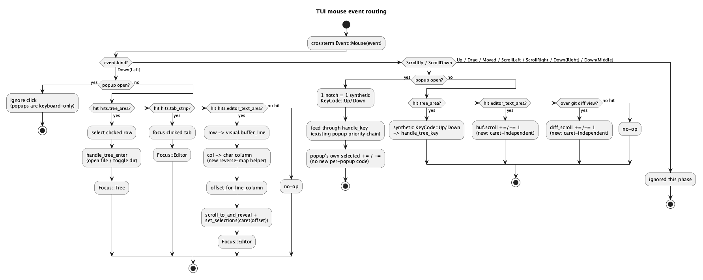

# TUI mouse support

## 1. Purpose

`ide-tui` (`crates/tui/**`) is currently keyboard-only: `crossterm` never
enables mouse capture, and the main event loop (`crates/tui/src/lib.rs`)
matches only `Event::Key`, silently dropping every `Event::Mouse`. Two
earlier features explicitly cut mouse-driven behaviour citing this gap —
`docs/roadmap.md` **T20** (multiple cursors) dropped `⌥Click`/Clone Caret/
Column Selection, and **T22** (keymap customization) dropped gesture/chord
rebinding, both citing "нет мыши" (no mouse).

This feature reverses that: it wires basic mouse support into the TUI —
left-click to select/activate/place-caret, and vertical wheel scroll for
every individually-scrollable panel — without attempting parity with the
GUI's full click-drag/hover feature set. It is scoped deliberately narrow;
see §4 for everything explicitly out.

## 2. Interface

### 2.1 `crates/tui/src/lib.rs`

```rust
fn setup_terminal() -> io::Result<Terminal<CrosstermBackend<Stdout>>>;
fn restore_terminal(terminal: &mut Terminal<CrosstermBackend<Stdout>>) -> io::Result<()>;
```

`setup_terminal` additionally executes `crossterm::execute!(stdout,
EnableMouseCapture)` (after entering the alternate screen / enabling raw
mode, same ordering as the existing `EnterAlternateScreen`/
`EnableFocusChange`-style calls already there, if any). `restore_terminal`
additionally executes `DisableMouseCapture` — first, symmetrically, before
leaving the alternate screen — so a panicking or erroring run still
restores native terminal mouse behaviour.

The main loop's `event::read()?` match gains an `Event::Mouse(mouse_event)`
arm alongside the existing `Event::Key(key_event)` arm; every other
`Event` variant (`Resize`, `FocusGained`/`Lost`, `Paste`) keeps being
ignored exactly as today.

### 2.2 `crates/tui/src/ui.rs`

```rust
#[derive(Default)]
pub struct HitMap {
    pub tree_area: Option<Rect>,
    pub editor_text_area: Option<Rect>,
    pub tab_strip: Vec<(Rect, usize)>,   // per-tab hit rect -> tab index
}

pub fn render(frame: &mut Frame, app: &App, hits: &mut HitMap);
```

`render`'s signature changes from `(frame, app)` to `(frame, app, hits)`.
`hits` is cleared and repopulated at the start of every call — callers must
not assume stale entries persist across frames in which a given panel
wasn't drawn (e.g. `tree_area` is `None` on a frame where the tree isn't
visible). This is an out-parameter, not a return value, because
`ratatui::Terminal::draw`'s render closure's return value is not
propagated to the caller (verified against `ratatui` 0.29.0's
`terminal/terminal.rs`) — a return-value design (mirroring `ide-ui`'s
`EditorOutput`) is not achievable here. `render`'s existing contract —
"reads `App`'s state only, mutates nothing on `App`" — is unchanged; a
`HitMap` output is orthogonal to that contract, not a violation of it.

`crates/tui/src/lib.rs`'s `run()` calls it as:

```rust
let mut hit_map = ui::HitMap::default();
terminal.draw(|frame| ui::render(frame, &app, &mut hit_map))?;
```

`hit_map` is then live for the *next* loop iteration's mouse-event
handling — the same one-frame-lag pattern the existing scroll-follow and
terminal-resize handling in `run()` already uses.

### 2.3 `crates/tui/src/app.rs`

```rust
impl App {
    pub fn handle_mouse(&mut self, event: MouseEvent, hits: &HitMap);
}
```

Single new entry point, called from `lib.rs`'s `run()` for every
`Event::Mouse`, mirroring the existing `handle_key`. Internally dispatches
on `event.kind`:

- `MouseEventKind::Down(MouseButton::Left)` — hit-tests `(event.column,
  event.row)` against `hits` and performs the corresponding click action
  (§3.2).
- `MouseEventKind::ScrollUp` / `ScrollDown` — routes to whichever
  panel/popup should receive one synthetic Up/Down press (§3.3).
- every other `MouseEventKind` (`Up`, `Drag`, `Moved`, `ScrollLeft`,
  `ScrollRight`, `Down(Right)`, `Down(Middle)`) — no-op, explicitly ignored
  (§4).

No new public fields are added to `App`; the click/scroll handlers reuse
existing state (`TreeState::move_selection`, `OpenBuffer.scroll`,
`GitPanelState.diff_scroll`, each popup's own `selected: usize`) exactly as
the keyboard handlers already do, with one exception — the editor's
caret-independent wheel scroll, §3.3.

## 3. Behaviour

### 3.1 Enabling mouse capture: the UX tradeoff

Enabling `EnableMouseCapture` is not free: once a terminal application
owns mouse events, most terminal emulators stop offering native
click-drag text selection and copy-to-clipboard on that region — the
application must be told to release the mouse (commonly a modifier held
while clicking/dragging, e.g. Shift, terminal-dependent) to get native
selection back. This is an inherent, user-visible behaviour change the
moment this feature ships, not a bug to fix; it should be called out in
user-facing release notes, not just this doc.

### 3.2 Click (`Down(Left)`)

All click handling is **position-based**: hit-test the click's
`(column, row)` against `HitMap`'s rects, independent of current
`Focus`. A click outside every known rect is a no-op.

**While any popup is open, clicks are ignored entirely** — not routed to
the popup, not routed to whatever is underneath it. This mirrors wheel
scroll's own popup-priority model (§3.3): when a popup owns input,
position-based routing over the base view does not apply. Clicking a
popup's own rows
(e.g. a Problems entry) is out of scope this phase — only wheel-scroll
reaches an open popup, via the synthetic-key mechanism below.

#### 3.2.1 File tree

A click inside `hits.tree_area` computes the clicked row's tree entry
(the same row-to-entry mapping `TreeState::selected_row` already uses in
reverse), then:

1. Sets `tree_state`'s selection to that entry (reusing
   `TreeState::move_selection`'s underlying selection field directly,
   not the delta-based API).
2. Performs the same action `Enter` already performs on the selected
   entry — calls the existing `handle_tree_enter` logic (toggle-expand
   for a directory row, `open_or_focus_tab` for a file row).
3. Sets `Focus::Tree`.

This makes a tree click strictly equivalent to "arrow down/up to this
row, then press Enter," reusing `handle_tree_enter` rather than
duplicating its branching.

#### 3.2.2 Tab strip

A click inside one of `hits.tab_strip`'s per-tab rects focuses that tab
(the same effect as the existing "switch to tab N" command) and sets
`Focus::Editor`. Reconstructing per-tab column ranges requires mirroring
`render_tab_strip`'s cumulative-width string-building (`"{name}{dirty}
{external}"` plus `"  "` separators) — this is a genuine "must stay in
sync with `render_tab_strip`" coupling, the same class of risk
`EDITOR_CHROME_ROWS` already documents in this file.

#### 3.2.3 Editor text area

A click inside `hits.editor_text_area`:

1. Maps the click's row to a buffer line via `visual.buffer_line(row)`
   (the same `VisualLines`-based mapping `render_editor`'s own rendering
   loop uses for `visible_start..visible_end`, so folded regions are
   accounted for identically).
2. Maps the click's column to a **character** column via a new reverse
   mapping helper (screen column → character column), the inverse of the
   existing character-column → screen-column expansion in
   `crate::highlight::expand_tabs` (which today only runs forward, for
   cursor rendering). This is the one genuinely new piece of text-layout
   logic this feature adds.
3. Resolves `(line, column)` to a byte offset via the existing
   `editor::offset_for_line_column`.
4. Places the caret there — **without** the `scroll_to_and_reveal` top-
   align step `open_location`/`open_search_result`/`jump_to_match` use:

   ```rust
   buf.desired_column = None;
   buf.buffer.text_buffer_mut()
       .set_selections(Selections::single(Selection::caret(offset)));
   ```

   This still collapses any existing selection to the clicked point and
   clears the sticky column tracker, matching how every existing jump
   already behaves for the caret/selection itself. It deliberately omits
   the scroll adjustment those three call sites need: their target line
   may not be visible yet (a cross-file jump), so they top-align
   `buf.scroll` to it; a click's target line is, by construction, already
   inside `text_area`'s currently-rendered `visible_start..visible_end`
   range (step 1 above derived it from exactly that row), so it cannot
   need scrolling — calling `scroll_to_and_reveal` here would instead
   introduce a bug, jerking the view so the clicked line jumps to the very
   top row.
5. Sets `Focus::Editor`.

No click-drag text selection is implemented (§4) — only a single-point
caret placement.

### 3.3 Wheel scroll (`ScrollUp` / `ScrollDown`)

One wheel notch = one synthetic arrow-key press (`KeyCode::Up` for
`ScrollUp`, `KeyCode::Down` for `ScrollDown`) — not a fixed multi-line
step. This mapping applies uniformly, per the user's explicit decision.

Routing depends on whether a popup is currently open:

- **A popup is open** (palette, find, goto, problems, cargo panel,
  hover, search overlay, go-to-file/symbol, recent files, bookmarks,
  todo panel, keymap popup, scratch files, code actions, git panel,
  docker/k8s panels, or any other state that currently intercepts
  `handle_key` first): the wheel event is **not** position-based. It is
  converted to a synthetic `KeyEvent { code: KeyCode::Up | KeyCode::Down,
  .. }` and fed straight into the existing `App::handle_key`. The
  existing popup-priority precedence chain in `handle_key`
  (`app.rs:2714-2754+`) already routes any key event to whichever single
  popup is currently open, so **no new per-popup code is needed** — this
  reuses every popup's existing Up/Down clamp and selection logic
  verbatim, including Git Panel's `GitPanelFocus`-dependent dispatch
  (Graph/Conflicts/Diff each already have their own Up/Down handling
  behind the same `handle_key` entry point).

  For every list-style popup this moves `selected: usize` (e.g. `selected
  += 1`, clamped, for `ScrollDown`) — it does not introduce or touch any
  independent per-popup scroll offset. This matches the user's explicit
  choice: "Wheel down 3 notches on the Problems list == pressing Down x3
  -> selected += 3 (clamped), same render, same clamp logic."

- **No popup is open** (base split-view: tree + editor + optional bottom
  panels): the wheel event **is** position-based — hit-test
  `(event.column, event.row)` against `hits.tree_area` and
  `hits.editor_text_area` to decide which panel the mouse is currently
  over, independent of `Focus`. Wheel scroll never changes `Focus`
  (scrolling an unfocused panel doesn't steal keyboard focus, matching
  standard GUI behaviour).

  - Over the tree: converts to a synthetic `KeyCode::Up`/`Down` fed
    through `handle_tree_key`, exactly as a popup would (reuses
    `TreeState::move_selection`).
  - Over the editor: **not** a synthetic key press — the editor has no
    existing keyboard action that scrolls the view without moving the
    caret (confirmed: every existing write to `OpenBuffer.scroll` is
    inside caret-follow helpers — `scroll_to_keep_visible`,
    `scroll_to_and_reveal`, `reveal_and_sync_scroll` — there is no
    "scroll without moving caret" command to reuse). This is the **one**
    place this feature adds a genuinely new small primitive: directly
    adjust `buf.scroll` by ±1 per notch (`saturating_add`/
    `saturating_sub`), clamped to the buffer's line count, touching
    nothing else (caret, selection, `desired_column` untouched). This is
    called out explicitly as an exception to this feature's own
    "reuse existing state and actions, don't invent new ones" approach
    elsewhere — the state (`buf.scroll`) already exists, only this
    caret-independent access path is new.
  - Outside every known rect: no-op.

  Note the git panel's diff view is deliberately **not** listed here: the
  git panel is itself one of the "a popup is open" states above
  (`app.git_panel.is_some()`) — wheel scroll over it never reaches this
  "no popup" branch at all. Its existing `KeyCode::Up`/`Down` handler
  already adjusts `diff_scroll` directly when `GitPanelFocus::Diff`
  (`app.rs`'s `handle_git_panel_key`), so the popup-branch's synthetic-key
  mechanism covers it with zero new code, the same as every other popup —
  it is not a second instance of the editor's new-primitive exception.

## 4. Constraints & invariants

- **Only `Down(Left)`, `ScrollUp`, `ScrollDown` are handled.** `Up`,
  `Drag`, `Moved`, `ScrollLeft`, `ScrollRight`, `Down(Right)`,
  `Down(Middle)` are explicitly ignored this phase. In particular, there
  is no click-drag text selection — this matches T20's already-decided
  "no mouse" cut for Column Selection, not a regression from it.
- **Horizontal wheel scroll is out of scope everywhere.** No panel in
  this crate has any column-offset/horizontal-scroll state today; adding
  one is a separate, future feature, not a natural extension of this one.
- **Panels/popups with no existing selection or scroll state are
  explicitly excluded** from wheel handling this phase, each because
  there is nothing to hook a wheel event into without inventing new
  state (which this feature deliberately avoids beyond the one editor/
  diff exception above):
  - Cargo panel output (`CargoPanel.output`) — an always-follow log with
    no `selected`/scroll field.
  - Claude chat panel — no scroll/selection field.
  - Claude Terminal's raw PTY scrollback (`ClaudeTerminal.scrollback`) —
    exists internally but is deliberately unexposed to any UI per
    roadmap.md's T26 note; this feature does not change that.
  - Notifications panel, Hover popup, Rename preview — each is only an
    `_open: bool` flag with no scrollable content model.
- **While Claude Terminal's raw PTY focus mode is active** (T26: all keys
  except Shift+Esc forward to the PTY), mouse events are ignored/dropped
  entirely — not forwarded to the PTY, and not used for chrome
  navigation. This avoids any change to T26's already-decided scope.
- **`HitMap` is rebuilt from scratch every frame** and reflects only what
  was actually rendered that frame (a rect is `None`/absent if that
  panel wasn't drawn). Mouse-event handling always reads the *previous*
  completed frame's `HitMap` (one-frame lag), matching this crate's
  existing scroll-follow/resize pattern — this is a stated, accepted
  latency of one frame, not a bug.
- **`ui::render`'s "reads only, mutates nothing" contract on `App` is
  unchanged** — `HitMap` is a separate out-parameter, not a channel for
  `render` to mutate `App` through.
- Click and wheel handling never panic on out-of-range
  `(column, row)` — both are always bounds-checked against the relevant
  `Rect`/buffer length before use (`Rect::contains`, `saturating_*`
  arithmetic).

## 5. Examples

Clicking a file in the tree:

```
User clicks row 4 of the tree pane, over "main.rs".
-> HitMap.tree_area.contains(Position { x: col, y: row }) == true
-> tree row 4 resolves to the DirEntry for main.rs
-> tree_state selection set to that entry
-> handle_tree_enter(...) opens/focuses main.rs as a tab
-> Focus::Tree
```

Scrolling the editor without a popup open:

```
User scrolls wheel down 2 notches while hovering the editor pane.
-> no popup open, hit-test against hits.editor_text_area succeeds
-> buf.scroll = buf.scroll.saturating_add(2).min(max_scroll)
-> caret, selection, desired_column all unchanged
-> Focus unchanged
```

Scrolling the Problems list while it's open:

```
User scrolls wheel down 3 notches while the Problems popup is open.
-> a popup is open -> position is ignored
-> 3x synthetic KeyEvent { code: KeyCode::Down } fed through handle_key
-> existing Problems handler runs its existing clamp: selected += 1, x3
```

## 6. Dependencies & integration points

- `crossterm::event::{EnableMouseCapture, DisableMouseCapture, MouseEvent,
  MouseEventKind, MouseButton}` — already a transitive part of the
  existing `crossterm` dependency (table entry `T1`); no new dependency.
- `ratatui::layout::Rect::contains` / `Position` — already available in
  the existing `ratatui` dependency (`T1`).
- Integrates with `crates/tui/src/tree.rs` (`TreeState`), `crates/tui/
  src/editor.rs` (`offset_for_line_column`, `OpenBuffer.scroll`),
  `crates/tui/src/app.rs` (`handle_key`'s existing popup-priority chain,
  `GitPanelState`), and `crates/tui/src/ui.rs` (`render`,
  `render_editor`, `render_tab_strip`) — no other crate is touched;
  `ide-core`/`ide-lsp`/`ide-dap` are unaffected.
- Reverses the "no mouse" rationale recorded in `docs/roadmap.md` T20 and
  T22 — those entries' own scope (no click-drag Column Selection, no
  gesture/chord keymap rebinding) is otherwise unchanged by this feature.

## 7. Diagram



## Revision notes

Two implementation-discovered corrections, made by `rust-tui-dev` while
implementing against the approved doc (self-review, same category as
several `docs/roadmap.md` `T`-phase entries' own "self-review found and
fixed N bugs" notes):

1. **§3.2.3 editor click**: dropped the `scroll_to_and_reveal` call from
   the click idiom. That helper top-aligns `buf.scroll` to its target
   line, correct for `open_location`/`open_search_result`/`jump_to_match`
   (whose target may be off-screen) but wrong for a click, whose target
   line is by construction already visible — calling it would have
   jerked the view so the clicked line jumped to the top row.
2. **§3.3 git panel wheel scroll**: removed the "no popup is open" sub
   -bullet describing a new `diff_scroll` primitive. The git panel is
   itself one of the "a popup is open" states, so its wheel scroll never
   reaches that branch; its existing `KeyCode::Up`/`Down` handler already
   adjusts `diff_scroll` directly under `GitPanelFocus::Diff`, so the
   popup branch's synthetic-key mechanism covers it for free. This also
   corrected §2.3's exception count from two to one — only the editor's
   `buf.scroll` needed new code.
