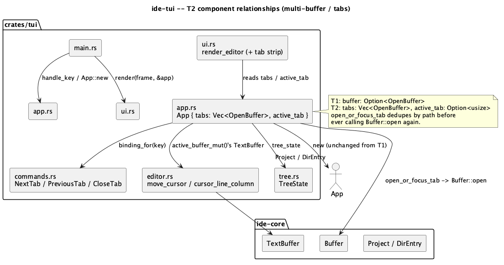
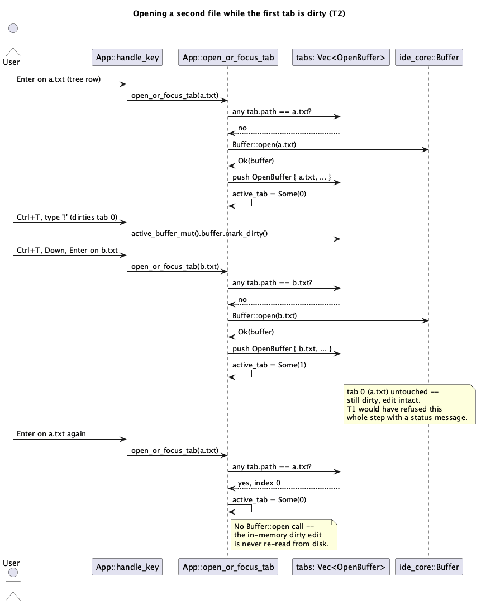

# Multiple open buffers / tabs (T2)

## 1. Purpose

`T1` (`docs/features/tui-shell-and-editor.md`) gave `ide-tui` a single
active buffer: opening a second file while the first had unsaved changes
was blocked outright, forcing a save (or an edit-losing restart) before
the user could even look at another file. `T2` removes that restriction
by letting multiple files stay open at once, each in its own tab with its
own cursor/scroll state, mirroring `ide-ui`'s existing `Tab`/`active_tab`
model (`crates/ui/src/app.rs`) at the scope this frontend actually needs
today — no diagnostics, no per-tab syntax/editorconfig state, none of
which exist in `ide-tui` yet.

Explicitly **out of scope** for `T2` (still deferred to later batches, same
as `T1`'s own list): syntax highlighting, LSP integration (so no
`DidOpen`/`DidClose` notifications — there is no LSP client in this crate
yet), search, git integration, asynchronous directory scanning, any
subprocess/PTY panel, and any confirm-dialog machinery (`CloseTab` on a
dirty buffer is blocked with a status message, the same shape `T1`
already established for switching files with a dirty buffer — not a
prompt-to-save dialog).

## 2. Interface / API

### 2.1 `src/app.rs`

`App`'s single-buffer field is replaced with a tab list:

```rust
pub struct App {
    project_root: PathBuf,
    tree: DirEntry,
    tree_state: TreeState,
    focus: Focus,
    tabs: Vec<OpenBuffer>,
    active_tab: Option<usize>,
    palette: Option<PaletteState>,
    status: Option<String>,
}
```

`OpenBuffer` (`path`, `buffer`, `scroll`, `desired_column`) is unchanged
from `T1` — each tab already carries its own cursor/scroll state simply by
being its own `OpenBuffer` instance in the `Vec`; nothing new is needed to
get "each tab remembers where you left off" for free.

New/changed methods:

```rust
impl App {
    fn active_buffer(&self) -> Option<&OpenBuffer>;
    fn active_buffer_mut(&mut self) -> Option<&mut OpenBuffer>;
    fn open_or_focus_tab(&mut self, path: PathBuf) -> Result<(), ide_core::BufferError>;
    fn close_active_tab(&mut self);
    fn cycle_tab(&mut self, delta: isize);
}
```

- `active_buffer`/`active_buffer_mut` replace every existing
  `self.buffer.as_ref()`/`self.buffer.as_mut()` call site from `T1`
  (`handle_editor_key`, `run_action`'s `SaveActive`/`Undo`/`Redo` arms,
  `ui::render_editor`/`render_status`): `self.active_tab.and_then(|i|
  self.tabs.get(i))` / the `_mut` equivalent.
- `open_or_focus_tab(path)` is what `handle_tree_enter` now calls instead
  of unconditionally calling `Buffer::open`:
  - If `path` already matches an open tab's `OpenBuffer::path`
    (`self.tabs.iter().position(|t| t.path == path)`), set `active_tab` to
    that index and return `Ok(())` — **does not** call `Buffer::open`
    again, since that would re-read the file from disk and silently
    discard any in-memory unsaved edits in the already-open tab. This is
    the one invariant this whole batch exists to protect (§4).
  - Otherwise, `Buffer::open(&path)` as `T1` already did; on `Ok`, push a
    new `OpenBuffer { path, buffer, scroll: 0, desired_column: None }` and
    set `active_tab` to its new index; on `Err`, propagate it (the caller,
    `handle_tree_enter`, maps it to `app.status` exactly as `T1` already
    does for an open failure).
  - There is no dirty check here at all — unlike `T1`'s single-buffer
    `handle_tree_enter`, opening a second file never touches the first
    tab's buffer, so there is nothing to lose.
- `close_active_tab()` is `CloseTab`'s handler: if the active tab's buffer
  `is_dirty()`, set `app.status` to `"unsaved changes in <path> -- save
  first (Ctrl+S)"` (same message `T1`'s file-switch guard used) and return
  without closing anything. Otherwise remove the active tab from `tabs`
  and update `active_tab`: `None` if `tabs` is now empty, otherwise clamp
  to `tabs.len() - 1` if the removed index was the last one, else
  unchanged (removing an earlier-or-equal index never shifts an index
  that was already less than it, and the active index *is* the removed
  index here, so this reduces to "clamp to the new last index if
  necessary" — see §4 for the exact rule, ported from `ide-ui`'s own
  `close_tab_now`).
- `cycle_tab(delta)` is shared by `NextTab` (`delta = 1`) and `PreviousTab`
  (`delta = -1`): no-op if `tabs` is empty; otherwise `active_tab =
  Some((active as isize + delta).rem_euclid(tabs.len() as isize) as
  usize)` — wraps at both ends, ported directly from `ide-ui`'s own
  `cycle_tab` (`crates/ui/src/app.rs:2038`), same rationale ("JetBrains' own
  tab cycling wraps too").

### 2.2 `src/commands.rs`

Three new entries, appended to `T1`'s five-entry table (ids/titles/actions
new; bindings are, per `T1`'s own established rule, the `Ctrl`-translated
form of `ide-ui`'s real chords for the same ids, cross-checked directly
against `crates/ui/src/command.rs`):

| id | title | binding | `ide-ui` source chord |
|---|---|---|---|
| `NextTab` | Next Tab | `Ctrl+Shift+]` | `NextTab`, mac `⌘⇧]` |
| `PreviousTab` | Previous Tab | `Ctrl+Shift+[` | `PreviousTab`, mac `⌘⇧[` |
| `CloseTab` | Close Tab | `Ctrl+W` | `CloseTab`, mac `⌘W` |

`Action` gains three matching variants: `NextTab`, `PreviousTab`,
`CloseTab`. `run_action` dispatches each to `App::cycle_tab(1)`,
`App::cycle_tab(-1)`, `App::close_active_tab()` respectively — same
inline-match-in-`handle_key`/`run_action` shape `T1` already established,
no new dispatch mechanism.

### 2.3 `src/ui.rs`

`render_editor` gains a one-line tab strip drawn above the buffer content,
inside the editor pane's own border (i.e. the pane's `Block` still wraps
both the strip and the text below it — this is not a second bordered
widget). Each tab renders as its filename (via `Path::file_name`, falling
back to the full path the same way the tree pane's row-label already
does) with a trailing `*` if dirty, separated by two spaces; the active
tab is styled `Modifier::REVERSED`, the same convention the tree pane's
selected-row highlight and the palette's selected-entry highlight already
use. The strip is a single `ratatui::widgets::Paragraph` line, not a
`Tabs` widget with per-tab click regions — `T2` has no mouse support (`T1`
never added any either), so nothing needs per-tab hit-testing yet. If
`tabs` is empty, the strip is blank (the "No file open" placeholder text
still renders below it, unchanged from `T1`).

**This reserves one row out of `inner` (`block.inner(area)`, unchanged
from `T1`) for the strip**, splitting it via
`Layout::default().direction(Vertical).constraints([Constraint::Length(1),
Constraint::Min(0)]).split(inner)` into `strip_area`/`text_area` — the
buffer's `Paragraph` (text + `.scroll((buf.scroll, 0))`) renders into
`text_area`, not `inner` directly, and the cursor position `T1` already
computes must move down by exactly the strip's height:
`frame.set_cursor_position((text_area.x + column as u16, text_area.y +
screen_line as u16))` (was `inner.x`/`inner.y` in `T1` — the `+1` row is
now implicit in using `text_area.y` instead of `inner.y`). The existing
`if (screen_line as u16) < inner.height` bounds check becomes `<
text_area.height` for the same reason — on a terminal short enough that
`text_area.height` is `0` (i.e. `inner.height <= 1`, all of it consumed by
the strip), this check already skips drawing a cursor at all, which is
the correct degraded behavior rather than a new case to special-case.
When `tabs` is empty, `text_area` still exists (the split doesn't depend
on `tabs`) and holds the "No file open" placeholder `Paragraph`, unchanged
in content from `T1`, just shifted down one row to sit below the (blank)
strip.

## 3. Behaviour

### 3.1 Opening a file

`Enter` on a file row in the tree pane (`Focus::Tree`, unchanged
trigger) now calls `App::open_or_focus_tab` instead of unconditionally
opening a fresh `Buffer`. Concretely:

- Opening a file that isn't already open: identical to `T1` (`Buffer::open`,
  `app.status` cleared on success, set to the error's `Display` text on
  failure) except the result becomes a **new** tab rather than replacing
  the only one, and `active_tab` moves to it.
- Opening a file that **is** already open (in any tab, dirty or not):
  switches `active_tab` to that tab. No disk read happens, no dialog, no
  status message — this is the common case of "I already have this file
  open, just show it to me," and per §2.1 it is also the mechanism that
  makes opening a second file while the first is dirty safe at all: the
  first tab's `OpenBuffer` is never touched.
- Focus does not auto-switch to `Focus::Editor` on open — same as `T1`;
  `Ctrl+T` still toggles focus manually.

### 3.2 Closing a tab

`Ctrl+W` (`CloseTab`) closes the **active** tab only — there is no
close-a-specific-inactive-tab command in `T2` (no mouse, no per-tab click
target per §2.3). If the active buffer is dirty, closing is refused with
the status message in §2.1 and the tab list is untouched; the user must
`Ctrl+S` first (or switch to a different tab and leave this one dirty
indefinitely — `T2` has no forced-save and no discard-and-close either,
consistent with `T1`'s "no confirm-dialog machinery yet" stance). If there
was no active tab at all (`tabs` empty), `Ctrl+W` is a no-op. Closing the
last remaining tab leaves `focus` exactly as it was (`Focus::Editor` shows
the "No file open" placeholder, same as `T1`'s empty-`buffer` case) —
`T2` does not auto-switch focus to the tree, matching §3.1's "focus never
auto-switches on open" rule applied symmetrically to close.

### 3.3 Cycling tabs

`Ctrl+Shift+]`/`Ctrl+Shift+[` (`NextTab`/`PreviousTab`) move `active_tab`
forward/backward through `tabs`, wrapping at either end. Both are no-ops
when `tabs` has zero or one entries (wrapping a single-element list always
lands back on itself, which is already a correct no-op — no special case
needed in the implementation, just worth stating as an explicit test
case).

### 3.4 Everything else

Editor input (cursor movement, insert, delete, save, undo, redo) behaves
exactly as `T1` specified, just against `active_buffer_mut()` instead of
the old single `buffer` field — no behavioural change to what happens
once a tab is focused, only to how the active one is selected.

## 4. Constraints & invariants

- **An already-open tab is never silently reloaded from disk.**
  `open_or_focus_tab` must check `tabs` for a matching path *before*
  calling `Buffer::open` — reversing that order (open first, then dedupe)
  would momentarily construct a second, discarded `Buffer` for no reason
  at best, and if a caller ever changed to keep the freshly-opened one
  instead of the existing tab, it would silently discard unsaved edits in
  the original tab. This is `T2`'s one load-bearing invariant; the rest of
  the batch is straightforward `Vec` bookkeeping.
- `close_active_tab`'s post-removal index rule, spelled out precisely
  (ported from `ide-ui`'s `close_tab_now`, simplified since `T2` only ever
  closes the *active* index, never an arbitrary one):
  `active_tab` becomes `None` if `tabs` is now empty; otherwise
  `Some(removed_idx.min(tabs.len() - 1))` — i.e. stay at the same index if
  a later tab slid into it, or move back one if the removed tab was the
  last one.
- No `LspRequest::DidOpen`/`DidClose` calls anywhere in this batch — there
  is no `ide-lsp` dependency in `crates/tui` yet (unlike `ide-ui`'s
  `close_tab_now`, which does send `DidClose`). Opening/closing a tab in
  `ide-tui` is pure in-memory/`ide-core` bookkeeping only.
- `render_editor`'s tab strip reads `app`'s state only, same as every
  other `ui.rs` function — no new mutation path.
- Single cursor/selection per tab (unchanged from `T1` — `T2` does not
  introduce cross-tab selections or any shared cursor state).

## 5. Examples

**Two files open, one dirty:**

```
$ ide-tui ~/code/my-project
```

`Down`, `Enter` opens `a.txt` into tab 0 (`active_tab = Some(0)`). `Ctrl+T`
focuses the editor, typing dirties tab 0. `Ctrl+T` back to the tree,
`Down`, `Enter` on `b.txt` — previously (`T1`) this would be refused with
"unsaved changes"; in `T2` it opens `b.txt` as tab 1 and switches to it,
leaving tab 0's edit exactly as it was. `Ctrl+Shift+[` switches back to
tab 0 (still dirty, edit intact); `Ctrl+S` saves it; `Ctrl+W` closes it
(now clean, no refusal); `Ctrl+Shift+[` on the now-single-tab list is a
no-op (wraps back to the same tab).

**Programmatic (test) use**, e.g. `close_active_tab`'s index rule:

```rust
// tabs = [a, b, c], active_tab = Some(1) ("b"), b is clean
app.close_active_tab();
// tabs = [a, c], active_tab = Some(1) ("c" slid into index 1)
```

## 6. Dependencies & integration points

- No new crate dependencies (`ratatui`/`crossterm`/`ide-core` only, same
  as `T1`).
- No `ide-core` API changes — `Buffer::open`/`Buffer::path` (used for the
  already-open-path check) are both pre-existing public API.
- Depends on `T1`'s `commands.rs`/`editor.rs`/`tree.rs`/`ui.rs` shapes
  unchanged except the `App` field replacement described in §2.1 and the
  three new `commands()` entries in §2.2 — `editor.rs`'s `move_cursor`/
  `cursor_line_column`/`offset_for_line_column` are untouched, since they
  already operate on a single `&TextBuffer` reference regardless of how
  many tabs exist around it.
- **Deliberate scope cuts, each with a named follow-up batch** (same
  pattern `T1`'s §6 used):
  - No `DidOpen`/`DidClose` LSP notifications — follows naturally once a
    later batch adds an `ide-lsp` dependency to this crate.
  - No confirm-dialog on `CloseTab` for a dirty buffer — same deferred gap
    as `T1`'s `Exit`, revisited together in whichever later batch adds
    confirm-dialog machinery.
  - No mouse/click-to-switch-tab — `T2`'s tab strip is display-only beyond
    the active-tab highlight; revisit if/when a later batch adds mouse
    support generally (no such batch is currently planned).
- No security-sensitive path per `CLAUDE.md`'s existing list is touched
  (no subprocess spawn, no credential handling, no git-remote code, no new
  file-path source beyond what `T1` already validated through
  `ide_core::Project`/`DirEntry`). No `hacker` pass is expected for this
  role in this batch.

## 7. Diagrams





## Revision notes

First `rev` pass (`changes_needed`) found one implementation-blocking gap,
fixed in place:

- §2.3 originally described the tab strip's rendering without reconciling
  it with `T1`'s existing cursor-position math in `render_editor`, which
  computes `frame.set_cursor_position` directly off `inner` (the pane's
  full content area). Adding a one-row strip without adjusting that math
  would draw the cursor one row too high, overlapping the strip, on any
  buffer whose caret is on the first visible line. Rewrote §2.3 to specify
  the `inner` → `strip_area`/`text_area` split explicitly and the resulting
  `text_area`-relative cursor/bounds-check math.
- §3.2 now states explicitly that closing the last tab leaves `focus`
  unchanged (previously unstated, left implicit).
